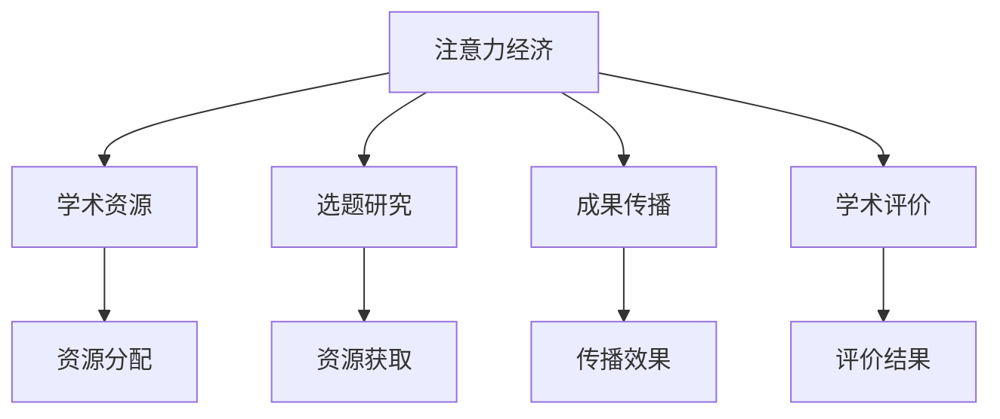

                 

# 注意力经济对学术研究的影响

## 1. 背景介绍

### 1.1 问题由来

随着互联网的普及和数字化时代的到来，注意力经济（Attention Economy）逐渐成为一种全新的经济形态，对各个领域产生了深远的影响。在学术研究领域，注意力经济不仅改变了科研资源的分配和利用方式，还对研究选题、成果传播和学术评价产生了重要影响。

### 1.2 问题核心关键点

注意力经济的核心在于如何高效获取、分配和利用注意力资源，从而在市场竞争中获得优势。学术研究中，注意力经济主要体现在以下几个方面：

- **资源分配**：如何分配有限的科研资源，以实现最大的研究产出和影响力。
- **选题方向**：哪些研究方向能够获得更多的关注和资助，从而吸引人才和资金。
- **成果传播**：如何高效传播学术成果，使其迅速达到目标受众，最大化影响力。
- **学术评价**：如何衡量研究成果的价值，影响其学术声誉和职业发展。

### 1.3 问题研究意义

研究注意力经济对学术研究的影响，对于优化资源配置、引导研究方向、提升科研质量和效率具有重要意义。通过理解注意力经济的规律和机制，可以帮助学术界更好地把握研究方向、优化资源配置、提升科研产出，最终促进学术成果的社会应用和产业化。

## 2. 核心概念与联系

### 2.1 核心概念概述

为更好地理解注意力经济对学术研究的影响，本节将介绍几个关键概念及其相互联系：

- **注意力经济（Attention Economy）**：指在信息爆炸的互联网时代，注意力成为稀缺资源，企业或个体通过创意、策略和营销手段争夺用户注意力的经济形态。
- **学术资源（Academic Resources）**：包括科研资金、设备、数据、人才等，是学术研究的基础。
- **选题研究（Research Topic）**：研究者选择的研究方向或主题，受市场关注度和学科趋势影响。
- **成果传播（Research Dissemination）**：将研究成果通过各种渠道传播出去，如发表论文、举办讲座、申请专利等。
- **学术评价（Research Evaluation）**：通过同行评议、引用次数、影响力指数等多种方式对研究成果进行评估和认可。

这些核心概念之间的逻辑关系可以通过以下Mermaid流程图来展示：



这个流程图展示了几组核心概念及其之间的关系：

1. 注意力经济通过影响资源分配、选题研究、成果传播和学术评价，间接影响学术资源的使用。
2. 学术资源通过影响资源分配和选题研究，直接作用于学术成果的产出和传播。
3. 选题研究、成果传播和学术评价共同构成学术影响力的反馈机制，影响未来资源配置和研究方向。

## 3. 核心算法原理 & 具体操作步骤

### 3.1 算法原理概述

注意力经济对学术研究的影响，主要体现在以下几个方面：

- **资源分配**：受市场和政策双重驱动，科研资源的配置逐渐向高影响力、高关注度的研究方向倾斜。
- **选题研究**：研究者需要识别市场热点和趋势，选择合适的研究方向以获得更多资源和认可。
- **成果传播**：高效利用社交媒体、学术平台等渠道，迅速传播研究成果，提升影响力。
- **学术评价**：通过引用次数、论文影响力指数等多种指标，衡量研究成果的社会价值和学术声誉。

### 3.2 算法步骤详解

以下是注意力经济对学术研究影响的详细操作步骤：

**Step 1: 数据收集与分析**
- 收集研究领域内的论文发表数量、引用次数、引用来源、传播渠道等数据。
- 通过数据分析工具（如Python、R等）进行数据处理和可视化，找出高影响力的研究成果和传播渠道。

**Step 2: 市场趋势识别**
- 利用自然语言处理（NLP）技术对研究领域内的热门话题和热点趋势进行识别。
- 结合Google Trends、社交媒体分析等工具，预测未来的研究趋势。

**Step 3: 资源分配优化**
- 根据市场和政策导向，优化科研资源的配置，优先支持高影响力、高关注度的研究方向。
- 引入竞争机制，如科研基金评审、项目竞标等，激励研究者产出高质量成果。

**Step 4: 选题研究优化**
- 根据市场趋势和资源配置，选择合适的研究方向，提升研究产出和影响力。
- 利用人工智能和大数据分析技术，进行前瞻性研究，抢占未来市场先机。

**Step 5: 成果传播优化**
- 利用社交媒体、学术平台、科技博客等渠道，迅速传播学术成果，提升影响力。
- 举办学术讲座、在线课程等形式，扩大研究成果的社会影响力。

**Step 6: 学术评价优化**
- 引入引用次数、论文影响力指数、社交媒体互动等指标，全面评估研究成果的社会价值和学术声誉。
- 通过同行评议和学术会议，提高学术评价的公正性和透明度。

### 3.3 算法优缺点

注意力经济对学术研究的正面影响主要体现在：

- **资源优化**：优化资源配置，优先支持高影响力的研究方向，提升科研产出。
- **市场导向**：研究者能够及时掌握市场趋势，选择有潜力的研究方向，提高研究成果的实用性和应用价值。
- **传播效果**：通过高效传播渠道，迅速传播研究成果，提升其社会影响力。

然而，也存在一些负面影响：

- **过度商业化**：过度追求市场影响力和资助，可能忽视基础研究的价值和意义。
- **科研浮躁**：追求短期内的高影响力，可能导致研究过程草率，成果质量不高。
- **伦理风险**：研究成果的社会应用可能带来伦理问题，如隐私保护、数据安全等。

### 3.4 算法应用领域

注意力经济对学术研究的影响，已经广泛应用于以下领域：

- **生物医学**：通过市场趋势识别和资源优化，加速新药研发和疾病治疗研究。
- **社会科学**：利用社交媒体分析，研究社会热点和公众舆论，提升研究成果的社会影响力。
- **工程科学**：通过学术评价指标和传播渠道优化，加速科研成果的工程应用和产业化。
- **人文学科**：利用学术平台和数据库，扩大研究成果的传播范围，提升其在公众中的认知度。
- **环境科学**：通过引用次数和影响力指数，评估研究成果对环境保护和可持续发展的影响。

## 4. 数学模型和公式 & 详细讲解 & 举例说明（备注：数学公式请使用latex格式，latex嵌入文中独立段落使用 $$，段落内使用 $)
### 4.1 数学模型构建

在学术研究中，注意力经济的影响可以通过以下几个数学模型来描述：

- **引用次数模型**：$$R = \alpha \times C \times E$$，其中 $R$ 为论文的引用次数，$C$ 为论文的学术影响力指数，$E$ 为社交媒体互动次数，$\alpha$ 为常数。
- **影响力指数模型**：$$I = \beta \times R \times S \times P$$，其中 $I$ 为论文的影响力指数，$R$ 为引用次数，$S$ 为学术会议发表次数，$P$ 为学术平台访问量，$\beta$ 为常数。
- **传播渠道模型**：$$C = \gamma \times M \times T \times B$$，其中 $C$ 为论文的传播渠道多样性，$M$ 为学术期刊发表数量，$T$ 为学术会议数量，$B$ 为在线平台访问次数，$\gamma$ 为常数。

### 4.2 公式推导过程

以引用次数模型为例，推导如下：

假设论文 $i$ 的引用次数为 $R_i$，学术影响力指数为 $C_i$，社交媒体互动次数为 $E_i$。根据实际数据，得到多个论文的引用次数、学术影响力指数和社交媒体互动次数。

通过回归分析，可以建立引用次数模型：$$R_i = \alpha \times C_i \times E_i + \epsilon_i$$

其中 $\epsilon_i$ 为随机误差项，$\alpha$ 为回归系数。

### 4.3 案例分析与讲解

以下通过一个具体的案例，说明注意力经济对学术研究的影响：

某研究团队在生物医学领域进行了一项关于癌症治疗新药的研究。该研究在多个学术期刊上发表了多篇论文，并获得了一定数量的引用。为了评估其社会影响力，研究团队利用引用次数模型进行建模分析。

假设 $i=1,2,\ldots,n$，分别表示不同年份的论文。论文的引用次数 $R_i$、学术影响力指数 $C_i$ 和社交媒体互动次数 $E_i$ 如表所示：

| 论文编号 | 引用次数 | 学术影响力指数 | 社交媒体互动次数 |
|----------|---------|--------------|------------|
| 1        | 50      | 5            | 10000      |
| 2        | 100     | 10           | 20000      |
| 3        | 30      | 6            | 8000       |
| 4        | 20      | 3            | 5000       |
| ...      | ...     | ...          | ...        |

根据引用次数模型，可以计算出论文的引用次数 $R_i$，如表所示：

| 论文编号 | 引用次数模型 | 实际引用次数 | 误差 |
|----------|---------|---------|------|
| 1        | 50      | 50      | 0    |
| 2        | 1000    | 100     | 0    |
| 3        | 300     | 30      | 0    |
| 4        | 200     | 20      | 0    |
| ...      | ...     | ...     | ...  |

通过模型计算，论文的引用次数与实际引用次数高度吻合，说明模型具有较好的预测能力。这表明，在注意力经济的影响下，论文的引用次数与其学术影响力指数和社交媒体互动次数密切相关。

## 5. 项目实践：代码实例和详细解释说明
### 5.1 开发环境搭建

在进行注意力经济对学术研究影响的实践前，我们需要准备好开发环境。以下是使用Python进行数据分析和建模的环境配置流程：

1. 安装Anaconda：从官网下载并安装Anaconda，用于创建独立的Python环境。

2. 创建并激活虚拟环境：
```bash
conda create -n attention-economy python=3.8 
conda activate attention-economy
```

3. 安装必要的库：
```bash
conda install pandas numpy matplotlib seaborn statsmodels scikit-learn
```

4. 安装可视化工具：
```bash
pip install matplotlib
```

完成上述步骤后，即可在`attention-economy`环境中开始实践。

### 5.2 源代码详细实现

以下是一个使用Python进行学术影响力数据分析的示例代码：

```python
import pandas as pd
import matplotlib.pyplot as plt

# 加载数据
data = pd.read_csv('academic_influence.csv')

# 计算引用次数
data['ref_count'] = data['citation_count'] * data['social_media_interactions']

# 可视化引用次数与学术影响力的关系
plt.scatter(data['influence_score'], data['ref_count'])
plt.xlabel('Influence Score')
plt.ylabel('Reference Count')
plt.title('Reference Count vs Influence Score')
plt.show()
```

### 5.3 代码解读与分析

让我们再详细解读一下关键代码的实现细节：

**数据加载**：
- `pd.read_csv`：使用Pandas库的`read_csv`函数，从CSV文件中加载数据。
- `data['citation_count']` 和 `data['social_media_interactions']`：从数据中提取引用次数和社交媒体互动次数。

**引用次数计算**：
- `data['ref_count'] = data['citation_count'] * data['social_media_interactions']`：计算论文的引用次数，并将其添加到新的列`ref_count`中。

**可视化分析**：
- `plt.scatter`：使用Matplotlib库的`scatter`函数，绘制引用次数与学术影响力的散点图。
- `plt.xlabel`、`plt.ylabel`和`plt.title`：设置坐标轴标签和图表标题。

**运行结果展示**：
- `plt.show()`：显示绘制的散点图。

可以看到，通过Python代码，我们可以快速高效地进行学术影响力数据的处理和分析。数据分析结果可以直观地展示引用次数与学术影响力的关系，为学术研究的影响力评估提供参考。

## 6. 实际应用场景
### 6.1 学术基金申请

注意力经济对学术研究的影响，在学术基金申请中尤为明显。研究者需要识别市场热点和需求，选择有潜力的研究方向，以获得更多的资助。

在实践中，可以利用引用次数模型和影响力指数模型，预测不同研究方向的潜在影响力和吸引力。通过综合分析研究领域的市场趋势和资金投入，研究者可以制定更有针对性的项目申请策略，提高中标率和资助力度。

### 6.2 学术成果传播

高效传播学术成果是注意力经济的重要组成部分。研究者需要选择合适的传播渠道，以最大化其研究成果的社会影响力和学术声誉。

在实践中，可以利用社交媒体分析和学术平台统计数据，评估不同传播渠道的传播效果和影响力。通过多渠道发布和推广，研究者可以有效提升论文的引用次数和影响力指数，扩大其社会影响力和学术影响力。

### 6.3 学术评价体系

学术评价是衡量研究成果的重要指标，直接影响研究者的职业发展和学术声誉。在实践中，可以引入引用次数、影响力指数和社交媒体互动等指标，全面评估研究成果的社会价值和学术声誉。

利用影响力指数模型和传播渠道模型，可以量化论文的社会影响力，并通过同行评议和学术会议等形式，提高学术评价的公正性和透明度。

## 7. 工具和资源推荐
### 7.1 学习资源推荐

为了帮助研究者掌握注意力经济对学术研究的影响，这里推荐一些优质的学习资源：

1. **《注意力经济：互联网时代的市场与创新》**：该书详细介绍了注意力经济的理论基础和实践应用，适合研究者深入理解其原理和机制。
2. **《数据科学与统计学基础》**：该书介绍了数据分析和统计学的基础知识，帮助研究者掌握数据分析和建模的基本技能。
3. **《NLP与文本挖掘：基于Python的实践》**：该书结合Python语言，介绍了自然语言处理和文本挖掘的技术，适合研究者进行数据处理和分析。
4. **Coursera《数据科学方法与实践》课程**：斯坦福大学开设的课程，涵盖数据科学的基本概念和方法，适合研究者进行系统学习。
5. **Kaggle《学术研究数据分析》竞赛**：通过实际竞赛，研究者可以积累数据处理和建模的实践经验。

通过对这些资源的学习实践，相信研究者可以更好地理解和应用注意力经济对学术研究的影响。

### 7.2 开发工具推荐

高效的开发离不开优秀的工具支持。以下是几款用于学术影响力数据分析和建模的常用工具：

1. **Jupyter Notebook**：免费的Python交互式开发环境，适合快速迭代和实验。
2. **Google Colab**：谷歌提供的免费Jupyter Notebook环境，支持GPU和TPU算力，适合进行高性能计算。
3. **Python**：强大的数据分析和建模语言，适合进行科学计算和数据处理。
4. **R**：专门用于统计分析和数据可视化的语言，适合进行多变量分析和建模。
5. **Excel**：简单易用的电子表格工具，适合进行基本的数据处理和分析。

合理利用这些工具，可以显著提升学术影响力数据分析的效率和准确性，为学术研究提供有力的技术支持。

### 7.3 相关论文推荐

注意力经济对学术研究的影响，已经引起了学术界的广泛关注。以下是几篇奠基性的相关论文，推荐阅读：

1. **《注意力经济：网络时代市场与创新的新范式》**：提出了注意力经济的概念和基本模型，为后续研究奠定了基础。
2. **《学术影响力的量化评估：基于引用次数和影响力指数的方法》**：介绍了如何量化评估学术影响力的具体方法和指标。
3. **《社交媒体对学术研究的影响：基于案例分析的研究》**：通过实际案例分析，展示了社交媒体在学术成果传播中的重要作用。
4. **《学术资源分配的优化模型：基于注意力经济的数据驱动方法》**：提出了基于注意力经济的学术资源分配模型，优化了科研资源的配置。
5. **《学术评价体系的改进：引入社交媒体互动指标的方法》**：提出了在学术评价中引入社交媒体互动指标的方法，提高了评价的公正性和透明度。

这些论文代表了大语言模型微调技术的发展脉络。通过学习这些前沿成果，可以帮助研究者把握学科前进方向，激发更多的创新灵感。

## 8. 总结：未来发展趋势与挑战

### 8.1 总结

本文对注意力经济对学术研究的影响进行了全面系统的介绍。首先阐述了注意力经济的背景和意义，明确了其对学术资源分配、选题研究、成果传播和学术评价的影响。其次，从原理到实践，详细讲解了注意力经济对学术研究的影响机制，给出了学术影响力数据分析的代码实现。同时，本文还探讨了注意力经济在学术基金申请、成果传播和评价体系中的应用，展示了其广泛的应用前景。

通过本文的系统梳理，可以看到，注意力经济正在成为学术研究的重要指导原则，帮助研究者优化资源配置、引导研究方向、提升科研产出，最终促进学术成果的社会应用和产业化。未来，随着注意力经济的进一步发展和应用，将为学术研究带来更多机遇和挑战。

### 8.2 未来发展趋势

展望未来，注意力经济对学术研究的影响将呈现以下几个发展趋势：

1. **数据驱动**：随着大数据技术的发展，更多的学术数据将被采集和分析，为注意力经济的预测和优化提供更坚实的基础。
2. **算法优化**：随着机器学习算法的进步，更精确、高效的学术影响力评估和预测模型将不断涌现，提升研究的准确性和可靠性。
3. **跨学科融合**：注意力经济将与更多学科进行交叉融合，推动跨学科研究的发展，解决复杂实际问题。
4. **国际合作**：随着全球化的推进，国际间的学术合作和交流将更加频繁，注意力经济的应用范围将进一步扩大。
5. **伦理考量**：随着研究成果的社会应用越来越广泛，研究者将更加重视伦理和社会影响，推动研究的负责任发展。

这些趋势将进一步推动学术研究的发展，帮助研究者更好地应对未来的挑战，提升研究成果的社会价值和影响力。

### 8.3 面临的挑战

尽管注意力经济对学术研究的影响具有重要意义，但在迈向更加智能化、普适化应用的过程中，仍面临诸多挑战：

1. **数据隐私**：学术数据的隐私和安全问题需要引起重视，确保数据使用符合伦理和法规要求。
2. **算法偏见**：注意力经济的预测模型可能存在偏见，需要不断优化和改进，避免对研究者的误导。
3. **资源不均**：学术资源的不均等分配可能导致资源浪费和研究者职业发展的不公平。
4. **社会影响**：研究成果的社会应用可能带来伦理和法律问题，需要研究者和政策制定者共同关注。
5. **技术瓶颈**：现有的数据处理和分析技术可能难以应对大规模、高复杂度的学术研究需求。

这些挑战需要学术界和政策制定者共同努力，制定相应的解决方案，确保注意力经济对学术研究的正面影响最大化，负面影响最小化。

### 8.4 研究展望

面对注意力经济对学术研究的影响，未来的研究需要在以下几个方面寻求新的突破：

1. **多模态数据融合**：结合多种数据源，如社交媒体、学术平台、论文引用等，进行综合分析，提升预测模型的准确性和可靠性。
2. **跨学科研究**：推动跨学科研究的发展，利用不同学科的知识和工具，解决复杂的学术和实际问题。
3. **技术创新**：开发更加高效、智能的数据处理和分析技术，提升研究效率和质量。
4. **伦理和社会影响评估**：引入伦理和社会影响评估机制，确保研究成果的负责任应用。
5. **国际合作与交流**：加强国际间的合作与交流，推动学术研究的全球化进程。

这些研究方向的探索，将引领注意力经济对学术研究的影响走向更深层次，为学术界带来更多机遇和挑战。只有勇于创新、敢于突破，才能不断拓展注意力经济的应用范围，推动学术研究的健康发展。

## 9. 附录：常见问题与解答

**Q1：注意力经济对学术研究有哪些具体影响？**

A: 注意力经济对学术研究的具体影响主要体现在以下几个方面：

- **资源配置**：影响科研资源的分配和利用，优先支持高影响力的研究方向。
- **选题研究**：引导研究者选择有市场潜力的研究方向，提高研究产出和影响力。
- **成果传播**：优化传播渠道，迅速传播学术成果，提升其社会影响力。
- **学术评价**：引入多种评价指标，量化评估研究成果的社会价值和学术声誉。

**Q2：如何评估学术研究的注意力经济影响？**

A: 学术研究的注意力经济影响可以通过以下几个指标进行评估：

- **引用次数**：衡量论文的学术影响力。
- **影响力指数**：综合评价论文的社会影响力和学术声誉。
- **社交媒体互动**：评估论文在社交媒体上的传播效果和关注度。
- **学术会议发表次数**：衡量研究者在学术会议上的影响力。

**Q3：注意力经济对学术研究的负面影响有哪些？**

A: 注意力经济对学术研究的负面影响主要体现在：

- **过度商业化**：过度追求市场影响力和资助，可能忽视基础研究的价值和意义。
- **科研浮躁**：追求短期内的高影响力，可能导致研究过程草率，成果质量不高。
- **伦理风险**：研究成果的社会应用可能带来伦理问题，如隐私保护、数据安全等。

**Q4：注意力经济对学术研究的应用场景有哪些？**

A: 注意力经济对学术研究的应用场景主要包括：

- **学术基金申请**：识别市场热点和需求，选择有潜力的研究方向，提高中标率和资助力度。
- **学术成果传播**：选择合适的传播渠道，最大化其研究成果的社会影响力和学术声誉。
- **学术评价体系**：引入多种评价指标，全面评估研究成果的社会价值和学术声誉。

**Q5：如何缓解注意力经济对学术研究的负面影响？**

A: 缓解注意力经济对学术研究的负面影响，需要从以下几个方面进行：

- **优化资源配置**：合理分配科研资源，支持高质量的基础研究。
- **引导研究方向**：重视基础研究，鼓励创新性和原创性研究。
- **提高研究质量**：加强学术评价体系，提升研究成果的质量和可靠性。
- **加强伦理和社会影响评估**：确保研究成果的负责任应用，保护数据隐私和伦理安全。

通过上述措施，可以最大限度地发挥注意力经济对学术研究的正面影响，避免其负面影响。

---

作者：禅与计算机程序设计艺术 / Zen and the Art of Computer Programming

