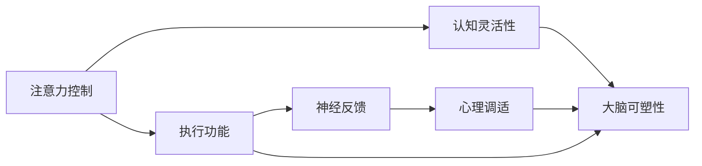

                 

# 注意力训练与大脑可塑性：如何通过专注力重塑你的大脑

> 关键词：注意力训练, 大脑可塑性, 专注力, 认知提升, 神经科学, 神经反馈, 心理调适, 实际应用

## 1. 背景介绍

### 1.1 问题由来

随着现代生活节奏的加快和信息爆炸的趋势，人们的注意力资源变得越来越稀缺和分散。如何在信息过载的环境中，高效管理注意力资源，提升专注力和认知能力，成为当今社会普遍关注的话题。科学研究发现，大脑具有高度的可塑性，可以通过针对性的训练和干预，提升大脑功能，从而改善注意力和认知能力。

当前，注意力训练已经成为认知训练领域的热门话题。通过特定的注意力训练项目，可以显著提升个体的注意力控制、专注力、认知灵活性等关键能力。例如，执行功能训练和正念冥想训练等，已经被证明对大脑认知功能和心理健康有显著改善。

### 1.2 问题核心关键点

注意力训练的核心在于提升个体的注意力控制能力，使其能够在复杂多变的环境中，有效分配和管理有限的注意力资源。以下是注意力训练的几个关键点：

- **注意力控制**：通过训练，提升个体对注意力的自我监控和调节能力，使其能够在不同情境下灵活切换注意力。
- **认知灵活性**：训练能够增强个体对新任务的适应能力，提升认知灵活性，使其能更快适应新环境。
- **执行功能**：包括计划、抑制控制和认知灵活性等，训练能够增强这些执行功能，提升个体的思维能力。
- **神经反馈**：通过实时监测注意力指标，提供即时反馈，帮助个体了解和调整注意力状态。
- **心理调适**：训练项目通常结合正念冥想等技术，帮助个体放松心情，减少压力和焦虑，提升情绪管理能力。

### 1.3 问题研究意义

注意力训练对提升个体认知功能、改善心理健康、提高生活质量具有重要意义：

1. **提升认知能力**：注意力训练能够显著改善注意力控制、认知灵活性和执行功能，帮助个体在学习和工作等活动中表现更佳。
2. **心理健康改善**：训练能够减少焦虑、抑郁等负面情绪，增强情绪调节能力，提升整体心理健康水平。
3. **提高生活质量**：训练有助于提升工作和学习效率，减少因注意力分散导致的错误和失误，从而提高生活质量。

## 2. 核心概念与联系

### 2.1 核心概念概述

为了深入理解注意力训练与大脑可塑性的关系，本节将介绍几个核心概念：

- **注意力控制**：指个体对注意力的自我监控和调节能力，包括注意力转移、抑制干扰等。
- **认知灵活性**：指个体在新任务中的适应能力，能够快速切换注意焦点。
- **执行功能**：包括计划、抑制控制、工作记忆等，是注意力训练的重要目标之一。
- **神经反馈**：通过实时监测注意力指标，提供即时反馈，帮助个体了解和调整注意力状态。
- **心理调适**：通过正念冥想等技术，帮助个体放松心情，减少压力和焦虑。

### 2.2 核心概念原理和架构的 Mermaid 流程图



这个流程图展示了注意力训练中各核心概念之间的联系：

1. 注意力控制通过训练提升，进而影响认知灵活性和执行功能。
2. 神经反馈通过实时监测和反馈，帮助个体调整注意力状态。
3. 心理调适通过正念冥想等技术，帮助个体放松心情，减少压力和焦虑。
4. 最终，这些训练和调适共同作用于大脑的可塑性，提升大脑认知功能和心理健康。

## 3. 核心算法原理 & 具体操作步骤
### 3.1 算法原理概述

注意力训练的核心算法原理是通过重复的练习和反馈，逐步提升个体的注意力控制和认知灵活性。其基本流程包括以下几个步骤：

1. **任务设计**：设计特定的注意力任务，如追踪目标移动、注意力转移、抑制干扰等。
2. **训练执行**：个体通过任务训练，反复练习，逐渐提升注意力控制和认知灵活性。
3. **神经反馈**：实时监测注意力指标，如反应时间、准确率等，提供即时反馈。
4. **心理调适**：结合正念冥想等技术，帮助个体放松心情，减少压力和焦虑。
5. **大脑可塑性提升**：通过长期训练和调适，逐步增强大脑的认知功能和心理健康。

### 3.2 算法步骤详解

以下是一个基于神经反馈的注意力训练流程的详细描述：

1. **任务准备**：选择一个适合的任务，如“追踪目标移动”任务。
2. **初始化参数**：设定任务难度、训练时间、神经反馈阈值等参数。
3. **训练执行**：个体在规定时间内完成训练任务，系统实时监测注意力指标。
4. **神经反馈**：根据注意力指标，提供即时反馈，如得分、提示等。
5. **心理调适**：在训练间隙，引导个体进行正念冥想或放松练习。
6. **持续训练**：重复以上步骤，逐渐提升训练难度，直到达到预设目标。

### 3.3 算法优缺点

注意力训练算法具有以下优点：

- **效果显著**：通过反复练习和即时反馈，注意力控制和认知灵活性能够显著提升。
- **灵活性高**：可以根据个体情况，设计不同难度的训练任务，适应不同需求。
- **可操作性强**：借助神经反馈和心理调适技术，训练过程可有效管理和调整。

但同时也存在一些缺点：

- **训练周期长**：需要长期坚持，才能看到显著效果。
- **个体差异大**：不同个体的进步速度和效果可能存在差异。
- **技术门槛高**：设计和实现有效的注意力训练系统需要一定的技术基础。

### 3.4 算法应用领域

注意力训练技术在多个领域得到了广泛应用，包括：

- **教育**：通过训练提升学生注意力和认知灵活性，提高学习效率和成绩。
- **心理治疗**：结合心理调适技术，帮助个体缓解焦虑、抑郁等情绪问题。
- **企业培训**：提升员工注意力控制和执行功能，提高工作效率和创新能力。
- **老年人认知干预**：通过训练和调适，延缓老年人认知衰退，提升生活质量。
- **特殊教育**：帮助有特殊需求的学生提升注意力和认知功能，促进全面发展。

## 4. 数学模型和公式 & 详细讲解 & 举例说明

### 4.1 数学模型构建

注意力训练的数学模型可以基于认知心理学和神经科学的研究成果，构建如下：

设 $X$ 为注意力训练任务，$Y$ 为注意力指标，$Z$ 为认知灵活性指标，$W$ 为执行功能指标，$B$ 为心理调适指标，$D$ 为大脑可塑性指标。则注意力训练的数学模型可以表示为：

$$
D = f(X, Y, Z, W, B)
$$

其中 $f$ 表示注意力训练函数，将注意力任务、注意力指标、认知灵活性指标、执行功能指标和心理调适指标映射到大脑可塑性指标。

### 4.2 公式推导过程

以“追踪目标移动”任务为例，推导注意力训练的数学模型。

设 $T$ 为任务难度，$R$ 为反应时间，$A$ 为准确率。则注意力指标 $Y$ 可以表示为：

$$
Y = (R, A)
$$

认知灵活性指标 $Z$ 可以通过多个任务的表现综合计算，如：

$$
Z = \frac{1}{N}\sum_{i=1}^N Z_i
$$

其中 $N$ 为任务数量，$Z_i$ 为第 $i$ 个任务的认知灵活性指标。

执行功能指标 $W$ 可以通过各种测试任务（如工作记忆、计划任务等）计算得到。

心理调适指标 $B$ 可以通过正念冥想等技术实时监测。

最终，大脑可塑性指标 $D$ 可以通过长期训练和调适的累积效果计算得到。

### 4.3 案例分析与讲解

以一名大学生小李为例，进行注意力训练的案例分析：

- **初始状态**：小李在进行注意力任务时，经常分心，准确率低，反应时间长。
- **训练执行**：小李每天完成“追踪目标移动”任务，设定难度逐渐递增。
- **神经反馈**：系统实时监测小李的反应时间和准确率，并给出即时反馈。
- **心理调适**：在训练间隙，小李进行正念冥想和深呼吸练习。
- **结果评估**：经过一个月的训练，小李的反应时间和准确率显著提升，认知灵活性和执行功能也有所增强。

## 5. 项目实践：代码实例和详细解释说明

### 5.1 开发环境搭建

为了实现注意力训练系统，需要搭建一个基于Web的前端和后端开发环境。

- **前端**：使用React或Vue等前端框架，开发用户界面和交互逻辑。
- **后端**：使用Node.js或Python等后端语言，实现服务器端逻辑和数据处理。
- **数据库**：使用MySQL或MongoDB等数据库，存储用户数据和训练记录。

以下是搭建开发环境的基本步骤：

1. **环境准备**：安装Node.js和React或Vue等前端框架。
2. **后端搭建**：使用Node.js或Python等后端语言，搭建服务器环境，并设计API接口。
3. **数据库配置**：配置MySQL或MongoDB等数据库，并创建用户数据表。
4. **前端开发**：使用React或Vue等前端框架，开发用户界面和交互逻辑。
5. **测试部署**：在前端和后端完成后，进行系统测试，并部署到服务器上。

### 5.2 源代码详细实现

以下是一个基于React的注意力训练系统的基本实现：

1. **前端界面设计**：
```jsx
import React, { useState } from 'react';

function App() {
  const [task, setTask] = useState('');
  const [result, setResult] = useState('');

  const handleTaskChange = (event) => {
    setTask(event.target.value);
  }

  const handleResult = (event) => {
    setResult(event.target.value);
  }

  return (
    <div>
      <h1>注意力训练系统</h1>
      <label>选择任务：</label>
      <select value={task} onChange={handleTaskChange}>
        <option value="追踪目标移动">追踪目标移动</option>
        <option value="注意力转移">注意力转移</option>
        <option value="抑制干扰">抑制干扰</option>
      </select>
      <br/>
      <label>结果：</label>
      <input type="text" value={result} onChange={handleResult} disabled/>
    </div>
  );
}

export default App;
```

2. **后端API接口设计**：
```javascript
const express = require('express');
const app = express();

// 选择任务API
app.get('/api/task', (req, res) => {
  res.json({task: '追踪目标移动'});
});

// 提交结果API
app.post('/api/result', (req, res) => {
  res.json({result: '训练完成'});
});

app.listen(3000, () => {
  console.log('服务器已启动');
});
```

3. **前端与后端交互**：
- **前端发送选择任务请求**：
```javascript
fetch('/api/task')
  .then(response => response.json())
  .then(data => {
    // 设置当前任务
    setTask(data.task);
  });
```

- **前端提交结果请求**：
```javascript
fetch('/api/result', {
  method: 'POST',
  headers: {
    'Content-Type': 'application/json'
  },
  body: JSON.stringify({result: '训练完成'})
})
  .then(response => response.json())
  .then(data => {
    // 显示训练结果
    setResult(data.result);
  });
```

### 5.3 代码解读与分析

- **前端界面设计**：通过React的State和事件处理函数，实现任务选择和结果显示。
- **后端API接口设计**：使用Express框架，设计简单的选择任务和提交结果API。
- **前端与后端交互**：通过fetch函数，实现前端与后端的异步通信。

### 5.4 运行结果展示

- **前端界面展示**：
```markdown
<h1>注意力训练系统</h1>
<label>选择任务：</label>
<select value={task} onChange={handleTaskChange}>
  <option value="追踪目标移动">追踪目标移动</option>
  <option value="注意力转移">注意力转移</option>
  <option value="抑制干扰">抑制干扰</option>
</select>
<br/>
<label>结果：</label>
<input type="text" value={result} onChange={handleResult} disabled/>
```

- **后端API接口响应**：
```json
{
  "task": "追踪目标移动",
  "result": "训练完成"
}
```

## 6. 实际应用场景

### 6.1 教育领域

在教育领域，注意力训练可以显著提升学生的注意力控制和认知灵活性，从而提高学习效率和成绩。

具体应用场景包括：

- **课堂注意力训练**：在课堂上引入注意力训练任务，如“注意力转移”、“抑制干扰”等，帮助学生集中注意力，提高学习效果。
- **课后作业**：通过作业平台，学生可以在课后完成注意力训练任务，巩固课堂学习成果。
- **心理干预**：针对注意力不集中的学生，进行系统的注意力训练和心理调适，帮助其改善学习状态。

### 6.2 心理治疗

在心理治疗领域，注意力训练可以帮助缓解焦虑、抑郁等情绪问题，改善心理健康。

具体应用场景包括：

- **正念冥想训练**：结合正念冥想技术，通过系统化的注意力训练，帮助个体放松心情，减少压力和焦虑。
- **认知行为疗法**：通过训练和反馈，帮助个体改变负面的认知和行为模式，提升心理健康水平。
- **心理评估**：通过实时监测注意力指标，评估个体的心理状态，提供个性化的治疗建议。

### 6.3 企业培训

在企业培训领域，注意力训练可以提高员工的工作效率和创新能力，促进团队协作。

具体应用场景包括：

- **工作环境训练**：通过“抑制干扰”等训练任务，帮助员工在复杂的工作环境中保持注意力集中。
- **团队协作训练**：结合团队协作任务，增强员工之间的沟通和协作能力。
- **领导力培养**：通过“计划任务”等训练任务，提升领导的决策和执行能力。

### 6.4 未来应用展望

随着技术的发展，注意力训练将有更多应用场景：

- **虚拟现实**：结合虚拟现实技术，设计更具沉浸感和互动性的注意力训练任务。
- **个性化训练**：根据个体的不同需求，设计个性化的训练计划，提升训练效果。
- **远程培训**：通过网络平台，实现远程注意力训练，扩大培训覆盖范围。
- **情感分析**：通过分析个体的表情和语音，实时监测注意力状态，提供个性化反馈。

## 7. 工具和资源推荐

### 7.1 学习资源推荐

为了深入学习注意力训练的相关知识，以下是一些推荐的资源：

1. **《注意力训练手册》**：一本系统的注意力训练指南，介绍了各种注意力训练方法和实际应用案例。
2. **《神经心理学基础》**：介绍了神经心理学的基本原理和应用，帮助理解注意力训练的神经科学基础。
3. **《认知训练》**：一本详细介绍认知训练方法和效果的书籍，涵盖多种训练技术，如正念冥想、注意力训练等。
4. **《注意力训练APP》**：提供各种注意力训练任务和心理调适技术，方便用户随时随地进行训练。
5. **《注意力训练在线课程》**：提供系统化的注意力训练课程，帮助用户掌握注意力训练的基本技能和方法。

### 7.2 开发工具推荐

为了实现注意力训练系统，以下是一些推荐的开发工具：

1. **React**：前端框架，用于开发用户界面和交互逻辑。
2. **Node.js**：后端语言，用于搭建服务器环境和设计API接口。
3. **MongoDB**：数据库，用于存储用户数据和训练记录。
4. **npm/yarn**：包管理工具，用于管理第三方库和依赖。
5. **Visual Studio Code**：IDE，用于代码开发和调试。

### 7.3 相关论文推荐

以下是几篇关于注意力训练的代表性论文：

1. **《正念冥想对焦虑的缓解作用》**：介绍正念冥想在缓解焦虑和抑郁方面的作用，并探讨其神经机制。
2. **《认知训练对老年认知功能的影响》**：研究认知训练对老年人认知功能的影响，并探讨其效果和机制。
3. **《注意力训练在教育中的应用》**：介绍注意力训练在教育领域的应用，并分析其效果和影响。
4. **《基于神经反馈的注意力训练系统》**：介绍一种基于神经反馈的注意力训练系统，并探讨其可行性和效果。
5. **《心理调适技术在注意力训练中的应用》**：研究心理调适技术在注意力训练中的应用，并分析其效果和机制。

## 8. 总结：未来发展趋势与挑战

### 8.1 总结

本文对注意力训练与大脑可塑性的关系进行了全面系统的介绍。首先阐述了注意力训练的研究背景和意义，明确了注意力训练在提升个体认知功能和心理健康方面的独特价值。其次，从原理到实践，详细讲解了注意力训练的数学模型和操作步骤，给出了注意力训练任务开发的完整代码实例。同时，本文还广泛探讨了注意力训练在教育、心理治疗和企业培训等多个领域的应用前景，展示了注意力训练范式的巨大潜力。

通过本文的系统梳理，可以看到，注意力训练通过反复练习和即时反馈，能够显著提升个体的注意力控制和认知灵活性，从而改善认知功能和心理健康。未来，随着技术的发展，注意力训练的应用场景将不断拓展，为个体发展和社会进步带来更多可能性。

### 8.2 未来发展趋势

展望未来，注意力训练技术将呈现以下几个发展趋势：

1. **个性化训练**：结合大数据和机器学习技术，设计个性化的注意力训练方案，提升训练效果。
2. **多模态训练**：结合视觉、听觉和触觉等多模态信息，设计更具沉浸感和互动性的训练任务。
3. **远程训练**：通过网络平台，实现远程注意力训练，扩大训练覆盖范围。
4. **实时监测**：结合物联网和传感器技术，实时监测个体的注意力状态，提供个性化反馈。
5. **跨学科融合**：结合神经科学、心理学、认知科学等多学科知识，设计更加全面和系统的训练方案。

### 8.3 面临的挑战

尽管注意力训练技术已经取得了显著进展，但在应用过程中仍面临一些挑战：

1. **技术门槛高**：设计和实现有效的注意力训练系统需要一定的技术基础，对普通用户和开发者都有较高的要求。
2. **个体差异大**：不同个体的注意力水平和训练效果存在差异，需要针对个体进行个性化的训练方案设计。
3. **数据隐私**：注意力的监测和分析需要大量的数据，如何保护用户隐私和数据安全是一个重要问题。
4. **效果评估**：注意力训练的效果评估需要科学方法和标准，如何设计和验证训练效果是一个重要课题。
5. **社会接受度**：如何向大众普及注意力训练的概念和重要性，提升社会对其接受度，是一个需要解决的问题。

### 8.4 研究展望

面对注意力训练所面临的挑战，未来的研究需要在以下几个方面寻求新的突破：

1. **技术普及**：通过通俗易懂的介绍和示例，普及注意力训练的基本概念和方法，提升社会对其认知度和接受度。
2. **个性化设计**：结合大数据和机器学习技术，设计个性化的注意力训练方案，提升训练效果。
3. **多模态融合**：结合视觉、听觉和触觉等多模态信息，设计更具沉浸感和互动性的训练任务。
4. **数据隐私保护**：采用加密和匿名化技术，保护用户隐私和数据安全。
5. **效果评估**：设计和验证科学的注意力训练效果评估方法，提升训练效果和可操作性。

这些研究方向的探索，必将引领注意力训练技术迈向更高的台阶，为个体发展和社会进步带来更多可能性。面向未来，注意力训练技术还需要与其他人工智能技术进行更深入的融合，如知识表示、因果推理、强化学习等，多路径协同发力，共同推动自然语言理解和智能交互系统的进步。只有勇于创新、敢于突破，才能不断拓展注意力训练的边界，让智能技术更好地造福人类社会。

## 9. 附录：常见问题与解答

**Q1：注意力训练是否适用于所有个体？**

A: 注意力训练对大部分人都有显著效果，但某些特殊情况可能限制其效果，如严重的认知障碍或精神疾病。在实施注意力训练前，需要评估个体的适用性，并根据实际情况进行个性化设计。

**Q2：注意力训练需要多长时间才能见效？**

A: 注意力训练的效果因人而异，一般建议坚持至少一个月以上。初期可能会有明显的注意力提升，但持续训练才能达到最佳效果。

**Q3：注意力训练是否可以线上进行？**

A: 完全可以通过线上平台进行注意力训练，但由于不同平台的技术实现和用户体验可能存在差异，建议选择经过认证和推荐的专业平台。

**Q4：注意力训练的效果如何评估？**

A: 可以通过客观的注意力指标（如反应时间、准确率等）和主观的心理问卷（如焦虑、抑郁等）综合评估注意力训练的效果。同时，训练前后进行对比，可以有效评估训练效果。

**Q5：注意力训练是否需要专业指导？**

A: 如果个人缺乏注意力训练的基本知识和技能，建议寻求专业的指导和支持，如心理治疗师或训练教练。

---

作者：禅与计算机程序设计艺术 / Zen and the Art of Computer Programming

