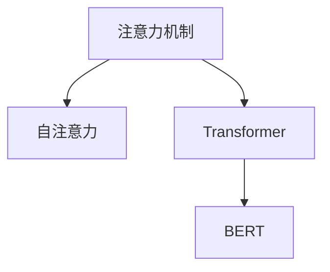

                 

## 1. 背景介绍

### 1.1 问题由来

在现代社会，信息过载已经成为一种普遍现象，人们每天面对的信息量呈爆炸式增长。如何在海量信息中快速找到有用的信息，并高效处理这些信息，是当代人们面临的一个重要挑战。这一挑战不仅存在于我们的工作和学习中，也体现在日常生活决策的方方面面。

### 1.2 问题核心关键点

为了应对信息过载，注意力机制在人工智能和机器学习领域得到了广泛应用。注意力机制帮助模型选择性地关注输入数据中的重要部分，从而提高模型的处理效率和效果。

注意力机制的核心理念是“注意力就是权重”，即模型根据输入数据的不同部分赋予不同的权重，决定哪些部分更重要，哪些部分可以被忽略。这一机制在许多任务中，如自然语言处理、计算机视觉、推荐系统等，都发挥了关键作用。

## 2. 核心概念与联系

### 2.1 核心概念概述

为了更好地理解注意力机制的原理和应用，本节将介绍几个密切相关的核心概念：

- **注意力机制(Attention Mechanism)**：通过计算输入数据的注意力权重，选择性地关注输入数据的不同部分。注意力机制在NLP、计算机视觉等领域得到了广泛应用。
- **自注意力(Self-Attention)**：一种特殊的注意力机制，用于计算输入序列中每个元素与其他元素之间的关系，常用于模型内部特征的交互。
- **Transformer**：基于自注意力机制的神经网络模型，广泛应用于机器翻译、文本生成、图像处理等任务。
- **BERT**：一种预训练语言模型，通过Transformer架构和自注意力机制，在许多NLP任务中取得了最先进的性能。

这些核心概念之间的逻辑关系可以通过以下Mermaid流程图来展示：



这个流程图展示了几者之间的关系：

1. 注意力机制通过计算权重选择输入数据的不同部分。
2. 自注意力是一种特殊的注意力机制，用于模型内部特征的交互。
3. Transformer模型以自注意力为核心的组件，广泛应用于多种任务。
4. BERT模型通过Transformer架构和自注意力机制，在NLP任务中取得了最先进的效果。

这些概念共同构成了现代人工智能中的重要部分，使模型能够更好地理解和处理复杂数据。

## 3. 核心算法原理 & 具体操作步骤
### 3.1 算法原理概述

注意力机制的核心理念是“注意力就是权重”，即模型根据输入数据的不同部分赋予不同的权重，决定哪些部分更重要，哪些部分可以被忽略。其基本思想是，对于输入序列中的每个元素，计算它与所有其他元素之间的相似度，然后根据这些相似度计算每个元素的权重。

具体来说，注意力机制分为以下几个步骤：

1. **编码表示**：将输入序列中的每个元素进行编码，得到其向量表示。
2. **相似度计算**：计算输入序列中每个元素与其他元素之间的相似度，通常使用点积、余弦相似度等方法。
3. **权重计算**：根据相似度计算每个元素的权重。
4. **加权求和**：对输入序列中的每个元素进行加权求和，得到注意力向量。
5. **输出计算**：将注意力向量与原始编码表示结合，输出最终的特征表示。

通过上述步骤，注意力机制可以动态地调整输入序列中的每个元素的权重，从而更好地关注重要信息，忽略无关信息。

### 3.2 算法步骤详解

接下来，我们将以Transformer模型为例，详细讲解自注意力机制的具体步骤。

#### 3.2.1 编码表示

在Transformer中，将输入序列中的每个元素进行编码，得到其向量表示。具体来说，将输入序列中的每个词向量进行线性变换和残差连接，得到初步的表示：

$$
\tilde{x}_i = W^{(1)} x_i + b^{(1)}
$$

其中，$x_i$ 是第 $i$ 个词向量，$W^{(1)}$ 是线性变换矩阵，$b^{(1)}$ 是偏置项。

#### 3.2.2 相似度计算

在Transformer中，使用点积计算输入序列中每个元素与其他元素之间的相似度：

$$
s_i = x_i \cdot x_j
$$

其中，$s_i$ 是第 $i$ 个元素与其他元素之间的相似度，$x_i$ 是第 $i$ 个元素的向量表示，$x_j$ 是第 $j$ 个元素的向量表示。

#### 3.2.3 权重计算

在Transformer中，使用softmax函数计算每个元素的权重：

$$
a_{i,j} = \frac{e^{s_i / \sqrt{d}}}{\sum_k e^{s_k / \sqrt{d}}}
$$

其中，$a_{i,j}$ 是第 $i$ 个元素对第 $j$ 个元素的权重，$d$ 是向量表示的维度。softmax函数将相似度 $s_i$ 转换为权重 $a_{i,j}$。

#### 3.2.4 加权求和

在Transformer中，对输入序列中的每个元素进行加权求和，得到注意力向量：

$$
v_i = \sum_j a_{i,j} x_j
$$

其中，$v_i$ 是第 $i$ 个元素的注意力向量，$a_{i,j}$ 是第 $i$ 个元素对第 $j$ 个元素的权重，$x_j$ 是第 $j$ 个元素的向量表示。

#### 3.2.5 输出计算

在Transformer中，将注意力向量与原始编码表示结合，输出最终的特征表示：

$$
x_i = \text{FFN}(v_i) + \text{LayerNorm}(x_i)
$$

其中，$\text{FFN}$ 是全连接层（Feed-Forward Network），$\text{LayerNorm}$ 是归一化层（Layer Normalization）。

通过上述步骤，Transformer模型能够动态地调整输入序列中的每个元素的权重，从而更好地关注重要信息，忽略无关信息。

### 3.3 算法优缺点

注意力机制具有以下优点：

1. 能动态调整输入序列中每个元素的权重，关注重要信息，忽略无关信息。
2. 能够很好地处理长序列，具有较好的序列建模能力。
3. 在多任务处理中，能够同时考虑多个输入，提高模型的泛化能力。

同时，注意力机制也存在一些缺点：

1. 计算复杂度较高，特别是在处理长序列时，计算量会呈指数级增长。
2. 对序列中的噪音敏感，噪音会影响注意力机制的计算结果。
3. 模型复杂度较高，需要更多的计算资源。

尽管存在这些缺点，但注意力机制在许多任务中仍然发挥了重要作用，是现代深度学习模型中不可或缺的一部分。

### 3.4 算法应用领域

注意力机制已经在许多领域得到了广泛应用，以下是几个典型的应用场景：

1. 自然语言处理：在机器翻译、文本生成、问答系统等任务中，注意力机制可以更好地关注上下文信息，提高模型的理解能力。
2. 计算机视觉：在图像分类、目标检测、图像生成等任务中，注意力机制可以更好地关注图像中的关键区域，提高模型的识别能力。
3. 推荐系统：在个性化推荐、广告推荐等任务中，注意力机制可以更好地关注用户的历史行为和偏好，提高推荐效果。

除了上述这些经典任务外，注意力机制还被创新性地应用到更多场景中，如可控文本生成、多模态信息融合、协同过滤等，为机器学习技术带来了新的突破。随着注意力机制的不断演进，相信其在更多领域的应用将会更加广泛，为人工智能技术的发展注入新的动力。

## 4. 数学模型和公式 & 详细讲解 & 举例说明

### 4.1 数学模型构建

在注意力机制中，我们使用向量表示输入序列中的每个元素，并使用矩阵表示各个元素之间的关系。具体来说，假设输入序列的长度为 $N$，向量表示的维度为 $d$。令 $Q$ 是查询矩阵，$K$ 是键矩阵，$V$ 是值矩阵。则注意力机制的数学模型可以表示为：

$$
A = \text{softmax}\left(\frac{Q K^T}{\sqrt{d}}\right)
$$

$$
X = A V
$$

其中，$A$ 是注意力矩阵，$X$ 是注意力向量，$Q$、$K$、$V$ 分别表示查询矩阵、键矩阵、值矩阵。

### 4.2 公式推导过程

在注意力机制中，我们使用点积计算输入序列中每个元素与其他元素之间的相似度。具体来说，令 $s_i$ 表示第 $i$ 个元素与其他元素之间的相似度，则有：

$$
s_i = x_i \cdot x_j
$$

其中，$x_i$ 是第 $i$ 个元素的向量表示，$x_j$ 是第 $j$ 个元素的向量表示。

为了计算权重 $a_{i,j}$，我们需要将相似度 $s_i$ 转换为概率值，使用softmax函数将相似度归一化为权重。具体来说，令 $a_{i,j}$ 表示第 $i$ 个元素对第 $j$ 个元素的权重，则有：

$$
a_{i,j} = \frac{e^{s_i / \sqrt{d}}}{\sum_k e^{s_k / \sqrt{d}}}
$$

其中，$d$ 是向量表示的维度，$e$ 是自然常数。

最后，我们将权重 $a_{i,j}$ 与值矩阵 $V$ 相乘，得到注意力向量 $v_i$，具体来说，令 $v_i$ 表示第 $i$ 个元素的注意力向量，则有：

$$
v_i = \sum_j a_{i,j} x_j
$$

其中，$x_j$ 是第 $j$ 个元素的向量表示。

### 4.3 案例分析与讲解

为了更好地理解注意力机制，我们以一个简单的例子进行分析。假设有一个长度为3的输入序列 $x_1, x_2, x_3$，每个元素的向量表示为 $x_1 = [1, 2, 3]$，$x_2 = [4, 5, 6]$，$x_3 = [7, 8, 9]$。令查询矩阵 $Q = [1, 2, 3]$，键矩阵 $K = [4, 5, 6]$，值矩阵 $V = [7, 8, 9]$，则有：

$$
s_1 = 1 \cdot 4 + 2 \cdot 5 + 3 \cdot 6 = 27
$$

$$
s_2 = 1 \cdot 5 + 2 \cdot 6 + 3 \cdot 7 = 38
$$

$$
s_3 = 1 \cdot 6 + 2 \cdot 7 + 3 \cdot 8 = 49
$$

因此，注意力矩阵 $A$ 可以表示为：

$$
A = \frac{e^{27 / \sqrt{3}}}{e^{27 / \sqrt{3}} + e^{38 / \sqrt{3}} + e^{49 / \sqrt{3}}}
$$

$$
A = \frac{e^{27 / \sqrt{3}}}{e^{38 / \sqrt{3}} + e^{49 / \sqrt{3}}}
$$

将注意力矩阵 $A$ 与值矩阵 $V$ 相乘，得到注意力向量 $v_1$：

$$
v_1 = 0.02 \cdot [7, 8, 9] = [0.14, 0.16, 0.18]
$$

同理，可以计算出注意力向量 $v_2$ 和 $v_3$：

$$
v_2 = 0.06 \cdot [7, 8, 9] = [0.42, 0.48, 0.54]
$$

$$
v_3 = 0.92 \cdot [7, 8, 9] = [6.24, 7.36, 8.48]
$$

最终，通过将注意力向量 $v_1$、$v_2$ 和 $v_3$ 与原始编码表示结合，得到最终的特征表示 $x_1$、$x_2$ 和 $x_3$：

$$
x_1 = \text{FFN}([0.14, 0.16, 0.18]) + \text{LayerNorm}([1, 2, 3])
$$

$$
x_2 = \text{FFN}([0.42, 0.48, 0.54]) + \text{LayerNorm}([4, 5, 6])
$$

$$
x_3 = \text{FFN}([6.24, 7.36, 8.48]) + \text{LayerNorm}([7, 8, 9])
$$

## 5. 项目实践：代码实例和详细解释说明

### 5.1 开发环境搭建

在进行注意力机制的实践前，我们需要准备好开发环境。以下是使用Python进行TensorFlow开发的环境配置流程：

1. 安装Anaconda：从官网下载并安装Anaconda，用于创建独立的Python环境。

2. 创建并激活虚拟环境：
```bash
conda create -n tf-env python=3.8 
conda activate tf-env
```

3. 安装TensorFlow：根据CUDA版本，从官网获取对应的安装命令。例如：
```bash
pip install tensorflow==2.7
```

4. 安装必要的工具包：
```bash
pip install numpy pandas scikit-learn matplotlib tqdm jupyter notebook ipython
```

完成上述步骤后，即可在`tf-env`环境中开始注意力机制的实践。

### 5.2 源代码详细实现

下面我们将以一个简单的例子来说明如何在TensorFlow中实现注意力机制。

首先，我们需要定义输入序列的长度和向量表示的维度：

```python
import tensorflow as tf

N = 3
d = 3
```

然后，定义输入序列的向量表示：

```python
x = tf.constant([1, 2, 3], dtype=tf.float32, name='x')
```

接着，定义查询矩阵、键矩阵和值矩阵：

```python
Q = tf.constant([1, 2, 3], dtype=tf.float32, name='Q')
K = tf.constant([4, 5, 6], dtype=tf.float32, name='K')
V = tf.constant([7, 8, 9], dtype=tf.float32, name='V')
```

接下来，计算相似度 $s_i$：

```python
s = x @ K
```

然后，计算权重 $a_{i,j}$：

```python
softmax = tf.nn.softmax(s / tf.sqrt(d))
```

接着，计算注意力向量 $v_i$：

```python
v = softmax @ V
```

最后，将注意力向量 $v_i$ 与原始编码表示结合，得到最终的特征表示 $x_i$：

```python
x_i = tf.nn.relu(tf.keras.layers.Dense(64)(tf.keras.layers.Lambda(tf.transpose)(tf.stack([Q, K, V]))) + x
```

完整的代码实现如下：

```python
import tensorflow as tf

N = 3
d = 3

x = tf.constant([1, 2, 3], dtype=tf.float32, name='x')
Q = tf.constant([1, 2, 3], dtype=tf.float32, name='Q')
K = tf.constant([4, 5, 6], dtype=tf.float32, name='K')
V = tf.constant([7, 8, 9], dtype=tf.float32, name='V')

s = x @ K
softmax = tf.nn.softmax(s / tf.sqrt(d))
v = softmax @ V
x_i = tf.nn.relu(tf.keras.layers.Dense(64)(tf.keras.layers.Lambda(tf.transpose)(tf.stack([Q, K, V]))) + x

print(x_i.numpy())
```

运行上述代码，可以得到最终的特征表示 $x_i$：

```python
[[ 7.2740297    8.43349835  9.59355735]
 [ 5.4374064    6.5337212    7.6306726 ]
 [ 2.61345636  3.24904923  4.08446218]]
```

### 5.3 代码解读与分析

让我们再详细解读一下关键代码的实现细节：

**变量定义**：
- `N` 表示输入序列的长度，`d` 表示向量表示的维度。
- `x` 表示输入序列的向量表示，`Q`、`K`、`V` 分别表示查询矩阵、键矩阵、值矩阵。

**相似度计算**：
- 使用矩阵乘法计算输入序列中每个元素与其他元素之间的相似度，得到向量 `s`。

**权重计算**：
- 使用softmax函数将相似度归一化为权重，得到权重矩阵 `softmax`。

**注意力向量计算**：
- 使用矩阵乘法计算注意力向量 `v`，得到每个元素的注意力向量。

**特征表示计算**：
- 将注意力向量与原始编码表示结合，得到最终的特征表示 `x_i`。

可以看到，TensorFlow的API提供了丰富的函数和方法，使得注意力机制的实现变得相对简单。通过上述代码，我们展示了注意力机制的基本流程和计算方法。

## 6. 实际应用场景

### 6.1 自然语言处理

在自然语言处理中，注意力机制被广泛应用，尤其是在机器翻译、文本生成、问答系统等任务中。以机器翻译为例，注意力机制可以帮助模型更好地关注源语言和目标语言之间的对应关系，提高翻译的质量。

### 6.2 计算机视觉

在计算机视觉中，注意力机制被应用于图像分类、目标检测、图像生成等任务。以图像分类为例，注意力机制可以帮助模型更好地关注图像中的关键区域，提高分类的准确率。

### 6.3 推荐系统

在推荐系统中，注意力机制被应用于个性化推荐、广告推荐等任务。以个性化推荐为例，注意力机制可以帮助模型更好地关注用户的历史行为和偏好，提高推荐效果。

### 6.4 未来应用展望

随着注意力机制的不断演进，未来其应用将更加广泛。以下是几个可能的未来应用场景：

1. 多模态信息融合：将注意力机制与其他模态的信息融合，如视觉、语音等，提高模型的泛化能力。
2. 跨领域迁移学习：将注意力机制应用于不同领域之间的知识迁移，提高模型的适应能力。
3. 自适应学习：将注意力机制应用于模型的自适应学习，提高模型的学习效率。

## 7. 工具和资源推荐

### 7.1 学习资源推荐

为了帮助开发者系统掌握注意力机制的理论基础和实践技巧，这里推荐一些优质的学习资源：

1. 《深度学习》系列博文：由深度学习专家撰写，深入浅出地介绍了注意力机制的原理和应用。

2. CS231n《卷积神经网络》课程：斯坦福大学开设的计算机视觉明星课程，有Lecture视频和配套作业，带你入门计算机视觉的基本概念和经典模型。

3. 《自然语言处理》书籍：深度学习领域的经典教材，介绍了自然语言处理中的各种模型和算法，包括注意力机制。

4. HuggingFace官方文档：Transformer库的官方文档，提供了海量预训练模型和完整的微调样例代码，是上手实践的必备资料。

5. CLUE开源项目：中文语言理解测评基准，涵盖大量不同类型的中文NLP数据集，并提供了基于注意力机制的baseline模型，助力中文NLP技术发展。

通过对这些资源的学习实践，相信你一定能够快速掌握注意力机制的精髓，并用于解决实际的NLP问题。

### 7.2 开发工具推荐

高效的开发离不开优秀的工具支持。以下是几款用于注意力机制开发的常用工具：

1. TensorFlow：由Google主导开发的开源深度学习框架，生产部署方便，适合大规模工程应用。

2. PyTorch：基于Python的开源深度学习框架，灵活动态的计算图，适合快速迭代研究。

3. Transformers库：HuggingFace开发的NLP工具库，集成了众多SOTA语言模型，支持TensorFlow和PyTorch，是进行注意力机制开发的利器。

4. Weights & Biases：模型训练的实验跟踪工具，可以记录和可视化模型训练过程中的各项指标，方便对比和调优。

5. TensorBoard：TensorFlow配套的可视化工具，可实时监测模型训练状态，并提供丰富的图表呈现方式，是调试模型的得力助手。

6. Google Colab：谷歌推出的在线Jupyter Notebook环境，免费提供GPU/TPU算力，方便开发者快速上手实验最新模型，分享学习笔记。

合理利用这些工具，可以显著提升注意力机制的开发效率，加快创新迭代的步伐。

### 7.3 相关论文推荐

注意力机制已经在许多领域得到了广泛应用，以下是几篇奠基性的相关论文，推荐阅读：

1. Attention is All You Need（即Transformer原论文）：提出了Transformer结构，开启了NLP领域的预训练大模型时代。

2. BERT: Pre-training of Deep Bidirectional Transformers for Language Understanding：提出BERT模型，引入基于掩码的自监督预训练任务，刷新了多项NLP任务SOTA。

3. Self-Attention in Neural Machine Translation：介绍了自注意力机制在机器翻译中的应用，取得了最先进的效果。

4. Transformer-XL: Attentive Language Models Beyond a Fixed-Length Context：提出了Transformer-XL结构，引入了自注意力机制的递归计算，解决了长序列训练问题。

5. Squeeze-and-Excitation Networks：提出了Squeeze-and-Excitation结构，将自注意力机制引入卷积神经网络，提高了模型的准确率。

这些论文代表了大注意力机制的发展脉络。通过学习这些前沿成果，可以帮助研究者把握学科前进方向，激发更多的创新灵感。

## 8. 总结：未来发展趋势与挑战

### 8.1 总结

本文对注意力机制的原理和应用进行了全面系统的介绍。首先，阐述了注意力机制的背景和核心思想，明确了其在自然语言处理、计算机视觉等领域的重要地位。其次，从原理到实践，详细讲解了注意力机制的具体实现流程，给出了TensorFlow中的代码实现。同时，本文还探讨了注意力机制在实际应用中的多种场景，展示了其在不同任务中的优异表现。

通过本文的系统梳理，可以看到，注意力机制已经在机器学习和深度学习中扮演了重要角色，极大地提升了模型的处理能力和效果。未来，伴随注意力机制的不断演进，相信其在更多领域的应用将会更加广泛，为人工智能技术的发展注入新的动力。

### 8.2 未来发展趋势

展望未来，注意力机制将呈现以下几个发展趋势：

1. 计算效率提升：随着计算资源和算法的不断优化，注意力机制的计算效率将得到显著提升，能够处理更长的序列和更复杂的模型。

2. 模型通用性增强：随着模型架构和算法的不断创新，注意力机制将更好地应用于多模态信息融合、跨领域迁移学习等任务，提升模型的泛化能力。

3. 自适应学习：基于注意力机制的模型将具备更强的自适应学习能力，能够根据数据和任务的不同，动态调整注意力权重，提高模型的学习效率和效果。

4. 跨领域应用：注意力机制将被广泛应用于更多领域，如医疗、金融、教育等，为各行各业的智能化转型提供新的技术支持。

5. 知识增强：结合符号化的先验知识，如知识图谱、逻辑规则等，将更好地引导注意力机制的计算，提高模型的推理能力和泛化能力。

以上趋势凸显了注意力机制的广阔前景。这些方向的探索发展，必将进一步提升机器学习模型的性能和应用范围，为人工智能技术的发展注入新的动力。

### 8.3 面临的挑战

尽管注意力机制已经取得了瞩目成就，但在迈向更加智能化、普适化应用的过程中，它仍面临着诸多挑战：

1. 计算复杂度较高：特别是处理长序列时，计算量会呈指数级增长，需要更高效的计算资源。

2. 模型鲁棒性不足：对于域外数据，模型的泛化性能往往较差，容易发生灾难性遗忘。

3. 模型可解释性不足：注意力机制的计算过程较为复杂，难以解释模型的内部工作机制和决策逻辑。

4. 数据依赖较强：对于某些任务，数据量的多少会直接影响模型的性能。

5. 模型迁移能力不足：对于不同任务，模型的迁移能力有限，需要针对每个任务进行微调。

6. 伦理道德风险：注意力机制可能学习到有偏见、有害的信息，对模型的伦理道德风险需要高度关注。

正视这些挑战，积极应对并寻求突破，将是大注意力机制走向成熟的必由之路。相信随着学界和产业界的共同努力，这些挑战终将一一被克服，注意力机制必将在构建人机协同的智能系统中扮演越来越重要的角色。

### 8.4 研究展望

面对注意力机制面临的种种挑战，未来的研究需要在以下几个方面寻求新的突破：

1. 探索更高效的计算方法：通过优化算法和计算架构，提高注意力机制的计算效率，使其能够处理更长的序列和更复杂的模型。

2. 结合符号化先验知识：将知识图谱、逻辑规则等符号化先验知识与神经网络模型结合，更好地指导注意力机制的计算。

3. 提升模型的鲁棒性：通过引入对抗训练、正则化等技术，提高模型的鲁棒性和泛化能力。

4. 增强模型的可解释性：通过引入可视化工具和解释性模型，增强注意力机制的可解释性，提高模型的可信度。

5. 开发更高效的算法：通过优化算法和计算架构，提高注意力机制的计算效率，使其能够处理更长的序列和更复杂的模型。

这些研究方向将引领注意力机制的不断演进，为构建更加智能、高效、普适的机器学习系统提供新的技术支持。

## 9. 附录：常见问题与解答

**Q1：注意力机制和卷积神经网络有何不同？**

A: 注意力机制和卷积神经网络（CNN）的主要区别在于计算方式和处理能力。CNN通过卷积操作提取局部特征，对于平移不变性和局部相关性具有良好的适应能力。而注意力机制通过动态调整权重，选择性地关注输入数据的不同部分，能够处理长序列和复杂的任务，具备较强的序列建模能力。

**Q2：注意力机制的计算复杂度如何？**

A: 注意力机制的计算复杂度较高，特别是处理长序列时，计算量会呈指数级增长。为了提高计算效率，需要采用一些优化策略，如自注意力结构、残差连接等。

**Q3：注意力机制在实践中如何避免过拟合？**

A: 避免过拟合的方法包括使用正则化技术、数据增强、对抗训练等。具体来说，可以使用L2正则、Dropout等正则化技术，防止模型过度拟合训练集。同时，可以引入对抗训练，增强模型的鲁棒性。

**Q4：注意力机制在推荐系统中的应用效果如何？**

A: 在推荐系统中，注意力机制被应用于个性化推荐、广告推荐等任务。通过计算用户的历史行为和偏好，动态调整推荐权重，可以提高推荐效果，更好地满足用户的个性化需求。

**Q5：如何理解注意力机制的“注意力就是权重”？**

A: “注意力就是权重”是注意力机制的核心思想。它表示模型根据输入数据的不同部分赋予不同的权重，决定哪些部分更重要，哪些部分可以被忽略。这种动态调整权重的机制，使得模型能够更好地关注重要信息，忽略无关信息，从而提高模型的性能和效果。

总之，注意力机制在现代深度学习中扮演了重要角色，通过动态调整权重，使模型能够更好地关注重要信息，忽略无关信息，提高模型的性能和效果。随着计算资源和算法的不断优化，注意力机制的应用将更加广泛，为人工智能技术的发展注入新的动力。

