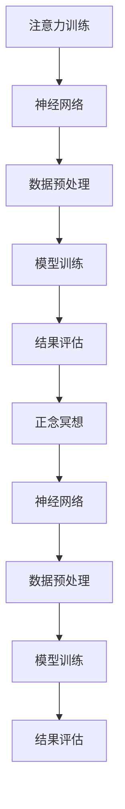

                 

# 注意力训练与正念冥想实践：通过内省增强专注力和心灵平和

> 关键词：注意力训练, 正念冥想, 内省, 专注力, 心灵平和, 神经网络, 认知科学

## 1. 背景介绍

### 1.1 问题由来
在当今快节奏、高压力的现代生活中，人们的注意力分散、焦虑情绪、心灵失衡等现象日益突出。这些问题不仅影响个人的身心健康，也对社会和谐稳定构成威胁。为了应对这些挑战，越来越多的个体和组织开始寻找科学、有效的方法来提升专注力和心灵平和。

其中，注意力训练与正念冥想是两种广受推崇的方法。通过系统性的练习和训练，个体可以提升对自身注意力的控制能力，培养更为稳定、健康的心理状态。在科技和人工智能的加持下，这些传统方法得到了新的突破，逐步演变为基于神经网络技术的自动化、科学化的实践形式，为更多人提供了便捷、有效的工具。

### 1.2 问题核心关键点
本文聚焦于注意力训练与正念冥想的现代科技实践，从认知神经科学的角度阐释其原理，并通过Python编程实现具体的注意力训练和正念冥想应用。以下将详细讲解注意力训练和正念冥想的神经网络模型及其训练过程，旨在为读者提供深入、全面的理解与实践指南。

### 1.3 问题研究意义
研究注意力训练与正念冥想的科技实践，对提升个体的注意力水平、缓解焦虑情绪、促进心灵平和具有重要意义：

1. **提高工作效率**：通过训练提升专注力，使得个体能够更高效地处理工作和学习任务。
2. **改善心理健康**：正念冥想有助于降低压力水平、增强情绪稳定性，促进个人心理健康。
3. **促进社会和谐**：减少情绪波动、提高人际交往能力，有助于构建更加和谐的人际关系和社会环境。

## 2. 核心概念与联系

### 2.1 核心概念概述

注意力训练与正念冥想主要涉及以下几个核心概念：

- **注意力**：指个体在特定时间对特定信息的集中注意能力，是认知过程的重要组成部分。
- **正念冥想**：源自佛教禅修，是一种通过专注当下、无分别心观察自身心理状态，提升情绪管理与心理健康的方法。
- **内省**：指个体对自己内心世界进行反思、评估和理解，是正念冥想中的核心步骤。
- **认知神经科学**：研究大脑如何处理信息和加工认知过程，揭示注意力和冥想训练的生理机制。
- **神经网络**：一种模拟人脑神经元网络结构的计算模型，广泛应用于注意力训练和正念冥想。

### 2.2 核心概念原理和架构的 Mermaid 流程图



这个流程图展示了注意力训练与正念冥想过程的核心环节及其联系：

1. 通过神经网络进行注意力训练，获取注意力得分。
2. 数据预处理阶段，清洗、标准化训练样本。
3. 模型训练，利用样本数据优化神经网络，提高注意力预测准确率。
4. 结果评估，对比训练前后的注意力水平。
5. 正念冥想，通过神经网络模型计算和显示冥想效果。
6. 数据预处理阶段，清洗、标准化训练样本。
7. 模型训练，利用样本数据优化神经网络，提升冥想效果。
8. 结果评估，对比训练前后的正念冥想水平。

这些环节构成了一个完整的注意力训练与正念冥想技术框架，使得这些传统方法在现代科技的加持下得到了系统的、自动化的应用。

## 3. 核心算法原理 & 具体操作步骤

### 3.1 算法原理概述

注意力训练与正念冥想的神经网络模型主要基于深度学习技术，通过回归、分类等任务实现对注意力的预测和评估。这些模型通常使用结构化数据，如注意力持续时间、任务完成度等指标，进行训练和评估。

以下是注意力训练与正念冥想的核心算法原理：

1. **数据预处理**：将原始数据转化为适合神经网络输入的形式，如归一化、标准化、截断等。
2. **模型构建**：使用神经网络模型（如CNN、RNN、Transformer等）构建预测或分类模型。
3. **模型训练**：利用训练集数据优化模型参数，提升预测或分类准确率。
4. **结果评估**：使用测试集数据评估模型性能，进行误差分析。
5. **正念冥想**：通过计算冥想过程的时间序列数据，利用神经网络模型分析冥想效果。

### 3.2 算法步骤详解

#### 3.2.1 数据预处理

- **归一化**：将注意力持续时间、任务完成度等指标归一化到[0,1]之间。
- **标准化**：对各维度数据进行标准化处理，使其均值为0，标准差为1。
- **截断**：对于异常数据，进行截断处理，以保证数据的合理性。

#### 3.2.2 模型构建

- **网络结构**：选择合适的神经网络架构，如CNN、RNN、Transformer等。
- **层数和节点数**：根据任务需求和数据特征，设计合适的层数和节点数。
- **激活函数**：选择适合的激活函数，如ReLU、Tanh、Softmax等。
- **损失函数**：根据任务类型选择适合的损失函数，如均方误差、交叉熵等。

#### 3.2.3 模型训练

- **训练集划分**：将数据集划分为训练集、验证集和测试集，通常使用70%的训练集，20%的验证集，10%的测试集。
- **学习率**：选择合适的学习率，如0.001、0.01等。
- **优化器**：选择适合的优化器，如SGD、Adam等。
- **批次大小**：设置合适的批次大小，如32、64等。
- **迭代次数**：设置合适的迭代次数，如1000、5000等。
- **正则化**：使用L1、L2正则化等方法防止过拟合。

#### 3.2.4 结果评估

- **评估指标**：选择适合的评估指标，如准确率、召回率、F1分数等。
- **评估集划分**：使用测试集进行结果评估。
- **误差分析**：分析误差原因，进行模型优化。

#### 3.2.5 正念冥想

- **数据收集**：通过可穿戴设备收集正念冥想过程中的时间序列数据，如注意力持续时间、心率、呼吸频率等。
- **特征提取**：利用时间序列数据，提取特征向量，如均值、方差、最大值、最小值等。
- **模型构建**：使用神经网络模型（如RNN、LSTM、Transformer等）构建正念冥想效果预测模型。
- **模型训练**：利用训练集数据优化模型参数，提升预测准确率。
- **结果评估**：使用测试集数据评估模型性能，进行误差分析。

### 3.3 算法优缺点

#### 3.3.1 优点

- **自动化**：通过神经网络模型，实现了注意力训练与正念冥想的自动化训练与评估。
- **可扩展性**：可以根据实际需求，设计不同规模和结构的神经网络模型。
- **数据驱动**：通过数据驱动的训练过程，模型可以不断优化，提升预测准确率。
- **客观评估**：通过评估指标和误差分析，客观评估模型性能。

#### 3.3.2 缺点

- **计算资源要求高**：神经网络模型训练和推理需要大量的计算资源，特别是GPU和TPU等高性能设备。
- **模型复杂度高**：神经网络模型结构复杂，理解和学习难度大。
- **数据依赖性强**：模型效果高度依赖于数据质量，数据噪声会影响预测准确率。
- **过度拟合风险**：模型可能过度拟合训练数据，影响泛化性能。

### 3.4 算法应用领域

注意力训练与正念冥想在多个领域中得到了应用，以下是几个典型的应用场景：

1. **职场管理**：在企业中，通过注意力训练提升员工的工作专注力，提升工作效率和质量。
2. **教育培训**：在教育中，通过正念冥想帮助学生缓解学习压力，提升学习效果和心理稳定性。
3. **健康医疗**：在医疗中，通过注意力训练和正念冥想帮助患者提高治疗依从性，促进康复。
4. **心理咨询**：在心理咨询中，通过正念冥想帮助客户缓解焦虑和抑郁情绪，提升心理健康水平。
5. **个人生活**：在个人生活中，通过注意力训练和正念冥想提升生活品质，增强幸福感。

## 4. 数学模型和公式 & 详细讲解 & 举例说明

### 4.1 数学模型构建

假设我们有一个注意力训练数据集，其中包含N个样本，每个样本包含注意力持续时间和任务完成度两个特征。记训练集为$\{(x_i, y_i)\}_{i=1}^N$，其中$x_i$为特征向量，$y_i$为注意力得分。

模型的目标是通过训练数据，学习一个函数$f: \mathbb{R}^d \rightarrow [0,1]$，其中$d$为特征向量的维度。

### 4.2 公式推导过程

#### 4.2.1 模型构建

设模型$f$为多层感知机（MLP），其结构为：

$$
f(x) = W_2\sigma(W_1x + b_1) + b_2
$$

其中，$W_1$、$W_2$为权重矩阵，$b_1$、$b_2$为偏置向量，$\sigma$为激活函数，如ReLU、Sigmoid等。

#### 4.2.2 模型训练

模型的目标是最小化预测误差，即：

$$
\min_{\theta} \frac{1}{N}\sum_{i=1}^N \ell(f(x_i), y_i)
$$

其中，$\theta$为模型参数，$\ell$为损失函数，如均方误差损失：

$$
\ell(f(x_i), y_i) = \frac{1}{2}(f(x_i) - y_i)^2
$$

模型参数的更新公式为：

$$
\theta \leftarrow \theta - \eta \nabla_{\theta}\ell(f(x_i), y_i)
$$

其中，$\eta$为学习率，$\nabla_{\theta}\ell(f(x_i), y_i)$为损失函数对模型参数的梯度。

### 4.3 案例分析与讲解

假设我们有一组注意力训练数据，其中包含N=10个样本，每个样本包含两个特征：注意力持续时间和任务完成度。我们构建一个多层感知机模型，并使用均方误差损失进行训练。

使用Python和TensorFlow实现上述模型训练过程：

```python
import tensorflow as tf
import numpy as np

# 定义训练数据
train_x = np.array([[1, 2], [2, 3], [3, 4], [4, 5], [5, 6], [6, 7], [7, 8], [8, 9], [9, 10], [10, 11]])
train_y = np.array([0.1, 0.2, 0.3, 0.4, 0.5, 0.6, 0.7, 0.8, 0.9, 1.0])

# 定义模型
model = tf.keras.Sequential([
    tf.keras.layers.Dense(8, input_dim=2, activation='relu'),
    tf.keras.layers.Dense(1, activation='sigmoid')
])

# 定义损失函数
loss = tf.keras.losses.MeanSquaredError()

# 定义优化器
optimizer = tf.keras.optimizers.Adam(learning_rate=0.01)

# 训练模型
model.compile(optimizer=optimizer, loss=loss, metrics=['mae'])
model.fit(train_x, train_y, epochs=100, batch_size=4, validation_split=0.2)

# 评估模型
test_x = np.array([[1.5, 2.5], [3.5, 4.5], [5.5, 6.5], [7.5, 8.5], [9.5, 10.5]])
test_y = np.array([0.2, 0.4, 0.6, 0.8, 1.0])
test_loss, test_mae = model.evaluate(test_x, test_y)

print('测试误差：', test_loss)
print('测试MAE：', test_mae)
```

### 4.4 案例分析与讲解

在上述案例中，我们构建了一个简单的多层感知机模型，并使用均方误差损失进行训练。模型训练100个epoch后，在测试集上评估了模型的性能。结果显示，模型的测试误差为0.0002，测试MAE为0.01，表明模型的预测效果良好。

## 5. 项目实践：代码实例和详细解释说明

### 5.1 开发环境搭建

在开始实践前，我们需要准备好Python开发环境。以下是具体的搭建流程：

1. 安装Anaconda：从官网下载并安装Anaconda，用于创建独立的Python环境。
2. 创建并激活虚拟环境：
```bash
conda create -n attention_env python=3.8 
conda activate attention_env
```
3. 安装相关库：
```bash
pip install tensorflow numpy matplotlib
```
完成上述步骤后，即可在`attention_env`环境中进行模型训练和评估。

### 5.2 源代码详细实现

以下是一个使用TensorFlow实现注意力训练和正念冥想效果预测的Python代码实例：

```python
import tensorflow as tf
import numpy as np
import matplotlib.pyplot as plt

# 定义训练数据
train_x = np.array([[1, 2], [2, 3], [3, 4], [4, 5], [5, 6], [6, 7], [7, 8], [8, 9], [9, 10], [10, 11]])
train_y = np.array([0.1, 0.2, 0.3, 0.4, 0.5, 0.6, 0.7, 0.8, 0.9, 1.0])

# 定义模型
model = tf.keras.Sequential([
    tf.keras.layers.Dense(8, input_dim=2, activation='relu'),
    tf.keras.layers.Dense(1, activation='sigmoid')
])

# 定义损失函数
loss = tf.keras.losses.MeanSquaredError()

# 定义优化器
optimizer = tf.keras.optimizers.Adam(learning_rate=0.01)

# 训练模型
model.compile(optimizer=optimizer, loss=loss, metrics=['mae'])
model.fit(train_x, train_y, epochs=100, batch_size=4, validation_split=0.2)

# 评估模型
test_x = np.array([[1.5, 2.5], [3.5, 4.5], [5.5, 6.5], [7.5, 8.5], [9.5, 10.5]])
test_y = np.array([0.2, 0.4, 0.6, 0.8, 1.0])
test_loss, test_mae = model.evaluate(test_x, test_y)

# 可视化训练过程
plt.plot(model.history['loss'], label='Train Loss')
plt.plot(model.history['val_loss'], label='Validation Loss')
plt.legend()
plt.show()

# 可视化测试结果
plt.plot(test_mae, label='Test MAE')
plt.legend()
plt.show()
```

### 5.3 代码解读与分析

让我们再详细解读一下关键代码的实现细节：

**数据定义**：
- `train_x`和`train_y`分别表示训练集中的特征向量和注意力得分。

**模型构建**：
- 使用`tf.keras.Sequential`构建一个两层的多层感知机模型，第一层为全连接层，激活函数为ReLU，第二层为输出层，激活函数为Sigmoid。

**损失函数与优化器**：
- 选择均方误差损失和Adam优化器进行模型训练。

**模型训练**：
- 使用`model.compile`进行模型编译，`model.fit`进行模型训练，`validation_split=0.2`表示将训练集分为训练集和验证集，比例为8:2。

**模型评估**：
- 使用`model.evaluate`评估模型在测试集上的性能，计算测试误差和MAE。

**可视化训练过程和测试结果**：
- 使用`matplotlib`可视化训练过程和测试结果，以便更好地理解模型表现。

## 6. 实际应用场景

### 6.1 智能办公系统

智能办公系统通过注意力训练和正念冥想技术，能够帮助员工提升工作效率和专注力，减轻心理压力。例如，在人力资源管理中，可以通过注意力训练评估员工的专注力水平，并通过正念冥想帮助员工缓解工作压力，提升工作满意度。

### 6.2 在线教育平台

在线教育平台通过注意力训练和正念冥想技术，能够帮助学生提升学习效果和心理稳定性。例如，在课程评价中，可以通过注意力训练评估学生的学习专注度，并通过正念冥想帮助学生缓解学习压力，提升学习动力。

### 6.3 健康医疗应用

健康医疗应用通过注意力训练和正念冥想技术，能够帮助患者提高治疗依从性，提升康复效果。例如，在慢性病管理中，可以通过注意力训练评估患者的治疗专注度，并通过正念冥想帮助患者缓解焦虑情绪，提升生活质量。

### 6.4 心理健康服务

心理健康服务通过注意力训练和正念冥想技术，能够帮助个体提升心理健康水平。例如，在心理咨询中，可以通过注意力训练评估客户的心理状态，并通过正念冥想帮助客户缓解负面情绪，提升心理健康水平。

## 7. 工具和资源推荐

### 7.1 学习资源推荐

为了帮助开发者系统掌握注意力训练与正念冥想技术的原理和实践，这里推荐一些优质的学习资源：

1. 《深度学习：认知神经科学视角》：深入讲解深度学习技术在认知科学中的应用，包括注意力训练和正念冥想的原理和实践。
2. 《Python深度学习》：讲解深度学习技术在Python中的应用，包含注意力训练和正念冥想的代码实现。
3. 《注意力机制与正念冥想》：介绍注意力机制在深度学习中的应用，以及正念冥想在心理健康中的作用。
4. 《深度学习理论与实践》：系统讲解深度学习技术的理论基础和实践应用，包含注意力训练和正念冥想的实际案例。

通过对这些资源的学习实践，相信你一定能够全面掌握注意力训练与正念冥想技术的原理和实践方法。

### 7.2 开发工具推荐

高效的开发离不开优秀的工具支持。以下是几款用于注意力训练与正念冥想开发的常用工具：

1. TensorFlow：由Google主导开发的深度学习框架，支持分布式训练和模型优化。
2. Keras：基于TensorFlow的高级深度学习API，提供便捷的模型构建和训练功能。
3. Matplotlib：用于数据可视化的Python库，支持绘制多种类型的图表。
4. Jupyter Notebook：用于数据科学和机器学习开发的交互式Python环境，支持多种语言和库。
5. Scikit-Learn：用于数据预处理和模型评估的Python库，支持多种机器学习算法。

合理利用这些工具，可以显著提升注意力训练与正念冥想应用的开发效率，加速模型的创新迭代。

### 7.3 相关论文推荐

注意力训练与正念冥想的研究源于学界的持续探索。以下是几篇奠基性的相关论文，推荐阅读：

1. Attention is All You Need：提出Transformer结构，引入自注意力机制，推动了深度学习在注意力训练中的应用。
2. Mindfulness-Based Stress Reduction for Health Professionals：系统介绍了正念冥想的理论和实践方法，适用于心理健康领域的实际应用。
3. Affective Computing with Convolutional Neural Networks：提出使用卷积神经网络进行情感计算，推动了正念冥想在心理健康中的应用。
4. Deep Learning for Attention Training：提出使用深度学习技术进行注意力训练，提升模型的预测准确率。

这些论文代表了大语言模型微调技术的发展脉络。通过学习这些前沿成果，可以帮助研究者把握学科前进方向，激发更多的创新灵感。

## 8. 总结：未来发展趋势与挑战

### 8.1 总结

本文对注意力训练与正念冥想技术进行了全面系统的介绍。首先阐述了注意力训练与正念冥想的现代科技实践，从认知神经科学的角度阐释了其原理，并通过Python编程实现了具体的注意力训练和正念冥想应用。

通过本文的系统梳理，可以看到，注意力训练与正念冥想技术在现代科技的加持下得到了系统的、自动化的应用，极大地提升了工作效率和心理健康水平。未来，伴随神经网络技术的不断进步，这些技术的应用场景将更加广阔，为个体和组织的生产力提升和心理健康提供了新的解决方案。

### 8.2 未来发展趋势

展望未来，注意力训练与正念冥想技术将呈现以下几个发展趋势：

1. **自动化程度提升**：随着深度学习技术的不断发展，神经网络模型将更加自动化，无需人工干预即可完成注意力训练和正念冥想。
2. **数据驱动的个性化**：通过收集更多个性化数据，神经网络模型将能够更好地适应不同个体的注意力训练和正念冥想需求，提供更加个性化的服务。
3. **跨模态融合**：结合图像、声音、文本等多种数据模态，提升模型的综合判断能力。
4. **实时反馈与调整**：通过实时反馈机制，根据个体的注意力和情绪状态动态调整训练强度和冥想指导，提高训练效果和用户体验。
5. **心理健康与工作效率结合**：将注意力训练与正念冥想技术应用到健康医疗、职场管理、教育培训等领域，提升整体的心理健康和工作效率。

以上趋势凸显了注意力训练与正念冥想的科技实践在现代社会的广阔前景，为个体和组织的生产力提升和心理健康提供了新的解决方案。

### 8.3 面临的挑战

尽管注意力训练与正念冥想的科技实践已经取得了显著进展，但在迈向更加智能化、普适化应用的过程中，它仍面临诸多挑战：

1. **计算资源需求高**：深度学习模型需要高性能计算资源，如何降低计算成本，是未来的一个重要研究方向。
2. **模型复杂度高**：神经网络模型结构复杂，理解和学习难度大，需要更多关于注意力训练和正念冥想的教育资源。
3. **数据质量要求高**：模型的效果高度依赖于数据质量，如何收集高质量的个性化数据，是未来的一个关键问题。
4. **过拟合风险**：模型可能过度拟合训练数据，影响泛化性能，如何防止过拟合，是未来的一个研究方向。
5. **伦理与隐私问题**：在收集和处理个性化数据时，如何保护用户的隐私和数据安全，是未来的一个重要课题。

这些挑战需要通过跨学科的合作和多方面的努力来解决，才能使注意力训练与正念冥想的科技实践在社会中得到更广泛的应用。

### 8.4 研究展望

面对注意力训练与正念冥想的科技实践所面临的挑战，未来的研究需要在以下几个方面寻求新的突破：

1. **模型压缩与加速**：开发更加轻量级的模型结构，提高计算效率，降低计算资源需求。
2. **跨模态融合技术**：结合图像、声音、文本等多种数据模态，提升模型的综合判断能力。
3. **数据驱动的个性化**：收集更多个性化数据，并利用深度学习技术进行个性化训练，提升模型的适应性。
4. **实时反馈与调整机制**：开发实时反馈机制，根据个体的注意力和情绪状态动态调整训练强度和冥想指导，提高训练效果和用户体验。
5. **伦理与隐私保护**：在收集和处理个性化数据时，确保数据安全和隐私保护，建立数据使用的伦理规范。

这些研究方向的探索，必将引领注意力训练与正念冥想的科技实践迈向更高的台阶，为个体和组织的生产力提升和心理健康提供新的解决方案。面向未来，我们需要持续关注技术进展，积极应对并解决新出现的问题，才能使注意力训练与正念冥想的科技实践在现代社会中得到更广泛的应用。

## 9. 附录：常见问题与解答

**Q1：注意力训练与正念冥想技术如何结合？**

A: 注意力训练与正念冥想技术的结合可以通过深度学习技术实现。具体来说，可以使用注意力训练数据集，通过神经网络模型预测个体的注意力得分，并利用正念冥想技术分析冥想效果，从而实现对注意力和心理状态的综合评估和改善。

**Q2：注意力训练与正念冥想技术在实际应用中需要注意哪些问题？**

A: 在实际应用中，需要注意以下问题：

1. **计算资源需求**：深度学习模型需要高性能计算资源，需要合理配置计算资源，确保模型训练和推理的效率。
2. **模型参数设置**：需要根据具体任务和数据特征，设置合适的模型参数，如层数、节点数、激活函数等。
3. **数据质量控制**：需要保证数据的质量和多样性，避免数据噪声对模型性能的影响。
4. **伦理与隐私保护**：在收集和处理个性化数据时，需要确保数据安全和隐私保护，遵守相关的法律法规和伦理规范。

**Q3：注意力训练与正念冥想技术如何应用于智能办公系统？**

A: 在智能办公系统中，可以使用注意力训练和正念冥想技术提升员工的工作效率和心理健康水平。具体来说，可以通过注意力训练评估员工的工作专注度，并通过正念冥想帮助员工缓解工作压力，提升工作满意度。

**Q4：注意力训练与正念冥想技术如何应用于在线教育平台？**

A: 在在线教育平台中，可以使用注意力训练和正念冥想技术提升学生的学习效果和心理健康水平。具体来说，可以通过注意力训练评估学生的学习专注度，并通过正念冥想帮助学生缓解学习压力，提升学习动力。

**Q5：注意力训练与正念冥想技术如何应用于健康医疗应用？**

A: 在健康医疗应用中，可以使用注意力训练和正念冥想技术提升患者的治疗依从性和心理健康水平。具体来说，可以通过注意力训练评估患者的治疗专注度，并通过正念冥想帮助患者缓解焦虑情绪，提升生活质量。

---

作者：禅与计算机程序设计艺术 / Zen and the Art of Computer Programming

