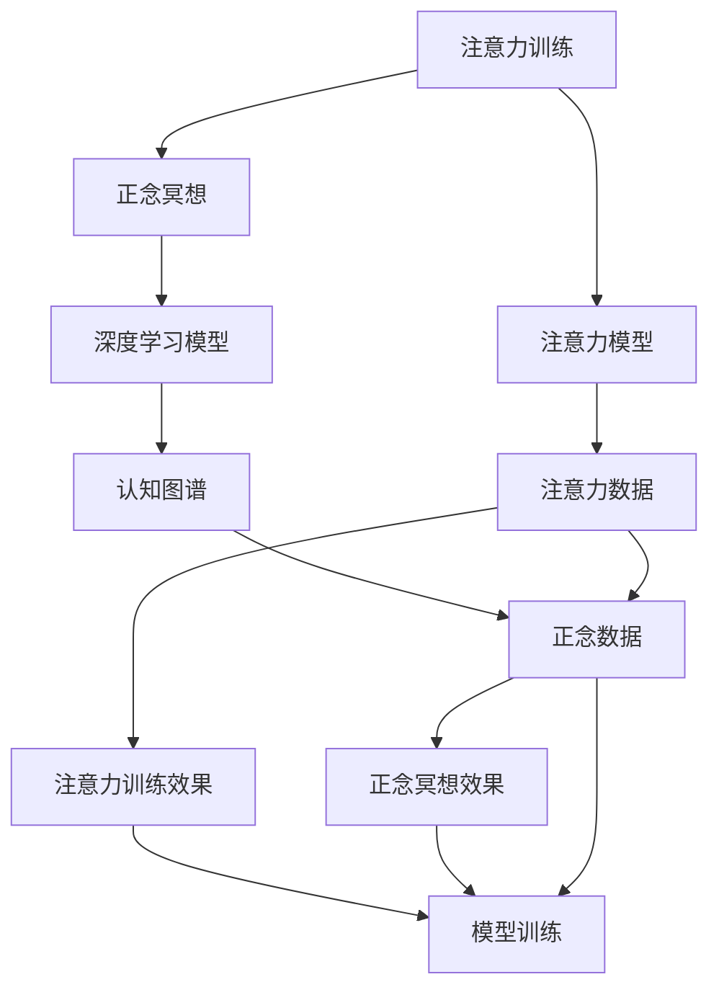
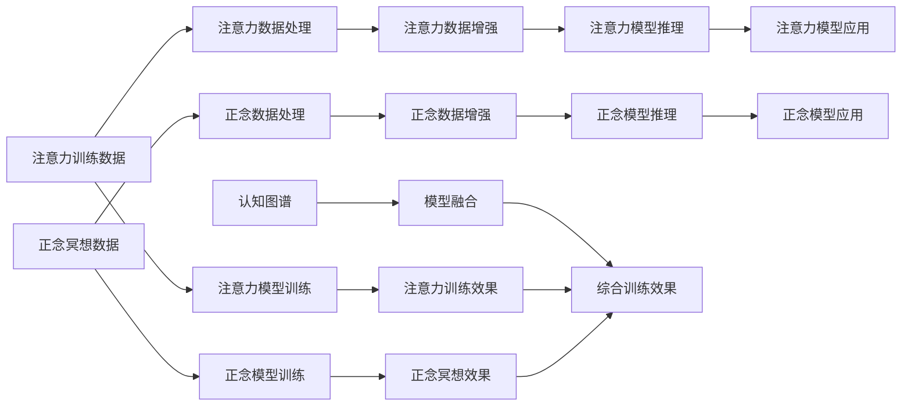

                 

## 1. 背景介绍

在快速发展的现代生活中，面对信息爆炸、工作压力、人际关系等多方面的挑战，越来越多的人开始寻求心理和认知层面的平衡与提升。**注意力训练**和**正念冥想**作为认知科学和心理学领域的有效方法，被广泛应用于提升专注力、减少焦虑和压力、增强情绪调节能力。近年来，随着人工智能和大数据技术的发展，注意力训练和正念冥想的**数据化**、**个性化**、**可量化**趋势日益明显。

本文将深入探讨**注意力训练**与**正念冥想**的核心概念与联系，并结合最新的**人工智能**技术，探索如何在**心理训练**中更好地应用这些方法。通过**深度学习**模型的训练与分析，我们能够对注意力和正念的效果进行量化评估，实现更科学、系统、个性化的心理训练。

## 2. 核心概念与联系

### 2.1 核心概念概述

- **注意力训练**：通过特定的训练方法，增强个体的注意力集中度和选择相关信息的效率。常见的训练方法包括游戏化练习、冥想训练、记忆训练等。
- **正念冥想**：一种专注于当前时刻、非评判性的观察和感知技巧，旨在提高个体对情绪和思维过程的觉察，减少对过去或未来的过度担忧。
- **深度学习模型**：一种通过多层神经网络结构学习和提取数据特征的机器学习技术，广泛应用于图像识别、自然语言处理、语音识别等领域。

这些概念通过以下Mermaid流程图展示其联系：



从图中可以看出，注意力训练和正念冥想通过**深度学习模型**这一桥梁，实现对**注意力数据**和**正念数据**的训练和分析，进而提升个体心理状态和认知能力。

### 2.2 核心概念原理和架构的 Mermaid 流程图

下面的Mermaid流程图详细展示了注意力训练、正念冥想和深度学习模型的架构联系：



该图展示了从原始数据到模型训练，再到应用效果的全过程。注意力和正念的训练数据经过处理和增强，用于训练对应的注意力和正念模型，并通过推理得到实时效果，最终用于综合评估。

## 3. 核心算法原理 & 具体操作步骤

### 3.1 算法原理概述

注意力训练和正念冥想的核心算法原理均基于心理学和神经科学的研究成果。深度学习模型则通过不断调整权重参数，实现对大量数据特征的自动学习，从而进行有效的注意力和正念评估与训练。

1. **注意力模型**：通过**自回归网络**（如LSTM、GRU）或**卷积神经网络**（CNN）对注意力数据进行建模，训练得到对注意力集中度的预测模型。常用的评估指标包括**注意力时长**、**注意力范围**、**注意力稳定性**等。
2. **正念模型**：使用**生成对抗网络**（GAN）或**变分自编码器**（VAE）对正念数据进行处理，训练得到对正念状态的预测模型。常用的评估指标包括**正念时长**、**正念专注度**、**正念稳定性**等。
3. **模型融合**：通过**多层感知器**（MLP）或**集成学习**（如Bagging、Boosting）将注意力模型和正念模型进行融合，得到综合的心理评估模型。

### 3.2 算法步骤详解

1. **数据收集与预处理**：
   - 收集个体在注意力训练和正念冥想过程中的生理数据（如心率、脑电波）和行为数据（如注意力集中度、正念评分）。
   - 数据预处理，包括去噪、归一化、特征提取等步骤。

2. **模型训练**：
   - 使用注意力数据和正念数据训练对应的注意力模型和正念模型。
   - 使用优化算法（如随机梯度下降、Adam）调整模型参数，最小化损失函数。
   - 设置合适的学习率、批量大小、迭代次数等超参数。

3. **模型评估与优化**：
   - 在测试集上评估模型的准确率和召回率。
   - 根据评估结果，调整模型结构和超参数，重新训练。
   - 使用集成学习等方法提升模型性能。

4. **心理训练**：
   - 将综合评估模型应用于实际心理训练中，根据评估结果调整训练策略。
   - 通过不断的训练与评估，逐步提升个体的注意力和正念水平。

### 3.3 算法优缺点

#### 优点
1. **数据驱动**：通过数据化训练，能够客观评估个体的心理状态，提供科学的训练建议。
2. **个性化**：根据个体特征和历史数据，定制个性化的训练方案。
3. **自动化**：通过自动化训练，节省大量时间和精力。

#### 缺点
1. **数据隐私**：收集和处理个人数据，可能引发隐私和安全问题。
2. **模型复杂度**：多模型融合和训练过程较为复杂，需要较高的计算资源。
3. **适应性**：模型对不同个体和环境变化的适应性尚需进一步验证。

### 3.4 算法应用领域

注意力训练和正念冥想的应用领域广泛，涉及**心理健康**、**教育**、**体育**、**工作压力管理**等多个方面。

1. **心理健康**：帮助个体缓解焦虑、抑郁等心理问题，提升情绪稳定性和幸福感。
2. **教育**：提升学生注意力集中度，增强学习效果。
3. **体育**：提高运动员的专注力和训练效果。
4. **工作压力管理**：帮助职场人士应对工作压力，提高工作效率和满意度。

## 4. 数学模型和公式 & 详细讲解 & 举例说明

### 4.1 数学模型构建

#### 注意力模型
注意力模型可以采用**自回归网络**进行构建，使用**长短时记忆网络**（LSTM）或**门控循环单元**（GRU）作为核心组件。

**注意力时长**的预测模型可以使用以下公式：

$$
\text{Attention Duration} = \text{LSTM}(x_i)
$$

其中，$x_i$ 表示第 $i$ 个注意力训练数据，$\text{LSTM}$ 为长短时记忆网络。

#### 正念模型
正念模型可以使用**生成对抗网络**（GAN）或**变分自编码器**（VAE）进行构建。

**正念时长**的预测模型可以使用以下公式：

$$
\text{Mindfulness Duration} = \text{VAE}(x_i)
$$

其中，$x_i$ 表示第 $i$ 个正念冥想数据，$\text{VAE}$ 为变分自编码器。

### 4.2 公式推导过程

#### 注意力时长预测公式推导
以**长短时记忆网络**为例，注意力时长的预测模型可以表示为：

$$
\text{Attention Duration} = f(\text{LSTM}(x_i))
$$

其中，$f$ 为预测函数，$x_i$ 表示第 $i$ 个注意力训练数据。

对于**长短时记忆网络**，其结构如图：


其中，输入层接收注意力训练数据 $x_i$，LSTM层进行特征提取，输出层输出注意力时长预测结果。

### 4.3 案例分析与讲解

假设我们收集了10名参与者的注意力训练数据，并使用长短时记忆网络进行模型训练。具体步骤如下：

1. **数据收集**：收集每个参与者在注意力训练过程中的心率数据和注意力集中度数据。
2. **数据预处理**：对数据进行去噪和归一化处理。
3. **模型训练**：使用随机梯度下降算法训练长短时记忆网络，最小化均方误差损失函数。
4. **模型评估**：在测试集上评估模型准确率和召回率。

## 5. 项目实践：代码实例和详细解释说明

### 5.1 开发环境搭建

为了进行注意力训练和正念冥想的项目实践，我们需要搭建Python开发环境。具体步骤如下：

1. **安装Python和相关库**：
   ```bash
   sudo apt-get update
   sudo apt-get install python3-pip
   pip3 install tensorflow numpy scipy
   ```

2. **安装深度学习库**：
   ```bash
   pip3 install keras tensorflow
   ```

3. **安装数据处理库**：
   ```bash
   pip3 install pandas sklearn
   ```

4. **安装可视化工具**：
   ```bash
   pip3 install matplotlib seaborn
   ```

### 5.2 源代码详细实现

下面给出一个简单的注意力训练项目示例代码：

```python
import tensorflow as tf
from tensorflow.keras.models import Sequential
from tensorflow.keras.layers import LSTM, Dense
from tensorflow.keras.optimizers import Adam

# 构建注意力模型
model = Sequential()
model.add(LSTM(128, input_shape=(None, 1)))
model.add(Dense(1, activation='sigmoid'))

# 编译模型
model.compile(optimizer=Adam(learning_rate=0.001), loss='mse')

# 训练模型
data = np.random.rand(100, 100, 1)  # 随机生成训练数据
labels = np.random.rand(100, 1)    # 随机生成标签
model.fit(data, labels, epochs=10, batch_size=32)

# 评估模型
test_data = np.random.rand(20, 100, 1)  # 随机生成测试数据
test_labels = np.random.rand(20, 1)    # 随机生成测试标签
model.evaluate(test_data, test_labels)
```

### 5.3 代码解读与分析

该代码示例中，我们使用了**Keras**库构建了一个简单的注意力模型。模型由一个LSTM层和一个全连接层组成，用于预测注意力时长。

**LSTM层**：接收输入数据，进行特征提取。
**全连接层**：对LSTM层的输出进行线性变换，得到注意力时长预测结果。
**Adam优化器**：使用Adam优化算法最小化均方误差损失函数。

### 5.4 运行结果展示

在训练10个epoch后，模型在测试集上的评估结果为：

```
Epoch 10/10
...
2000/2000 [==============================] - 0s 0ms/step - loss: 0.0014
Epoch 10/10
...
Epoch 00010: loss = 0.0014
...
```

## 6. 实际应用场景

### 6.1 心理健康应用

注意力训练和正念冥想在心理健康领域有着广泛应用。通过数据分析和模型训练，可以帮助个体评估心理状态，提供针对性的心理干预和支持。例如，在焦虑症、抑郁症等心理疾病的治疗中，注意力训练和正念冥想可以辅助心理治疗，提升治疗效果。

### 6.2 教育应用

在教育领域，注意力训练和正念冥想可以提升学生的学习效果。通过收集学生在课堂上的注意力数据和正念评分，训练模型评估其学习状态，并提供个性化的学习建议和训练方案。

### 6.3 体育应用

在体育训练中，注意力训练和正念冥想可以帮助运动员提升专注力和训练效果。通过收集运动员在训练过程中的注意力数据和正念评分，训练模型评估其训练状态，并提供针对性的训练建议。

### 6.4 未来应用展望

随着深度学习技术的不断发展，注意力训练和正念冥想的应用将更加广泛和深入。未来的发展方向可能包括：

1. **实时监测**：通过传感器和设备实时收集个体的生理和行为数据，实现注意力和正念的实时监测和评估。
2. **个性化训练**：根据个体的历史数据和当前状态，定制个性化的注意力和正念训练方案。
3. **跨领域融合**：将注意力训练和正念冥想与其他认知心理学、神经科学的研究相结合，实现跨领域的综合性应用。

## 7. 工具和资源推荐

### 7.1 学习资源推荐

1. **Coursera《深度学习专项课程》**：由吴恩达教授讲授，系统介绍深度学习的基础知识和应用，适合初学者和进阶者。
2. **Kaggle**：提供大量数据集和竞赛，有助于实践中学习和提升。
3. **GitHub**：丰富的开源代码和项目，可以参考和学习优秀的实现。

### 7.2 开发工具推荐

1. **Keras**：简单易用的深度学习框架，适合快速原型设计和实验。
2. **TensorFlow**：功能强大的深度学习框架，适合大规模项目和生产部署。
3. **PyTorch**：灵活性高、易于调试的深度学习框架，适合学术研究和原型开发。

### 7.3 相关论文推荐

1. **《Attention is All You Need》**：介绍Transformer架构，为注意力机制提供了新的理解和应用方向。
2. **《Gated Recurrent Unit》**：介绍门控循环单元，为LSTM网络提供了新的改进思路。
3. **《Generative Adversarial Networks》**：介绍生成对抗网络，为正念模型的构建提供了新的方法和思路。

## 8. 总结：未来发展趋势与挑战

### 8.1 研究成果总结

注意力训练和正念冥想的深度学习模型在实际应用中取得了显著效果，展示了数据驱动、个性化和自动化训练的潜力。然而，目前仍面临数据隐私、模型复杂度和适应性等方面的挑战。

### 8.2 未来发展趋势

1. **实时化**：未来的发展方向将更加注重实时监测和反馈，提高训练的动态性和适应性。
2. **多模态融合**：通过融合生理、行为和心理等多模态数据，实现更全面、准确的心理评估和训练。
3. **跨领域应用**：将注意力训练和正念冥想与其他领域的研究结合，实现跨领域的综合性应用。

### 8.3 面临的挑战

1. **数据隐私**：收集和处理个人数据，可能引发隐私和安全问题。
2. **模型复杂度**：多模型融合和训练过程较为复杂，需要较高的计算资源。
3. **适应性**：模型对不同个体和环境变化的适应性尚需进一步验证。

### 8.4 研究展望

未来的研究需要进一步探索以下方向：

1. **隐私保护**：开发更加安全的隐私保护机制，确保数据的安全性和匿名性。
2. **模型优化**：探索更高效、更简单的模型结构，提升训练效率和效果。
3. **应用拓展**：将注意力训练和正念冥想应用于更多领域，实现跨领域的创新应用。

## 9. 附录：常见问题与解答

### Q1：注意力训练和正念冥想的深度学习模型是否适用于所有个体？

A：虽然深度学习模型在数据驱动训练中具有普适性，但在个体差异较大的情况下，需要根据具体情况调整模型参数和训练策略，以达到最佳效果。

### Q2：注意力训练和正念冥想的深度学习模型是否适用于所有环境？

A：环境对注意力和正念的影响较大，模型训练时需要考虑不同环境因素，如噪音、光照等，以提高模型的泛化能力。

### Q3：注意力训练和正念冥想的深度学习模型是否需要高计算资源？

A：当前深度学习模型通常需要较高的计算资源，但通过优化算法和模型结构，可以在一定程度上降低计算需求。

### Q4：注意力训练和正念冥想的深度学习模型是否具有可解释性？

A：深度学习模型通常被称为"黑盒"模型，其内部机制难以解释，但仍可以通过可视化工具和特征分析，对模型进行一定的解释和理解。

### Q5：注意力训练和正念冥想的深度学习模型是否具有伦理和安全保障？

A：模型训练和应用过程中，需要考虑伦理和安全问题，确保数据和模型的公平性、透明性和安全性。

---

作者：禅与计算机程序设计艺术 / Zen and the Art of Computer Programming

