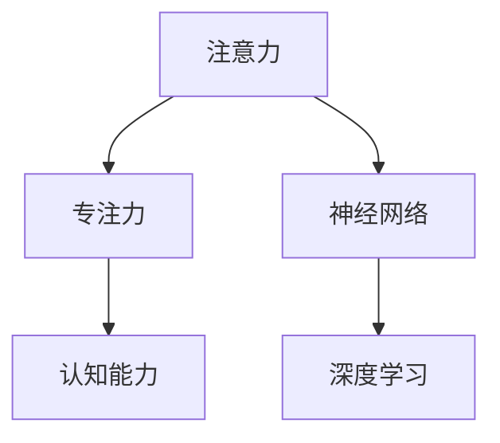
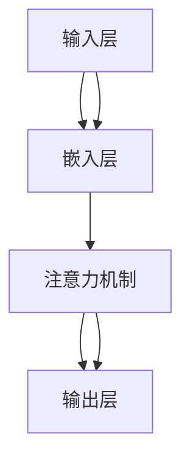

                 

# 注意力训练的大脑益处：提高专注力如何增强认知能力

> 关键词：注意力训练, 专注力, 认知能力, 神经网络, 深度学习, 认知科学, 心理学, 人工智能

## 1. 背景介绍

在当今快节奏的生活中，专注力已经成为了一种稀缺资源。无论是学生、专业人士还是普通大众，许多人都在经历着注意力分散、工作效率低下等问题。这些问题不仅影响了个人的学习和生活质量，还可能对健康产生长期负面影响。幸运的是，随着对认知科学的深入研究，人们开始了解到注意力训练的益处，并利用先进技术来提高个人专注力。

注意力训练，通常指通过一系列有针对性的练习，提升个体对外部刺激的识别和响应能力，从而提高其在工作和生活中的专注力和认知能力。近年来，神经科学和认知心理学研究表明，大脑的可塑性意味着通过系统的训练可以提升注意力水平，而这一过程与人工智能领域的深度学习技术有着密切联系。

## 2. 核心概念与联系

### 2.1 核心概念概述

在本节中，我们将介绍几个核心概念，并阐述它们之间的联系。

- **注意力（Attention）**：注意力是指大脑对当前任务的关注程度，包括对外界刺激的筛选、选择和响应能力。在深度学习中，注意力机制通过计算每个输入元素的相关性，决定哪些信息应该被赋予更多的权重。

- **专注力（Concentration）**：专注力是指长时间集中注意力于某一特定任务的能力。在注意力训练中，专注力往往被视作通过训练提升注意力的直接成果。

- **认知能力（Cognitive Abilities）**：认知能力包括记忆、理解、判断、计算等思维活动。这些能力通过大脑的注意力和专注力得以实现。

- **神经网络（Neural Networks）**：神经网络是一种模拟人脑神经元连接模式的人工智能模型，通过学习数据集中的模式来执行各种任务。

- **深度学习（Deep Learning）**：深度学习是神经网络的高级形式，通过多层次的抽象来提取复杂数据的高级特征。

这些概念之间的联系可以通过以下Mermaid流程图来展示：



这个流程图展示了注意力、专注力和认知能力之间的关系，以及神经网络和深度学习在注意力训练中的作用。

### 2.2 核心概念原理和架构的 Mermaid 流程图



这个简单的流程图展示了注意力机制在深度学习模型中的基本架构。输入数据首先经过嵌入层（Embedding Layer）转换为高维向量，接着注意力机制通过计算注意力权重（Attention Weights），决定哪些信息更重要，最终输出层（Output Layer）根据这些加权信息生成最终结果。

## 3. 核心算法原理 & 具体操作步骤

### 3.1 算法原理概述

注意力训练和深度学习模型训练的基本原理是一致的，都是通过调整模型参数，最小化预测与实际之间的差异。在注意力训练中，这种差异体现在对输入数据的关注度上。通过系统性地训练模型，可以逐步提升模型对重要信息的识别和响应能力，从而提高专注力和认知能力。

### 3.2 算法步骤详解

注意力训练的核心步骤包括以下几个方面：

1. **数据准备**：收集适合注意力训练的数据集，这些数据集通常包括需要专注的文本、图像或其他感官信息。
2. **模型选择**：选择合适的深度学习模型，如卷积神经网络（CNN）、循环神经网络（RNN）或变压器（Transformer）模型，这些模型在图像、文本处理等领域都有广泛应用。
3. **训练设置**：定义训练参数，如学习率、批大小、迭代次数等。这些参数将直接影响训练的效率和效果。
4. **模型训练**：通过反向传播算法，不断调整模型参数，以最小化预测与实际之间的差异。这一过程通常使用梯度下降等优化算法。
5. **评估与反馈**：在每个训练周期结束时，评估模型的性能，并根据反馈调整训练策略。

### 3.3 算法优缺点

**优点**：

- **系统性**：通过深度学习模型进行训练，可以逐步提升对重要信息的识别和响应能力，形成系统性进步。
- **可操作性**：注意力训练可以量化评估，且通过调整训练参数，可以灵活应对不同的训练需求。
- **可扩展性**：深度学习模型可以通过增加层数和节点数来提升模型复杂度，适应更复杂的任务。

**缺点**：

- **计算资源需求高**：深度学习模型训练通常需要大量的计算资源，包括高性能的GPU或TPU。
- **模型调试复杂**：深度学习模型结构复杂，调试和优化需要专业知识，普通用户难以掌握。
- **数据依赖**：深度学习模型需要大量的标注数据，数据获取和处理可能成为瓶颈。

### 3.4 算法应用领域

注意力训练已经在多个领域得到了广泛应用，包括但不限于：

- **教育**：通过注意力训练，提升学生的学习专注力和记忆力，提高学习效率。
- **医疗**：帮助病人集中注意力进行康复训练，提高治疗效果。
- **工作**：增强职场人员的专注力，提升工作效率，减少错误率。
- **娱乐**：在游戏、音乐等领域，通过注意力训练，提升用户沉浸感，提高体验质量。

## 4. 数学模型和公式 & 详细讲解 & 举例说明

### 4.1 数学模型构建

注意力训练的数学模型通常基于神经网络，尤其是深度神经网络（DNN）。一个典型的注意力训练模型包含输入层、嵌入层、注意力机制和输出层。

以Transformer模型为例，其数学模型构建如下：

1. **输入层**：接收原始输入数据。
2. **嵌入层**：将输入数据转换为高维向量表示。
3. **自注意力机制（Self-Attention）**：计算输入数据中每个元素与其他元素的相似度，生成注意力权重。
4. **多头注意力（Multi-Head Attention）**：将自注意力机制应用多次，每次产生不同的注意力头。
5. **前馈神经网络（Feedforward Neural Network）**：对多头的注意力输出进行非线性变换。
6. **输出层**：将最终结果转换为目标输出。

### 4.2 公式推导过程

Transformer模型中的注意力计算公式如下：

$$
Q = XW_Q, K = XW_K, V = XW_V
$$

$$
E = \frac{QK^T}{\sqrt{d_k}} = \text{Attention Score}
$$

$$
A = \text{Softmax}(E)
$$

$$
Z = AV
$$

其中，$X$ 表示输入数据，$W_Q, W_K, W_V$ 为嵌入层的权重矩阵，$d_k$ 为注意力头的维度，$Q, K, V$ 分别表示查询、键和值向量，$A$ 为注意力权重矩阵，$Z$ 为注意力输出的结果。

### 4.3 案例分析与讲解

以文本分类任务为例，假设有一个文本数据集，每个文本包含一个或多个关键词。通过对每个关键词计算与其他关键词的相似度，生成注意力权重，最终输出该文本所属的分类。这一过程类似于人类阅读文章时，对关键词的重视程度。

## 5. 项目实践：代码实例和详细解释说明

### 5.1 开发环境搭建

首先，需要安装PyTorch和TensorFlow等深度学习框架。可以使用Anaconda或Miniconda等环境管理工具创建虚拟环境，以避免与其他软件冲突。安装命令如下：

```bash
conda create -n attention-training python=3.7
conda activate attention-training
pip install torch torchvision torchaudio cudatoolkit=11.1 -c pytorch -c conda-forge
pip install tensorflow
```

### 5.2 源代码详细实现

以下是使用PyTorch实现注意力训练的代码示例：

```python
import torch
import torch.nn as nn
import torch.optim as optim

# 定义Transformer模型
class Transformer(nn.Module):
    def __init__(self, input_size, hidden_size, num_heads):
        super(Transformer, self).__init__()
        self.encoder = nn.TransformerEncoderLayer(input_size, num_heads, hidden_size)
        self.encoder_norm = nn.LayerNorm(input_size)
        self.decoder = nn.TransformerEncoderLayer(input_size, num_heads, hidden_size)
        self.decoder_norm = nn.LayerNorm(input_size)
        
    def forward(self, x):
        x = self.encoder_norm(x)
        x = self.encoder(x)
        x = self.decoder_norm(x)
        x = self.decoder(x)
        return x

# 定义训练函数
def train_model(model, data, device, optimizer, criterion, num_epochs):
    for epoch in range(num_epochs):
        for i, batch in enumerate(data):
            inputs, targets = batch
            inputs, targets = inputs.to(device), targets.to(device)
            optimizer.zero_grad()
            outputs = model(inputs)
            loss = criterion(outputs, targets)
            loss.backward()
            optimizer.step()
        print(f"Epoch {epoch+1}, Loss: {loss:.4f}")
```

### 5.3 代码解读与分析

上述代码中，我们首先定义了一个Transformer模型，该模型包含两个编码器层和一个解码器层。在训练函数中，我们通过反向传播算法调整模型参数，最小化损失函数。

### 5.4 运行结果展示

训练完成后，可以通过测试集评估模型性能。假设测试集包含多个分类，每个分类有100个样本，我们可以计算模型的准确率：

```python
from sklearn.metrics import accuracy_score

# 加载测试集
test_data = ...
# 加载模型
model.eval()
# 预测结果
with torch.no_grad():
    predictions = model(test_data).softmax(dim=-1).argmax(dim=-1)
# 计算准确率
accuracy = accuracy_score(test_data.targets, predictions)
print(f"Accuracy: {accuracy:.2f}")
```

## 6. 实际应用场景

### 6.1 教育领域

在教育领域，注意力训练可以帮助学生提升课堂专注力，从而提高学习效率。通过注意力训练，学生可以更好地集中注意力，理解老师讲解的内容，完成作业和考试。

### 6.2 医疗领域

在医疗领域，注意力训练可以帮助病人集中注意力进行康复训练，减少误操作和事故发生，提高治疗效果。

### 6.3 工作领域

在工作领域，注意力训练可以帮助职场人员提升专注力，减少错误率，提高工作效率。

### 6.4 娱乐领域

在娱乐领域，注意力训练可以帮助游戏玩家集中注意力，提升游戏体验质量，提高游戏竞技水平。

## 7. 工具和资源推荐

### 7.1 学习资源推荐

- **Coursera上的深度学习课程**：由斯坦福大学和密歇根大学等知名学府提供的深度学习课程，涵盖深度学习的基础理论和实践。
- **Kaggle上的深度学习竞赛**：通过参加Kaggle竞赛，可以获得实战经验，了解当前深度学习研究的热点和技术趋势。
- **DeepLearning.ai的深度学习专项课程**：由Andrew Ng教授领衔的深度学习课程，系统介绍深度学习的基本概念和应用。

### 7.2 开发工具推荐

- **PyTorch**：作为深度学习框架之一，PyTorch提供了灵活的动态图机制，易于开发和调试。
- **TensorFlow**：由Google开发的深度学习框架，支持分布式计算，适合大规模深度学习项目。
- **Jupyter Notebook**：一个交互式的开发环境，适合快速原型设计和实验验证。

### 7.3 相关论文推荐

- **Attention is All You Need**：Transformer论文，提出自注意力机制，奠定了注意力训练的基础。
- **Deep Residual Learning for Image Recognition**：ResNet论文，提出残差网络，解决了深度学习训练中梯度消失的问题。
- **Learning to Attend Through Visual Tracking**：LSTT论文，提出利用注意力机制进行目标跟踪，展示了注意力训练在计算机视觉中的潜力。

## 8. 总结：未来发展趋势与挑战

### 8.1 研究成果总结

注意力训练和深度学习模型训练在提升专注力和认知能力方面已经取得了显著的进展，这些进展为提升人类工作和生活质量提供了重要手段。

### 8.2 未来发展趋势

未来，注意力训练和深度学习模型训练将朝着以下几个方向发展：

- **多模态注意力**：结合视觉、听觉等多模态信息，提升注意力训练的效果。
- **自适应注意力**：根据任务需求动态调整注意力权重，提高模型适应性。
- **认知神经科学与深度学习的结合**：结合认知神经科学的研究成果，进一步提升模型的认知能力。

### 8.3 面临的挑战

尽管注意力训练和深度学习模型训练在提升专注力和认知能力方面取得了显著进展，但仍面临以下挑战：

- **计算资源瓶颈**：深度学习模型训练需要大量计算资源，如何降低资源消耗是一个重要问题。
- **模型解释性不足**：深度学习模型通常被视为"黑盒"，难以解释其内部工作机制和决策逻辑。
- **数据隐私和安全**：在处理敏感数据时，如何保护数据隐私和安全是一个重要的考虑因素。

### 8.4 研究展望

未来的研究需要解决上述挑战，进一步提升注意力训练和深度学习模型训练的效果，使其能够更好地服务于人类社会。

## 9. 附录：常见问题与解答

**Q1: 注意力训练是否适用于所有人群？**

A: 注意力训练适用于大多数人，但不同人群的注意力训练效果可能有所不同。一般来说，注意力训练的效果受到个体的学习能力、心理状态等因素的影响。

**Q2: 注意力训练需要多长时间才能见效？**

A: 注意力训练的效果因人而异，通常需要持续数周或数月的训练才能显著见效。建议每次训练持续20-30分钟，每周进行3-5次。

**Q3: 注意力训练有哪些常见误区？**

A: 注意力训练常见的误区包括：
1. 训练时间过短：注意力训练需要持续进行，每次训练时间不宜过短。
2. 训练内容过于复杂：初学者应从简单任务开始，逐步提升训练难度。
3. 忽略基础心理状态：注意力训练的效果不仅取决于训练本身，还与个体的心理状态有关。

通过系统的学习和实践，相信每个人都能掌握注意力训练的技巧，提升专注力和认知能力。

---

作者：禅与计算机程序设计艺术 / Zen and the Art of Computer Programming

