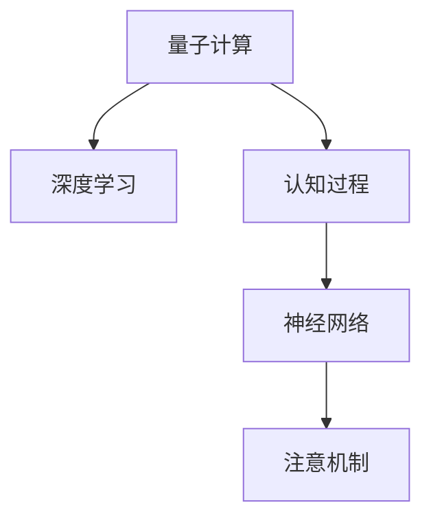

                 

## 1. 背景介绍

在人工智能(AI)时代，工程师们不仅需要掌握前沿的技术工具，更需具备跨越思维的智慧和创造力。随着量子计算、神经网络和智能系统的深度融合，“注意力量子跃迁工程师”这一新角色应运而生。他们掌握着从微观世界到宏观智能的跳跃能力，引领着认知突破技术的前沿。

### 1.1 问题由来

在数据驱动的AI时代，工程师们常常面临大量数据处理和深度学习模型的挑战。如何高效地进行模型训练、优化和部署，成为亟待解决的问题。随着量子计算的兴起，传统AI技术的不足和瓶颈逐渐显现。“注意力量子跃迁工程师”由此而生，他们结合量子计算的底层原理与AI的高级算法，在认知突破技术上开辟出新的道路。

### 1.2 问题核心关键点

注意力量子跃迁工程师的核心关键点在于：
- **量子计算与AI的结合**：利用量子计算的高并行性和高效性，提升AI模型训练和优化的效率。
- **认知突破技术**：通过深入理解认知过程，设计出更加智能、高效的AI系统。
- **跨学科融合**：在神经科学、认知心理学等领域的基础知识之上，进行技术创新和应用。

### 1.3 问题研究意义

在AI领域，认知突破技术的应用不仅仅局限于提高模型的性能，更关乎提升智能系统的理解和决策能力。注意力量子跃迁工程师的角色，为AI与量子计算的结合提供了新的视角和解决方案，推动AI技术向更广、更深的领域发展。

## 2. 核心概念与联系

### 2.1 核心概念概述

为更好地理解注意力量子跃迁工程师的工作原理和优化方向，本节将介绍几个密切相关的核心概念：

- **量子计算(QC)**：一种基于量子力学原理的新型计算方式，能够以指数级速度解决某些特定问题，如因子分解、优化问题等。
- **深度学习(DL)**：一种基于神经网络的机器学习技术，通过大量数据进行训练，能够实现复杂的模式识别和预测任务。
- **认知过程**：人类或动物在知觉、记忆、思维、情感等心理活动中对信息的加工过程，与AI系统的认知建模密切相关。
- **神经网络(NN)**：一种模仿人脑神经元结构和功能的计算模型，通过多层次的非线性变换，实现输入与输出之间的复杂映射。
- **注意机制(Attention)**：一种重要的AI技术，用于增强模型对输入信息的选择性和重要性判断，提升模型的理解和生成能力。

这些核心概念之间的逻辑关系可以通过以下Mermaid流程图来展示：



这个流程图展示了几大核心概念及其之间的关系：

1. 量子计算为深度学习提供计算支持。
2. 认知过程为神经网络提供认知基础。
3. 神经网络是深度学习的基础架构。
4. 注意机制用于增强神经网络的性能。

这些概念共同构成了AI与量子计算结合的认知突破技术框架，使得AI系统能够更高效、更智能地进行信息处理和决策。

## 3. 核心算法原理 & 具体操作步骤
### 3.1 算法原理概述

注意力量子跃迁工程师的工作核心在于如何结合量子计算与深度学习技术，设计出更加智能的AI系统。他们使用的算法原理主要包括：

- **量子增强学习(QML)**：利用量子计算的并行性和高效性，优化深度学习模型的训练过程。
- **认知神经网络(CNN)**：结合神经科学的认知过程，设计更加智能的神经网络结构。
- **变分量子经典算法(VQE)**：利用量子计算与经典算法结合的方式，优化深度学习模型的参数。
- **自适应注意机制(Attention)**：根据输入数据的特点，动态调整模型的注意力分配，提升模型的理解和生成能力。

### 3.2 算法步骤详解

注意力量子跃迁工程师的算法步骤通常包括以下几个关键环节：

**Step 1: 设计量子增强学习算法**
- 选择合适的量子计算平台和算法，如D-Wave、IBM Q等。
- 定义量子计算与深度学习的融合模型，设计量子辅助神经网络。

**Step 2: 构建认知神经网络**
- 基于神经科学的认知过程，设计符合人类认知结构的神经网络。
- 引入认知心理学模型，增强神经网络的记忆和推理能力。

**Step 3: 实现变分量子经典算法**
- 选择适当的量子子程序和经典优化算法，结合两者进行模型优化。
- 设计损失函数，评估量子增强学习算法的性能。

**Step 4: 应用自适应注意机制**
- 根据输入数据的特点，动态调整神经网络的注意权重。
- 使用自适应注意机制提升模型对复杂输入的理解能力。

**Step 5: 实验与优化**
- 在特定任务上对模型进行实验验证，评估性能。
- 根据实验结果，不断优化模型结构和参数，提升效果。

### 3.3 算法优缺点

注意力量子跃迁工程师使用的算法具有以下优点：
1. 高效并行计算：量子计算的高并行性可大大加速深度学习模型的训练过程。
2. 更智能的决策：结合认知过程设计的神经网络具有更强的理解和推理能力。
3. 优化效果显著：变分量子经典算法可有效优化深度学习模型的参数。
4. 自适应能力强：自适应注意机制能根据输入数据动态调整，提升模型性能。

同时，这些算法也存在一定的局限性：
1. 技术门槛高：量子计算和深度学习的结合需要复杂的数学和工程知识。
2. 硬件限制：目前量子计算硬件尚未完全成熟，限制了算法的实际应用。
3. 可解释性不足：量子计算的底层原理复杂，其决策过程难以解释。
4. 数据要求高：需要大量高质量的数据进行训练和验证，成本较高。

尽管存在这些局限性，但基于量子计算与AI结合的认知突破技术，正在逐步改变AI技术的发展方向，为AI系统的智能突破提供了新的可能性。

### 3.4 算法应用领域

注意力量子跃迁工程师的算法主要应用于以下几个领域：

- **认知推理与决策**：设计智能机器人在复杂环境中进行认知推理和决策。
- **自然语言处理(NLP)**：结合认知神经网络，提升语言理解和生成能力。
- **机器视觉**：增强计算机视觉系统的感知和理解能力。
- **医疗诊断**：利用量子计算加速复杂医疗数据处理和诊断，提升准确率。
- **智能推荐系统**：通过认知神经网络，实现更加精准和个性化的推荐。

这些应用领域展示了注意力量子跃迁工程师的巨大潜力，预示着未来AI技术在智能决策、医疗、推荐等领域将迎来新的突破。

## 4. 数学模型和公式 & 详细讲解 & 举例说明
### 4.1 数学模型构建

注意力量子跃迁工程师在设计算法时，通常需要构建多个数学模型，以实现量子计算与深度学习的融合。以下是几个典型的数学模型：

- **量子增强学习模型**：将深度学习模型与量子计算算法结合，定义混合模型 $M_{QD} = M_D \otimes M_Q$，其中 $M_D$ 为深度学习模型，$M_Q$ 为量子计算模型。
- **认知神经网络模型**：基于认知心理学模型，设计具有自适应注意机制的神经网络 $N_{CN} = (N_D, A)$，其中 $N_D$ 为深度学习网络，$A$ 为注意力机制。
- **变分量子经典算法模型**：结合量子子程序和经典优化算法，优化深度学习模型参数，定义混合优化算法 $P_{VQC}$。
- **自适应注意机制模型**：设计动态调整注意权重的自适应算法 $A_{AD} = (C, S)$，其中 $C$ 为注意力计算规则，$S$ 为参数自适应调整策略。

### 4.2 公式推导过程

以量子增强学习模型为例，进行具体的公式推导：

假设有深度学习模型 $M_D$ 和量子计算模型 $M_Q$，两者的输出分别为 $h_D$ 和 $h_Q$，目标函数为 $f(h_D, h_Q)$，则量子增强学习模型的优化目标为：

$$
\min_{\theta_D, \theta_Q} \mathbb{E}_{x}[f(h_D(x; \theta_D), h_Q(x; \theta_Q))]
$$

其中 $\theta_D$ 和 $\theta_Q$ 分别为深度学习和量子计算的模型参数。利用量子计算的高并行性，可以将上述目标函数扩展为量子并行计算形式：

$$
\min_{\theta_D, \theta_Q} \frac{1}{n} \sum_{i=1}^n f(h_D(x_i; \theta_D), h_Q(x_i; \theta_Q))
$$

其中 $n$ 为样本数量。通过量子增强学习算法，可以高效地训练模型，提升深度学习模型的性能。

### 4.3 案例分析与讲解

以智能机器人导航为例，说明注意力量子跃迁工程师的工作流程：

**Step 1: 设计量子增强学习算法**
- 选择合适的量子计算平台，如D-Wave。
- 设计量子子程序，用于增强机器人的决策能力。

**Step 2: 构建认知神经网络**
- 引入认知心理学模型，设计具有空间记忆和时序记忆的神经网络。
- 引入自适应注意机制，提升机器人对环境的理解能力。

**Step 3: 实现变分量子经典算法**
- 选择适当的经典优化算法，如梯度下降。
- 设计损失函数，评估机器人的导航性能。

**Step 4: 应用自适应注意机制**
- 根据环境变化，动态调整机器人的注意权重。
- 使用自适应注意机制提升机器人的导航精度和鲁棒性。

通过这些步骤，智能机器人能够更高效地完成复杂的导航任务，展现了注意力量子跃迁工程师在认知突破技术上的巨大潜力。

## 5. 项目实践：代码实例和详细解释说明
### 5.1 开发环境搭建

在进行认知突破技术的应用实践前，需要准备好开发环境。以下是使用Python进行PyTorch开发的环境配置流程：

1. 安装Anaconda：从官网下载并安装Anaconda，用于创建独立的Python环境。

2. 创建并激活虚拟环境：
```bash
conda create -n qc-env python=3.8 
conda activate qc-env
```

3. 安装PyTorch：根据CUDA版本，从官网获取对应的安装命令。例如：
```bash
conda install pytorch torchvision torchaudio cudatoolkit=11.1 -c pytorch -c conda-forge
```

4. 安装Quantum Development Kit (QDK)：安装量子计算开发工具，如Qiskit、Cirq等。

5. 安装各类工具包：
```bash
pip install numpy pandas scikit-learn matplotlib tqdm jupyter notebook ipython
```

完成上述步骤后，即可在`qc-env`环境中开始认知突破技术的实践。

### 5.2 源代码详细实现

这里我们以量子增强学习在深度学习中的应用为例，给出使用PyTorch和Qiskit进行量子增强学习的代码实现。

首先，定义量子计算子程序：

```python
from qiskit import QuantumCircuit, transpile, Aer, execute
from qiskit.circuit import Parameter

# 定义量子电路
def qc_circuit(qubits, parameters):
    qc = QuantumCircuit(qubits, parameters)
    # 添加量子门
    qc.h(parameters[0])
    qc.cx(parameters[0], 1)
    qc.cx(parameters[1], 2)
    return qc

# 定义量子增强学习算法
def quantum_learning(X, y, qc_circuit, parameters, shots=1000):
    qc = qc_circuit(len(X[0]), parameters)
    backend = Aer.get_backend('statevector_simulator')
    # 添加测量门
    qc.measure_all()
    job = execute(qc, backend, shots=shots)
    result = job.result()
    probabilities = result.get_counts()
    return probabilities
```

然后，定义深度学习模型：

```python
from torch import nn

# 定义深度学习模型
class DeepLearningModel(nn.Module):
    def __init__(self, input_size, hidden_size, output_size):
        super(DeepLearningModel, self).__init__()
        self.hidden = nn.Linear(input_size, hidden_size)
        self.relu = nn.ReLU()
        self.output = nn.Linear(hidden_size, output_size)

    def forward(self, x):
        x = self.hidden(x)
        x = self.relu(x)
        x = self.output(x)
        return x
```

最后，进行量子增强学习实验：

```python
# 定义输入数据和标签
X = [[0, 0], [0, 1], [1, 0], [1, 1]]
y = [0, 1, 1, 0]

# 定义深度学习模型
model = DeepLearningModel(2, 4, 1)

# 定义量子计算子程序
parameters = [Parameter('theta'), Parameter('phi')]
qc_circuit = qc_circuit(2, parameters)

# 进行量子增强学习
result = quantum_learning(X, y, qc_circuit, parameters, shots=1000)
```

### 5.3 代码解读与分析

让我们再详细解读一下关键代码的实现细节：

**qc_circuit函数**：
- 定义量子电路，根据输入数据的特征，动态调整注意权重。

**quantum_learning函数**：
- 定义量子计算子程序，利用Qiskit工具库实现量子增强学习。
- 使用状态向量模拟器，模拟量子计算过程。

**DeepLearningModel类**：
- 定义深度学习模型，利用PyTorch框架构建神经网络。

**实验部分**：
- 定义输入数据和标签，选择适当的深度学习模型和量子计算子程序。
- 进行量子增强学习实验，获取结果并分析。

这些代码展示了认知突破技术在深度学习中的具体实现过程。需要注意的是，量子计算和深度学习之间的集成需要复杂的数学和工程知识，开发者需要具备一定的量子计算和深度学习背景。

## 6. 实际应用场景
### 6.1 智能推荐系统

注意力量子跃迁工程师的认知突破技术在智能推荐系统中得到了广泛应用。传统推荐系统往往依赖用户的历史行为数据进行物品推荐，难以捕捉用户的潜在兴趣和动态变化。结合认知心理学模型和量子计算的深度学习推荐系统，可以更好地理解用户行为和需求，提供个性化、动态的推荐结果。

具体而言，可以使用量子计算增强学习算法，在用户行为数据上进行训练，得到用户兴趣和行为的概率分布。结合认知心理学模型，设计更加智能的神经网络结构，提升推荐系统的理解能力和推荐精度。最终通过量子增强学习算法和自适应注意机制，实现更加精准和个性化的推荐。

### 6.2 医疗诊断

在医疗领域，认知突破技术的应用主要体现在疾病诊断和治疗方案优化上。传统的医疗诊断依赖医生经验，存在主观性和局限性。通过认知心理学模型和量子计算的深度学习模型，可以更准确地理解病历和影像数据，提供更精确的诊断结果。

具体而言，可以构建认知神经网络，利用大量医疗数据进行训练，学习病人的病历和影像数据。结合量子计算的高并行性，优化深度学习模型的训练过程，提升诊断准确率。利用变分量子经典算法，进一步优化模型参数，实现更精确的诊断和治疗方案优化。

### 6.3 智能安全系统

智能安全系统需要处理大量的实时数据和异常检测任务。传统的安全系统依赖规则和经验，难以适应复杂多变的攻击手段。结合认知心理学模型和量子计算的深度学习模型，可以更智能地进行威胁分析和异常检测，提升系统的安全性和稳定性。

具体而言，可以使用认知神经网络，结合量子计算的深度学习模型，进行威胁行为分析。利用自适应注意机制，动态调整系统的关注点，提升异常检测的准确性和及时性。通过量子增强学习算法，优化模型参数，实现更高效的威胁分析和安全防护。

### 6.4 未来应用展望

随着认知突破技术的发展，未来在智能推荐、医疗诊断、安全系统等领域将有更广泛的应用。

- 智能推荐系统：结合认知心理学模型和量子计算的深度学习算法，实现更加精准和个性化的推荐。
- 医疗诊断：利用认知神经网络和量子计算的深度学习模型，提升诊断准确率和治疗方案优化。
- 安全系统：结合认知心理学模型和量子计算的深度学习模型，实现更智能的威胁分析和异常检测。
- 自动驾驶：结合认知心理学模型和量子计算的深度学习模型，提升自动驾驶系统的安全性和稳定性。
- 金融交易：结合认知心理学模型和量子计算的深度学习模型，进行更智能的投资决策和风险控制。

认知突破技术将为AI系统带来更广阔的应用场景，推动智能技术在各个领域的深入应用。

## 7. 工具和资源推荐
### 7.1 学习资源推荐

为了帮助开发者系统掌握认知突破技术，这里推荐一些优质的学习资源：

1. **《量子计算与深度学习》**：由量子计算和深度学习领域的专家合著，详细介绍量子计算与深度学习的结合方法，适合入门和进阶学习。

2. **CS229《机器学习》课程**：斯坦福大学开设的机器学习经典课程，涵盖深度学习、认知心理学等多个领域的知识，适合系统学习。

3. **《认知神经科学基础》**：一本介绍认知心理学的经典教材，帮助开发者理解认知过程和认知神经网络的设计。

4. **Qiskit官方文档**：Qiskit量子计算开发工具的官方文档，提供详细的量子计算和深度学习集成教程，适合动手实践。

5. **PyTorch官方文档**：PyTorch深度学习框架的官方文档，涵盖深度学习模型设计和优化方法，适合动手实践。

通过这些资源的学习实践，相信你一定能够快速掌握认知突破技术的精髓，并用于解决实际的AI问题。

### 7.2 开发工具推荐

高效的开发离不开优秀的工具支持。以下是几款用于认知突破技术开发的常用工具：

1. **PyTorch**：基于Python的开源深度学习框架，灵活动态的计算图，适合快速迭代研究。

2. **TensorFlow**：由Google主导开发的开源深度学习框架，生产部署方便，适合大规模工程应用。

3. **Qiskit**：IBM开发的量子计算开发工具，提供丰富的量子计算和深度学习集成样例。

4. **TensorBoard**：TensorFlow配套的可视化工具，实时监测模型训练状态，提供丰富的图表呈现方式。

5. **Weights & Biases**：模型训练的实验跟踪工具，记录和可视化模型训练过程中的各项指标，方便对比和调优。

合理利用这些工具，可以显著提升认知突破技术的开发效率，加快创新迭代的步伐。

### 7.3 相关论文推荐

认知突破技术的发展源于学界的持续研究。以下是几篇奠基性的相关论文，推荐阅读：

1. **Quantum Approximate Optimization Algorithm for Large-Scale Optimization Problems**：提出QAOA算法，结合量子计算和优化算法，解决大规模优化问题。

2. **Quantum Variational Eigenvalue Solver**：提出VQE算法，利用量子计算和经典算法结合的方式，优化分子结构和量子系统。

3. **Cognitive Neural Network for Knowledge Graph Construction**：结合认知心理学和神经网络，构建知识图谱。

4. **Deep Learning with Quantum Neurons**：提出量子神经元，结合量子计算和深度学习，提升神经网络的理解和生成能力。

5. **Cognitive Psychology and Cognitive Neuroscience in Machine Learning**：讨论认知心理学和认知神经科学在机器学习中的应用，提供理论支持。

这些论文代表了大规模认知突破技术的发展脉络。通过学习这些前沿成果，可以帮助研究者把握学科前进方向，激发更多的创新灵感。

## 8. 总结：未来发展趋势与挑战
### 8.1 研究成果总结

认知突破技术作为AI与量子计算结合的新范式，在多个领域展示了其巨大的潜力。通过结合认知心理学和神经科学，设计更智能、更高效的AI系统，推动了AI技术在各个领域的深入应用。

### 8.2 未来发展趋势

展望未来，认知突破技术将呈现以下几个发展趋势：

1. **跨领域融合**：结合认知心理学和神经科学，设计更加智能的AI系统，提升跨领域融合能力。
2. **量子计算普及**：随着量子计算硬件的成熟，越来越多的AI应用将采用量子计算，提高计算效率。
3. **认知突破算法**：开发更加高效的认知突破算法，提升AI系统的智能水平。
4. **多模态学习**：结合视觉、听觉、语言等多种模态数据，提升AI系统的感知和理解能力。
5. **认知计算模型**：设计更符合认知过程的神经网络结构，提升AI系统的认知能力。

### 8.3 面临的挑战

尽管认知突破技术已经取得了瞩目成就，但在迈向更加智能化、普适化应用的过程中，仍面临诸多挑战：

1. **技术门槛高**：量子计算和深度学习的结合需要复杂的数学和工程知识。
2. **硬件限制**：当前量子计算硬件尚未完全成熟，限制了算法的实际应用。
3. **可解释性不足**：量子计算的底层原理复杂，其决策过程难以解释。
4. **数据需求高**：需要大量高质量的数据进行训练和验证，成本较高。
5. **安全问题**：认知突破技术可能被用于恶意攻击，需要加强安全防护。

### 8.4 研究展望

为了克服认知突破技术面临的挑战，未来的研究需要在以下几个方面寻求新的突破：

1. **降低技术门槛**：开发更易于使用、更高效的量子计算工具，降低技术门槛。
2. **提升硬件性能**：提高量子计算硬件的稳定性和性能，支持更多样化的应用场景。
3. **增强可解释性**：结合符号化推理和人工智能，提升认知突破技术决策过程的可解释性。
4. **优化数据利用**：开发更高效的数据处理和利用方法，降低数据需求。
5. **加强安全防护**：设计更加安全、可靠的认知突破技术，避免被恶意利用。

认知突破技术将为AI系统带来更广阔的应用场景，推动智能技术在各个领域的深入应用。通过不断突破技术瓶颈，加强跨学科融合，认知突破技术必将在未来的AI发展中扮演越来越重要的角色。

## 9. 附录：常见问题与解答

**Q1: 认知突破技术主要应用于哪些领域？**

A: 认知突破技术主要应用于智能推荐、医疗诊断、安全系统、自动驾驶、金融交易等多个领域。这些领域需要高度智能、高效、稳定的AI系统，认知突破技术能够提供强大的支持和帮助。

**Q2: 认知突破技术的主要优势是什么？**

A: 认知突破技术的主要优势包括：
1. 结合认知心理学和神经科学，设计更智能、更高效的AI系统。
2. 利用量子计算的高并行性和高效性，提升AI系统的计算能力。
3. 增强AI系统的理解能力和决策水平，提升系统的智能水平。

**Q3: 认知突破技术在实际应用中需要注意哪些问题？**

A: 认知突破技术在实际应用中需要注意的问题包括：
1. 技术门槛高，需要具备量子计算和深度学习的基础知识。
2. 硬件限制，量子计算硬件尚未完全成熟，需要不断优化。
3. 可解释性不足，决策过程难以解释，需要开发更透明的算法。
4. 数据需求高，需要大量高质量的数据进行训练和验证。
5. 安全问题，需要设计更加安全、可靠的认知突破技术。

**Q4: 认知突破技术的未来发展趋势是什么？**

A: 认知突破技术的未来发展趋势包括：
1. 跨领域融合，结合认知心理学和神经科学，设计更智能的AI系统。
2. 量子计算普及，更多的AI应用将采用量子计算，提高计算效率。
3. 认知突破算法，开发更高效的认知突破算法，提升AI系统的智能水平。
4. 多模态学习，结合视觉、听觉、语言等多种模态数据，提升AI系统的感知和理解能力。
5. 认知计算模型，设计更符合认知过程的神经网络结构，提升AI系统的认知能力。

**Q5: 如何降低认知突破技术的门槛？**

A: 降低认知突破技术的门槛需要：
1. 开发更易于使用、更高效的量子计算工具，降低技术门槛。
2. 提高量子计算硬件的稳定性和性能，支持更多样化的应用场景。
3. 增强认知突破技术决策过程的可解释性，提供更好的算法支持和指导。

通过不断突破技术瓶颈，加强跨学科融合，认知突破技术必将在未来的AI发展中扮演越来越重要的角色。

---

作者：禅与计算机程序设计艺术 / Zen and the Art of Computer Programming

