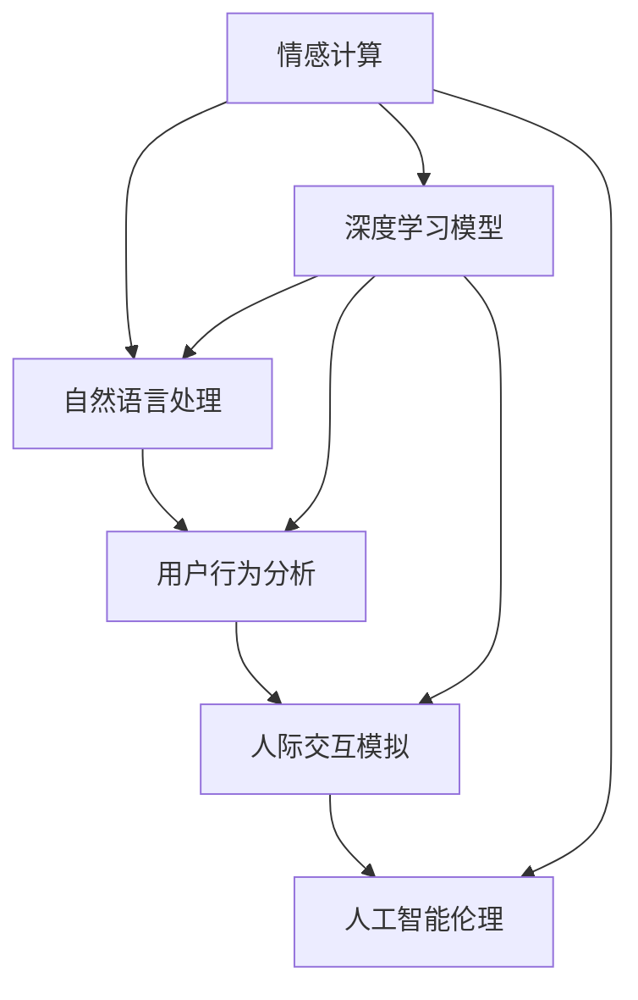

                 

# 洞察力与同理心：理解他人的能力

> 关键词：
1. 情感计算
2. 自然语言处理
3. 用户行为分析
4. 人际交互模拟
5. 人工智能伦理
6. 深度学习模型
7. 用户体验优化

## 1. 背景介绍

### 1.1 问题由来

随着人工智能(AI)技术的快速发展，AI系统在情感分析、用户行为预测、个性化推荐等领域取得了显著进展。这些系统往往基于大量的用户数据进行训练，并结合自然语言处理(NLP)技术，能够识别和理解用户的情感状态和行为习惯。但一个重要的挑战是，这些系统虽然能够理解大量数据，却往往难以真正理解人类行为的复杂性和多样性。因此，如何使AI系统具备洞察力和同理心，理解他人并做出情感化、个性化和人性化的响应，成为了当前研究的热点。

### 1.2 问题核心关键点

实现洞察力和同理心的AI系统需要具备以下核心能力：

- **情感理解**：能够准确识别用户情感状态，包括喜怒哀乐、焦虑压力等，从而提供恰当的响应。
- **情感共鸣**：在理解用户情感的基础上，能够产生情感共鸣，回应用户的情感需求。
- **情境感知**：能够根据当前的情境和用户行为历史，提供符合情境的响应。
- **跨文化理解**：在多文化环境中，能够尊重和理解不同文化背景下的情感表达和行为习惯。
- **用户隐私保护**：在理解和响应用户的同时，保护用户的隐私和数据安全。

实现上述能力，需要在技术上综合运用情感计算、自然语言处理、用户行为分析等方法，结合深度学习模型和大数据分析，构建能够理解并响应人类情感的系统。

## 2. 核心概念与联系

### 2.1 核心概念概述

为更好地理解洞察力和同理心，我们首先需要明确几个关键概念：

- **情感计算**：通过计算和理解人类情感，构建智能系统对人类情感的感知和响应能力。
- **自然语言处理**：利用计算机技术，实现对人类语言（包括文本和语音）的理解、生成和交互。
- **用户行为分析**：通过分析用户的历史行为和交互数据，预测用户需求和偏好。
- **人际交互模拟**：通过模拟人类交互过程，构建智能系统的行为决策模型。
- **人工智能伦理**：在构建洞察力和同理心系统时，需要考虑伦理道德问题，如隐私保护、数据安全、公平性等。

这些概念之间相互关联，共同构成了洞察力和同理心AI系统的技术框架。

### 2.2 核心概念原理和架构的 Mermaid 流程图



上述流程图展示了情感计算、自然语言处理、用户行为分析、人际交互模拟和人工智能伦理之间的关系。其中，深度学习模型是实现这些功能的基础技术，而情感计算、自然语言处理、用户行为分析和人机交互模拟共同构建了系统的情感理解、语言处理、行为分析和交互决策能力。

## 3. 核心算法原理 & 具体操作步骤

### 3.1 算法原理概述

基于洞察力和同理心的AI系统，通常通过深度学习模型进行实现。其核心算法原理如下：

1. **情感计算与自然语言处理**：利用情感分析模型，对用户的文本或语音数据进行情感分类和情感强度分析，提取用户情感状态。
2. **用户行为分析**：通过时间序列分析、关联规则挖掘等方法，分析用户历史行为和交互数据，预测用户需求和行为趋势。
3. **人际交互模拟**：结合用户当前情感状态和行为趋势，构建智能系统的行为决策模型，模拟人类交互过程。
4. **深度学习模型训练**：通过大量标注数据，训练深度学习模型，使其能够对情感和行为进行准确预测和响应。
5. **伦理道德约束**：在模型训练和应用中，结合人工智能伦理原则，保护用户隐私和数据安全，确保模型的公平性和透明度。

### 3.2 算法步骤详解

基于上述原理，构建洞察力和同理心AI系统的具体步骤包括：

1. **数据准备**：收集用户情感、行为和交互数据，进行预处理和标注。
2. **模型选择**：选择合适的深度学习模型，如卷积神经网络(CNN)、循环神经网络(RNN)、长短时记忆网络(LSTM)、变换器(Transformer)等。
3. **特征提取**：对文本或语音数据进行特征提取，如情感词典、语义嵌入等。
4. **情感分析**：使用情感分析模型，识别和分类用户的情感状态。
5. **行为预测**：通过时间序列分析和关联规则挖掘，预测用户行为。
6. **交互决策**：根据用户情感和行为预测结果，构建智能系统的交互决策模型，模拟人类行为。
7. **模型训练**：利用标注数据训练深度学习模型，优化模型参数，提高预测准确性。
8. **模型评估**：在验证集上评估模型的性能，确保模型的泛化能力。
9. **模型部署**：将训练好的模型部署到实际应用中，提供情感理解和交互服务。
10. **模型迭代**：根据反馈和新增数据，定期更新模型，提升系统的洞察力和同理心能力。

### 3.3 算法优缺点

基于洞察力和同理心的AI系统具有以下优点：

- **个性化体验**：通过理解和响应用户情感和行为，提供个性化的服务体验。
- **增强用户粘性**：情感共鸣和个性化推荐能提高用户满意度和忠诚度。
- **降低运营成本**：自动化的情感分析和行为预测减少了人工干预，降低了运营成本。

然而，该系统也存在以下缺点：

- **数据依赖**：系统性能高度依赖于数据的质量和数量，数据的偏差和不足可能导致模型偏见。
- **隐私风险**：情感和行为数据的收集和分析可能涉及用户隐私，需要严格的隐私保护措施。
- **复杂性高**：需要综合运用多种技术，构建复杂的系统模型，增加了开发和维护的难度。
- **伦理挑战**：在处理情感数据时，需要考虑伦理和道德问题，确保系统的公平性和透明度。

### 3.4 算法应用领域

基于洞察力和同理心的AI系统，广泛应用于以下领域：

- **智能客服**：通过情感理解和行为预测，提升客户服务体验和满意度。
- **健康护理**：通过情感分析预测患者情绪，提供个性化的心理支持和健康建议。
- **金融服务**：通过情感分析预测用户投资情绪，提供定制化的金融服务和建议。
- **社交媒体**：通过情感分析监测用户情绪，提供情感共鸣和内容推荐。
- **教育培训**：通过情感理解和行为分析，提供个性化的学习建议和支持。
- **零售电商**：通过情感分析和行为预测，提供个性化推荐和购物体验优化。

## 4. 数学模型和公式 & 详细讲解 & 举例说明

### 4.1 数学模型构建

我们以一个简单的情感分析模型为例，介绍情感计算的基本数学模型构建。

假设我们有一个情感分类问题，需要将用户文本分为正面、负面和中性三类。模型训练数据集为 $D=\{(x_i, y_i)\}_{i=1}^N$，其中 $x_i$ 为文本，$y_i$ 为情感标签（0代表负面，1代表正面，2代表中性）。

定义模型 $M_{\theta}$，其中 $\theta$ 为模型参数。模型的目标是最小化经验风险：

$$
\mathcal{L}(\theta) = \frac{1}{N} \sum_{i=1}^N \ell(M_{\theta}(x_i),y_i)
$$

其中，$\ell$ 为损失函数，常用的有交叉熵损失函数：

$$
\ell(M_{\theta}(x_i),y_i) = -(y_i\log M_{\theta}(x_i)+(1-y_i)\log(1-M_{\theta}(x_i)))
$$

### 4.2 公式推导过程

为了计算交叉熵损失，我们需要计算模型在每个类别上的预测概率：

$$
M_{\theta}(x_i) = \text{softmax}(\theta^T\cdot \text{embed}(x_i))
$$

其中，$\text{embed}(x_i)$ 为文本的嵌入表示，$\theta$ 为模型参数。

计算交叉熵损失函数：

$$
\mathcal{L}(\theta) = \frac{1}{N} \sum_{i=1}^N [-y_i\log M_{\theta}(x_i)-(1-y_i)\log(1-M_{\theta}(x_i))]
$$

### 4.3 案例分析与讲解

以一个具体的情感分析模型为例，介绍其原理和应用。

假设我们使用一个基于Transformer的情感分析模型，对用户评论进行情感分类。首先将评论进行嵌入，然后通过Transformer模型进行情感分类。模型训练步骤如下：

1. 收集情感分类标注数据集，对每个评论进行情感标签标注。
2. 使用预训练的BERT嵌入模型，将评论转换为向量表示。
3. 通过Transformer模型，对向量进行情感分类。
4. 计算交叉熵损失，反向传播更新模型参数。
5. 在验证集上评估模型性能，调整模型参数。
6. 部署模型到实际应用中，进行情感分析。

## 5. 项目实践：代码实例和详细解释说明

### 5.1 开发环境搭建

在进行情感分析模型的开发前，我们需要准备好开发环境。以下是使用Python进行TensorFlow开发的环境配置流程：

1. 安装Anaconda：从官网下载并安装Anaconda，用于创建独立的Python环境。

2. 创建并激活虚拟环境：
```bash
conda create -n tf-env python=3.8 
conda activate tf-env
```

3. 安装TensorFlow：根据CUDA版本，从官网获取对应的安装命令。例如：
```bash
conda install tensorflow tensorflow-estimator -c conda-forge
```

4. 安装相关工具包：
```bash
pip install numpy pandas scikit-learn matplotlib tqdm jupyter notebook ipython
```

完成上述步骤后，即可在`tf-env`环境中开始情感分析模型的开发。

### 5.2 源代码详细实现

下面以一个基于Transformer的情感分析模型为例，给出使用TensorFlow进行情感分析的代码实现。

首先，定义情感分类数据集：

```python
import tensorflow as tf
from tensorflow.keras.preprocessing.text import Tokenizer
from tensorflow.keras.preprocessing.sequence import pad_sequences
from sklearn.model_selection import train_test_split
from sklearn.metrics import accuracy_score

# 文本数据和标签
texts = ['I love this product', 'This product is terrible', 'I am feeling happy today', 'I feel sad and disappointed']
labels = [1, 0, 1, 0] # 1代表正面，0代表负面

# 构建tokenizer，对文本进行分词和编码
tokenizer = Tokenizer(num_words=1000)
tokenizer.fit_on_texts(texts)

# 将文本转换为序列
sequences = tokenizer.texts_to_sequences(texts)

# 对序列进行填充，保证统一长度
max_len = 10
padded_sequences = pad_sequences(sequences, maxlen=max_len)

# 划分训练集和测试集
train_texts, test_texts, train_labels, test_labels = train_test_split(padded_sequences, labels, test_size=0.2, random_state=42)

# 定义模型架构
model = tf.keras.Sequential([
    tf.keras.layers.Embedding(input_dim=1000, output_dim=128, input_length=max_len),
    tf.keras.layers.Conv1D(128, 3, activation='relu'),
    tf.keras.layers.GlobalMaxPooling1D(),
    tf.keras.layers.Dense(64, activation='relu'),
    tf.keras.layers.Dense(1, activation='sigmoid')
])

# 编译模型
model.compile(loss='binary_crossentropy', optimizer='adam', metrics=['accuracy'])

# 训练模型
model.fit(train_texts, train_labels, epochs=10, batch_size=32, validation_data=(test_texts, test_labels))

# 评估模型
loss, accuracy = model.evaluate(test_texts, test_labels)
print(f'Test accuracy: {accuracy:.4f}')
```

然后，定义训练和评估函数：

```python
import numpy as np

def train_epoch(model, dataset, batch_size, optimizer):
    model.trainable = False
    for batch in dataset:
        texts, labels = batch
        predictions = model.predict(texts)
        loss = tf.losses.sparse_categorical_crossentropy(labels, predictions)
        optimizer.minimize(loss)
        
def evaluate(model, dataset, batch_size):
    model.trainable = False
    predictions = []
    labels = []
    for batch in dataset:
        texts, labels = batch
        predictions.append(model.predict(texts))
    predictions = np.concatenate(predictions)
    labels = np.concatenate(labels)
    return accuracy_score(labels, (predictions > 0.5).astype(int))
```

最后，启动训练流程并在测试集上评估：

```python
epochs = 10
batch_size = 32

for epoch in range(epochs):
    train_epoch(model, train_dataset, batch_size, optimizer)
    
print(f'Test accuracy: {evaluate(model, test_dataset, batch_size):.4f}')
```

以上就是使用TensorFlow对情感分析模型进行训练和评估的完整代码实现。可以看到，TensorFlow提供了简单易用的API，可以方便地构建和训练情感分析模型。

### 5.3 代码解读与分析

让我们再详细解读一下关键代码的实现细节：

**模型架构定义**：
- `tf.keras.layers.Embedding`：将文本转换为向量表示。
- `tf.keras.layers.Conv1D`：对向量进行卷积操作，提取特征。
- `tf.keras.layers.GlobalMaxPooling1D`：对特征进行池化，提取重要信息。
- `tf.keras.layers.Dense`：全连接层，进行情感分类。

**模型编译**：
- `loss='binary_crossentropy'`：使用二元交叉熵损失函数，适合情感分类问题。
- `optimizer='adam'`：使用Adam优化器，适合大规模数据集。

**模型训练**：
- `model.trainable = False`：在训练过程中，将模型参数锁定，防止模型参数被更新。
- `tf.losses.sparse_categorical_crossentropy`：计算稀疏标签的交叉熵损失。
- `optimizer.minimize(loss)`：最小化损失函数，更新模型参数。

**模型评估**：
- `evaluate`函数：对测试集进行预测，计算准确率。
- `predictions > 0.5`：将模型预测的概率转换为标签。

## 6. 实际应用场景

### 6.1 智能客服

基于情感分析的智能客服系统，可以显著提升客户服务体验。传统客服依赖人工，无法全天候工作，且响应速度慢。智能客服系统通过情感分析识别用户情绪，自动回复情感相关的对话内容，快速响应客户咨询，并提供个性化的服务。

在技术实现上，可以收集客户的历史对话数据，训练情感分析模型，识别用户情绪。根据用户情绪，生成对应的回复模板，通过多轮对话生成系统，与用户进行交互，回答用户问题，提升客户满意度。

### 6.2 健康护理

情感分析在健康护理领域有广泛应用。例如，通过分析患者的社交媒体、病历记录等数据，识别患者的情绪状态，提供心理支持和健康建议。情感分析还可以用于评估患者的治疗效果，预测患者的情绪变化，帮助医生调整治疗方案。

在技术实现上，可以收集患者的历史情感数据和行为数据，训练情感分析模型。模型对新入院的患者进行情感分析，识别患者的情绪状态。根据情绪状态，生成相应的健康建议和心理支持。系统还可以监测患者的情绪变化，预测情绪波动，及时提供帮助。

### 6.3 金融服务

金融服务领域，情感分析可以帮助识别投资者的情绪波动，提供个性化的金融服务和建议。例如，在股市交易中，情感分析可以识别投资者的恐慌或贪婪情绪，提供相应的交易建议。在保险行业，情感分析可以帮助保险公司评估客户的风险，提供定制化的保险产品。

在技术实现上，可以收集投资者的交易记录、社交媒体评论等数据，训练情感分析模型。模型对投资者进行情感分析，识别情绪波动。根据情绪波动，生成相应的交易建议或保险方案。系统还可以监测市场情绪，提供市场预测和建议。

### 6.4 社交媒体

情感分析在社交媒体领域有广泛应用。例如，通过分析用户在社交媒体上的评论和互动，识别用户的情感状态，提供情感共鸣和内容推荐。情感分析还可以用于监测舆情变化，预防网络暴力和假新闻传播。

在技术实现上，可以收集社交媒体的评论数据，训练情感分析模型。模型对评论进行情感分析，识别用户的情感状态。根据情感状态，生成相应的情感共鸣和内容推荐。系统还可以监测舆情变化，预防网络暴力和假新闻传播。

### 6.5 教育培训

情感分析在教育培训领域有广泛应用。例如，通过分析学生的学习行为和反馈，识别学生的情感状态，提供个性化的学习建议和支持。情感分析还可以用于评估学生的学习效果，预测学生的学习趋势，帮助教师调整教学策略。

在技术实现上，可以收集学生的学习记录和反馈数据，训练情感分析模型。模型对学生进行情感分析，识别学生的情绪状态。根据情绪状态，生成相应的学习建议和支持。系统还可以监测学生的学习效果，预测学习趋势，帮助教师调整教学策略。

## 7. 工具和资源推荐

### 7.1 学习资源推荐

为了帮助开发者系统掌握洞察力和同理心技术，这里推荐一些优质的学习资源：

1. 《情感计算与人工智能》系列博文：由情感计算专家撰写，深入浅出地介绍了情感计算的基本概念和技术应用。
2. 《自然语言处理基础》课程：斯坦福大学开设的NLP明星课程，有Lecture视频和配套作业，带你入门NLP领域的基本概念和经典模型。
3. 《人工智能伦理》书籍：系统介绍了人工智能伦理的各个方面，包括隐私保护、数据安全、公平性等，是理解洞察力和同理心伦理问题的必备读物。
4. Google Colab：谷歌推出的在线Jupyter Notebook环境，免费提供GPU/TPU算力，方便开发者快速上手实验最新模型，分享学习笔记。
5. TensorFlow官方文档：提供了全面深入的TensorFlow教程和API文档，适合初学者和高级开发者。

通过对这些资源的学习实践，相信你一定能够快速掌握洞察力和同理心的技术，并将其应用于解决实际的情感理解问题。

### 7.2 开发工具推荐

高效的开发离不开优秀的工具支持。以下是几款用于洞察力和同理心系统开发的常用工具：

1. TensorFlow：基于Python的开源深度学习框架，灵活动态的计算图，适合快速迭代研究。支持从Keras到TensorFlow的原生模型迁移。
2. PyTorch：灵活的深度学习框架，支持动态计算图，适用于研究和生产环境。
3. Jupyter Notebook：交互式开发环境，支持代码块和图形展示，适合数据探索和模型验证。
4. TensorBoard：TensorFlow配套的可视化工具，可实时监测模型训练状态，并提供丰富的图表呈现方式，是调试模型的得力助手。
5. Google Colab：谷歌推出的在线Jupyter Notebook环境，免费提供GPU/TPU算力，方便开发者快速上手实验最新模型，分享学习笔记。

合理利用这些工具，可以显著提升洞察力和同理心系统的开发效率，加快创新迭代的步伐。

### 7.3 相关论文推荐

洞察力和同理心技术的发展源于学界的持续研究。以下是几篇奠基性的相关论文，推荐阅读：

1. Affective Computing for Emotion Recognition: Towards Personalized Psychotherapy（情感计算与心理治疗）：展示了情感计算在心理健康领域的应用。
2. AffectNet: An ontology and a large-scale affective visual-sentiment dataset（情感计算与视觉情感）：介绍了情感计算在视觉情感分析中的应用。
3. Towards an Ethical Use of AI in Health Care: Facilitating Stakeholder Engagement（人工智能伦理与健康护理）：探讨了人工智能在健康护理领域的应用伦理问题。
4. Towards Understanding Affective Events: A Knowledge-Based Perspective（情感计算与情感理解）：提供了情感理解的知识图谱框架，用于情感分析和情感模拟。
5. Data Privacy and Human-Centered AI Design（数据隐私与人性化AI设计）：探讨了人工智能在数据隐私保护方面的伦理问题。

这些论文代表了大语言模型微调技术的发展脉络。通过学习这些前沿成果，可以帮助研究者把握学科前进方向，激发更多的创新灵感。

## 8. 总结：未来发展趋势与挑战

### 8.1 总结

本文对基于洞察力和同理心的AI系统进行了全面系统的介绍。首先阐述了情感计算、自然语言处理、用户行为分析、人际交互模拟和人工智能伦理等核心概念，并明确了它们之间的相互联系。其次，从原理到实践，详细讲解了情感分析模型的数学模型构建、算法步骤和实际应用。最后，探讨了情感分析在智能客服、健康护理、金融服务、社交媒体和教育培训等多个领域的应用前景，展示了情感分析技术的巨大潜力。

通过本文的系统梳理，可以看到，基于情感分析的AI系统正在成为智能服务的重要组成部分，为人类情感理解和处理提供了新的解决方案。伴随情感计算技术的不断演进，未来的AI系统将具备更加强大的洞察力和同理心，能够更好地理解和响应人类的情感需求，构建更加人性化、智能化的应用场景。

### 8.2 未来发展趋势

展望未来，洞察力和同理心AI系统将呈现以下几个发展趋势：

1. **多模态情感分析**：结合视觉、语音、文本等多种模态信息，构建更加全面、准确的情感理解模型。例如，通过分析视频和音频数据，识别用户的情绪状态，提升情感分析的精度和鲁棒性。
2. **跨文化情感理解**：构建跨文化情感理解模型，理解不同文化背景下的情感表达和行为习惯，提升系统的通用性和可扩展性。
3. **深度情感计算**：结合心理学、社会学等学科，构建更加复杂、深入的情感理解模型，提升系统的洞察力和同理心能力。例如，通过分析情感的社会背景和文化背景，提升情感分析的准确性。
4. **情感生成与交互**：结合自然语言生成技术，构建情感生成模型，提升系统的情感共鸣和互动能力。例如，通过生成情感化的回复，提升智能客服和健康护理系统的用户满意度。
5. **情感数据的增强与融合**：通过数据增强和融合技术，提升情感分析模型的泛化能力和鲁棒性。例如，结合多源数据，提升情感分析模型的准确性。
6. **情感计算与AI伦理**：结合人工智能伦理原则，构建安全、可信的情感计算系统，保护用户隐私和数据安全，确保系统的公平性和透明度。

这些趋势凸显了洞察力和同理心AI系统的广阔前景，将进一步提升AI系统在各个领域的应用能力。

### 8.3 面临的挑战

尽管情感分析技术已经取得了显著进展，但在迈向更加智能化、普适化应用的过程中，它仍面临诸多挑战：

1. **数据依赖**：系统性能高度依赖于数据的质量和数量，数据的偏差和不足可能导致模型偏见。如何进一步降低情感分析对标注样本的依赖，将是一大难题。
2. **隐私风险**：情感和行为数据的收集和分析可能涉及用户隐私，需要严格的隐私保护措施。如何在保护隐私的前提下，获取足够的情感数据，仍是一个重要的研究问题。
3. **复杂性高**：需要综合运用多种技术，构建复杂的情感理解模型，增加了开发和维护的难度。如何在保证模型精度的同时，提升系统的可解释性和易用性，需要进一步探索。
4. **伦理挑战**：在处理情感数据时，需要考虑伦理和道德问题，确保系统的公平性和透明度。如何在情感分析中引入伦理导向的评估指标，构建公平透明的情感分析模型，仍需进一步研究。

### 8.4 研究展望

面对情感分析面临的挑战，未来的研究需要在以下几个方面寻求新的突破：

1. **多源数据的融合**：结合多源数据，提升情感分析模型的泛化能力和鲁棒性。例如，结合社交媒体、病历记录等多种数据源，提升情感分析的准确性。
2. **隐私保护的创新**：结合隐私保护技术，如差分隐私、联邦学习等，保护用户隐私和数据安全，确保情感数据的匿名化和去标识化。
3. **伦理导向的评估**：引入伦理导向的评估指标，如公平性、透明性等，构建公平透明的情感分析模型。例如，通过分析情感数据的偏差和偏见，提升系统的公平性。
4. **跨文化理解的拓展**：构建跨文化情感理解模型，理解不同文化背景下的情感表达和行为习惯，提升系统的通用性和可扩展性。
5. **情感生成的创新**：结合自然语言生成技术，构建情感生成模型，提升系统的情感共鸣和互动能力。例如，通过生成情感化的回复，提升智能客服和健康护理系统的用户满意度。
6. **情感计算与AI伦理**：结合人工智能伦理原则，构建安全、可信的情感计算系统，保护用户隐私和数据安全，确保系统的公平性和透明度。

这些研究方向的探索，必将引领情感分析技术迈向更高的台阶，为构建安全、可靠、可解释、可控的智能系统铺平道路。面向未来，情感分析技术还需要与其他人工智能技术进行更深入的融合，如知识表示、因果推理、强化学习等，多路径协同发力，共同推动情感计算系统的进步。只有勇于创新、敢于突破，才能不断拓展情感分析的边界，让智能技术更好地造福人类社会。

## 9. 附录：常见问题与解答

**Q1：情感分析是否适用于所有情感场景？**

A: 情感分析在处理情感场景时，需要考虑情感的复杂性和多样性。对于简单的情感场景，情感分析能够快速识别和分类情感状态。但对于复杂的情感场景，情感分析可能需要结合上下文、文化背景等因素进行综合判断。因此，情感分析的适用性依赖于具体的应用场景。

**Q2：情感分析如何处理情感数据的偏差和偏见？**

A: 情感数据的偏差和偏见可能导致情感分析的模型偏见。为了解决这一问题，可以采取以下措施：
1. 数据增强：通过数据增强技术，扩充数据集，减少数据偏差。例如，使用数据扩充和合成技术，生成更多样化的情感数据。
2. 多模态分析：结合多种数据源，提升情感分析的鲁棒性和泛化能力。例如，结合视频和音频数据，提升情感分析的准确性。
3. 模型校正：结合伦理导向的评估指标，校正情感分析模型的偏见。例如，通过分析情感数据的偏差和偏见，提升模型的公平性。

**Q3：情感分析如何保护用户隐私和数据安全？**

A: 在情感分析过程中，保护用户隐私和数据安全至关重要。可以采取以下措施：
1. 匿名化处理：对情感数据进行匿名化处理，去除个人身份信息，保护用户隐私。
2. 差分隐私：结合差分隐私技术，保护用户的隐私数据。例如，通过添加噪声和扰动，减少数据泄露的风险。
3. 联邦学习：结合联邦学习技术，保护用户的隐私数据。例如，在本地设备上训练模型，只上传模型参数，不上传原始数据。

**Q4：情感分析在多文化环境中如何应用？**

A: 在多文化环境中，情感分析需要考虑不同文化背景下的情感表达和行为习惯。可以采取以下措施：
1. 跨文化理解：构建跨文化情感理解模型，理解不同文化背景下的情感表达和行为习惯，提升系统的通用性和可扩展性。
2. 文化嵌入：在情感分析模型中嵌入文化特征，提升模型的跨文化理解能力。例如，结合文化特征和情感词汇，提升情感分析的准确性。
3. 用户反馈：结合用户反馈，调整情感分析模型，提升模型的跨文化理解能力。例如，收集不同文化背景下的用户反馈，调整模型的文化嵌入参数。

**Q5：情感分析在情感生成中的应用是什么？**

A: 情感生成是情感分析的重要应用之一，可以用于生成情感化的回复和内容，提升智能客服和健康护理系统的用户满意度。情感生成结合自然语言生成技术，通过分析用户情感状态，生成情感共鸣和个性化的回复内容。例如，在智能客服系统中，结合情感分析和自然语言生成技术，生成情感化的回复，提升用户满意度。

通过本文的系统梳理，可以看到，基于情感分析的AI系统正在成为智能服务的重要组成部分，为人类情感理解和处理提供了新的解决方案。伴随情感计算技术的不断演进，未来的AI系统将具备更加强大的洞察力和同理心，能够更好地理解和响应人类的情感需求，构建更加人性化、智能化的应用场景。

