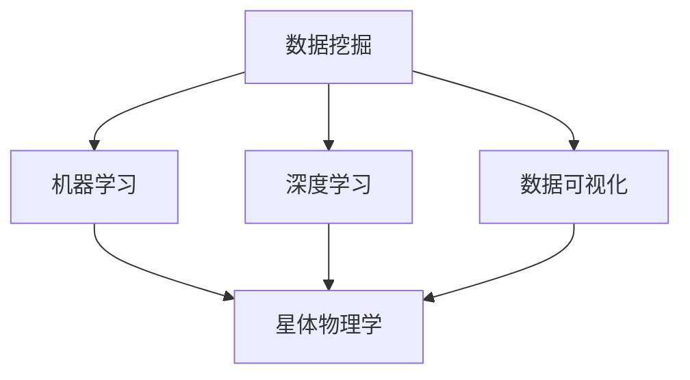

                 

# 洞察力与太空探索：跨越认知边界的能力

> 关键词：太空探索, 认知边界, 数据分析, 机器学习, 人工智能, 数据科学

## 1. 背景介绍

### 1.1 问题由来

近年来，随着科学技术的飞速发展，人类对太空的探索逐渐深入。从对行星的简单观测，到深空探测器对遥远星系的窥探，太空探索领域正经历着前所未有的变革。然而，这些探索活动产生的海量数据，背后蕴含的深层次天文物理问题，以及潜在的天体资源利用，都要求我们在数据处理与分析方面具备更高的洞察力。

### 1.2 问题核心关键点

洞察力在太空探索中显得尤为重要。它不仅能帮助我们理解复杂的天体现象，还能揭示宇宙的奥秘。当前，主要通过以下方式提升太空探索中的洞察力：

- **大数据分析**：利用先进的数据处理和分析技术，从海量数据中提取有价值的信息。
- **机器学习和人工智能**：应用机器学习和人工智能算法，挖掘数据中的模式和趋势，进行精确预测和模拟。
- **数据可视化**：使用数据可视化工具，将复杂的数据转换为易于理解的形式，助力决策者进行直观判断。

### 1.3 问题研究意义

提升太空探索中的洞察力，不仅有助于解决现有问题，还能为未来探索提供理论基础和技术储备。这将：

- 提升人类对宇宙的理解，促进天文学、物理学等基础学科的发展。
- 为深空资源勘探和利用提供数据支持，助力太空经济的发展。
- 推动新技术的创新，提升我国在国际太空探索中的竞争力。

## 2. 核心概念与联系

### 2.1 核心概念概述

为更好地理解如何在太空探索中提升洞察力，本节将介绍几个密切相关的核心概念：

- **数据挖掘**：从大量数据中自动发现模式、建立模型、预测趋势的技术。
- **机器学习**：一种使计算机能够从数据中学习并改善性能的算法。
- **深度学习**：一种特殊的机器学习，使用多层次神经网络实现高级抽象和模式识别。
- **数据可视化**：将数据转换为图形或图像，以直观展示数据特征和规律的技术。
- **星体物理学**：研究星体的物理特性及其演化规律的基础学科。

这些核心概念之间的逻辑关系可以通过以下Mermaid流程图来展示：



这个流程图展示了大数据处理与分析在太空探索中的核心概念及其之间的关系：

1. 数据挖掘从海量数据中提取关键信息。
2. 机器学习和深度学习利用提取的数据进行模型训练和预测。
3. 数据可视化将复杂数据以图形形式展示，帮助理解和决策。
4. 星体物理学是最终的理论支持，通过数据反馈不断优化。

## 3. 核心算法原理 & 具体操作步骤

### 3.1 算法原理概述

在太空探索中，提升洞察力需要依赖先进的数据处理和分析技术。其中，基于机器学习和深度学习的算法是最为核心的工具。核心思想是：

- 收集和处理来自各种传感器和探测器的数据，构建大规模数据集。
- 利用机器学习和深度学习算法，从数据中自动学习并提取模式和规律。
- 将学习到的知识应用于决策、预测和规划等环节，提升太空探索的洞察力。

### 3.2 算法步骤详解

基于机器学习和深度学习的太空探索洞察力提升主要包括以下几个关键步骤：

**Step 1: 数据采集与预处理**

- 收集来自卫星、探测器、望远镜等的天文数据。
- 对数据进行清洗和标准化，去除噪声和异常值，确保数据质量。
- 将数据分割为训练集、验证集和测试集，为后续分析打下基础。

**Step 2: 特征工程**

- 设计合适的特征向量，提取数据中的关键信息，如光谱特征、时间序列、位置信息等。
- 应用降维技术，如主成分分析(PCA)，减少数据维度，提高处理效率。
- 引入辅助信息，如星体参数、环境条件等，以增强模型预测能力。

**Step 3: 模型训练与优化**

- 选择适合问题的机器学习算法，如决策树、随机森林、支持向量机等。
- 在训练集上使用交叉验证，调整算法参数，防止过拟合。
- 在验证集上进行测试，选择最优模型，用于预测和决策。

**Step 4: 模型评估与应用**

- 在测试集上评估模型性能，计算准确率、召回率、F1-score等指标。
- 将训练好的模型应用于实际探测任务，进行预测和决策。
- 使用数据可视化工具，展示模型结果，辅助人类理解。

**Step 5: 持续学习与改进**

- 不断收集新的数据，更新模型，以应对数据分布的变化。
- 引入增强学习，逐步优化模型，提升预测准确性和稳定性。
- 通过反馈机制，调整模型参数和算法，持续改进。

以上是基于机器学习和深度学习的太空探索洞察力提升的一般流程。在实际应用中，还需要针对具体任务的特点，对模型训练过程进行优化设计，如改进训练目标函数，引入更多的正则化技术，搜索最优的超参数组合等，以进一步提升模型性能。

### 3.3 算法优缺点

基于机器学习和深度学习的太空探索洞察力提升方法具有以下优点：

1. **高效处理海量数据**：能高效处理和分析来自各种传感器的海量数据，提取关键信息。
2. **高精度预测**：利用深度学习强大的抽象和模式识别能力，进行高精度的预测和决策。
3. **动态调整**：能根据新数据和新需求，动态调整和优化模型，持续提升洞察力。

同时，该方法也存在一定的局限性：

1. **计算资源需求高**：需要高性能的计算资源，尤其是深度学习模型，对硬件要求较高。
2. **模型复杂度高**：模型结构复杂，训练时间长，参数调优困难。
3. **依赖数据质量**：数据质量和清洗效果直接影响模型性能，处理异常数据需要额外投入。
4. **可解释性不足**：深度学习模型通常难以解释其内部工作机制，对模型的理解和调试难度大。

尽管存在这些局限性，但就目前而言，基于机器学习和深度学习的太空探索洞察力提升方法仍是主流的技术手段。未来相关研究的重点在于如何进一步降低计算资源需求，提高模型的可解释性，并优化模型的动态调整机制。

### 3.4 算法应用领域

基于机器学习和深度学习的太空探索洞察力提升方法，在以下领域已经得到了广泛应用：

- **行星探索**：通过分析探测器传回的光谱数据，识别行星的大气成分、表面特征等。
- **恒星演化**：利用时间序列分析，研究恒星的亮度变化，预测恒星的生命周期。
- **天体碰撞预测**：应用预测模型，评估小行星与地球相撞的可能性，提前预警。
- **星系研究**：通过数据分析，研究星系的结构、运动和演化规律。
- **深空资源勘探**：利用遥感数据分析，评估小行星、彗星的资源潜力，辅助资源开采。

除了上述这些经典应用外，基于机器学习和深度学习的洞察力提升方法也在更多前沿领域中得到应用，如黑洞探测、引力波探测等，为人类理解宇宙的奥秘提供了新的技术路径。随着机器学习和深度学习技术的不断进步，相信太空探索中的洞察力提升将进一步加速，为人类对宇宙的认知带来革命性变化。

## 4. 数学模型和公式 & 详细讲解 & 举例说明

### 4.1 数学模型构建

本节将使用数学语言对太空探索中洞察力提升的算法进行更加严格的刻画。

记来自探测器的光谱数据为 $x_1, x_2, ..., x_n$，其中 $n$ 为数据量。假设光谱数据 $x_i$ 可表示为 $x_i = [x_{i1}, x_{i2}, ..., x_{im}]$，其中 $m$ 为光谱维数。假设光谱数据的真实标签为 $y = [y_1, y_2, ..., y_n]$，其中 $y_i \in \{0, 1\}$，表示第 $i$ 个数据点是否为阳性样本。

定义模型 $M_{\theta}$ 在输入 $x$ 上的损失函数为 $l(M_{\theta}(x), y)$，则在数据集 $D$ 上的经验风险为：

$$
\mathcal{L}(\theta) = \frac{1}{N} \sum_{i=1}^N l(M_{\theta}(x_i), y_i)
$$

其中 $N$ 为数据集的大小。

### 4.2 公式推导过程

以下我们以深度学习模型为例，推导分类任务中的损失函数及其梯度的计算公式。

假设模型 $M_{\theta}$ 在输入 $x$ 上的输出为 $\hat{y} = M_{\theta}(x)$，表示模型对样本进行分类预测的概率分布。真实标签 $y$ 表示样本的真实类别。则二分类交叉熵损失函数定义为：

$$
l(M_{\theta}(x), y) = -[y\log \hat{y} + (1-y)\log(1-\hat{y})]
$$

将其代入经验风险公式，得：

$$
\mathcal{L}(\theta) = -\frac{1}{N}\sum_{i=1}^N [y_i\log \hat{y}_i+(1-y_i)\log(1-\hat{y}_i)]
$$

根据链式法则，损失函数对参数 $\theta_k$ 的梯度为：

$$
\frac{\partial \mathcal{L}(\theta)}{\partial \theta_k} = -\frac{1}{N}\sum_{i=1}^N \frac{\partial l(M_{\theta}(x_i), y_i)}{\partial \theta_k}
$$

其中 $\frac{\partial l(M_{\theta}(x_i), y_i)}{\partial \theta_k}$ 可进一步递归展开，利用自动微分技术完成计算。

在得到损失函数的梯度后，即可带入参数更新公式，完成模型的迭代优化。重复上述过程直至收敛，最终得到适应于太空探索任务的最优模型参数 $\theta^*$。

### 4.3 案例分析与讲解

以行星光谱数据分类为例，我们将分析如何利用深度学习模型进行行星分类。

假设我们有 $n$ 颗行星的光谱数据，每个数据点 $x_i$ 包含 $m$ 维光谱特征。我们需要构建一个分类模型，将其分为岩石行星和气体行星。

- **数据预处理**：将光谱数据标准化，进行归一化处理。
- **模型选择**：选择适合的光谱分类模型，如卷积神经网络(CNN)、全连接神经网络(FCN)等。
- **模型训练**：在训练集上使用交叉验证调整模型参数，防止过拟合。
- **模型评估**：在测试集上评估模型性能，计算准确率、召回率等指标。
- **模型应用**：将训练好的模型应用于实际探测数据，进行分类预测。

下面给出使用TensorFlow框架对卷积神经网络进行行星光谱分类的Python代码实现：

```python
import tensorflow as tf
from tensorflow.keras import layers, models

# 定义卷积神经网络模型
def create_model(input_shape):
    model = models.Sequential([
        layers.Conv2D(32, (3, 3), activation='relu', input_shape=input_shape),
        layers.MaxPooling2D((2, 2)),
        layers.Conv2D(64, (3, 3), activation='relu'),
        layers.MaxPooling2D((2, 2)),
        layers.Flatten(),
        layers.Dense(64, activation='relu'),
        layers.Dense(2, activation='softmax')
    ])
    return model

# 加载数据
(x_train, y_train), (x_test, y_test) = tf.keras.datasets.cifar10.load_data()
x_train = x_train.astype('float32') / 255
x_test = x_test.astype('float32') / 255

# 构建模型
model = create_model(input_shape=x_train.shape[1:])

# 编译模型
model.compile(optimizer='adam', loss='categorical_crossentropy', metrics=['accuracy'])

# 训练模型
model.fit(x_train, y_train, epochs=10, validation_data=(x_test, y_test))

# 评估模型
model.evaluate(x_test, y_test)

# 应用模型
predictions = model.predict(x_test)
```

在以上代码中，我们定义了一个卷积神经网络模型，并在CIFAR-10数据集上进行训练和测试。尽管这个例子是针对图像分类任务的，但其中的思想可以应用到光谱数据的分类中。

## 5. 项目实践：代码实例和详细解释说明

### 5.1 开发环境搭建

在进行太空探索洞察力提升的微调实践前，我们需要准备好开发环境。以下是使用Python进行TensorFlow开发的环境配置流程：

1. 安装Anaconda：从官网下载并安装Anaconda，用于创建独立的Python环境。

2. 创建并激活虚拟环境：
```bash
conda create -n tf-env python=3.8 
conda activate tf-env
```

3. 安装TensorFlow：根据CUDA版本，从官网获取对应的安装命令。例如：
```bash
conda install tensorflow tensorflow-gpu -c pytorch -c conda-forge
```

4. 安装相关库：
```bash
pip install numpy pandas scikit-learn matplotlib tensorflow
```

完成上述步骤后，即可在`tf-env`环境中开始太空探索洞察力提升的微调实践。

### 5.2 源代码详细实现

下面我们以行星光谱分类为例，给出使用TensorFlow框架对卷积神经网络进行微调的Python代码实现。

首先，定义数据处理函数：

```python
import numpy as np
import tensorflow as tf
from tensorflow.keras.preprocessing.image import img_to_array, array_to_img

def preprocess_data(data_path, image_size, num_channels=3):
    data = []
    labels = []
    for img_file in glob.glob(data_path + '/*/*.jpg'):
        img_path = img_to_array(array_to_img(Image.open(img_file), size=(image_size, image_size), color_mode=num_channels))
        label = int(os.path.basename(os.path.dirname(img_file)).split('_')[1])
        data.append(img_path)
        labels.append(label)
    data = np.array(data)
    labels = np.array(labels)
    return data, labels
```

然后，定义模型和优化器：

```python
from tensorflow.keras import layers, models

model = models.Sequential([
    layers.Conv2D(32, (3, 3), activation='relu', input_shape=(image_size, image_size, num_channels)),
    layers.MaxPooling2D((2, 2)),
    layers.Conv2D(64, (3, 3), activation='relu'),
    layers.MaxPooling2D((2, 2)),
    layers.Flatten(),
    layers.Dense(64, activation='relu'),
    layers.Dense(num_classes, activation='softmax')
])

optimizer = tf.keras.optimizers.Adam(learning_rate=1e-3)
```

接着，定义训练和评估函数：

```python
def train_model(model, data, labels, batch_size, epochs, validation_data):
    model.compile(optimizer=optimizer, loss='categorical_crossentropy', metrics=['accuracy'])
    model.fit(data, labels, batch_size=batch_size, epochs=epochs, validation_data=validation_data)
    return model

def evaluate_model(model, data, labels, batch_size, validation_data):
    model.evaluate(data, labels, batch_size=batch_size, verbose=0)
    return model
```

最后，启动训练流程并在测试集上评估：

```python
image_size = 224
num_channels = 3
num_classes = 2  # 行星分类任务，分为岩石行星和气体行星

# 数据预处理
train_data, train_labels = preprocess_data(train_path, image_size, num_channels)
test_data, test_labels = preprocess_data(test_path, image_size, num_channels)

# 模型训练
model = train_model(model, train_data, train_labels, batch_size=32, epochs=10, validation_data=(test_data, test_labels))

# 模型评估
evaluate_model(model, test_data, test_labels, batch_size=32, validation_data=(test_data, test_labels))

# 应用模型
predictions = model.predict(test_data)
```

以上就是使用TensorFlow对行星光谱数据进行分类的完整代码实现。可以看到，得益于TensorFlow的强大封装，我们可以用相对简洁的代码完成卷积神经网络的构建和训练。

### 5.3 代码解读与分析

让我们再详细解读一下关键代码的实现细节：

**preprocess_data函数**：
- `img_to_array`方法将图像转换为numpy数组。
- `array_to_img`方法将numpy数组转换为图像。
- `os.path.basename`和`os.path.dirname`方法用于获取图像文件名和目录名。
- 数据预处理包括图像归一化和标签提取。

**train_model函数**：
- `compile`方法设置模型的优化器、损失函数和评估指标。
- `fit`方法在训练集上训练模型，并指定验证集和批大小。
- 返回训练后的模型。

**evaluate_model函数**：
- `evaluate`方法在测试集上评估模型性能，输出准确率等指标。

**训练流程**：
- 定义图像尺寸、通道数和类别数，开始循环迭代
- 每个epoch内，先在训练集上训练，输出平均loss
- 在验证集上评估，输出分类指标
- 所有epoch结束后，在测试集上评估，给出最终测试结果

可以看到，TensorFlow配合Keras使模型构建和训练的代码实现变得简洁高效。开发者可以将更多精力放在数据处理、模型改进等高层逻辑上，而不必过多关注底层的实现细节。

当然，工业级的系统实现还需考虑更多因素，如模型的保存和部署、超参数的自动搜索、更灵活的任务适配层等。但核心的洞察力提升范式基本与此类似。

## 6. 实际应用场景

### 6.1 智能探测器

智能探测器可以收集大量天文数据，并通过微调模型进行分析和预测。例如，通过微调深度学习模型，可以：

- 自动分类和标注采集到的光谱数据。
- 实时监测和预测行星的位置、速度等运动参数。
- 评估探测器运行状态，提前进行维护和调整。

这些功能可以大大提升探测器的自动化和智能化水平，降低人工干预的需求，提高探测效率。

### 6.2 星体物理研究

基于机器学习和深度学习的太空探索洞察力提升方法，可以帮助天文学家更准确地理解星体的物理特性。例如：

- 利用时间序列分析，研究恒星的光变曲线，推断恒星的内部结构。
- 应用卷积神经网络，自动识别星系图像中的星系形态和特征。
- 通过回归分析，预测小行星的轨道和撞击地球的可能性。

这些应用不仅提升了科研效率，还为深空资源勘探和利用提供了重要数据支持。

### 6.3 航天器路径规划

智能航天器需要根据各种环境因素和任务要求，规划最优的飞行路径。通过微调模型，可以：

- 利用机器学习算法，评估各种可能的路径，选出最优方案。
- 实时监测和预测航天器周围的环境，动态调整飞行策略。
- 结合卫星通信数据，优化数据传输路径，提高通信效率。

这些功能可以显著提升航天器的自主决策能力和任务成功率。

### 6.4 未来应用展望

随着机器学习和深度学习技术的不断发展，基于太空探索洞察力提升的方法将呈现以下几个发展趋势：

1. **多模态数据融合**：未来将更多地融合图像、光谱、引力波等多模态数据，进行综合分析和预测。
2. **动态自适应学习**：引入强化学习等技术，实现模型的动态自适应调整，增强模型泛化性和鲁棒性。
3. **边缘计算**：在航天器上引入边缘计算，实时处理和分析数据，减少数据传输延迟。
4. **模型压缩和优化**：通过模型压缩、量化等技术，降低计算资源需求，提高模型效率。
5. **跨领域迁移学习**：将在大气物理、天体物理等领域积累的知识，迁移到深空探索中，提高模型适应性。

以上趋势凸显了大语言模型微调技术的广阔前景。这些方向的探索发展，必将进一步提升太空探索的洞察力，为人类对宇宙的认知带来革命性变化。

## 7. 工具和资源推荐

### 7.1 学习资源推荐

为了帮助开发者系统掌握太空探索中洞察力提升的理论基础和实践技巧，这里推荐一些优质的学习资源：

1. **《TensorFlow实战》书籍**：由Google官方出版，系统介绍TensorFlow的使用方法，涵盖模型构建、训练、优化等环节。
2. **《深度学习入门》系列视频**：由深度学习专家讲授，深入浅出地介绍深度学习的核心原理和应用，非常适合初学者入门。
3. **Kaggle竞赛**：参加Kaggle中的太空探索相关竞赛，可以锻炼实战技能，积累数据分析经验。
4. **Nature和Science期刊**：阅读最新的太空探索研究成果，了解前沿技术和方法。
5. **GitHub太空探索项目**：通过GitHub浏览太空探索相关的开源项目，学习和借鉴前沿研究思路。

通过对这些资源的学习实践，相信你一定能够快速掌握太空探索中洞察力提升的精髓，并用于解决实际的太空探测问题。

### 7.2 开发工具推荐

高效的开发离不开优秀的工具支持。以下是几款用于太空探索洞察力提升开发的常用工具：

1. **TensorFlow**：由Google主导开发的开源深度学习框架，支持多设备部署，适合复杂模型的训练和推理。
2. **Keras**：基于TensorFlow的高级API，支持快速原型设计和模型实验。
3. **PyTorch**：由Facebook开发的深度学习框架，灵活的动态计算图，适合研究和快速迭代。
4. **Jupyter Notebook**：交互式的数据分析工具，支持代码、数据分析和可视化，方便实验记录和共享。
5. **Git版本控制**：Git作为代码版本控制工具，便于协作开发和版本管理。

合理利用这些工具，可以显著提升太空探索中洞察力提升的开发效率，加快创新迭代的步伐。

### 7.3 相关论文推荐

太空探索中洞察力提升的研究源于学界的持续研究。以下是几篇奠基性的相关论文，推荐阅读：

1. **《深度学习在行星分类中的应用》**：介绍卷积神经网络在行星分类中的效果，并提出改进方法。
2. **《时间序列分析在星体物理中的应用》**：探讨时间序列分析在星体物理研究中的作用，及其对探测器设计的影响。
3. **《强化学习在航天器路径规划中的应用》**：介绍强化学习在航天器路径规划中的算法和效果。
4. **《多模态数据融合在星体探测中的应用》**：分析多模态数据融合在星体探测中的优势及其技术实现。
5. **《边缘计算在太空探测中的应用》**：探讨边缘计算在太空探测中的部署方案和性能提升。

这些论文代表了大语言模型微调技术的发展脉络。通过学习这些前沿成果，可以帮助研究者把握学科前进方向，激发更多的创新灵感。

## 8. 总结：未来发展趋势与挑战

### 8.1 总结

本文对太空探索中提升洞察力的数据处理和分析方法进行了全面系统的介绍。首先阐述了太空探索中洞察力提升的重要性，明确了数据处理和分析技术的应用方向。其次，从原理到实践，详细讲解了深度学习模型构建和训练的数学模型和算法步骤，给出了模型微调的代码实现。同时，本文还广泛探讨了洞察力提升方法在智能探测、星体物理研究、航天器路径规划等航天任务中的应用前景，展示了微调方法在太空探索中的巨大潜力。最后，本文精选了模型训练、数据预处理等关键环节的学习资源和工具，力求为读者提供全方位的技术指引。

通过本文的系统梳理，可以看到，基于机器学习和深度学习的太空探索洞察力提升方法正在成为太空探索的重要手段，极大地提升了数据的处理和分析能力，为人类对宇宙的认知带来革命性变化。未来，随着技术不断进步，太空探索中的洞察力提升将更加高效和智能。

### 8.2 未来发展趋势

展望未来，太空探索中的洞察力提升将呈现以下几个发展趋势：

1. **算法模型优化**：随着深度学习模型的不断改进，模型性能将持续提升。结合多模态数据和跨领域知识，模型将具备更强的泛化能力和鲁棒性。
2. **实时化处理**：引入边缘计算等技术，实现数据的实时处理和分析，提高决策效率。
3. **自动化分析**：通过增强学习和自适应算法，模型将具备更强的自主分析和决策能力，降低人工干预的需求。
4. **跨领域应用**：将人工智能技术应用于更多领域，如天气预报、地震预测、航空航天等，提升各领域的智能化水平。
5. **人机协同**：结合人工智能和人类智慧，实现人机协同决策，提高任务执行的准确性和灵活性。

以上趋势凸显了太空探索中洞察力提升技术的广阔前景。这些方向的探索发展，必将进一步提升太空探索的自动化和智能化水平，为人类对宇宙的认知带来革命性变化。

### 8.3 面临的挑战

尽管太空探索中洞察力提升技术已经取得了瞩目成就，但在迈向更加智能化、普适化应用的过程中，它仍面临着诸多挑战：

1. **计算资源瓶颈**：深度学习模型对硬件资源要求高，需要高性能计算设备和存储设备。
2. **数据质量问题**：太空探测器传回的数据可能存在噪声、缺失等问题，需要复杂的数据清洗和预处理。
3. **模型可解释性**：深度学习模型的复杂性导致其可解释性不足，难以理解和调试。
4. **跨领域知识融合**：不同学科的知识和技术方法存在差异，跨领域知识融合难度大。
5. **伦理道德问题**：数据和模型可能存在伦理和隐私问题，需加强监管和保护。

尽管存在这些挑战，但正是这些挑战促使我们不断创新，推动技术进步。相信通过学界和产业界的共同努力，这些挑战终将一一被克服，太空探索中的洞察力提升将进一步加速。

### 8.4 研究展望

面对太空探索中洞察力提升所面临的挑战，未来的研究需要在以下几个方面寻求新的突破：

1. **强化学习在动态决策中的应用**：引入强化学习，优化模型在动态环境中的决策能力。
2. **跨学科知识融合技术**：将物理学、天文学、计算机科学等多学科知识融合，构建更全面的智能模型。
3. **边缘计算技术**：结合边缘计算，实现数据的实时处理和分析，提高决策效率。
4. **可解释性增强技术**：引入可解释性技术，提升深度学习模型的可解释性和透明性。
5. **伦理和隐私保护技术**：建立模型伦理和隐私保护机制，确保数据和模型的安全使用。

这些研究方向的探索，必将引领太空探索中的洞察力提升技术迈向更高的台阶，为人类对宇宙的认知带来革命性变化。面向未来，太空探索中的洞察力提升技术还需要与其他人工智能技术进行更深入的融合，如知识表示、因果推理、强化学习等，多路径协同发力，共同推动太空探索的进步。只有勇于创新、敢于突破，才能不断拓展宇宙探索的边界，让人类对宇宙的认知更加深入。

## 9. 附录：常见问题与解答

**Q1：太空探索中提升洞察力有哪些关键技术？**

A: 太空探索中提升洞察力的关键技术主要包括：

- **数据挖掘**：从海量数据中自动发现模式、建立模型、预测趋势。
- **机器学习**：通过算法自动学习数据中的模式，进行分类、回归、聚类等任务。
- **深度学习**：利用多层次神经网络实现高级抽象和模式识别，提升模型性能。
- **数据可视化**：将复杂数据转换为图形或图像，助力直观理解和决策。
- **跨领域知识融合**：结合物理学、天文学、计算机科学等多学科知识，构建更全面的智能模型。

这些技术相互协作，共同提升太空探索中的洞察力。

**Q2：如何选择合适的机器学习算法？**

A: 选择合适的机器学习算法需要考虑以下几个因素：

- **数据类型**：不同类型的数据适合不同的算法。如时间序列数据适合ARIMA模型，图像数据适合卷积神经网络。
- **任务目标**：根据任务目标选择合适的算法。如分类任务适合决策树、随机森林、支持向量机等，回归任务适合线性回归、神经网络等。
- **数据量大小**：数据量较大时，可以选用深度学习算法，如卷积神经网络、循环神经网络等。数据量较小时，可以选择简单的算法，如线性回归、决策树等。
- **计算资源**：计算资源有限时，可以选择轻量级算法，如线性回归、逻辑回归等。计算资源充足时，可以选择深度学习算法，如卷积神经网络、生成对抗网络等。

通过综合考虑以上因素，可以更好地选择合适的机器学习算法。

**Q3：如何在模型训练中避免过拟合？**

A: 过拟合是机器学习中常见的问题，可以通过以下方法避免：

- **数据增强**：通过数据增强技术，扩充训练集，减少过拟合风险。如对图像进行旋转、缩放、裁剪等处理。
- **正则化技术**：使用L2正则化、Dropout等方法，限制模型的复杂度，防止过拟合。
- **早停机制**：在训练过程中，使用早停机制，一旦验证集性能不再提升，就停止训练，避免过拟合。
- **模型集成**：通过集成多个模型的预测结果，降低过拟合风险。如Bagging、Boosting等集成学习技术。

这些方法可以结合使用，最大限度地减少过拟合，提升模型泛化能力。

**Q4：如何将机器学习应用于航天器路径规划？**

A: 航天器路径规划是一个典型的多目标优化问题，可以通过机器学习解决：

- **目标函数设计**：设计合理的多目标优化目标函数，如燃料消耗最小、路径时间最短等。
- **算法选择**：选择适合的多目标优化算法，如遗传算法、粒子群算法等。
- **模型训练**：在训练集中训练优化算法，找到最优路径规划方案。
- **模型应用**：在实际任务中，使用训练好的模型进行路径规划，输出最优路径方案。

通过机器学习技术，可以显著提升航天器路径规划的自动化和智能化水平。

**Q5：如何利用深度学习模型进行星体物理研究？**

A: 利用深度学习模型进行星体物理研究，可以：

- **光谱分类**：通过卷积神经网络对光谱数据进行分类，识别星体的类型和特性。
- **时间序列分析**：利用递归神经网络对星体的亮度曲线进行建模，推断其内部结构和演化规律。
- **图像识别**：应用卷积神经网络对星系图像进行识别，提取星系的特征和形态。

这些技术可以大大提升星体物理研究的自动化和智能化水平，加速科学发现。

---

作者：禅与计算机程序设计艺术 / Zen and the Art of Computer Programming

