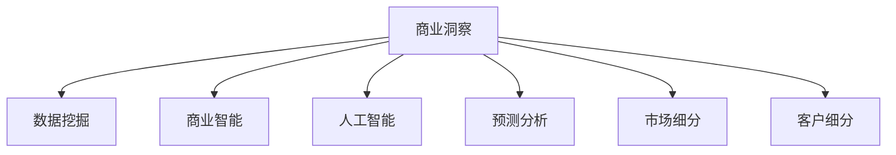

                 

# 洞察力与市场分析：商业智慧的体现

## 1. 背景介绍

### 1.1 问题由来

在现代商业竞争中，洞察力（Insight）成为企业获取竞争优势的关键。随着信息技术的发展，大数据、人工智能等新兴技术为商业洞察力的挖掘与分析提供了强大的工具。然而，如何利用这些技术有效提升企业决策能力，并转化为具体的市场策略，仍是一个重要的挑战。

### 1.2 问题核心关键点

洞察力的获取与市场分析，本质上是通过数据驱动的方式，发现市场趋势、用户需求、竞争对手动态等关键信息，从而帮助企业制定更有效的营销策略、优化产品设计和提升客户体验。其中，核心的关键点包括：

- **数据质量**：高质量的数据是洞察力的基础，数据需要准确、全面、及时。
- **分析方法**：先进的分析方法和算法，能够从数据中挖掘出深层次的商业洞察。
- **决策能力**：企业需要具备快速将洞察转化为决策的能力，以应对市场变化。
- **执行效率**：市场策略的执行需要高效的运营支持，确保及时落地。

### 1.3 问题研究意义

洞察力和市场分析对于提升企业决策的科学性和效率具有重要意义：

1. **提升决策质量**：利用数据和算法进行深入分析，帮助企业更准确地理解市场动态和用户需求，从而制定出更科学的市场策略。
2. **降低运营成本**：通过精确的洞察和分析，优化产品设计、营销方案，减少资源浪费，提升运营效率。
3. **增强竞争力**：及时准确的市场洞察能够帮助企业在激烈的市场竞争中占据有利位置，获得更大的市场份额。
4. **驱动创新**：洞察力和分析能力推动企业不断创新，提升产品和服务，满足日益变化的市场需求。

## 2. 核心概念与联系

### 2.1 核心概念概述

为更好地理解洞察力和市场分析的实现，本节将介绍几个密切相关的核心概念：

- **商业洞察（Business Insight）**：指通过分析企业内部和外部的数据，发现关键的商业趋势和机会。
- **数据挖掘（Data Mining）**：从大量数据中提取有用信息和知识，帮助企业做出更明智的决策。
- **商业智能（Business Intelligence，BI）**：利用数据仓库和先进分析工具，为决策提供支持。
- **人工智能（Artificial Intelligence，AI）**：通过机器学习、深度学习等技术，从数据中自动化地提取洞察。
- **预测分析（Predictive Analytics）**：使用历史数据预测未来趋势，帮助企业提前做出决策。
- **市场细分（Market Segmentation）**：将市场划分为多个细分市场，针对性地制定市场策略。
- **客户细分（Customer Segmentation）**：将客户划分为不同群体，提供个性化服务。

这些概念之间的逻辑关系可以通过以下Mermaid流程图来展示：



这个流程图展示出商业洞察力及其相关概念之间的联系：

1. 商业洞察力以数据挖掘和商业智能为基础。
2. 人工智能和预测分析为洞察力的获取提供了先进技术支持。
3. 市场细分和客户细分是商业洞察力的重要应用场景。

## 3. 核心算法原理 & 具体操作步骤
### 3.1 算法原理概述

洞察力和市场分析的算法原理，通常涉及以下关键步骤：

1. **数据准备**：收集和清洗数据，确保数据的质量和一致性。
2. **特征提取**：从原始数据中提取有意义的特征，以便后续分析。
3. **模型训练**：使用机器学习或深度学习模型，训练出能够自动发现商业洞察的模型。
4. **洞察提取**：通过训练好的模型，从数据中提取商业洞察，帮助决策。
5. **策略制定**：根据洞察结果，制定具体的市场策略。

### 3.2 算法步骤详解

#### 3.2.1 数据准备

数据准备是洞察力和市场分析的基础，包括数据收集、清洗、整合等步骤：

1. **数据收集**：从不同的数据源收集数据，包括企业内部数据（如销售记录、客户反馈）和企业外部数据（如市场调研报告、社交媒体数据）。
2. **数据清洗**：清洗数据，去除噪音和错误，确保数据的准确性和一致性。
3. **数据整合**：将来自不同源的数据进行整合，构建统一的数据仓库。

#### 3.2.2 特征提取

特征提取是从原始数据中提取出有用的信息，以便后续分析：

1. **特征选择**：选择与商业洞察相关的特征，如销售额、客户数量、市场份额等。
2. **特征处理**：对特征进行归一化、离散化、编码等处理，使其适合模型输入。
3. **特征工程**：通过构建新特征，如交叉特征、时间特征等，增强模型的表达能力。

#### 3.2.3 模型训练

模型训练是洞察力和市场分析的核心步骤，通常使用机器学习和深度学习算法：

1. **算法选择**：选择合适的算法，如回归、分类、聚类、神经网络等。
2. **模型构建**：构建机器学习或深度学习模型，并进行参数调优。
3. **模型评估**：使用验证集评估模型性能，选择合适的模型参数。

#### 3.2.4 洞察提取

洞察提取是从训练好的模型中提取商业洞察，通常使用以下方法：

1. **可视化分析**：使用图表、热力图等工具，可视化模型结果，帮助识别商业趋势。
2. **定量分析**：通过统计分析，计算出关键的商业指标，如客户满意度、市场增长率等。
3. **定性分析**：通过文本分析、情感分析等技术，提取客户的情感和需求。

#### 3.2.5 策略制定

策略制定是将洞察结果转化为具体的市场策略，主要包括以下步骤：

1. **目标设定**：根据洞察结果，设定明确的商业目标。
2. **策略设计**：设计具体的市场策略，如产品优化、定价策略、营销方案等。
3. **执行计划**：制定详细的执行计划，确保策略的顺利实施。

### 3.3 算法优缺点

商业洞察力和市场分析算法具有以下优点：

1. **数据驱动**：基于数据和算法，能够提供客观、准确的商业洞察。
2. **自动化分析**：通过模型自动化分析数据，提升分析效率和准确性。
3. **及时响应**：能够快速识别市场变化和机会，帮助企业及时调整策略。

同时，这些算法也存在一些局限性：

1. **数据依赖**：算法的效果依赖于数据的质量和数量，获取高质量数据成本较高。
2. **模型复杂性**：复杂的模型可能需要较多的计算资源和时间，且解释性不足。
3. **隐私风险**：使用外部数据时，需注意数据隐私和安全问题。
4. **模型过拟合**：复杂的模型可能过拟合训练数据，泛化能力有限。
5. **策略执行**：制定出的策略需要具备良好的执行能力，否则可能无法实现预期效果。

### 3.4 算法应用领域

商业洞察力和市场分析算法在多个领域得到广泛应用，包括：

- **零售业**：通过数据分析，优化库存管理、提升销售策略。
- **金融业**：利用预测分析，识别市场趋势、评估风险。
- **制造业**：通过数据分析，优化生产流程、提升产品质量。
- **医疗保健**：利用洞察分析，制定个性化治疗方案、提高患者满意度。
- **物流行业**：通过市场分析，优化运输路线、降低物流成本。

此外，商业洞察力和市场分析还应用于市场调研、客户关系管理、市场细分等多个领域，为企业的战略决策提供有力支持。

## 4. 数学模型和公式 & 详细讲解 & 举例说明

### 4.1 数学模型构建

商业洞察力和市场分析的数学模型通常包括回归模型、分类模型、聚类模型等。以下以回归模型为例进行详细讲解：

设训练集为 $D=\{(x_i, y_i)\}_{i=1}^N$，其中 $x_i \in \mathbb{R}^d$ 为输入特征，$y_i$ 为输出标签。回归模型的目标是最小化预测误差，通常使用均方误差（Mean Squared Error，MSE）作为损失函数：

$$
\mathcal{L}(w) = \frac{1}{N}\sum_{i=1}^N (y_i - w^T x_i)^2
$$

其中 $w \in \mathbb{R}^d$ 为模型参数，通过梯度下降等优化算法求解：

$$
w \leftarrow w - \eta \nabla_{w}\mathcal{L}(w)
$$

### 4.2 公式推导过程

假设我们已经有了回归模型，下一步是推导其参数 $w$ 的更新公式。

首先，定义模型在输入 $x_i$ 上的预测值 $\hat{y}_i = w^T x_i$。

然后，根据均方误差定义，损失函数为：

$$
\mathcal{L}(w) = \frac{1}{N}\sum_{i=1}^N (y_i - \hat{y}_i)^2
$$

对 $w$ 求偏导数：

$$
\frac{\partial \mathcal{L}(w)}{\partial w} = \frac{2}{N}\sum_{i=1}^N (y_i - \hat{y}_i)x_i
$$

使用梯度下降算法更新参数 $w$：

$$
w \leftarrow w - \eta \frac{\partial \mathcal{L}(w)}{\partial w}
$$

代入偏导数结果：

$$
w \leftarrow w - \eta \frac{2}{N}\sum_{i=1}^N (y_i - \hat{y}_i)x_i
$$

### 4.3 案例分析与讲解

以下通过一个简单的案例来说明商业洞察力和市场分析的实现过程：

假设我们是一家零售商，需要分析每个季度的销售数据，找出影响销售的主要因素。数据如下：

| 季度 | 销售额（万元） | 促销次数 | 广告投入（万元） | 竞争对手数量 |
|------|---------------|----------|------------------|--------------|
| 1    | 500           | 3        | 200              | 10           |
| 2    | 600           | 2        | 150              | 9            |
| 3    | 450           | 4        | 250              | 11           |
| 4    | 550           | 1        | 180              | 8            |

1. **数据准备**：收集和清洗数据，构建数据仓库。

2. **特征提取**：提取销售额、促销次数、广告投入、竞争对手数量等特征。

3. **模型训练**：使用线性回归模型进行训练，得到回归系数 $w$。

4. **洞察提取**：计算每个季度的回归预测值，得到回归方程 $y = w^T x$。

5. **策略制定**：根据回归方程，制定出具体的市场策略，如调整促销次数、增加广告投入等。

## 5. 项目实践：代码实例和详细解释说明

### 5.1 开发环境搭建

在进行商业洞察力和市场分析的实践时，我们需要准备好开发环境。以下是使用Python进行Pandas开发的环境配置流程：

1. 安装Anaconda：从官网下载并安装Anaconda，用于创建独立的Python环境。

2. 创建并激活虚拟环境：
```bash
conda create -n insights-env python=3.8 
conda activate insights-env
```

3. 安装Pandas：
```bash
conda install pandas
```

4. 安装各类工具包：
```bash
pip install numpy matplotlib scikit-learn
```

完成上述步骤后，即可在`insights-env`环境中开始商业洞察力和市场分析的实践。

### 5.2 源代码详细实现

这里我们以零售业的市场分析为例，给出使用Pandas进行回归分析的Python代码实现。

首先，导入必要的库：

```python
import pandas as pd
import numpy as np
import matplotlib.pyplot as plt
from sklearn.linear_model import LinearRegression
```

然后，准备数据集：

```python
# 定义数据
sales = np.array([500, 600, 450, 550])
promotions = np.array([3, 2, 4, 1])
advertising = np.array([200, 150, 250, 180])
competitors = np.array([10, 9, 11, 8])

# 构建数据框
data = pd.DataFrame({'Sales': sales, 'Promotions': promotions, 'Advertising': advertising, 'Competitors': competitors})
```

接着，进行数据清洗和特征提取：

```python
# 计算平均值
data['Average'] = np.mean(sales)

# 构建特征矩阵
X = data[['Promotions', 'Advertising', 'Competitors']]
X = (X - X.mean()) / X.std()

# 构建目标向量
y = data['Sales']
y = (y - y.mean()) / y.std()

# 将数据标准化
from sklearn.preprocessing import StandardScaler
scaler = StandardScaler()
X = scaler.fit_transform(X)
y = scaler.transform(y)
```

然后，训练线性回归模型：

```python
# 构建线性回归模型
model = LinearRegression()
model.fit(X, y)
```

最后，评估模型并进行可视化：

```python
# 预测销售数据
y_pred = model.predict(X)

# 可视化结果
plt.scatter(sales, sales)
plt.plot(sales, y_pred, color='red')
plt.xlabel('Sales')
plt.ylabel('Sales')
plt.show()
```

### 5.3 代码解读与分析

这里我们重点解读一下关键代码的实现细节：

1. **数据准备**：通过numpy数组定义数据，并构建pandas数据框，方便后续操作。

2. **数据清洗**：计算销售数据的平均值，并对数据进行标准化处理，使其符合线性回归模型的输入要求。

3. **特征提取**：构建特征矩阵，并使用sklearn的标准化工具对数据进行归一化处理。

4. **模型训练**：使用线性回归模型对数据进行拟合，得到模型参数。

5. **结果评估**：通过可视化工具绘制数据点与模型预测值的对比图，直观展示模型效果。

## 6. 实际应用场景

### 6.1 智能零售

商业洞察力和市场分析在智能零售领域具有广泛应用，可以提升零售商的运营效率和客户满意度。具体应用场景包括：

- **库存管理**：通过数据分析，预测库存需求，优化库存水平。
- **价格优化**：根据市场需求和竞争情况，动态调整商品价格，提升销量。
- **市场细分**：根据客户行为和偏好，划分不同客户群体，实施精准营销。

### 6.2 金融投资

在金融投资领域，商业洞察力和市场分析可以用于风险评估和投资决策。主要应用包括：

- **风险预测**：通过数据分析，预测市场风险，制定风险控制策略。
- **投资组合管理**：根据市场趋势和股票表现，优化投资组合，提升投资收益。
- **资产定价**：通过分析历史数据和市场动态，评估资产价值，指导投资决策。

### 6.3 制造业生产

商业洞察力和市场分析在制造业生产中也有重要应用，可以帮助企业优化生产流程和提高生产效率。具体场景包括：

- **生产调度**：通过数据分析，优化生产计划和调度，提高生产效率。
- **设备维护**：根据设备运行数据，预测设备故障，进行预防性维护。
- **供应链管理**：通过分析供应链数据，优化采购和库存管理，降低成本。

### 6.4 未来应用展望

随着技术的不断进步，商业洞察力和市场分析的应用前景将更加广阔：

1. **实时数据分析**：随着大数据技术的成熟，实时数据分析成为可能，可以提供更及时的商业洞察。
2. **深度学习应用**：利用深度学习模型，提升数据分析的准确性和自动化程度。
3. **跨领域应用**：商业洞察力和市场分析将逐步应用于更多领域，如医疗、能源、交通等，为行业发展提供有力支持。
4. **多模态分析**：结合图像、声音、文本等多种数据源，提供更全面的商业洞察。
5. **AI与BI融合**：商业洞察力和市场分析与AI技术深度融合，提升数据分析的智能化水平。

## 7. 工具和资源推荐

### 7.1 学习资源推荐

为了帮助开发者系统掌握商业洞察力和市场分析的理论基础和实践技巧，这里推荐一些优质的学习资源：

1. 《Python数据科学手册》：详细介绍了Python在数据分析中的应用，包括Pandas、NumPy、SciPy等库的使用。

2. 《机器学习实战》：深入浅出地介绍了机器学习算法的基本原理和实现方法，适合初学者入门。

3. 《数据科学实战》：通过案例分析，介绍数据挖掘、商业智能等技术在实际项目中的应用。

4. Coursera《数据科学专项课程》：由顶尖大学和机构提供的系统课程，涵盖数据科学、机器学习、大数据等核心内容。

5. Kaggle数据科学竞赛平台：提供丰富的数据集和竞赛题目，提升实战能力。

通过对这些资源的学习实践，相信你一定能够快速掌握商业洞察力和市场分析的精髓，并应用于实际的商业决策中。

### 7.2 开发工具推荐

高效的开发离不开优秀的工具支持。以下是几款用于商业洞察力和市场分析开发的常用工具：

1. Python：Python语言简单易用，有丰富的数据分析库和工具支持，是商业洞察力和市场分析的首选语言。

2. Pandas：基于Python的数据分析库，提供了丰富的数据处理和分析功能，支持数据清洗、特征提取、数据可视化等操作。

3. Scikit-learn：基于Python的机器学习库，支持多种机器学习算法，包括回归、分类、聚类等，方便模型训练和评估。

4. TensorFlow：由Google开发的深度学习框架，支持多种深度学习模型，适合复杂数据分析任务。

5. PyTorch：基于Python的深度学习框架，支持动态计算图和高效的模型训练，适合研究和原型开发。

6. Jupyter Notebook：基于Python的交互式笔记本环境，方便数据探索和模型验证。

合理利用这些工具，可以显著提升商业洞察力和市场分析的开发效率，加快创新迭代的步伐。

### 7.3 相关论文推荐

商业洞察力和市场分析的研究主要集中在数据挖掘、商业智能、机器学习等领域。以下是几篇奠基性的相关论文，推荐阅读：

1. 《Data Mining: Concepts and Techniques》：详细介绍了数据挖掘的基本概念和技术，涵盖数据预处理、特征选择、分类算法等。

2. 《Business Intelligence for Decision Making》：介绍了商业智能的定义、技术架构和应用场景，强调数据分析在决策中的作用。

3. 《Machine Learning: A Probabilistic Perspective》：深入浅出地介绍了机器学习的基本原理和算法，适合理解商业洞察力的数学基础。

4. 《Predictive Analytics: Data Mining, Statistical Learning, and Statistical Inference》：介绍了预测分析的基本方法，包括时间序列预测、回归分析、分类算法等。

5. 《Deep Learning for Business》：介绍了深度学习在商业应用中的具体实现，如市场预测、客户行为分析等。

这些论文代表了大数据和人工智能技术在商业洞察力中的应用方向，值得深入学习和参考。

## 8. 总结：未来发展趋势与挑战

### 8.1 总结

本文对商业洞察力和市场分析的实现进行了全面系统的介绍。首先阐述了洞察力和市场分析在企业决策中的重要性，明确了其作为商业智慧体现的关键价值。其次，从原理到实践，详细讲解了商业洞察力和市场分析的数学模型和操作步骤，给出了实际应用场景和具体实现代码。同时，本文还广泛探讨了商业洞察力和市场分析在不同领域的应用前景，展示了其在商业决策中的巨大潜力。此外，本文精选了相关的学习资源和开发工具，力求为读者提供全方位的技术指引。

通过本文的系统梳理，可以看到，商业洞察力和市场分析在提升企业决策科学性和效率方面发挥了重要作用，已经成为现代企业必须掌握的关键技术。未来，伴随大数据和人工智能技术的持续演进，洞察力和分析能力将更加智能、全面，为企业的战略决策提供更加精准的支持。

### 8.2 未来发展趋势

展望未来，商业洞察力和市场分析技术将呈现以下几个发展趋势：

1. **数据融合**：结合多种数据源，如社交媒体、传感器数据、物联网数据等，提供更全面的商业洞察。

2. **实时分析**：通过大数据和云计算技术，实现实时数据分析，提升商业洞察的及时性。

3. **自动化分析**：利用自动化分析工具，提升数据分析的效率和准确性，减少人工干预。

4. **AI融合**：商业洞察力和市场分析与AI技术的深度融合，提升数据分析的智能化水平。

5. **多模态分析**：结合图像、声音、文本等多种数据源，提供更丰富的商业洞察。

6. **跨领域应用**：商业洞察力和市场分析的应用将逐步扩展到更多领域，如医疗、能源、交通等。

以上趋势凸显了商业洞察力和市场分析技术的广阔前景。这些方向的探索发展，必将进一步提升数据分析的质量和效率，为企业的战略决策提供更加精准的支持。

### 8.3 面临的挑战

尽管商业洞察力和市场分析技术已经取得了显著进展，但在实际应用中也面临诸多挑战：

1. **数据质量**：高质量数据获取难度大，数据清洗和预处理复杂。

2. **模型复杂性**：复杂的模型需要较多的计算资源和时间，且解释性不足。

3. **隐私风险**：数据隐私和安全问题，特别是在使用外部数据时。

4. **数据孤岛**：不同系统之间的数据共享和整合难度大，数据孤岛现象普遍。

5. **技术门槛**：商业洞察力和市场分析涉及多种技术和工具，需要具备较高的技术门槛。

6. **策略执行**：洞察结果需要转化为具体的市场策略，执行效果依赖于运营能力。

正视这些挑战，积极应对并寻求突破，将使商业洞察力和市场分析技术更加成熟和完善。

### 8.4 研究展望

面对商业洞察力和市场分析面临的种种挑战，未来的研究需要在以下几个方面寻求新的突破：

1. **自动化分析**：开发更多自动化分析工具，提升数据分析的效率和准确性。

2. **跨领域应用**：将商业洞察力和市场分析应用于更多领域，解决跨领域的商业问题。

3. **数据隐私保护**：引入数据隐私保护技术，确保数据安全和合规性。

4. **模型解释性**：提升模型的解释性，使商业洞察和分析结果更易于理解和接受。

5. **多模态融合**：结合多种数据源，提供更全面、准确的商业洞察。

6. **策略优化**：通过优化策略制定流程，提升市场策略的执行效果。

这些研究方向将推动商业洞察力和市场分析技术的进一步发展，为企业提供更加科学、高效的市场分析能力，助力企业在激烈的市场竞争中取得优势。

## 9. 附录：常见问题与解答

**Q1：商业洞察力和市场分析是否适用于所有企业？**

A: 商业洞察力和市场分析技术适用于大多数企业，特别是那些需要大量数据分析以支撑决策的企业。但对于一些小型企业或初创企业，由于数据和资源限制，可能需要简化分析过程或借助第三方服务。

**Q2：如何选择合适的特征进行数据分析？**

A: 选择特征是数据分析的关键步骤，通常需要考虑以下几个方面：
1. **领域知识**：根据业务领域，选择与商业洞察相关的特征。
2. **数据相关性**：选择与目标变量高度相关的特征。
3. **特征工程**：通过构建新特征，提升模型的表达能力。

**Q3：如何评估商业洞察力和市场分析模型的效果？**

A: 模型效果评估通常包括准确率、召回率、F1值等指标。具体评估方法根据任务类型而定，如回归问题通常使用均方误差（MSE）、平均绝对误差（MAE）等指标。

**Q4：在实际应用中，如何平衡模型复杂度和解释性？**

A: 模型复杂度和解释性之间通常存在一定的平衡。可以采用以下方法：
1. **简化模型**：减少模型参数，提升模型的解释性。
2. **特征选择**：选择与商业洞察相关的重要特征，减少噪音。
3. **可视化分析**：通过可视化工具，帮助理解模型结果。

**Q5：商业洞察力和市场分析在人工智能时代将如何发展？**

A: 在人工智能时代，商业洞察力和市场分析将进一步融合AI技术，提升数据分析的智能化水平。具体发展方向包括：
1. **自动化分析**：利用自动化分析工具，提升数据分析的效率和准确性。
2. **AI融合**：结合机器学习、深度学习等AI技术，提升数据分析的智能化水平。
3. **多模态分析**：结合图像、声音、文本等多种数据源，提供更丰富的商业洞察。
4. **实时分析**：通过大数据和云计算技术，实现实时数据分析，提升商业洞察的及时性。

这些发展方向将使商业洞察力和市场分析技术更加智能、全面，为企业的战略决策提供更加精准的支持。

---

作者：禅与计算机程序设计艺术 / Zen and the Art of Computer Programming

