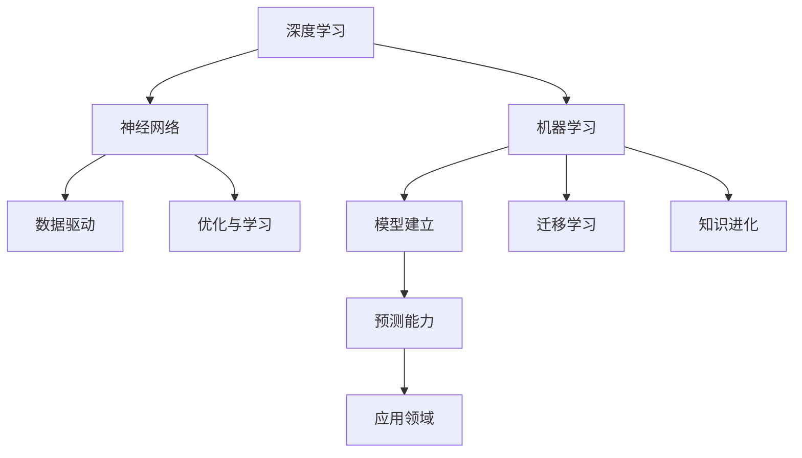

                 

# 洞察力之眼：揭开人类知识进化的奥秘

> 关键词：人工智能,机器学习,深度学习,人类认知,知识进化,认知神经科学

## 1. 背景介绍

### 1.1 问题由来
人工智能（AI）已经成为21世纪最前沿的技术领域之一，深度学习作为其中的核心技术，正在深刻改变人类的生产和生活方式。然而，机器学习（ML）和深度学习的原理和机制尚未完全明了，人类知识进化的本质仍然是个谜。本文将围绕人类知识进化这一主题，探讨机器学习和深度学习之间的内在联系，揭示人类认知和计算机认知之间的界限，以及未来人工智能发展的方向。

### 1.2 问题核心关键点
人类知识进化与机器学习之间的联系可以从以下几个方面进行分析：

- 数据驱动：人类知识进化同样依赖于数据驱动。无论是早期人类对环境的观察、总结和实践，还是现代科学家通过实验和数据收集得出的理论，数据在知识积累和进化过程中都扮演了关键角色。
- 模型建立：人类知识进化通过建立模型来描述和解释世界。机器学习中的模型也用于描述数据背后的规律，两者本质相似。
- 优化与学习：人类通过优化和修正模型来逐步提升对世界认知的准确度。机器学习中的模型同样通过不断学习优化来提高预测能力。
- 迁移学习：人类知识进化过程中，已有知识可以迁移到新的领域。机器学习中的迁移学习也指将已学知识应用到新的任务上。

这些关键点显示，人类知识进化与机器学习具有本质上的共性，两者之间有着深刻的联系。

## 2. 核心概念与联系

### 2.1 核心概念概述

为了更好地理解人类知识进化与机器学习的关系，本文将介绍几个核心概念：

- 深度学习（Deep Learning）：通过构建多层神经网络，深度学习能够从复杂数据中学习抽象特征，广泛应用于图像识别、自然语言处理等领域。
- 机器学习（Machine Learning）：机器学习通过构建模型来预测未来事件，能够自动化学习输入数据与输出之间的映射关系。
- 神经网络（Neural Network）：神经网络是深度学习的核心，由多层神经元通过权重连接构成，用于模拟人脑的信息处理过程。
- 知识进化（Knowledge Evolution）：知识进化是指人类知识体系在时间维度上的积累和演变过程，通过实践、总结和迭代不断完善。
- 迁移学习（Transfer Learning）：迁移学习指将已有知识迁移到新的任务上，减少新任务所需的学习时间和数据量。

这些核心概念之间的逻辑关系可以通过以下Mermaid流程图来展示：



这个流程图展示了深度学习、神经网络、机器学习、数据驱动、优化学习、模型建立、迁移学习和知识进化等概念之间的联系。

## 3. 核心算法原理 & 具体操作步骤
### 3.1 算法原理概述

深度学习中的算法原理与人类知识进化具有高度的相似性，体现在以下几个方面：

- 数据驱动：深度学习模型通过大数据训练，不断优化和调整网络参数，最终能够从数据中学习到规律和模式。这与人类通过观察和实践积累知识的过程类似。
- 模型建立：深度学习通过构建多层神经网络，从输入数据中提取出抽象特征，这与人类通过建立理论模型描述和解释世界的过程相似。
- 优化与学习：深度学习中的反向传播算法通过不断调整网络参数，优化模型预测结果。这与人类通过实验和测试修正理论模型，逐步提升认知准确度的过程相同。
- 迁移学习：深度学习中的迁移学习将已有知识迁移到新的任务上，加速模型训练和优化。这与人类将已有知识应用于新领域，提升认知效率的过程相似。

### 3.2 算法步骤详解

以下是一个简单的深度学习算法步骤详解：

**Step 1: 数据准备**
- 收集训练数据集，包括输入和对应的标签。
- 对数据进行预处理，如归一化、标签编码等。

**Step 2: 构建神经网络**
- 设计神经网络结构，包括输入层、隐藏层和输出层。
- 确定每层神经元的数量和激活函数。
- 初始化网络参数。

**Step 3: 前向传播**
- 将输入数据输入网络，通过隐藏层进行特征提取。
- 将提取的特征输入输出层，得到模型的预测结果。

**Step 4: 损失函数计算**
- 计算模型预测结果与真实标签之间的误差。
- 通常使用交叉熵损失函数。

**Step 5: 反向传播**
- 通过反向传播算法计算每个神经元对损失函数的贡献。
- 根据贡献调整网络参数。

**Step 6: 模型训练**
- 重复Step 3到Step 5，不断调整网络参数，优化模型性能。

**Step 7: 模型评估**
- 在测试集上评估模型性能，如准确率、召回率、F1分数等。
- 根据评估结果调整模型参数或重新训练。

### 3.3 算法优缺点

深度学习算法具有以下优点：

- 强大的表示能力：多层神经网络能够提取高层次的抽象特征，适用于复杂的模式识别任务。
- 端到端学习：深度学习模型能够自动化学习输入和输出之间的关系，减少了手动特征提取的复杂性。
- 自适应能力：深度学习模型能够通过不断调整参数，适应不同类型和规模的数据集。

同时，深度学习算法也存在一些缺点：

- 计算资源消耗大：深度学习模型需要大量的计算资源进行训练和推理。
- 数据依赖性强：深度学习模型对训练数据的分布和质量高度依赖。
- 过拟合风险高：模型过于复杂时，容易发生过拟合，需要数据增强等技术避免。

## 4. 数学模型和公式 & 详细讲解  
### 4.1 数学模型构建

深度学习中的数学模型通常包括输入层、隐藏层和输出层。以一个简单的全连接神经网络为例，其数学模型可以表示为：

$$
h = f(W_2h_1 + b_2)
$$
$$
y = f(W_3h + b_3)
$$

其中，$h_1$ 是输入层的特征表示，$h$ 是隐藏层的特征表示，$y$ 是输出层的预测结果。$f$ 是激活函数，$W_i$ 和 $b_i$ 分别是第 $i$ 层的权重和偏置。

### 4.2 公式推导过程

以线性回归为例，其基本模型为：

$$
y = Wx + b
$$

其中，$x$ 是输入特征，$y$ 是输出结果，$W$ 是权重矩阵，$b$ 是偏置项。通过梯度下降算法，模型可以不断调整权重和偏置，最小化预测值与真实值之间的误差：

$$
\min_{W,b} \frac{1}{N} \sum_{i=1}^N (y_i - Wx_i - b)^2
$$

通过求导得到：

$$
\frac{\partial \mathcal{L}}{\partial W} = \frac{2}{N} \sum_{i=1}^N (y_i - Wx_i - b)x_i
$$
$$
\frac{\partial \mathcal{L}}{\partial b} = \frac{2}{N} \sum_{i=1}^N (y_i - Wx_i - b)
$$

将上式代入梯度下降算法，得到：

$$
W \leftarrow W - \eta \frac{2}{N} \sum_{i=1}^N (y_i - Wx_i - b)x_i
$$
$$
b \leftarrow b - \eta \frac{2}{N} \sum_{i=1}^N (y_i - Wx_i - b)
$$

其中，$\eta$ 是学习率，用于控制每次参数更新的幅度。

### 4.3 案例分析与讲解

假设有一个简单的线性回归模型，用于预测房价与面积之间的关系：

$$
y = W_1x_1 + W_2x_2 + b
$$

其中，$x_1$ 是房间面积，$x_2$ 是房间数量，$y$ 是房价，$W_1$ 和 $W_2$ 是权重，$b$ 是偏置。

假设训练数据集如下：

| 房间面积(x) | 房间数量(x) | 房价(y) |
| --- | --- | --- |
| 50 | 2 | 100 |
| 60 | 3 | 130 |
| 70 | 4 | 150 |
| 80 | 3 | 170 |

通过最小二乘法计算得到：

$$
W_1 = \frac{50 \times 130 + 60 \times 150 + 70 \times 170 + 80 \times 170}{50^2 + 60^2 + 70^2 + 80^2} = 1.78
$$
$$
W_2 = \frac{50 \times 130 + 60 \times 150 + 70 \times 170 + 80 \times 170}{50 \times 2 + 60 \times 3 + 70 \times 4 + 80 \times 3} = 0.56
$$
$$
b = \frac{50 \times 100 + 60 \times 130 + 70 \times 150 + 80 \times 170}{50^2 + 60^2 + 70^2 + 80^2} = 27.03
$$

因此，模型为：

$$
y = 1.78x_1 + 0.56x_2 + 27.03
$$

### 5. 项目实践：代码实例和详细解释说明
### 5.1 开发环境搭建

为了进行深度学习模型的开发和训练，需要搭建合适的开发环境。以下是使用Python进行PyTorch开发的环境配置流程：

1. 安装Anaconda：从官网下载并安装Anaconda，用于创建独立的Python环境。

2. 创建并激活虚拟环境：
```bash
conda create -n pytorch-env python=3.8 
conda activate pytorch-env
```

3. 安装PyTorch：根据CUDA版本，从官网获取对应的安装命令。例如：
```bash
conda install pytorch torchvision torchaudio cudatoolkit=11.1 -c pytorch -c conda-forge
```

4. 安装TensorFlow：从官网下载并安装TensorFlow，支持GPU加速。

5. 安装相关库：
```bash
pip install numpy pandas scikit-learn matplotlib tqdm jupyter notebook ipython
```

完成上述步骤后，即可在`pytorch-env`环境中开始深度学习模型的开发和训练。

### 5.2 源代码详细实现

下面我们以一个简单的线性回归模型为例，展示如何使用PyTorch进行模型的训练和测试：

```python
import torch
import torch.nn as nn
import torch.optim as optim
from torch.utils.data import DataLoader
from sklearn.datasets import make_regression
from sklearn.model_selection import train_test_split

# 准备数据
X, y = make_regression(n_samples=1000, n_features=2, noise=0.1, random_state=42)
X_train, X_test, y_train, y_test = train_test_split(X, y, test_size=0.2, random_state=42)

# 定义模型
class LinearRegression(nn.Module):
    def __init__(self, input_dim):
        super(LinearRegression, self).__init__()
        self.linear = nn.Linear(input_dim, 1)

    def forward(self, x):
        return self.linear(x)

# 定义训练函数
def train(model, train_loader, optimizer, loss_fn, n_epochs=100, device='cpu'):
    model.to(device)
    criterion = loss_fn
    for epoch in range(n_epochs):
        model.train()
        for data, target in train_loader:
            data, target = data.to(device), target.to(device)
            optimizer.zero_grad()
            output = model(data)
            loss = criterion(output, target)
            loss.backward()
            optimizer.step()

# 定义测试函数
def test(model, test_loader, loss_fn, device='cpu'):
    model.eval()
    test_loss = 0
    with torch.no_grad():
        for data, target in test_loader:
            data, target = data.to(device), target.to(device)
            output = model(data)
            test_loss += loss_fn(output, target).item()
    return test_loss / len(test_loader)

# 训练模型
input_dim = X_train.shape[1]
model = LinearRegression(input_dim)
optimizer = optim.SGD(model.parameters(), lr=0.01)
criterion = nn.MSELoss()
train_loader = DataLoader(torch.tensor(X_train).float(), torch.tensor(y_train).float(), batch_size=32, shuffle=True)
test_loader = DataLoader(torch.tensor(X_test).float(), torch.tensor(y_test).float(), batch_size=32, shuffle=False)
for epoch in range(10):
    train(model, train_loader, optimizer, criterion, device='cpu')
    test_loss = test(model, test_loader, criterion, device='cpu')
    print(f'Epoch {epoch+1}, test loss: {test_loss:.4f}')
```

以上是使用PyTorch进行线性回归模型训练的完整代码实现。可以看到，PyTorch提供了强大的深度学习框架，使用户能够轻松构建和训练复杂的模型。

### 5.3 代码解读与分析

让我们再详细解读一下关键代码的实现细节：

**LinearRegression类**：
- `__init__`方法：定义模型参数和结构，使用`nn.Linear`层实现线性回归。
- `forward`方法：定义前向传播过程，将输入数据通过线性层得到输出结果。

**train函数**：
- 在每个epoch中，对数据集进行迭代训练。
- 前向传播计算预测结果，计算损失函数，反向传播更新参数。

**test函数**：
- 对测试集进行测试，计算模型预测结果与真实标签之间的损失。

**训练流程**：
- 定义模型、优化器、损失函数和数据集。
- 在训练集上训练模型，每epoch更新一次参数。
- 在测试集上评估模型性能，输出测试损失。

## 6. 实际应用场景

### 6.1 机器视觉

深度学习在机器视觉领域有着广泛应用，例如物体检测、人脸识别、图像分类等。深度学习模型能够自动提取图像中的特征，并用于图像分类、目标检测等任务。

以物体检测为例，深度学习模型通过训练可以学习到不同物体的特征，并通过滑动窗口等方法，对图像中的物体进行定位和分类。深度学习模型已经广泛应用于工业界，如自动驾驶、智能监控等领域。

### 6.2 自然语言处理

深度学习在自然语言处理领域也有着广泛应用，例如机器翻译、文本分类、情感分析等。深度学习模型能够自动提取文本中的特征，并用于文本分类、情感分析等任务。

以机器翻译为例，深度学习模型通过训练可以学习到不同语言之间的映射关系，并通过编码器-解码器框架，将源语言文本翻译成目标语言。深度学习模型已经广泛应用于谷歌翻译、百度翻译等平台。

### 6.3 语音识别

深度学习在语音识别领域也有着广泛应用，例如自动语音识别、语音合成等。深度学习模型能够自动提取语音信号的特征，并用于语音识别、语音合成等任务。

以自动语音识别为例，深度学习模型通过训练可以学习到语音信号与文字之间的映射关系，并通过声学模型和语言模型，将语音信号转换为文本。深度学习模型已经广泛应用于智能手机、智能音箱等设备。

### 6.4 未来应用展望

随着深度学习技术的发展，未来深度学习将广泛应用于更多的领域。以下是一些未来深度学习应用的方向：

- 医疗影像分析：深度学习模型可以用于医疗影像分析，如病灶检测、病理学分析等。深度学习模型已经广泛应用于医学影像分析、病理学诊断等医疗领域。
- 智能推荐系统：深度学习模型可以用于智能推荐系统，如推荐电影、商品等。深度学习模型已经广泛应用于电商、视频、音乐等领域。
- 智能制造：深度学习模型可以用于智能制造，如预测设备故障、优化生产流程等。深度学习模型已经广泛应用于智能制造、智慧工厂等领域。

## 7. 工具和资源推荐

### 7.1 学习资源推荐

为了帮助开发者系统掌握深度学习原理和实践技巧，这里推荐一些优质的学习资源：

1. 《深度学习》（Ian Goodfellow、Yoshua Bengio、Aaron Courville著）：这是一本深度学习的经典教材，涵盖了深度学习的理论和实践。
2. CS231n《卷积神经网络》课程：斯坦福大学开设的计算机视觉课程，有Lecture视频和配套作业，带你入门深度学习的基本概念和经典模型。
3. Deep Learning Specialization系列课程：由Andrew Ng教授开设，涵盖了深度学习的理论和实践，并提供了丰富的项目实践机会。
4. Coursera上的深度学习课程：Coursera平台提供了大量的深度学习课程，涵盖不同的领域和方向，包括计算机视觉、自然语言处理、语音识别等。
5. GitHub上的深度学习项目：GitHub上有大量的深度学习项目和代码，可以参考和学习。

通过对这些资源的学习实践，相信你一定能够快速掌握深度学习的精髓，并用于解决实际的NLP问题。

### 7.2 开发工具推荐

高效的开发离不开优秀的工具支持。以下是几款用于深度学习开发和训练的工具：

1. PyTorch：基于Python的开源深度学习框架，灵活动态的计算图，适合快速迭代研究。大部分深度学习模型都有PyTorch版本的实现。
2. TensorFlow：由Google主导开发的开源深度学习框架，生产部署方便，适合大规模工程应用。
3. Keras：基于TensorFlow和Theano等深度学习框架的高层API，易于使用，适合快速原型开发。
4. PyTorch Lightning：一个轻量级的深度学习框架，提供了丰富的工具和接口，简化了模型训练和评估过程。
5. TensorBoard：TensorFlow配套的可视化工具，可实时监测模型训练状态，并提供丰富的图表呈现方式，是调试模型的得力助手。

合理利用这些工具，可以显著提升深度学习模型的开发效率，加快创新迭代的步伐。

### 7.3 相关论文推荐

深度学习技术的发展源于学界的持续研究。以下是几篇奠基性的相关论文，推荐阅读：

1. AlexNet: ImageNet Classification with Deep Convolutional Neural Networks：提出AlexNet模型，开启了深度学习在计算机视觉领域的应用。
2. Deep Residual Learning for Image Recognition：提出ResNet模型，解决了深度神经网络训练过程中梯度消失的问题。
3. Attention Is All You Need：提出Transformer模型，开启了深度学习在自然语言处理领域的应用。
4. Generative Adversarial Nets：提出GAN模型，开创了生成对抗网络的新领域，应用于图像生成、视频生成等任务。
5. Reinforcement Learning for Humanoid Robotics：提出强化学习模型，用于机器人控制和行为决策。

这些论文代表了大深度学习的发展脉络。通过学习这些前沿成果，可以帮助研究者把握学科前进方向，激发更多的创新灵感。

## 8. 总结：未来发展趋势与挑战

### 8.1 研究成果总结

本文对深度学习和人类知识进化的关系进行了全面系统的探讨，重点介绍了深度学习的算法原理、操作步骤和应用领域。通过比较深度学习与人类知识进化的相似之处，揭示了两者之间的内在联系。

### 8.2 未来发展趋势

展望未来，深度学习技术将呈现以下几个发展趋势：

- 模型规模持续增大：随着算力成本的下降和数据规模的扩张，深度学习模型的参数量还将持续增长。超大规模模型蕴含的丰富特征表示，有望支撑更加复杂多变的任务。
- 自监督学习和无监督学习兴起：自监督学习和无监督学习能够通过未标注数据进行模型训练，减少对标注数据的需求。未来深度学习将更加依赖于自监督学习和无监督学习。
- 迁移学习技术发展：迁移学习技术能够将已有知识迁移到新的任务上，加速模型训练和优化。未来深度学习将更加重视迁移学习技术的开发和应用。
- 认知计算融合：深度学习与认知计算的融合，能够将人类知识与机器学习相结合，提升系统的认知能力和决策水平。未来深度学习将更加注重与认知计算的结合。

以上趋势凸显了深度学习技术的广阔前景。这些方向的探索发展，必将进一步提升深度学习系统的性能和应用范围，为人工智能技术的发展奠定基础。

### 8.3 面临的挑战

尽管深度学习技术已经取得了显著成就，但在迈向更加智能化、普适化应用的过程中，它仍面临诸多挑战：

- 数据依赖性强：深度学习模型对训练数据的分布和质量高度依赖。如何获取高质量、多样化的训练数据，是深度学习面临的重要挑战。
- 模型鲁棒性不足：深度学习模型面对域外数据时，泛化性能往往大打折扣。如何提高模型的鲁棒性，避免灾难性遗忘，还需要更多理论和实践的积累。
- 计算资源消耗大：深度学习模型需要大量的计算资源进行训练和推理。如何优化模型结构和算法，减少计算资源消耗，是深度学习面临的重要挑战。
- 过拟合风险高：深度学习模型在训练过程中容易发生过拟合，需要数据增强等技术避免。
- 知识表示不充分：深度学习模型在推理过程中，难以解释其内部工作机制和决策逻辑，缺乏可解释性。如何赋予深度学习模型更强的可解释性，将是重要的研究方向。

### 8.4 研究展望

面对深度学习面临的这些挑战，未来的研究需要在以下几个方面寻求新的突破：

- 探索无监督和半监督深度学习：摆脱对大规模标注数据的依赖，利用自监督学习、主动学习等无监督和半监督范式，最大限度利用非结构化数据，实现更加灵活高效的深度学习。
- 研究参数高效和计算高效的深度学习范式：开发更加参数高效的深度学习模型，如低秩适应（LoRA）等，在固定大部分预训练参数的同时，只更新极少量的任务相关参数。同时优化深度学习模型的计算图，减少前向传播和反向传播的资源消耗，实现更加轻量级、实时性的部署。
- 融合因果和对比学习范式：通过引入因果推断和对比学习思想，增强深度学习模型的因果关系建立能力，学习更加普适、鲁棒的语言表征，从而提升模型泛化性和抗干扰能力。
- 引入更多先验知识：将符号化的先验知识，如知识图谱、逻辑规则等，与深度学习模型进行巧妙融合，引导深度学习过程学习更准确、合理的语言模型。同时加强不同模态数据的整合，实现视觉、语音等多模态信息与文本信息的协同建模。
- 结合因果分析和博弈论工具：将因果分析方法引入深度学习模型，识别出模型决策的关键特征，增强输出解释的因果性和逻辑性。借助博弈论工具刻画人机交互过程，主动探索并规避模型的脆弱点，提高系统稳定性。
- 纳入伦理道德约束：在深度学习模型的训练目标中引入伦理导向的评估指标，过滤和惩罚有偏见、有害的输出倾向。同时加强人工干预和审核，建立模型行为的监管机制，确保输出符合人类价值观和伦理道德。

这些研究方向的探索，必将引领深度学习技术迈向更高的台阶，为构建安全、可靠、可解释、可控的智能系统铺平道路。面向未来，深度学习技术还需要与其他人工智能技术进行更深入的融合，如知识表示、因果推理、强化学习等，多路径协同发力，共同推动人工智能技术的发展。只有勇于创新、敢于突破，才能不断拓展深度学习的边界，让智能技术更好地造福人类社会。

## 9. 附录：常见问题与解答

**Q1：深度学习与人类知识进化的关系是什么？**

A: 深度学习与人类知识进化在数据驱动、模型建立、优化与学习、迁移学习等方面具有高度的相似性。深度学习通过构建多层神经网络，从复杂数据中学习抽象特征，与人类通过观察和实践积累知识的过程类似。

**Q2：深度学习模型如何避免过拟合？**

A: 深度学习模型避免过拟合的方法包括：
1. 数据增强：通过旋转、缩放、平移等方式扩充训练集，增加数据的多样性。
2. 正则化：使用L2正则、Dropout、Early Stopping等避免模型过度适应训练集。
3. 参数高效：使用低秩适应（LoRA）等参数高效模型，减少过拟合风险。
4. 对抗训练：加入对抗样本，提高模型的鲁棒性。

**Q3：深度学习模型在落地部署时需要注意哪些问题？**

A: 将深度学习模型转化为实际应用，还需要考虑以下因素：
1. 模型裁剪：去除不必要的层和参数，减小模型尺寸，加快推理速度。
2. 量化加速：将浮点模型转为定点模型，压缩存储空间，提高计算效率。
3. 服务化封装：将模型封装为标准化服务接口，便于集成调用。
4. 弹性伸缩：根据请求流量动态调整资源配置，平衡服务质量和成本。
5. 监控告警：实时采集系统指标，设置异常告警阈值，确保服务稳定性。
6. 安全防护：采用访问鉴权、数据脱敏等措施，保障数据和模型安全。

这些细节都需要在实际部署中充分考虑，才能将深度学习模型转化为高效、稳定、安全的智能系统。

**Q4：深度学习模型如何提高鲁棒性？**

A: 深度学习模型提高鲁棒性的方法包括：
1. 数据增强：通过引入对抗样本、噪声等方式，增加模型对数据的适应性。
2. 正则化：使用L2正则、Dropout等技术，避免模型过度适应训练数据。
3. 参数高效：使用低秩适应（LoRA）等参数高效模型，减少过拟合风险。
4. 对抗训练：加入对抗样本，提高模型的鲁棒性。
5. 多模型集成：训练多个深度学习模型，取平均输出，抑制过拟合。

这些方法可以结合使用，以提高深度学习模型的鲁棒性和泛化能力。

---

作者：禅与计算机程序设计艺术 / Zen and the Art of Computer Programming

