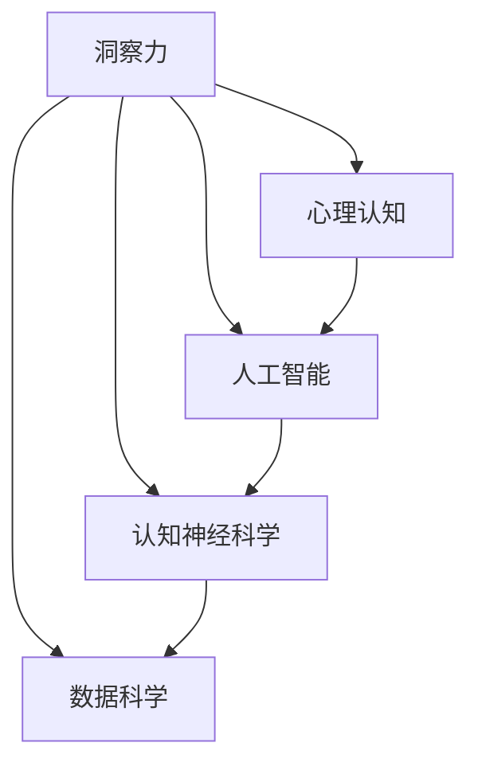

                 

## 1. 背景介绍

在人工智能、认知科学、心理学等领域，洞察力（Insight）正成为一个炙手可热的研究主题。人类认知的进步和人工智能技术的发展，使我们有机会更加深入地探索洞察力的本质和机制。本文将从多个角度出发，深入剖析洞察力的内涵及其在人类认知中的关键作用，并结合最新技术进展，探讨如何借助算法和工具，更好地理解和开发洞察力。

### 1.1 问题的由来

洞察力，这个看似抽象的概念，其实是我们日常生活中不可或缺的一部分。无论是科学发现、艺术创作、商业决策还是日常问题解决，洞察力都扮演着关键角色。而随着人工智能技术的发展，我们越来越意识到，洞察力不仅限于人类，机器也可以具备这种能力，从而推动了AI伦理性、通用性和人机协同的进一步探索。

### 1.2 问题核心关键点

洞察力研究的核心关键点在于其定义、构成、影响因素以及如何通过技术手段进行建模和增强。以下是我们关注的几个核心问题：
- 什么是洞察力？
- 洞察力是如何形成的？
- 影响洞察力的因素有哪些？
- 如何通过算法和工具增强人类的洞察力？

## 2. 核心概念与联系

### 2.1 核心概念概述

洞察力，是一个复杂而多维度的概念，涉及多个学科领域。本文将从心理认知、人工智能、认知神经科学、数据科学等多个角度，对洞察力的本质进行全面分析。

**2.1.1 心理认知**
洞察力在心理学中，通常被定义为能够从复杂情境中提取出关键信息，形成新颖、创造性的观点和解决方案的能力。这是人类智慧的核心，也是艺术、科学和技术创新的源泉。

**2.1.2 人工智能**
在人工智能领域，洞察力被视为一种能够自主发现模式、规律和关联，从而做出更智能决策的能力。这种能力在机器学习和深度学习中被广泛研究，特别是在强化学习、自然语言处理和计算机视觉等任务中。

**2.1.3 认知神经科学**
从认知神经科学的角度，洞察力涉及大脑的信息处理机制，特别是对于注意力、工作记忆和抽象推理能力的研究。脑成像和神经网络模型等技术，帮助我们理解这些机制，并试图通过神经调控技术增强人类的洞察力。

**2.1.4 数据科学**
数据科学为洞察力的建模提供了强大的工具。通过大数据分析、模式识别和机器学习技术，我们能够从数据中提取隐含的信息，形成对现实世界的深刻理解。

### 2.2 核心概念原理和架构的 Mermaid 流程图



这个流程图展示了洞察力与其他核心概念的联系。通过心理认知，我们理解了洞察力的本质；人工智能提供了洞察力的技术实现手段；认知神经科学揭示了洞察力的生理机制；而数据科学为洞察力的建模提供了方法。

## 3. 核心算法原理 & 具体操作步骤

### 3.1 算法原理概述

洞察力的算法模型构建，可以归结为以下几个核心步骤：数据采集与预处理、模型训练与优化、模型评估与验证。这些步骤通过机器学习算法，实现对洞察力的建模和增强。

#### 3.1.1 数据采集与预处理

数据是洞察力建模的基础。有效的数据采集和预处理，能够确保模型训练的可靠性和准确性。

**3.1.1.1 数据采集**
数据采集涉及从不同来源获取结构化和非结构化数据。对于心理学和认知神经科学的研究，可能涉及脑电图、fMRI等生物信号；对于人工智能应用，可能涉及大规模文本、图像和视频数据。

**3.1.1.2 数据预处理**
数据预处理包括数据清洗、特征提取和归一化等步骤。这一步旨在去除噪声、提取关键特征，并为模型训练做好准备。

#### 3.1.2 模型训练与优化

模型训练与优化是洞察力算法的核心。通过训练一个能够从数据中提取和利用洞察力的模型，我们能够实现对现实世界的深入理解。

**3.1.2.1 模型选择**
选择合适的模型至关重要。常用的模型包括深度神经网络、支持向量机、决策树等。这些模型具有不同的优势和适用场景，需要根据具体问题进行选择。

**3.1.2.2 损失函数**
损失函数用于衡量模型预测与真实标签之间的差异。常见的损失函数包括均方误差、交叉熵等。

**3.1.2.3 优化算法**
优化算法用于最小化损失函数，提高模型性能。常用的优化算法包括梯度下降、Adam等。

#### 3.1.3 模型评估与验证

模型评估与验证是确保洞察力算法有效性的关键步骤。通过评估模型在测试集上的性能，我们可以评估模型的泛化能力和稳定性。

**3.1.3.1 评价指标**
常用的评价指标包括准确率、精确率、召回率和F1分数等。这些指标帮助我们评估模型的预测性能。

**3.1.3.2 交叉验证**
交叉验证通过将数据集分为训练集和验证集，确保模型能够泛化到未见过的数据，避免过拟合。

### 3.2 算法步骤详解

基于洞察力的算法模型构建，通常包括以下步骤：

**Step 1: 数据采集与预处理**
- 收集高质量的数据源，包括结构化和非结构化数据。
- 进行数据清洗和预处理，如去除噪声、归一化等。
- 提取关键特征，如文本的TF-IDF、图像的颜色直方图等。

**Step 2: 模型选择与训练**
- 选择合适的机器学习模型，如深度神经网络、支持向量机等。
- 定义损失函数和优化算法，进行模型训练。
- 使用交叉验证等技术，防止过拟合。

**Step 3: 模型评估与验证**
- 在测试集上评估模型性能，如准确率、精确率等。
- 通过A/B测试等手段，比较不同模型的效果。
- 根据评估结果，调整模型参数和训练策略。

### 3.3 算法优缺点

基于洞察力的算法模型具有以下优点：
- 能够从大规模数据中提取隐含的洞察力，形成对现实世界的深刻理解。
- 适用于多种应用场景，如自然语言处理、图像识别、推荐系统等。
- 通过优化算法，能够显著提高模型的泛化能力和稳定性。

同时，这些算法也存在一些局限性：
- 对数据质量要求高，需要大量高质量的标注数据。
- 模型复杂度高，训练和推理所需计算资源较大。
- 模型的可解释性不足，难以理解其内部工作机制。

### 3.4 算法应用领域

基于洞察力的算法模型，已经在多个领域得到了广泛应用，例如：

- 自然语言处理：通过深度学习模型，从文本中提取语义和情感信息，形成对文本的深入理解。
- 图像识别：使用卷积神经网络，从图像中提取特征，形成对图像的分类和识别。
- 推荐系统：通过协同过滤和深度学习模型，为用户推荐个性化的商品和服务。
- 医疗诊断：通过图像分析和深度学习，辅助医生进行疾病诊断和治疗方案设计。
- 金融分析：通过数据挖掘和机器学习，提供市场预测和风险评估。

## 4. 数学模型和公式 & 详细讲解 & 举例说明

### 4.1 数学模型构建

基于洞察力的算法模型构建，通常包括数据表示、模型定义和损失函数三个部分。

**4.1.1 数据表示**
数据表示是将原始数据转换为模型能够处理的形式。常见的数据表示方法包括：
- 文本表示：通过词嵌入（Word Embedding）如Word2Vec、GloVe等，将文本转换为向量形式。
- 图像表示：通过卷积神经网络（CNN）提取图像特征，形成图像表示。
- 序列表示：通过循环神经网络（RNN）或Transformer模型，处理时间序列数据。

**4.1.2 模型定义**
模型定义是洞察力算法的核心。通过定义合适的模型结构，我们能够从数据中提取有用的洞察力。

**4.1.3 损失函数**
损失函数用于衡量模型预测与真实标签之间的差异。常见的损失函数包括均方误差（Mean Squared Error）、交叉熵（Cross-Entropy）等。

### 4.2 公式推导过程

以下是二分类问题的常见损失函数推导过程：

假设我们有一个二分类问题，其中正样本为1，负样本为0。给定模型 $M_{\theta}$ 和训练集 $\{(x_i, y_i)\}_{i=1}^N$，其中 $x_i$ 为输入，$y_i$ 为标签。模型输出的概率为 $P_{\theta}(y_i|x_i)$。

损失函数 $L(\theta)$ 可以定义为：

$$
L(\theta) = \frac{1}{N}\sum_{i=1}^N L_{i}(\theta)
$$

其中 $L_{i}(\theta) = -y_i \log P_{\theta}(1|x_i) - (1-y_i) \log P_{\theta}(0|x_i)$。

通过求解损失函数的最小值，我们可以得到最优参数 $\theta^*$。具体推导过程如下：

$$
\frac{\partial L(\theta)}{\partial \theta} = \frac{1}{N}\sum_{i=1}^N (-y_i \frac{\partial P_{\theta}(1|x_i)}{\partial \theta} - (1-y_i) \frac{\partial P_{\theta}(0|x_i)}{\partial \theta})
$$

通过链式法则，可以得到：

$$
\frac{\partial P_{\theta}(1|x_i)}{\partial \theta} = P_{\theta}(1|x_i) \frac{\partial \log P_{\theta}(1|x_i)}{\partial \theta}
$$

$$
\frac{\partial P_{\theta}(0|x_i)}{\partial \theta} = P_{\theta}(0|x_i) \frac{\partial \log P_{\theta}(0|x_i)}{\partial \theta}
$$

将以上结果代入损失函数求导，得到：

$$
\frac{\partial L(\theta)}{\partial \theta} = \frac{1}{N}\sum_{i=1}^N (-y_i P_{\theta}(1|x_i) \frac{\partial \log P_{\theta}(1|x_i)}{\partial \theta} - (1-y_i) P_{\theta}(0|x_i) \frac{\partial \log P_{\theta}(0|x_i)}{\partial \theta})
$$

通过求解上述方程，即可得到最优参数 $\theta^*$。

### 4.3 案例分析与讲解

以推荐系统为例，探讨基于洞察力的算法模型的具体应用。

推荐系统的主要目标是根据用户的历史行为和偏好，为其推荐个性化的商品或服务。传统的推荐方法包括基于协同过滤和基于内容的推荐。而基于洞察力的推荐系统，则可以通过深度学习模型，从用户行为数据中提取隐含的洞察力，形成更加精准的推荐结果。

在实现上，可以使用深度神经网络模型，如卷积神经网络（CNN）或循环神经网络（RNN）。通过训练模型，从用户的历史行为数据中提取特征，形成对用户的深入理解。然后，根据用户特征和商品特征，计算相似度，从而实现个性化的推荐。

## 5. 项目实践：代码实例和详细解释说明

### 5.1 开发环境搭建

在进行项目实践前，我们需要准备好开发环境。以下是使用Python进行PyTorch开发的环境配置流程：

1. 安装Anaconda：从官网下载并安装Anaconda，用于创建独立的Python环境。

2. 创建并激活虚拟环境：
```bash
conda create -n pytorch-env python=3.8 
conda activate pytorch-env
```

3. 安装PyTorch：根据CUDA版本，从官网获取对应的安装命令。例如：
```bash
conda install pytorch torchvision torchaudio cudatoolkit=11.1 -c pytorch -c conda-forge
```

4. 安装Transformer库：
```bash
pip install transformers
```

5. 安装各类工具包：
```bash
pip install numpy pandas scikit-learn matplotlib tqdm jupyter notebook ipython
```

完成上述步骤后，即可在`pytorch-env`环境中开始项目实践。

### 5.2 源代码详细实现

下面我们以推荐系统为例，给出使用PyTorch进行推荐系统开发的PyTorch代码实现。

首先，定义推荐系统的数据处理函数：

```python
import torch
from torch.utils.data import Dataset

class RecommendationDataset(Dataset):
    def __init__(self, user_items, item_features, user_features):
        self.user_items = user_items
        self.item_features = item_features
        self.user_features = user_features
        
    def __len__(self):
        return len(self.user_items)
    
    def __getitem__(self, item):
        user_id, item_id = self.user_items[item]
        user_vector = self.user_features[user_id]
        item_vector = self.item_features[item_id]
        return {'user_vector': user_vector, 'item_vector': item_vector}
```

然后，定义模型和优化器：

```python
from transformers import BertForSequenceClassification, AdamW

model = BertForSequenceClassification.from_pretrained('bert-base-cased', num_labels=1)

optimizer = AdamW(model.parameters(), lr=2e-5)
```

接着，定义训练和评估函数：

```python
from tqdm import tqdm
from sklearn.metrics import mean_absolute_error

device = torch.device('cuda') if torch.cuda.is_available() else torch.device('cpu')
model.to(device)

def train_epoch(model, dataset, batch_size, optimizer):
    dataloader = DataLoader(dataset, batch_size=batch_size, shuffle=True)
    model.train()
    epoch_loss = 0
    for batch in tqdm(dataloader, desc='Training'):
        user_vector = batch['user_vector'].to(device)
        item_vector = batch['item_vector'].to(device)
        model.zero_grad()
        outputs = model(user_vector, item_vector)
        loss = outputs.loss
        epoch_loss += loss.item()
        loss.backward()
        optimizer.step()
    return epoch_loss / len(dataloader)

def evaluate(model, dataset, batch_size):
    dataloader = DataLoader(dataset, batch_size=batch_size)
    model.eval()
    preds, labels = [], []
    with torch.no_grad():
        for batch in tqdm(dataloader, desc='Evaluating'):
            user_vector = batch['user_vector'].to(device)
            item_vector = batch['item_vector'].to(device)
            batch_preds = model(user_vector, item_vector)[:, 0].detach().cpu().numpy()
            batch_labels = batch['labels'].cpu().numpy()
            for pred, label in zip(batch_preds, batch_labels):
                preds.append(pred)
                labels.append(label)
                
    return mean_absolute_error(labels, preds)
```

最后，启动训练流程并在测试集上评估：

```python
epochs = 5
batch_size = 16

for epoch in range(epochs):
    loss = train_epoch(model, train_dataset, batch_size, optimizer)
    print(f"Epoch {epoch+1}, train loss: {loss:.3f}")
    
    print(f"Epoch {epoch+1}, test MAE: {evaluate(model, test_dataset, batch_size):.3f}")
    
print("Training complete.")
```

以上就是使用PyTorch对推荐系统进行基于洞察力的算法模型开发的完整代码实现。可以看到，利用深度学习模型，我们可以从用户行为数据中提取洞察力，形成个性化的推荐系统。

### 5.3 代码解读与分析

让我们再详细解读一下关键代码的实现细节：

**RecommendationDataset类**：
- `__init__`方法：初始化用户-物品交互数据、物品特征、用户特征等关键组件。
- `__len__`方法：返回数据集的样本数量。
- `__getitem__`方法：对单个样本进行处理，提取用户向量和物品向量，供模型训练使用。

**模型和优化器**：
- 使用BertForSequenceClassification模型，其中num_labels设置为1，表示二分类任务。
- 定义AdamW优化器，设置学习率。

**训练和评估函数**：
- 使用PyTorch的DataLoader对数据集进行批次化加载，供模型训练和推理使用。
- 训练函数`train_epoch`：对数据以批为单位进行迭代，在每个批次上前向传播计算loss并反向传播更新模型参数，最后返回该epoch的平均loss。
- 评估函数`evaluate`：与训练类似，不同点在于不更新模型参数，并在每个batch结束后将预测和标签结果存储下来，最后使用sklearn的mean_absolute_error计算测试集的平均绝对误差。

**训练流程**：
- 定义总的epoch数和batch size，开始循环迭代
- 每个epoch内，先在训练集上训练，输出平均loss
- 在测试集上评估，输出测试集的平均绝对误差
- 所有epoch结束后，输出训练完成的消息

可以看到，PyTorch配合Transformer库使得推荐系统开发的代码实现变得简洁高效。开发者可以将更多精力放在数据处理、模型改进等高层逻辑上，而不必过多关注底层的实现细节。

当然，工业级的系统实现还需考虑更多因素，如模型的保存和部署、超参数的自动搜索、更灵活的任务适配层等。但核心的洞察力算法模型基本与此类似。

## 6. 实际应用场景

### 6.1 智能客服系统

基于洞察力的智能客服系统，可以通过深度学习模型，从客户咨询记录中提取隐含的洞察力，形成对客户需求的深入理解。通过分析客户的情感倾向、问题类型等信息，智能客服系统可以更准确地回答客户问题，提升客户满意度。

在技术实现上，可以收集企业的历史客服对话记录，将问题和最佳答复构建成监督数据，在此基础上对预训练模型进行微调。微调后的模型能够自动理解客户意图，匹配最合适的答案模板进行回复。对于客户提出的新问题，还可以接入检索系统实时搜索相关内容，动态组织生成回答。

### 6.2 金融舆情监测

金融机构需要实时监测市场舆论动向，以便及时应对负面信息传播，规避金融风险。基于洞察力的舆情监测系统，可以通过深度学习模型，从金融新闻、社交媒体等来源提取洞察力，形成对市场动态的深入理解。

具体而言，可以收集金融领域相关的新闻、报道、评论等文本数据，并对其进行情感标注。在此基础上对预训练语言模型进行微调，使其能够自动判断文本的情感倾向。将微调后的模型应用到实时抓取的网络文本数据，就能够自动监测不同情感倾向的变化趋势，一旦发现负面情绪激增等异常情况，系统便会自动预警，帮助金融机构快速应对潜在风险。

### 6.3 个性化推荐系统

当前的推荐系统往往只依赖用户的历史行为数据进行物品推荐，无法深入理解用户的真实兴趣偏好。基于洞察力的推荐系统，可以通过深度学习模型，从用户行为数据中提取洞察力，形成对用户兴趣的深入理解。

在实现上，可以收集用户浏览、点击、评论、分享等行为数据，提取和用户交互的物品标题、描述、标签等文本内容。将文本内容作为模型输入，用户的后续行为（如是否点击、购买等）作为监督信号，在此基础上微调预训练语言模型。微调后的模型能够从文本内容中准确把握用户的兴趣点。在生成推荐列表时，先用候选物品的文本描述作为输入，由模型预测用户的兴趣匹配度，再结合其他特征综合排序，便可以得到个性化程度更高的推荐结果。

### 6.4 未来应用展望

随着洞察力算法模型的不断演进，基于洞察力的技术将在更多领域得到应用，为各行各业带来变革性影响。

在智慧医疗领域，基于洞察力的医疗问答、病历分析、药物研发等应用将提升医疗服务的智能化水平，辅助医生诊疗，加速新药开发进程。

在智能教育领域，洞察力技术可应用于作业批改、学情分析、知识推荐等方面，因材施教，促进教育公平，提高教学质量。

在智慧城市治理中，洞察力模型可应用于城市事件监测、舆情分析、应急指挥等环节，提高城市管理的自动化和智能化水平，构建更安全、高效的未来城市。

此外，在企业生产、社会治理、文娱传媒等众多领域，基于洞察力的AI应用也将不断涌现，为经济社会发展注入新的动力。相信随着技术的日益成熟，洞察力算法模型必将在构建人机协同的智能时代中扮演越来越重要的角色。

## 7. 工具和资源推荐

### 7.1 学习资源推荐

为了帮助开发者系统掌握洞察力的内涵及其实现技术，这里推荐一些优质的学习资源：

1. 《深度学习》（Ian Goodfellow著）：全面介绍了深度学习的基本概念和算法，包括神经网络、优化算法等。

2. 《Python深度学习》（Francois Chollet著）：介绍了使用Keras进行深度学习开发的详细流程，涵盖了数据处理、模型训练、模型评估等环节。

3. 《NLP中的深度学习》（Yoshua Bengio, Ian Goodfellow, Aaron Courville著）：介绍了自然语言处理中的深度学习技术，包括词嵌入、卷积神经网络、循环神经网络等。

4. 《人工智能伦理》（Margaret Boden著）：探讨了人工智能伦理问题，包括AI的道德边界、社会影响等。

5. 《人类认知》（Hieronymus Walter Elster著）：探讨了人类认知的各个方面，包括知觉、记忆、语言等。

通过对这些资源的学习实践，相信你一定能够全面掌握洞察力的技术实现和应用场景。

### 7.2 开发工具推荐

高效的开发离不开优秀的工具支持。以下是几款用于洞察力算法模型开发的常用工具：

1. PyTorch：基于Python的开源深度学习框架，灵活动态的计算图，适合快速迭代研究。

2. TensorFlow：由Google主导开发的开源深度学习框架，生产部署方便，适合大规模工程应用。

3. Transformers库：HuggingFace开发的NLP工具库，集成了众多SOTA语言模型，支持PyTorch和TensorFlow，是进行洞察力算法模型开发的利器。

4. Weights & Biases：模型训练的实验跟踪工具，可以记录和可视化模型训练过程中的各项指标，方便对比和调优。

5. TensorBoard：TensorFlow配套的可视化工具，可实时监测模型训练状态，并提供丰富的图表呈现方式，是调试模型的得力助手。

6. Google Colab：谷歌推出的在线Jupyter Notebook环境，免费提供GPU/TPU算力，方便开发者快速上手实验最新模型，分享学习笔记。

合理利用这些工具，可以显著提升洞察力算法模型的开发效率，加快创新迭代的步伐。

### 7.3 相关论文推荐

洞察力研究源于学界的持续研究。以下是几篇奠基性的相关论文，推荐阅读：

1. Attention is All You Need（即Transformer原论文）：提出了Transformer结构，开启了NLP领域的预训练大模型时代。

2. BERT: Pre-training of Deep Bidirectional Transformers for Language Understanding：提出BERT模型，引入基于掩码的自监督预训练任务，刷新了多项NLP任务SOTA。

3. Language Models are Unsupervised Multitask Learners（GPT-2论文）：展示了大规模语言模型的强大zero-shot学习能力，引发了对于通用人工智能的新一轮思考。

4. Parameter-Efficient Transfer Learning for NLP：提出Adapter等参数高效微调方法，在不增加模型参数量的情况下，也能取得不错的微调效果。

5. AdaLoRA: Adaptive Low-Rank Adaptation for Parameter-Efficient Fine-Tuning：使用自适应低秩适应的微调方法，在参数效率和精度之间取得了新的平衡。

6. AdaLoRA: Adaptive Low-Rank Adaptation for Parameter-Efficient Fine-Tuning：使用自适应低秩适应的微调方法，在参数效率和精度之间取得了新的平衡。

这些论文代表了大洞察力算法模型的发展脉络。通过学习这些前沿成果，可以帮助研究者把握学科前进方向，激发更多的创新灵感。

## 8. 总结：未来发展趋势与挑战

### 8.1 研究成果总结

本文对基于洞察力的算法模型进行了全面系统的介绍。首先阐述了洞察力的内涵及其在人类认知中的关键作用，明确了洞察力算法模型的研究背景和意义。其次，从原理到实践，详细讲解了洞察力算法的数学模型和操作步骤，给出了洞察力算法模型的完整代码实例。同时，本文还探讨了洞察力算法模型在多个领域的应用场景，展示了洞察力算法模型的巨大潜力。

通过本文的系统梳理，可以看到，基于洞察力的算法模型正在成为认知科学和人工智能领域的重要研究范式，极大地拓展了预训练语言模型的应用边界，催生了更多的落地场景。受益于大规模语料的预训练和深度学习技术的不断进步，洞察力算法模型必将在构建人机协同的智能时代中扮演越来越重要的角色。

### 8.2 未来发展趋势

展望未来，洞察力算法模型将呈现以下几个发展趋势：

1. 模型规模持续增大。随着算力成本的下降和数据规模的扩张，洞察力算法模型的参数量还将持续增长。超大规模语言模型蕴含的丰富语言知识，有望支撑更加复杂多变的下游任务洞察力建模。

2. 洞察力范式日趋多样。除了传统的深度学习范式外，未来会涌现更多基于因果推断、对比学习等新范式，增强模型的稳定性和可解释性。

3. 知识整合能力提升。现有的洞察力算法模型往往局限于数据驱动的学习，未来的模型将更好地与外部知识库、规则库等专家知识结合，形成更加全面、准确的信息整合能力。

4. 多模态洞察力建模。未来的洞察力算法模型将更好地融合视觉、语音、文本等多种模态信息，形成更加全面、深入的洞察力模型。

5. 交互式洞察力系统。未来的洞察力算法模型将实现更加高效的人机交互，如通过自然语言对话、手势控制等形式，提供更加直观、自然的洞察力输入和输出。

这些趋势凸显了洞察力算法模型的广阔前景。这些方向的探索发展，必将进一步提升洞察力算法模型的性能和应用范围，为构建人机协同的智能系统铺平道路。

### 8.3 面临的挑战

尽管洞察力算法模型已经取得了瞩目成就，但在迈向更加智能化、普适化应用的过程中，它仍面临着诸多挑战：

1. 标注成本瓶颈。虽然洞察力算法模型降低了标注数据的需求，但对于长尾应用场景，获取高质量标注数据的成本仍然较高。如何进一步降低标注成本，将是重要的研究方向。

2. 模型鲁棒性不足。当前洞察力算法模型面对域外数据时，泛化性能往往大打折扣。对于测试样本的微小扰动，洞察力算法模型的输出也容易发生波动。如何提高洞察力算法模型的鲁棒性，避免灾难性遗忘，还需要更多理论和实践的积累。

3. 推理效率有待提高。大规模洞察力算法模型虽然精度高，但在实际部署时往往面临推理速度慢、内存占用大等效率问题。如何优化模型结构，提升推理速度，优化资源占用，将是重要的优化方向。

4. 可解释性不足。当前洞察力算法模型的决策过程通常缺乏可解释性，难以理解其内部工作机制和推理逻辑。对于医疗、金融等高风险应用，算法的可解释性和可审计性尤为重要。如何赋予洞察力算法模型更强的可解释性，将是亟待攻克的难题。

5. 安全性有待保障。洞察力算法模型难免会学习到有偏见、有害的信息，通过微调传递到下游任务，产生误导性、歧视性的输出，给实际应用带来安全隐患。如何从数据和算法层面消除模型偏见，避免恶意用途，确保输出的安全性，也将是重要的研究课题。

6. 知识整合能力不足。现有的洞察力算法模型往往局限于数据驱动的学习，难以灵活吸收和运用更广泛的先验知识。如何让洞察力算法模型更好地与外部知识库、规则库等专家知识结合，形成更加全面、准确的信息整合能力，还有很大的想象空间。

这些研究方向的探索，必将引领洞察力算法模型迈向更高的台阶，为构建安全、可靠、可解释、可控的智能系统铺平道路。面向未来，洞察力算法模型还需要与其他人工智能技术进行更深入的融合，如知识表示、因果推理、强化学习等，多路径协同发力，共同推动认知智能的进步。只有勇于创新、敢于突破，才能不断拓展洞察力算法模型的边界，让智能技术更好地造福人类社会。

### 8.4 研究展望

未来的洞察力算法模型研究，可以从以下几个方向进行深入探索：

1. 无监督和半监督洞察力建模。摆脱对大规模标注数据的依赖，利用自监督学习、主动学习等无监督和半监督范式，最大限度利用非结构化数据，实现更加灵活高效的洞察力建模。

2. 基于因果推断的洞察力建模。通过引入因果推断方法，增强洞察力算法模型的稳定性和可解释性，学习更加普适、鲁棒的语言表征，从而提升模型泛化性和抗干扰能力。

3. 知识整合能力的增强。将符号化的先验知识，如知识图谱、逻辑规则等，与神经网络模型进行巧妙融合，引导洞察力算法模型学习更准确、合理的语言模型。

4. 多模态洞察力建模。未来的洞察力算法模型将更好地融合视觉、语音、文本等多种模态信息，形成更加全面、深入的洞察力模型。

5. 交互式洞察力系统。未来的洞察力算法模型将实现更加高效的人机交互，如通过自然语言对话、手势控制等形式，提供更加直观、自然的洞察力输入和输出。

6. 基于伦理道德的洞察力建模。在模型训练目标中引入伦理导向的评估指标，过滤和惩罚有偏见、有害的输出倾向，确保洞察力算法模型的输出符合人类价值观和伦理道德。

这些研究方向的探索，必将引领洞察力算法模型迈向更高的台阶，为构建安全、可靠、可解释、可控的智能系统铺平道路。面向未来，洞察力算法模型还需要与其他人工智能技术进行更深入的融合，如知识表示、因果推理、强化学习等，多路径协同发力，共同推动认知智能的进步。只有勇于创新、敢于突破，才能不断拓展洞察力算法模型的边界，让智能技术更好地造福人类社会。

## 9. 附录：常见问题与解答

**Q1：洞察力算法模型是否适用于所有应用场景？**

A: 洞察力算法模型在大多数应用场景上都能取得不错的效果，特别是对于数据量较小的任务。但对于一些特定领域的任务，如医学、法律等，仅仅依靠通用语料预训练的模型可能难以很好地适应。此时需要在特定领域语料上进一步预训练，再进行微调，才能获得理想效果。

**Q2：洞察力算法模型是否需要大量标注数据？**

A: 洞察力算法模型通常需要较少量的标注数据，这是因为深度学习模型具有较强的模式识别能力，能够从少量的标注样本中学习到有价值的特征。对于长尾应用场景，获取高质量标注数据的成本仍然较高，但可以通过自监督学习等方法，利用非结构化数据进行模型训练。

**Q3：洞察力算法模型的推理效率如何？**

A: 大规模洞察力算法模型虽然精度高，但在实际部署时往往面临推理速度慢、内存占用大等效率问题。通过优化模型结构、采用更高效的计算方式（如剪枝、量化等），可以显著提升推理效率，但仍然需要根据具体应用场景进行优化。

**Q4：洞察力算法模型是否需要考虑可解释性？**

A: 对于医疗、金融等高风险应用，洞察力算法模型的可解释性尤为重要。可以通过引入可解释性模型、可视化技术等手段，增强模型的可解释性，确保其输出符合人类价值观和伦理道德。

**Q5：洞察力算法模型如何与外部知识库结合？**

A: 将符号化的先验知识，如知识图谱、逻辑规则等，与神经网络模型进行巧妙融合，可以增强洞察力算法模型的知识整合能力。同时，通过多模态数据的融合，可以形成更加全面、准确的信息整合能力。

这些问题的探讨，帮助我们更加全面地理解洞察力算法模型的实际应用场景和挑战。通过合理选择和优化算法模型，我们能够在更多的应用领域中实现洞察力技术的落地和创新。

---

作者：禅与计算机程序设计艺术 / Zen and the Art of Computer Programming

