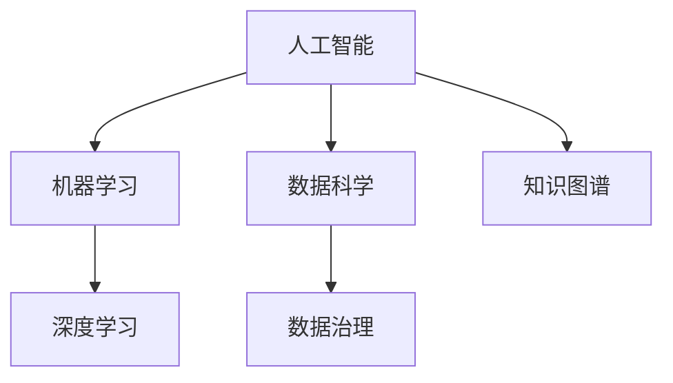

                 

# 洞察力：知识创新的引领者

> 关键词：洞察力,知识创新,人工智能,机器学习,深度学习,大数据,数据科学,数据治理

## 1. 背景介绍

### 1.1 问题由来

在现代信息爆炸的时代，数据成为各类创新的重要驱动力。人工智能（AI）、机器学习（ML）、深度学习（DL）等技术的发展，尤其是大数据分析的应用，正在推动各行各业的创新变革。然而，尽管技术日新月异，知识创新的深度和广度也在不断拓展，传统的以经验和直觉为导向的决策模式已难以适应新形势。

人工智能的核心在于数据处理和模式识别，而洞察力则是在大数据背景下的知识发现、分析和应用。洞察力是指通过深度数据分析、挖掘隐藏的模式和趋势，实现数据驱动的决策支持。面对当前海量数据的挑战，洞察力的重要性愈发凸显。如何在海量数据中挖掘出有价值的知识，成为科技公司、政府和企业关注的焦点。

### 1.2 问题核心关键点

洞察力与人工智能、大数据、数据科学等技术紧密相关，其核心关键点包括：

1. 数据处理和分析：如何高效处理大规模数据，提取有用的信息。
2. 数据挖掘和模式识别：如何在数据中发现隐藏的趋势和模式。
3. 数据可视化：如何通过可视化工具将复杂的数据分析结果简洁明了地呈现出来。
4. 数据治理和质量控制：如何确保数据的质量、完整性和安全性。
5. 数据驱动的决策：如何将数据洞察转化为实际行动，支持业务决策。

这些关键点共同构成了洞察力的全貌，从数据获取、处理、分析到应用，每一个环节都对最终的知识创新成果有着重要影响。

### 1.3 问题研究意义

洞察力的研究对人工智能和大数据技术的发展有着深远的意义：

1. 提升决策效率：洞察力能够提供基于数据支持的决策建议，提升企业决策的科学性和效率。
2. 增强竞争力：通过深入的数据分析和洞察力，企业可以在市场竞争中获得优势，保持领先地位。
3. 创新突破：洞察力支持的新模式和新产品开发，可以带来颠覆性的创新，推动产业进步。
4. 数据驱动的业务：洞察力将数据转化为业务价值，支撑各类数据驱动的业务运营。
5. 技术演进：洞察力的研究与应用促进了AI、ML、DL等技术的进一步发展。

## 2. 核心概念与联系

### 2.1 核心概念概述

为更好地理解洞察力，本文将介绍几个密切相关的核心概念：

- 人工智能（AI）：利用计算机科学和数据的结合，构建智能系统的技术。AI旨在模拟人类智能，实现数据处理、模式识别、自然语言理解等任务。
- 机器学习（ML）：一种使计算机从数据中学习规律和模式的技术。ML通过数据训练模型，使其能够进行预测和分类。
- 深度学习（DL）：一种基于神经网络的ML方法，通过多层次的抽象和特征学习，实现复杂数据处理。
- 数据科学（Data Science）：涉及数据处理、分析和可视化的多学科领域。数据科学注重从数据中提取知识和洞察力。
- 数据治理（Data Governance）：管理数据质量、安全和隐私的体系和流程。数据治理确保数据的一致性和可靠性。
- 知识图谱（Knowledge Graph）：一种用于表示知识结构的数据模型，通过节点和边的关系描述实体和属性。

这些核心概念之间的逻辑关系可以通过以下Mermaid流程图来展示：



这个流程图展示了几大核心概念及其之间的关系：

1. 人工智能涵盖了ML和DL等技术，旨在通过算法和模型实现智能。
2. 数据科学是AI和ML的基础，通过数据处理和分析支持AI和ML。
3. 数据治理保障了数据的质量和安全，是数据科学的核心环节。
4. 知识图谱将结构化知识与数据科学和AI结合，提升知识抽取和推理能力。

## 3. 核心算法原理 & 具体操作步骤
### 3.1 算法原理概述

洞察力的获取主要依赖于数据处理和分析技术，常用的算法包括：

1. 数据预处理：清洗、归一化、特征选择等步骤，提高数据质量。
2. 数据挖掘：通过聚类、分类、回归等方法发现数据中的模式。
3. 模式识别：利用图像识别、文本分析等技术识别特定模式。
4. 数据可视化：通过图表、热力图等形式，直观展示分析结果。
5. 统计分析：运用统计学方法，提取数据特征和趋势。
6. 机器学习：通过模型训练，预测和分类数据。

### 3.2 算法步骤详解

以下以机器学习中常用的线性回归算法为例，展示洞察力的具体实现步骤：

**Step 1: 数据准备**
- 收集数据集，进行清洗和预处理。
- 划分训练集、验证集和测试集。
- 选择特征变量和目标变量。

**Step 2: 模型训练**
- 构建线性回归模型，包括参数初始化和假设函数。
- 使用梯度下降算法更新模型参数，最小化损失函数。
- 在验证集上评估模型性能，调整超参数。

**Step 3: 模型评估**
- 使用测试集评估模型的预测效果。
- 计算评估指标，如均方误差（MSE）、决定系数（R²）等。
- 输出洞察结果，为决策提供支持。

### 3.3 算法优缺点

机器学习算法在获取洞察力方面具有以下优点：

1. 自动发现模式：机器学习算法能够自动从数据中学习模式，无需人工干预。
2. 处理复杂数据：可以处理大规模、高维度的数据集。
3. 预测能力：利用训练好的模型进行预测，支持决策支持。
4. 多样性选择：有多种算法可供选择，适用于不同类型的数据和问题。

但同时，也存在一些缺点：

1. 数据依赖：模型性能依赖于数据质量，数据偏差可能导致模型预测错误。
2. 过拟合风险：在数据量不足的情况下，模型容易过拟合，泛化能力差。
3. 计算成本：训练和优化模型需要大量的计算资源。
4. 解释性不足：机器学习模型往往具有“黑盒”特性，难以解释其决策过程。

### 3.4 算法应用领域

洞察力的获取在多个领域都有广泛应用，例如：

- 金融分析：通过分析历史交易数据，预测市场趋势和风险。
- 医疗诊断：利用患者历史数据，预测疾病发展和治疗效果。
- 客户细分：通过消费者行为数据，进行市场细分和个性化推荐。
- 供应链优化：分析物流和库存数据，优化供应链管理。
- 营销策略：分析销售数据，制定有效的营销策略。

此外，洞察力在智能制造、智慧城市、教育等领域也有重要应用，推动相关产业的智能化和信息化转型。

## 4. 数学模型和公式 & 详细讲解 & 举例说明

### 4.1 数学模型构建

在本节中，我们将使用数学语言对线性回归算法进行详细描述。

设数据集为 $\{(x_i, y_i)\}_{i=1}^N$，其中 $x_i \in \mathbb{R}^d$ 为特征向量，$y_i \in \mathbb{R}$ 为目标变量。假设线性回归模型为 $y = \beta_0 + \sum_{j=1}^d \beta_j x_{ij}$，其中 $\beta_0, \beta_1, ..., \beta_d$ 为模型参数。

线性回归的目标是最小化预测值与实际值之间的平方误差，即：

$$
\min_{\beta} \sum_{i=1}^N (y_i - \beta_0 - \sum_{j=1}^d \beta_j x_{ij})^2
$$

### 4.2 公式推导过程

最小二乘法的公式推导如下：

- 定义误差平方和：$SSE = \sum_{i=1}^N (y_i - \hat{y}_i)^2$，其中 $\hat{y}_i = \beta_0 + \sum_{j=1}^d \beta_j x_{ij}$ 为预测值。
- 将误差平方和展开：$SSE = \sum_{i=1}^N (y_i - \hat{y}_i)^2 = \sum_{i=1}^N (y_i - \beta_0 - \sum_{j=1}^d \beta_j x_{ij})^2$
- 对参数 $\beta_0, \beta_1, ..., \beta_d$ 求偏导数，得：
$$
\frac{\partial SSE}{\partial \beta_0} = -2\sum_{i=1}^N (y_i - \hat{y}_i)
$$
$$
\frac{\partial SSE}{\partial \beta_j} = -2\sum_{i=1}^N (y_i - \hat{y}_i) x_{ij}
$$
- 令偏导数为零，求解得：
$$
\beta_0 = \frac{1}{N} \sum_{i=1}^N y_i
$$
$$
\beta_j = \frac{1}{N} \sum_{i=1}^N (y_i - \beta_0) x_{ij}
$$

### 4.3 案例分析与讲解

以某电商平台的销售数据分析为例，展示线性回归的应用。

**数据准备**：
- 收集该电商平台的历史销售数据，包括时间、产品、销售量等。
- 清洗数据，去除缺失和异常值。
- 划分训练集、验证集和测试集。

**模型训练**：
- 选择时间作为自变量 $x_i$，销售量作为目标变量 $y_i$。
- 构建线性回归模型，使用梯度下降算法训练模型参数。
- 在验证集上评估模型性能，调整超参数。

**模型评估**：
- 使用测试集评估模型的预测效果。
- 计算均方误差和决定系数，评估模型性能。
- 输出洞察结果，如未来销售量的预测。

通过线性回归算法，该电商平台可以预测未来销售量，制定库存和促销策略，优化销售业绩。

## 5. 项目实践：代码实例和详细解释说明

### 5.1 开发环境搭建

在进行洞察力项目开发前，我们需要准备好开发环境。以下是使用Python进行Scikit-Learn开发的环境配置流程：

1. 安装Anaconda：从官网下载并安装Anaconda，用于创建独立的Python环境。

2. 创建并激活虚拟环境：
```bash
conda create -n insight-env python=3.8 
conda activate insight-env
```

3. 安装Scikit-Learn：
```bash
conda install scikit-learn
```

4. 安装NumPy、Pandas、Matplotlib、Seaborn等库：
```bash
pip install numpy pandas matplotlib seaborn
```

5. 安装Jupyter Notebook：
```bash
pip install jupyter notebook
```

完成上述步骤后，即可在`insight-env`环境中开始项目实践。

### 5.2 源代码详细实现

下面我们以线性回归模型为例，展示使用Scikit-Learn进行数据处理和分析的Python代码实现。

首先，定义数据处理函数：

```python
import numpy as np
import pandas as pd
from sklearn.model_selection import train_test_split
from sklearn.linear_model import LinearRegression
from sklearn.metrics import mean_squared_error

def load_data():
    data = pd.read_csv('sales_data.csv')
    X = data[['time']]
    y = data['sales']
    return X, y

def preprocess_data(X, y):
    X = np.array(X).reshape(-1, 1)
    y = np.array(y)
    return X, y

def train_model(X_train, y_train, X_test, y_test):
    model = LinearRegression()
    model.fit(X_train, y_train)
    y_pred = model.predict(X_test)
    mse = mean_squared_error(y_test, y_pred)
    return mse
```

然后，调用数据处理和模型训练函数：

```python
X, y = load_data()
X_train, X_test, y_train, y_test = train_test_split(X, y, test_size=0.2, random_state=42)

mse = train_model(X_train, y_train, X_test, y_test)
print(f'Mean Squared Error: {mse:.2f}')
```

### 5.3 代码解读与分析

让我们再详细解读一下关键代码的实现细节：

**load_data函数**：
- 使用Pandas读取数据文件，提取自变量和目标变量。
- 返回预处理后的特征和标签数据。

**preprocess_data函数**：
- 对特征数据进行去向量化处理，将其转换为NumPy数组。
- 对标签数据进行去向量化处理，并将其转换为NumPy数组。

**train_model函数**：
- 使用Scikit-Learn的LinearRegression类构建线性回归模型。
- 在训练集上训练模型，使用测试集进行预测。
- 计算均方误差，返回评估结果。

**调用数据处理和模型训练函数**：
- 加载数据集并进行预处理。
- 使用train_test_split函数划分数据集。
- 在训练集上训练模型，并在测试集上评估模型性能。

通过以上代码，我们可以快速构建一个简单的线性回归模型，并评估其预测效果。

## 6. 实际应用场景

### 6.1 金融分析

在金融领域，洞察力可以帮助金融机构进行风险评估、投资决策和客户管理。通过分析市场数据、客户行为和信用记录等，洞察力可以预测市场趋势、识别风险因素，辅助决策制定。

**案例**：某银行利用线性回归模型分析客户信用记录，预测客户还款能力。模型输入包括客户的收入、年龄、婚姻状况等特征，目标变量为是否逾期还款。模型训练后，银行可以根据预测结果，调整信贷政策，减少不良贷款风险。

### 6.2 医疗诊断

医疗领域的数据量巨大，洞察力可以通过分析患者历史数据，预测疾病发展和治疗效果，辅助医生制定个性化治疗方案。

**案例**：某医院利用机器学习模型分析患者历史数据，预测疾病发展和治疗效果。模型输入包括患者的年龄、性别、生活习惯等特征，目标变量为疾病发展和治疗效果。模型训练后，医生可以根据预测结果，制定个性化治疗方案，提高治疗效果。

### 6.3 客户细分

客户细分是市场营销的重要环节，洞察力可以通过分析客户行为数据，进行市场细分和个性化推荐，提升客户满意度和转化率。

**案例**：某电商公司利用机器学习模型分析客户购买行为，进行市场细分和个性化推荐。模型输入包括客户的浏览历史、购买记录等特征，目标变量为客户的细分标签。模型训练后，公司可以根据预测结果，进行精准营销，提升客户满意度和转化率。

### 6.4 供应链优化

供应链优化需要考虑物流、库存、生产等多个环节，洞察力可以通过分析供应链数据，优化供应链管理，提高效率和降低成本。

**案例**：某物流公司利用机器学习模型分析供应链数据，优化库存管理和物流调度。模型输入包括货物的运输时间、需求量等特征，目标变量为库存量和物流路线。模型训练后，公司可以根据预测结果，优化库存管理和物流调度，降低成本，提高效率。

### 6.5 营销策略

洞察力可以通过分析销售数据，制定有效的营销策略，提高营销效果和ROI。

**案例**：某公司利用机器学习模型分析销售数据，制定营销策略。模型输入包括广告投放、销售数据等特征，目标变量为营销效果。模型训练后，公司可以根据预测结果，调整营销策略，提高营销效果和ROI。

## 7. 工具和资源推荐

### 7.1 学习资源推荐

为了帮助开发者系统掌握洞察力的相关技术，这里推荐一些优质的学习资源：

1. 《Python数据科学手册》：深入浅出地介绍了数据科学和机器学习的核心技术，适合初学者入门。
2. 《机器学习实战》：由机器学习专家撰写，提供了丰富的实战案例，适合实践学习。
3. 《深度学习》（Ian Goodfellow著）：深度学习领域的经典教材，涵盖神经网络、模型训练、优化算法等核心内容。
4. Kaggle平台：提供大量的数据集和竞赛，帮助你通过实践提升技术水平。
5. Coursera、edX等在线学习平台：提供多门与数据科学、机器学习相关的课程，系统学习相关知识。

通过对这些资源的学习实践，相信你一定能够快速掌握洞察力的相关技术，并应用于实际问题解决。

### 7.2 开发工具推荐

高效的开发离不开优秀的工具支持。以下是几款用于洞察力开发的常用工具：

1. Python：作为数据科学和机器学习的主流语言，Python提供了丰富的科学计算和数据分析库，如NumPy、Pandas、Scikit-Learn等。
2. Jupyter Notebook：提供交互式的编程环境，便于代码调试和文档记录。
3. R：作为数据科学和统计分析的主流语言，R提供了丰富的数据分析和统计库，如ggplot2、dplyr等。
4. TensorFlow和PyTorch：深度学习领域的主流框架，提供高效的模型训练和推理支持。
5. Weights & Biases：模型训练的实验跟踪工具，可以记录和可视化模型训练过程中的各项指标，方便对比和调优。

合理利用这些工具，可以显著提升洞察力开发的效率，加速创新迭代的步伐。

### 7.3 相关论文推荐

洞察力的研究源于学界的持续探索。以下是几篇奠基性的相关论文，推荐阅读：

1. 《机器学习：概率视角》：由机器学习专家PMLR撰写，全面介绍了机器学习的理论基础和算法实现。
2. 《深度学习》（Goodfellow et al.著）：深度学习领域的经典教材，涵盖神经网络、模型训练、优化算法等核心内容。
3. 《大数据分析与应用》：由数据科学专家撰写，涵盖数据处理、分析和应用的全面内容。
4. 《数据治理：管理数据质量、安全和隐私的体系和流程》：由数据治理专家撰写，全面介绍了数据治理的体系和流程。

这些论文代表了大数据和机器学习技术的发展脉络。通过学习这些前沿成果，可以帮助研究者把握学科前进方向，激发更多的创新灵感。

## 8. 总结：未来发展趋势与挑战

### 8.1 总结

本文对洞察力的研究进行了全面系统的介绍。首先阐述了洞察力的背景、核心关键点和研究意义，明确了洞察力在数据驱动决策中的独特价值。其次，从原理到实践，详细讲解了机器学习在洞察力获取中的具体应用，给出了详细代码实例。同时，本文还广泛探讨了洞察力在金融、医疗、客户细分等多个领域的应用前景，展示了洞察力的巨大潜力。此外，本文精选了相关学习资源，力求为读者提供全方位的技术指引。

通过本文的系统梳理，可以看到，洞察力的研究对人工智能和大数据技术的发展有着深远的意义。洞察力的获取不仅能提升决策效率，还能增强企业竞争力，推动技术创新。未来，伴随大数据和机器学习技术的进一步发展，洞察力的研究与应用将迎来更加广阔的前景。

### 8.2 未来发展趋势

展望未来，洞察力的研究与应用将呈现以下几个发展趋势：

1. 自动化和智能化：自动化数据处理和智能决策支持将成为主要趋势，进一步提升洞察力获取的效率和准确性。
2. 多模态融合：将视觉、语音、文本等多模态数据融合，提升洞察力的全面性和综合性。
3. 实时分析：实时数据流分析将成为重要方向，提高决策的及时性和响应速度。
4. 跨领域应用：洞察力将在更多领域得到应用，如智慧城市、智能制造等，推动相关产业的智能化转型。
5. 数据隐私保护：随着数据隐私保护意识的增强，如何保障数据安全和隐私，将成为重要的研究方向。

以上趋势凸显了洞察力研究的广阔前景。这些方向的探索发展，必将进一步提升数据驱动决策的科学性和有效性，为各行各业带来深刻变革。

### 8.3 面临的挑战

尽管洞察力研究与应用在取得显著成果的同时，也面临着诸多挑战：

1. 数据质量问题：数据质量直接影响洞察力的准确性，如何提高数据质量，降低数据噪声，是首先需要解决的问题。
2. 模型复杂性：大规模数据和高维特征使得模型更加复杂，如何降低模型复杂性，提高模型可解释性，是另一个重要挑战。
3. 计算资源限制：洞察力的获取需要大量的计算资源，如何降低计算成本，提高计算效率，是技术应用中的瓶颈。
4. 数据安全和隐私：海量数据和复杂模型带来数据安全和隐私问题，如何保护数据安全和隐私，是重要的研究方向。
5. 跨领域应用：不同领域的数据和问题具有多样性，如何构建通用的洞察力框架，适应多种场景，是未来的研究方向。

这些挑战需要我们在数据处理、模型训练、计算资源、数据安全和隐私等各个环节进行深入探索和创新，才能更好地应用洞察力技术，实现数据驱动的决策支持。

### 8.4 研究展望

未来，洞察力的研究需要在以下几个方面寻求新的突破：

1. 自动化数据处理：通过自动化数据处理技术，提升数据清洗、特征选择的效率和准确性。
2. 模型简化与可解释性：开发更加简单、可解释性强的模型，降低复杂度，提高决策的透明度和可信度。
3. 跨领域应用框架：构建通用的洞察力框架，适应不同领域的数据和问题，提升应用范围和效果。
4. 数据隐私保护技术：研究数据隐私保护技术，保障数据安全和隐私，推动数据驱动的决策支持。
5. 多模态融合与实时分析：将多模态数据和实时数据流分析技术结合，提升洞察力的全面性和实时性。

这些研究方向将推动洞察力技术不断突破，实现更加智能、全面、高效的数据驱动决策支持。

## 9. 附录：常见问题与解答

**Q1：如何处理大规模数据？**

A: 处理大规模数据需要采用分布式计算和并行处理技术。可以考虑使用Hadoop、Spark等大数据处理框架，将数据分散存储和并行处理，提升数据处理效率。同时，可以采用数据分块、增量更新等技术，减少内存占用和计算时间。

**Q2：如何选择合适的算法？**

A: 选择合适的算法需要考虑数据类型、任务类型、计算资源等因素。一般而言，结构化数据适合使用统计分析和经典算法，如回归、分类等。非结构化数据适合使用深度学习算法，如图像识别、文本分析等。数据量较小的情况下，可以使用传统机器学习算法；数据量较大的情况下，可以考虑使用深度学习算法。

**Q3：如何提高模型的可解释性？**

A: 提高模型的可解释性可以通过可视化技术、特征重要性分析等方法，帮助理解模型决策过程。可以使用Shap值、LIME等工具，对模型进行可视化分析和解释。同时，可以设计更简单、更可解释的模型，如决策树、线性回归等，提升决策的透明度和可信度。

**Q4：如何保障数据安全和隐私？**

A: 保障数据安全和隐私需要采用加密、匿名化、访问控制等技术。可以使用数据加密技术，保护数据在传输和存储过程中的安全。采用数据匿名化技术，保护数据隐私。设置访问控制策略，限制数据的访问权限，防止数据泄露。

**Q5：如何应用洞察力进行决策支持？**

A: 应用洞察力进行决策支持需要结合业务需求，选择合适的模型和算法。可以采用机器学习模型，如回归、分类、聚类等，从数据中提取洞察力。结合业务领域知识和专家经验，进行模型验证和优化。使用可视化工具，将洞察力结果直观呈现，支持决策制定。

通过以上问题解答，可以看到，洞察力的研究与应用需要考虑多个因素，需要我们在数据处理、模型选择、计算资源、数据安全和隐私等各个环节进行综合考虑和优化。只有在数据驱动决策中实现全面、智能、高效的应用，才能真正发挥洞察力的价值。

