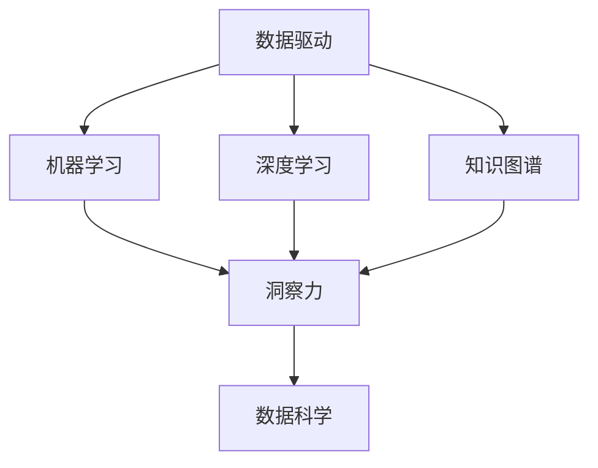

                 

# 洞察力：知识创新的核心要素

> 关键词：洞察力, 知识创新, 数据驱动, 人工智能, 机器学习, 深度学习, 知识图谱, 数据科学

## 1. 背景介绍

### 1.1 问题由来
在现代社会，知识创新是推动科技进步、经济发展的核心动力。然而，如何高效地获取、处理和利用知识，成为摆在人们面前的一大挑战。随着大数据、人工智能等技术的迅猛发展，一种新兴的数据驱动型知识创新方法——洞察力（Insight）正在兴起，并逐渐成为知识创新领域的重要工具。

洞察力是指通过对数据进行深度挖掘和分析，揭示数据背后的规律、趋势和关联，从而形成新的知识或视角。这种新知识不仅有助于解决实际问题，还能推动理论研究的发展，驱动经济和社会的进步。

### 1.2 问题核心关键点
洞察力的核心在于如何高效地从数据中提取有价值的信息，形成对问题的新理解。这涉及以下几个关键点：

- 数据收集：高质量、多样化的数据是洞察力的基础。
- 数据处理：通过清洗、预处理、特征工程等步骤，对原始数据进行规范化。
- 数据分析：利用机器学习、深度学习等算法，发现数据中的模式和规律。
- 结果解释：对分析结果进行可视化、解释，形成可操作的洞察。

以下章节将深入探讨这些核心关键点，通过逻辑清晰、结构紧凑的专业技术语言，帮助读者系统理解洞察力的全过程。

## 2. 核心概念与联系

### 2.1 核心概念概述

为更好地理解洞察力的概念，本节将介绍几个紧密相关的核心概念：

- 数据驱动：指基于数据来进行决策和创新的一种方法，强调数据在决策中的核心作用。
- 机器学习（Machine Learning, ML）：一种通过数据训练模型，从而自动获取知识和决策的能力。
- 深度学习（Deep Learning, DL）：一种特殊的机器学习方法，利用多层神经网络对数据进行特征提取和分类。
- 知识图谱（Knowledge Graph）：一种结构化知识表示形式，用于描述实体之间的关系。
- 数据科学（Data Science）：一门跨学科的领域，利用数据和技术方法来探索数据、发现知识、支持决策。

这些核心概念之间的逻辑关系可以通过以下Mermaid流程图来展示：



这个流程图展示了数据驱动、机器学习、深度学习、知识图谱和数据科学之间相互联系：

1. 数据驱动利用机器学习和深度学习从数据中获取知识，形成洞察力。
2. 知识图谱为机器学习和深度学习提供结构化的知识表示，增强其推理能力。
3. 数据科学则综合应用这些方法，解决实际问题，推动知识创新。

这些概念共同构成了洞察力的技术基础，使得从数据中提取有价值洞察成为可能。

## 3. 核心算法原理 & 具体操作步骤
### 3.1 算法原理概述

洞察力的核心算法原理是通过数据挖掘和机器学习算法，从数据中提取模式和规律，形成对问题的深刻理解。这一过程可以分为以下几个步骤：

1. 数据收集：收集与问题相关的数据，包括结构化数据和非结构化数据。
2. 数据清洗与预处理：通过数据清洗和特征工程，对原始数据进行处理，提取有用的特征。
3. 模型训练与评估：利用机器学习和深度学习算法，对数据进行建模，并通过评估指标判断模型性能。
4. 洞察形成：对分析结果进行可视化或解释，形成可操作的洞察。

### 3.2 算法步骤详解

#### 3.2.1 数据收集

数据收集是洞察力的第一步，主要包括以下几个方面：

- **数据类型**：数据可以是结构化数据（如表格数据、时间序列数据）或非结构化数据（如文本、图像、音频等）。
- **数据来源**：数据的来源可以多样化，包括公共数据集、企业内部数据、社交媒体数据等。
- **数据量**：数据量越大，洞察力越强，但同时也需要考虑数据的质量和可用性。

#### 3.2.2 数据清洗与预处理

数据清洗与预处理是确保数据质量的关键步骤，主要包括以下几个方面：

- **缺失值处理**：对于缺失值，可以选择删除、填充、插值等方法进行处理。
- **异常值处理**：通过统计方法或模型方法检测并处理异常值。
- **特征工程**：通过特征提取、特征选择、特征变换等方法，将原始数据转换为可用于建模的特征。

#### 3.2.3 模型训练与评估

模型训练与评估是洞察力的核心步骤，主要包括以下几个方面：

- **选择合适的模型**：根据问题类型和数据特点，选择合适的机器学习或深度学习模型，如线性回归、随机森林、神经网络等。
- **模型训练**：使用训练集对模型进行训练，最小化模型在训练集上的损失。
- **模型评估**：使用验证集对模型进行评估，选择性能最优的模型。

#### 3.2.4 洞察形成

洞察形成是洞察力的最后一步，主要包括以下几个方面：

- **结果可视化**：通过图表、热图、散点图等形式，将分析结果可视化，使结果更直观易懂。
- **结果解释**：对分析结果进行解释，形成可操作的洞察。例如，利用关联规则、分类树、回归模型等方法，揭示数据中的规律和趋势。

### 3.3 算法优缺点

洞察力的算法具有以下优点：

- **高效性**：洞察力利用机器学习和深度学习算法，可以高效地处理大规模数据，形成对问题的深刻理解。
- **可操作性**：洞察力将数据转化为具体的知识，可以指导实际决策，推动创新。
- **可解释性**：洞察力通过可视化和技术解释，使得分析结果更具可解释性，便于理解和使用。

同时，洞察力的算法也存在一些局限性：

- **数据依赖性**：洞察力的效果依赖于数据的质量和多样性，高质量数据稀缺时效果可能不佳。
- **模型复杂性**：洞察力的模型复杂度较高，需要大量计算资源进行训练和优化。
- **结果局限性**：洞察力依赖于数据和模型，可能存在偏见和错误，需要进行多次验证和校准。

### 3.4 算法应用领域

洞察力的应用领域非常广泛，涵盖了数据驱动的各个方面：

- **商业智能（Business Intelligence, BI）**：利用洞察力分析客户行为、市场趋势、销售数据等，提升业务决策。
- **金融分析**：通过洞察力分析金融市场数据、信用记录、交易数据等，优化投资策略和风险控制。
- **医疗健康**：利用洞察力分析患者数据、医疗记录、基因数据等，提升医疗诊断和治疗效果。
- **智能制造**：通过洞察力分析生产数据、设备状态、供应链数据等，优化生产流程和资源配置。
- **智能交通**：利用洞察力分析交通流量、车辆数据、路况信息等，优化交通管理和出行体验。

## 4. 数学模型和公式 & 详细讲解 & 举例说明

### 4.1 数学模型构建

洞察力的数学模型构建通常包括以下几个步骤：

- **问题定义**：明确需要解决的问题，如预测客户流失率、识别异常交易等。
- **数据收集**：收集与问题相关的数据，如客户行为记录、交易数据等。
- **数据预处理**：对数据进行清洗和特征工程，提取有用的特征。
- **模型选择**：选择适合的机器学习或深度学习模型，如线性回归、随机森林、神经网络等。
- **模型训练**：使用训练集对模型进行训练，最小化模型在训练集上的损失。
- **模型评估**：使用验证集对模型进行评估，选择性能最优的模型。
- **结果解释**：对分析结果进行解释，形成可操作的洞察。

### 4.2 公式推导过程

以预测客户流失率为例，推导线性回归模型的公式：

假设数据集为 $D=\{(x_i,y_i)\}_{i=1}^N$，其中 $x_i$ 为特征向量，$y_i$ 为客户流失标签。设线性回归模型为 $y_i = \theta_0 + \theta_1 x_{i1} + \cdots + \theta_p x_{ip}$，则最小二乘法的损失函数为：

$$
\mathcal{L}(\theta) = \frac{1}{2N}\sum_{i=1}^N(y_i - (\theta_0 + \theta_1 x_{i1} + \cdots + \theta_p x_{ip}))^2
$$

求解上述损失函数的最小值，得到：

$$
\theta_j = \frac{\sum_{i=1}^N(x_{ij}y_i)}{\sum_{i=1}^Nx_{ij}^2}, \quad j=0,1,\cdots,p
$$

其中 $\theta_j$ 为线性回归模型的系数，$x_{ij}$ 为第 $i$ 个样本的第 $j$ 个特征，$y_i$ 为客户流失标签。

### 4.3 案例分析与讲解

以金融欺诈检测为例，展示如何利用洞察力进行问题解决。

**问题定义**：检测信用卡交易中的欺诈行为。

**数据收集**：收集包含用户信息、交易时间、金额等特征的数据集。

**数据预处理**：对数据进行缺失值处理、异常值检测和特征选择，提取有用的特征。

**模型选择**：选择随机森林模型，利用特征工程进行模型训练和优化。

**模型训练**：使用训练集对模型进行训练，最小化模型在训练集上的误差。

**模型评估**：使用验证集对模型进行评估，选择性能最优的模型。

**洞察形成**：通过可视化和技术解释，揭示欺诈行为的特征和规律。

## 5. 项目实践：代码实例和详细解释说明

### 5.1 开发环境搭建

进行洞察力实践前，我们需要准备好开发环境。以下是使用Python进行Scikit-learn开发的Python环境配置流程：

1. 安装Anaconda：从官网下载并安装Anaconda，用于创建独立的Python环境。

2. 创建并激活虚拟环境：
```bash
conda create -n insight-env python=3.8 
conda activate insight-env
```

3. 安装Scikit-learn：
```bash
pip install scikit-learn
```

4. 安装其他工具包：
```bash
pip install numpy pandas matplotlib seaborn jupyter notebook
```

完成上述步骤后，即可在`insight-env`环境中开始洞察力实践。

### 5.2 源代码详细实现

这里以信用卡欺诈检测为例，展示如何使用Scikit-learn进行洞察力分析。

```python
import pandas as pd
from sklearn.model_selection import train_test_split
from sklearn.ensemble import RandomForestClassifier
from sklearn.metrics import confusion_matrix
from sklearn.metrics import roc_auc_score

# 加载数据集
data = pd.read_csv('creditcard.csv')

# 数据预处理
features = ['V1', 'V2', 'V3', 'V4', 'V5', 'V6', 'V7', 'V8', 'V9', 'Amount']
target = 'Class'
X = data[features]
y = data[target]

# 特征工程
X = pd.get_dummies(X)
X = X.drop('V6', axis=1)

# 模型训练
X_train, X_test, y_train, y_test = train_test_split(X, y, test_size=0.2, random_state=42)
model = RandomForestClassifier(n_estimators=100, random_state=42)
model.fit(X_train, y_train)

# 模型评估
y_pred = model.predict(X_test)
roc_auc = roc_auc_score(y_test, y_pred)
confusion_matrix = confusion_matrix(y_test, y_pred)

# 洞察形成
print("ROC AUC Score:", roc_auc)
print("Confusion Matrix:\n", confusion_matrix)
```

以上代码展示了使用Scikit-learn进行信用卡欺诈检测的完整过程，从数据预处理到模型训练和评估，再到洞察形成。

### 5.3 代码解读与分析

让我们再详细解读一下关键代码的实现细节：

**加载数据集**：使用pandas库加载包含用户信息、交易时间、金额等特征的数据集。

**数据预处理**：将特征进行转换，使用get_dummies函数将分类特征转换为哑变量，同时删除不需要的特征V6。

**模型训练**：使用train_test_split函数将数据集划分为训练集和测试集，使用RandomForestClassifier模型进行训练。

**模型评估**：使用预测结果计算ROC AUC Score和Confusion Matrix，评估模型性能。

**洞察形成**：通过打印ROC AUC Score和Confusion Matrix，揭示模型的预测能力和分类效果。

## 6. 实际应用场景

### 6.1 商业智能

洞察力在商业智能（BI）领域有着广泛的应用。通过洞察力分析客户行为数据、市场趋势数据等，企业可以更好地理解市场，优化营销策略，提升销售业绩。例如，利用洞察力分析电商平台的用户行为数据，可以发现用户的购买偏好和购买路径，优化产品推荐和广告投放。

### 6.2 金融分析

在金融分析领域，洞察力可以用于风险评估、投资策略优化、市场预测等。例如，利用洞察力分析金融市场数据、信用记录等，可以评估客户的信用风险，优化贷款审批流程。同时，洞察力还可以用于分析历史交易数据，预测股票价格波动，优化投资组合。

### 6.3 医疗健康

在医疗健康领域，洞察力可以用于疾病预测、患者分群、治疗效果评估等。例如，利用洞察力分析患者数据、医疗记录等，可以预测疾病发展趋势，优化治疗方案。同时，洞察力还可以用于分析基因数据，发现基因与疾病之间的关系，推动个性化医疗的发展。

### 6.4 智能制造

在智能制造领域，洞察力可以用于设备故障预测、生产效率优化、供应链管理等。例如，利用洞察力分析生产数据、设备状态等，可以预测设备故障，优化生产流程。同时，洞察力还可以用于分析供应链数据，优化资源配置，降低生产成本。

## 7. 工具和资源推荐

### 7.1 学习资源推荐

为了帮助开发者系统掌握洞察力的理论基础和实践技巧，这里推荐一些优质的学习资源：

1. 《Python数据科学手册》：详细介绍了Python在数据科学中的应用，包括数据清洗、特征工程、模型训练等。
2. 《机器学习实战》：介绍常见的机器学习算法和实际应用案例，适合初学者入门。
3. 《深度学习》（Goodfellow等）：系统介绍了深度学习的基本原理和应用，包括神经网络、卷积神经网络、循环神经网络等。
4. 《知识图谱与语义网》：介绍知识图谱的基本概念和应用，适合对知识表示感兴趣的读者。
5. 《数据科学导论》：提供数据科学领域的全面介绍，包括数据获取、数据处理、模型训练等。

通过对这些资源的学习实践，相信你一定能够快速掌握洞察力的精髓，并用于解决实际的业务问题。

### 7.2 开发工具推荐

高效的开发离不开优秀的工具支持。以下是几款用于洞察力开发的常用工具：

1. Jupyter Notebook：轻量级的交互式开发环境，方便开发者快速迭代实验。
2. Pandas：数据处理和分析的核心库，提供高效的数据操作功能。
3. Scikit-learn：机器学习算法的封装库，易于使用，功能丰富。
4. TensorFlow：深度学习框架，提供丰富的深度学习模型和工具。
5. PyTorch：深度学习框架，提供灵活的计算图和动态图功能。

合理利用这些工具，可以显著提升洞察力分析的开发效率，加快创新迭代的步伐。

### 7.3 相关论文推荐

洞察力的研究源于学界的持续研究。以下是几篇奠基性的相关论文，推荐阅读：

1. "A Study of Predictive Analytics for Customer Churn"：通过预测客户流失率，展示了洞察力在客户关系管理中的应用。
2. "Machine Learning and Data Mining in Credit Card Fraud Detection"：利用机器学习算法检测信用卡欺诈行为，展示了洞察力在金融安全中的应用。
3. "Knowledge Graphs for Improved Medicine"：介绍知识图谱在医疗领域的应用，展示了洞察力在医疗决策中的应用。
4. "Deep Learning for Predictive Maintenance"：利用深度学习算法进行设备故障预测，展示了洞察力在智能制造中的应用。
5. "Intelligent Transportation Systems Using Data Analytics"：通过分析交通数据，优化交通管理和出行体验，展示了洞察力在智能交通中的应用。

这些论文代表了大数据驱动型知识创新的发展脉络。通过学习这些前沿成果，可以帮助研究者把握学科前进方向，激发更多的创新灵感。

## 8. 总结：未来发展趋势与挑战

### 8.1 总结

本文对基于数据驱动的洞察力进行了全面系统的介绍。首先阐述了洞察力的背景和意义，明确了洞察力在知识创新中的核心作用。其次，从原理到实践，详细讲解了洞察力的全过程，包括数据收集、数据处理、模型训练和结果解释。同时，本文还广泛探讨了洞察力在商业智能、金融分析、医疗健康、智能制造等多个领域的应用前景，展示了洞察力的巨大潜力。

通过对这些核心概念的深入解读，可以看到，洞察力作为数据驱动型知识创新的重要工具，能够高效地从数据中提取有价值的信息，形成对问题的新理解。未来，随着数据规模的不断扩大和机器学习技术的不断进步，洞察力的应用场景将更加广泛，为各行各业带来深刻的变革。

### 8.2 未来发展趋势

展望未来，洞察力的发展将呈现以下几个趋势：

1. **数据量的增加**：随着物联网、大数据等技术的发展，数据的规模将不断增加，为洞察力提供了更多的数据源和更丰富的数据类型。
2. **算法复杂度的提升**：深度学习、强化学习等先进算法的引入，将使得洞察力模型更加复杂，能力更强。
3. **多模态数据的融合**：在商业智能、金融分析等领域，多模态数据的融合将使得洞察力模型更加全面，更具有普适性。
4. **自动化和智能化**：自动化数据处理、模型训练、结果解释等技术的发展，将使得洞察力分析更加智能化、自动化。
5. **伦理和安全性的考虑**：随着洞察力在更多领域的应用，如何保障数据隐私、模型透明度和安全性将成为重要的研究方向。

这些趋势展示了洞察力的发展方向，也为未来的研究提供了新的方向。

### 8.3 面临的挑战

尽管洞察力技术已经取得了显著成果，但在实际应用中仍面临一些挑战：

1. **数据质量**：高质量、多样化的数据是洞察力的基础，但在实际应用中，数据的获取和处理常常遇到问题。
2. **模型复杂度**：洞察力模型的复杂度较高，需要大量的计算资源和专业知识。
3. **结果解释**：洞察力模型通常复杂且黑盒化，结果的解释性较弱，如何增强模型的可解释性将是重要的研究方向。
4. **隐私和安全**：洞察力分析涉及大量敏感数据，如何保障数据隐私和安全是一个重要问题。

### 8.4 研究展望

面对洞察力所面临的挑战，未来的研究需要在以下几个方面寻求新的突破：

1. **数据治理**：通过数据清洗、数据治理等技术，提高数据质量，保障数据的可用性和可靠性。
2. **模型优化**：研究更高效、更智能的模型结构，降低计算资源消耗，提高模型性能。
3. **结果解释**：引入可解释性技术，增强洞察力模型的透明性和可解释性。
4. **隐私保护**：采用隐私保护技术，保障数据的隐私和安全。

这些研究方向将推动洞察力技术的进一步发展，为各行各业带来更深层次的数据驱动型创新。

## 9. 附录：常见问题与解答

**Q1：数据质量对洞察力的影响有多大？**

A: 数据质量对洞察力的影响非常大。高质量、多样化的数据是洞察力的基础。数据的质量直接影响模型的性能和结果的可靠性。因此，在数据预处理阶段，需要采用多种方法进行数据清洗、特征工程，以提高数据质量。

**Q2：如何选择适合的洞察力算法？**

A: 选择适合的洞察力算法需要考虑多个因素，包括问题类型、数据特点、计算资源等。一般来说，可以先使用简单的算法（如线性回归、决策树等）进行初步分析，然后根据结果选择更复杂的算法（如神经网络、随机森林等）进行优化。同时，可以使用交叉验证等方法评估算法的性能。

**Q3：洞察力模型需要多少数据？**

A: 洞察力模型对数据量的需求因问题而异。一般来说，数据量越大，模型的性能越好。但在实际应用中，数据量的获取和处理常常是一个难题。因此，需要在保证数据质量的前提下，尽可能收集更多的数据，以提高模型的效果。

**Q4：洞察力结果的可解释性如何增强？**

A: 增强洞察力结果的可解释性是洞察力研究的重要方向之一。可以使用可视化技术（如图表、热图等）对结果进行展示，同时引入可解释性技术（如LIME、SHAP等）对模型的决策过程进行解释。此外，还可以使用解释性模型（如决策树、逻辑回归等）进行结果解释。

**Q5：洞察力在智能制造中的应用有哪些？**

A: 洞察力在智能制造领域有广泛的应用，主要包括：

1. **设备故障预测**：通过分析设备运行数据，预测设备故障，优化维护策略。
2. **生产效率优化**：通过分析生产数据，优化生产流程，提高生产效率。
3. **供应链管理**：通过分析供应链数据，优化资源配置，降低成本。

通过这些应用，洞察力能够帮助制造企业提高生产效率，降低成本，提升竞争力。

---

作者：禅与计算机程序设计艺术 / Zen and the Art of Computer Programming

