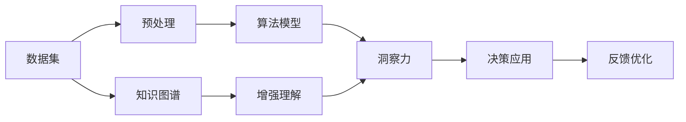

                 

# 洞察力：知识应用的指南针

> 关键词：洞察力,知识应用,数据驱动决策,智能决策支持,人工智能,机器学习,深度学习,算法优化

## 1. 背景介绍

### 1.1 问题由来

在快速发展的现代社会中，信息爆炸的时代背景下，人类面临前所未有的数据量。金融、医疗、教育、交通等各行各业都产生了大量的结构化和非结构化数据。如何有效利用这些数据，挖掘背后的洞见，做出更精准、更高效、更有竞争力的决策，是每个行业从业者都需要面对的挑战。

传统的决策方式往往依赖经验、直觉和人工分析，但这些方法在面对复杂问题时常常力不从心。随着人工智能和大数据技术的发展，数据驱动的决策支持系统成为一种越来越有效的工具，以机器学习、深度学习为核心的技术正在逐渐成为决策者的好帮手。

### 1.2 问题核心关键点

数据驱动决策的核心在于利用数据和算法模型，从中提炼出洞察力。洞察力指的是从数据中获得的深层次理解，它能够揭示数据背后的模式、趋势、关联，并指导行动和策略。其关键点在于：

- **数据质量**：高质量的数据是洞察力提炼的基础，数据应具有代表性、真实性、准确性。
- **算法模型**：选择合适的算法模型是提取洞察力的核心。不同的模型适用于不同类型的数据和问题，如回归模型用于预测，分类模型用于分类，聚类模型用于发现模式。
- **分析过程**：在数据和模型基础上，进行分析和可视化，才能揭示出真正的洞察力。
- **决策应用**：洞察力最终要服务于决策，指导实际行动。

### 1.3 问题研究意义

在数据驱动决策的研究和实践中，洞察力扮演着至关重要的角色。它不仅能帮助企业提升运营效率、优化资源配置、降低成本，还能在医疗、金融、教育等领域，助力决策者做出更科学、更合理的判断。因此，研究如何高效地提取、理解和应用洞察力，对提升人类决策质量、推动社会进步具有重要意义。

## 2. 核心概念与联系

### 2.1 核心概念概述

为了深入理解数据驱动决策中的洞察力，本节将介绍几个核心概念：

- **数据驱动决策**：以数据为基础，利用统计分析、机器学习等技术，辅助决策过程的决策方式。
- **洞察力**：从数据中提取的深层次理解，揭示数据背后的模式、趋势、关联。
- **知识图谱**：一种结构化表示实体及实体间关系的图，用于增强数据理解和推理。
- **深度学习**：一类模拟人脑神经网络的机器学习技术，通过多层非线性变换学习复杂模式。
- **强化学习**：通过试错过程学习最优策略的机器学习方法，广泛用于智能决策、游戏等。

这些概念相互联系，构成了一个数据驱动决策的系统框架。它们共同作用，帮助从数据中提炼出洞察力，指导决策过程。

### 2.2 核心概念原理和架构的 Mermaid 流程图

以下是一个简单的Mermaid流程图，展示了数据驱动决策中几个关键组件的关系：



这个流程图展示了数据驱动决策的基本流程：

1. **数据集**：原始数据是洞察力的来源。
2. **预处理**：清洗、整理和转换数据，以适应后续分析和模型训练。
3. **算法模型**：选择合适的模型，提取和分析数据中的模式和趋势。
4. **洞察力**：从模型输出中提炼深层次理解，识别关键洞见。
5. **决策应用**：将洞察力应用于具体决策中，指导行动和策略。
6. **反馈优化**：根据实际效果调整模型和分析方法，不断改进。
7. **知识图谱**：辅助理解数据和模型，增强洞察力的深度和广度。

## 3. 核心算法原理 & 具体操作步骤

### 3.1 算法原理概述

基于洞察力的数据驱动决策，核心在于从数据中提炼洞察力，并在决策中加以应用。其核心算法包括：

- **回归模型**：用于预测数值型数据的未来值，常见的如线性回归、随机森林等。
- **分类模型**：用于分类非数值型数据，如逻辑回归、支持向量机等。
- **聚类算法**：用于发现数据中的自然分组，如K-Means、DBSCAN等。
- **关联规则算法**：用于发现数据中的潜在关联，如Apriori算法、FP-Growth等。
- **深度学习模型**：如卷积神经网络(CNN)、循环神经网络(RNN)、变分自编码器(VAE)等，适用于复杂数据结构的分析。

这些算法各有优缺点，根据数据类型和问题需求，选择合适的模型和参数，进行训练和评估，是数据驱动决策的关键。

### 3.2 算法步骤详解

以下详细介绍数据驱动决策中的关键算法步骤：

**Step 1: 数据预处理**

- **清洗数据**：删除或修正缺失、异常值，确保数据质量。
- **特征选择**：选择对洞察力提取有帮助的特征。
- **数据转换**：对数据进行标准化、归一化等预处理操作，以适应算法要求。

**Step 2: 模型训练**

- **选择合适的模型**：根据数据类型和问题需求，选择合适的算法模型。
- **设置模型参数**：选择合适的超参数，如学习率、正则化系数、隐层大小等。
- **训练模型**：使用训练集数据，训练模型参数，最小化损失函数。

**Step 3: 模型评估**

- **交叉验证**：使用交叉验证技术，评估模型泛化能力。
- **误差分析**：分析模型在不同数据集上的表现，识别问题原因。
- **模型调整**：根据误差分析结果，调整模型参数或选择其他模型。

**Step 4: 洞察力提炼**

- **特征重要性分析**：使用特征重要性分析技术，识别关键特征。
- **模型可视化**：使用可视化工具，展示模型学习到的模式和趋势。
- **洞见提取**：从模型输出中提炼出关键洞察力，如趋势、关联、异常等。

**Step 5: 决策应用**

- **策略制定**：根据洞察力指导策略制定。
- **资源分配**：优化资源配置，提高运营效率。
- **行动执行**：执行决策策略，监控效果。

**Step 6: 反馈优化**

- **效果评估**：根据实际效果评估决策效果。
- **模型改进**：根据评估结果，调整模型和分析方法。
- **持续优化**：建立反馈机制，持续优化决策系统。

### 3.3 算法优缺点

数据驱动决策中的算法有其各自的优缺点，如下：

#### 优点

- **自动化决策**：利用算法自动化决策过程，减少人工干预。
- **高效性**：通过计算优化，快速提炼洞察力，指导决策。
- **可扩展性**：算法模型易于扩展，适用于大规模数据分析。

#### 缺点

- **数据依赖**：算法结果高度依赖数据质量。
- **模型复杂性**：模型选择不当可能导致误导性洞察。
- **透明度问题**：部分算法模型过于复杂，难以解释。

### 3.4 算法应用领域

数据驱动决策的算法广泛应用在多个领域：

- **金融行业**：利用算法预测市场趋势，指导投资策略，优化风险管理。
- **医疗领域**：通过数据分析，辅助疾病诊断，优化治疗方案，提升医疗服务。
- **零售行业**：使用算法分析消费者行为，制定个性化营销策略，优化库存管理。
- **制造业**：利用数据分析优化生产流程，提升生产效率，降低成本。
- **交通运输**：通过数据分析，优化交通流量管理，提高道路通行效率。

## 4. 数学模型和公式 & 详细讲解 & 举例说明

### 4.1 数学模型构建

在本节中，我们将以线性回归模型为例，介绍数学模型构建的基本过程。

假设有一组数据 $(x_i, y_i)$，其中 $x_i$ 是自变量，$y_i$ 是因变量。线性回归模型的目标是通过最小化误差函数，找到最优的系数 $\beta$，使得模型预测值与实际值尽可能接近。

设线性回归模型为 $y = \beta_0 + \beta_1 x + \epsilon$，其中 $\beta_0$ 是截距，$\beta_1$ 是系数，$\epsilon$ 是误差项。最小化误差函数 $\sum_{i=1}^N (y_i - \hat{y}_i)^2$，可以使用梯度下降算法求解。

### 4.2 公式推导过程

设误差函数为 $L(\beta) = \frac{1}{2N}\sum_{i=1}^N (y_i - \beta_0 - \beta_1 x_i)^2$，则误差函数的梯度为：

$$
\nabla_{\beta} L(\beta) = \frac{1}{N} \begin{bmatrix} \sum_{i=1}^N (-y_i + \beta_0 + \beta_1 x_i) \\ \sum_{i=1}^N (x_i)(-y_i + \beta_0 + \beta_1 x_i) \end{bmatrix}
$$

使用梯度下降算法更新 $\beta$：

$$
\beta \leftarrow \beta - \eta \nabla_{\beta} L(\beta)
$$

其中 $\eta$ 是学习率，需要手动设置。

### 4.3 案例分析与讲解

以下通过一个简单的案例，展示如何使用线性回归模型进行数据驱动决策。

假设我们有一组数据，记录了每天气温和销售额之间的关系，目标是通过线性回归模型，预测未来的销售额。数据如下：

| 日期     | 气温(℃) | 销售额 |
|----------|---------|--------|
| 2022-01-01 | 10      | 5000   |
| 2022-01-02 | 12      | 6000   |
| 2022-01-03 | 15      | 7000   |
| ...      | ...     | ...    |
| 2022-01-10 | 18      | 9000   |

使用上述数据，训练线性回归模型，步骤如下：

1. 数据预处理：将数据标准化，计算均值和标准差。
2. 模型训练：使用梯度下降算法，更新模型参数 $\beta$，使得预测值与实际值尽可能接近。
3. 模型评估：使用交叉验证技术，评估模型泛化能力。
4. 洞察力提炼：分析特征重要性，识别关键因素。
5. 决策应用：根据模型预测结果，制定销售策略。

在实际应用中，可以根据具体需求，调整模型参数，使用不同算法，如多项式回归、岭回归、Lasso回归等，以获得更好的效果。

## 5. 项目实践：代码实例和详细解释说明

### 5.1 开发环境搭建

为了进行数据驱动决策的实践，我们需要搭建合适的开发环境。以下是使用Python和Scikit-learn进行环境配置的步骤：

1. 安装Anaconda：从官网下载并安装Anaconda，用于创建独立的Python环境。

2. 创建并激活虚拟环境：
```bash
conda create -n decision-env python=3.8 
conda activate decision-env
```

3. 安装Python和Scikit-learn：
```bash
conda install python=3.8
conda install scikit-learn
```

4. 安装可视化工具：
```bash
conda install matplotlib seaborn
```

完成上述步骤后，即可在`decision-env`环境中进行数据驱动决策的实践。

### 5.2 源代码详细实现

以下是一个简单的线性回归模型实现的Python代码，展示如何使用Scikit-learn进行数据驱动决策：

```python
import numpy as np
from sklearn.linear_model import LinearRegression
from sklearn.model_selection import train_test_split
from sklearn.metrics import mean_squared_error

# 模拟数据生成
np.random.seed(42)
x = np.linspace(0, 10, 10)
y = 2*x + 1 + np.random.normal(0, 1, 10)

# 数据分割
x_train, x_test, y_train, y_test = train_test_split(x, y, test_size=0.3, random_state=42)

# 模型训练
model = LinearRegression()
model.fit(x_train.reshape(-1, 1), y_train)

# 模型评估
y_pred = model.predict(x_test.reshape(-1, 1))
rmse = np.sqrt(mean_squared_error(y_test, y_pred))
print(f"RMSE: {rmse:.2f}")

# 洞察力提炼
import matplotlib.pyplot as plt
plt.scatter(x_test, y_test, label='Actual')
plt.scatter(x_test, y_pred, label='Predicted')
plt.legend()
plt.show()
```

### 5.3 代码解读与分析

让我们详细解读一下关键代码的实现细节：

**数据生成**

```python
np.random.seed(42)
x = np.linspace(0, 10, 10)
y = 2*x + 1 + np.random.normal(0, 1, 10)
```

使用NumPy生成一组线性关系的数据，包含10个样本，x从0到10线性变化，y为x的2倍加1，并加入一些噪声。

**数据分割**

```python
x_train, x_test, y_train, y_test = train_test_split(x, y, test_size=0.3, random_state=42)
```

将数据分割为训练集和测试集，比例为70%和30%。

**模型训练**

```python
model = LinearRegression()
model.fit(x_train.reshape(-1, 1), y_train)
```

使用Scikit-learn的LinearRegression模型进行训练，其中reshape(-1, 1)将一维数组转换为二维数组，方便模型训练。

**模型评估**

```python
y_pred = model.predict(x_test.reshape(-1, 1))
rmse = np.sqrt(mean_squared_error(y_test, y_pred))
print(f"RMSE: {rmse:.2f}")
```

使用测试集数据进行预测，并计算预测值与实际值的RMSE（均方根误差），作为模型性能的指标。

**洞察力提炼**

```python
import matplotlib.pyplot as plt
plt.scatter(x_test, y_test, label='Actual')
plt.scatter(x_test, y_pred, label='Predicted')
plt.legend()
plt.show()
```

使用Matplotlib绘制实际值与预测值的关系图，直观展示模型效果，帮助进一步理解数据和模型。

## 6. 实际应用场景

### 6.1 智能客服系统

智能客服系统可以广泛应用数据驱动决策技术，通过分析历史客服记录，识别常见问题和解决方案，从而提高客户满意度和服务效率。具体实现如下：

1. **数据收集**：从客服系统收集历史对话记录，包括用户输入、客服回复、问题解决情况等。
2. **数据预处理**：清洗和转换数据，提取有用信息。
3. **模型训练**：使用分类或回归模型，训练对话预测模型，预测用户意图和解决方案。
4. **洞察力提炼**：分析模型性能，识别高频问题和成功案例，指导客服策略。
5. **决策应用**：根据模型预测结果，优化客服策略，提升服务质量。

### 6.2 金融风险管理

金融行业可以利用数据驱动决策技术，实时监控市场风险，提前预警和防范。具体实现如下：

1. **数据收集**：从金融市场收集交易数据、财务报表、新闻等信息。
2. **数据预处理**：清洗和转换数据，提取关键指标。
3. **模型训练**：使用回归或分类模型，训练市场趋势预测模型。
4. **洞察力提炼**：分析模型输出，识别市场异常和潜在风险。
5. **决策应用**：根据市场趋势和风险预警，制定投资策略和风险管理方案。

### 6.3 医疗诊断系统

医疗行业可以利用数据驱动决策技术，辅助医生进行疾病诊断和治疗决策。具体实现如下：

1. **数据收集**：从医院收集患者病历、检查报告、治疗记录等信息。
2. **数据预处理**：清洗和转换数据，提取关键特征。
3. **模型训练**：使用分类或回归模型，训练疾病预测和治疗方案推荐模型。
4. **洞察力提炼**：分析模型输出，识别高风险疾病和有效治疗方案。
5. **决策应用**：根据模型预测结果，优化诊断和治疗策略，提高医疗服务质量。

## 7. 工具和资源推荐

### 7.1 学习资源推荐

为了帮助开发者掌握数据驱动决策技术，以下是一些优质的学习资源：

1. 《Python数据科学手册》：全面介绍了Python在数据科学中的应用，包括数据清洗、数据可视化、模型训练等。
2. 《机器学习实战》：通过实际案例，讲解了多种机器学习算法的实现和应用。
3. 《深度学习入门：基于Python的理论与实现》：讲解了深度学习的基础知识和实现方法。
4. Coursera《数据科学与机器学习》课程：斯坦福大学的公开课，涵盖数据科学和机器学习的基本概念和算法。
5. Kaggle竞赛平台：参与数据驱动决策相关的竞赛，实践和提升技能。

### 7.2 开发工具推荐

为了高效进行数据驱动决策的开发，以下是一些常用的开发工具：

1. Jupyter Notebook：强大的交互式编程环境，支持多种编程语言和数据可视化。
2. PyCharm：专业的Python IDE，提供代码自动补全、调试、版本控制等功能。
3. TensorFlow和PyTorch：强大的深度学习框架，支持高效的模型训练和推理。
4. Scikit-learn：开源的Python机器学习库，提供了丰富的模型和算法。
5. Matplotlib和Seaborn：数据可视化的Python库，支持绘制多种图表。

### 7.3 相关论文推荐

数据驱动决策技术的发展源于学界的持续研究，以下是几篇重要的相关论文：

1. "The Elements of Statistical Learning"：提供了统计学习的基础理论和方法。
2. "Deep Learning"：讲解了深度学习的基本原理和实现方法。
3. "Pattern Recognition and Machine Learning"：提供了模式识别和机器学习的基础知识。
4. "An Introduction to Statistical Learning"：讲解了统计学习的基本原理和方法。
5. "Hands-On Machine Learning with Scikit-Learn and TensorFlow"：讲解了使用Scikit-learn和TensorFlow进行机器学习的实践方法。

这些论文代表了数据驱动决策技术的研究方向和前沿进展，推荐阅读。

## 8. 总结：未来发展趋势与挑战

### 8.1 总结

本文对数据驱动决策中的洞察力提取和应用进行了全面系统的介绍。首先阐述了数据驱动决策的背景和意义，明确了洞察力在决策中的关键作用。其次，从原理到实践，详细讲解了数据预处理、模型训练、洞察力提炼和决策应用等关键步骤，给出了数据驱动决策的完整代码实现。同时，本文还广泛探讨了数据驱动决策在智能客服、金融风险管理、医疗诊断等多个行业领域的应用前景，展示了数据驱动决策的巨大潜力。此外，本文精选了数据驱动决策技术的各类学习资源，力求为读者提供全方位的技术指引。

通过本文的系统梳理，可以看到，数据驱动决策中的洞察力提取和应用，正在成为各行各业决策的重要手段，极大地提升了决策的科学性和效率。未来，伴随数据技术的不断进步和应用场景的拓展，数据驱动决策必将在更广泛的领域发挥作用，带来深远的社会影响。

### 8.2 未来发展趋势

展望未来，数据驱动决策技术将呈现以下几个发展趋势：

1. **智能化决策**：通过引入AI和大数据技术，提升决策的智能化水平，实现自动决策和预测。
2. **自动化流程**：通过机器学习自动化决策流程，减少人工干预，提高决策效率。
3. **跨领域应用**：数据驱动决策技术将拓展到更多领域，如教育、交通、环保等，推动各行业的智能化转型。
4. **大数据融合**：利用多源异构数据融合技术，提高决策的全面性和准确性。
5. **个性化决策**：通过分析用户行为和偏好，提供个性化决策方案，提升用户体验。
6. **模型解释性**：提升模型的可解释性，增强决策的透明度和可信度。

### 8.3 面临的挑战

尽管数据驱动决策技术已经取得了显著进展，但在迈向更加智能化、普适化应用的过程中，仍面临诸多挑战：

1. **数据质量问题**：数据质量不高，数据缺失、噪声等问题影响模型效果。
2. **模型复杂性**：模型过于复杂，难以解释和优化。
3. **隐私和安全**：数据隐私和安全问题，特别是医疗和金融领域的数据敏感性。
4. **计算资源**：大规模数据分析和模型训练需要高性能计算资源。
5. **伦理和道德**：决策过程中可能出现的不公平、歧视等问题，需要关注伦理和道德。

### 8.4 研究展望

面对数据驱动决策中的挑战，未来的研究需要在以下几个方面寻求新的突破：

1. **数据治理**：建立数据质量管理体系，确保数据准确性、完整性和一致性。
2. **模型优化**：简化模型结构，提高模型解释性，降低模型复杂性。
3. **隐私保护**：采用数据加密、差分隐私等技术，保护数据隐私和安全。
4. **计算优化**：优化计算资源配置，提高模型训练和推理效率。
5. **伦理规范**：制定数据驱动决策的伦理规范，确保决策公平、透明。

这些研究方向将推动数据驱动决策技术的进一步发展，助力各行各业实现智能化转型，提升决策质量和效率。

## 9. 附录：常见问题与解答

**Q1：数据驱动决策是否适用于所有行业？**

A: 数据驱动决策技术适用于大多数行业，特别是那些数据量较大、决策复杂度高的领域。但对于一些领域，如艺术、创意产业等，数据驱动决策的适用性较低。

**Q2：如何选择适合的数据驱动决策模型？**

A: 选择合适的模型需要考虑多个因素，包括数据类型、问题复杂度、性能需求等。一般建议先进行初步分析，选择适合初期的模型，并根据结果逐步优化。常见的模型包括回归模型、分类模型、聚类模型等。

**Q3：数据驱动决策中的洞察力如何提取？**

A: 洞察力的提取通常包括以下步骤：数据预处理、特征选择、模型训练、模型评估、洞察力提炼和决策应用。其中，模型训练和洞察力提炼是关键步骤，需要选择合适的模型和算法，并通过可视化工具辅助理解。

**Q4：如何评估数据驱动决策的效果？**

A: 数据驱动决策的效果评估通常使用误差指标、模型性能指标、实际效果等进行评估。常见的评估指标包括均方误差、准确率、召回率、F1值等。

**Q5：如何应对数据驱动决策中的数据质量问题？**

A: 应对数据质量问题通常需要以下措施：数据清洗、数据转换、数据增强等。同时，可以通过引入先验知识，提高模型的鲁棒性。

这些问题的解答，展示了数据驱动决策技术的全面应用，帮助读者更好地理解和应用数据驱动决策技术。

---

作者：禅与计算机程序设计艺术 / Zen and the Art of Computer Programming

