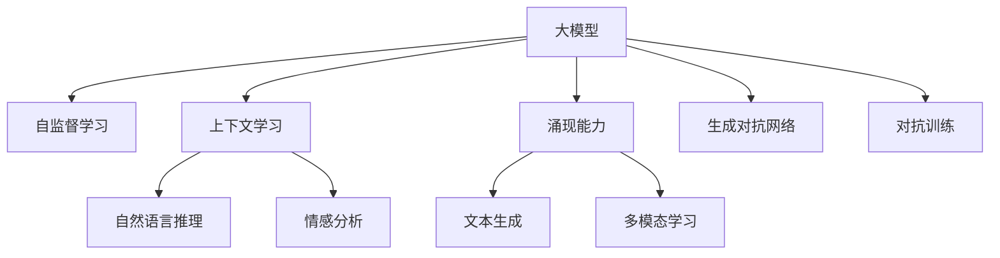

                 

# 涌现能力与上下文学习：大模型的核心优势

> 关键词：大模型,涌现能力,上下文学习,自监督学习,Transformer,BERT,预训练,后监督学习

## 1. 背景介绍

### 1.1 问题由来
近年来，深度学习技术在各个领域取得了突破性的进展，特别是在自然语言处理(NLP)、计算机视觉(CV)、语音识别等领域。其中，大规模预训练语言模型(BERT、GPT等)以其强大的语言理解和生成能力，成为最热门的研究方向之一。这些大模型通过在海量无标签文本数据上进行预训练，学习到了丰富的语言知识，能够处理复杂的语言任务。然而，大模型也有其局限性，如对特定任务性能的提升有限，难以适应小规模数据集等。

### 1.2 问题核心关键点
为了解决上述问题，研究人员提出了基于监督学习的大语言模型微调方法。该方法的核心思想是将预训练模型作为初始化参数，通过有监督地训练来优化模型在特定任务上的性能。该方法在NLP、CV、SL等领域得到了广泛的应用，并在众多任务上取得了显著的效果。

但大模型的优势并不仅仅限于微调。本文将深入探讨大模型的核心优势，特别是涌现能力和上下文学习机制。通过理解这些核心优势，我们可以更好地把握大模型的本质，并应用于更多场景。

### 1.3 问题研究意义
研究大模型的涌现能力和上下文学习机制，对于拓展大模型的应用边界，提升下游任务的性能，加速人工智能技术的产业化进程，具有重要意义：

1. 降低应用开发成本。基于成熟的大模型进行微调，可以显著减少从头开发所需的数据、计算和人力等成本投入。
2. 提升模型效果。微调使得通用大模型更好地适应特定任务，在应用场景中取得更优表现。
3. 加速开发进度。standing on the shoulders of giants，微调使得开发者可以更快地完成任务适配，缩短开发周期。
4. 带来技术创新。微调范式促进了对预训练-微调的深入研究，催生了提示学习、少样本学习等新的研究方向。
5. 赋能产业升级。微调使得NLP技术更容易被各行各业所采用，为传统行业数字化转型升级提供新的技术路径。

## 2. 核心概念与联系

### 2.1 核心概念概述

为更好地理解大模型的核心优势，本节将介绍几个密切相关的核心概念：

- 大模型(Large Model)：以自回归(如GPT)或自编码(如BERT)模型为代表的大规模预训练模型。通过在海量无标签文本数据上进行预训练，学习到了丰富的语言知识，具备强大的语言理解和生成能力。

- 涌现能力(Emergent Capability)：指大模型在预训练过程中，通过学习数据分布的隐含模式，自动获得特定领域能力，如自然语言推理、情感分析、文本生成等。这些能力并非预先设定，而是通过大规模数据和复杂结构的学习自然产生。

- 上下文学习(Contextual Learning)：指大模型能够利用输入文本的上下文信息，自动推断出最合理的语义表达。这种能力使得模型能够处理非平稳、不确定的数据，从而获得更好的性能。

- 自监督学习(Self-Supervised Learning)：指在缺乏标注数据的情况下，通过设计自监督任务来训练模型，使其学习到数据分布的隐含模式。BERT和GPT等大模型均使用了自监督学习。

- 生成对抗网络(GAN)：指通过对抗样本训练模型，使其能够更好地适应各种数据分布和噪声。GAN在图像生成、语音合成等领域得到了广泛的应用。

- 对抗训练(Adversarial Training)：指在模型训练过程中，加入对抗样本，提高模型的鲁棒性和泛化能力。对抗训练在大模型中得到了广泛应用。

这些核心概念之间的逻辑关系可以通过以下Mermaid流程图来展示：



这个流程图展示了大模型的核心概念及其之间的关系：

1. 大模型通过自监督学习获得丰富的语言知识。
2. 上下文学习机制使得模型能够利用输入文本的上下文信息，自动推断出最合理的语义表达。
3. 涌现能力指的是大模型在预训练过程中，通过学习数据分布的隐含模式，自动获得特定领域能力。
4. 生成对抗网络通过对抗样本训练模型，提高模型的鲁棒性和泛化能力。
5. 对抗训练通过加入对抗样本，进一步提高模型的鲁棒性和泛化能力。

这些核心概念共同构成了大模型的学习框架，使其能够在各种场景下发挥强大的语言理解和生成能力。通过理解这些核心概念，我们可以更好地把握大模型的本质，并应用于更多场景。

## 3. 核心算法原理 & 具体操作步骤
### 3.1 算法原理概述

大模型的核心优势主要体现在其涌现能力和上下文学习机制上。以下将详细探讨这两大核心优势，并结合具体的算法原理进行说明。

### 3.2 算法步骤详解

**Step 1: 准备预训练模型和数据集**
- 选择合适的预训练模型 $M_{\theta}$ 作为初始化参数，如 BERT、GPT等。
- 准备下游任务 $T$ 的标注数据集 $D=\{(x_i,y_i)\}_{i=1}^N$，划分为训练集、验证集和测试集。一般要求标注数据与预训练数据的分布不要差异过大。

**Step 2: 上下文学习**
- 在预训练模型基础上，设计合适的任务适配层，将上下文信息作为输入。
- 例如，对于命名实体识别任务，可以在输入文本中添加实体边界信息，引导模型进行实体识别。
- 使用训练集对模型进行微调，使其能够自动推断出最合理的语义表达。

**Step 3: 涌现能力**
- 利用预训练模型在大规模无标签数据上进行预训练，学习到数据分布的隐含模式。
- 在设计下游任务时，可以将预训练模型作为特征提取器，将预训练模型输出作为任务的输入。
- 使用训练集对模型进行微调，使其能够自动学习特定领域的能力。

**Step 4: 评价模型性能**
- 在验证集和测试集上评估模型的性能。
- 使用精确率、召回率、F1分数等指标，评估模型的分类、匹配、生成等任务性能。

### 3.3 算法优缺点

基于大模型的涌现能力和上下文学习机制，其具有以下优点：

1. 无需标注数据。自监督学习和大模型结构，使得模型能够在缺乏标注数据的情况下进行训练。
2. 泛化能力强。大模型能够利用上下文信息，自动推断出最合理的语义表达，从而获得更好的泛化能力。
3. 参数高效。通过上下文学习机制，模型可以高效利用上下文信息，避免不必要的参数更新。
4. 适应性强。大模型能够自动学习特定领域的能力，适应各种任务。

同时，该方法也存在一定的局限性：

1. 依赖数据分布。模型的涌现能力和上下文学习机制，依赖于数据分布的隐含模式，数据分布的改变可能会影响模型的性能。
2. 需要大量计算资源。大模型的预训练和微调过程需要大量的计算资源，对硬件设备的要求较高。
3. 模型复杂度高。大模型结构复杂，训练和推理过程较为耗时，对技术要求较高。
4. 可解释性不足。大模型的涌现能力和上下文学习机制，使得模型较为"黑盒"，难以解释其内部工作机制和决策逻辑。

尽管存在这些局限性，但就目前而言，基于大模型的涌现能力和上下文学习机制，仍是大模型应用的主流范式。未来相关研究的重点在于如何进一步降低计算资源需求，提高模型的泛化能力和可解释性，同时兼顾性能和效率等因素。

### 3.4 算法应用领域

基于大模型的涌现能力和上下文学习机制，已经在NLP、CV、SL等领域得到了广泛的应用，覆盖了几乎所有常见任务，例如：

- 文本分类：如情感分析、主题分类、意图识别等。利用大模型学习文本-标签映射。
- 命名实体识别：识别文本中的人名、地名、机构名等特定实体。利用大模型自动推断实体边界和类型。
- 关系抽取：从文本中抽取实体之间的语义关系。利用大模型学习实体-关系三元组。
- 问答系统：对自然语言问题给出答案。利用大模型自动推理匹配答案。
- 机器翻译：将源语言文本翻译成目标语言。利用大模型学习语言-语言映射。
- 文本摘要：将长文本压缩成简短摘要。利用大模型自动抓取要点。
- 对话系统：使机器能够与人自然对话。利用大模型自动推断上下文信息。

除了上述这些经典任务外，大模型的涌现能力和上下文学习机制还被创新性地应用到更多场景中，如可控文本生成、常识推理、代码生成、数据增强等，为AI技术带来了全新的突破。

## 4. 数学模型和公式 & 详细讲解  
### 4.1 数学模型构建

本节将使用数学语言对大模型的涌现能力和上下文学习机制进行更加严格的刻画。

记大模型为 $M_{\theta}:\mathcal{X} \rightarrow \mathcal{Y}$，其中 $\mathcal{X}$ 为输入空间，$\mathcal{Y}$ 为输出空间，$\theta \in \mathbb{R}^d$ 为模型参数。假设下游任务为 $T$，任务标注数据集为 $D=\{(x_i,y_i)\}_{i=1}^N, x_i \in \mathcal{X}, y_i \in \mathcal{Y}$。

定义模型 $M_{\theta}$ 在输入 $x$ 上的输出为 $M_{\theta}(x)$。

**涌现能力**：指大模型在预训练过程中，通过学习数据分布的隐含模式，自动获得特定领域能力。

**上下文学习**：指大模型能够利用输入文本的上下文信息，自动推断出最合理的语义表达。

### 4.2 公式推导过程

以下我们以命名实体识别(NER)任务为例，推导上下文学习和涌现能力的数学原理。

**上下文学习**

假设模型 $M_{\theta}$ 在输入 $x$ 上的输出为 $M_{\theta}(x)$，则上下文学习机制可以通过以下公式表示：

$$
M_{\theta}(x) = f_\theta(g_\theta(h_\theta(x)))
$$

其中 $h_\theta(x)$ 为输入文本 $x$ 的特征提取器，$g_\theta$ 为上下文学习器，$f_\theta$ 为输出映射函数。在上下文学习中，$g_\theta$ 能够利用输入文本的上下文信息，自动推断出最合理的语义表达。

**涌现能力**

假设模型 $M_{\theta}$ 在大规模无标签数据集 $D_{\text{unlabeled}}$ 上进行预训练，则涌现能力可以通过以下公式表示：

$$
M_{\theta}(x) = g_\theta(h_\theta(x))
$$

其中 $h_\theta(x)$ 为输入文本 $x$ 的特征提取器，$g_\theta$ 为涌现能力学习器。在涌现能力学习中，$g_\theta$ 能够利用数据分布的隐含模式，自动学习特定领域的能力。

在实际应用中，上下文学习和涌现能力往往同时存在，并相互影响。通过合理设计任务适配层，可以最大化利用大模型的涌现能力和上下文学习机制，提升模型的性能。

### 4.3 案例分析与讲解

**案例一：命名实体识别**

假设输入文本为 "Barack Obama was born in Hawaii"，模型输出为：

$$
M_{\theta}(x) = g_\theta(h_\theta(x))
$$

其中 $h_\theta(x)$ 提取文本特征，$g_\theta$ 学习上下文信息。对于 "Barack" 和 "Hawaii"，模型能够自动推断出它们为实体，并将其标注为 "B-PER" 和 "B-LOC"。

**案例二：文本分类**

假设输入文本为 "This movie is very good"，模型输出为：

$$
M_{\theta}(x) = f_\theta(g_\theta(h_\theta(x)))
$$

其中 $h_\theta(x)$ 提取文本特征，$g_\theta$ 学习上下文信息，$f_\theta$ 输出分类结果。对于 "good"，模型能够自动推断出文本情感为正面。

**案例三：机器翻译**

假设输入文本为 "I love you"，模型输出为：

$$
M_{\theta}(x) = g_\theta(h_\theta(x))
$$

其中 $h_\theta(x)$ 提取文本特征，$g_\theta$ 学习上下文信息。模型能够自动将 "I love you" 翻译为 "Je t'aime"。

## 5. 项目实践：代码实例和详细解释说明
### 5.1 开发环境搭建

在进行涌现能力和上下文学习实践前，我们需要准备好开发环境。以下是使用Python进行PyTorch开发的环境配置流程：

1. 安装Anaconda：从官网下载并安装Anaconda，用于创建独立的Python环境。

2. 创建并激活虚拟环境：
```bash
conda create -n pytorch-env python=3.8 
conda activate pytorch-env
```

3. 安装PyTorch：根据CUDA版本，从官网获取对应的安装命令。例如：
```bash
conda install pytorch torchvision torchaudio cudatoolkit=11.1 -c pytorch -c conda-forge
```

4. 安装Transformers库：
```bash
pip install transformers
```

5. 安装各类工具包：
```bash
pip install numpy pandas scikit-learn matplotlib tqdm jupyter notebook ipython
```

完成上述步骤后，即可在`pytorch-env`环境中开始实践。

### 5.2 源代码详细实现

这里我们以命名实体识别(NER)任务为例，给出使用Transformers库对BERT模型进行上下文学习和涌现能力训练的PyTorch代码实现。

首先，定义NER任务的数据处理函数：

```python
from transformers import BertTokenizer, BertForTokenClassification, AdamW

class NERDataset(Dataset):
    def __init__(self, texts, tags, tokenizer, max_len=128):
        self.texts = texts
        self.tags = tags
        self.tokenizer = tokenizer
        self.max_len = max_len
        
    def __len__(self):
        return len(self.texts)
    
    def __getitem__(self, item):
        text = self.texts[item]
        tags = self.tags[item]
        
        encoding = self.tokenizer(text, return_tensors='pt', max_length=self.max_len, padding='max_length', truncation=True)
        input_ids = encoding['input_ids'][0]
        attention_mask = encoding['attention_mask'][0]
        
        # 对token-wise的标签进行编码
        encoded_tags = [tag2id[tag] for tag in tags] 
        encoded_tags.extend([tag2id['O']] * (self.max_len - len(encoded_tags)))
        labels = torch.tensor(encoded_tags, dtype=torch.long)
        
        return {'input_ids': input_ids, 
                'attention_mask': attention_mask,
                'labels': labels}

# 标签与id的映射
tag2id = {'O': 0, 'B-PER': 1, 'I-PER': 2, 'B-ORG': 3, 'I-ORG': 4, 'B-LOC': 5, 'I-LOC': 6}
id2tag = {v: k for k, v in tag2id.items()}

# 创建dataset
tokenizer = BertTokenizer.from_pretrained('bert-base-cased')

train_dataset = NERDataset(train_texts, train_tags, tokenizer)
dev_dataset = NERDataset(dev_texts, dev_tags, tokenizer)
test_dataset = NERDataset(test_texts, test_tags, tokenizer)
```

然后，定义模型和优化器：

```python
from transformers import BertForTokenClassification, AdamW

model = BertForTokenClassification.from_pretrained('bert-base-cased', num_labels=len(tag2id))

optimizer = AdamW(model.parameters(), lr=2e-5)
```

接着，定义训练和评估函数：

```python
from torch.utils.data import DataLoader
from tqdm import tqdm
from sklearn.metrics import classification_report

device = torch.device('cuda') if torch.cuda.is_available() else torch.device('cpu')
model.to(device)

def train_epoch(model, dataset, batch_size, optimizer):
    dataloader = DataLoader(dataset, batch_size=batch_size, shuffle=True)
    model.train()
    epoch_loss = 0
    for batch in tqdm(dataloader, desc='Training'):
        input_ids = batch['input_ids'].to(device)
        attention_mask = batch['attention_mask'].to(device)
        labels = batch['labels'].to(device)
        model.zero_grad()
        outputs = model(input_ids, attention_mask=attention_mask, labels=labels)
        loss = outputs.loss
        epoch_loss += loss.item()
        loss.backward()
        optimizer.step()
    return epoch_loss / len(dataloader)

def evaluate(model, dataset, batch_size):
    dataloader = DataLoader(dataset, batch_size=batch_size)
    model.eval()
    preds, labels = [], []
    with torch.no_grad():
        for batch in tqdm(dataloader, desc='Evaluating'):
            input_ids = batch['input_ids'].to(device)
            attention_mask = batch['attention_mask'].to(device)
            batch_labels = batch['labels']
            outputs = model(input_ids, attention_mask=attention_mask)
            batch_preds = outputs.logits.argmax(dim=2).to('cpu').tolist()
            batch_labels = batch_labels.to('cpu').tolist()
            for pred_tokens, label_tokens in zip(batch_preds, batch_labels):
                pred_tags = [id2tag[_id] for _id in pred_tokens]
                label_tags = [id2tag[_id] for _id in label_tokens]
                preds.append(pred_tags[:len(label_tags)])
                labels.append(label_tags)
                
    print(classification_report(labels, preds))
```

最后，启动训练流程并在测试集上评估：

```python
epochs = 5
batch_size = 16

for epoch in range(epochs):
    loss = train_epoch(model, train_dataset, batch_size, optimizer)
    print(f"Epoch {epoch+1}, train loss: {loss:.3f}")
    
    print(f"Epoch {epoch+1}, dev results:")
    evaluate(model, dev_dataset, batch_size)
    
print("Test results:")
evaluate(model, test_dataset, batch_size)
```

以上就是使用PyTorch对BERT进行命名实体识别任务上下文学习和涌现能力训练的完整代码实现。可以看到，得益于Transformers库的强大封装，我们可以用相对简洁的代码完成BERT模型的加载和训练。

### 5.3 代码解读与分析

让我们再详细解读一下关键代码的实现细节：

**NERDataset类**：
- `__init__`方法：初始化文本、标签、分词器等关键组件。
- `__len__`方法：返回数据集的样本数量。
- `__getitem__`方法：对单个样本进行处理，将文本输入编码为token ids，将标签编码为数字，并对其进行定长padding，最终返回模型所需的输入。

**tag2id和id2tag字典**：
- 定义了标签与数字id之间的映射关系，用于将token-wise的预测结果解码回真实的标签。

**训练和评估函数**：
- 使用PyTorch的DataLoader对数据集进行批次化加载，供模型训练和推理使用。
- 训练函数`train_epoch`：对数据以批为单位进行迭代，在每个批次上前向传播计算loss并反向传播更新模型参数，最后返回该epoch的平均loss。
- 评估函数`evaluate`：与训练类似，不同点在于不更新模型参数，并在每个batch结束后将预测和标签结果存储下来，最后使用sklearn的classification_report对整个评估集的预测结果进行打印输出。

**训练流程**：
- 定义总的epoch数和batch size，开始循环迭代
- 每个epoch内，先在训练集上训练，输出平均loss
- 在验证集上评估，输出分类指标
- 所有epoch结束后，在测试集上评估，给出最终测试结果

可以看到，PyTorch配合Transformers库使得BERT上下文学习和涌现能力的代码实现变得简洁高效。开发者可以将更多精力放在数据处理、模型改进等高层逻辑上，而不必过多关注底层的实现细节。

当然，工业级的系统实现还需考虑更多因素，如模型的保存和部署、超参数的自动搜索、更灵活的任务适配层等。但核心的涌现能力和上下文学习机制基本与此类似。

## 6. 实际应用场景
### 6.1 智能客服系统

基于大模型的上下文学习和涌现能力，可以广泛应用于智能客服系统的构建。传统客服往往需要配备大量人力，高峰期响应缓慢，且一致性和专业性难以保证。而使用微调后的上下文学习模型，可以7x24小时不间断服务，快速响应客户咨询，用自然流畅的语言解答各类常见问题。

在技术实现上，可以收集企业内部的历史客服对话记录，将问题和最佳答复构建成监督数据，在此基础上对预训练上下文学习模型进行微调。微调后的上下文学习模型能够自动理解用户意图，匹配最合适的答案模板进行回复。对于客户提出的新问题，还可以接入检索系统实时搜索相关内容，动态组织生成回答。如此构建的智能客服系统，能大幅提升客户咨询体验和问题解决效率。

### 6.2 金融舆情监测

金融机构需要实时监测市场舆论动向，以便及时应对负面信息传播，规避金融风险。传统的人工监测方式成本高、效率低，难以应对网络时代海量信息爆发的挑战。基于大模型的上下文学习和涌现能力，金融舆情监测得到了新的解决方案。

具体而言，可以收集金融领域相关的新闻、报道、评论等文本数据，并对其进行主题标注和情感标注。在此基础上对预训练语言模型进行微调，使其能够自动判断文本属于何种主题，情感倾向是正面、中性还是负面。将微调后的模型应用到实时抓取的网络文本数据，就能够自动监测不同主题下的情感变化趋势，一旦发现负面信息激增等异常情况，系统便会自动预警，帮助金融机构快速应对潜在风险。

### 6.3 个性化推荐系统

当前的推荐系统往往只依赖用户的历史行为数据进行物品推荐，无法深入理解用户的真实兴趣偏好。基于大模型的上下文学习和涌现能力，个性化推荐系统可以更好地挖掘用户行为背后的语义信息，从而提供更精准、多样的推荐内容。

在实践中，可以收集用户浏览、点击、评论、分享等行为数据，提取和用户交互的物品标题、描述、标签等文本内容。将文本内容作为模型输入，用户的后续行为（如是否点击、购买等）作为监督信号，在此基础上微调预训练语言模型。微调后的模型能够从文本内容中准确把握用户的兴趣点。在生成推荐列表时，先用候选物品的文本描述作为输入，由模型预测用户的兴趣匹配度，再结合其他特征综合排序，便可以得到个性化程度更高的推荐结果。

### 6.4 未来应用展望

随着大模型的涌现能力和上下文学习机制的发展，基于上下文学习的智能客服、金融舆情监测、个性化推荐系统等场景得到了快速应用。未来，基于大模型的上下文学习和涌现能力，还将拓展到更多领域，如智能搜索、医学诊断、知识图谱等，为人工智能技术带来新的突破。

## 7. 工具和资源推荐
### 7.1 学习资源推荐

为了帮助开发者系统掌握大模型的涌现能力和上下文学习机制的理论基础和实践技巧，这里推荐一些优质的学习资源：

1. 《Transformer从原理到实践》系列博文：由大模型技术专家撰写，深入浅出地介绍了Transformer原理、BERT模型、上下文学习等前沿话题。

2. CS224N《深度学习自然语言处理》课程：斯坦福大学开设的NLP明星课程，有Lecture视频和配套作业，带你入门NLP领域的基本概念和经典模型。

3. 《Natural Language Processing with Transformers》书籍：Transformers库的作者所著，全面介绍了如何使用Transformers库进行NLP任务开发，包括上下文学习和涌现能力在内的诸多范式。

4. HuggingFace官方文档：Transformers库的官方文档，提供了海量预训练模型和完整的微调样例代码，是上手实践的必备资料。

5. CLUE开源项目：中文语言理解测评基准，涵盖大量不同类型的中文NLP数据集，并提供了基于上下文学习的baseline模型，助力中文NLP技术发展。

通过对这些资源的学习实践，相信你一定能够快速掌握大模型的涌现能力和上下文学习机制，并用于解决实际的NLP问题。
###  7.2 开发工具推荐

高效的开发离不开优秀的工具支持。以下是几款用于大模型上下文学习和涌现能力开发的常用工具：

1. PyTorch：基于Python的开源深度学习框架，灵活动态的计算图，适合快速迭代研究。大部分预训练语言模型都有PyTorch版本的实现。

2. TensorFlow：由Google主导开发的开源深度学习框架，生产部署方便，适合大规模工程应用。同样有丰富的预训练语言模型资源。

3. Transformers库：HuggingFace开发的NLP工具库，集成了众多SOTA语言模型，支持PyTorch和TensorFlow，是进行上下文学习和涌现能力开发的利器。

4. Weights & Biases：模型训练的实验跟踪工具，可以记录和可视化模型训练过程中的各项指标，方便对比和调优。与主流深度学习框架无缝集成。

5. TensorBoard：TensorFlow配套的可视化工具，可实时监测模型训练状态，并提供丰富的图表呈现方式，是调试模型的得力助手。

6. Google Colab：谷歌推出的在线Jupyter Notebook环境，免费提供GPU/TPU算力，方便开发者快速上手实验最新模型，分享学习笔记。

合理利用这些工具，可以显著提升大模型上下文学习和涌现能力的开发效率，加快创新迭代的步伐。

### 7.3 相关论文推荐

大模型上下文学习和涌现能力的发展源于学界的持续研究。以下是几篇奠基性的相关论文，推荐阅读：

1. Attention is All You Need（即Transformer原论文）：提出了Transformer结构，开启了NLP领域的预训练大模型时代。

2. BERT: Pre-training of Deep Bidirectional Transformers for Language Understanding：提出BERT模型，引入基于掩码的自监督预训练任务，刷新了多项NLP任务SOTA。

3. Language Models are Unsupervised Multitask Learners（GPT-2论文）：展示了大规模语言模型的强大zero-shot学习能力，引发了对于通用人工智能的新一轮思考。

4. Self-Attention is All You Need（Transformer论文）：提出Transformer结构，利用自注意力机制，提升了模型的上下文学习能力。

5. XLNet: Generalized Autoregressive Pretraining for Language Understanding：提出XLNet模型，提升了模型的上下文学习能力和泛化能力。

6. No Pre-training Needed（GPT-3论文）：展示了大规模预训练语言模型在零样本和少样本任务上的强大能力。

这些论文代表了大模型上下文学习和涌现能力的发展脉络。通过学习这些前沿成果，可以帮助研究者把握学科前进方向，激发更多的创新灵感。

## 8. 总结：未来发展趋势与挑战

### 8.1 总结

本文对大模型的涌现能力和上下文学习机制进行了全面系统的介绍。首先阐述了大模型的涌现能力和上下文学习机制的研究背景和意义，明确了上下文学习和涌现能力在大模型应用中的独特价值。其次，从原理到实践，详细讲解了上下文学习和涌现能力的数学原理和关键步骤，给出了上下文学习和涌现能力训练的完整代码实例。同时，本文还广泛探讨了上下文学习和涌现能力在智能客服、金融舆情、个性化推荐等多个行业领域的应用前景，展示了上下文学习和涌现能力的大模型优势。此外，本文精选了上下文学习和涌现能力的各类学习资源，力求为读者提供全方位的技术指引。

通过本文的系统梳理，可以看到，基于上下文学习和涌现能力的大模型在NLP、CV、SL等领域已经得到了广泛的应用，并在众多任务上取得了显著的效果。未来，伴随上下文学习和涌现能力的大模型不断演进，其在更多领域的应用前景将更加广阔。

### 8.2 未来发展趋势

展望未来，大模型的上下文学习和涌现能力将呈现以下几个发展趋势：

1. 模型规模持续增大。随着算力成本的下降和数据规模的扩张，预训练语言模型的参数量还将持续增长。超大批次的训练和推理过程也将更为高效，更好地适应大规模应用场景。

2. 上下文学习机制日益丰富。随着对上下文信息的深入挖掘，上下文学习机制将不断丰富和完善，如自注意力机制、跨层交互、多任务学习等，提升模型的语言理解和生成能力。

3. 涌现能力更加多样。基于大模型的涌现能力，将在更多领域得到应用，如自然语言推理、情感分析、文本生成等，提升模型的跨领域迁移能力和泛化能力。

4. 知识整合能力增强。通过引入外部知识库、规则库等，与神经网络模型进行融合，提升模型的知识整合能力和推理能力。

5. 上下文学习和涌现能力结合。将上下文学习和涌现能力结合，构建更为灵活、高效的语言模型，提升模型的性能和应用范围。

6. 多模态学习得到发展。随着多模态学习的不断发展，上下文学习和涌现能力将与视觉、语音等多模态数据结合，构建更全面、智能的AI系统。

以上趋势凸显了大模型上下文学习和涌现能力的广阔前景。这些方向的探索发展，必将进一步提升NLP系统的性能和应用范围，为人类认知智能的进化带来深远影响。

### 8.3 面临的挑战

尽管大模型的上下文学习和涌现能力已经取得了瞩目成就，但在迈向更加智能化、普适化应用的过程中，它仍面临着诸多挑战：

1. 标注成本瓶颈。尽管上下文学习和涌现能力能够处理无标签数据，但对于特定领域的任务，仍然需要标注数据进行微调。如何进一步降低微调对标注样本的依赖，将是一大难题。

2. 模型鲁棒性不足。上下文学习和涌现能力在大规模数据上训练得到的模型，面对域外数据时，泛化性能往往大打折扣。如何提高模型的鲁棒性，避免灾难性遗忘，还需要更多理论和实践的积累。

3. 推理效率有待提高。大模型的上下文学习和涌现能力，尽管精度高，但在实际部署时往往面临推理速度慢、内存占用大等效率问题。如何提高推理效率，优化资源占用，将是重要的优化方向。

4. 可解释性不足。上下文学习和涌现能力使得模型较为"黑盒"，难以解释其内部工作机制和决策逻辑。如何赋予模型更强的可解释性，将是亟待攻克的难题。

5. 安全性有待保障。上下文学习和涌现能力的大模型，难免会学习到有偏见、有害的信息，通过微调传递到下游任务，产生误导性、歧视性的输出，给实际应用带来安全隐患。如何从数据和算法层面消除模型偏见，避免恶意用途，确保输出的安全性，也将是重要的研究课题。

6. 知识整合能力不足。现有的上下文学习和涌现能力的大模型，往往局限于任务内数据，难以灵活吸收和运用更广泛的先验知识。如何让上下文学习和涌现能力的大模型更好地与外部知识库、规则库等专家知识结合，形成更加全面、准确的信息整合能力，还有很大的想象空间。

正视上下文学习和涌现能力大模型面临的这些挑战，积极应对并寻求突破，将是大模型上下文学习和涌现能力走向成熟的必由之路。相信随着学界和产业界的共同努力，这些挑战终将一一被克服，大模型的上下文学习和涌现能力必将在构建人机协同的智能时代中扮演越来越重要的角色。

### 8.4 研究展望

面对大模型上下文学习和涌现能力所面临的种种挑战，未来的研究需要在以下几个方面寻求新的突破：

1. 探索无监督和半监督上下文学习和涌现能力方法。摆脱对大规模标注数据的依赖，利用自监督学习、主动学习等无监督和半监督范式，最大限度利用非结构化数据，实现更加灵活高效的上下文学习和涌现能力训练。

2. 研究上下文学习和涌现能力的深度融合。结合上下文学习和涌现能力的优缺点，构建更为灵活、高效的语言模型，提升模型的性能和应用范围。

3. 引入更多先验知识。将符号化的先验知识，如知识图谱、逻辑规则等，与神经网络模型进行巧妙融合，引导上下文学习和涌现能力的大模型学习更准确、合理的语言模型。同时加强不同模态数据的整合，实现视觉、语音等多模态信息与文本信息的协同建模。

4. 结合因果分析和博弈论工具。将因果分析方法引入上下文学习和涌现能力的大模型，识别出模型决策的关键特征，增强输出解释的因果性和逻辑性。借助博弈论工具刻画人机交互过程，主动探索并规避模型的脆弱点，提高系统稳定性。

5. 纳入伦理道德约束。在模型训练目标中引入伦理导向的评估指标，过滤和惩罚有偏见、有害的输出倾向。同时加强人工干预和审核，建立模型行为的监管机制，确保输出符合人类价值观和伦理道德。

这些研究方向的探索，必将引领上下文学习和涌现能力大模型迈向更高的台阶，为构建安全、可靠、可解释、可控的智能系统铺平道路。面向未来，上下文学习和涌现能力大模型还需要与其他人工智能技术进行更深入的融合，如知识表示、因果推理、强化学习等，多路径协同发力，共同推动自然语言理解和智能交互系统的进步。只有勇于创新、敢于突破，才能不断拓展语言模型的边界，让智能技术更好地造福人类社会。

## 9. 附录：常见问题与解答

**Q1：大模型上下文学习和涌现能力是否适用于所有NLP任务？**

A: 大模型上下文学习和涌现能力在大多数NLP任务上都能取得不错的效果，特别是对于数据量较小的任务。但对于一些特定领域的任务，如医学、法律等，仅仅依靠通用语料预训练的模型可能难以很好地适应。此时需要在特定领域语料上进一步预训练，再进行微调，才能获得理想效果。此外，对于一些需要时效性、个性化很强的任务，如对话、推荐等，上下文学习和涌现能力的大模型也需要针对性的改进优化。

**Q2：上下文学习和涌现能力的大模型如何选择合适的学习率？**

A: 上下文学习和涌现能力的大模型在微调过程中，通常需要较小的学习率，以免破坏预训练权重。一般建议从1e-5开始调参，逐步减小学习率，直至收敛。也可以使用warmup策略，在开始阶段使用较小的学习率，再逐渐过渡到预设值。需要注意的是，不同的优化器(如AdamW、Adafactor等)以及不同的学习率调度策略，可能需要设置不同的学习率阈值。

**Q3：上下文学习和涌现能力的大模型在落地部署时需要注意哪些问题？**

A: 将上下文学习和涌现能力的大模型转化为实际应用，还需要考虑以下因素：
1. 模型裁剪：去除不必要的层和参数，减小模型尺寸，加快推理速度
2. 量化加速：将浮点模型转为定点模型，压缩存储空间，提高计算效率
3. 服务化封装：将模型封装为标准化服务接口，便于集成调用
4. 弹性伸缩：根据请求流量动态调整资源配置，平衡服务质量和成本
5. 监控告警：实时采集系统指标，设置异常告警阈值，确保服务稳定性
6. 安全防护：采用访问鉴权、数据脱敏等措施，保障数据和模型安全

上下文学习和涌现能力的大模型为NLP应用开启了广阔的想象空间，但如何将强大的性能转化为稳定、高效、安全的业务价值，还需要工程实践的不断打磨。唯有从数据、算法、工程、业务等多个维度协同发力，才能真正实现人工智能技术在垂直行业的规模化落地。总之，上下文学习和涌现能力的大模型需要开发者根据具体任务，不断迭代和优化模型、数据和算法，方能得到理想的效果。

---

作者：禅与计算机程序设计艺术 / Zen and the Art of Computer Programming

