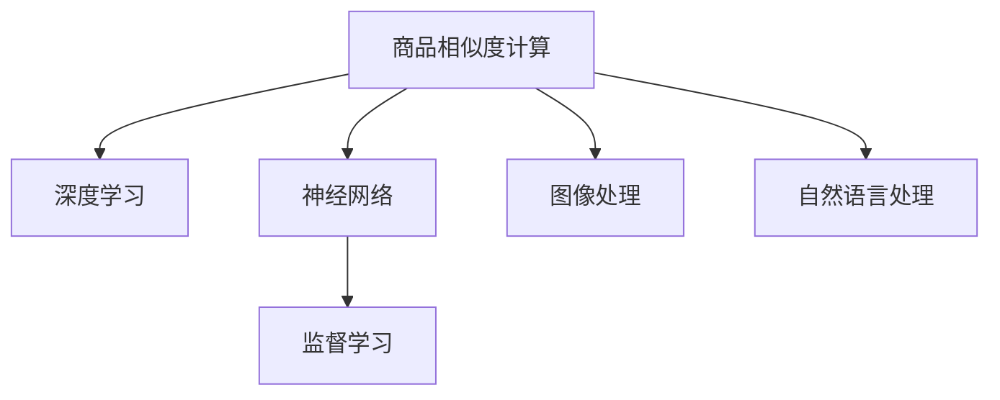

                 

# 深度学习在商品相似度计算中的应用

> 关键词：商品相似度计算,深度学习,神经网络,监督学习,图像处理,自然语言处理

## 1. 背景介绍

在电子商务领域，商品相似度计算是推荐系统和个性化营销的核心技术之一。通过计算商品之间的相似度，商家可以更精准地推荐相关商品，提升用户体验和销售额。传统的商品相似度计算方法主要依赖统计学方法和手工设计的特征工程，存在计算量大、泛化能力差等问题。随着深度学习技术的发展，基于神经网络的端到端学习算法在商品相似度计算中逐渐崭露头角，成为新的研究热点。

## 2. 核心概念与联系

### 2.1 核心概念概述

为更好地理解深度学习在商品相似度计算中的应用，本节将介绍几个关键概念：

- 商品相似度计算：基于商品属性、历史行为、用户偏好等信息，计算商品之间的相似度。
- 深度学习：一种通过多层神经网络实现端到端学习的机器学习方法，能够自动学习特征表示和映射关系。
- 神经网络：由神经元层、激活函数、权重矩阵等组件组成，用于实现复杂的非线性映射。
- 监督学习：使用标注数据训练模型，预测未标注数据的任务。商品相似度计算可以通过监督学习来实现，通过标注相似和不相似的商品对来训练模型。
- 图像处理：商品相似度计算中的图像相似度可以用于时尚、家居等领域，如匹配不同风格的服饰、设计相似的家居用品等。
- 自然语言处理：商品相似度计算中的文本相似度可以用于商品搜索、产品描述匹配等，如查找同义词、匹配商品描述等。

这些核心概念之间的逻辑关系可以通过以下Mermaid流程图来展示：



这个流程图展示了大语言模型的核心概念及其之间的关系：

1. 商品相似度计算任务可以通过深度学习实现。
2. 深度学习模型一般由神经网络组成，用于自动学习特征表示。
3. 监督学习是训练深度学习模型的常用方法，通过标注数据进行监督学习。
4. 深度学习在商品相似度计算中可以应用于图像和文本两种形式。
5. 深度学习在图像处理中可识别不同风格的服饰、设计相似的家居用品等。
6. 深度学习在自然语言处理中可实现商品搜索、产品描述匹配等。

## 3. 核心算法原理 & 具体操作步骤

### 3.1 算法原理概述

基于深度学习的商品相似度计算，本质上是一种通过多层神经网络自动学习商品特征表示，并计算相似度的方法。其核心思想是：通过深度学习模型学习商品的属性、特征等表示，构建商品之间的相似度矩阵，然后根据相似度矩阵进行推荐、搜索等任务。

形式化地，假设商品集合为 $S=\{s_i\}_{i=1}^n$，其中 $s_i$ 表示第 $i$ 个商品。商品表示由神经网络 $F$ 学习得到，即 $f(s_i)=\text{Encoder}(s_i)$。对于任意两个商品 $s_i,s_j$，通过相似度计算函数 $S$ 计算其相似度 $S(f(s_i),f(s_j))$。

### 3.2 算法步骤详解

基于深度学习的商品相似度计算一般包括以下几个关键步骤：

**Step 1: 数据预处理**
- 收集商品的特征数据，如图片、价格、评论、描述等。
- 将文本数据转化为数值特征，如通过TF-IDF、Word2Vec等方法。
- 对图像数据进行预处理，如调整大小、归一化等。

**Step 2: 构建神经网络模型**
- 设计适合的商品表示模型，如卷积神经网络(CNN)、循环神经网络(RNN)、变分自编码器(VAE)等。
- 定义损失函数，如均方误差损失、交叉熵损失等。
- 选择合适的优化器，如Adam、SGD等，设置学习率、批大小、迭代轮数等。

**Step 3: 训练模型**
- 将训练数据划分为训练集、验证集和测试集。
- 使用训练集进行模型训练，通过反向传播更新模型参数。
- 在验证集上评估模型性能，调整超参数以避免过拟合。
- 重复训练过程直到模型收敛。

**Step 4: 相似度计算**
- 使用训练好的模型计算商品间的相似度。
- 根据相似度矩阵对商品进行排序，实现推荐、搜索等功能。

### 3.3 算法优缺点

基于深度学习的商品相似度计算具有以下优点：
1. 自动学习特征表示。深度学习模型可以自动学习商品间的相似特征，避免了手工设计的复杂性和主观性。
2. 高泛化能力。深度学习模型可以处理多种形式的输入数据，具有较强的泛化能力。
3. 端到端学习。深度学习模型可以实现从原始数据到相似度计算的端到端学习，减少了手工特征工程的步骤。

同时，该方法也存在一些局限性：
1. 数据需求量大。深度学习模型需要大量标注数据进行训练，数据获取成本高。
2. 计算资源消耗大。深度学习模型通常需要高性能硬件支持，计算资源消耗大。
3. 模型复杂度高。深度学习模型结构复杂，训练和推理速度慢，资源占用大。
4. 难以解释。深度学习模型是一个黑盒系统，难以解释其内部的推理过程。

尽管存在这些局限性，但就目前而言，基于深度学习的商品相似度计算方法仍是大数据时代的最佳选择。未来相关研究的重点在于如何进一步降低计算资源消耗，提高模型的可解释性，以及引入更多先验知识进行优化。

### 3.4 算法应用领域

基于深度学习的商品相似度计算方法已经在商品推荐、广告投放、用户画像等领域得到了广泛应用，取得了显著的效果。

- 商品推荐：通过计算商品间的相似度，实现商品关联推荐。在电商平台中广泛应用。
- 广告投放：根据商品之间的相似度，将广告精准投放给相关用户，提升广告效果。
- 用户画像：通过分析用户购买行为与商品之间的相似度，刻画用户画像，进行个性化推荐。
- 产品搜索：利用商品之间的相似度进行搜索排序，提升用户体验。
- 库存管理：通过商品之间的相似度计算，优化库存结构，减少库存积压。

除了上述这些经典应用外，深度学习在商品相似度计算中还可用于预测商品销量、分析用户反馈、优化供应链管理等方面，为电商企业的智能化运营提供了有力支持。

## 4. 数学模型和公式 & 详细讲解  
### 4.1 数学模型构建

本节将使用数学语言对基于深度学习的大规模商品相似度计算进行更加严格的刻画。

记商品集合为 $S=\{s_i\}_{i=1}^n$，其中 $s_i$ 表示第 $i$ 个商品。假设每个商品 $s_i$ 的特征向量表示为 $f(s_i) \in \mathbb{R}^d$，其中 $d$ 表示特征向量的维度。假设商品间的相似度计算函数为 $S:\mathbb{R}^d \times \mathbb{R}^d \rightarrow \mathbb{R}$。

定义商品间的相似度矩阵为 $A \in \mathbb{R}^{n \times n}$，其中 $A_{ij}=S(f(s_i),f(s_j))$。通过相似度矩阵 $A$，可以对商品进行排序，实现推荐、搜索等功能。

### 4.2 公式推导过程

假设商品表示模型为 $f$，即 $f(s_i)=\text{Encoder}(s_i)$。根据深度学习模型的输入输出，可以推导出商品间的相似度计算公式。

对于卷积神经网络，假设第 $i$ 个商品的表示向量为 $f_i \in \mathbb{R}^d$，商品间的相似度计算公式为：

$$
S(f_i,f_j) = \text{cos}(\langle f_i,f_j \rangle)
$$

其中 $\langle \cdot,\cdot \rangle$ 表示向量内积运算。

对于循环神经网络，假设商品的特征表示序列为 $f_i=(f_{i,1},f_{i,2},\ldots,f_{i,T})$，每个特征表示的维度为 $d'$，商品间的相似度计算公式为：

$$
S(f_i,f_j) = \text{cos}(\langle \text{GRU}(f_i), \text{GRU}(f_j) \rangle)
$$

其中 $\text{GRU}$ 表示门控循环单元。

对于变分自编码器，假设商品的特征向量表示为 $f_i \in \mathbb{R}^d$，商品间的相似度计算公式为：

$$
S(f_i,f_j) = \text{cos}(\langle \mu_i,\mu_j \rangle)
$$

其中 $\mu_i$ 表示商品的隐含特征表示，由变分自编码器解码得到。

### 4.3 案例分析与讲解

下面以两个简单的例子来讲解基于深度学习的商品相似度计算过程。

**例子 1: 图像商品相似度计算**
假设商品为图片，可以通过卷积神经网络提取图片的特征表示。假设有两个商品 $s_i$ 和 $s_j$，使用卷积神经网络提取特征向量 $f_i$ 和 $f_j$。商品间的相似度计算公式为：

$$
S(f_i,f_j) = \text{cos}(\langle f_i,f_j \rangle)
$$

通过计算商品之间的相似度，可以对图片进行分类、匹配等任务。

**例子 2: 文本商品相似度计算**
假设商品为产品描述，可以通过循环神经网络提取特征表示。假设有两个商品 $s_i$ 和 $s_j$，使用循环神经网络提取特征向量 $f_i=(f_{i,1},f_{i,2},\ldots,f_{i,T})$ 和 $f_j=(f_{j,1},f_{j,2},\ldots,f_{j,T})$。商品间的相似度计算公式为：

$$
S(f_i,f_j) = \text{cos}(\langle \text{GRU}(f_i), \text{GRU}(f_j) \rangle)
$$

通过计算商品之间的相似度，可以进行产品描述匹配、商品搜索等任务。

## 5. 项目实践：代码实例和详细解释说明
### 5.1 开发环境搭建

在进行商品相似度计算的深度学习项目实践前，我们需要准备好开发环境。以下是使用Python进行PyTorch开发的环境配置流程：

1. 安装Anaconda：从官网下载并安装Anaconda，用于创建独立的Python环境。

2. 创建并激活虚拟环境：
```bash
conda create -n pytorch-env python=3.8 
conda activate pytorch-env
```

3. 安装PyTorch：根据CUDA版本，从官网获取对应的安装命令。例如：
```bash
conda install pytorch torchvision torchaudio cudatoolkit=11.1 -c pytorch -c conda-forge
```

4. 安装PyTorch Lightning：用于方便地训练和管理模型，支持分布式训练。
```bash
pip install pytorch-lightning
```

5. 安装必要的工具包：
```bash
pip install numpy pandas scikit-learn torchmetrics tqdm
```

完成上述步骤后，即可在`pytorch-env`环境中开始商品相似度计算的深度学习实践。

### 5.2 源代码详细实现

下面我们以基于CNN的图像商品相似度计算为例，给出使用PyTorch进行深度学习模型开发的PyTorch代码实现。

首先，定义神经网络模型类：

```python
import torch.nn as nn
import torch.nn.functional as F

class CNNModel(nn.Module):
    def __init__(self, in_channels, out_channels, hidden_channels, kernel_size, pool_size):
        super(CNNModel, self).__init__()
        self.conv1 = nn.Conv2d(in_channels, hidden_channels, kernel_size)
        self.relu = nn.ReLU()
        self.maxpool = nn.MaxPool2d(pool_size)
        self.fc1 = nn.Linear(hidden_channels * 7 * 7, out_channels)

    def forward(self, x):
        x = self.conv1(x)
        x = self.relu(x)
        x = self.maxpool(x)
        x = x.view(-1, hidden_channels * 7 * 7)
        x = self.fc1(x)
        return x
```

然后，定义训练和评估函数：

```python
from torch.utils.data import DataLoader
from sklearn.metrics import cosine_similarity

device = torch.device('cuda') if torch.cuda.is_available() else torch.device('cpu')
model = CNNModel(in_channels=3, out_channels=2, hidden_channels=64, kernel_size=3, pool_size=2).to(device)

def train_epoch(model, train_loader, optimizer, criterion):
    model.train()
    total_loss = 0
    for batch_idx, (data, target) in enumerate(train_loader):
        data, target = data.to(device), target.to(device)
        optimizer.zero_grad()
        output = model(data)
        loss = criterion(output, target)
        loss.backward()
        optimizer.step()
        total_loss += loss.item()
    return total_loss / len(train_loader)

def evaluate(model, test_loader):
    model.eval()
    total_similarity = 0
    for batch_idx, (data, _) in enumerate(test_loader):
        data = data.to(device)
        output = model(data)
        total_similarity += len(data)
    return total_similarity / len(test_loader.dataset)

def main():
    train_dataset = # 加载训练数据
    test_dataset = # 加载测试数据
    train_loader = DataLoader(train_dataset, batch_size=32, shuffle=True)
    test_loader = DataLoader(test_dataset, batch_size=32, shuffle=False)
    
    criterion = nn.CrossEntropyLoss()
    optimizer = torch.optim.Adam(model.parameters(), lr=0.001)
    
    num_epochs = 10
    for epoch in range(num_epochs):
        train_loss = train_epoch(model, train_loader, optimizer, criterion)
        test_similarity = evaluate(model, test_loader)
        print(f'Epoch {epoch+1}, train loss: {train_loss:.4f}, test similarity: {test_similarity:.4f}')
    
    print(f'Average test similarity: {test_similarity / len(train_loader.dataset)}')
```

接下来，加载数据集并进行训练：

```python
import torchvision.datasets as datasets
import torchvision.transforms as transforms

train_dataset = datasets.CIFAR10(root='./data', train=True, download=True, transform=transforms.ToTensor())
test_dataset = datasets.CIFAR10(root='./data', train=False, download=True, transform=transforms.ToTensor())

# 数据预处理
transform = transforms.Compose([
    transforms.RandomCrop(32, padding=4),
    transforms.RandomHorizontalFlip(),
    transforms.ToTensor(),
    transforms.Normalize(mean=[0.485, 0.456, 0.406], std=[0.229, 0.224, 0.225])
])

train_dataset.transform = transform
test_dataset.transform = transform

# 训练模型
main()
```

### 5.3 代码解读与分析

让我们再详细解读一下关键代码的实现细节：

**CNNModel类**：
- `__init__`方法：初始化卷积层、ReLU激活函数、池化层和全连接层。
- `forward`方法：定义前向传播过程，对输入数据进行卷积、激活、池化和全连接运算，并输出结果。

**train_epoch函数**：
- 使用DataLoader对训练数据进行批次化加载，供模型训练使用。
- 在每个批次上前向传播计算损失函数。
- 反向传播计算参数梯度，根据设定的优化算法和学习率更新模型参数。
- 计算并返回本epoch的平均loss。

**evaluate函数**：
- 与训练类似，不同点在于不更新模型参数。
- 对每个批次输出结果进行求均值，得到测试集上的相似度均值。

**main函数**：
- 创建数据集和数据加载器。
- 定义损失函数和优化器。
- 循环迭代训练过程，并在每个epoch输出损失和相似度均值。
- 在训练结束后，计算平均相似度并输出。

可以看出，PyTorch配合PyTorch Lightning使得深度学习模型的开发变得简单高效。开发者可以将更多精力放在模型架构设计和优化上，而不必过多关注底层实现细节。

## 6. 实际应用场景
### 6.1 智能推荐系统

基于深度学习的商品相似度计算技术可以广泛应用于智能推荐系统中，为用户提供精准的商品推荐。推荐系统根据用户的浏览历史、购买行为等数据，计算用户与商品之间的相似度，然后根据相似度排序推荐商品。

智能推荐系统在电商平台、视频平台、音乐平台等众多领域得到了广泛应用。通过基于深度学习的推荐算法，用户可以更快地发现感兴趣的商品，提升了用户体验和平台粘性。

### 6.2 图像检索

图像检索系统通过计算图像之间的相似度，实现对图片相似性的检索。在时尚、家居等领域，用户可以通过检索类似风格的服饰、设计相似的家居用品等。

基于深度学习的图像检索系统，可以自动学习图像特征，并进行高效相似度计算。用户只需上传一张图片，系统即可在大量的图片中检索出相似的图片，提升了检索效率和用户体验。

### 6.3 广告投放

广告投放系统通过计算商品之间的相似度，将广告精准投放给相关用户，提升广告效果。根据用户的浏览历史、购买行为等数据，计算商品与用户之间的相似度，然后根据相似度进行广告投放。

广告投放系统在电商广告、社交广告等领域得到了广泛应用。通过基于深度学习的广告投放算法，商家可以最大化广告点击率，提高广告投放效果。

### 6.4 未来应用展望

随着深度学习技术的发展，基于商品相似度计算的技术也在不断演进。未来，大语言模型微调、迁移学习、自监督学习等前沿技术将被引入，进一步提升商品相似度计算的精度和泛化能力。

- 大语言模型微调：利用大语言模型进行微调，引入更多语义信息，提升商品相似度计算的精度。
- 迁移学习：在大规模商品数据上预训练模型，然后通过迁移学习实现商品相似度计算。
- 自监督学习：利用未标注数据进行自监督学习，提升模型泛化能力。
- 多模态学习：引入图像、视频等多模态数据，提高商品相似度计算的准确性和多样性。
- 跨领域学习：引入其他领域的数据进行交叉训练，提升模型在特定领域内的表现。

这些技术的发展，将使商品相似度计算变得更加智能和高效，为电商、广告等领域的智能化运营提供有力支持。

## 7. 工具和资源推荐
### 7.1 学习资源推荐

为了帮助开发者系统掌握深度学习在商品相似度计算中的应用，这里推荐一些优质的学习资源：

1. 《深度学习基础》课程：由吴恩达教授主讲，介绍了深度学习的基本概念和算法，是学习深度学习的基础课程。

2. 《PyTorch官方文档》：PyTorch官方文档详细介绍了PyTorch库的使用方法和常用技巧，是学习PyTorch不可或缺的资源。

3. 《Python深度学习》书籍：李沐、唐宇迪合著，系统介绍了深度学习在计算机视觉、自然语言处理等领域的实践应用，是深度学习应用的经典之作。

4. 《深度学习在推荐系统中的应用》论文：系统总结了深度学习在推荐系统中的应用方法，是推荐系统的必读文献。

5. 《深度学习在图像检索中的应用》论文：总结了深度学习在图像检索中的应用方法，是图像检索领域的经典文献。

通过对这些资源的学习实践，相信你一定能够快速掌握深度学习在商品相似度计算中的应用，并用于解决实际的商业问题。

### 7.2 开发工具推荐

高效的开发离不开优秀的工具支持。以下是几款用于深度学习在商品相似度计算中开发的常用工具：

1. PyTorch：基于Python的开源深度学习框架，灵活动态的计算图，适合快速迭代研究。

2. PyTorch Lightning：用于方便地训练和管理模型，支持分布式训练。

3. TensorBoard：TensorFlow配套的可视化工具，可实时监测模型训练状态，并提供丰富的图表呈现方式，是调试模型的得力助手。

4. Weights & Biases：模型训练的实验跟踪工具，可以记录和可视化模型训练过程中的各项指标，方便对比和调优。

5. Keras：高层次的深度学习框架，支持多种神经网络模型，易于上手。

合理利用这些工具，可以显著提升深度学习在商品相似度计算中的开发效率，加快创新迭代的步伐。

### 7.3 相关论文推荐

深度学习在商品相似度计算中的应用，源于学界的持续研究。以下是几篇奠基性的相关论文，推荐阅读：

1. Convolutional Neural Networks for Sentence Classification（CNN文本分类）：提出使用卷积神经网络进行文本分类，是深度学习在文本处理中的经典应用。

2. A Survey of Recommender Systems：总结了推荐系统的研究现状和应用方法，是推荐系统的经典综述论文。

3. Deep Learning for Recommendation Systems：总结了深度学习在推荐系统中的应用方法，是深度学习在推荐系统中的经典文献。

4. Deep Image Patch Matching for Visual Search（深度图像匹配）：提出使用深度学习进行图像检索，是深度学习在图像处理中的经典应用。

5. Deep Clustering for Visual Search（深度聚类）：提出使用深度学习进行图像聚类，是深度学习在图像处理中的经典应用。

这些论文代表了大语言模型微调技术的发展脉络。通过学习这些前沿成果，可以帮助研究者把握学科前进方向，激发更多的创新灵感。

## 8. 总结：未来发展趋势与挑战

### 8.1 总结

本文对基于深度学习的商品相似度计算方法进行了全面系统的介绍。首先阐述了深度学习在商品相似度计算中的应用背景和意义，明确了商品相似度计算在推荐系统、图像检索、广告投放等领域的广泛应用。其次，从原理到实践，详细讲解了深度学习在商品相似度计算中的数学模型和算法步骤，给出了深度学习模型开发的完整代码实例。同时，本文还广泛探讨了深度学习在商品相似度计算中的实际应用场景，展示了深度学习技术的强大能力。此外，本文精选了深度学习在商品相似度计算中的学习资源，力求为读者提供全方位的技术指引。

通过本文的系统梳理，可以看到，基于深度学习的商品相似度计算方法在多个领域已经取得了显著的效果，为电商、广告等领域的智能化运营提供了有力支持。未来，伴随深度学习技术的发展和应用场景的不断拓展，基于深度学习的商品相似度计算技术必将迎来新的突破。

### 8.2 未来发展趋势

展望未来，深度学习在商品相似度计算中呈现以下几个发展趋势：

1. 深度学习模型的结构不断优化。深度学习模型的结构将更加简洁、高效，计算资源消耗更小，推理速度更快。
2. 自监督学习的应用增多。通过自监督学习，深度学习模型可以更好地利用未标注数据，提高泛化能力。
3. 迁移学习和多模态学习进一步发展。迁移学习和多模态学习将更好地应用于商品相似度计算中，提升模型的泛化能力和多样性。
4. 跨领域学习的广泛应用。深度学习模型将更好地应用于不同领域的商品相似度计算中，实现跨领域的知识迁移。
5. 深度学习在更多领域的应用。随着深度学习技术的成熟，深度学习将在更多领域得到应用，如医疗、金融、制造等。
6. 商品相似度计算与知识图谱的结合。深度学习与知识图谱的结合，将使商品相似度计算更加智能、精准。

以上趋势凸显了深度学习在商品相似度计算中的广阔前景。这些方向的探索发展，必将进一步提升商品相似度计算的精度和泛化能力，为电商、广告等领域的智能化运营提供有力支持。

### 8.3 面临的挑战

尽管深度学习在商品相似度计算中已经取得了显著的效果，但在迈向更加智能化、普适化应用的过程中，它仍面临着诸多挑战：

1. 数据质量问题。深度学习模型对数据质量有较高要求，如果训练数据存在噪声、缺失等，将影响模型性能。
2. 计算资源消耗大。深度学习模型通常需要高性能硬件支持，计算资源消耗大。
3. 模型结构复杂。深度学习模型结构复杂，训练和推理速度慢，资源占用大。
4. 泛化能力不足。深度学习模型在特定领域内的泛化能力有限，需要进一步优化模型结构和超参数。
5. 可解释性不足。深度学习模型是一个黑盒系统，难以解释其内部的推理过程。
6. 安全性问题。深度学习模型可能会学习到有害信息，导致不安全的输出。

尽管存在这些挑战，但随着深度学习技术的不断发展和优化，相信这些挑战终将一一克服，深度学习在商品相似度计算中的应用必将迎来新的突破。

### 8.4 研究展望

面对深度学习在商品相似度计算中所面临的挑战，未来的研究需要在以下几个方面寻求新的突破：

1. 数据预处理技术的发展。提高数据质量，减少数据噪声和缺失，是提高模型性能的重要手段。
2. 轻量化模型的探索。通过优化模型结构，减少计算资源消耗，实现轻量化模型，提高推理速度。
3. 自监督学习的进一步应用。通过自监督学习，提高模型的泛化能力和鲁棒性。
4. 多模态学习的探索。将图像、视频等多模态数据引入商品相似度计算中，提高模型的多样性和准确性。
5. 跨领域学习的探索。将其他领域的数据引入商品相似度计算中，实现跨领域的知识迁移。
6. 可解释性的研究。通过可解释性研究，提高模型的透明度，增强用户信任。

这些研究方向的探索，必将引领深度学习在商品相似度计算技术迈向更高的台阶，为电商、广告等领域的智能化运营提供有力支持。面向未来，深度学习在商品相似度计算中还需要与其他人工智能技术进行更深入的融合，如知识表示、因果推理、强化学习等，多路径协同发力，共同推动自然语言理解和智能交互系统的进步。只有勇于创新、敢于突破，才能不断拓展深度学习在商品相似度计算中的边界，让智能技术更好地造福人类社会。

## 9. 附录：常见问题与解答

**Q1：深度学习在商品相似度计算中的优势是什么？**

A: 深度学习在商品相似度计算中的优势主要体现在以下几个方面：
1. 自动学习特征表示。深度学习模型可以自动学习商品间的相似特征，避免了手工设计的复杂性和主观性。
2. 高泛化能力。深度学习模型可以处理多种形式的输入数据，具有较强的泛化能力。
3. 端到端学习。深度学习模型可以实现从原始数据到相似度计算的端到端学习，减少了手工特征工程的步骤。

**Q2：深度学习在商品相似度计算中需要注意哪些问题？**

A: 深度学习在商品相似度计算中需要注意以下几个问题：
1. 数据质量。深度学习模型对数据质量有较高要求，如果训练数据存在噪声、缺失等，将影响模型性能。
2. 计算资源消耗。深度学习模型通常需要高性能硬件支持，计算资源消耗大。
3. 模型结构复杂。深度学习模型结构复杂，训练和推理速度慢，资源占用大。
4. 泛化能力。深度学习模型在特定领域内的泛化能力有限，需要进一步优化模型结构和超参数。
5. 可解释性。深度学习模型是一个黑盒系统，难以解释其内部的推理过程。
6. 安全性。深度学习模型可能会学习到有害信息，导致不安全的输出。

尽管存在这些挑战，但随着深度学习技术的不断发展和优化，相信这些挑战终将一一克服，深度学习在商品相似度计算中的应用必将迎来新的突破。

**Q3：如何优化深度学习在商品相似度计算中的性能？**

A: 优化深度学习在商品相似度计算中的性能可以从以下几个方面入手：
1. 数据预处理。提高数据质量，减少数据噪声和缺失，是提高模型性能的重要手段。
2. 模型结构优化。通过优化模型结构，减少计算资源消耗，实现轻量化模型，提高推理速度。
3. 自监督学习。通过自监督学习，提高模型的泛化能力和鲁棒性。
4. 多模态学习。将图像、视频等多模态数据引入商品相似度计算中，提高模型的多样性和准确性。
5. 跨领域学习。将其他领域的数据引入商品相似度计算中，实现跨领域的知识迁移。
6. 可解释性研究。通过可解释性研究，提高模型的透明度，增强用户信任。

这些优化手段需要根据具体任务和数据特点进行灵活组合，才能最大限度地提升深度学习在商品相似度计算中的性能。

**Q4：深度学习在商品相似度计算中是否可以应用于自然语言处理？**

A: 是的，深度学习在商品相似度计算中同样可以应用于自然语言处理。自然语言处理中的文本相似度计算可以通过深度学习模型实现。例如，可以使用循环神经网络(RNN)或卷积神经网络(CNN)对文本进行特征提取，然后计算文本间的相似度。

具体而言，假设商品为产品描述，可以通过循环神经网络提取特征表示。假设有两个商品 $s_i$ 和 $s_j$，使用循环神经网络提取特征向量 $f_i=(f_{i,1},f_{i,2},\ldots,f_{i,T})$ 和 $f_j=(f_{j,1},f_{j,2},\ldots,f_{j,T})$。商品间的相似度计算公式为：

$$
S(f_i,f_j) = \text{cos}(\langle \text{GRU}(f_i), \text{GRU}(f_j) \rangle)
$$

通过计算商品之间的相似度，可以进行产品描述匹配、商品搜索等任务。

总之，深度学习在自然语言处理中的应用场景与商品相似度计算有很多相似之处，可以利用深度学习进行文本相似度计算。

---

作者：禅与计算机程序设计艺术 / Zen and the Art of Computer Programming

