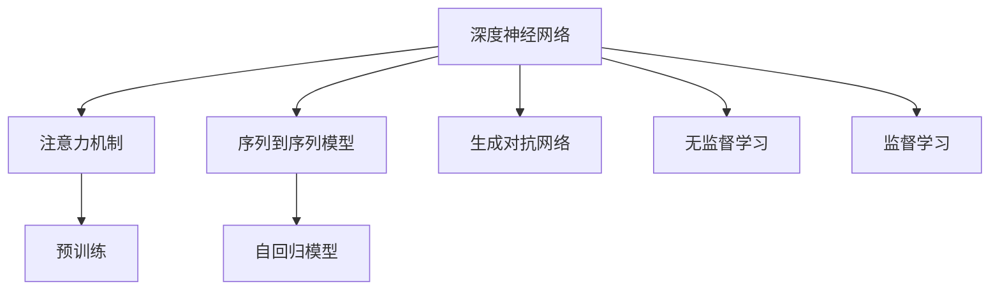

                 

# 深度学习在自然语言生成中的前沿技术

> 关键词：深度学习, 自然语言生成, 神经网络, 生成对抗网络, 序列到序列模型, 预训练, 注意力机制, 自回归模型, 潜在语义分析

## 1. 背景介绍

### 1.1 问题由来
自然语言生成(Natural Language Generation, NLG)是人工智能领域的重要研究课题，涉及将结构化数据转化为自然语言形式的能力。传统上，NLG方法依赖于规则和模板，但随着深度学习的发展，基于神经网络的生成模型逐渐成为主流。特别是自2018年以来，Transformer模型的诞生，大幅提升了语言生成的质量和效率，开启了深度学习在自然语言生成中的新纪元。

近年来，深度学习技术在自然语言生成领域取得了显著进展，从文本摘要、对话系统到机器翻译，诸多应用场景展示了其强大的潜力。然而，尽管这些模型取得了巨大成功，但仍有诸多挑战：

- 生成内容质量和多样性。深度学习模型往往过度依赖训练数据，缺乏足够的创造性。
- 生成效率和计算资源。大规模语言模型的训练和推理，对算力、内存等资源需求极高。
- 对抗性和鲁棒性。模型易受到对抗样本攻击，生成内容容易过拟合。
- 通用性和可解释性。模型的知识获取和推理过程缺乏透明性，难以解释生成的依据。

为了应对这些挑战，学者和工程师不断探索新的深度学习技术，以提升自然语言生成系统的性能和可解释性。本文将系统介绍近年来自然语言生成领域的前沿技术，包括基于深度学习的生成模型、序列到序列模型、生成对抗网络等，揭示其核心原理和实际应用。

## 2. 核心概念与联系

### 2.1 核心概念概述

深度学习在自然语言生成中的应用，主要依赖于以下几种关键概念：

- **深度神经网络**：通过多层的非线性变换，提取高层次的语义特征。
- **生成对抗网络(GANs)**：包含生成器和判别器两个子网络，通过对抗训练生成高质量的文本。
- **序列到序列模型(Seq2Seq)**：将输入序列映射到输出序列，广泛应用于机器翻译、对话系统等任务。
- **注意力机制**：在输入和输出序列之间建立动态连接，提高模型对重要信息的关注。
- **预训练**：在大规模语料上进行无监督预训练，提升模型泛化能力和知识获取能力。
- **自回归模型(AR)**：根据已有文本信息预测后续文本，适用于文本生成和编辑等任务。

这些概念之间具有紧密联系，共同构成了深度学习在自然语言生成中的技术体系：

- 深度神经网络是所有模型中不可或缺的基础，用于学习语义特征。
- 生成对抗网络通过对抗训练，提升生成文本的质量和多样性。
- 序列到序列模型通过编码器-解码器结构，将输入序列映射到输出序列。
- 注意力机制通过动态关注重要信息，提高模型的生成能力。
- 预训练利用大规模语料预训练模型，提升泛化能力和知识获取能力。
- 自回归模型根据已有信息预测后续文本，适用于序列生成和编辑。

这些技术在实际应用中往往需要灵活组合，以发挥最大的效果。

### 2.2 核心概念原理和架构的 Mermaid 流程图



这个流程图展示了深度学习在自然语言生成中的核心概念和相互关系：

1. 深度神经网络是所有模型的基础，通过多层非线性变换学习语义特征。
2. 注意力机制在输入和输出序列间建立动态连接，提升模型对重要信息的关注。
3. 序列到序列模型通过编码器-解码器结构，将输入序列映射到输出序列。
4. 生成对抗网络通过对抗训练提升生成文本的质量和多样性。
5. 自回归模型根据已有信息预测后续文本，适用于序列生成和编辑。
6. 预训练利用大规模语料预训练模型，提升泛化能力和知识获取能力。
7. 无监督和监督学习是模型训练的两个主要方向，分别在无标注和有标注数据上进行训练。

## 3. 核心算法原理 & 具体操作步骤
### 3.1 算法原理概述

基于深度学习的自然语言生成模型通常包含编码器、解码器和注意力机制三大部分。其中，编码器负责提取输入序列的语义特征，解码器负责将特征映射到目标输出序列，注意力机制用于动态关注输入和输出序列中的重要信息。

以编码器-解码器模型为例，其基本结构如下图所示：


其中，$e_i$ 为编码器中第$i$层的特征向量，$d_j$ 为解码器中第$j$层的特征向量。注意力机制通过计算注意力权重$\alpha_{ij}$，将编码器输出与解码器状态进行动态连接。生成对抗网络通过生成器和判别器的对抗训练，生成高质量的文本。自回归模型则根据已有文本信息预测后续文本。

### 3.2 算法步骤详解

自然语言生成的算法步骤通常包括：

1. 数据预处理：对输入和输出序列进行分词、去噪、标准化等处理，转换成模型接受的格式。
2. 模型搭建：选择合适的深度学习模型，如Transformer、LSTM等，搭建编码器-解码器结构。
3. 训练与优化：使用反向传播算法优化模型参数，最小化损失函数。
4. 后处理与评估：对生成的文本进行后处理，如去重、排序等操作，评估生成文本的质量和多样性。

### 3.3 算法优缺点

深度学习在自然语言生成中的优点包括：

- 生成内容多样性高：通过多模态学习，模型能够生成多风格、多类型的文本。
- 生成效率高：深度学习模型在大规模语料上训练后，可以很快生成高质量文本。
- 可解释性强：通过解码过程和注意力机制，模型可以解释生成的依据。

缺点包括：

- 训练成本高：需要大量的标注数据和计算资源。
- 对抗性攻击脆弱：模型容易受到对抗样本攻击，生成内容易被干扰。
- 缺乏创造性：过度依赖训练数据，缺乏足够的创造性。

### 3.4 算法应用领域

基于深度学习的自然语言生成技术在诸多领域都有广泛应用，包括但不限于：

- 文本摘要：从长文本中提取关键信息，生成简洁摘要。
- 对话系统：生成符合上下文语境的对话内容。
- 机器翻译：将一种语言翻译成另一种语言。
- 文本生成：生成高质量的文章、故事等文本内容。
- 语音合成：将文本转换成语音。
- 情感生成：生成情感丰富的文本内容。

这些应用场景展示了深度学习在自然语言生成中的强大能力和广泛应用。

## 4. 数学模型和公式 & 详细讲解 & 举例说明

### 4.1 数学模型构建

以序列到序列模型为例，其输入序列为 $x=\{x_1, x_2, \ldots, x_n\}$，输出序列为 $y=\{y_1, y_2, \ldots, y_n\}$。假设模型由编码器和解码器组成，其中编码器将输入序列 $x$ 转换为特征向量 $h$，解码器将特征向量 $h$ 映射到输出序列 $y$。模型的整体目标是最小化损失函数 $\mathcal{L}$：

$$
\mathcal{L}=\mathbb{E}_{(x,y)}[\ell(h,y)]
$$

其中，$\ell$ 为交叉熵损失函数，用于衡量模型输出和真实标签的差异。

### 4.2 公式推导过程

假设编码器的输出为 $h=\{h_1, h_2, \ldots, h_n\}$，解码器的输出为 $y=\{y_1, y_2, \ldots, y_n\}$。则模型的损失函数可以进一步展开为：

$$
\mathcal{L}=\sum_{i=1}^n \ell(h_i,y_i)
$$

对于注意力机制，假设第$i$个位置对输入序列的注意力权重为 $\alpha_i$，则其输出 $y_i$ 为：

$$
y_i=\sum_{j=1}^n \alpha_{ij} h_j
$$

其中，注意力权重 $\alpha_{ij}$ 计算如下：

$$
\alpha_{ij}=\frac{e_{ij}}{\sum_{k=1}^n e_{ik}}
$$

### 4.3 案例分析与讲解

以机器翻译为例，假设输入序列为 "I love programming"，输出序列为 "Ich liebe Programmierung"。模型的编码器将输入序列转换为特征向量 $h=\{h_1, h_2, h_3\}$，解码器将特征向量 $h$ 映射到输出序列 $y=\{y_1, y_2, y_3\}$。

在训练过程中，模型首先计算注意力权重 $\alpha_{ij}$，并将编码器输出 $h_i$ 与解码器状态 $s_i$ 进行加权求和，得到解码器的隐藏状态 $s_i$。然后，将 $s_i$ 和上一步的输出 $y_{i-1}$ 拼接后输入到下一层解码器，生成当前位置的输出 $y_i$。最终，模型通过最小化交叉熵损失函数，优化模型参数，使得生成的输出与真实标签尽可能接近。

## 5. 项目实践：代码实例和详细解释说明

### 5.1 开发环境搭建

要搭建基于深度学习的自然语言生成模型，首先需要安装相应的深度学习框架和工具。这里以TensorFlow为例，介绍环境搭建流程：

1. 安装Anaconda：
   ```bash
   conda create -n tf-env python=3.7
   conda activate tf-env
   ```

2. 安装TensorFlow：
   ```bash
   pip install tensorflow==2.4
   ```

3. 安装相关工具包：
   ```bash
   pip install numpy pandas matplotlib tqdm jupyter notebook
   ```

完成上述步骤后，即可在虚拟环境中开始项目开发。

### 5.2 源代码详细实现

以下是一个简单的基于LSTM的文本生成模型的代码实现：

```python
import tensorflow as tf
from tensorflow.keras.layers import Input, LSTM, Dense, Dropout, Embedding
from tensorflow.keras.models import Model
from tensorflow.keras.optimizers import Adam

# 定义模型架构
input_seq = Input(shape=(max_seq_length,), dtype='int32')
embedding = Embedding(vocab_size, embedding_dim)(input_seq)
lstm = LSTM(128, return_sequences=True)(embedding)
dropout = Dropout(0.2)(lstm)
lstm = LSTM(128, return_sequences=True)(dropout)
dropout = Dropout(0.2)(lstm)
dense = Dense(vocab_size, activation='softmax')(dropout)

# 定义模型
model = Model(inputs=input_seq, outputs=dense)

# 定义损失函数和优化器
loss_function = tf.keras.losses.CategoricalCrossentropy()
optimizer = Adam(learning_rate=0.001)

# 编译模型
model.compile(optimizer=optimizer, loss=loss_function)

# 训练模型
model.fit(x_train, y_train, epochs=10, batch_size=32)

# 生成文本
seq_text = 'I am'
gen_text = model.predict_text('I am')
```

以上代码实现了一个简单的LSTM文本生成模型，包含嵌入层、LSTM层、Dropout层和密集层。模型通过反向传播算法优化参数，生成文本。

### 5.3 代码解读与分析

代码中，`input_seq`为输入序列，`vocab_size`为词汇表大小，`embedding_dim`为嵌入维度，`max_seq_length`为序列最大长度。`lstm`为LSTM层，通过`return_sequences=True`返回序列特征。`dropout`为Dropout层，随机丢弃一定比例的神经元。`dense`为全连接层，输出词汇的概率分布。

在训练过程中，使用`fit`方法进行训练，`epochs`为迭代轮数，`batch_size`为批处理大小。训练结束后，使用`predict_text`方法生成文本。

## 6. 实际应用场景

### 6.1 智能客服系统

智能客服系统通过自然语言生成技术，可以自动回答客户咨询，提升服务效率和用户体验。例如，电商平台可以使用基于深度学习的模型，生成针对不同产品的客户咨询回复，提高客服处理效率。

### 6.2 金融舆情监测

金融舆情监测系统通过自然语言生成技术，可以实时分析和报告市场动态，辅助投资决策。例如，银行可以使用模型分析新闻报道和社交媒体，生成金融舆情报告，预测市场趋势。

### 6.3 广告生成

广告生成系统通过自然语言生成技术，可以自动生成广告文案，提高广告效果。例如，电商平台可以使用模型生成产品描述和推广语，吸引更多客户。

### 6.4 未来应用展望

未来，深度学习在自然语言生成中的应用将更加广泛，包括但不限于以下几个方向：

- 多模态生成：将文本与其他模态数据（如图像、音频）结合，生成更丰富、更全面的信息。
- 交互式生成：生成系统可以实时接收用户输入，动态生成相应内容，提升交互体验。
- 生成式对话：生成系统可以自动生成符合上下文语境的对话内容，用于机器人客服和虚拟助手。
- 生成式数据增强：生成系统可以自动生成更多训练数据，提升模型的泛化能力和性能。

## 7. 工具和资源推荐

### 7.1 学习资源推荐

为了系统掌握深度学习在自然语言生成中的应用，可以参考以下学习资源：

1. 《深度学习》课程：由斯坦福大学开设的深度学习经典课程，详细讲解深度学习的基本概念和经典模型。
2. 《自然语言处理》课程：由Coursera推出的自然语言处理课程，涵盖NLP的基础知识和最新进展。
3. 《NLP with TensorFlow》书籍：TensorFlow官方文档，包含大量深度学习在NLP中的应用案例。
4. 《Attention is All You Need》论文：Transformer模型的经典论文，介绍了注意力机制的基本原理。
5. 《GPT-3》论文：GPT-3模型的经典论文，展示了生成对抗网络的强大能力。

通过这些资源的学习，可以帮助读者全面掌握深度学习在自然语言生成中的应用，掌握相关技术细节和实现方法。

### 7.2 开发工具推荐

深度学习在自然语言生成中的应用，通常需要以下开发工具：

1. TensorFlow：由Google主导开发的深度学习框架，适合生产部署和大规模工程应用。
2. PyTorch：由Facebook开发的深度学习框架，灵活性高，适合研究和实验。
3. Keras：高层次的深度学习框架，易于使用，适合快速原型开发。
4. HuggingFace Transformers库：提供了多种深度学习模型，支持Python和TensorFlow，方便模型构建和微调。
5. Weights & Biases：模型训练的实验跟踪工具，记录和可视化训练过程中的各项指标。
6. TensorBoard：TensorFlow配套的可视化工具，实时监测模型训练状态，提供丰富的图表呈现方式。

这些工具在深度学习项目中均有广泛应用，选择合适的工具可以提高开发效率，加速模型迭代。

### 7.3 相关论文推荐

以下是几篇深度学习在自然语言生成领域的重要论文，推荐阅读：

1. Attention is All You Need：Transformer模型的经典论文，介绍了注意力机制的基本原理。
2. BERT: Pre-training of Deep Bidirectional Transformers for Language Understanding：BERT模型的经典论文，展示了预训练语言模型的强大能力。
3. GPT-2: Language Models are Unsupervised Multitask Learners：GPT-2模型的经典论文，展示了生成对抗网络的强大能力。
4. T5: Exploring the Limits of Transfer Learning with a Unified Text-to-Text Transformer：T5模型的经典论文，展示了预训练语言模型在序列到序列任务中的效果。
5. Generating Natural Text with Transformer-based Generation Models：Transformer生成模型的经典论文，展示了深度学习在自然语言生成中的应用。

这些论文代表了大语言生成模型的最新进展，通过阅读这些论文，可以帮助读者深入理解深度学习在自然语言生成中的应用和技术细节。

## 8. 总结：未来发展趋势与挑战

### 8.1 研究成果总结

深度学习在自然语言生成领域取得了显著进展，主要体现在以下几个方面：

- 深度神经网络：通过多层非线性变换，学习语义特征。
- 生成对抗网络：通过对抗训练，提升生成文本的质量和多样性。
- 序列到序列模型：将输入序列映射到输出序列，广泛应用于机器翻译、对话系统等任务。
- 注意力机制：在输入和输出序列间建立动态连接，提高模型的生成能力。
- 预训练：利用大规模语料预训练模型，提升泛化能力和知识获取能力。
- 自回归模型：根据已有信息预测后续文本，适用于序列生成和编辑。

这些技术在实际应用中取得了显著成效，提升了自然语言生成系统的性能和应用范围。

### 8.2 未来发展趋势

未来，深度学习在自然语言生成领域将呈现以下几个发展趋势：

1. 多模态生成：将文本与其他模态数据结合，生成更丰富、更全面的信息。
2. 交互式生成：生成系统可以实时接收用户输入，动态生成相应内容，提升交互体验。
3. 生成式对话：生成系统可以自动生成符合上下文语境的对话内容，用于机器人客服和虚拟助手。
4. 生成式数据增强：生成系统可以自动生成更多训练数据，提升模型的泛化能力和性能。

这些趋势展示了深度学习在自然语言生成中的巨大潜力，预示着未来NLP技术将更加智能、灵活和实用。

### 8.3 面临的挑战

尽管深度学习在自然语言生成中取得了显著进展，但仍面临诸多挑战：

1. 训练成本高：需要大量的标注数据和计算资源。
2. 对抗性攻击脆弱：模型容易受到对抗样本攻击，生成内容易被干扰。
3. 缺乏创造性：过度依赖训练数据，缺乏足够的创造性。
4. 可解释性不足：模型的决策过程缺乏透明性，难以解释生成的依据。
5. 鲁棒性不足：模型面对输入噪声和对抗样本时，泛化能力较弱。
6. 计算资源消耗大：大规模语言模型的训练和推理，对算力、内存等资源需求极高。

这些挑战需要在未来的研究中得到解决，才能进一步推动自然语言生成技术的进步。

### 8.4 研究展望

未来，深度学习在自然语言生成领域的研究方向可能包括以下几个方面：

1. 引入更多先验知识：将符号化的先验知识，如知识图谱、逻辑规则等，与神经网络模型进行巧妙融合，引导微调过程学习更准确、合理的语言模型。
2. 结合因果分析和博弈论工具：将因果分析方法引入微调模型，识别出模型决策的关键特征，增强输出解释的因果性和逻辑性。借助博弈论工具刻画人机交互过程，主动探索并规避模型的脆弱点，提高系统稳定性。
3. 纳入伦理道德约束：在模型训练目标中引入伦理导向的评估指标，过滤和惩罚有偏见、有害的输出倾向。加强人工干预和审核，建立模型行为的监管机制，确保输出符合人类价值观和伦理道德。
4. 引入自监督学习：利用大规模无标注数据进行预训练，提高模型的泛化能力和知识获取能力。
5. 优化计算效率：开发更高效的模型结构和算法，减少计算资源消耗，提升推理速度和稳定性。

这些研究方向展示了深度学习在自然语言生成中的未来发展方向，预示着未来NLP技术将更加智能、安全、可靠和可控。

## 9. 附录：常见问题与解答

**Q1：如何优化深度学习模型的训练过程？**

A: 优化深度学习模型的训练过程，可以从以下几个方面入手：

1. 学习率调度：使用学习率衰减或自适应学习率算法，如AdamW、Adafactor等，控制学习率的动态变化。
2. 正则化：通过L2正则、Dropout等方法，防止模型过拟合。
3. 数据增强：通过数据增强技术，如回译、近义替换等，丰富训练集，提高模型泛化能力。
4. 批量大小和迭代轮数：调整批量大小和迭代轮数，平衡训练效率和精度。
5. 模型裁剪和量化：通过模型裁剪和量化技术，减小模型尺寸，提高推理速度和效率。

这些优化策略可以帮助提高深度学习模型的训练效果，提升生成文本的质量和多样性。

**Q2：如何提高深度学习模型的鲁棒性？**

A: 提高深度学习模型的鲁棒性，可以从以下几个方面入手：

1. 引入对抗训练：通过对抗样本训练，增强模型对噪声和对抗样本的鲁棒性。
2. 数据增强：通过数据增强技术，如回译、近义替换等，丰富训练集，提高模型泛化能力。
3. 正则化：通过L2正则、Dropout等方法，防止模型过拟合。
4. 自监督学习：利用大规模无标注数据进行预训练，提高模型的泛化能力和知识获取能力。
5. 模型裁剪和量化：通过模型裁剪和量化技术，减小模型尺寸，提高推理速度和效率。

这些策略可以帮助提高深度学习模型的鲁棒性，提升生成文本的质量和多样性。

**Q3：如何提高深度学习模型的可解释性？**

A: 提高深度学习模型的可解释性，可以从以下几个方面入手：

1. 注意力机制：通过注意力机制，解释模型对输入和输出序列的关注点，提高模型的可解释性。
2. 梯度可解释性：通过梯度可视化技术，解释模型参数对生成文本的贡献，提高模型的可解释性。
3. 语义分析：通过语义分析技术，解释模型对文本的语义理解，提高模型的可解释性。
4. 代码和注释：编写详细的代码注释，解释模型结构和参数的作用，提高模型的可解释性。

这些策略可以帮助提高深度学习模型的可解释性，使模型的决策过程更加透明和可信。

**Q4：如何提高深度学习模型的计算效率？**

A: 提高深度学习模型的计算效率，可以从以下几个方面入手：

1. 模型裁剪：去除不必要的层和参数，减小模型尺寸，提高推理速度。
2. 量化加速：将浮点模型转为定点模型，压缩存储空间，提高计算效率。
3. 模型并行：通过模型并行技术，将大模型拆分成多个小模型，并行计算，提高训练和推理速度。
4. 硬件加速：使用GPU、TPU等高性能设备，加速模型训练和推理过程。
5. 数据分布式处理：将数据分布式处理，提高数据处理效率。

这些策略可以帮助提高深度学习模型的计算效率，缩短模型训练和推理时间。

**Q5：深度学习模型在自然语言生成中面临哪些挑战？**

A: 深度学习模型在自然语言生成中面临以下几个主要挑战：

1. 训练成本高：需要大量的标注数据和计算资源。
2. 对抗性攻击脆弱：模型容易受到对抗样本攻击，生成内容易被干扰。
3. 缺乏创造性：过度依赖训练数据，缺乏足够的创造性。
4. 可解释性不足：模型的决策过程缺乏透明性，难以解释生成的依据。
5. 鲁棒性不足：模型面对输入噪声和对抗样本时，泛化能力较弱。
6. 计算资源消耗大：大规模语言模型的训练和推理，对算力、内存等资源需求极高。

这些挑战需要在未来的研究中得到解决，才能进一步推动自然语言生成技术的进步。

---

作者：禅与计算机程序设计艺术 / Zen and the Art of Computer Programming

