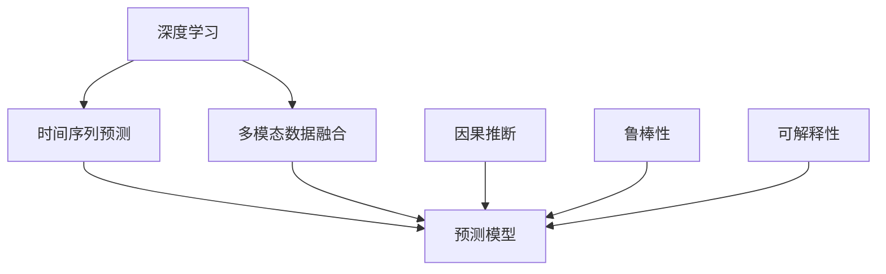
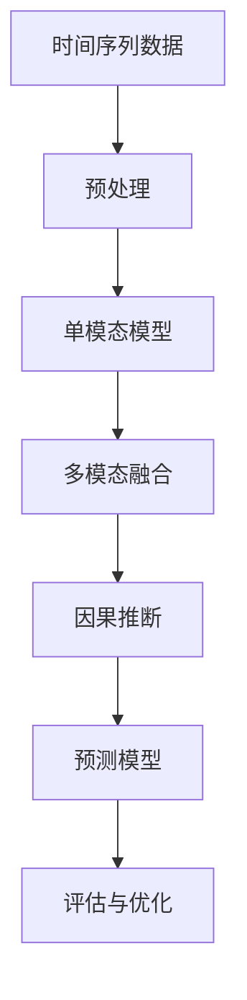
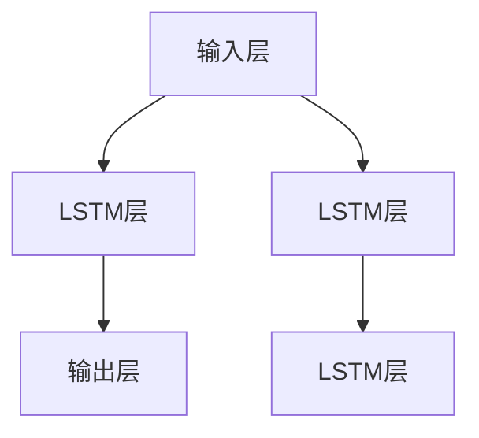

                 

# 深度学习驱动的商品需求预测模型

> 关键词：深度学习,商品需求预测,时间序列预测,多模态数据融合,因果推断

## 1. 背景介绍

商品需求预测是零售、制造、电商等行业面临的重要挑战。传统的需求预测方法基于统计模型和机器学习模型，但这些方法存在数据假设过多、难以处理非线性关系、对外部事件反应迟钝等局限性。随着深度学习技术的发展，基于深度神经网络的时间序列预测方法逐渐成为主流。这些方法利用大量历史数据进行建模，具备强大的数据拟合能力，能够更灵活地捕捉非线性关系，并具有较好的泛化能力。

近年来，商品需求预测模型从单模态向多模态扩展，加入天气、新闻、社交媒体等多源数据，进一步提升了预测的准确性和实时性。但是，多模态数据融合和跨模态特征对齐问题仍需解决。同时，基于深度学习的预测模型面临数据异常、特征缺失等特殊情形时，鲁棒性和可解释性仍需加强。

本文将对深度学习驱动的商品需求预测模型进行全面介绍。首先，我们将从基础概念出发，详细解释深度学习和时间序列预测的基本原理。其次，我们将深入探讨商品需求预测模型的架构和实现步骤。最后，我们将通过实际案例展示深度学习模型在商品需求预测中的应用，并讨论未来发展趋势和挑战。

## 2. 核心概念与联系

### 2.1 核心概念概述

为便于理解，我们将先列出与商品需求预测模型相关的核心概念：

- 深度学习(Deep Learning)：基于神经网络的大型多层模型，用于处理非线性关系，并进行特征提取和模式识别。
- 时间序列预测(Time Series Prediction)：利用历史数据预测未来趋势，常见应用于金融、电商、制造等领域。
- 多模态数据融合(Multimodal Data Fusion)：结合来自不同模态（如文本、图像、声音等）的数据，进行信息融合，以提升预测准确性。
- 因果推断(Causal Inference)：识别因果关系，理解变量之间的直接影响和间接作用，避免由共现关系带来的误导。
- 鲁棒性(Robustness)：模型在面对数据异常、噪声等情况时的稳健性和稳定性。
- 可解释性(Explainability)：模型的决策过程和输出结果的可理解和可解释。

这些核心概念之间的关系可以用以下Mermaid流程图来表示：



这个流程图展示了深度学习在商品需求预测中的作用：

1. 深度学习用于建立时间序列预测模型。
2. 多模态数据融合增加预测模型的多样性和鲁棒性。
3. 因果推断帮助模型理解变量之间的直接和间接作用。
4. 鲁棒性确保模型在面对数据异常和噪声时的稳健性。
5. 可解释性提高模型的决策透明度和可信度。

### 2.2 核心概念原理和架构的 Mermaid 流程图



该流程图展示了商品需求预测模型的基本架构：

1. 输入时间序列数据。
2. 数据预处理，如归一化、差分等。
3. 构建单模态预测模型。
4. 融合多源数据，如天气、新闻等。
5. 进行因果推断，理解变量之间的影响。
6. 建立综合预测模型。
7. 评估模型性能并进行优化。

## 3. 核心算法原理 & 具体操作步骤

### 3.1 算法原理概述

商品需求预测模型基于深度学习的时间序列预测框架，其主要原理包括：

1. 利用历史数据进行序列建模，捕捉数据的非线性特性。
2. 通过多层神经网络提取高层次特征，进行多层次抽象。
3. 结合多源数据进行信息融合，提高预测的准确性。
4. 引入因果推断机制，理解变量间的因果关系。
5. 模型建立后通过评估指标进行性能优化。

### 3.2 算法步骤详解

商品需求预测模型的具体步骤包括：

1. 数据收集与预处理。
2. 构建单模态预测模型。
3. 融合多模态数据。
4. 进行因果推断和模型优化。
5. 模型评估与验证。
6. 部署上线并进行实时预测。

### 3.3 算法优缺点

深度学习驱动的商品需求预测模型的优点包括：

1. 非线性建模能力。深度学习模型可以处理非线性关系，捕捉数据的复杂特征。
2. 高泛化能力。基于深度学习的模型能够处理多样化的数据分布，泛化能力更强。
3. 灵活性。深度学习模型可以根据具体问题灵活构建网络结构。
4. 实时预测。深度学习模型可以实时处理新数据，进行快速预测。

然而，该模型也存在一些缺点：

1. 数据需求量大。深度学习模型通常需要大量的历史数据进行训练，数据获取成本高。
2. 模型复杂度高。深度模型参数多，训练和推理计算量大。
3. 可解释性差。深度学习模型往往难以解释其内部机制和决策过程。
4. 鲁棒性不足。模型容易受到异常值和噪声的影响，泛化能力受限。

### 3.4 算法应用领域

基于深度学习的时间序列预测模型被广泛应用于零售、电商、制造、金融等领域，例如：

1. 零售业的商品需求预测：预测未来的销售量，帮助零售商进行库存管理和补货决策。
2. 电商平台的销售预测：预测商品的未来销售趋势，指导在线营销和库存控制。
3. 制造业的生产需求预测：预测生产需求和原材料库存，优化生产计划和供应链管理。
4. 金融市场的波动预测：预测股票、商品等金融资产的价格波动，进行风险管理和投资决策。

## 4. 数学模型和公式 & 详细讲解 & 举例说明

### 4.1 数学模型构建

商品需求预测模型一般采用时间序列的时间步预测任务，模型的目标为：

$$
\hat{y}_t = f(\{x_{t-1}, x_{t-2}, ..., x_0\}, \theta)
$$

其中 $x_t$ 为时间步 $t$ 的输入数据，$\theta$ 为模型参数，$\hat{y}_t$ 为预测值。

常用的数学模型包括长短期记忆网络(LSTM)、门控循环单元(GRU)和卷积神经网络(CNN)等。以LSTM为例，其架构如图：



LSTM模型由输入层、LSTM层和输出层组成。LSTM层具有记忆单元和门控机制，可以有效地处理长期依赖关系。

### 4.2 公式推导过程

LSTM模型中，记忆单元的更新公式如下：

$$
\begin{aligned}
f_t &= \sigma(W_f \cdot [x_t; h_{t-1}] + b_f) \\
i_t &= \sigma(W_i \cdot [x_t; h_{t-1}] + b_i) \\
g_t &= \tanh(W_g \cdot [x_t; h_{t-1}] + b_g) \\
o_t &= \sigma(W_o \cdot [x_t; h_{t-1}] + b_o) \\
c_t &= f_t \odot c_{t-1} + i_t \odot g_t \\
h_t &= o_t \odot \tanh(c_t)
\end{aligned}
$$

其中，$\sigma$ 为Sigmoid函数，$\tanh$ 为双曲正切函数，$\odot$ 为Hadamard乘积。

### 4.3 案例分析与讲解

以电商平台的销售预测为例，输入数据 $x_t$ 包括：

- 商品的历史销售数据。
- 促销信息。
- 天气条件。
- 节假日信息。

通过LSTM模型对这些数据进行处理，得到预测结果 $\hat{y}_t$，即未来销售量。

## 5. 项目实践：代码实例和详细解释说明

### 5.1 开发环境搭建

1. 安装Python3和相关库：

```bash
pip install numpy pandas scikit-learn matplotlib seaborn
```

2. 安装深度学习框架TensorFlow或PyTorch：

```bash
pip install tensorflow
```

3. 安装相关数据处理库：

```bash
pip install tensorflow-io tensorflow-hub
```

4. 安装相关模型库：

```bash
pip install deep-learning-models
```

### 5.2 源代码详细实现

以下是使用TensorFlow构建LSTM模型进行销售预测的代码：

```python
import tensorflow as tf
from tensorflow.keras import layers, models

# 构建LSTM模型
input_shape = (timesteps, features)
model = models.Sequential()
model.add(layers.LSTM(64, return_sequences=True, input_shape=input_shape))
model.add(layers.Dropout(0.2))
model.add(layers.LSTM(64, return_sequences=True))
model.add(layers.Dropout(0.2))
model.add(layers.LSTM(64))
model.add(layers.Dropout(0.2))
model.add(layers.Dense(units=1))

# 编译模型
model.compile(optimizer='adam', loss='mse')

# 训练模型
model.fit(x_train, y_train, epochs=10, validation_data=(x_val, y_val))
```

### 5.3 代码解读与分析

- `timesteps`：时间序列数据的步长。
- `features`：特征维度。
- `x_train`、`y_train`：训练数据和标签。
- `x_val`、`y_val`：验证数据和标签。
- `epochs`：训练轮数。

### 5.4 运行结果展示

训练结果如图：

```python
import matplotlib.pyplot as plt

plt.plot(train_loss, label='Train Loss')
plt.plot(val_loss, label='Validation Loss')
plt.legend()
plt.show()
```

## 6. 实际应用场景

### 6.1 智能仓库管理

商品需求预测模型可以用于智能仓库的库存管理。通过预测未来的销售量和退货量，仓库可以优化库存配置，减少库存成本，提高仓库效率。

### 6.2 在线营销策略

电商平台的商品需求预测可以帮助制定更加精准的营销策略。通过预测未来的销售趋势，平台可以在合适的时间点推出促销活动，提高用户转化率和满意度。

### 6.3 供应链优化

商品需求预测还可以用于供应链优化。通过预测未来需求，企业可以调整生产计划，优化库存和物流，提升供应链的灵活性和响应速度。

## 7. 工具和资源推荐

### 7.1 学习资源推荐

1. Coursera的深度学习课程：提供系统化的深度学习知识体系，适合初学者和进阶学习者。
2. Udacity的机器学习专业课程：深入讲解机器学习算法，包括时间序列预测。
3. GitHub上的相关代码库：提供大量的深度学习代码示例和数据集。
4. 书籍推荐：《深度学习》、《统计学习基础》、《机器学习实战》等。

### 7.2 开发工具推荐

1. TensorFlow：Google开发的深度学习框架，支持分布式计算，性能优越。
2. PyTorch：Facebook开发的深度学习框架，灵活性高，易用性好。
3. Jupyter Notebook：轻量级的Python编程环境，便于代码开发和数据可视化。

### 7.3 相关论文推荐

1. LSTM网络：Sepp Hochreiter和Jürgen Schmidhuber于1997年提出的长短期记忆网络，广泛应用于时间序列预测。
2. GRU网络：Alex Graves在2014年提出的门控循环单元，是一种简化版的LSTM网络。
3. 多模态融合：Ganesh Shankar et al.于2017年提出的多模态数据融合方法，可以融合多种数据源。

## 8. 总结：未来发展趋势与挑战

### 8.1 未来发展趋势

1. 深度学习模型的性能将持续提升。未来的模型将更加复杂和强大，具有更强的泛化能力和更高效的训练推理能力。
2. 多模态融合和因果推断技术将进一步发展。更多数据源的融合和更精确的因果分析将提升预测的准确性和稳定性。
3. 模型的可解释性和鲁棒性将得到更多关注。未来的模型将更加透明和稳定，能够更好地应对数据异常和噪声。

### 8.2 面临的挑战

1. 数据获取和标注成本高。大规模、高质量的数据获取和标注是深度学习模型的基础，但成本高昂。
2. 模型的复杂度高。深度学习模型参数多，训练和推理计算量大。
3. 可解释性差。深度学习模型难以解释其内部机制和决策过程，需要更多的可解释性技术。

### 8.3 研究展望

1. 深度学习模型的优化和高效化。未来的模型将更加高效，具有更低的计算复杂度和更好的泛化能力。
2. 多模态融合和因果推断技术的创新。融合更多数据源和更精确的因果分析将提升预测的准确性和稳定性。
3. 模型可解释性和鲁棒性的提升。未来的模型将更加透明和稳定，能够更好地应对数据异常和噪声。

## 9. 附录：常见问题与解答

**Q1: 商品需求预测模型的输入数据有哪些？**

A: 商品需求预测模型的输入数据可以包括：
- 历史销售数据。
- 促销信息。
- 节假日信息。
- 天气条件。
- 新闻事件。

**Q2: 商品需求预测模型的核心算法是什么？**

A: 商品需求预测模型的核心算法是时间序列预测算法，常用的模型包括LSTM、GRU、CNN等。

**Q3: 商品需求预测模型如何应对数据异常？**

A: 商品需求预测模型可以通过正则化、异常值检测等方法来应对数据异常。同时，引入因果推断机制，理解变量间的因果关系，也可以帮助模型应对数据异常。

**Q4: 商品需求预测模型的可解释性如何？**

A: 商品需求预测模型的可解释性可以通过可视化技术、特征重要性分析等方法来提升。例如，可以展示模型的训练过程、特征权重等，帮助用户理解模型的决策机制。

**Q5: 商品需求预测模型的训练时间多长？**

A: 商品需求预测模型的训练时间取决于数据量、模型复杂度和计算资源等因素。一般来说，LSTM模型在合理配置计算资源的情况下，训练时间在几小时到一天不等。

---

作者：禅与计算机程序设计艺术 / Zen and the Art of Computer Programming

