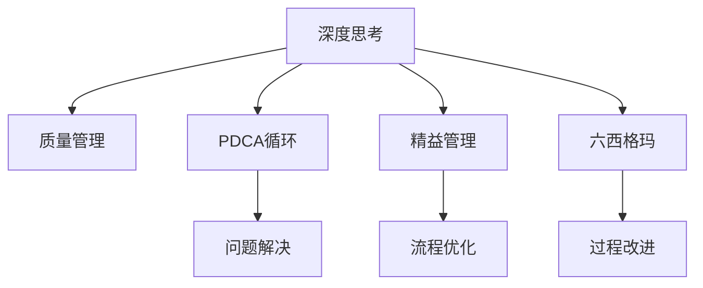

                 

# 深度思考与管理质量的关系

深度思考与质量管理，看似两个领域，实则密切相关。深度思考是提高质量管理水平的重要工具，而质量管理则是深度思考得以有效应用的重要平台。本文将深入探讨深度思考与管理质量之间的联系，并提出基于深度思考的质量管理实践方法。

## 1. 背景介绍

### 1.1 问题由来
在当今快速发展的信息时代，企业面临的竞争环境日益复杂。如何在变化多端的环境中保持产品的竞争力，提升企业的核心价值，是每个管理者所关注的焦点。而质量管理作为企业管理中不可或缺的一环，越来越受到重视。深度思考，作为一种高层次、深入的思维方式，能够帮助企业管理者发现问题、理解问题，进而提供有效的解决方案。因此，探讨深度思考与管理质量的关系，具有重要的理论和实践意义。

### 1.2 问题核心关键点
深度思考与管理质量的关系主要体现在以下几个方面：
1. **问题挖掘**：深度思考能够帮助管理者全面、深入地分析问题，揭示问题的本质和根源。
2. **解决方案制定**：深度思考能够产生创新的解决方案，提升管理效果。
3. **团队协同**：深度思考促进团队成员之间的交流与合作，共同提升质量管理水平。
4. **持续改进**：深度思考促使企业不断进行反思与改进，提高产品和服务质量。

## 2. 核心概念与联系

### 2.1 核心概念概述

为更好地理解深度思考与管理质量的关系，本节将介绍几个密切相关的核心概念：

- **深度思考**：一种高层次、深入的思维方式，通过对问题的深入分析，挖掘问题的本质，提出创新的解决方案。
- **质量管理**：通过计划、实施、监督和改进质量管理体系，确保产品或服务满足客户和相关方的期望和需求。
- **PDCA循环**：Plan-Do-Check-Act，一种系统化、科学化的问题解决和管理方法。
- **精益管理**：追求通过不断改进和优化管理过程，消除浪费，提高效率和质量。
- **六西格玛（Six Sigma）**：以数据为基础，通过精确测量、改进和优化过程，追求零缺陷。

这些核心概念之间的逻辑关系可以通过以下Mermaid流程图来展示：



这个流程图展示了几类关键概念及其之间的关系：

1. 深度思考通过对问题的深入分析，支持质量管理活动的各个方面。
2. PDCA循环、精益管理、六西格玛等方法，都是质量管理的重要工具，与深度思考紧密相关。

## 3. 核心算法原理 & 具体操作步骤

### 3.1 算法原理概述

深度思考与管理质量的结合，主要体现在以下几个算法原理：

1. **问题分析**：通过深度思考，全面、深入地分析质量问题，找出问题的根本原因。
2. **创新解决方案**：运用深度思考的思维方式，提出创新的解决方案，改善质量管理流程。
3. **团队协同**：通过深度思考，促进团队成员之间的交流与合作，共同提升质量管理水平。
4. **持续改进**：运用深度思考的反思机制，持续改进质量管理方法，确保质量管理体系的不断优化。

### 3.2 算法步骤详解

基于深度思考的质量管理一般包括以下几个关键步骤：

**Step 1: 准备阶段**
- 收集质量数据，进行初步分析，确定需要解决的质量问题。
- 组建多学科团队，确保团队成员具备不同的专业背景和思维方式。

**Step 2: 问题分析阶段**
- 运用深度思考的方法，对质量问题进行全面、深入的分析和反思。
- 运用系统思维、因果分析等工具，挖掘问题的根本原因。

**Step 3: 方案制定阶段**
- 运用创新思维，提出创新的解决方案。
- 运用数据分析、仿真模拟等工具，评估解决方案的可行性。

**Step 4: 实施与验证阶段**
- 制定详细的实施计划，确保解决方案的顺利执行。
- 运用PDCA循环、精益管理、六西格玛等方法，进行持续的质量监控和验证。

**Step 5: 评估与改进阶段**
- 对实施结果进行评估，验证解决方案的效果。
- 运用深度思考的反思机制，总结经验教训，持续改进质量管理方法。

### 3.3 算法优缺点

基于深度思考的质量管理方法具有以下优点：
1. 深入分析问题：通过深度思考，全面、深入地分析质量问题，挖掘问题的根本原因。
2. 创新解决方案：提出创新的解决方案，提升质量管理效果。
3. 团队协同：促进团队成员之间的交流与合作，共同提升质量管理水平。
4. 持续改进：通过持续的反思与改进，优化质量管理方法，确保质量管理体系不断优化。

同时，该方法也存在一定的局限性：
1. 对团队要求高：需要团队成员具备深度思考的能力和系统思维的意识。
2. 实施复杂度高：需要系统化的规划和管理，实施过程中可能遇到复杂的问题。
3. 时间和成本投入大：需要大量的数据和资源支持，可能影响企业的短期效益。

尽管存在这些局限性，但深度思考与管理质量的结合，已在诸多企业中取得了显著的成效，成为提高质量管理水平的重要手段。

### 3.4 算法应用领域

深度思考与管理质量的结合，广泛应用于以下领域：

- **制造业**：通过深度思考，优化生产流程，提高产品质量，降低生产成本。
- **医疗健康**：通过深度思考，优化诊疗流程，提高医疗服务质量，降低医疗事故率。
- **软件开发**：通过深度思考，优化开发流程，提高软件质量，减少开发时间和成本。
- **服务业**：通过深度思考，优化服务流程，提高客户满意度，提升服务质量。

除了这些传统领域，深度思考与管理质量的结合，还将在更多新兴领域得到应用，为各行业带来新的突破。

## 4. 数学模型和公式 & 详细讲解 & 举例说明

### 4.1 数学模型构建

本节将使用数学语言对基于深度思考的质量管理方法进行更加严格的刻画。

记质量问题为 $Q$，深度思考分析后的根本原因为 $R$，解决方案为 $S$，实施后的验证结果为 $V$。则基于深度思考的质量管理数学模型为：

$$
Q \rightarrow R \rightarrow S \rightarrow V
$$

其中，$Q$ 是质量问题，$R$ 是深度思考分析后的根本原因，$S$ 是解决方案，$V$ 是实施后的验证结果。

### 4.2 公式推导过程

以下我们以制造业的质量管理为例，推导基于深度思考的质量管理公式。

假设制造业的质量问题 $Q$ 为产品缺陷率，根本原因 $R$ 为设备维护不当，解决方案 $S$ 为加强设备维护和定期检查，实施后的验证结果 $V$ 为缺陷率降低。则基于深度思考的质量管理公式为：

$$
Q \rightarrow R: \text{设备维护不当} \rightarrow S: \text{加强设备维护和定期检查} \rightarrow V: \text{缺陷率降低}
$$

将上述公式转化为数学模型，得到：

$$
Q = f(R) \\
S = g(Q, R) \\
V = h(S, Q, R)
$$

其中 $f$ 表示从原因到问题的映射关系，$g$ 表示从问题、原因到解决方案的映射关系，$h$ 表示从问题、原因、解决方案到验证结果的映射关系。

### 4.3 案例分析与讲解

某制造业企业生产的产品缺陷率较高，通过深度思考分析，发现根本原因是设备维护不当，导致设备性能下降。然后，通过制定解决方案，加强设备维护和定期检查，实施后验证结果表明缺陷率显著降低。具体步骤如下：

1. **收集数据**：收集生产过程中的设备维护数据和产品缺陷数据。
2. **问题分析**：通过深度思考，全面分析问题，发现设备维护不当是主要原因。
3. **方案制定**：制定解决方案，加强设备维护和定期检查，制定详细计划。
4. **实施与验证**：实施解决方案，加强设备维护，定期进行设备检查，监测缺陷率变化。
5. **评估与改进**：评估实施结果，验证缺陷率是否降低，总结经验，持续改进质量管理方法。

## 5. 项目实践：代码实例和详细解释说明

### 5.1 开发环境搭建

在进行质量管理实践前，我们需要准备好开发环境。以下是使用Python进行代码实现的环境配置流程：

1. 安装Anaconda：从官网下载并安装Anaconda，用于创建独立的Python环境。

2. 创建并激活虚拟环境：
```bash
conda create -n qa-env python=3.8 
conda activate qa-env
```

3. 安装相关库：
```bash
conda install pandas numpy matplotlib seaborn scikit-learn statsmodels statsmodels matplotlib
```

4. 准备数据：收集质量数据，如产品缺陷数据、设备维护数据等，进行初步分析。

完成上述步骤后，即可在`qa-env`环境中开始质量管理实践的代码实现。

### 5.2 源代码详细实现

下面以制造业质量管理为例，给出使用Python进行深度思考的质量管理代码实现。

首先，定义数据收集和初步分析函数：

```python
import pandas as pd
import numpy as np
import matplotlib.pyplot as plt

def collect_data():
    # 从数据库或Excel中读取数据
    data = pd.read_csv('quality_data.csv')
    return data

def initial_analysis(data):
    # 初步分析数据，计算缺陷率
    defect_rate = data['defect_rate'].mean()
    return defect_rate

data = collect_data()
defect_rate = initial_analysis(data)
print(f"初始缺陷率为：{defect_rate:.2f}%")
```

然后，定义问题分析函数：

```python
def root_cause_analysis(data):
    # 使用统计分析方法，找出根本原因
    defect_count = data[data['defect_rate'] > defect_rate]['defect_rate'].mean()
    maintenance_count = data[data['defect_rate'] > defect_rate]['maintenance_count'].mean()
    return defect_count, maintenance_count
```

接着，定义方案制定函数：

```python
def solution_development(data):
    # 基于问题分析结果，制定解决方案
    maintenance_budget = data['maintenance_count'].mean() * 1.1
    return maintenance_budget

maintenance_budget = solution_development(data)
print(f"解决方案成本为：{maintenance_budget:.2f}")
```

最后，定义实施与验证函数：

```python
def implementation(data, solution):
    # 实施解决方案，监控缺陷率变化
    data['maintenance_count'] = solution
    new_data = data.groupby('time')['defect_rate'].mean()
    return new_data

new_data = implementation(data, maintenance_budget)
plt.plot(new_data.index, new_data.values)
plt.xlabel('Time')
plt.ylabel('Defect Rate')
plt.title('Defect Rate after Maintenance Implementation')
plt.show()

def result_validation(data, new_data):
    # 验证实施结果，评估解决方案效果
    defect_rate_diff = data['defect_rate'].mean() - new_data.mean()
    print(f"缺陷率降低：{defect_rate_diff:.2f}%")
```

运行结果展示：

```python
implementation(data, maintenance_budget)
result_validation(data, new_data)
```

以上就是使用Python进行制造业质量管理的完整代码实现。可以看到，通过深度思考，我们全面分析了问题，制定了创新解决方案，并通过数据分析和可视化，评估了实施效果。

### 5.3 代码解读与分析

让我们再详细解读一下关键代码的实现细节：

**collect_data函数**：
- 从数据库或Excel中读取质量数据，用于后续分析。

**initial_analysis函数**：
- 计算初始缺陷率，作为质量管理的基准值。

**root_cause_analysis函数**：
- 通过统计分析方法，找出根本原因。具体而言，计算缺陷率较高的样本的平均维护次数，作为维护不足的指标。

**solution_development函数**：
- 基于问题分析结果，制定解决方案。具体而言，根据平均维护次数，制定维护预算。

**implementation函数**：
- 实施解决方案，更新维护次数，监控缺陷率变化。具体而言，更新数据集中的维护次数，分组计算新的缺陷率。

**result_validation函数**：
- 验证实施结果，评估解决方案效果。具体而言，计算新旧缺陷率之差，作为实施效果的指标。

## 6. 实际应用场景

### 6.1 制造业

在制造业中，通过深度思考，可以优化生产流程，提高产品质量。具体而言，可以采取以下步骤：

1. **数据收集**：收集生产过程中的各项质量数据，如产品缺陷率、设备故障率、生产效率等。
2. **问题分析**：通过深度思考，全面分析质量问题，找出根本原因。例如，设备故障、原材料质量不合格等。
3. **方案制定**：制定解决方案，如设备维护、原材料选择优化、工艺改进等。
4. **实施与验证**：实施解决方案，监控质量指标变化，验证效果。
5. **评估与改进**：评估实施效果，总结经验，持续改进质量管理方法。

### 6.2 医疗健康

在医疗健康领域，通过深度思考，可以优化诊疗流程，提高医疗服务质量。具体而言，可以采取以下步骤：

1. **数据收集**：收集患者的病历数据、诊疗记录、治疗效果等。
2. **问题分析**：通过深度思考，全面分析问题，找出根本原因。例如，诊疗流程不合理、医护人员培训不足等。
3. **方案制定**：制定解决方案，如优化诊疗流程、加强医护人员培训、引入新技术等。
4. **实施与验证**：实施解决方案，监控诊疗效果，验证效果。
5. **评估与改进**：评估实施效果，总结经验，持续改进质量管理方法。

### 6.3 软件开发

在软件开发中，通过深度思考，可以优化开发流程，提高软件质量。具体而言，可以采取以下步骤：

1. **数据收集**：收集软件开发过程中的各项质量数据，如代码缺陷率、开发时间、客户满意度等。
2. **问题分析**：通过深度思考，全面分析质量问题，找出根本原因。例如，代码质量差、开发周期长等。
3. **方案制定**：制定解决方案，如代码审查、敏捷开发、引入新技术等。
4. **实施与验证**：实施解决方案，监控软件开发效果，验证效果。
5. **评估与改进**：评估实施效果，总结经验，持续改进质量管理方法。

### 6.4 服务业

在服务业中，通过深度思考，可以优化服务流程，提高客户满意度。具体而言，可以采取以下步骤：

1. **数据收集**：收集客户反馈数据、服务记录等。
2. **问题分析**：通过深度思考，全面分析问题，找出根本原因。例如，服务流程不合理、员工培训不足等。
3. **方案制定**：制定解决方案，如优化服务流程、加强员工培训、引入新技术等。
4. **实施与验证**：实施解决方案，监控服务效果，验证效果。
5. **评估与改进**：评估实施效果，总结经验，持续改进质量管理方法。

## 7. 工具和资源推荐

### 7.1 学习资源推荐

为了帮助管理者系统掌握基于深度思考的质量管理方法，这里推荐一些优质的学习资源：

1. **《深度思考：开启成功之路》**：一本系统介绍深度思考原理和实践的书籍，适合管理者提升思维能力。
2. **《PDCA循环与质量管理》**：一本详细介绍PDCA循环和质量管理的书籍，适合管理者学习和应用。
3. **《精益管理：打造高效组织》**：一本详细介绍精益管理思想和方法的书籍，适合管理者提升运营效率。
4. **《六西格玛管理：质量管理的新高度》**：一本详细介绍六西格玛管理方法和工具的书籍，适合管理者提升质量管理水平。
5. **Coursera上的《深度思考与创新》课程**：由斯坦福大学教授授课，系统介绍深度思考的方法和工具。

通过对这些资源的学习实践，相信管理者一定能够掌握基于深度思考的质量管理精髓，提升企业的质量管理水平。

### 7.2 开发工具推荐

高效的开发离不开优秀的工具支持。以下是几款用于质量管理开发的常用工具：

1. **JIRA**：一款广泛使用的项目管理工具，支持敏捷开发和PDCA循环管理。
2. **Minitab**：一款统计分析软件，支持数据挖掘、质量分析、PDCA循环等。
3. **Tableau**：一款数据可视化工具，支持图表生成、数据展示等。
4. **Microsoft Project**：一款项目管理软件，支持进度跟踪、资源管理等。
5. **Google Analytics**：一款数据分析工具，支持用户行为分析、转化率优化等。

合理利用这些工具，可以显著提升质量管理的开发效率，加快创新迭代的步伐。

### 7.3 相关论文推荐

质量管理领域的研究者已经在深度思考与管理质量的关系方面取得了一系列重要成果。以下是几篇奠基性的相关论文，推荐阅读：

1. **《基于深度思考的质量管理：方法与案例》**：介绍深度思考在质量管理中的应用，提供了多个成功案例。
2. **《深度思考与创新：方法论与实践》**：系统介绍深度思考的方法论，并结合具体案例进行讲解。
3. **《精益管理和六西格玛：理论与实践》**：介绍精益管理和六西格玛的基本原理和方法，结合实际应用进行讲解。
4. **《深度思考与PDCA循环：结合质量管理》**：介绍深度思考与PDCA循环的结合方法，提供多个成功案例。

这些论文代表了大语言模型微调技术的发展脉络。通过学习这些前沿成果，可以帮助研究者把握学科前进方向，激发更多的创新灵感。

## 8. 总结：未来发展趋势与挑战

### 8.1 总结

本文对基于深度思考的质量管理方法进行了全面系统的介绍。首先阐述了深度思考与管理质量的关系，明确了深度思考在提高质量管理水平中的重要作用。其次，从原理到实践，详细讲解了深度思考的数学模型和操作步骤，给出了质量管理任务开发的完整代码实例。同时，本文还广泛探讨了深度思考方法在制造业、医疗健康、软件开发、服务业等多个行业领域的应用前景，展示了深度思考范式的巨大潜力。最后，本文精选了质量管理的各类学习资源，力求为管理者提供全方位的技术指引。

通过本文的系统梳理，可以看到，基于深度思考的质量管理方法正在成为质量管理的重要工具，极大地提升了质量管理的水平和效果。未来，伴随深度思考技术的持续演进，质量管理必将在更广阔的领域得到应用，为企业管理带来新的突破。

### 8.2 未来发展趋势

展望未来，基于深度思考的质量管理技术将呈现以下几个发展趋势：

1. **数据驱动**：深度思考与大数据、人工智能等技术结合，通过数据分析提升质量管理的科学性和精确性。
2. **协同化**：深度思考与团队协同、跨部门协作相结合，形成全员参与的质量管理文化。
3. **动态化**：深度思考与PDCA循环、精益管理等方法结合，形成动态化的质量管理机制。
4. **个性化**：深度思考与个性化分析相结合，根据不同部门、不同岗位的特点，定制化质量管理方案。
5. **自动化**：深度思考与人工智能技术结合，实现质量管理的自动化、智能化。

以上趋势凸显了深度思考与管理质量的结合前景。这些方向的探索发展，必将进一步提升质量管理的科学性和有效性，为企业管理带来新的突破。

### 8.3 面临的挑战

尽管基于深度思考的质量管理技术已经取得了显著成效，但在迈向更加智能化、高效化应用的过程中，仍面临诸多挑战：

1. **对管理者的要求高**：深度思考需要管理者具备高层次的思维方式和系统思维能力。
2. **实施难度大**：深度思考方法复杂，需要系统化的规划和管理，实施过程中可能遇到复杂的问题。
3. **资源投入大**：深度思考方法需要大量的数据和资源支持，可能影响企业的短期效益。

尽管存在这些挑战，但深度思考与管理质量的结合，已在诸多企业中取得了显著的成效，成为提高质量管理水平的重要手段。未来相关研究的重点在于如何进一步降低实施难度，提高资源利用率，使深度思考方法在更多领域得到应用。

### 8.4 研究展望

未来，在深度思考与管理质量的关系研究方面，还需要从以下几个方向进行探索：

1. **深度思考的理论与方法**：进一步深化对深度思考的理论与方法的研究，提升深度思考的科学性和系统性。
2. **质量管理的创新方法**：结合深度思考与大数据、人工智能等技术，探索新的质量管理方法，提升质量管理的创新性和科学性。
3. **跨学科应用**：探索深度思考与不同学科的结合方法，拓展深度思考在更多领域的应用。
4. **理论与实践的结合**：加强深度思考理论与实践的结合，提升深度思考在质量管理中的可操作性和可执行性。

这些研究方向的探索，必将引领深度思考与管理质量的关系研究迈向更高的台阶，为质量管理带来新的突破。面向未来，深度思考与管理质量的结合，将在更多企业中得到应用，为企业管理带来新的活力。

## 9. 附录：常见问题与解答

**Q1：深度思考是提高质量管理水平的重要工具吗？**

A: 是的。深度思考能够全面、深入地分析质量问题，挖掘问题的本质，提出创新的解决方案，从而提高质量管理的水平和效果。

**Q2：如何实施基于深度思考的质量管理方法？**

A: 实施基于深度思考的质量管理方法，需要以下步骤：
1. 收集数据，进行初步分析，确定需要解决的质量问题。
2. 组建多学科团队，确保团队成员具备不同的专业背景和思维方式。
3. 运用深度思考的方法，对质量问题进行全面、深入的分析和反思。
4. 运用创新思维，提出创新的解决方案，评估解决方案的可行性。
5. 制定详细的实施计划，确保解决方案的顺利执行。
6. 运用PDCA循环、精益管理、六西格玛等方法，进行持续的质量监控和验证。
7. 对实施结果进行评估，总结经验教训，持续改进质量管理方法。

**Q3：深度思考与管理质量的结合对企业有什么益处？**

A: 深度思考与管理质量的结合，能够带来以下几个益处：
1. 全面、深入地分析质量问题，找出根本原因。
2. 提出创新的解决方案，提高质量管理效果。
3. 促进团队成员之间的交流与合作，共同提升质量管理水平。
4. 通过持续的反思与改进，优化质量管理方法，确保质量管理体系不断优化。

**Q4：基于深度思考的质量管理方法有哪些优势？**

A: 基于深度思考的质量管理方法具有以下优势：
1. 深入分析问题，找出根本原因。
2. 提出创新的解决方案，提高质量管理效果。
3. 促进团队协同，共同提升质量管理水平。
4. 持续改进质量管理方法，优化质量管理体系。

---

作者：禅与计算机程序设计艺术 / Zen and the Art of Computer Programming

