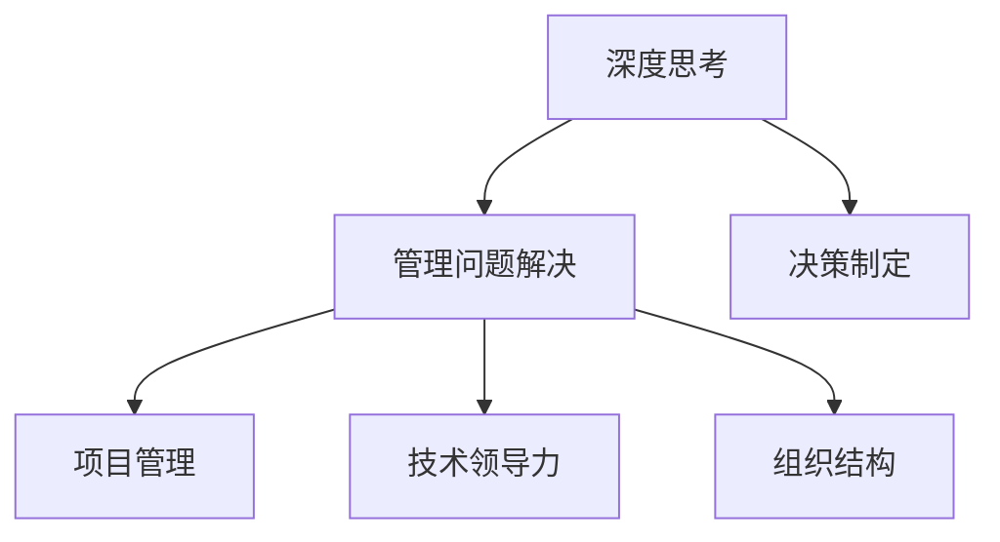

                 

# 深度思考与管理问题解决能力的提升

> 关键词：深度思考, 管理问题解决, 决策制定, 项目管理, 技术领导力, 组织结构

## 1. 背景介绍

### 1.1 问题由来

在当今快速变化的商业环境中，企业面临着日益复杂的挑战。这些挑战包括但不限于产品创新、市场扩展、技术转型和人力资源管理等。面对这些挑战，企业领导者需要具备良好的问题解决能力，才能在复杂多变的市场环境中做出明智的决策。然而，许多管理者往往难以在压力下保持清晰的思考，导致决策质量受到影响。因此，提升管理者的深度思考能力成为提升企业竞争力的重要途径。

### 1.2 问题核心关键点

深度思考与问题解决能力是企业领导者的核心竞争力之一。它不仅关系到决策的准确性和有效性，还能提升团队协作效率和组织创新能力。然而，深度思考能力并非天生，而是可以通过系统性的训练和实践得以提升。

以下问题为核心关键点：

- 深度思考与问题解决能力的内涵是什么？
- 如何在管理过程中有效提升深度思考能力？
- 如何应用深度思考与问题解决技术解决实际问题？

### 1.3 问题研究意义

提升管理者的深度思考与问题解决能力，不仅有助于提升企业的决策质量，还能增强团队协同、推动组织创新。这种能力的提升，对于企业在激烈的市场竞争中保持领先地位具有重要意义。

## 2. 核心概念与联系

### 2.1 核心概念概述

为了更好地理解深度思考与管理问题解决能力，本节将介绍几个密切相关的核心概念：

- **深度思考(Deep Thinking)**：指在问题解决过程中，通过深入分析、推理和思考，全面考虑各种可能性的过程。深度思考有助于识别问题本质、制定有效策略并评估潜在风险。
- **管理问题解决(Management Problem Solving)**：指在管理过程中，通过系统性分析、评估和决策制定，解决组织面临的各类问题。有效的管理问题解决能力，是管理者的一项核心技能。
- **决策制定(Decision Making)**：指在考虑各种选项和可能结果的基础上，选择最优方案的过程。决策制定是管理问题解决的重要组成部分。
- **项目管理(Project Management)**：指为实现特定目标，通过计划、组织、领导和控制，协调资源的过程。项目管理需要深度思考和有效问题解决能力，以确保项目按时、按质完成。
- **技术领导力(Technology Leadership)**：指通过技术知识和技术技能，引领和管理技术驱动的组织变革。技术领导力需要深厚的技术理解和良好的问题解决能力。
- **组织结构(Organizational Structure)**：指组织内部各部门和职位的配置及其相互关系。合理的组织结构有助于提升团队的深度思考与问题解决能力。

这些核心概念之间的逻辑关系可以通过以下Mermaid流程图来展示：



这个流程图展示了大语言模型的核心概念及其之间的关系：

1. 深度思考是管理问题解决的基础。
2. 决策制定和项目管理是管理问题解决的重要环节。
3. 技术领导力和组织结构是支持深度思考与问题解决的关键要素。

## 3. 核心算法原理 & 具体操作步骤

### 3.1 算法原理概述

基于深度思考与管理问题解决能力的提升，本质上是一个系统性分析和评估的过程。其核心思想是：通过全面、深入的分析，识别问题本质，制定有效策略，并评估潜在风险。这一过程可以分解为以下几个关键步骤：

1. **问题定义**：明确问题范围、目标和约束条件。
2. **数据收集与分析**：收集相关数据，运用统计学、数据挖掘等方法进行分析和推理。
3. **假设验证与模型构建**：根据分析结果，提出假设并进行验证，构建数学模型。
4. **方案评估与决策**：评估不同方案的优劣，选择最优决策方案。
5. **实施与监控**：执行决策方案，并持续监控其效果和风险。

### 3.2 算法步骤详解

基于深度思考与管理问题解决能力的提升，一般包括以下几个关键步骤：

**Step 1: 问题定义**
- 明确问题的核心要素：目标、限制条件、关键成功因素等。
- 定义问题的具体目标：需要解决的具体问题是什么，期望达到什么样的结果。

**Step 2: 数据收集与分析**
- 收集与问题相关的数据，包括历史数据、市场数据、客户反馈等。
- 使用数据挖掘技术，如回归分析、聚类分析、关联规则挖掘等，进行数据探索和特征分析。
- 识别关键数据点，提取有价值的信息和趋势。

**Step 3: 假设验证与模型构建**
- 基于收集到的数据，提出可能的假设，解释问题的成因。
- 构建数学模型，描述问题本质和变量之间的关系。
- 使用统计学方法，验证假设的有效性和模型的准确性。

**Step 4: 方案评估与决策**
- 提出多个解决方案，进行优劣对比。
- 利用数学模型，评估不同方案的可行性、风险和成本。
- 选择最优方案，制定详细实施计划。

**Step 5: 实施与监控**
- 执行选定的方案，并持续监控其效果和潜在风险。
- 根据监控结果，调整方案或提出改进措施。
- 记录实施过程中的关键决策和行动，为后续问题解决提供经验教训。

### 3.3 算法优缺点

基于深度思考与管理问题解决能力的提升方法具有以下优点：
1. **系统性**：通过系统性分析和评估，确保决策的全面性和准确性。
2. **灵活性**：根据问题的不同特点，选择最适合的分析和评估方法。
3. **可操作性**：提出的方案经过详细验证和评估，具备较高的可操作性。
4. **风险控制**：通过假设验证和模型构建，提前识别和控制潜在风险。

同时，该方法也存在一定的局限性：
1. **数据依赖**：深度思考和问题解决需要大量高质量的数据，数据不足可能导致决策失误。
2. **复杂性**：分析方法和模型构建涉及较多技术和统计学知识，需要专业技能。
3. **时间成本**：系统性分析和评估往往需要较长的时间，短期内难以见效。
4. **不确定性**：问题复杂度较高时，可能无法得到精确的解决方案。

尽管存在这些局限性，但就目前而言，基于系统性分析和评估的深度思考与管理问题解决方法是提升企业决策质量和创新能力的重要手段。未来相关研究的重点在于如何进一步降低方法对数据和时间的依赖，提高方法的可操作性和鲁棒性。

### 3.4 算法应用领域

基于深度思考与管理问题解决能力的提升方法，在企业运营管理中得到广泛应用，包括但不限于以下几个领域：

- **战略规划**：通过系统性分析和评估，制定长期发展战略，提升企业竞争力。
- **风险管理**：通过识别和管理潜在风险，保护企业免受不可预见事件的损害。
- **创新管理**：通过深入分析市场需求和竞争态势，制定创新策略，推动产品和服务创新。
- **人力资源管理**：通过评估员工能力和发展潜力，制定合理的人力资源策略，提升团队绩效。
- **市场营销**：通过市场分析和客户需求研究，制定有效的市场策略，提升品牌影响力和市场份额。
- **供应链管理**：通过供应链数据分析和优化，提升供应链效率和灵活性，降低成本。

除了上述这些经典领域外，深度思考与管理问题解决能力提升方法也在更多场景中得到应用，如新产品开发、组织结构调整、技术路线选择等，为企业持续创新和健康发展提供重要支持。

## 4. 数学模型和公式 & 详细讲解

### 4.1 数学模型构建

本节将使用数学语言对深度思考与管理问题解决能力提升的方法进行更加严格的刻画。

记问题为 $P$，定义其目标函数 $f$ 和约束条件 $g$，则问题可以表示为：

$$
\begin{aligned}
& \text{minimize} \quad f(x) \\
& \text{subject to} \quad g(x) \leq 0 \\
& \quad x \in X
\end{aligned}
$$

其中 $x$ 为决策变量，$X$ 为决策空间，$f(x)$ 为目标函数，$g(x)$ 为约束条件。

### 4.2 公式推导过程

以下我们以决策制定为例，推导线性规划模型的推导过程。

假设问题 $P$ 可以表示为线性规划问题：

$$
\begin{aligned}
& \text{minimize} \quad c^T x \\
& \text{subject to} \quad A x = b \\
& \quad x \geq 0
\end{aligned}
$$

其中 $c$ 为目标向量，$A$ 为约束矩阵，$b$ 为约束向量，$x$ 为决策变量。

利用单纯形法(Simplex Method)求解上述线性规划问题，其基本步骤如下：

1. 构建初始单纯形表，初始化变量 $x$ 和 $y$。
2. 计算单纯形表中的基底变量和超基变量。
3. 计算超基变量的对偶变量 $y$，并确定极值点。
4. 检查是否达到最优解，如果达到，则停止计算；否则，更新基底和超基变量，返回第2步。

线性规划模型的求解过程较为复杂，但通过系统性分析和假设验证，可以有效提升深度思考与问题解决能力，为实际问题解决提供坚实的数学基础。

### 4.3 案例分析与讲解

以某公司的供应链优化为例，分析基于深度思考与管理问题解决能力提升方法的应用。

**问题定义**：该公司在全球多个国家和地区设有生产基地和销售网络，如何优化供应链布局，以降低成本并提高效率？

**数据收集与分析**：收集历史订单数据、运输成本数据、市场需求数据等，进行数据探索和特征分析。

**假设验证与模型构建**：假设市场需求受季节性因素影响，建立基于季节性需求的供应链优化模型。

**方案评估与决策**：设计多个供应链布局方案，使用数学模型评估不同方案的成本和效率。

**实施与监控**：根据选定的方案，调整供应链布局，并持续监控其效果和潜在风险。

通过系统性分析和评估，该公司成功地优化了供应链布局，实现了成本降低和效率提升。

## 5. 项目实践：代码实例和详细解释说明

### 5.1 开发环境搭建

在进行项目实践前，我们需要准备好开发环境。以下是使用Python进行Scikit-learn和Pandas开发的Python环境配置流程：

1. 安装Anaconda：从官网下载并安装Anaconda，用于创建独立的Python环境。

2. 创建并激活虚拟环境：
```bash
conda create -n pyenv python=3.8 
conda activate pyenv
```

3. 安装Scikit-learn和Pandas：
```bash
conda install scikit-learn pandas
```

4. 安装各类工具包：
```bash
pip install numpy matplotlib jupyter notebook ipython
```

完成上述步骤后，即可在`pyenv`环境中开始项目实践。

### 5.2 源代码详细实现

下面我以线性规划问题为例，给出使用Scikit-learn库进行模型优化的PyTorch代码实现。

```python
from sklearn.linear_model import LinearRegression
from sklearn.preprocessing import MinMaxScaler
import numpy as np
import pandas as pd

# 数据准备
data = pd.read_csv('data.csv')
X = data[['x1', 'x2', 'x3']]
y = data['y']

# 数据预处理
scaler = MinMaxScaler(feature_range=(0, 1))
X_scaled = scaler.fit_transform(X)
y_scaled = scaler.fit_transform(y.reshape(-1, 1))

# 构建线性回归模型
model = LinearRegression()
model.fit(X_scaled, y_scaled)

# 预测新数据
new_data = np.array([[0.5, 0.8, 0.3]])
new_data_scaled = scaler.transform(new_data)
prediction = model.predict(new_data_scaled)

print(prediction)
```

### 5.3 代码解读与分析

让我们再详细解读一下关键代码的实现细节：

**数据准备**：
- 使用Pandas库从CSV文件中读取数据，并进行初步处理。

**数据预处理**：
- 使用MinMaxScaler对数据进行标准化，使其在0到1之间取值。

**模型构建与训练**：
- 使用Scikit-learn库中的LinearRegression类构建线性回归模型，并使用训练数据进行拟合。

**预测与输出**：
- 使用模型对新数据进行预测，并输出结果。

可以看到，Scikit-learn库提供了丰富的机器学习算法和数据处理工具，使得模型的构建和训练变得简洁高效。开发者可以将更多精力放在模型调参和结果分析上，而不必过多关注底层的实现细节。

当然，工业级的系统实现还需考虑更多因素，如模型的保存和部署、超参数的自动搜索、更灵活的模型适配等。但核心的深度思考与管理问题解决方法基本与此类似。

## 6. 实际应用场景

### 6.1 智能制造

在智能制造领域，深度思考与管理问题解决能力提升方法可以应用于生产计划优化、供应链管理、设备维护等方面，提升生产效率和资源利用率。

在技术实现上，可以收集历史生产数据、设备状态数据、市场需求数据等，进行数据分析和特征提取。利用系统性分析和模型构建，优化生产计划和供应链布局，提高设备利用率和生产效率。

### 6.2 医疗健康

在医疗健康领域，深度思考与管理问题解决能力提升方法可以应用于病患诊断、药物研发、医院运营等方面，提升医疗服务质量。

在技术实现上，可以收集病患数据、医学文献、临床试验数据等，进行数据分析和模式识别。利用系统性分析和模型构建，优化诊断方案和治疗策略，提高医疗服务效率和患者满意度。

### 6.3 金融风险管理

在金融风险管理领域，深度思考与管理问题解决能力提升方法可以应用于风险评估、投资决策、金融欺诈检测等方面，降低金融风险。

在技术实现上，可以收集市场数据、客户数据、交易数据等，进行数据分析和风险评估。利用系统性分析和模型构建，优化投资组合和风险控制策略，提高金融服务质量和客户信任度。

### 6.4 未来应用展望

随着深度思考与管理问题解决方法的不断进步，在更多领域得到应用，为传统行业带来变革性影响。

在智慧城市治理中，深度思考与管理问题解决方法可以应用于城市事件监测、应急响应、资源调度等方面，提高城市治理效率和居民生活质量。

在农业生产中，深度思考与管理问题解决方法可以应用于农业规划、气象预测、病虫害防治等方面，提高农业生产效率和资源利用率。

此外，在教育、能源、交通等众多领域，深度思考与管理问题解决方法也将不断涌现，为各行各业带来新的解决方案和创新。相信随着技术的发展和应用，深度思考与管理问题解决能力提升方法将在更多场景中发挥重要作用，推动社会的持续进步。

## 7. 工具和资源推荐

### 7.1 学习资源推荐

为了帮助开发者系统掌握深度思考与管理问题解决的理论基础和实践技巧，这里推荐一些优质的学习资源：

1. **《系统性思维与问题解决》**系列博文：由大模型技术专家撰写，深入浅出地介绍了系统性思维、深度思考、管理问题解决等前沿话题。

2. **《运筹学》课程**：清华大学开设的运筹学课程，有Lecture视频和配套作业，带你入门运筹学和线性规划等基本概念。

3. **《数据驱动决策》书籍**：统计学和运筹学专家所著，全面介绍了如何利用数据进行决策制定和问题解决，涵盖多个实际案例。

4. **《管理决策分析》书籍**：管理学专家所著，介绍了管理决策的理论与实践，包括系统性分析、决策树、案例研究等。

5. **ORTEP开源项目**：运筹学领域的重要开源项目，包含多个经典案例和优化算法，方便开发者实践和学习。

通过对这些资源的学习实践，相信你一定能够快速掌握深度思考与管理问题解决的方法，并用于解决实际的决策问题。

### 7.2 开发工具推荐

高效的开发离不开优秀的工具支持。以下是几款用于深度思考与管理问题解决能力提升的常用工具：

1. **Scikit-learn**：Python中的机器学习库，提供了丰富的算法和数据处理工具，支持多种优化方法。
2. **Pandas**：Python中的数据处理库，支持数据清洗、特征提取、数据分析等操作。
3. **TensorFlow**：Google主导开发的深度学习框架，支持分布式训练和模型部署。
4. **Jupyter Notebook**：Python交互式开发环境，支持代码编写、数据可视化、结果展示等。
5. **Gurobi**：商业优化软件，支持线性规划、整数规划、混合整数规划等多种优化问题。

合理利用这些工具，可以显著提升深度思考与管理问题解决能力的开发效率，加快创新迭代的步伐。

### 7.3 相关论文推荐

深度思考与管理问题解决能力提升方法的探索源于学界的持续研究。以下是几篇奠基性的相关论文，推荐阅读：

1. **"决策制定中的系统性思维"**：介绍系统性思维在决策制定中的应用，强调模型构建和假设验证的重要性。
2. **"深度思考在管理中的应用"**：讨论深度思考在管理决策和团队协作中的作用，提出多角度分析和管理策略。
3. **"线性规划在供应链管理中的应用"**：探讨线性规划在供应链优化中的应用，提供多个实际案例和优化算法。
4. **"数据驱动的决策制定"**：分析如何利用数据和模型进行决策制定，提出多种优化方法和案例。
5. **"多目标优化在项目管理中的应用"**：介绍多目标优化方法在项目管理中的实际应用，提供多种优化算法和案例。

这些论文代表了大语言模型微调技术的发展脉络。通过学习这些前沿成果，可以帮助研究者把握学科前进方向，激发更多的创新灵感。

## 8. 总结：未来发展趋势与挑战

### 8.1 总结

本文对深度思考与管理问题解决能力提升的方法进行了全面系统的介绍。首先阐述了深度思考与管理问题解决能力的核心内涵，明确了系统性分析和评估在问题解决中的重要地位。其次，从原理到实践，详细讲解了深度思考与问题解决的系统性分析步骤，给出了实际问题解决的完整代码实现。同时，本文还探讨了深度思考与管理问题解决能力提升方法在智能制造、医疗健康、金融风险管理等多个行业领域的应用前景，展示了其广阔的发展潜力。此外，本文精选了相关学习资源，力求为读者提供全方位的技术指引。

通过本文的系统梳理，可以看到，深度思考与管理问题解决能力提升方法在现代企业管理和决策制定中扮演着重要角色。其系统性分析和模型构建，帮助管理者全面、深入地理解问题本质，制定科学合理的决策方案。未来，伴随深度思考与管理问题解决方法的持续演进，必将进一步提升企业的决策质量和管理效率，推动各行各业的健康发展。

### 8.2 未来发展趋势

展望未来，深度思考与管理问题解决能力提升方法将呈现以下几个发展趋势：

1. **人工智能的融合**：引入人工智能技术，如机器学习和深度学习，提升问题解决的自动化和智能化水平。
2. **多目标优化**：在多目标问题求解中，引入优化算法和决策树，实现多目标优化和权衡。
3. **鲁棒性增强**：通过鲁棒性分析和控制，提升模型的稳定性和可靠性，应对复杂多变的环境。
4. **协作工具的集成**：引入协作工具，如可视化分析和数据共享平台，提升团队协作效率和信息共享。
5. **持续学习和反馈**：通过持续学习和反馈机制，不断优化决策模型，适应新的问题和环境变化。

以上趋势凸显了深度思考与管理问题解决方法的广阔前景。这些方向的探索发展，必将进一步提升决策质量和管理效率，为企业的持续创新和健康发展提供坚实保障。

### 8.3 面临的挑战

尽管深度思考与管理问题解决能力提升方法已经取得了瞩目成就，但在迈向更加智能化、普适化应用的过程中，它仍面临着诸多挑战：

1. **数据依赖**：深度思考和问题解决需要大量高质量的数据，数据不足可能导致决策失误。如何进一步降低方法对数据和时间的依赖，将是一大难题。
2. **复杂性**：系统性分析和模型构建涉及较多技术和统计学知识，需要专业技能。
3. **时间成本**：系统性分析和评估往往需要较长的时间，短期内难以见效。
4. **不确定性**：问题复杂度较高时，可能无法得到精确的解决方案。
5. **模型解释性**：深度思考与管理问题解决方法往往缺乏解释性，难以理解和调试模型决策过程。

尽管存在这些挑战，但随着学界和产业界的共同努力，这些挑战终将一一被克服，深度思考与管理问题解决方法必将在构建安全、可靠、可解释、可控的智能系统中扮演越来越重要的角色。

### 8.4 未来突破

面对深度思考与管理问题解决能力提升方法所面临的种种挑战，未来的研究需要在以下几个方面寻求新的突破：

1. **数据自动采集与处理**：开发自动化数据采集和处理工具，降低对人工标注数据的依赖，提升数据质量。
2. **知识图谱融合**：引入知识图谱和专家知识，增强模型的语义理解和知识整合能力。
3. **模型解释性增强**：开发可解释性模型和工具，增强模型的解释性和透明度。
4. **智能分析与决策**：引入人工智能技术，如自然语言处理和机器学习，提升问题解决的自动化和智能化水平。
5. **多目标优化**：引入多目标优化算法，提升复杂多目标问题的求解效率和效果。

这些研究方向的探索，必将引领深度思考与管理问题解决能力提升方法迈向更高的台阶，为构建安全、可靠、可解释、可控的智能系统铺平道路。面向未来，深度思考与管理问题解决能力提升方法还需要与其他人工智能技术进行更深入的融合，多路径协同发力，共同推动自然语言理解和智能交互系统的进步。只有勇于创新、敢于突破，才能不断拓展语言模型的边界，让智能技术更好地造福人类社会。

## 9. 附录：常见问题与解答

**Q1：深度思考与管理问题解决能力提升方法是否适用于所有问题？**

A: 深度思考与管理问题解决能力提升方法在大多数问题上都能取得不错的效果，特别是对于数据量较小的复杂问题。但对于一些需要高度专业知识和技能的领域，可能需要结合领域专业知识，才能有效应用。

**Q2：如何评估深度思考与管理问题解决方法的效果？**

A: 评估深度思考与管理问题解决方法的效果，可以从以下几个方面进行：
1. 结果准确性：比较模型预测结果与真实结果，评估模型准确性。
2. 计算效率：测量模型的计算时间和资源消耗，评估模型效率。
3. 模型可解释性：分析模型的决策过程，评估模型的透明度和解释性。
4. 用户满意度：通过用户反馈，评估模型在实际应用中的表现。

**Q3：如何提高深度思考与管理问题解决方法的系统性？**

A: 提高深度思考与管理问题解决方法的系统性，可以从以下几个方面进行：
1. 数据预处理：确保数据的完整性和质量，进行数据清洗和特征提取。
2. 假设验证：系统性分析问题的各个方面，验证假设的有效性。
3. 模型构建：选择合适的模型，并进行模型训练和优化。
4. 方案评估：评估不同方案的优劣，选择最优方案。
5. 持续学习：不断收集新的数据和信息，持续优化模型。

**Q4：深度思考与管理问题解决能力提升方法在实际应用中需要注意哪些问题？**

A: 深度思考与管理问题解决能力提升方法在实际应用中，需要注意以下问题：
1. 数据质量：确保数据的质量和完整性，避免数据噪声对模型影响。
2. 模型复杂度：选择合适的模型，避免过度复杂化。
3. 计算资源：确保足够的计算资源和存储资源，避免资源瓶颈。
4. 模型解释性：开发可解释性模型，增强模型的透明度和用户信任。
5. 持续优化：不断优化模型和算法，适应新的问题和环境变化。

**Q5：深度思考与管理问题解决能力提升方法如何与项目管理相结合？**

A: 深度思考与管理问题解决能力提升方法在项目管理中，可以应用于项目规划、进度控制、资源分配等方面，提升项目管理的科学性和有效性。具体应用包括：
1. 问题定义：明确项目的目标、限制条件和关键成功因素。
2. 数据收集与分析：收集项目相关数据，进行数据分析和特征提取。
3. 假设验证与模型构建：建立基于数据分析的优化模型，进行项目方案评估。
4. 方案评估与决策：选择最优项目方案，制定详细实施计划。
5. 实施与监控：执行选定的方案，并持续监控其效果和风险。

通过系统性分析和模型构建，深度思考与管理问题解决能力提升方法能够在项目管理中发挥重要作用，提升项目的成功率和效率。

---

作者：禅与计算机程序设计艺术 / Zen and the Art of Computer Programming

