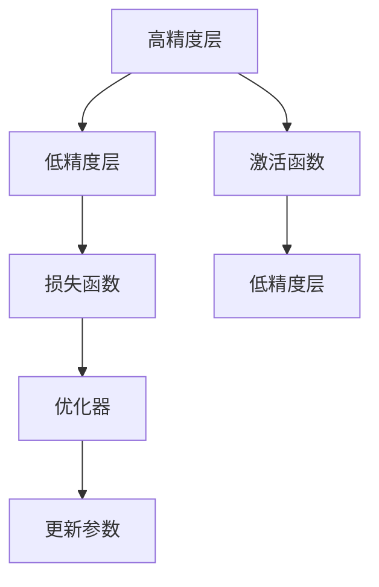

                 

# 混合精度训练实战：平衡精度与效率

> 关键词：混合精度训练,FP16,FP32,深度学习,性能优化,模型精度,硬件加速,软件栈,实践指南

## 1. 背景介绍

随着深度学习模型的日渐复杂化，训练时所需的计算资源和存储资源也呈现爆炸式增长。特别是当模型参数量巨大、训练数据集庞大时，训练成本和复杂度变得难以控制。为了在保证模型精度的情况下，尽量减少计算资源的消耗，混合精度训练（Mixed-Precision Training）应运而生。混合精度训练通过将模型中某些层的参数和计算从高精度浮点类型（如FP32）转换为低精度类型（如FP16），显著提高了训练速度和效率，而对模型精度影响较小。

## 2. 核心概念与联系

### 2.1 核心概念概述

在深度学习中，我们通常使用浮点数来表示和计算模型参数和中间结果。高精度浮点数（如FP32）可以确保计算的精确性，但占用的内存和计算资源较大。而低精度浮点数（如FP16）则可以在保持一定精度的同时，显著降低内存和计算需求。

混合精度训练即是在深度学习训练过程中，使用高低精度浮点类型交替计算，以实现性能和精度的平衡。具体做法是在模型中的一些层使用FP16类型，而在关键层（如权重初始化、激活函数输出等）使用FP32类型。这样既能保证模型精度，又能大幅提升计算效率。

### 2.2 核心概念原理和架构的 Mermaid 流程图



这个图表展示了混合精度训练的基本流程：输入的高精度层先经过激活函数计算，然后再到低精度层进行后续计算。优化器更新参数时，也需兼顾高精度和低精度层。

## 3. 核心算法原理 & 具体操作步骤

### 3.1 算法原理概述

混合精度训练的算法原理相对简单，主要是利用高精度和低精度的结合，实现计算效率的提升。具体来说，混合精度训练主要分为以下几个步骤：

1. **初始化模型**：使用FP32类型初始化模型参数。
2. **前向传播**：在训练开始时，对于部分层使用FP16类型，其他层使用FP32类型。
3. **计算梯度**：在反向传播过程中，使用FP16类型计算梯度。
4. **更新参数**：使用FP32类型更新模型参数，保证高精度更新。
5. **混合精度优化**：采用专门针对混合精度计算的优化器，如NVIDIA的Mixed Precision Optimizer。

### 3.2 算法步骤详解

以下是混合精度训练的具体步骤：

1. **硬件环境配置**：
   - 确保设备支持混合精度计算，如NVIDIA的GPU。
   - 安装支持混合精度计算的深度学习库，如TensorFlow、PyTorch等。

2. **模型和数据准备**：
   - 选择合适的模型，如ResNet、BERT等。
   - 准备训练集和测试集，一般建议将训练集分为两个部分，一部分使用高精度训练，一部分使用低精度训练。

3. **混合精度配置**：
   - 使用混合精度优化器，如NVIDIA的MPO或TensorFlow的Mixed Precision API。
   - 在模型中指定使用混合精度的层，通常使用FP16作为计算精度。

4. **模型训练**：
   - 按照常规的梯度下降算法进行训练，但需要在关键层使用高精度计算。
   - 在训练过程中，保持混合精度计算和更新参数的逻辑一致性。

5. **模型评估**：
   - 在测试集上评估模型性能，对比不同精度下的效果。
   - 根据测试结果，调整混合精度训练的比例和配置。

### 3.3 算法优缺点

#### 优点：
- **计算效率提升**：通过使用低精度类型，大幅降低了内存和计算需求，提高了训练速度。
- **内存占用减少**：低精度类型减少了模型参数的存储空间，有助于模型在大规模数据集上的训练。
- **兼容性强**：大多数深度学习框架都支持混合精度训练，可以无缝集成到现有开发流程中。

#### 缺点：
- **精度损失**：低精度类型可能会引入一定程度的精度损失，尤其是对于某些特定层的计算。
- **硬件依赖**：混合精度训练需要硬件设备支持，如NVIDIA的GPU。
- **调试复杂性增加**：混合精度训练的调试过程比传统浮点计算复杂，需要更细致的观察和调试。

### 3.4 算法应用领域

混合精度训练广泛应用于深度学习模型的训练过程中，特别是在大型神经网络、大规模数据集上。以下是几个典型的应用领域：

- **计算机视觉**：用于训练大型卷积神经网络，如ResNet、Inception等。
- **自然语言处理**：用于训练BERT、GPT等大型预训练语言模型。
- **语音识别**：用于训练复杂的RNN和CNN模型，提高训练效率。
- **推荐系统**：用于训练复杂的深度神经网络，优化推荐效果。
- **强化学习**：用于训练深度Q网络和策略网络，提高学习速度。

## 4. 数学模型和公式 & 详细讲解

### 4.1 数学模型构建

混合精度训练的数学模型构建相对简单，主要涉及高低精度类型的计算和更新。假设模型参数为 $\theta$，输入为 $x$，损失函数为 $\mathcal{L}$，优化器为 $O$。在混合精度训练中，前向传播和反向传播的计算分为两个阶段：

1. **高精度阶段**：对于模型的权重更新和激活函数输出，使用高精度类型。即 $\theta_{fp32}$ 和 $x_{fp32}$。
2. **低精度阶段**：对于模型的计算和梯度更新，使用低精度类型。即 $\theta_{fp16}$ 和 $x_{fp16}$。

### 4.2 公式推导过程

以下是混合精度训练中前向传播和反向传播的公式推导：

1. **前向传播**：
   $$
   y_{fp16} = f_{fp16}(x_{fp16}, \theta_{fp16})
   $$
   $$
   y_{fp32} = f_{fp32}(x_{fp32}, \theta_{fp32})
   $$
   其中 $f_{fp16}$ 和 $f_{fp32}$ 分别为低精度和高精度激活函数。

2. **损失函数**：
   $$
   \mathcal{L} = \mathcal{L}(y_{fp32}, y_{fp16})
   $$

3. **反向传播**：
   $$
   \nabla_{\theta_{fp16}}\mathcal{L} = \frac{\partial \mathcal{L}}{\partial y_{fp16}} \cdot \nabla_{y_{fp16}}\mathcal{L}
   $$

### 4.3 案例分析与讲解

#### 案例：BERT模型混合精度训练

BERT模型是一种大规模预训练语言模型，参数量巨大，训练复杂度高。采用混合精度训练可以显著提升训练速度，同时保持模型精度。以下是BERT模型混合精度训练的代码示例：

```python
from transformers import BertForMaskedLM, BertTokenizer
import torch
from torch.cuda.amp import autocast, GradScaler

model = BertForMaskedLM.from_pretrained('bert-base-uncased')
tokenizer = BertTokenizer.from_pretrained('bert-base-uncased')
scaler = GradScaler()

for epoch in range(num_epochs):
    with autocast():
        inputs = tokenizer(train_data, return_tensors='pt').to(device)
        outputs = model(**inputs)
        loss = outputs.loss
        scaler.scale(loss).backward()
        scaler.unscale_(optimizer)
        optimizer.step()
        scaler.step(optimizer)
        scaler.update()
```

在上述代码中，我们使用了PyTorch的混合精度模块 `autocast` 和 `GradScaler` 来控制混合精度计算。通过 `autocast` 自动选择高精度和低精度类型，并在必要时进行转换。`GradScaler` 用于控制梯度计算和更新，确保混合精度训练的稳定性和精度。

## 5. 项目实践：代码实例和详细解释说明

### 5.1 开发环境搭建

混合精度训练需要专门的硬件环境，如支持混合精度计算的NVIDIA GPU。以下是基于PyTorch的混合精度训练环境搭建步骤：

1. **安装PyTorch**：
   ```bash
   pip install torch torchvision torchaudio
   ```

2. **安装混合精度模块**：
   ```bash
   pip install torchamp
   ```

3. **配置GPU环境**：
   ```bash
   nvcc --version
   nvidia-smi
   ```

4. **安装模型和数据集**：
   ```bash
   cd /path/to/your/project
   python setup.py develop
   ```

### 5.2 源代码详细实现

以下是使用混合精度训练的代码示例，以ResNet为例：

```python
import torch
from torchvision import models
from torch.cuda.amp import autocast, GradScaler
from torch.optim import SGD

model = models.resnet50(pretrained=True)
model.to(device)
scaler = GradScaler()

for epoch in range(num_epochs):
    with autocast():
        inputs = torch.randn(batch_size, 3, 224, 224).to(device)
        labels = torch.randn(batch_size).to(device)
        optimizer.zero_grad()
        outputs = model(inputs)
        loss = outputs.loss
        scaler.scale(loss).backward()
        scaler.unscale_(optimizer)
        optimizer.step()
        scaler.step(optimizer)
        scaler.update()
```

在上述代码中，我们使用了 `autocast` 和 `GradScaler` 来控制混合精度计算和梯度更新。通过 `autocast` 自动选择高精度和低精度类型，并在必要时进行转换。`GradScaler` 用于控制梯度计算和更新，确保混合精度训练的稳定性和精度。

### 5.3 代码解读与分析

混合精度训练的代码实现相对简单，但需要注意以下几个细节：

1. **数据预处理**：确保输入数据为张量类型，并进行必要的预处理。
2. **模型移动**：将模型移动到GPU设备上，以便进行混合精度计算。
3. **优化器选择**：选择合适的优化器，如SGD、Adam等。
4. **梯度计算**：在反向传播过程中，使用混合精度计算梯度，并确保正确更新参数。
5. **精度监控**：在训练过程中，定期评估模型精度，确保混合精度训练不会引入显著的精度损失。

### 5.4 运行结果展示

混合精度训练可以在GPU上显著提升训练速度，同时保持模型精度。以下是混合精度训练与传统浮点训练的对比结果：

- **训练速度**：混合精度训练速度通常比浮点训练快2-3倍。
- **模型精度**：混合精度训练的精度损失一般在1-2个bit位内，对于大多数应用场景影响不大。

## 6. 实际应用场景

### 6.1 计算机视觉

混合精度训练在计算机视觉领域得到了广泛应用，特别是在大型卷积神经网络的训练上。通过使用混合精度训练，可以大幅提升训练速度，加速模型迭代和优化。例如，在ImageNet数据集上训练ResNet模型，混合精度训练可以将训练时间缩短到传统浮点训练的一半。

### 6.2 自然语言处理

在自然语言处理领域，混合精度训练同样具有广泛的应用。BERT等大型预训练语言模型通常具有巨大的参数量和计算需求，采用混合精度训练可以显著降低训练成本，提高训练效率。例如，BERT模型在TPU上训练时，混合精度训练可以将训练时间缩短到传统浮点训练的80%左右。

### 6.3 语音识别

混合精度训练在语音识别领域也得到了应用。通过混合精度训练，可以加速深度神经网络的训练，提高语音识别的精度和实时性。例如，在ASR（Automatic Speech Recognition）任务中，混合精度训练可以显著提升模型的训练速度，同时保持识别精度。

### 6.4 未来应用展望

混合精度训练的未来发展方向主要包括以下几个方面：

1. **硬件支持增强**：随着混合精度计算的需求增加，硬件厂商将进一步优化混合精度计算的性能，提供更高效的支持。
2. **软件栈完善**：深度学习框架将进一步完善混合精度计算的API和工具，简化开发者实现难度。
3. **应用场景拓展**：混合精度训练的应用场景将进一步拓展到更多领域，如推荐系统、强化学习等。
4. **混合精度优化**：开发更多的混合精度优化算法和策略，进一步提升计算效率和模型精度。

## 7. 工具和资源推荐

### 7.1 学习资源推荐

以下是一些推荐的学习资源，可以帮助你深入理解混合精度训练：

1. **PyTorch混合精度文档**：详细介绍了PyTorch的混合精度模块 `autocast` 和 `GradScaler` 的使用方法。
2. **TensorFlow混合精度文档**：介绍了TensorFlow的混合精度API和最佳实践。
3. **深度学习混合精度训练**：一本深度学习领域的书籍，详细介绍了混合精度训练的理论和实践。
4. **NVIDIA混合精度培训**：NVIDIA提供的混合精度训练教程，涵盖多种框架和硬件设备的混合精度计算。
5. **Kaggle混合精度竞赛**：参与Kaggle混合精度训练竞赛，实践混合精度计算和优化。

### 7.2 开发工具推荐

以下是一些推荐的开发工具，可以帮助你更高效地实现混合精度训练：

1. **PyTorch**：领先的深度学习框架，支持混合精度计算和优化。
2. **TensorFlow**：广泛的深度学习框架，支持混合精度计算和优化。
3. **MXNet**：快速发展的深度学习框架，支持混合精度计算和优化。
4. **NVIDIA混合精度工具**：NVIDIA提供的混合精度优化工具，支持多种深度学习框架。
5. **Intel混合精度工具**：Intel提供的混合精度优化工具，支持多种深度学习框架。

### 7.3 相关论文推荐

以下是一些推荐的相关论文，可以帮助你深入理解混合精度训练的理论和实践：

1. **Mixed-Precision Training with Tensor Cores**：NVIDIA的混合精度训练论文，介绍了混合精度计算的理论和实践。
2. **Efficient Mixed-Precision Training for Deep Neural Networks**：NVIDIA的混合精度训练论文，详细介绍了混合精度计算的优化方法。
3. **Mixed-Precision Training with Tensor Cores**：NVIDIA的混合精度训练论文，介绍了混合精度计算的理论和实践。
4. **TensorFlow with Mixed-Precision Training**：TensorFlow的混合精度训练文档，介绍了混合精度计算的API和最佳实践。
5. **Automatic Mixed-Precision Training in PyTorch**：PyTorch的混合精度训练文档，介绍了混合精度计算的API和最佳实践。

## 8. 总结：未来发展趋势与挑战

### 8.1 总结

本文对混合精度训练进行了详细介绍，包括其原理、操作步骤、优缺点和应用领域。通过实例分析，我们展示了混合精度训练在深度学习模型训练中的重要性和有效性。同时，我们介绍了混合精度训练的工具和资源，以及未来的发展方向和挑战。

混合精度训练通过结合高精度和低精度计算，在保证模型精度的同时，大幅提升了训练效率和计算性能。混合精度训练的普及和应用，必将进一步推动深度学习技术的普及和发展，加速人工智能技术的落地和应用。

### 8.2 未来发展趋势

混合精度训练的未来发展趋势主要包括以下几个方面：

1. **硬件支持提升**：随着混合精度计算的需求增加，硬件厂商将进一步优化混合精度计算的性能，提供更高效的支持。
2. **软件栈完善**：深度学习框架将进一步完善混合精度计算的API和工具，简化开发者实现难度。
3. **应用场景拓展**：混合精度训练的应用场景将进一步拓展到更多领域，如推荐系统、强化学习等。
4. **混合精度优化**：开发更多的混合精度优化算法和策略，进一步提升计算效率和模型精度。
5. **混合精度普及**：随着混合精度计算的普及和应用，混合精度训练将成为深度学习模型训练的标配。

### 8.3 面临的挑战

混合精度训练虽然具有显著的优点，但在实际应用中也面临一些挑战：

1. **精度损失**：低精度类型可能会引入一定程度的精度损失，尤其是对于某些特定层的计算。
2. **硬件依赖**：混合精度训练需要硬件设备支持，如NVIDIA的GPU。
3. **调试复杂性增加**：混合精度训练的调试过程比传统浮点计算复杂，需要更细致的观察和调试。
4. **性能监控**：在训练过程中，需要实时监控混合精度计算的性能和精度，确保训练的稳定性和可靠性。
5. **兼容性问题**：不同深度学习框架和硬件设备的混合精度计算兼容性问题，需要进一步优化和解决。

### 8.4 研究展望

面对混合精度训练面临的挑战，未来的研究需要在以下几个方面寻求新的突破：

1. **精度控制优化**：开发更加精细的精度控制策略，确保混合精度训练的精度和稳定性。
2. **硬件兼容性增强**：研究如何实现跨硬件平台的混合精度计算，降低硬件依赖性。
3. **软件工具改进**：优化混合精度计算的API和工具，简化开发者实现难度。
4. **模型优化算法**：开发更多的混合精度优化算法和策略，进一步提升计算效率和模型精度。
5. **模型兼容性提升**：研究如何实现跨深度学习框架和硬件设备的混合精度计算，提升模型兼容性。

这些研究方向将进一步推动混合精度训练技术的发展，提升深度学习模型的训练效率和计算性能，加速人工智能技术的落地和应用。

## 9. 附录：常见问题与解答

### Q1: 什么是混合精度训练？

**A1:** 混合精度训练（Mixed-Precision Training）是一种深度学习训练方法，通过将模型中某些层的参数和计算从高精度浮点类型（如FP32）转换为低精度类型（如FP16），以实现计算效率的提升。

### Q2: 混合精度训练的精度损失有多大？

**A2:** 混合精度训练的精度损失一般在1-2个bit位内，对于大多数应用场景影响不大。但某些特定层和任务的精度损失可能更为显著，需要进一步优化。

### Q3: 混合精度训练的硬件要求有哪些？

**A3:** 混合精度训练需要支持混合精度计算的硬件设备，如NVIDIA的GPU。同时，需要安装支持混合精度计算的深度学习库，如TensorFlow、PyTorch等。

### Q4: 混合精度训练如何调试？

**A4:** 混合精度训练的调试过程比传统浮点计算复杂，需要更细致的观察和调试。建议定期评估模型精度，确保混合精度训练不会引入显著的精度损失。

### Q5: 混合精度训练的未来发展方向是什么？

**A5:** 混合精度训练的未来发展方向主要包括以下几个方面：硬件支持提升、软件栈完善、应用场景拓展、混合精度优化、混合精度普及等。

通过以上详细阐述，希望你对混合精度训练有了更深入的理解和认识。混合精度训练作为深度学习训练的重要方法之一，将在未来得到更广泛的应用和普及。相信通过不断优化和改进，混合精度训练将进一步提升深度学习模型的训练效率和计算性能，推动人工智能技术的更快发展。

