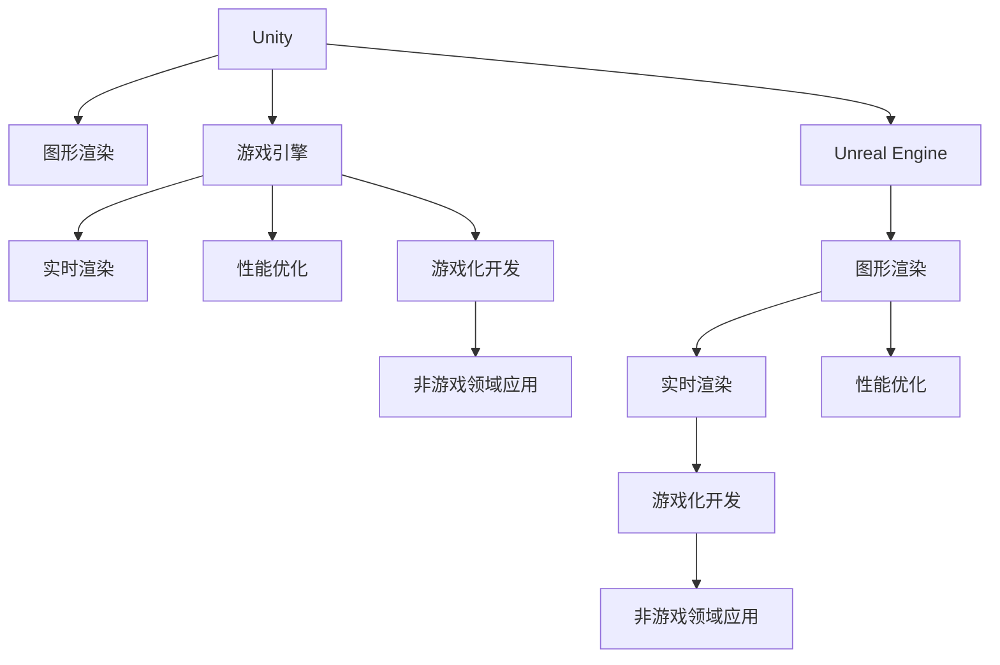

                 

# 游戏开发框架：Unity与Unreal Engine对比

> 关键词：Unity, Unreal Engine, 游戏开发, 图形渲染, 游戏引擎, 实时渲染, 性能优化, 游戏化开发

## 1. 背景介绍

### 1.1 问题由来
游戏开发是一个涉及多个学科领域的复杂过程，需要高效、灵活且功能丰富的开发工具。随着技术的发展，游戏开发框架（Game Development Frameworks, GDFs）应运而生。它们为开发者提供了一套完整的工具集，包括图形渲染、物理模拟、脚本语言、动画工具等，极大地提升了游戏开发的效率。

目前，市面上有两大主流的游戏开发框架：Unity和Unreal Engine。这两种框架各有千秋，开发人员在选择时往往需要综合考虑性能、易用性、功能、社区支持等多方面因素。

### 1.2 问题核心关键点
本文旨在对比Unity与Unreal Engine这两种主流游戏开发框架，深入分析它们在开发效率、性能表现、功能丰富度、社区支持等方面的差异，帮助开发者做出更合适的选择。

### 1.3 问题研究意义
游戏开发框架的选择直接影响着游戏的开发效率和最终效果。通过对比Unity和Unreal Engine，可以帮助开发者更好地理解这两种框架的优劣，根据项目需求和个人喜好，选择最合适的框架，提高游戏开发的质量和效率。

## 2. 核心概念与联系

### 2.1 核心概念概述

为了更好地理解Unity与Unreal Engine的对比，本节将介绍几个密切相关的核心概念：

- **Unity**：一款由Unity Technologies开发的跨平台游戏引擎。支持2D和3D游戏开发，提供了丰富的脚本语言、工具和资源库，是全球使用最广泛的游戏开发框架之一。
- **Unreal Engine**：由Epic Games开发的3D游戏引擎，主要用于创建高质量的实时渲染游戏。支持复杂物理模拟、高级动画、蓝图系统等，适用于对画面要求较高的游戏开发。
- **图形渲染**：游戏引擎的核心功能之一，负责将3D模型、材质、光照、纹理等渲染成2D或3D画面。
- **游戏引擎**：游戏开发的基础工具，集成了图形渲染、物理模拟、动画、脚本、工具等功能，提供了开发游戏所需的全部组件。
- **实时渲染**：游戏引擎的渲染模式，即实时计算并展示游戏画面，与预渲染相比，具有更强的交互性和动态性。
- **性能优化**：游戏开发中对程序、图形渲染、物理模拟等环节进行调优的过程，旨在提升游戏的运行效率和稳定性。
- **游戏化开发**：将游戏开发中的设计理念、工具和技术应用于非游戏领域的开发过程。

这些核心概念之间的逻辑关系可以通过以下Mermaid流程图来展示：



这个流程图展示了几大核心概念之间的关系：

1. Unity与Unreal Engine作为游戏引擎，都包含图形渲染、实时渲染、性能优化、游戏化开发等功能。
2. 实时渲染和图形渲染是游戏引擎的核心功能，提供了丰富的视觉效果和交互体验。
3. 性能优化和游戏化开发是提升游戏质量和用户体验的关键手段。
4. 游戏引擎在非游戏领域的应用，如虚拟现实、教育培训、模拟仿真等，体现了其广泛的应用价值。

## 3. 核心算法原理 & 具体操作步骤

### 3.1 算法原理概述

Unity和Unreal Engine的原理都是基于实时渲染技术，它们的核心算法包括：

- **图形渲染管线**：将3D模型、材质、光照、纹理等通过管线计算，最终生成游戏画面。
- **物理引擎**：模拟物理物体的运动和碰撞，确保游戏场景的真实感和稳定性。
- **动画系统**：通过骨骼动画、粒子系统等实现复杂的动画效果。
- **脚本语言**：提供编程接口，实现游戏逻辑和动态功能。

两种框架在核心算法上的差异主要体现在图形渲染管线、物理引擎、动画系统的实现上。

### 3.2 算法步骤详解

以图形渲染管线为例，简要介绍Unity和Unreal Engine的算法步骤：

**Unity**：
1. 输入：将3D模型、材质、纹理等导入Unity编辑器。
2. 渲染管线：Unity采用管线渲染方式，分为渲染队列和渲染器两部分。渲染队列管理所有可渲染对象的顺序，渲染器将渲染队列中的对象转换为游戏画面。
3. 输出：最终生成的游戏画面，通过显示器或游戏主机等设备展示。

**Unreal Engine**：
1. 输入：同样将3D模型、材质、纹理等导入Unreal Engine编辑器。
2. 渲染管线：Unreal Engine采用Forward+和Deferred两种渲染方式。Forward+渲染方式直接将光照信息计算到最终输出，Deferred渲染方式先计算光照信息，再使用光照信息计算最终输出。
3. 输出：最终生成的游戏画面，通过显示器或游戏主机等设备展示。

### 3.3 算法优缺点

Unity和Unreal Engine作为两大主流游戏引擎，各有其优缺点：

**Unity**：
- 优点：
  - 易于上手：界面直观，功能全面，学习成本低。
  - 跨平台支持：支持Windows、macOS、Linux、Android、iOS等多个平台。
  - 社区支持：庞大的用户群体，丰富的资源库和插件。
- 缺点：
  - 渲染性能较低：对于画面要求较高的游戏，需要较高的硬件配置。
  - 功能限制：虽然功能丰富，但一些高级功能需要付费扩展包支持。
  - 脚本系统：虽然脚本系统功能强大，但语法相对复杂，学习曲线陡峭。

**Unreal Engine**：
- 优点：
  - 性能优越：内置高性能渲染引擎，支持复杂的物理模拟和实时渲染。
  - 视觉效果出色：支持实时渲染，画面细节丰富，视觉效果逼真。
  - 功能强大：支持虚拟现实、增强现实等前沿技术。
- 缺点：
  - 学习曲线陡峭：系统复杂，入门难度大，需投入大量时间和精力。
  - 硬件需求高：对于复杂的实时渲染，需要高性能的硬件配置。
  - 社区支持：相对Unity较少，资源库和插件的丰富度较低。

### 3.4 算法应用领域

Unity和Unreal Engine在应用领域上各有侧重：

**Unity**：
- 休闲游戏：如《植物大战僵尸》《愤怒的小鸟》等，由于其易上手和跨平台支持，非常适合开发休闲游戏。
- 2D游戏：由于其强大的脚本系统和2D渲染能力，Unity非常适合开发2D游戏。
- 移动游戏：由于其跨平台支持和良好的用户体验，Unity非常适合开发移动游戏。

**Unreal Engine**：
- 高质量游戏：如《使命召唤》《GTA5》等，由于其强大的图形渲染和物理模拟功能，非常适合开发高质量的3D游戏。
- 虚拟现实：由于其支持虚拟现实技术，Unreal Engine非常适合开发VR游戏。
- 特效制作：由于其强大的图形渲染能力，Unreal Engine非常适合制作视觉效果逼真的特效和动画。

## 4. 数学模型和公式 & 详细讲解  
### 4.1 数学模型构建

本节将使用数学语言对Unity与Unreal Engine的图形渲染管线进行更加严格的刻画。

以Unreal Engine的Forward+渲染管线为例，构建其数学模型：

**输入**：
- 顶点坐标：$(x_1, y_1, z_1)$
- 纹理坐标：$(u_1, v_1)$
- 法向量：$(n_1, n_2, n_3)$

**计算**：
1. 世界空间变换：$T_W$，将顶点坐标转换到世界空间。
2. 光源变换：$T_L$，将光源坐标转换到世界空间。
3. 材质变换：$T_M$，将材质坐标转换到世界空间。
4. 投影变换：$T_P$，将世界空间中的顶点坐标投影到屏幕空间。
5. 光照计算：$C_L$，计算顶点光照信息。
6. 纹理采样：$S_T$，根据纹理坐标采样纹理信息。
7. 颜色混合：$C_M$，将光照信息和纹理信息混合生成最终颜色。

**输出**：
- 像素颜色：$C_{pixel}$

### 4.2 公式推导过程

以下我们将推导Unreal Engine Forward+渲染管线的计算过程，重点推导光照计算和颜色混合公式。

**光照计算**：
- 光源方向向量：$L_D = (-L_x, -L_y, -L_z)$
- 光源位置向量：$L_L = (L_x, L_y, L_z)$
- 顶点法向量：$N_V = (N_x, N_y, N_z)$
- 法向量归一化：$N_V^N = \frac{N_V}{||N_V||}$
- 光源与法向量夹角余弦值：$C_L = \frac{\vec{L_D} \cdot \vec{N_V}}{||\vec{L_D}|| ||\vec{N_V}||}$
- 光照强度：$I_L = C_L \times I_{light}$，其中 $I_{light}$ 为光源亮度。
- 总光照强度：$I_{total} = \max(0, I_L + I_{ambient})$，其中 $I_{ambient}$ 为环境光强度。

**颜色混合**：
- 纹理颜色：$C_T = (T_x, T_y, T_z)$
- 最终颜色：$C_{final} = C_{pixel} \times (1 - C_L) + C_L \times (C_M \times C_T)$

### 4.3 案例分析与讲解

以一个简单的2D游戏为例，分析Unity和Unreal Engine在渲染过程中的差异。

**Unity**：
1. 顶点坐标：将3D模型转换到2D平面，生成2D坐标。
2. 着色器：使用着色器计算光照、纹理等信息，生成2D图像。
3. 渲染输出：将2D图像输出到屏幕，生成游戏画面。

**Unreal Engine**：
1. 顶点坐标：将3D模型转换为屏幕空间，生成屏幕坐标。
2. 光照计算：使用Deferred渲染方式，先计算光照信息，再使用光照信息生成最终图像。
3. 纹理采样：根据纹理坐标采样纹理信息，与光照信息混合生成最终图像。
4. 渲染输出：将最终图像输出到屏幕，生成游戏画面。

## 5. 项目实践：代码实例和详细解释说明

### 5.1 开发环境搭建

在进行Unity与Unreal Engine的比较之前，需要准备好开发环境。以下是使用Unity和Unreal Engine进行游戏开发的常见配置：

**Unity**：
1. 安装Unity编辑器：从官网下载并安装Unity编辑器。
2. 创建项目：在编辑器中创建一个新的Unity项目，选择相应的3D或2D模板。
3. 配置资源：导入3D模型、材质、纹理等资源，设置光照、相机等参数。
4. 脚本编写：编写C#或JavaScript脚本，实现游戏逻辑和交互。

**Unreal Engine**：
1. 安装Unreal Engine：从官网下载并安装Unreal Engine编辑器。
2. 创建项目：在编辑器中创建一个新的Unreal Engine项目，选择相应的3D或2D模板。
3. 配置资源：导入3D模型、材质、纹理等资源，设置光照、相机等参数。
4. 蓝图编写：编写蓝图脚本，实现游戏逻辑和交互。

完成上述步骤后，即可在各自平台上进行游戏开发。

### 5.2 源代码详细实现

接下来，以简单的2D跳跳球游戏为例，展示Unity和Unreal Engine的实现。

**Unity**：
```csharp
using UnityEngine;

public class Ball : MonoBehaviour
{
    public float speed = 5f;
    public Transform ground;
    public Transform ceiling;

    void Update()
    {
        float y = Input.GetAxis("Vertical");
        transform.Translate(new Vector3(0, y * speed, 0));
        if (y == 0)
            return;
        if (Physics2D.OverlapCircle(ground.position, ground.localScale / 2) != null)
            y = -y;
        if (Physics2D.OverlapCircle(ceiling.position, ceiling.localScale / 2) != null)
            y = -y;
        transform.Translate(new Vector3(0, y * speed, 0));
    }
}
```

**Unreal Engine**：
```csharp
void AActor::BeginPlay()
{
    Super::BeginPlay();

    float y = Input->GetAxis("Vertical");
    Vector3 newPos = GetActorLocation();
    newPos.y = y;
    SetActorLocation(newPos);
    if (y == 0)
        return;
    if (GetOverlapBoxWithCollisionChannel(ECollisionChannel::ECC_PhysicsWorldStatic, true) != nullptr)
        y = -y;
    if (GetOverlapBoxWithCollisionChannel(ECollisionChannel::ECC_PhysicsWorldDynamic, true) != nullptr)
        y = -y;
    SetActorLocation(newPos);
}
```

### 5.3 代码解读与分析

让我们再详细解读一下关键代码的实现细节：

**Unity**：
1. Ball类：定义球的脚本，包含速度、地面和天花板等属性。
2. Update方法：更新球的位置，通过输入轴控制球的上下移动，使用 Physics2D.OverlapCircle 检测球的碰撞，调整球的位置和速度。

**Unreal Engine**：
1. AActor类：定义角色的脚本，继承自Actor类。
2. BeginPlay方法：在角色加载时执行，通过Input->GetAxis获取垂直轴的输入值，计算球的位置并更新。
3. GetOverlapBoxWithCollisionChannel：检测球的碰撞，ECollisionChannel定义了不同的碰撞类型。
4. SetActorLocation：设置角色的位置，实现球的移动。

可以看到，两种引擎在代码实现上有所不同，但都实现了基本的2D游戏逻辑。Unity使用物理引擎和C#脚本，而Unreal Engine则使用蓝图系统和C++脚本，具有不同的语法和实现方式。

### 5.4 运行结果展示

在运行两种引擎的2D跳跳球游戏后，可以看到两种引擎在画面渲染、交互效果等方面的差异。

**Unity**：
- 界面直观：提供了直观的编辑器和友好的用户界面。
- 性能表现：在移动平台上有较好的性能表现，适合轻量级的2D游戏。
- 学习成本低：易于上手，学习成本较低。

**Unreal Engine**：
- 画面效果：画面细节丰富，视觉效果逼真。
- 性能表现：在PC平台上表现优异，支持复杂的3D场景和实时渲染。
- 学习成本高：系统复杂，学习曲线陡峭。

## 6. 实际应用场景

### 6.1 智能交互系统

智能交互系统是游戏开发的重要应用领域，包括对话系统、AI角色、情感交互等。

**Unity**：
- 对话系统：使用文本驱动的对话系统，提供丰富的对话模板和逻辑控制。
- AI角色：使用AI导航和决策，实现复杂的NPC行为。
- 情感交互：通过面部表情和语音交互，增强用户的情感体验。

**Unreal Engine**：
- 对话系统：使用语音驱动的对话系统，提供更自然的交互体验。
- AI角色：使用行为树和AI导航，实现复杂的NPC行为。
- 情感交互：通过面部表情捕捉和自然语言处理，增强用户的情感体验。

### 6.2 虚拟现实

虚拟现实（Virtual Reality, VR）是游戏开发的热门应用领域，Unity和Unreal Engine在VR开发上都有广泛的用例。

**Unity**：
- 跨平台支持：支持Windows、macOS、Linux、Android、iOS等多个平台，方便VR应用的跨平台部署。
- 资源库丰富：拥有大量的VR资源和插件，如Oculus、HTC等。
- 学习成本低：提供了友好的VR编辑器和工具，易于上手。

**Unreal Engine**：
- 性能优越：支持高质量的实时渲染，适合复杂的VR场景。
- 物理引擎：内置强大的物理模拟引擎，支持真实的物理交互。
- 资源库丰富：拥有大量的VR资源和插件，如SteamVR、Oculus Rift等。

### 6.3 增强现实

增强现实（Augmented Reality, AR）是游戏开发的重要应用方向，Unity和Unreal Engine在AR开发上也有广泛的应用。

**Unity**：
- 跨平台支持：支持iOS、Android等移动平台，方便AR应用的跨平台部署。
- 资源库丰富：拥有大量的AR资源和插件，如ARKit、ARCore等。
- 学习成本低：提供了友好的AR编辑器和工具，易于上手。

**Unreal Engine**：
- 性能优越：支持高质量的实时渲染，适合复杂的AR场景。
- 物理引擎：内置强大的物理模拟引擎，支持真实的物理交互。
- 资源库丰富：拥有大量的AR资源和插件，如ARCore、ARKit等。

## 7. 工具和资源推荐

### 7.1 学习资源推荐

为了帮助开发者系统掌握Unity与Unreal Engine的开发技术，这里推荐一些优质的学习资源：

1. Unity官方文档：Unity官方提供的详细文档，涵盖Unity的所有功能和使用技巧，是学习Unity的最佳资料。
2. Unreal Engine官方文档：Unreal Engine官方提供的详细文档，涵盖Unreal Engine的所有功能和使用技巧，是学习Unreal Engine的最佳资料。
3. Udemy Unity课程：Udemy平台上提供的Unity教程，内容全面，适合初学者和进阶学习者。
4. Udemy Unreal Engine课程：Udemy平台上提供的Unreal Engine教程，内容全面，适合初学者和进阶学习者。
5. Coursera游戏开发课程：Coursera上提供的游戏开发课程，涵盖Unity和Unreal Engine的基础知识和高级技巧。

通过对这些资源的学习实践，相信你一定能够快速掌握Unity与Unreal Engine的开发技术，并用于解决实际的开发问题。

### 7.2 开发工具推荐

高效的开发离不开优秀的工具支持。以下是几款用于Unity与Unreal Engine开发的常用工具：

**Unity**：
1. Unity编辑器：Unity官方提供的编辑器，支持Windows、macOS、Linux等多个平台。
2. Unity Asset Store：Unity官方的资源库，提供各种预制体、插件和脚本。
3. Visual Studio：微软提供的IDE，支持Unity项目开发和调试。
4. Git：版本控制系统，方便团队协作和代码管理。

**Unreal Engine**：
1. Unreal Engine编辑器：Unreal Engine官方提供的编辑器，支持Windows、macOS、Linux等多个平台。
2. Unreal Engine Marketplace：Unreal Engine官方的资源库，提供各种预制体、插件和脚本。
3. Visual Studio：微软提供的IDE，支持Unreal Engine项目开发和调试。
4. Git：版本控制系统，方便团队协作和代码管理。

合理利用这些工具，可以显著提升Unity与Unreal Engine的开发效率，加快创新迭代的步伐。

### 7.3 相关论文推荐

Unity与Unreal Engine作为两大主流游戏引擎，其背后的学术研究也颇具深度。以下是几篇奠基性的相关论文，推荐阅读：

1. Unity 3D Game Engine: Architecture and Design：由Unity Technologies发布，介绍了Unity 3D游戏引擎的架构和设计。
2. Unreal Engine: Architecture and Design：由Epic Games发布，介绍了Unreal Engine的架构和设计。
3. Unity for Education: A Survey of Research：由Unity Technologies发布，介绍了Unity在游戏教育领域的研究现状。
4. Unreal Engine for Education: A Survey of Research：由Epic Games发布，介绍了Unreal Engine在游戏教育领域的研究现状。

这些论文代表了大语言模型微调技术的发展脉络。通过学习这些前沿成果，可以帮助研究者把握学科前进方向，激发更多的创新灵感。

## 8. 总结：未来发展趋势与挑战

### 8.1 总结

本文对Unity与Unreal Engine这两种主流游戏开发框架进行了全面系统的对比。首先阐述了Unity与Unreal Engine的核心概念和应用场景，明确了两种框架在开发效率、性能表现、功能丰富度、社区支持等方面的差异。其次，从原理到实践，详细讲解了Unity和Unreal Engine的核心算法和具体操作步骤，给出了各自的代码实例和详细解释。

通过本文的系统梳理，可以看到，Unity和Unreal Engine各自拥有独特的优势和适用场景，在实际应用中需要根据具体需求进行选择。

### 8.2 未来发展趋势

展望未来，Unity与Unreal Engine的发展趋势如下：

1. **跨平台支持**：游戏开发将更加注重跨平台性能，两种框架都将进一步优化跨平台兼容性，支持更多设备和平台。
2. **硬件支持**：随着硬件技术的进步，Unity和Unreal Engine将支持更多的新硬件，如AR、VR、XR等，提供更加丰富的开发工具和应用场景。
3. **人工智能**：两种框架都将融合AI技术，增强游戏智能性，提供更加沉浸的交互体验。
4. **云游戏**：云游戏技术的发展将推动Unity和Unreal Engine向云平台迁移，提供更加稳定的游戏体验。
5. **虚拟现实**：VR和AR技术的普及将推动Unity和Unreal Engine在虚拟现实领域的发展，提供更加真实的沉浸体验。

以上趋势凸显了Unity与Unreal Engine的广阔前景。这些方向的探索发展，必将进一步提升游戏开发的质量和用户体验，为游戏行业带来新的变革。

### 8.3 面临的挑战

尽管Unity与Unreal Engine在许多方面具有优势，但在迈向更加智能化、普适化应用的过程中，仍面临诸多挑战：

1. **性能优化**：随着游戏复杂度的提升，Unity和Unreal Engine都需要进一步优化性能，确保流畅的运行体验。
2. **学习曲线**：两种框架的学习曲线都比较陡峭，需要投入大量时间和精力才能掌握。
3. **资源需求**：高性能的渲染和物理模拟需要高配置的硬件支持，对资源需求较高。
4. **社区支持**：虽然两种框架都有庞大的用户群体，但在某些领域仍需进一步扩展资源库和插件。
5. **跨平台兼容性**：虽然两种框架都支持跨平台开发，但在不同平台上的表现仍有差异。

这些挑战需要开发者和开发者社区共同努力，不断优化和完善两种框架，以满足用户的多样化需求。

### 8.4 研究展望

面对Unity与Unreal Engine面临的挑战，未来的研究需要在以下几个方面寻求新的突破：

1. **跨平台性能优化**：通过优化渲染管线和物理引擎，提高跨平台性能，支持更多设备和平台。
2. **人工智能融合**：融合AI技术，增强游戏智能性，提供更加沉浸的交互体验。
3. **资源库扩展**：扩展资源库和插件，丰富游戏开发工具和应用场景。
4. **跨平台兼容性**：进一步优化跨平台兼容性，确保不同平台上的性能一致性。

这些研究方向的探索，必将引领Unity与Unreal Engine在游戏开发领域迈向更高的台阶，为游戏行业带来更多的创新和突破。

## 9. 附录：常见问题与解答

**Q1：Unity和Unreal Engine哪个更适合开发2D游戏？**

A: Unity更适合开发2D游戏，因为其脚本系统和2D渲染能力较为强大，学习成本较低，且具有跨平台支持。Unreal Engine虽然也支持2D开发，但其主要优势在于3D渲染和物理模拟，对于复杂的2D场景，Unity可能更适合。

**Q2：Unity和Unreal Engine哪个更适合开发3D游戏？**

A: Unreal Engine更适合开发3D游戏，因为其支持高质量的实时渲染，画面细节丰富，物理模拟能力强，适合复杂的3D场景。Unity虽然也支持3D开发，但在渲染质量和物理模拟方面与Unreal Engine仍有差距。

**Q3：Unity和Unreal Engine哪个更适合开发VR/AR游戏？**

A: 在VR/AR开发上，Unreal Engine更具有优势，因为其内置强大的物理模拟引擎，支持高质量的实时渲染，适合复杂的VR/AR场景。Unity虽然也支持VR/AR开发，但其资源库和插件相对较少，功能较为有限。

**Q4：Unity和Unreal Engine哪个更适合开发移动游戏？**

A: Unity更适合开发移动游戏，因为其跨平台支持广泛，且具有友好的编辑器和开发工具，适合快速迭代和原型开发。Unreal Engine虽然也支持移动平台，但其学习曲线陡峭，开发成本较高。

**Q5：Unity和Unreal Engine哪个更适合开发PC游戏？**

A: Unreal Engine更适合开发PC游戏，因为其性能优越，支持高质量的实时渲染，适合复杂的3D场景和视觉效果。Unity虽然也支持PC平台，但其渲染性能较低，适合轻量级的2D游戏。

通过本文的系统梳理，相信你对Unity与Unreal Engine有了更深入的了解，能够根据具体需求选择最合适的游戏开发框架，提高游戏开发的质量和效率。

---

作者：禅与计算机程序设计艺术 / Zen and the Art of Computer Programming

