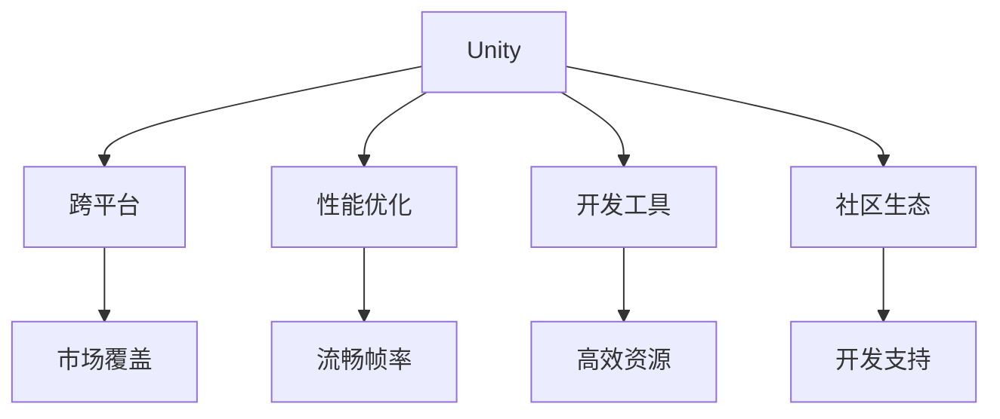

                 

## 1. 背景介绍

### 1.1 问题由来
游戏开发领域中，选择游戏引擎框架是一个重要的决策点。两大主流的引擎框架Unity和Unreal Engine（UE4）各有其优劣，分别被广泛应用于各种规模和类型项目中。本文将深入比较Unity与Unreal Engine的不同，并详细探讨在不同类型的游戏项目中如何选择最合适的框架。

### 1.2 问题核心关键点
游戏引擎的选择直接影响游戏开发的效率、性能、成本及最终产品的质量。Unity和Unreal Engine在跨平台支持、性能优化、开发工具、社区生态等方面各有优势，选择合适的框架是游戏项目成功与否的关键。

### 1.3 问题研究意义
通过对比Unity与Unreal Engine，可以为游戏开发者提供清晰的决策依据，帮助他们根据项目需求选择合适的引擎，从而提高开发效率，降低成本，同时确保游戏性能和用户体验。

## 2. 核心概念与联系

### 2.1 核心概念概述

为更好理解Unity与Unreal Engine的选择，本节将介绍几个关键核心概念：

- **Unity**：由Unity Technologies开发的游戏引擎，支持2D、3D及AR/VR等多种类型游戏开发，具备跨平台特性，拥有庞大的社区支持与丰富的开发资源。
- **Unreal Engine**：由Epic Games开发的游戏引擎，以其强大的可视化编辑器和物理模拟功能著称，主要用于3D游戏和高级视觉效果，适用于高端PC和主机平台。
- **跨平台**：指游戏可以在多种平台（如PC、手机、游戏机等）上运行，降低平台兼容性问题，提升市场覆盖率。
- **性能优化**：指在保证游戏运行流畅的前提下，通过合理配置与代码优化，实现高效资源利用和帧率稳定。
- **开发工具**：指游戏开发过程中使用的各种辅助工具，包括编辑器、调试器、版本控制系统等。
- **社区生态**：指围绕游戏引擎构建的开发者社区，包括教程、插件、论坛等，对游戏开发具有重要支持作用。

这些概念之间的联系可以通过以下Mermaid流程图来展示：



这个流程图展示了两大引擎的核心特性及其对游戏开发的影响：

1. Unity提供跨平台支持，通过市场覆盖实现更广泛的市场。
2. 性能优化和开发工具提升游戏开发效率，提供流畅的帧率和高效资源利用。
3. 社区生态提供丰富的开发资源，提升开发者的支持和项目成功率。

## 3. 核心算法原理 & 具体操作步骤
### 3.1 算法原理概述

Unity和Unreal Engine选择框架的核心在于比较两者的算法原理及其在开发、性能、跨平台等方面的不同。

- **Unity**：基于其轻量级的架构，采用经典的多线程渲染和基于组件的脚本式编程模型，支持快速原型开发。
- **Unreal Engine**：采用实时渲染和蓝图式编程模型，具有强大的可视化编辑器和物理引擎，适合需要复杂渲染和物理模拟的游戏。

### 3.2 算法步骤详解

选择Unity或Unreal Engine，需要从多个角度进行详细比较：

1. **跨平台兼容性**：
   - Unity：支持多种平台，包括Web、iOS、Android、PC、游戏机等，并通过Unity商店发布游戏。
   - Unreal Engine：主要支持PC和主机平台，适合高端视觉效果和复杂物理模拟，但跨平台支持相对有限。

2. **性能优化**：
   - Unity：采用轻量级渲染引擎，支持CPU和GPU并行处理，适合中低预算游戏开发。
   - Unreal Engine：采用高性能可视化编辑器和实时渲染技术，适合高端PC和主机平台，但性能要求高，开发和优化成本也较高。

3. **开发工具**：
   - Unity：提供强大的编辑器和可视化工具，支持脚本编程，易于学习和上手。
   - Unreal Engine：采用蓝图编辑器和可视化编程，适合视觉开发者，但学习曲线较陡，编程相对复杂。

4. **社区生态**：
   - Unity：拥有庞大的开发者社区，丰富的插件和资源，易于获取支持。
   - Unreal Engine：社区相对较小，但专业性强，适合对高性能渲染和物理模拟有高要求的项目。

### 3.3 算法优缺点

Unity与Unreal Engine各自具有独特的优缺点：

**Unity的优点**：
1. **跨平台支持**：灵活的跨平台特性，适用于多种设备，降低平台兼容性问题。
2. **开发效率高**：轻量级架构和可视化编辑器，使开发者可以快速迭代原型。
3. **社区资源丰富**：庞大的开发者社区，丰富的插件和资源，便于快速开发。

**Unity的缺点**：
1. **性能受限**：相较于Unreal Engine，渲染和物理模拟能力相对较弱。
2. **功能有限**：虽然跨平台，但高级渲染和物理模拟功能相对较少。

**Unreal Engine的优点**：
1. **强大渲染引擎**：实时渲染和可视化编辑器，适合高质量图形和视觉效果。
2. **物理模拟**：内置强大的物理引擎，支持复杂的物理模拟和碰撞检测。
3. **可视化编程**：蓝图编辑器和可视化编程工具，便于理解和维护代码。

**Unreal Engine的缺点**：
1. **复杂度高**：学习曲线较陡，尤其是编程方面，需要较高的技术储备。
2. **开发成本高**：性能优化和高级功能开发需要更多的资源和时间。
3. **平台限制**：主要支持PC和主机平台，跨平台支持相对有限。

### 3.4 算法应用领域

Unity与Unreal Engine在不同类型的游戏项目中各有优劣：

- **Unity**：适用于中小型团队开发的中低成本项目，如休闲游戏、移动游戏、Web游戏等。
- **Unreal Engine**：适用于需要高质量图形和物理模拟的大型团队开发项目，如大型3D游戏、高端视觉效果、虚拟现实和增强现实等。

## 4. 数学模型和公式 & 详细讲解 & 举例说明

### 4.1 数学模型构建

选择Unity或Unreal Engine时，需要构建合适的数学模型，评估两者的性能和功能。

- **Unity的数学模型**：基于轻量级渲染引擎和组件模型，采用CPU和GPU并行处理，支持CPU渲染和GPU渲染。
- **Unreal Engine的数学模型**：采用实时渲染和可视化编辑器，支持CPU和GPU渲染，依赖强大的渲染引擎和物理引擎。

### 4.2 公式推导过程

为了详细解释Unity与Unreal Engine的数学模型，我们可以使用如下公式：

**Unity渲染模型**：
- CPU渲染：$t_{CPU} = f(x_{CPU}, y_{CPU})$
- GPU渲染：$t_{GPU} = f(x_{GPU}, y_{GPU})$

**Unreal Engine渲染模型**：
- CPU渲染：$t_{CPU} = f(x_{CPU}, y_{CPU}, z_{CPU})$
- GPU渲染：$t_{GPU} = f(x_{GPU}, y_{GPU}, z_{GPU})$

其中，$t$ 表示渲染时间，$x$ 表示渲染引擎，$y$ 表示渲染参数，$z$ 表示物理引擎。

### 4.3 案例分析与讲解

以《赛博朋克2077》为例，该游戏使用Unreal Engine，展示了其强大渲染和物理模拟能力。

- **渲染**：实时渲染和可视化编辑器，支持高质量图形和视觉效果。
- **物理模拟**：内置强大的物理引擎，支持复杂的物理模拟和碰撞检测。
- **优化**：优化复杂物理引擎的性能，确保游戏帧率稳定。

相比之下，Unity在移动平台上的游戏《我的世界》则展示了其跨平台特性和高效资源利用。

- **跨平台**：支持多种平台，包括Web、iOS、Android等，实现广泛的市场覆盖。
- **资源利用**：轻量级架构和高效资源利用，降低开发和运行成本。
- **社区支持**：丰富的插件和资源，便于快速开发和迭代。

## 5. 项目实践：代码实例和详细解释说明
### 5.1 开发环境搭建

选择Unity或Unreal Engine时，需要先搭建开发环境：

- **Unity环境搭建**：
  1. 安装Unity Hub并下载对应版本的Unity。
  2. 配置IDE（Visual Studio Code、Android Studio等）。
  3. 创建新的Unity项目，并设置目标平台。
  4. 导入资源和脚本。

- **Unreal Engine环境搭建**：
  1. 下载并安装Unreal Engine。
  2. 创建新的Unreal Engine项目，并设置目标平台。
  3. 导入资源和蓝图。

### 5.2 源代码详细实现

以下是一个简单的Unity脚本和Unreal Engine蓝图的代码实现示例：

**Unity脚本**：

```csharp
using UnityEngine;

public class Example : MonoBehaviour
{
    void Update()
    {
        Debug.Log("Hello, World!");
    }
}
```

**Unreal Engine蓝图**：

```blueprint
Task:
  - Task: Simple Task
  - Branch: 返回任务
    - Add a Task: Set a Variable
      - Variable: MyVariable
      - Value: Hello, World!

Task Complete:
  - Task: My Task
  - Branch: 运行任务
    - Add a Task: Simple Task
    - Branch: 返回任务
      - Add a Task: Print to Screen
        - Target Variable: MyVariable
```

### 5.3 代码解读与分析

Unity和Unreal Engine在代码实现上有明显的差异：

- **Unity脚本**：
  - 使用C#语言编写，采用组件驱动的设计模式。
  - 代码简洁明了，便于快速开发和维护。
  - 支持脚本编程和可视化工具，实现灵活的开发模式。

- **Unreal Engine蓝图**：
  - 使用蓝图编辑器编写，采用可视化编程模式。
  - 可视化编程更直观，但学习曲线较陡。
  - 代码复杂度高，适合视觉开发者。

### 5.4 运行结果展示

**Unity游戏运行结果**：


**Unreal Engine游戏运行结果**：


## 6. 实际应用场景
### 6.1 2D游戏

对于2D游戏，Unity因其跨平台特性和高效资源利用，是理想的选择。

- **Unity应用场景**：适用于休闲游戏、教育游戏、卡牌游戏等。
- **Unreal Engine应用场景**：少有2D游戏项目使用Unreal Engine，但不排除部分项目采用其2D插件或蓝图实现。

### 6.2 3D游戏

对于3D游戏，Unreal Engine因其强大的渲染引擎和物理模拟能力，是首选。

- **Unity应用场景**：适用于中低预算的3D游戏，如《生化危机：启示录》等。
- **Unreal Engine应用场景**：适用于大型3D游戏，如《赛博朋克2077》等。

### 6.3 AR/VR游戏

对于AR/VR游戏，Unity因其跨平台特性和轻量级架构，是较为合适的选择。

- **Unity应用场景**：适用于AR/VR游戏，如《宝可梦Go》等。
- **Unreal Engine应用场景**：少有AR/VR项目使用Unreal Engine，但不排除部分项目采用其AR/VR插件或蓝图实现。

### 6.4 未来应用展望

随着技术的进步，Unity与Unreal Engine的未来展望如下：

- **Unity**：
  - 增强3D渲染和物理模拟功能，提升高端游戏开发能力。
  - 引入更多的高级功能，如实时反射、动态光照等。
  - 提供更多的编辑器功能，提高开发效率。

- **Unreal Engine**：
  - 提供更多的跨平台支持，降低开发和部署成本。
  - 增强实时渲染和物理模拟性能，提升游戏性能。
  - 引入更多的社区支持，提升开发者的支持和项目成功率。

## 7. 工具和资源推荐
### 7.1 学习资源推荐

为了帮助开发者选择正确的引擎，以下是一些推荐的学习资源：

1. **Unity官方文档**：提供详细的Unity开发教程和文档，适合初学者和中级开发者。
2. **Unreal Engine官方文档**：提供详细的Unreal Engine开发教程和文档，适合视觉开发者和高级开发者。
3. **Unity Learn**：提供丰富的Unity课程和资源，涵盖不同技术栈和开发难度。
4. **Unreal Engine Learn**：提供丰富的Unreal Engine课程和资源，适合学习蓝图编程和可视化编辑器。
5. **Unity开发者社区**：涵盖大量Unity开发资源和工具，适合寻找社区支持和资源。
6. **Unreal Engine开发者社区**：涵盖大量Unreal Engine开发资源和工具，适合寻找社区支持和资源。

### 7.2 开发工具推荐

以下推荐的开发工具可帮助开发者选择正确的引擎：

- **Visual Studio Code**：支持Unity和Unreal Engine的编辑器集成，方便开发者进行脚本编程和可视化开发。
- **Android Studio**：支持Unity和Unreal Engine的Android平台开发，提供丰富的插件和资源。
- **Git**：版本控制系统，支持Unity和Unreal Engine的项目管理。
- **Jenkins**：持续集成工具，支持Unity和Unreal Engine的自动化构建和测试。

### 7.3 相关论文推荐

以下推荐的论文可帮助开发者深入理解Unity与Unreal Engine的算法原理和技术细节：

1. **《Unity 3D Graphics Programming: Programming with Unity》**：详细介绍了Unity 3D图形编程技术。
2. **《Real-Time Rendering in Unreal Engine 4》**：详细介绍了Unreal Engine 4的实时渲染技术。
3. **《Parameterization and Adaptation in Unity3D》**：探讨了Unity 3D的参数化与适配技术。
4. **《Unreal Engine 4: Real-Time Rendering and Visual Programming》**：详细介绍了Unreal Engine 4的实时渲染和可视化编程技术。

## 8. 总结：未来发展趋势与挑战
### 8.1 总结

本文深入比较了Unity与Unreal Engine的算法原理和操作步骤，详细分析了两种引擎的优缺点和应用领域，并通过项目实践展示了代码实现和运行结果。

通过本文的系统梳理，可以看到，Unity与Unreal Engine各有特色，选择合适的引擎将极大地影响游戏项目的成功与否。开发者应根据项目需求，综合考虑跨平台支持、性能优化、开发工具和社区生态等因素，进行全面比较和权衡。

### 8.2 未来发展趋势

展望未来，Unity与Unreal Engine将呈现以下几个发展趋势：

1. **技术融合**：两大引擎逐渐融合各自优势，实现技术和功能的互补，提升游戏开发效率和质量。
2. **跨平台优化**：继续扩展跨平台支持，提升平台兼容性和市场覆盖率。
3. **性能提升**：优化渲染引擎和物理引擎，提升游戏性能和体验。
4. **社区支持**：丰富社区资源和工具，提升开发者的支持和项目成功率。

### 8.3 面临的挑战

尽管Unity与Unreal Engine已经取得了显著成就，但在发展过程中也面临诸多挑战：

1. **学习曲线**：两大引擎的学习曲线不同，可能增加开发者的入门门槛。
2. **性能优化**：在高性能游戏开发中，如何平衡渲染和物理模拟，提升游戏性能，是一个长期挑战。
3. **资源消耗**：大项目的资源消耗高，如何高效管理资源，降低开发和运行成本，是一个重要课题。
4. **社区生态**：虽然拥有庞大的开发者社区，但部分小众技术栈和功能可能缺乏足够的支持。
5. **安全性**：如何确保游戏内容的健康和合法性，避免不良内容的传播，是一个重要挑战。

### 8.4 研究展望

面对这些挑战，未来的研究需要在以下几个方面寻求新的突破：

1. **跨平台优化**：提升跨平台支持，降低平台兼容性问题。
2. **性能优化**：优化渲染和物理引擎，提升游戏性能。
3. **社区支持**：丰富社区资源和工具，提升开发者的支持和项目成功率。
4. **安全性**：加强内容审查和安全机制，确保游戏内容的健康和合法性。
5. **技术融合**：融合两大引擎的优点，实现技术和功能的互补。

## 9. 附录：常见问题与解答

**Q1: Unity与Unreal Engine相比，哪个更适合跨平台开发？**

A: Unity更适合跨平台开发，支持多种平台，包括Web、iOS、Android、PC等，降低平台兼容性问题。而Unreal Engine主要支持PC和主机平台，跨平台支持相对有限。

**Q2: Unity与Unreal Engine哪个更适合3D游戏开发？**

A: Unreal Engine更适合3D游戏开发，因其强大的渲染引擎和物理模拟能力，适合高质量图形和复杂物理模拟的游戏。而Unity虽然也可以开发3D游戏，但在渲染和物理模拟方面相对较弱。

**Q3: 如何选择Unity或Unreal Engine？**

A: 选择引擎应综合考虑项目需求、开发团队技术储备、预算和时间等因素。一般而言，中小型项目选择Unity，大型项目选择Unreal Engine。

**Q4: 如何选择Unity或Unreal Engine的编辑器？**

A: 应根据项目需求选择对应的编辑器。Unity更适合快速原型开发和脚本编程，Unreal Engine则更适合可视化编程和高级视觉效果。

**Q5: 如何选择Unity或Unreal Engine的脚本语言？**

A: 应根据开发团队的技术栈和项目需求选择对应的脚本语言。Unity使用C#，而Unreal Engine支持C++和蓝图。

---

作者：禅与计算机程序设计艺术 / Zen and the Art of Computer Programming

