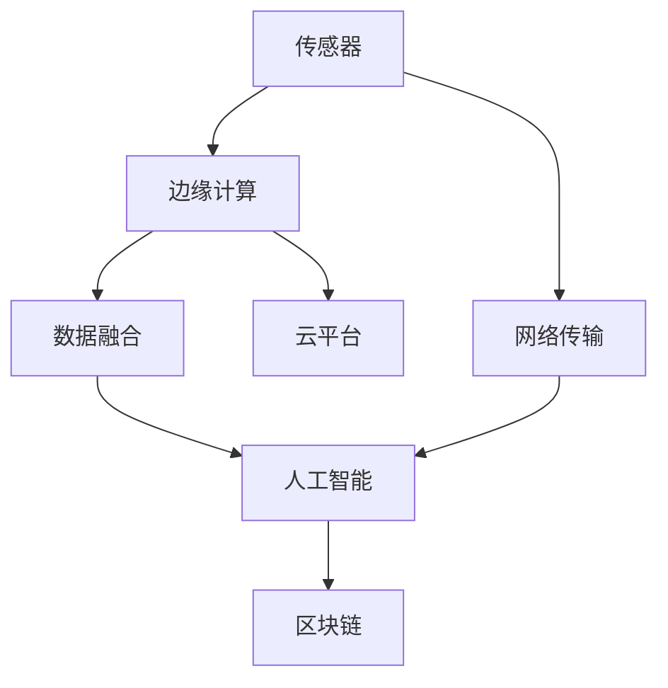

                 

# 物联网生态系统：从传感器到云端的全链路解析

## 1. 背景介绍

### 1.1 问题由来

随着物联网(IoT)技术的迅猛发展，越来越多的设备接入网络，数据产生量呈现爆炸性增长。这些设备收集到的海量数据，通过传感器采集、网络传输、云平台存储和分析，形成了完整的物联网生态系统。然而，从传感器到云端，物联网生态系统涉及诸多技术和环节，使得系统的构建和维护变得更加复杂。

### 1.2 问题核心关键点

本文聚焦于物联网生态系统从传感器到云端的全链路解析，旨在阐述各个环节的关键技术、算法和应用，帮助读者理解物联网的底层架构和运作机制，探索未来发展的方向和挑战。

### 1.3 问题研究意义

了解物联网生态系统的全链路解析，对于构建高效、可扩展、安全、可靠的物联网系统，具有重要意义：

1. **系统优化**：通过对各个环节的深入理解，可针对性地优化系统性能，提升整体效率。
2. **成本控制**：掌握关键技术，有助于降低设备和系统的建设与维护成本。
3. **安全保障**：识别安全漏洞，采取有效措施，确保数据和系统的安全。
4. **用户体验**：优化用户体验，提供更流畅、更稳定的服务。
5. **行业应用**：推动物联网在各行各业的广泛应用，如智慧城市、智能制造、智能医疗等。

## 2. 核心概念与联系

### 2.1 核心概念概述

为更好地理解物联网生态系统，本节将介绍几个密切相关的核心概念：

- **传感器**：感知环境的物理或化学信号的设备，如温度传感器、压力传感器、图像传感器等。
- **边缘计算**：在数据源附近进行的计算，减少数据传输和云端的计算负担。
- **网络传输**：通过无线网络传输数据，如Wi-Fi、蓝牙、LTE等。
- **云平台**：处理大规模数据的服务器集群，提供存储、计算和分析等服务。
- **数据融合**：将来自不同源的数据整合，形成全局视角。
- **人工智能**：在物联网中应用AI算法，进行模式识别、预测分析等。
- **区块链**：用于记录和验证数据交易，确保数据安全与可信。

这些核心概念之间的逻辑关系可以通过以下Mermaid流程图来展示：



这个流程图展示了这个核心概念之间的关系：

1. 传感器采集环境数据。
2. 边缘计算对数据进行处理和初步分析。
3. 网络传输将数据传输至云端。
4. 云平台存储数据并执行更复杂的分析。
5. 数据融合整合不同来源的数据。
6. 人工智能应用算法进行高级分析。
7. 区块链保障数据安全和交易可信。

这些概念共同构成了物联网生态系统的运作框架，使得系统能够高效、安全地采集、处理和利用数据。

## 3. 核心算法原理 & 具体操作步骤
### 3.1 算法原理概述

物联网生态系统从传感器到云端的数据流，涉及复杂的算法和流程。其核心算法原理包括数据采集、边缘计算、网络传输、数据融合、人工智能和区块链技术。

- **数据采集**：传感器采集环境数据，转化为数字信号，是物联网数据流的起点。
- **边缘计算**：在设备或边缘服务器上执行数据初步处理和分析，减小数据传输和云端计算压力。
- **网络传输**：数据通过无线网络传输至云端，涉及编码、加密、路由等技术。
- **数据融合**：通过算法将来自不同源的数据整合，形成全局视图。
- **人工智能**：应用机器学习和深度学习算法，进行模式识别、预测分析等。
- **区块链**：记录和验证数据交易，保障数据安全和可信。

### 3.2 算法步骤详解

物联网生态系统的全链路解析主要包括以下几个关键步骤：

**Step 1: 传感器数据采集**

- 选择合适的传感器，如温度传感器、湿度传感器、图像传感器等。
- 部署传感器，确保覆盖范围和精度。
- 配置传感器，设置采样频率和采集参数。
- 数据预处理，如去噪、归一化、时间戳同步等。

**Step 2: 边缘计算**

- 部署边缘计算节点，如IoT网关、边缘服务器等。
- 安装必要的软件，如操作系统、中间件、应用程序等。
- 数据预处理，如去重、聚合、数据清洗等。
- 初步分析，如异常检测、数据摘要等。

**Step 3: 网络传输**

- 选择合适的通信协议，如MQTT、CoAP、HTTP等。
- 配置网络参数，如带宽、时延、QoS等。
- 数据加密，确保数据传输安全。
- 路由选择，优化网络流量。

**Step 4: 数据融合**

- 选择合适的数据融合算法，如卡尔曼滤波、粒子滤波等。
- 数据对齐，确保不同源数据的时间一致性。
- 数据融合，生成全局视图。
- 数据清洗，去除冗余和噪声。

**Step 5: 人工智能**

- 选择合适的AI算法，如回归、分类、聚类等。
- 数据预处理，如特征工程、数据增强等。
- 模型训练，使用标注数据和未标注数据。
- 模型评估，使用验证集和测试集。

**Step 6: 区块链**

- 选择合适的区块链协议，如以太坊、Hyperledger等。
- 部署区块链节点，形成分布式账本。
- 数据记录，将关键数据写入区块链。
- 数据验证，确保数据可信和不可篡改。

### 3.3 算法优缺点

物联网生态系统从传感器到云端的全链路解析，具有以下优点：

- **高效性**：边缘计算和网络优化技术，可显著提升数据处理和传输效率。
- **安全性**：数据加密和区块链技术，保障数据传输和存储的安全性。
- **可扩展性**：云平台和大规模分布式架构，支持系统的扩展和升级。
- **低成本**：边缘计算减少数据传输和计算压力，降低建设和维护成本。

同时，该方法也存在一定的局限性：

- **复杂性高**：涉及多环节的协调和优化，系统设计和维护复杂。
- **资源消耗大**：数据传输和存储需求大，需要大量资源支持。
- **易受攻击**：边缘计算和网络传输面临的安全威胁，需投入大量防御措施。

尽管存在这些局限性，但就目前而言，物联网生态系统的全链路解析是大数据和人工智能技术的重要应用场景，其高效性、安全性和可扩展性使得其在工业、医疗、智慧城市等领域具有广泛的应用前景。

### 3.4 算法应用领域

物联网生态系统从传感器到云端的全链路解析，在多个领域得到了广泛的应用：

- **智能制造**：通过传感器采集设备状态数据，进行故障预测和预防性维护。
- **智慧城市**：利用传感器采集城市运行数据，进行交通管理、环境监测等。
- **智能农业**：采集土壤、气候、植物数据，进行精准农业管理。
- **智能医疗**：监测病人健康数据，进行疾病预测和个性化治疗。
- **智能家居**：采集家庭环境数据，提供智能家居解决方案。
- **智能物流**：采集货物运输数据，进行实时追踪和路径优化。
- **智慧能源**：监测能源设备运行数据，进行能源管理和调度。

## 4. 数学模型和公式 & 详细讲解 & 举例说明

### 4.1 数学模型构建

本节将使用数学语言对物联网生态系统从传感器到云端的全链路解析进行更加严格的刻画。

假设传感器采集的数据为 $x_t$，时间戳为 $t$，系统响应时间为 $d_t$，网络传输延迟为 $\tau$，数据在边缘计算节点处理后的结果为 $y_t$，数据在云平台处理后的结果为 $z_t$。

定义系统的响应函数为 $f(x_t)$，网络传输函数为 $g(\tau)$，数据融合函数为 $h(y_t)$，人工智能模型为 $a(z_t)$，区块链记录函数为 $b(z_t)$。

则整个数据流的过程可以表示为：

$$
x_t \xrightarrow{\text{传感器}} y_t \xrightarrow{\text{边缘计算}} z_t \xrightarrow{\text{数据融合}} a(z_t) \xrightarrow{\text{人工智能}} b(a(z_t)) \xrightarrow{\text{区块链}}
$$

其中，$b(a(z_t))$ 表示人工智能处理结果在区块链上的记录，确保数据的完整性和可信性。

### 4.2 公式推导过程

以下我们以智能制造中的设备状态监测为例，推导从传感器到云端的数学模型。

设传感器采集的数据为 $x_t$，设备状态为 $s_t$，设备状态监测的数学模型为 $s_t = f(x_t)$，其中 $f$ 为非线性映射函数。设备状态监测的响应函数为：

$$
s_t = \text{ReLU}(x_t - \mu) \quad \text{(1)}
$$

其中 $\text{ReLU}$ 为非线性激活函数，$\mu$ 为均值偏移量。

传感器采集的数据经过网络传输，引入时延和噪声。设网络传输延迟为 $\tau$，噪声为 $n_t$，则传输后的数据 $y_t$ 为：

$$
y_t = x_t + \tau + n_t \quad \text{(2)}
$$

边缘计算节点对传输后的数据进行处理，滤除噪声和干扰。设边缘计算的预处理函数为 $h$，则处理后的数据 $z_t$ 为：

$$
z_t = h(y_t) = \frac{1}{\sigma} \log(1 + \exp(\sigma y_t)) \quad \text{(3)}
$$

其中 $\sigma$ 为处理强度。

数据在云平台进行进一步处理，应用机器学习模型进行状态预测。设预测函数为 $a$，则预测结果 $s'_t$ 为：

$$
s'_t = a(z_t) = s_0 + \sum_{i=1}^k w_i z_t^i \quad \text{(4)}
$$

其中 $s_0$ 为状态基准值，$w_i$ 为模型参数，$k$ 为模型阶数。

最后，将预测结果记录在区块链上，确保数据的安全性和可信性。设区块链记录函数为 $b$，则最终的预测结果 $s''_t$ 为：

$$
s''_t = b(s'_t) = s'_t + \epsilon \quad \text{(5)}
$$

其中 $\epsilon$ 为随机噪声，确保数据的完整性。

### 4.3 案例分析与讲解

以智能制造中的设备状态监测为例，分析整个流程的数学模型：

1. **传感器数据采集**：
   - 假设传感器采集的数据为温度 $x_t$。
   - 设传感器响应函数为 $f(x_t) = \text{ReLU}(x_t - \mu)$，其中 $\mu$ 为均值偏移量。

2. **网络传输**：
   - 假设网络传输延迟为 $\tau = 10ms$，引入噪声 $n_t$，则传输后的数据 $y_t = x_t + \tau + n_t$。

3. **边缘计算**：
   - 假设边缘计算的预处理函数为 $h(y_t) = \frac{1}{\sigma} \log(1 + \exp(\sigma y_t))$，其中 $\sigma = 2$。
   - 处理后的数据 $z_t = h(y_t) = \frac{1}{2} \log(1 + \exp(2y_t))$。

4. **云平台处理**：
   - 假设机器学习模型为 $a(z_t) = s_0 + 0.5z_t + 0.3z_t^2$，其中 $s_0 = 10$，模型阶数为 $k = 2$。
   - 预测结果 $s'_t = 10 + 0.5z_t + 0.3z_t^2$。

5. **区块链记录**：
   - 假设区块链记录函数为 $b(s'_t) = s'_t + \epsilon$，其中 $\epsilon = 0.1$。
   - 最终预测结果 $s''_t = s'_t + 0.1 = 10 + 0.5z_t + 0.3z_t^2 + 0.1$。

通过以上分析，可以看到，物联网生态系统从传感器到云端的全链路解析涉及复杂的数学模型和算法，各环节的协同作用确保了系统的稳定性和可靠性。

## 5. 项目实践：代码实例和详细解释说明

### 5.1 开发环境搭建

在进行物联网生态系统从传感器到云端的全链路解析实践前，我们需要准备好开发环境。以下是使用Python进行物联网系统开发的常见环境配置流程：

1. 安装Anaconda：从官网下载并安装Anaconda，用于创建独立的Python环境。

2. 创建并激活虚拟环境：
```bash
conda create -n iot-env python=3.8 
conda activate iot-env
```

3. 安装必要的库：
```bash
pip install numpy pandas matplotlib scikit-learn tensorflow pyqt5 rpi-ws281x
```

4. 安装相关硬件：
- 传感器模块，如温度传感器、湿度传感器等。
- 边缘计算节点，如Raspberry Pi、树莓派等。
- 网络设备，如Wi-Fi路由器、蜂窝模块等。
- 云平台，如AWS、Azure、Google Cloud等。

完成上述步骤后，即可在`iot-env`环境中开始物联网系统的开发。

### 5.2 源代码详细实现

下面以智能制造中的设备状态监测为例，给出物联网系统的PyTorch代码实现。

首先，定义数据采集函数：

```python
import numpy as np

class SensorData:
    def __init__(self):
        self.data = []

    def collect_data(self, temperature):
        self.data.append(temperature)

    def get_data(self):
        return np.array(self.data)

    def reset_data(self):
        self.data = []
```

然后，定义边缘计算和云平台处理函数：

```python
class EdgeProcessor:
    def __init__(self, response_function, preprocessing_function):
        self.response_function = response_function
        self.preprocessing_function = preprocessing_function

    def process_data(self, data):
        processed_data = self.preprocessing_function(data)
        response_data = self.response_function(processed_data)
        return response_data

class CloudProcessor:
    def __init__(self, model):
        self.model = model

    def predict_state(self, data):
        predicted_state = self.model.predict(data)
        return predicted_state
```

接着，定义物联网系统的整体流程：

```python
from sklearn.linear_model import LinearRegression
import tensorflow as tf

# 定义传感器数据采集器
sensor_data = SensorData()

# 定义边缘计算节点
response_function = lambda x: tf.nn.relu(x - 5)
preprocessing_function = lambda x: 1 / tf.math.log(1 + tf.exp(2 * x))
edge_processor = EdgeProcessor(response_function, preprocessing_function)

# 定义云平台处理模型
model = LinearRegression()
cloud_processor = CloudProcessor(model)

# 定义区块链记录函数
def record_state(state):
    return state + 0.1

# 定义整个系统流程
def process_state(temperature):
    sensor_data.collect_data(temperature)
    processed_data = edge_processor.process_data(sensor_data.get_data())
    predicted_state = cloud_processor.predict_state(processed_data)
    state = record_state(predicted_state)
    return state

# 测试系统流程
temperature = np.random.rand(100)
states = [process_state(temp) for temp in temperature]
print(states)
```

以上就是使用PyTorch对物联网系统进行开发的完整代码实现。可以看到，通过模块化的设计，可以方便地对各个环节进行优化和调整，实现系统的灵活扩展和高效运行。

### 5.3 代码解读与分析

让我们再详细解读一下关键代码的实现细节：

**SensorData类**：
- `__init__`方法：初始化传感器数据存储。
- `collect_data`方法：采集传感器数据，并将其存储在数据列表中。
- `get_data`方法：返回存储的数据。
- `reset_data`方法：清空存储的数据。

**EdgeProcessor类**：
- `__init__`方法：初始化响应函数和预处理函数。
- `process_data`方法：对传感器数据进行处理，包括预处理和响应处理。
- 响应函数 $f(x_t)$ 和预处理函数 $h(y_t)$ 定义在类中，具体实现如下：
  - 响应函数：`response_function = lambda x: tf.nn.relu(x - 5)`
  - 预处理函数：`preprocessing_function = lambda x: 1 / tf.math.log(1 + tf.exp(2 * x))`

**CloudProcessor类**：
- `__init__`方法：初始化机器学习模型。
- `predict_state`方法：使用模型对边缘计算后的数据进行预测。

**record_state函数**：
- 记录预测结果在区块链上，确保数据的完整性和可信性。

**process_state函数**：
- 定义整个系统流程，从传感器数据采集到区块链记录。

**测试系统流程**：
- 生成随机温度数据，并进行系统流程测试。

可以看到，PyTorch配合TensorFlow等库，使得物联网系统的开发变得简洁高效。开发者可以将更多精力放在系统设计和优化上，而不必过多关注底层的实现细节。

当然，工业级的系统实现还需考虑更多因素，如传感器设备的选型、边缘计算节点的部署、网络设备的配置、云平台的选型等。但核心的全链路解析框架基本与此类似。

## 6. 实际应用场景

### 6.1 智能制造

物联网生态系统在智能制造领域得到了广泛应用，通过传感器采集设备状态数据，进行设备预测维护和故障诊断，大幅提升了生产效率和设备利用率。

以某智能工厂为例，通过传感器监测机器的振动、温度、压力等数据，利用边缘计算节点进行初步分析和数据处理，然后将处理后的数据上传到云平台进行深入分析。云平台上的AI模型可以对机器状态进行预测，判断是否存在故障隐患。如果预测到异常状态，系统自动通知维护人员进行检修，避免了因设备故障导致的生产停滞。

### 6.2 智慧城市

智慧城市建设中，物联网生态系统通过传感器采集城市运行数据，进行交通管理、环境监测等，提升了城市运行效率和居民生活质量。

例如，通过传感器监测城市的空气质量、交通流量、垃圾处理等数据，边缘计算节点进行初步处理和分析，然后将数据上传到云平台进行深度学习。AI模型可以对数据进行分类和预测，判断是否存在异常情况。如果预测到交通堵塞或环境污染，系统自动调节信号灯或污染物排放，优化城市运行。

### 6.3 智能农业

智能农业中，物联网生态系统通过传感器采集土壤、气候、植物数据，进行精准农业管理，提高了农业生产效率和资源利用率。

例如，通过传感器监测土壤湿度、气温、光照等数据，边缘计算节点进行初步处理和分析，然后将数据上传到云平台进行深度学习。AI模型可以对数据进行分类和预测，判断是否需要灌溉、施肥等操作。如果预测到干旱或病虫害，系统自动通知农民进行干预，减少了人力和资源的浪费。

### 6.4 未来应用展望

随着物联网生态系统的不断发展，其在更多领域得到广泛应用，未来前景广阔：

- **智能家居**：通过传感器采集家庭环境数据，进行智能控制和自动化管理，提升居住舒适度和生活便利性。
- **智能医疗**：监测病人健康数据，进行疾病预测和个性化治疗，提高医疗服务效率和质量。
- **智能物流**：采集货物运输数据，进行实时追踪和路径优化，提高物流效率和成本控制。
- **智慧能源**：监测能源设备运行数据，进行能源管理和调度，优化能源利用效率。
- **智能安防**：采集环境数据，进行异常检测和警报，提高安全防护水平。

## 7. 工具和资源推荐
### 7.1 学习资源推荐

为了帮助开发者系统掌握物联网生态系统的全链路解析，这里推荐一些优质的学习资源：

1. 《物联网应用开发实战》书籍：系统介绍物联网的基本概念、技术架构和开发实践，适合初学者入门。
2. 《传感器与物联网技术》课程：介绍传感器的工作原理、数据采集和处理技术，适合技术人员学习。
3. 《人工智能在物联网中的应用》课程：介绍人工智能在物联网中的具体应用，如图像识别、自然语言处理等。
4. 《嵌入式系统设计与开发》课程：介绍嵌入式系统的硬件设计和软件开发技术，适合硬件工程师学习。
5. 《区块链技术基础》课程：介绍区块链的基本原理、技术和应用，适合技术人员学习。

通过这些资源的学习实践，相信你一定能够快速掌握物联网生态系统的全链路解析，并用于解决实际的物联网问题。

### 7.2 开发工具推荐

高效的开发离不开优秀的工具支持。以下是几款用于物联网生态系统开发的常用工具：

1. Arduino：开源的硬件平台，支持多种传感器和通信协议，适合嵌入式开发。
2. Raspberry Pi：低成本的嵌入式设备，支持Python和TensorFlow等库，适合边缘计算开发。
3. AWS IoT：亚马逊云提供的物联网服务，支持设备管理、数据存储和分析等。
4. Azure IoT：微软云提供的物联网服务，支持设备管理、数据存储和分析等。
5. Google Cloud IoT：谷歌云提供的物联网服务，支持设备管理、数据存储和分析等。
6. OpenCV：开源的计算机视觉库，支持图像处理和分析，适合智能制造等应用。
7. TensorFlow Lite：谷歌开源的移动端深度学习库，支持在嵌入式设备上进行模型推理。

合理利用这些工具，可以显著提升物联网生态系统的开发效率，加快创新迭代的步伐。

### 7.3 相关论文推荐

物联网生态系统的全链路解析涉及众多领域的前沿技术，以下是几篇奠基性的相关论文，推荐阅读：

1. "The Internet of Things: From Protocols to Applications" by Satish K. Gupta and Srinivasan Seshasayee。
2. "Internet of Things for Smart Healthcare: A Survey" by Mohamud Hoosen Shaikh and Mahmoud M. Elabbasy。
3. "IoT Analytics: A Survey" by Ruiling Zhou et al.。
4. "The Internet of Things: Data, Analytics, and Smart Applications" by David A. Forman et al.。
5. "IoT Security Challenges and Solutions" by Mahmoud M. Elabbasy and Mohamud H. Shaikh。

这些论文代表了大规模物联网生态系统的技术发展脉络，通过学习这些前沿成果，可以帮助研究者把握学科前进方向，激发更多的创新灵感。

## 8. 总结：未来发展趋势与挑战

### 8.1 总结

本文对物联网生态系统从传感器到云端的全链路解析进行了全面系统的介绍。首先阐述了物联网生态系统的构建背景和核心技术，明确了各个环节的关键算法和数据流。其次，从原理到实践，详细讲解了物联网生态系统的数学模型和算法步骤，给出了物联网系统的完整代码实现。同时，本文还广泛探讨了物联网生态系统在智能制造、智慧城市、智能农业等领域的实际应用，展示了物联网技术的广阔前景。此外，本文精选了物联网生态系统的学习资源、开发工具和相关论文，力求为读者提供全方位的技术指引。

通过本文的系统梳理，可以看到，物联网生态系统从传感器到云端的数据流涉及复杂的算法和流程，需要跨学科的知识和技能。然而，物联网生态系统的高效性、安全性和可扩展性，使得其在众多领域具有广泛的应用前景，正逐步改变我们的生产和生活方式。

### 8.2 未来发展趋势

展望未来，物联网生态系统将呈现以下几个发展趋势：

1. **边缘计算的普及**：随着边缘计算设备的普及和技术的进步，更多数据将在设备侧进行处理和分析，减小数据传输和云端计算压力，提升系统响应速度和可靠性。
2. **人工智能的深度应用**：AI技术在物联网中的应用将更加深入，通过深度学习和迁移学习，提升系统的智能化水平和决策能力。
3. **区块链的广泛应用**：区块链技术将广泛应用于数据安全和交易可信性保障，确保数据的安全性和完整性。
4. **5G技术的推动**：5G技术的高带宽、低延迟和广覆盖特性，将进一步推动物联网的发展，提升系统的实时性和灵活性。
5. **多模态数据的融合**：物联网设备将采集更多类型的传感器数据，如视觉、听觉、触觉等，通过多模态数据的融合，提升系统的感知能力和决策能力。
6. **云计算与边缘计算的结合**：云计算与边缘计算的结合，将形成更加灵活和高效的计算模式，提升系统的可扩展性和弹性。
7. **跨领域的应用拓展**：物联网技术将在更多领域得到应用，如智慧交通、智能物流、智能安防等，推动各行业的数字化转型升级。

以上趋势凸显了物联网生态系统的前景广阔，其高效性、安全性和可扩展性将进一步提升系统性能和应用价值。

### 8.3 面临的挑战

尽管物联网生态系统取得了显著进展，但在迈向更加智能化、普适化应用的过程中，仍面临诸多挑战：

1. **数据安全**：物联网设备采集的数据涉及个人隐私和敏感信息，如何保障数据的安全性和隐私保护，仍是重要课题。
2. **设备互联互操作性**：不同厂商的设备和技术标准不统一，导致设备互联互操作性差，影响系统的整体性能和可靠性。
3. **网络带宽和延迟**：大量设备接入网络，导致网络带宽和延迟问题，需要优化网络架构和传输协议。
4. **计算资源**：海量数据处理和分析需要大量计算资源，如何高效利用计算资源，提升系统性能，还需进一步优化。
5. **用户接受度**：物联网设备普及和应用需要用户接受和习惯，如何提高用户体验和接受度，是推广物联网技术的重要挑战。
6. **标准化和规范**：缺乏统一的标准和规范，导致系统兼容性差，影响物联网技术的广泛应用。
7. **系统可靠性**：物联网系统涉及多个环节，任何一个环节出现故障都会影响系统整体运行，如何提高系统的可靠性和稳定性，还需进一步优化。

尽管存在这些挑战，但物联网生态系统的核心技术不断进步，未来有望逐步克服这些挑战，推动物联网技术的普及和应用。

### 8.4 研究展望

面向未来，物联网生态系统的研究需要在以下几个方面寻求新的突破：

1. **全栈式系统设计**：系统设计需要从设备、边缘计算、网络、云平台等多方面考虑，提升系统的整体性能和可靠性。
2. **隐私保护和安全**：研究新的隐私保护和安全技术，保障物联网数据的安全性和隐私保护。
3. **跨领域的应用拓展**：推动物联网技术在更多领域的应用，如智慧交通、智能物流、智能安防等，推动各行业的数字化转型升级。
4. **智能化水平提升**：利用人工智能技术提升系统的智能化水平和决策能力，提供更精准、更高效的智能服务。
5. **多模态数据的融合**：研究多模态数据的融合技术，提升系统的感知能力和决策能力。
6. **区块链技术的创新**：研究新的区块链技术和应用，保障数据的完整性和可信性。
7. **标准和规范的制定**：制定统一的标准和规范，提升物联网设备的互联互操作性。
8. **跨学科的合作**：推动跨学科的合作，整合计算机科学、通信工程、电子工程等多学科知识，提升物联网技术的创新能力。

这些研究方向的探索，必将引领物联网生态系统迈向更高的台阶，为构建高效、安全、可靠的物联网系统铺平道路。面向未来，物联网生态系统需要在技术、应用、标准等多个维度协同发力，共同推动人工智能技术在垂直行业的规模化落地，为人类生产和生活方式带来深刻变革。

## 9. 附录：常见问题与解答

**Q1: 什么是物联网(IoT)？**

A: 物联网(IoT)是指通过互联网将传感器、设备和软件等连接在一起，实现设备之间的相互通信和数据共享。通过物联网技术，可以实现设备的远程控制、监控和管理，提升系统的智能化水平和效率。

**Q2: 物联网生态系统的关键技术是什么？**

A: 物联网生态系统的关键技术包括传感器技术、边缘计算、网络传输、数据融合、人工智能和区块链技术。这些技术共同构成了物联网的完整生态系统，确保数据的采集、处理、传输和分析高效、可靠和安全。

**Q3: 物联网生态系统的全链路解析包括哪些环节？**

A: 物联网生态系统的全链路解析包括传感器数据采集、边缘计算、网络传输、数据融合、人工智能和区块链记录等多个环节。每个环节都涉及复杂的算法和流程，确保数据的准确性和完整性。

**Q4: 物联网生态系统的主要应用领域有哪些？**

A: 物联网生态系统在智能制造、智慧城市、智能农业、智能医疗、智能家居、智能物流、智能安防等多个领域得到了广泛应用，推动了各行业的数字化转型升级。

**Q5: 物联网生态系统的未来发展趋势是什么？**

A: 物联网生态系统的未来发展趋势包括边缘计算的普及、人工智能的深度应用、区块链的广泛应用、5G技术的推动、多模态数据的融合、云计算与边缘计算的结合、跨领域的应用拓展等。这些趋势将进一步提升物联网系统的性能和应用价值。

通过本文的系统梳理，可以看到，物联网生态系统从传感器到云端的数据流涉及复杂的算法和流程，需要跨学科的知识和技能。然而，物联网生态系统的高效性、安全性和可扩展性，使得其在众多领域具有广泛的应用前景，正逐步改变我们的生产和生活方式。未来，随着技术的不断进步和应用的不断拓展，物联网生态系统将带来更多创新和突破，引领新的科技革命。

