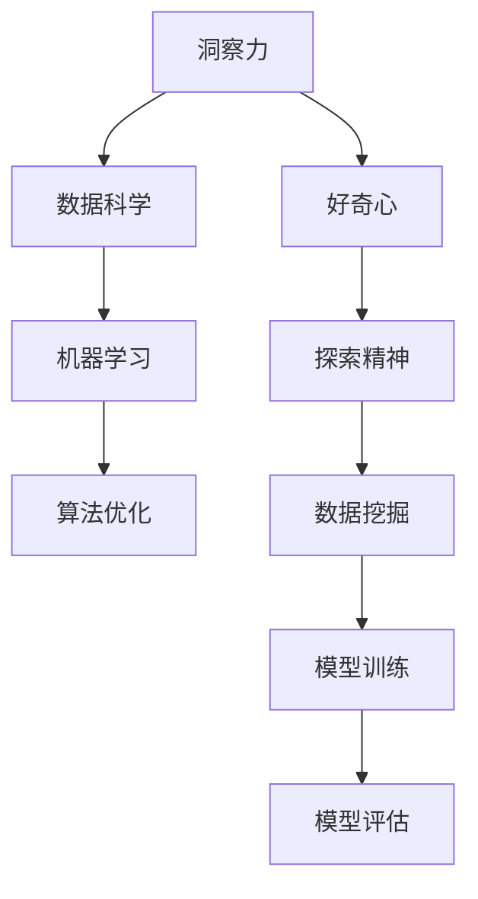

                 

# 理解洞察力的培养：鼓励好奇心和探索精神

> 关键词：洞察力,好奇心,探索精神,机器学习,数据科学,决策分析,算法优化

## 1. 背景介绍

### 1.1 问题由来
在当今这个信息爆炸的时代，如何从海量数据中提取有价值的洞察力，成为了企业和组织需要面对的重要挑战。传统的分析方法往往基于固定模式和经验，难以应对复杂多变的现实世界。而通过算法驱动的决策系统，能够更灵活、更准确地从数据中挖掘出有用的信息。

在这一背景下，机器学习、数据科学等新兴技术应运而生，成为解决大数据问题的重要手段。然而，技术仅仅是手段，其核心驱动力在于人的好奇心和探索精神。本文旨在探讨如何培养和发展这种重要的能力，让数据科学和机器学习的应用更深入、更广泛。

### 1.2 问题核心关键点
理解洞察力的培养，需要从以下几个方面入手：
1. 理解数据科学和机器学习的基本原理。
2. 认识好奇心和探索精神在数据挖掘中的重要性。
3. 探索如何通过教育、实践和工具，培养和发展这些能力。
4. 了解这些能力在实际应用中的具体体现。

通过深入分析这些核心点，我们将有助于构建一个既充满好奇心和探索精神，又能够有效运用数据的洞察力系统。

### 1.3 问题研究意义
培养和发展好奇心和探索精神，对于推动数据科学和机器学习技术的不断进步具有重要意义：
1. 提升数据挖掘的创新能力。好奇心驱动的探索，可以带来新的数据应用场景和模型设计。
2. 提高数据科学团队的协作效率。团队成员的好奇心和探索精神，可以促进知识的交流和技术的融合。
3. 增强企业的决策能力。通过深入理解数据背后的逻辑和规律，企业可以做出更加科学、精准的决策。
4. 加速技术的落地应用。好奇心和探索精神能够推动新技术、新方法的应用，加速技术的产业化进程。

## 2. 核心概念与联系

### 2.1 核心概念概述

为了更好地理解洞察力的培养，本节将介绍几个关键的概念及其相互联系：

- **洞察力(Insight)**：指从大量数据中提取有价值的知识和洞见，以指导决策和行动。
- **好奇心(Curiosity)**：指对未知事物的好奇心和探索欲望，驱动着数据挖掘和分析的深入进行。
- **探索精神(Exploration)**：指在数据和模型空间中不断尝试、测试和验证，以发现最优的解决方案。
- **机器学习(Machine Learning)**：通过算法驱动的模型，自动从数据中学习规律和关系，做出预测和决策。
- **数据科学(Data Science)**：涉及数据收集、清洗、分析和可视化的全流程，旨在从数据中提取有价值的洞察力。
- **算法优化(Algorithm Optimization)**：通过调整算法参数和结构，提升模型性能和泛化能力。

这些核心概念之间的逻辑关系可以通过以下Mermaid流程图来展示：



这个流程图展示了一系列概念之间的联系：
- 洞察力由数据科学和机器学习共同驱动。
- 数据科学依赖于数据挖掘和模型训练。
- 机器学习涉及算法优化。
- 好奇心和探索精神是数据挖掘的动力。

## 3. 核心算法原理 & 具体操作步骤
### 3.1 算法原理概述

培养洞察力的过程，本质上是一个从数据到模型再到洞察的迭代过程。其核心算法原理可以概括为以下几个步骤：

1. **数据采集与清洗**：收集高质量的数据，并对数据进行清洗和预处理。
2. **模型训练**：选择合适的模型，并通过训练数据对其进行参数优化。
3. **模型评估**：使用验证数据评估模型性能，选择最优模型。
4. **洞察提取**：利用模型对新数据进行预测，并从预测结果中提取洞察力。

这一过程的核心在于数据的质量和模型的选择。高质量的数据和适当的算法，能够最大程度地提升洞察力挖掘的效率和效果。

### 3.2 算法步骤详解

以下将详细讲解上述核心算法步骤的具体操作流程：

**Step 1: 数据采集与清洗**

数据采集是洞察力培养的第一步，也是最为关键的一步。高质量的数据是进行有效分析的基础。

- **数据源选择**：选择能够代表问题域的数据源。例如，对于金融数据分析，可以从银行、证券、保险等行业获取相关数据。
- **数据收集工具**：使用ETL工具（如Apache Nifi、Talend等）进行数据的收集和整合。
- **数据清洗**：通过ETL工具进行数据清洗，去除重复、缺失、异常值等无用数据，提高数据质量。

**Step 2: 模型训练**

模型训练是培养洞察力的核心步骤，需要选择合适的算法和模型。

- **算法选择**：根据数据类型和问题类型选择合适的算法，如回归、分类、聚类等。
- **模型选择**：选择适合数据分布和问题的模型，如线性回归、决策树、支持向量机等。
- **参数优化**：使用交叉验证等技术，调整模型参数，以获得最优的模型性能。
- **模型评估**：使用训练集和验证集对模型进行评估，选择最优的模型。

**Step 3: 模型评估**

模型评估是确保洞察力提取准确性的重要步骤。

- **评估指标**：选择适当的评估指标，如准确率、召回率、F1分数等，评估模型的性能。
- **模型选择**：选择性能最优的模型，用于后续的洞察提取。
- **模型验证**：使用测试集验证模型的泛化能力，确保模型的稳定性。

**Step 4: 洞察提取**

洞察提取是洞察力培养的最终目标，需要将模型应用于新数据中，提取有价值的洞见。

- **新数据输入**：将新数据输入到模型中进行预测。
- **结果分析**：分析模型的预测结果，提取有价值的洞见和规律。
- **洞见应用**：将洞见应用到实际决策和行动中，以优化业务流程和提升效率。

### 3.3 算法优缺点

培养洞察力的算法具有以下优点：
1. **高效性**：通过算法驱动的模型，可以快速从数据中提取洞察力。
2. **可解释性**：模型通常具备可解释性，便于理解和调试。
3. **可复用性**：模型可以用于多种数据集和问题，具有广泛的应用前景。

同时，该算法也存在一些局限性：
1. **数据依赖**：模型效果依赖于数据的质量和数量，数据不足可能导致洞察力提取不准确。
2. **算法复杂性**：一些高级算法可能需要较多的计算资源和时间，增加开发成本。
3. **模型鲁棒性**：模型可能对噪声数据和异常值敏感，导致性能下降。

尽管存在这些局限性，但总体而言，算法驱动的洞察力培养方法仍然是数据科学和机器学习领域的主流。未来相关研究将更多地关注如何降低算法对数据的依赖，提高模型的泛化能力，同时兼顾可解释性和鲁棒性。

### 3.4 算法应用领域

培养洞察力的算法在多个领域中得到了广泛应用，例如：

- **金融分析**：通过模型分析股票价格、市场趋势等数据，提取有价值的投资洞见。
- **健康医疗**：通过模型分析病历数据、患者行为等数据，提取疾病预测和诊断的洞见。
- **市场营销**：通过模型分析消费者数据、市场趋势等数据，提取消费者行为和市场变化的洞见。
- **智能制造**：通过模型分析生产数据、设备状态等数据，提取生产优化和设备维护的洞见。
- **交通管理**：通过模型分析交通流量、车辆位置等数据，提取交通流量优化和事故预防的洞见。

除了上述这些典型应用外，培养洞察力的算法还在更多场景中得到了创新性的应用，如供应链管理、智能家居、智能物流等，为各行各业带来了新的价值。

## 4. 数学模型和公式 & 详细讲解  
### 4.1 数学模型构建

本节将使用数学语言对培养洞察力的过程进行更加严格的刻画。

假设我们的数据集为 $D=\{(x_i,y_i)\}_{i=1}^N, x_i \in \mathcal{X}, y_i \in \mathcal{Y}$，其中 $\mathcal{X}$ 为输入空间，$\mathcal{Y}$ 为输出空间。

定义模型的损失函数为 $\ell(h(x),y)$，其中 $h(x)$ 为模型在输入 $x$ 上的预测结果。在数据集 $D$ 上的经验风险为：

$$
\mathcal{L}(h) = \frac{1}{N} \sum_{i=1}^N \ell(h(x_i),y_i)
$$

在模型训练过程中，我们的目标是最小化经验风险，即：

$$
h^* = \mathop{\arg\min}_{h} \mathcal{L}(h)
$$

在实践中，我们通常使用梯度下降等优化算法来近似求解上述最优化问题。设 $\eta$ 为学习率，$h^*(x)$ 为模型在输入 $x$ 上的预测结果，则模型的更新公式为：

$$
h(x) \leftarrow h(x) - \eta \nabla_{h(x)}\mathcal{L}(h(x))
$$

其中 $\nabla_{h(x)}\mathcal{L}(h(x))$ 为损失函数对模型 $h(x)$ 的梯度，可通过自动微分技术高效计算。

### 4.2 公式推导过程

以下我们以线性回归模型为例，推导损失函数及其梯度的计算公式。

假设模型 $h(x)=\theta^T x$，其中 $\theta$ 为模型参数。则损失函数为：

$$
\ell(h(x),y) = (h(x)-y)^2
$$

将其代入经验风险公式，得：

$$
\mathcal{L}(\theta) = \frac{1}{N} \sum_{i=1}^N (h(x_i)-y_i)^2
$$

对 $\theta$ 求导，得：

$$
\nabla_{\theta}\mathcal{L}(\theta) = \frac{2}{N} \sum_{i=1}^N (h(x_i)-y_i) x_i
$$

在得到损失函数的梯度后，即可带入参数更新公式，完成模型的迭代优化。重复上述过程直至收敛，最终得到适应数据的模型参数 $\theta^*$。

## 5. 项目实践：代码实例和详细解释说明
### 5.1 开发环境搭建

在进行数据科学和机器学习实践前，我们需要准备好开发环境。以下是使用Python进行Scikit-learn开发的典型环境配置流程：

1. 安装Anaconda：从官网下载并安装Anaconda，用于创建独立的Python环境。

2. 创建并激活虚拟环境：
```bash
conda create -n py3env python=3.8 
conda activate py3env
```

3. 安装必要的库：
```bash
conda install numpy scipy scikit-learn matplotlib seaborn
pip install pandas jupyter notebook
```

完成上述步骤后，即可在`py3env`环境中开始数据科学和机器学习的实践。

### 5.2 源代码详细实现

下面我们以线性回归模型为例，给出使用Scikit-learn库进行数据分析和模型训练的Python代码实现。

首先，定义数据集：

```python
import numpy as np
from sklearn.datasets import load_boston
from sklearn.model_selection import train_test_split

boston = load_boston()
X, y = boston.data, boston.target
X_train, X_test, y_train, y_test = train_test_split(X, y, test_size=0.2, random_state=42)
```

然后，定义线性回归模型并进行训练：

```python
from sklearn.linear_model import LinearRegression
from sklearn.metrics import mean_squared_error

model = LinearRegression()
model.fit(X_train, y_train)
y_pred = model.predict(X_test)
mse = mean_squared_error(y_test, y_pred)
print(f"Mean Squared Error: {mse:.2f}")
```

最后，分析模型结果并进行可视化：

```python
import matplotlib.pyplot as plt

plt.scatter(X_test, y_test, color='black')
plt.plot(X_test, y_pred, color='red', linewidth=2)
plt.xlabel('Test Features')
plt.ylabel('Test Target')
plt.title('Linear Regression Prediction')
plt.show()
```

以上就是使用Scikit-learn进行线性回归模型训练的完整代码实现。可以看到，Scikit-learn库提供了丰富的数据集和算法，使得数据分析和模型训练变得简洁高效。

### 5.3 代码解读与分析

让我们再详细解读一下关键代码的实现细节：

**数据集定义**：
- `load_boston`函数：从Scikit-learn库加载波士顿房价数据集。
- `train_test_split`函数：将数据集划分为训练集和测试集。

**模型定义与训练**：
- `LinearRegression`类：定义线性回归模型。
- `fit`方法：使用训练集进行模型训练。
- `predict`方法：使用训练好的模型对测试集进行预测。
- `mean_squared_error`函数：计算预测值与真实值之间的均方误差。

**可视化分析**：
- `matplotlib`库：绘制散点和拟合线，展示模型的预测效果。

可以看到，Scikit-learn库的使用使得数据分析和模型训练变得非常简单。开发者可以快速上手，进行模型实验和优化。

当然，工业级的系统实现还需考虑更多因素，如模型保存和部署、超参数搜索、特征工程等。但核心的算法实现基本与此类似。

## 6. 实际应用场景
### 6.1 金融分析

在金融领域，数据科学家可以通过模型分析大量的金融数据，提取有价值的洞察力。

**案例分析**：
- **股票价格预测**：通过模型分析历史股价和相关因素（如公司财务、行业趋势等），预测未来股价变化趋势。
- **市场风险评估**：通过模型分析市场数据，评估不同资产组合的风险水平，制定风险管理策略。
- **信用风险评估**：通过模型分析贷款申请人的财务数据，评估其信用风险，优化贷款审批流程。

通过培养好奇心和探索精神，金融分析师能够深入挖掘数据背后的规律，提升风险管理能力和投资决策水平。

### 6.2 健康医疗

在健康医疗领域，数据科学家可以通过模型分析大量的医疗数据，提取有价值的洞察力。

**案例分析**：
- **疾病预测与诊断**：通过模型分析患者的历史病历数据，预测患病风险，提供个性化的诊断建议。
- **药物研发**：通过模型分析药物实验数据，评估药物疗效和副作用，优化药物设计过程。
- **患者行为分析**：通过模型分析患者的行为数据，识别出高风险群体，优化健康干预策略。

通过培养好奇心和探索精神，医疗数据科学家能够深入挖掘数据背后的规律，提升疾病预测和诊断的准确性，加速药物研发进程。

### 6.3 市场营销

在市场营销领域，数据科学家可以通过模型分析大量的消费者数据，提取有价值的洞察力。

**案例分析**：
- **消费者行为分析**：通过模型分析消费者的购买历史和行为数据，识别出高价值客户群体，优化营销策略。
- **市场趋势预测**：通过模型分析市场数据，预测市场趋势，制定产品开发和推广计划。
- **品牌价值评估**：通过模型分析品牌相关数据，评估品牌价值，优化品牌管理策略。

通过培养好奇心和探索精神，市场营销数据科学家能够深入挖掘数据背后的规律，提升品牌价值和市场竞争力。

### 6.4 未来应用展望

随着数据科学和机器学习技术的不断进步，培养洞察力的应用场景将不断扩展，为各行各业带来新的变革和机遇。

在智慧城市治理中，数据科学家可以通过模型分析大量的城市数据，提取有价值的洞察力。例如，通过模型分析交通流量数据，优化交通信号灯设置，减少交通拥堵。

在智能制造中，数据科学家可以通过模型分析生产数据，提取有价值的洞察力。例如，通过模型分析设备运行数据，预测设备故障，优化生产流程。

在智能家居中，数据科学家可以通过模型分析用户行为数据，提取有价值的洞察力。例如，通过模型分析用户的生活习惯，提供个性化的家居推荐。

除了上述这些典型应用外，培养洞察力的算法将在更多场景中得到应用，为各行各业带来新的价值。相信随着技术的日益成熟，数据科学和机器学习的应用将更加广泛，让数据更好地服务于社会和经济。

## 7. 工具和资源推荐
### 7.1 学习资源推荐

为了帮助开发者系统掌握数据科学和机器学习的基本原理，这里推荐一些优质的学习资源：

1. 《Python数据科学手册》：全面介绍了Python在数据科学中的应用，包括数据处理、模型训练、数据可视化等。
2. 《机器学习实战》：从基础概念到实际应用，详细讲解了机器学习模型的搭建和优化。
3. 《数据科学实战》：结合真实案例，深入浅出地讲解了数据科学在各行各业中的应用。
4. 《深度学习入门》：介绍了深度学习的基础知识和技术，并结合实际项目进行讲解。
5. 《数据科学实战》：通过Python代码实现数据科学项目，实战性强。

通过对这些资源的学习实践，相信你一定能够快速掌握数据科学和机器学习的基本原理，并用于解决实际问题。

### 7.2 开发工具推荐

高效的数据科学和机器学习开发离不开优秀的工具支持。以下是几款用于数据分析和模型训练的常用工具：

1. Jupyter Notebook：免费的交互式编程环境，支持Python、R等多种语言，便于代码编写和调试。
2. Google Colab：谷歌提供的免费Jupyter Notebook环境，支持GPU加速，适合深度学习研究。
3. TensorFlow：由Google开发的深度学习框架，易于使用，支持分布式计算。
4. PyTorch：由Facebook开发的深度学习框架，灵活性强，适合科研和工业应用。
5. Scikit-learn：Python的机器学习库，功能丰富，易于上手。
6. Apache Spark：分布式计算框架，适合大数据处理和分析。

合理利用这些工具，可以显著提升数据科学和机器学习开发的效率，加速模型迭代和实验。

### 7.3 相关论文推荐

数据科学和机器学习的发展源于学界的持续研究。以下是几篇奠基性的相关论文，推荐阅读：

1. Gradient Boosting Machines（GBM）：提出了梯度提升算法，提升模型精度和泛化能力。
2. Deep Neural Networks for Acoustic Modeling in Speech Recognition：展示了深度神经网络在语音识别中的强大应用。
3. Reinforcement Learning for Robotics：介绍了强化学习在机器人控制中的应用，推动了机器人技术的发展。
4. XGBoost：提出了一种高效的梯度提升算法，在多个Kaggle竞赛中表现优异。
5. AlphaGo Zero：展示了深度强化学习在围棋中的应用，推动了人工智能的进步。

这些论文代表了大数据和机器学习的发展脉络。通过学习这些前沿成果，可以帮助研究者把握学科前进方向，激发更多的创新灵感。

## 8. 总结：未来发展趋势与挑战
### 8.1 总结

本文对培养洞察力的过程进行了全面系统的介绍。首先阐述了数据科学和机器学习的基本原理，明确了好奇心和探索精神在数据挖掘中的重要性。其次，从原理到实践，详细讲解了培养洞察力的数学模型和算法步骤，给出了实际应用中的代码实现。同时，本文还广泛探讨了培养洞察力的应用场景和未来发展趋势，展示了其在各个行业中的广阔前景。此外，本文精选了数据科学和机器学习的相关学习资源，力求为读者提供全方位的技术指引。

通过本文的系统梳理，可以看到，培养好奇心和探索精神对于推动数据科学和机器学习技术的不断进步具有重要意义。这些能力能够帮助开发者深入理解数据背后的规律，提高模型性能和泛化能力，最终推动数据科学和机器学习在实际应用中的广泛应用。

### 8.2 未来发展趋势

展望未来，数据科学和机器学习领域将呈现以下几个发展趋势：

1. **自动化与智能化**：自动化的数据清洗、特征工程、模型训练等技术将进一步普及，智能化的数据分析和决策系统将更加广泛应用。
2. **跨领域融合**：大数据和机器学习技术与更多领域的融合，如金融、医疗、教育等，将推动各个行业的发展和创新。
3. **多模态数据融合**：融合文本、图像、视频、语音等多模态数据，提升数据的完整性和丰富性，增强模型分析能力。
4. **联邦学习**：通过联邦学习技术，在保护数据隐私的前提下，实现跨机构、跨区域的数据共享和模型协作。
5. **深度强化学习**：深度强化学习将在更多领域中得到应用，如自动驾驶、机器人控制等，推动智能化系统的不断进步。

这些趋势凸显了数据科学和机器学习技术的广泛应用前景，也为研究人员和开发者指明了未来的研究方向。

### 8.3 面临的挑战

尽管数据科学和机器学习技术已经取得了显著进步，但在迈向更加智能化、普适化应用的过程中，仍然面临诸多挑战：

1. **数据隐私与安全**：如何保护数据隐私和安全，避免数据泄露和滥用，是数据科学和机器学习应用的重要问题。
2. **模型可解释性**：如何将复杂的模型转化为可解释的形式，提升模型的透明性和可信度，是数据科学领域亟需解决的问题。
3. **计算资源消耗**：大规模数据处理和复杂模型训练需要大量的计算资源，如何高效利用这些资源，降低计算成本，是数据科学领域面临的重要挑战。
4. **模型泛化能力**：如何在不同数据集和任务上保持模型的泛化能力，避免过拟合和灾难性遗忘，是数据科学领域的重要研究方向。
5. **知识迁移能力**：如何在不同领域和任务之间进行知识迁移，提升模型在多个场景中的表现，是数据科学领域的重要研究方向。

正视这些挑战，积极应对并寻求突破，将是大数据和机器学习技术走向成熟的重要步骤。

### 8.4 研究展望

面对数据科学和机器学习领域所面临的挑战，未来的研究需要在以下几个方面寻求新的突破：

1. **数据隐私保护技术**：研究如何在保护数据隐私的前提下，实现高效的数据共享和分析。
2. **模型可解释性增强**：研究如何将复杂的模型转化为可解释的形式，提升模型的透明性和可信度。
3. **计算资源优化**：研究如何高效利用计算资源，降低数据处理和模型训练的成本。
4. **模型泛化能力提升**：研究如何在不同数据集和任务上保持模型的泛化能力，避免过拟合和灾难性遗忘。
5. **跨领域知识迁移**：研究如何在不同领域和任务之间进行知识迁移，提升模型在多个场景中的表现。

这些研究方向将推动数据科学和机器学习技术的不断进步，推动其在更多领域的应用和发展。总之，培养好奇心和探索精神，提升数据科学和机器学习技术的创新能力，是未来技术发展的关键。只有不断突破，才能将大数据和机器学习技术推向新的高度，为社会和经济发展带来新的动力。

## 9. 附录：常见问题与解答

**Q1：数据科学和机器学习的效果如何评估？**

A: 数据科学和机器学习的效果通常通过以下指标进行评估：
1. 精度（Accuracy）：模型预测正确的样本数占总样本数的比例。
2. 召回率（Recall）：模型正确预测的正样本数占真实正样本数的比例。
3. 精确度（Precision）：模型正确预测的正样本数占预测为正的样本数的比例。
4. F1分数（F1 Score）：精度和召回率的调和平均数，综合了二者的性能。
5. 均方误差（Mean Squared Error）：回归任务中，预测值与真实值之间的均方差。
6. 对数损失（Log Loss）：分类任务中，模型预测概率分布与真实标签之间的差异。

通过这些指标，可以全面评估模型在不同任务和数据集上的性能。

**Q2：如何选择合适的模型和算法？**

A: 选择合适的模型和算法，需要考虑以下几个因素：
1. 数据类型：根据数据是分类还是回归任务，选择合适的模型（如回归模型、分类模型）。
2. 数据分布：根据数据的分布情况，选择适合的算法（如线性回归、决策树、神经网络等）。
3. 数据量：数据量较小时，选择简单的模型和算法；数据量较大时，选择复杂的模型和算法。
4. 问题复杂度：根据问题的复杂度，选择适合的模型和算法（如浅层模型、深层模型等）。

通过综合考虑这些因素，可以选择合适的模型和算法，提升模型性能和泛化能力。

**Q3：数据清洗的常见方法有哪些？**

A: 数据清洗是数据科学中的重要环节，常见的数据清洗方法包括：
1. 去除重复数据：使用唯一标识符去除数据中的重复记录。
2. 处理缺失值：填补缺失值或删除包含缺失值的记录。
3. 处理异常值：使用统计方法或可视化工具识别和处理异常值。
4. 数据标准化：将数据转换为标准形式，便于后续分析和建模。
5. 数据归一化：将数据缩放到0到1之间，避免不同特征之间的量纲问题。

通过这些方法，可以提高数据质量，提升模型性能。

**Q4：数据科学和机器学习项目的开发流程是怎样的？**

A: 数据科学和机器学习项目的开发流程大致包括以下几个步骤：
1. 问题定义：明确项目目标和预期结果。
2. 数据收集：收集和整理数据，确保数据质量。
3. 数据探索：进行数据探索和可视化，了解数据特点。
4. 数据预处理：进行数据清洗、特征工程和数据转换。
5. 模型选择：根据问题类型和数据特点，选择合适的模型和算法。
6. 模型训练：使用训练数据对模型进行训练和优化。
7. 模型评估：使用验证数据评估模型性能，选择最优模型。
8. 模型部署：将模型部署到生产环境中，进行实际应用。
9. 模型维护：定期维护和更新模型，确保其性能和稳定性。

通过这些步骤，可以系统地开发数据科学和机器学习项目，提升项目质量和效果。

**Q5：如何提升数据科学和机器学习项目的协作效率？**

A: 提升数据科学和机器学习项目的协作效率，需要以下几个方面的努力：
1. 明确团队分工：根据成员的技能和经验，明确各自的任务和职责。
2. 建立沟通机制：使用协作工具（如Jira、Slack等），保持团队成员之间的有效沟通。
3. 定期分享进展：定期召开项目会议，分享进展和问题，促进团队合作。
4. 使用协作平台：使用协作平台（如Git、Jupyter Notebook等），协同开发和实验。
5. 鼓励创新精神：鼓励团队成员提出创新想法和解决方案，促进技术交流。

通过这些方法，可以提升数据科学和机器学习项目的协作效率，提高项目的成功率。

---

作者：禅与计算机程序设计艺术 / Zen and the Art of Computer Programming

