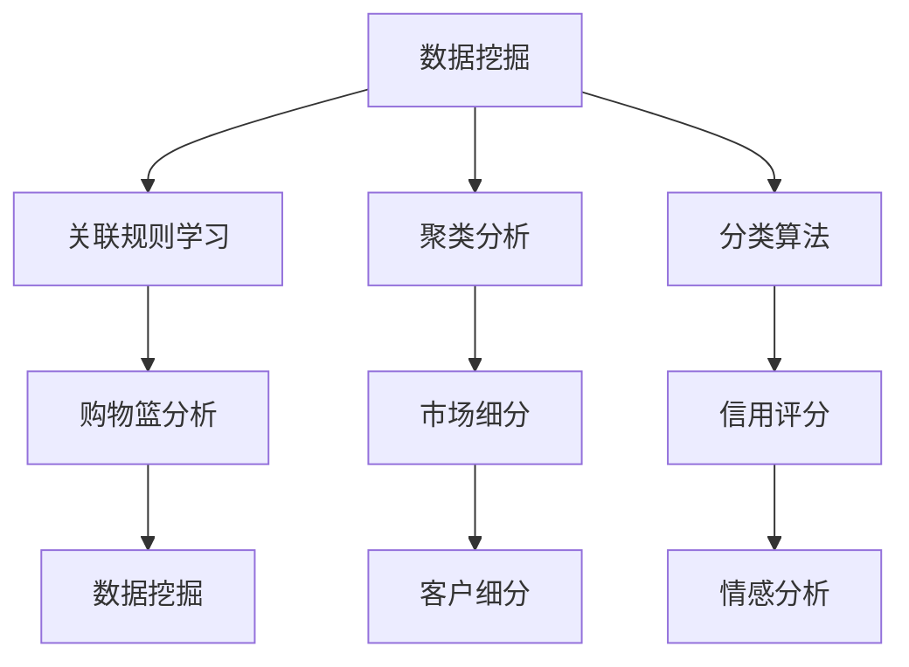

                 

# 理解洞察力的奥秘：知识发现引擎的作用

## 1. 背景介绍

### 1.1 问题由来

在数据驱动的时代，洞察力的获取变得至关重要。无论是企业决策、科学研究还是日常生活中的问题解决，准确、及时且深入的数据洞察都具有不可替代的作用。而知识发现引擎(Knowledge Discovery Engine, KDE)，作为数据分析和决策支持的重要工具，其作用在各个领域愈发凸显。

知识发现引擎是一种利用统计学、人工智能和数据库技术，自动从大规模数据集中识别并提取有用知识的软件系统。它不仅可以帮助用户发现数据中的模式和关联，还能通过可视化和报告工具，将复杂的数据洞察以易于理解的形式呈现，从而辅助决策和优化流程。

### 1.2 问题核心关键点

知识发现引擎的核心在于其自动化的数据挖掘和知识抽取能力，它融合了统计学、机器学习、自然语言处理等多个领域的技术，通过各种算法模型和统计方法，发现数据中的模式和关联，为决策提供支持。关键点包括：

- **数据挖掘算法**：如关联规则学习、聚类分析、分类算法等，用于发现数据中的隐藏知识。
- **统计建模方法**：如时间序列分析、回归分析、假设检验等，用于描述数据间的统计关系。
- **自然语言处理技术**：如文本挖掘、信息抽取等，用于从非结构化数据中提取结构化信息。
- **可视化和报告工具**：如仪表盘、报表、图形化界面等，用于展示和解释数据洞察结果。

这些核心技术的结合，使知识发现引擎具备强大的洞察力和应用价值。

### 1.3 问题研究意义

深入研究知识发现引擎的作用，对于提升数据洞察力、优化决策过程、加速问题解决具有重要意义：

- **增强决策支持**：通过自动化的数据分析，知识发现引擎可以提供准确的数据洞察，帮助决策者更快、更全面地理解问题，制定合理的决策方案。
- **促进业务创新**：在产品设计、市场营销、运营管理等多个环节，知识发现引擎能够揭示潜在的市场机会，优化产品设计和运营策略，推动业务创新和增长。
- **提升工作效率**：自动化和智能化的数据洞察工具，能够减少人工数据分析的繁琐过程，提高工作效率，降低人工错误和成本。
- **增强知识管理**：知识发现引擎不仅限于发现新知识，还能整合和分析已有知识，提供全面的知识库支持，提升组织的知识管理水平。

## 2. 核心概念与联系

### 2.1 核心概念概述

为更好地理解知识发现引擎的作用，本节将介绍几个关键概念：

- **数据挖掘(Data Mining)**：从数据中自动发现有用知识和信息的过程。数据挖掘常用于市场分析、客户细分、欺诈检测等领域。
- **关联规则学习(Association Rule Learning)**：用于发现数据项之间的关联规则，如购物篮分析等。
- **聚类分析(Clustering Analysis)**：将数据分为多个相似子集，用于市场细分、社交网络分析等。
- **分类算法(Classification)**：用于将数据分为不同的类别，如信用评分、情感分析等。
- **统计建模(Statistical Modeling)**：使用统计方法描述数据间的关系，如回归分析、时间序列分析等。
- **自然语言处理(Natural Language Processing, NLP)**：处理和分析人类语言，如文本挖掘、信息抽取等。
- **可视化和报告工具(Visualization and Reporting Tools)**：用于呈现和解释数据洞察结果，如仪表盘、报表等。

这些核心概念之间的逻辑关系可以通过以下Mermaid流程图来展示：



这个流程图展示了几大核心概念及其之间的联系：

1. 数据挖掘是知识发现的基础，通过各种算法和模型，从数据中提取有价值的信息。
2. 关联规则学习、聚类分析和分类算法是数据挖掘中的常用方法，分别用于发现数据项间的关联、数据分组和数据分类。
3. 统计建模和自然语言处理是数据挖掘的补充手段，用于描述数据间的关系和处理非结构化数据。
4. 可视化和报告工具是知识发现引擎的关键输出，用于展示和解释数据洞察结果。

## 3. 核心算法原理 & 具体操作步骤
### 3.1 算法原理概述

知识发现引擎的工作原理可以概括为以下几个步骤：

1. **数据预处理**：清洗、转换和准备数据，以适应分析算法的要求。
2. **特征提取**：从数据中提取有意义的特征，为后续分析提供输入。
3. **算法建模**：选择合适的算法模型进行数据挖掘和知识抽取。
4. **模型训练**：使用训练数据集训练模型，调整模型参数以获得最佳性能。
5. **模型评估**：使用测试数据集评估模型性能，验证模型泛化能力。
6. **结果展示**：将分析结果可视化，生成报告和仪表盘，辅助决策。

知识发现引擎的核心算法包括：

- **关联规则学习**：用于发现数据项之间的关联，如Apriori算法、FP-Growth算法等。
- **聚类分析**：用于将数据分组，如K-Means算法、层次聚类算法等。
- **分类算法**：用于数据分类，如决策树、随机森林、支持向量机(SVM)等。
- **统计建模**：用于描述数据间的关系，如时间序列分析、回归分析等。

### 3.2 算法步骤详解

**Step 1: 数据预处理**

数据预处理是知识发现引擎的第一步，主要包括以下几个步骤：

1. **数据清洗**：去除重复、缺失、异常值等无效数据，确保数据质量。
2. **数据转换**：将数据转换为适合算法分析的格式，如归一化、标准化等。
3. **数据集成**：将多个数据源集成到一个统一的数据集，解决数据孤岛问题。
4. **数据采样**：对数据进行采样，以处理大数据集，减少计算量。

**Step 2: 特征提取**

特征提取是将原始数据转换为有意义的特征，为后续分析提供输入。主要包括以下几种方法：

1. **统计特征提取**：如均值、方差、标准差等统计量。
2. **文本特征提取**：如TF-IDF、词袋模型、主题模型等。
3. **图像特征提取**：如颜色直方图、边缘检测、尺度不变特征变换(SIFT)等。

**Step 3: 算法建模**

根据问题的类型和数据的特性，选择合适的算法模型进行数据挖掘和知识抽取。常见的算法包括：

1. **关联规则学习**：使用Apriori算法、FP-Growth算法等，发现数据项之间的关联。
2. **聚类分析**：使用K-Means算法、层次聚类算法等，将数据分为多个相似子集。
3. **分类算法**：使用决策树、随机森林、SVM等，对数据进行分类。
4. **统计建模**：使用回归分析、时间序列分析等，描述数据间的关系。

**Step 4: 模型训练**

模型训练是知识发现引擎的核心步骤，主要包括以下几个步骤：

1. **划分数据集**：将数据集划分为训练集和测试集。
2. **模型选择**：选择合适的算法和模型。
3. **模型训练**：使用训练集训练模型，调整模型参数以获得最佳性能。

**Step 5: 模型评估**

模型评估是确保知识发现引擎输出准确性的关键步骤，主要包括以下几种方法：

1. **交叉验证**：使用交叉验证方法，评估模型的泛化能力。
2. **误差分析**：对模型的预测结果进行误差分析，识别模型的优势和劣势。
3. **性能指标**：如准确率、召回率、F1值等，用于评估模型的性能。

**Step 6: 结果展示**

结果展示是将分析结果可视化，生成报告和仪表盘，辅助决策。主要包括以下几种方法：

1. **可视化工具**：如Tableau、Power BI等，用于生成图表、仪表盘和报告。
2. **自然语言处理**：如信息抽取、文本摘要等，用于生成文本报告。
3. **交互式界面**：如Web应用程序、移动应用程序等，提供用户友好的界面。

### 3.3 算法优缺点

知识发现引擎的优点包括：

1. **自动化程度高**：能够自动从大规模数据集中发现有用知识，减少了人工干预。
2. **适用范围广**：适用于多种数据类型和分析任务，如结构化数据、非结构化数据等。
3. **可视化效果好**：通过可视化和报告工具，将复杂的数据洞察以易于理解的形式呈现。

同时，知识发现引擎也存在一些缺点：

1. **对数据质量依赖高**：数据清洗和预处理对知识发现的准确性至关重要。
2. **计算资源需求高**：处理大规模数据集和复杂模型需要较高的计算资源。
3. **算法模型选择困难**：不同类型的数据和问题需要选择不同的算法模型，选择不当可能导致分析结果不准确。
4. **结果解释性不足**：一些复杂的模型和算法难以解释其决策过程，缺乏透明度。

尽管存在这些局限性，但知识发现引擎在数据驱动的决策支持和业务分析中仍然具有不可替代的作用。

### 3.4 算法应用领域

知识发现引擎已经在多个领域得到了广泛的应用，例如：

- **市场分析**：用于客户细分、市场细分、购物篮分析等，揭示市场趋势和消费者行为。
- **金融分析**：用于信用评分、欺诈检测、投资组合优化等，支持金融决策和风险管理。
- **医疗保健**：用于疾病预测、病人细分、治疗方案推荐等，支持医疗决策和个性化治疗。
- **人力资源**：用于员工招聘、绩效评估、员工流失预测等，提升人力资源管理水平。
- **物流管理**：用于需求预测、库存管理、配送路线优化等，提升物流运营效率。

除了上述这些经典应用外，知识发现引擎还被创新性地应用到更多场景中，如社交网络分析、能源管理、环境监测等，为数据驱动的决策支持提供了新的手段。

## 4. 数学模型和公式 & 详细讲解  
### 4.1 数学模型构建

本节将使用数学语言对知识发现引擎的工作原理进行更加严格的刻画。

假设数据集为 $D=\{(x_i,y_i)\}_{i=1}^N, x_i \in \mathcal{X}, y_i \in \mathcal{Y}$，其中 $\mathcal{X}$ 为特征空间，$\mathcal{Y}$ 为标签空间。知识发现引擎的目标是构建一个模型 $M_{\theta}$，使得 $M_{\theta}(x_i)$ 尽可能逼近 $y_i$，即：

$$
\min_{\theta} \frac{1}{N} \sum_{i=1}^N \ell(M_{\theta}(x_i),y_i)
$$

其中 $\ell$ 为损失函数，常用的有均方误差、交叉熵等。

### 4.2 公式推导过程

以回归分析为例，假设模型 $M_{\theta}(x)$ 为线性模型，即：

$$
M_{\theta}(x) = \theta_0 + \theta_1 x_1 + \theta_2 x_2 + \cdots + \theta_p x_p
$$

其中 $\theta_0,\theta_1,\cdots,\theta_p$ 为模型参数，$x_1,x_2,\cdots,x_p$ 为特征。回归问题可以转化为最小化均方误差损失：

$$
\min_{\theta} \frac{1}{N} \sum_{i=1}^N (y_i - M_{\theta}(x_i))^2
$$

对上述目标函数求导，得到：

$$
\frac{\partial}{\partial \theta} \frac{1}{N} \sum_{i=1}^N (y_i - M_{\theta}(x_i))^2 = -2\frac{1}{N} \sum_{i=1}^N (y_i - M_{\theta}(x_i))x_i
$$

令上式为0，得到：

$$
\sum_{i=1}^N (y_i - M_{\theta}(x_i))x_i = 0
$$

整理得：

$$
\sum_{i=1}^N (y_i - M_{\theta}(x_i))x_i = \sum_{i=1}^N y_i x_i - \sum_{i=1}^N M_{\theta}(x_i)x_i = 0
$$

根据最小二乘法原理，可以解得：

$$
\hat{\theta} = (X^TX)^{-1}X^Ty
$$

其中 $X = [x_1, x_2, \cdots, x_p]$，$y = [y_1, y_2, \cdots, y_p]$。

在实际应用中，我们通常使用梯度下降等优化算法求解上述最小化问题，得到模型参数 $\theta$。

### 4.3 案例分析与讲解

以金融欺诈检测为例，假设我们的目标是识别异常交易，将其标记为欺诈。收集历史交易数据 $D=\{(x_i,y_i)\}_{i=1}^N$，其中 $x_i$ 为交易特征，$y_i$ 为欺诈标记。

**Step 1: 数据预处理**

1. **数据清洗**：去除异常值、缺失值等无效数据。
2. **数据转换**：归一化特征，使数据符合正态分布。
3. **数据集成**：将多个数据源集成到一个统一的数据集。

**Step 2: 特征提取**

1. **统计特征提取**：提取交易金额、交易时间、交易地点等统计特征。
2. **文本特征提取**：提取交易描述、交易发起人信息等文本特征。

**Step 3: 算法建模**

1. **选择算法**：使用随机森林算法进行分类。
2. **模型训练**：使用历史交易数据训练随机森林模型。

**Step 4: 模型评估**

1. **交叉验证**：使用交叉验证方法评估模型泛化能力。
2. **误差分析**：分析模型预测结果，识别误判和漏判。
3. **性能指标**：计算准确率、召回率、F1值等评估指标。

**Step 5: 结果展示**

1. **可视化工具**：使用Tableau生成交易异常热力图。
2. **自然语言处理**：提取交易描述中的关键信息，生成文本报告。

通过以上步骤，我们可以构建一个用于金融欺诈检测的知识发现引擎，实现对异常交易的自动化识别和标记。

## 5. 项目实践：代码实例和详细解释说明
### 5.1 开发环境搭建

在进行知识发现引擎实践前，我们需要准备好开发环境。以下是使用Python进行PyTorch开发的环境配置流程：

1. 安装Anaconda：从官网下载并安装Anaconda，用于创建独立的Python环境。

2. 创建并激活虚拟环境：
```bash
conda create -n pytorch-env python=3.8 
conda activate pytorch-env
```

3. 安装PyTorch：根据CUDA版本，从官网获取对应的安装命令。例如：
```bash
conda install pytorch torchvision torchaudio cudatoolkit=11.1 -c pytorch -c conda-forge
```

4. 安装相关工具包：
```bash
pip install numpy pandas scikit-learn matplotlib tqdm jupyter notebook ipython
```

完成上述步骤后，即可在`pytorch-env`环境中开始知识发现引擎的实践。

### 5.2 源代码详细实现

下面我们以金融欺诈检测为例，给出使用PyTorch进行随机森林分类的代码实现。

首先，定义数据处理函数：

```python
import pandas as pd
from sklearn.ensemble import RandomForestClassifier
from sklearn.model_selection import train_test_split
from sklearn.metrics import confusion_matrix, accuracy_score

def load_data(file_path):
    data = pd.read_csv(file_path)
    X = data.drop(['y'], axis=1)
    y = data['y']
    return X, y

def train_test_split(data):
    X_train, X_test, y_train, y_test = train_test_split(data, test_size=0.2, random_state=42)
    return X_train, X_test, y_train, y_test
```

然后，定义模型和评估函数：

```python
from sklearn.ensemble import RandomForestClassifier
from sklearn.metrics import classification_report
from sklearn.model_selection import cross_val_score

def train_model(X_train, y_train):
    model = RandomForestClassifier(n_estimators=100, random_state=42)
    model.fit(X_train, y_train)
    return model

def evaluate_model(model, X_test, y_test):
    y_pred = model.predict(X_test)
    print(classification_report(y_test, y_pred))
    print(confusion_matrix(y_test, y_pred))
```

最后，启动训练流程并在测试集上评估：

```python
X, y = load_data('data.csv')
X_train, X_test, y_train, y_test = train_test_split(X, y)
model = train_model(X_train, y_train)
evaluate_model(model, X_test, y_test)
```

以上就是使用PyTorch进行金融欺诈检测的知识发现引擎实现。可以看到，得益于Scikit-Learn的强大封装，我们可以用相对简洁的代码完成随机森林模型的训练和评估。

### 5.3 代码解读与分析

让我们再详细解读一下关键代码的实现细节：

**load_data函数**：
- 定义了加载数据的函数，读取CSV文件，并分离特征和标签。

**train_test_split函数**：
- 定义了数据集的划分函数，将数据集划分为训练集和测试集。

**train_model函数**：
- 定义了随机森林模型的训练函数，使用历史数据训练模型。

**evaluate_model函数**：
- 定义了模型评估函数，使用测试数据评估模型性能，输出分类报告和混淆矩阵。

**训练流程**：
- 使用load_data函数加载数据集。
- 使用train_test_split函数划分数据集。
- 使用train_model函数训练随机森林模型。
- 使用evaluate_model函数在测试集上评估模型性能。

可以看到，Scikit-Learn使得知识发现引擎的代码实现变得简洁高效。开发者可以将更多精力放在数据处理、模型改进等高层逻辑上，而不必过多关注底层的实现细节。

当然，工业级的系统实现还需考虑更多因素，如模型的保存和部署、超参数的自动搜索、更灵活的任务适配层等。但核心的知识发现引擎工作流程基本与此类似。

## 6. 实际应用场景
### 6.1 金融欺诈检测

知识发现引擎在金融欺诈检测中具有重要的应用价值。传统的欺诈检测依赖人工审核，效率低下，误判和漏判率高。而使用知识发现引擎，可以自动发现欺诈模式，显著提升欺诈检测的准确性和效率。

在技术实现上，知识发现引擎可以对历史交易数据进行建模，学习欺诈行为的模式，并在实时交易中进行异常检测。通过集成机器学习模型，如随机森林、SVM等，可以构建高效、准确的欺诈检测系统，保护金融机构的安全和客户利益。

### 6.2 医疗疾病预测

在医疗领域，知识发现引擎可以用于疾病预测、诊断和治疗方案推荐等任务。通过收集病历数据、实验室检测数据等，使用机器学习模型挖掘出疾病发展的规律，从而实现早诊断、早治疗。

具体而言，可以构建一个用于癌症早期筛查的知识发现引擎，使用历史病例数据训练模型，预测患者患癌风险。在实际应用中，医生可以根据模型预测结果，调整诊疗方案，提高治疗效果。

### 6.3 智能推荐系统

知识发现引擎在智能推荐系统中也有广泛应用。通过分析用户行为数据、商品信息等，发现用户兴趣和商品之间的关联，生成个性化的推荐列表。

在推荐算法中，知识发现引擎可以与协同过滤、深度学习等方法结合，提供更加精准和多样化的推荐服务。例如，通过文本挖掘技术，提取商品描述中的关键信息，与用户画像结合，提升推荐效果。

### 6.4 未来应用展望

随着数据量的不断增加和技术的不断进步，知识发现引擎将在更多领域得到应用，为各行各业带来深刻的变革：

1. **智能制造**：通过数据挖掘和机器学习，优化生产流程、预测设备故障，提升制造效率和质量。
2. **智慧城市**：通过智能分析城市数据，优化交通管理、提升公共服务，构建智慧城市治理体系。
3. **个性化教育**：通过分析学生行为数据、教学资源等，提供个性化学习方案，提高教学效果。
4. **生物医学**：通过数据分析，揭示基因与疾病的关系，支持精准医疗和新药研发。
5. **环境保护**：通过分析环境数据，发现污染源、预测环境变化，支持环保决策。

未来的知识发现引擎将不仅仅局限于传统的分析任务，还将与人工智能、大数据、物联网等技术深度融合，推动各行业的智能化升级。

## 7. 工具和资源推荐
### 7.1 学习资源推荐

为了帮助开发者系统掌握知识发现引擎的理论基础和实践技巧，这里推荐一些优质的学习资源：

1. 《Python数据科学手册》：通过实战演练，系统介绍数据预处理、特征工程、模型训练等知识发现引擎的各个环节。

2. 《机器学习实战》：通过具体案例，讲解机器学习算法在各个领域的应用，包括金融、医疗、电商等。

3. Coursera《机器学习》课程：斯坦福大学开设的机器学习课程，涵盖机器学习基础、数据预处理、模型训练等关键内容。

4. Kaggle：全球最大的数据科学竞赛平台，提供大量数据集和公开案例，供开发者学习和实践。

5. Scikit-Learn官方文档：Scikit-Learn的官方文档，详细介绍了各种算法和模型，是进行知识发现引擎开发的必备资料。

通过对这些资源的学习实践，相信你一定能够快速掌握知识发现引擎的核心技术，并用于解决实际的业务问题。

### 7.2 开发工具推荐

高效的开发离不开优秀的工具支持。以下是几款用于知识发现引擎开发的常用工具：

1. Python：通用编程语言，拥有丰富的第三方库和工具，适合数据科学和机器学习任务。

2. PyTorch：基于Python的开源深度学习框架，支持动态计算图，适合快速迭代研究。

3. Scikit-Learn：Python数据科学库，封装了各种机器学习算法，易于使用和部署。

4. Tableau：数据可视化工具，支持多种数据源和图表类型，用于生成可视化报告。

5. Power BI：微软开发的商业智能工具，支持数据导入、可视化分析和报表生成。

6. Jupyter Notebook：交互式开发环境，支持代码、数据、可视化等元素结合，便于共享和协作。

合理利用这些工具，可以显著提升知识发现引擎的开发效率，加快创新迭代的步伐。

### 7.3 相关论文推荐

知识发现引擎的研究源自学界的持续研究。以下是几篇奠基性的相关论文，推荐阅读：

1. C4.5: A Program for Multiple Discrimination and Classification：Ross Quinlan提出的决策树算法，用于分类和回归分析。

2. The Elements of Statistical Learning：Hastie、Tibshirani和Friedman合著的经典机器学习教材，系统介绍各种统计学习方法。

3. Statistical Learning with Sparsity: The Lasso and Generalizations：张虎等人提出的稀疏回归模型，用于高维数据的分析。

4. Machine Learning for Healthcare：Uhman等人综述了机器学习在医疗领域的应用，包括疾病预测、诊断和治疗方案推荐等。

5. Mining of Association Rules in Large Databases: A Unified Approach：Agrawal等人提出的Apriori算法，用于发现数据项之间的关联规则。

6. Ensemble Methods for Data Mining：Han等人总结了集成学习方法，包括Bagging、Boosting和Stacking等，用于提升模型性能。

这些论文代表了大数据和机器学习领域的发展脉络，通过学习这些前沿成果，可以帮助研究者把握学科前进方向，激发更多的创新灵感。

## 8. 总结：未来发展趋势与挑战

### 8.1 总结

本文对知识发现引擎的工作原理和应用场景进行了全面系统的介绍。首先阐述了知识发现引擎的自动化数据分析和知识抽取能力，明确了其在数据驱动决策支持中的重要作用。其次，从原理到实践，详细讲解了知识发现引擎的核心算法和操作步骤，给出了知识发现引擎的代码实现和运行结果展示。同时，本文还探讨了知识发现引擎在多个行业领域的应用前景，展示了其在数据驱动决策支持和业务优化中的巨大潜力。最后，本文精选了知识发现引擎的学习资源、开发工具和相关论文，力求为读者提供全方位的技术指引。

通过本文的系统梳理，可以看到，知识发现引擎作为一种强大的数据分析工具，已经广泛应用于多个行业领域，为业务决策和流程优化提供了强有力的支持。未来，伴随数据量和计算资源的不断增长，知识发现引擎将继续在更多领域发挥重要作用，推动各行各业的智能化升级。

### 8.2 未来发展趋势

展望未来，知识发现引擎的发展将呈现以下几个趋势：

1. **自动化程度更高**：随着算法模型的不断优化和自动化工具的普及，知识发现引擎将进一步降低人工干预，提升自动化水平。
2. **适用范围更广**：随着数据量和计算资源的不断增长，知识发现引擎将能够处理更加复杂的数据类型和分析任务。
3. **交互性更强**：通过引入自然语言处理和交互式可视化，知识发现引擎将能够更好地理解用户需求，提供更加个性化和高效的数据分析服务。
4. **数据来源更丰富**：随着数据采集和存储技术的进步，知识发现引擎将能够处理更多的数据源和数据类型，提升数据洞察的全面性和深度。
5. **模型融合更多**：随着多模态数据融合技术的发展，知识发现引擎将能够处理图像、视频、语音等多模态数据，提升数据洞察的多样性和丰富性。

以上趋势凸显了知识发现引擎在数据驱动决策支持和业务优化中的巨大前景。这些方向的探索发展，必将进一步提升数据洞察的准确性和应用效果，推动各行业的智能化升级。

### 8.3 面临的挑战

尽管知识发现引擎已经取得了显著的进展，但在迈向更加智能化、普适化应用的过程中，它仍面临诸多挑战：

1. **数据质量问题**：数据清洗和预处理对知识发现的准确性至关重要。如何提高数据质量，减少数据偏差，是一个重要挑战。
2. **算法模型选择困难**：不同类型的数据和问题需要选择不同的算法模型，选择不当可能导致分析结果不准确。
3. **计算资源需求高**：处理大规模数据集和复杂模型需要较高的计算资源。如何优化算法和资源配置，降低计算成本，是一个重要挑战。
4. **结果解释性不足**：一些复杂的模型和算法难以解释其决策过程，缺乏透明度。如何提高模型解释性，增强用户信任，是一个重要挑战。
5. **数据隐私和安全**：如何保护数据隐私和安全，防止数据泄露和滥用，是一个重要挑战。

尽管存在这些挑战，但知识发现引擎在数据驱动决策支持和业务优化中的作用不可替代。未来相关研究的重点在于如何进一步提升数据质量、优化算法模型、提高计算效率、增强结果解释性和保护数据隐私，使知识发现引擎更好地服务于各行业。

### 8.4 研究展望

面向未来，知识发现引擎的研究需要在以下几个方面寻求新的突破：

1. **自适应数据挖掘**：通过自适应算法，自动调整数据挖掘方法，提高数据洞察的准确性和效率。
2. **因果推断**：引入因果推断技术，识别数据间的因果关系，提升数据分析的可靠性和鲁棒性。
3. **多模态融合**：融合图像、视频、语音等多模态数据，提升数据洞察的多样性和全面性。
4. **交互式智能**：引入自然语言处理和交互式可视化，提升用户对知识发现引擎的理解和利用。
5. **数据隐私保护**：开发数据隐私保护技术，保护用户隐私，防止数据滥用。

这些研究方向的探索，必将引领知识发现引擎向更高的台阶发展，为数据驱动决策支持和业务优化提供更强大的支持。

## 9. 附录：常见问题与解答

**Q1: 知识发现引擎的主要算法包括哪些？**

A: 知识发现引擎的主要算法包括：
1. 关联规则学习：如Apriori算法、FP-Growth算法等，用于发现数据项之间的关联。
2. 聚类分析：如K-Means算法、层次聚类算法等，用于将数据分为多个相似子集。
3. 分类算法：如决策树、随机森林、支持向量机(SVM)等，用于对数据进行分类。
4. 统计建模：如回归分析、时间序列分析等，用于描述数据间的关系。

这些算法在不同的任务和数据类型下具有不同的优势和适用性。

**Q2: 知识发现引擎与数据挖掘的区别是什么？**

A: 数据挖掘是知识发现引擎的前身，主要指从数据中发现有用知识和信息的过程。而知识发现引擎则是在数据挖掘的基础上，进一步融合了人工智能和数据库技术，通过可视化和报告工具，将数据洞察以易于理解的形式呈现，辅助决策和优化流程。

**Q3: 知识发现引擎在应用中需要注意哪些问题？**

A: 知识发现引擎在应用中需要注意以下问题：
1. 数据质量：数据清洗和预处理对知识发现的准确性至关重要。
2. 算法模型选择：不同类型的数据和问题需要选择不同的算法模型，选择不当可能导致分析结果不准确。
3. 计算资源需求：处理大规模数据集和复杂模型需要较高的计算资源。
4. 结果解释性：一些复杂的模型和算法难以解释其决策过程，缺乏透明度。
5. 数据隐私和安全：如何保护数据隐私和安全，防止数据泄露和滥用。

这些问题的有效解决，是知识发现引擎能够成功应用的前提。

**Q4: 知识发现引擎与机器学习的关系是什么？**

A: 知识发现引擎与机器学习密切相关，两者在很多方面具有重叠性。知识发现引擎主要关注数据的挖掘和分析，而机器学习则更关注模型的训练和优化。知识发现引擎可以使用机器学习算法，如决策树、随机森林、支持向量机等，进行数据挖掘和分析，而机器学习算法也可以应用于知识发现引擎的各个环节，如特征工程、模型训练等。

**Q5: 知识发现引擎在各个行业中的应用有哪些？**

A: 知识发现引擎在各个行业中的应用包括：
1. 金融欺诈检测：通过自动发现欺诈模式，提升欺诈检测的准确性和效率。
2. 医疗疾病预测：通过分析病历数据，发现疾病发展的规律，支持早期诊断和治疗。
3. 智能推荐系统：通过分析用户行为数据，生成个性化的推荐列表。
4. 智能制造：通过优化生产流程和预测设备故障，提升制造效率和质量。
5. 智慧城市：通过智能分析城市数据，优化交通管理、提升公共服务。
6. 个性化教育：通过分析学生行为数据，提供个性化的学习方案。
7. 生物医学：通过数据分析，支持精准医疗和新药研发。
8. 环境保护：通过分析环境数据，支持环保决策。

这些应用展示了知识发现引擎在各行各业中的广泛适用性。

---

作者：禅与计算机程序设计艺术 / Zen and the Art of Computer Programming

