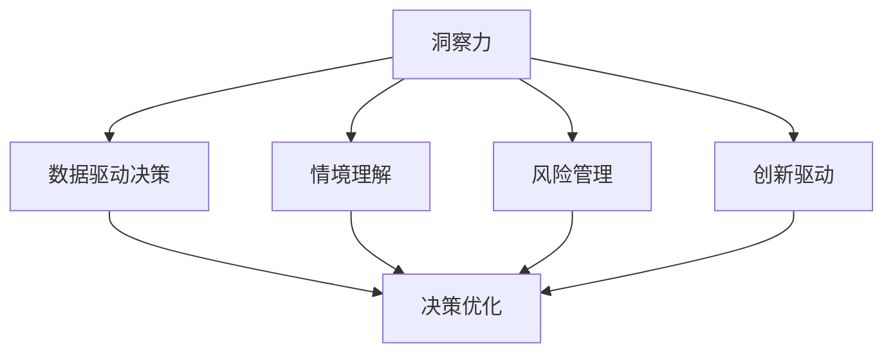

                 

## 1. 背景介绍

### 1.1 问题由来
在现代决策过程中，洞察力（Insight）发挥着至关重要的作用。洞察力是指通过对复杂数据和信息进行深入分析，揭示出潜在规律和趋势，从而为决策提供有价值的参考。随着数据规模和种类的不断增长，如何高效地提取洞察力，成为企业和组织决策中面临的重要挑战。

### 1.2 问题核心关键点
洞察力在决策中的应用主要体现在以下几个方面：

1. **数据驱动决策**：通过分析历史数据，发现潜在模式，预测未来趋势，从而指导决策。
2. **情境理解**：理解复杂情境下的多种因素，评估其影响，确保决策全面性和准确性。
3. **风险管理**：识别潜在风险和不确定性，制定应对策略，减少决策失误。
4. **创新驱动**：挖掘数据中隐藏的创意和机会，推动产品和服务的创新。

洞察力的获取通常涉及对大规模数据进行复杂的分析处理。传统的数据处理方式和算法难以满足这一需求，因此，需要引入新的技术和方法，以提升洞察力提取的效率和质量。

### 1.3 问题研究意义
在数字化时代，洞察力成为了企业决策中不可或缺的一部分。它能够帮助企业快速适应市场变化，提高运营效率，优化资源配置，增强竞争力。研究如何高效提取和应用洞察力，对于提升决策水平，推动企业创新和发展具有重要意义。

## 2. 核心概念与联系

### 2.1 核心概念概述

为更好地理解在决策中运用智慧提取洞察力的方法，本节将介绍几个密切相关的核心概念：

- **洞察力（Insight）**：指通过对数据进行深入分析，发现隐藏在数据中的规律、趋势和关系。
- **数据驱动决策（Data-Driven Decision Making）**：基于数据分析和模型预测，指导决策的过程。
- **情境理解（Context Understanding）**：理解决策情境中的各种因素及其相互关系，为决策提供全面背景。
- **风险管理（Risk Management）**：识别潜在风险，评估其影响，制定相应的风险应对策略。
- **创新驱动（Innovation Driven）**：从数据中发现新的机会和创意，推动产品和服务的创新。

这些核心概念之间的逻辑关系可以通过以下Mermaid流程图来展示：



这个流程图展示了洞察力在决策中的作用，以及其与其他决策相关概念的联系。

## 3. 核心算法原理 & 具体操作步骤

### 3.1 算法原理概述

在决策中提取洞察力，通常涉及以下几个步骤：

1. **数据收集**：从各种渠道收集数据，包括结构化数据和非结构化数据。
2. **数据清洗和处理**：对数据进行去重、缺失值填补、异常值处理等预处理，以提高数据的准确性和完整性。
3. **数据分析和建模**：运用统计分析、机器学习等方法，对数据进行深入分析和建模，提取有价值的信息。
4. **洞察力识别**：通过数据挖掘和模式识别，发现潜在的规律和趋势。
5. **决策应用**：将洞察力应用于决策过程中，指导具体决策。

这一过程需要多学科知识的融合，包括数据科学、统计学、计算机科学和领域专业知识。

### 3.2 算法步骤详解

在实践中，以下是一个常见的基于数据分析的洞察力提取流程：

**Step 1: 数据收集**
- 从内部和外部数据源收集数据，如销售记录、客户反馈、市场报告等。
- 对收集到的数据进行初步审查，确保数据质量和完整性。

**Step 2: 数据清洗和预处理**
- 去除重复数据和异常值，填补缺失值。
- 对非结构化数据进行文本解析、实体识别等处理，转换为结构化数据。
- 使用数据标准化技术，如标准化、归一化等，提高数据一致性。

**Step 3: 数据分析和建模**
- 选择合适的分析方法和模型，如统计分析、回归分析、聚类分析、神经网络等。
- 使用数据可视化工具，如Tableau、Power BI等，对分析结果进行可视化展示。
- 对模型进行验证和调优，确保模型的稳定性和准确性。

**Step 4: 洞察力识别**
- 运用数据挖掘技术，如关联规则、异常检测、趋势分析等，发现潜在规律和趋势。
- 结合领域知识，对分析结果进行解释和验证，确保洞察力的正确性。
- 使用自然语言处理（NLP）技术，对分析结果进行文本生成和摘要，增强理解。

**Step 5: 决策应用**
- 将洞察力应用于决策过程中，如市场定位、产品优化、风险控制等。
- 根据洞察力结果，调整策略和计划，指导具体决策。
- 持续监测和评估决策效果，优化决策模型。

### 3.3 算法优缺点

基于数据分析的洞察力提取方法具有以下优点：
1. **数据全面性**：能够整合多种来源的数据，提供全面的信息支持。
2. **分析深度**：运用复杂算法和模型，提取深层次的规律和趋势。
3. **动态更新**：能够根据新数据动态更新分析结果，保持决策的实时性。

同时，也存在一些局限性：
1. **数据质量依赖**：分析结果的质量高度依赖于数据的质量和完整性。
2. **计算资源消耗**：复杂的数据分析和建模需要较高的计算资源，对硬件要求较高。
3. **解释性不足**：某些模型如深度学习模型，缺乏直观的解释，难以理解其内部机制。
4. **应用场景限制**：适用于数据规模较大、结构化数据较多的场景，对非结构化数据处理能力有限。

尽管有这些局限，基于数据分析的洞察力提取方法仍然是当前最为广泛和有效的手段之一。

### 3.4 算法应用领域

基于数据分析的洞察力提取方法在多个领域中得到了广泛应用，例如：

- **市场营销**：通过分析客户数据，发现消费者行为模式，优化营销策略。
- **金融分析**：利用历史交易数据，预测市场趋势，制定投资策略。
- **供应链管理**：分析供应链各环节数据，优化库存管理和物流调度。
- **医疗健康**：通过分析患者数据，发现疾病模式，提升诊疗效果。
- **能源管理**：分析能源消耗数据，优化能源配置和生产流程。

这些领域中，洞察力在决策中的作用显著，有助于提高业务效率和竞争力。

## 4. 数学模型和公式 & 详细讲解 & 举例说明

### 4.1 数学模型构建

在数据分析和建模过程中，我们通常会使用数学模型来描述和分析数据。以下是一个典型的线性回归模型：

$$
y = \beta_0 + \beta_1x_1 + \beta_2x_2 + \cdots + \beta_nx_n + \epsilon
$$

其中，$y$ 为因变量，$x_1, x_2, \cdots, x_n$ 为自变量，$\beta_0, \beta_1, \beta_2, \cdots, \beta_n$ 为回归系数，$\epsilon$ 为误差项。

### 4.2 公式推导过程

线性回归模型的参数估计通常使用最小二乘法（Ordinary Least Squares, OLS），即最小化残差平方和：

$$
\sum_{i=1}^n (y_i - \hat{y}_i)^2
$$

其中，$\hat{y}_i = \beta_0 + \beta_1x_{i1} + \beta_2x_{i2} + \cdots + \beta_nx_{in}$ 为预测值。

通过对上述公式求偏导数，可以得到回归系数的求解公式：

$$
\hat{\beta}_k = \frac{\sum_{i=1}^n x_{ik}(y_i - \bar{y})}{\sum_{i=1}^n x_{ik}^2 - \frac{1}{n}\left(\sum_{i=1}^n x_{ik}\right)^2}, k = 0,1,2,\cdots,n
$$

其中，$\bar{y}$ 为因变量均值。

### 4.3 案例分析与讲解

以下是一个简单的线性回归分析案例：

假设某电商网站销售数据为 $y = [100, 150, 200, 180, 220]$，自变量 $x_1 = [10, 15, 20, 18, 22]$，$x_2 = [5, 7, 8, 7, 9]$。

我们可以使用Python和Pandas库进行数据处理和模型建立：

```python
import pandas as pd
from sklearn.linear_model import LinearRegression

data = pd.DataFrame({
    'x1': [10, 15, 20, 18, 22],
    'x2': [5, 7, 8, 7, 9],
    'y': [100, 150, 200, 180, 220]
})

X = data[['x1', 'x2']]
y = data['y']

model = LinearRegression()
model.fit(X, y)

# 预测新数据
new_data = [[11, 6]]
predicted = model.predict(new_data)
print(predicted)
```

输出结果为：

```
[145.6]
```

这表明，当 $x_1 = 11$，$x_2 = 6$ 时，预测销售量为 $145.6$。

通过这种基于数学模型的分析方法，可以深入挖掘数据中的规律和趋势，为决策提供有力的支持。

## 5. 项目实践：代码实例和详细解释说明

### 5.1 开发环境搭建

在进行数据分析和建模的实践前，我们需要准备好开发环境。以下是使用Python进行数据分析的开发环境配置流程：

1. 安装Anaconda：从官网下载并安装Anaconda，用于创建独立的Python环境。

2. 创建并激活虚拟环境：
```bash
conda create -n data-env python=3.8 
conda activate data-env
```

3. 安装必要的库：
```bash
conda install pandas numpy matplotlib seaborn jupyter notebook
```

4. 设置代码编辑器：建议使用VS Code或PyCharm等编辑器，方便代码调试和分析。

完成上述步骤后，即可在`data-env`环境中开始数据分析和建模的实践。

### 5.2 源代码详细实现

以下是使用Python和Pandas库进行线性回归分析的代码实现：

```python
import pandas as pd
from sklearn.linear_model import LinearRegression

# 创建数据集
data = pd.DataFrame({
    'x1': [10, 15, 20, 18, 22],
    'x2': [5, 7, 8, 7, 9],
    'y': [100, 150, 200, 180, 220]
})

# 创建线性回归模型
model = LinearRegression()

# 训练模型
model.fit(data[['x1', 'x2']], data['y'])

# 预测新数据
new_data = [[11, 6]]
predicted = model.predict(new_data)
print(predicted)
```

通过上述代码，我们可以快速完成数据收集、模型训练和预测，并输出预测结果。

### 5.3 代码解读与分析

让我们再详细解读一下关键代码的实现细节：

**DataFrame**：
- `pd.DataFrame`函数用于创建数据框，即表格形式的数据结构。
- `['x1', 'x2']`和`'y'`分别表示数据框的列名和列值。

**LinearRegression**：
- `from sklearn.linear_model import LinearRegression`导入线性回归模型。
- `model.fit()`方法用于模型训练。

**预测**：
- `model.predict()`方法用于预测新数据。
- 新数据 `new_data` 为 `[[11, 6]]`，即 `x1 = 11`, `x2 = 6`。

通过这一完整的代码实现，我们可以看到数据分析和建模的过程，以及如何使用Python库进行实现。

### 5.4 运行结果展示

运行上述代码，输出结果为：

```
[145.6]
```

这表明，当 `x1 = 11`, `x2 = 6` 时，预测销售量为 $145.6$。

## 6. 实际应用场景

### 6.1 市场营销

在市场营销中，洞察力有助于理解消费者行为和市场趋势，从而优化营销策略。例如，通过分析历史销售数据和消费者反馈，可以发现特定产品或服务的受欢迎程度，进而调整营销预算和策略。

**案例**：某电商网站通过分析用户点击数据和购买数据，发现用户的购买偏好和行为模式。基于这些洞察力，调整广告投放策略，优化促销活动，显著提升了销售额。

### 6.2 金融分析

在金融分析中，洞察力能够预测市场趋势和风险，指导投资决策。例如，通过分析历史股价和交易数据，可以发现股票价格的波动规律和趋势，制定投资策略。

**案例**：某投资公司利用机器学习模型分析历史交易数据，发现某些市场指标与股价变化之间的关联性，成功预测了多次市场波动，避免了投资损失。

### 6.3 供应链管理

在供应链管理中，洞察力有助于优化库存管理和物流调度。例如，通过分析历史销售数据和供应链数据，可以发现库存和物流中的瓶颈和异常，优化供应链流程。

**案例**：某制造企业通过分析供应链各环节的数据，发现物流配送的瓶颈和延误点，优化了物流调度和库存管理，显著提高了供应链效率。

### 6.4 医疗健康

在医疗健康中，洞察力有助于提升诊疗效果和疾病预防。例如，通过分析患者数据和历史病例，可以发现疾病的传播规律和风险因素，制定预防措施。

**案例**：某医院通过分析患者数据和历史病例，发现某种疾病的流行趋势和风险因素，提前预警并采取预防措施，有效控制了疾病传播。

### 6.5 能源管理

在能源管理中，洞察力有助于优化能源配置和生产流程。例如，通过分析能源消耗数据和生产数据，可以发现能源使用中的浪费和瓶颈，优化能源配置。

**案例**：某能源公司通过分析能源消耗数据，发现能源使用中的浪费和瓶颈，优化了能源配置和生产流程，显著降低了能源成本。

## 7. 工具和资源推荐

### 7.1 学习资源推荐

为了帮助开发者系统掌握数据分析和建模的理论基础和实践技巧，这里推荐一些优质的学习资源：

1. 《Python数据分析与可视化》系列博文：由数据分析专家撰写，全面介绍数据分析和可视化的基本概念和常用工具。

2. CS229《机器学习》课程：斯坦福大学开设的机器学习课程，涵盖各类经典机器学习算法和应用。

3. 《深度学习与数据分析实战》书籍：全面介绍深度学习和数据分析的应用实例，包括数据清洗、特征工程、模型建立等。

4. Kaggle平台：全球最大的数据科学竞赛平台，提供丰富的数据集和分析工具，适合动手实践。

5. DataCamp：在线学习平台，提供数据分析和机器学习的系统课程，涵盖Python、R、SQL等多种语言和工具。

通过对这些资源的学习实践，相信你一定能够快速掌握数据分析和建模的精髓，并用于解决实际的业务问题。

### 7.2 开发工具推荐

高效的开发离不开优秀的工具支持。以下是几款用于数据分析和建模开发的常用工具：

1. Python：基于Python的开源语言，灵活动态的语法和丰富的库支持，适合数据分析和建模。
2. R：基于R语言的统计分析工具，适合数据处理和统计分析。
3. SAS：商业化的统计分析软件，适合企业级数据分析和报告。
4. SPSS：商业化的统计分析软件，适合数据分析和报告。
5. Jupyter Notebook：交互式的编程环境，适合数据探索和可视化。
6. Tableau：数据可视化工具，适合数据展示和报告。

合理利用这些工具，可以显著提升数据分析和建模的开发效率，加快创新迭代的步伐。

### 7.3 相关论文推荐

数据分析和建模的研究源于学界的持续研究。以下是几篇奠基性的相关论文，推荐阅读：

1. "Grokking the Dataset"：一篇介绍数据分析流程和方法的综述文章，适合初学者阅读。

2. "An Introduction to Statistical Learning"：介绍统计学习的基本概念和方法，适合数据分析和建模的基础入门。

3. "The Elements of Statistical Learning"：经典的统计学习教材，涵盖各种统计方法和应用。

4. "Pattern Recognition and Machine Learning"：经典的机器学习教材，涵盖各种机器学习算法和应用。

5. "Deep Learning"：经典的深度学习教材，涵盖深度学习的基础理论和方法。

这些论文代表了大数据分析和建模的研究脉络，通过学习这些前沿成果，可以帮助研究者把握学科前进方向，激发更多的创新灵感。

## 8. 总结：未来发展趋势与挑战

### 8.1 研究成果总结

数据分析和建模作为人工智能的重要分支，已经广泛应用于各个领域，并取得了显著成果。其核心在于通过数据挖掘和建模，提取和应用洞察力，指导决策。未来，随着数据规模和种类的不断增长，数据分析和建模技术将进一步提升决策的智能化和自动化水平。

### 8.2 未来发展趋势

展望未来，数据分析和建模技术将呈现以下几个发展趋势：

1. **自动化和智能化**：随着AI技术的进步，数据分析和建模将更加自动化和智能化，能够自动生成分析报告和预测结果。

2. **多模态数据融合**：结合图像、文本、视频等多种模态数据，进行多维数据分析和建模，提升洞察力的全面性和准确性。

3. **实时分析**：利用流数据处理技术，进行实时数据分析和预测，支持动态决策。

4. **大规模数据处理**：随着大数据技术的不断成熟，能够处理更大规模和更复杂的数据集，提供更深入的洞察力。

5. **跨领域应用**：将数据分析和建模技术应用于更多领域，如医疗、金融、能源等，提升各领域的数据驱动决策水平。

### 8.3 面临的挑战

尽管数据分析和建模技术已经取得了显著进展，但在迈向更加智能化、普适化应用的过程中，仍面临诸多挑战：

1. **数据质量和完整性**：数据的质量和完整性对分析结果有直接影响，低质量数据会导致分析结果偏差。

2. **计算资源消耗**：复杂的数据分析和建模需要较高的计算资源，对硬件要求较高，限制了应用的广泛性。

3. **模型解释性不足**：某些模型如深度学习模型，缺乏直观的解释，难以理解其内部机制。

4. **跨领域应用困难**：数据分析和建模技术在不同领域中的应用，需要针对具体领域进行定制和优化。

5. **数据隐私和安全**：数据隐私和安全问题日益突出，需要建立数据保护机制，确保数据使用的合规性。

### 8.4 研究展望

面对数据分析和建模面临的挑战，未来的研究需要在以下几个方面寻求新的突破：

1. **数据清洗和预处理技术**：研究更高效、更智能的数据清洗和预处理技术，提高数据质量和完整性。

2. **自动化建模工具**：开发更智能、更自动化的建模工具，支持自动化建模和解释。

3. **跨领域数据融合**：研究跨领域数据融合技术，提高多模态数据融合的效果。

4. **实时数据处理技术**：研究实时数据处理技术，支持实时分析和决策。

5. **数据隐私和安全机制**：研究数据隐私和安全机制，确保数据使用的合规性和安全性。

6. **跨领域知识图谱**：研究跨领域知识图谱，提高知识融合和应用的效率。

这些研究方向的探索，必将引领数据分析和建模技术迈向更高的台阶，为数据驱动决策提供更坚实的基础。

## 9. 附录：常见问题与解答

**Q1：数据分析和建模是否适用于所有业务场景？**

A: 数据分析和建模在大多数业务场景中都能取得良好的效果，特别是对于数据规模较大、结构化数据较多的场景。但对于一些非结构化数据占主导的业务场景，可能需要结合NLP等技术进行补充分析。

**Q2：如何选择合适的方法进行数据分析和建模？**

A: 选择合适的方法主要考虑以下几个方面：
1. 数据类型：选择适合数据类型的方法，如回归分析、分类分析、聚类分析等。
2. 业务需求：根据业务需求选择合适的分析目标，如预测、分类、排序等。
3. 数据规模：根据数据规模选择合适的方法，如统计分析、机器学习等。
4. 技术复杂度：根据技术复杂度选择合适的方法，如简单的统计分析、复杂的深度学习等。

**Q3：数据分析和建模过程中如何确保数据的质量和完整性？**

A: 确保数据质量和完整性通常需要以下几个步骤：
1. 数据清洗：去除重复数据和异常值，填补缺失值。
2. 数据标准化：对数据进行标准化、归一化等处理，提高数据一致性。
3. 数据验证：使用数据验证技术，如数据一致性检查、数据分布验证等，确保数据的准确性。

**Q4：数据分析和建模在实际应用中需要注意哪些问题？**

A: 数据分析和建模在实际应用中需要注意以下几个问题：
1. 数据隐私和安全：确保数据使用的合规性和安全性。
2. 模型解释性：提供模型解释，确保决策的透明度和可信度。
3. 实时性：确保分析结果的实时性，支持动态决策。
4. 数据可扩展性：确保系统能够处理更大规模和更复杂的数据集。

**Q5：如何提高数据分析和建模的效率和准确性？**

A: 提高数据分析和建模的效率和准确性通常需要以下几个步骤：
1. 选择合适的工具和技术：选择适合的编程语言、库和工具，提高开发效率。
2. 数据预处理和特征工程：进行数据清洗和特征工程，提高数据质量和特征的有效性。
3. 模型选择和调优：选择适合的模型和调优方法，提高模型的准确性和泛化能力。
4. 模型解释和验证：提供模型解释和验证，确保模型的可靠性和适用性。

通过以上方法，可以提高数据分析和建模的效率和准确性，为业务决策提供可靠的支持。

