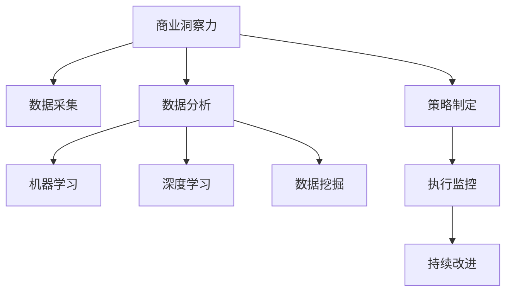

                 

# 理解洞察力的应用：在商业策略中的实践

> 关键词：洞察力,商业策略,数据分析,机器学习,数据挖掘,商业智能,深度学习

## 1. 背景介绍

### 1.1 问题由来
在当今快速变化的市场环境中，商业决策者需要依靠准确、深入的洞察力来指导企业的战略规划和运营。传统的业务洞察方式，如市场调研、历史数据分析和专家咨询等，往往受限于数据量和复杂性，难以快速响应市场变化。

随着技术的进步，特别是大数据和人工智能技术的发展，商业洞察方式发生了根本变革。机器学习、深度学习等技术能够高效地处理海量数据，自动发现数据中的模式和关联，提供更加精准和前瞻性的洞察力。这些技术的应用，使得商业决策者能够更加准确地把握市场趋势，制定出更有竞争力的策略。

### 1.2 问题核心关键点
商业洞察力的关键在于通过数据分析和机器学习技术，从海量数据中提取有价值的信息，辅助决策者制定商业策略。核心在于：

1. 数据采集：收集企业内外部的各项数据，包括市场数据、用户行为数据、财务数据等，为洞察力的生成提供基础。
2. 数据分析：应用机器学习和深度学习模型，对数据进行特征提取和模式识别，生成有价值的洞察。
3. 策略制定：结合洞察力，通过商业智能工具，制定相应的业务决策和战略规划。
4. 执行监控：通过持续的数据分析和策略调整，监控执行效果，确保决策的长期有效性。

### 1.3 问题研究意义
研究商业洞察力的应用，对于提升企业决策效率和精准度，增强市场竞争力和创新能力，具有重要意义：

1. 加速决策制定：机器学习和数据分析能够快速提供精准洞察，缩短决策周期，提高决策效率。
2. 降低决策风险：深度学习和数据挖掘技术能够发现潜在风险和机会，帮助企业规避风险，把握机遇。
3. 提升战略优势：洞察力能够提供前瞻性的视角，使企业在激烈的市场竞争中脱颖而出。
4. 支持业务创新：通过深度挖掘数据价值，洞察力的应用能够驱动企业创新，开拓新市场，发掘新机会。

## 2. 核心概念与联系

### 2.1 核心概念概述

为更好地理解商业洞察力的应用，本节将介绍几个密切相关的核心概念：

- 商业洞察力(Commercial Insight)：指通过分析商业数据，发现规律、趋势和关联，辅助决策者制定商业策略的能力。
- 机器学习(Machine Learning)：通过算法和统计模型，使计算机能够从数据中学习并自动改进。机器学习能够发现数据中的模式，提供有价值的洞察。
- 深度学习(Deep Learning)：一种特殊的机器学习算法，通过多层次的非线性特征提取，能够处理复杂的数据结构，如图像、语音、文本等。
- 数据挖掘(Data Mining)：从大量数据中提取隐含的模式、关联和趋势，提供有价值的商业洞察。
- 商业智能(Business Intelligence)：将数据转化为洞察力，辅助决策者进行商业分析和战略规划。

这些核心概念之间的逻辑关系可以通过以下Mermaid流程图来展示：



这个流程图展示出商业洞察力的关键组件及其之间的关系：

1. 商业洞察力依赖于数据的采集和分析。
2. 数据分析主要通过机器学习和深度学习技术实现。
3. 数据挖掘是数据分析的重要方法，帮助发现数据中的深层次模式。
4. 商业策略的制定需要基于商业洞察力。
5. 商业智能工具辅助策略制定和执行监控。
6. 通过持续改进，商业洞察力能够不断提升。

这些概念共同构成了商业洞察力的应用框架，使其能够在多个环节中发挥重要作用。通过理解这些核心概念，我们可以更好地把握商业洞察力的工作原理和优化方向。

## 3. 核心算法原理 & 具体操作步骤
### 3.1 算法原理概述

商业洞察力的应用，本质上是一个通过数据分析生成商业洞察，并辅助商业决策的过程。其核心思想是：利用机器学习和深度学习技术，从大量数据中自动提取有价值的模式和趋势，提供精准的商业洞察，辅助决策者制定和调整商业策略。

形式化地，假设商业决策者面临的决策问题为 $P=\{p_1, p_2, ..., p_n\}$，其中 $p_i$ 为第 $i$ 个决策点。假设企业能够获取的历史数据集为 $D=\{(x_j, y_j)\}_{j=1}^m$，其中 $x_j$ 为第 $j$ 个样本的特征，$y_j$ 为第 $j$ 个样本的标签（决策结果）。

定义数据集 $D$ 的经验风险为 $R(D)=\frac{1}{m}\sum_{j=1}^m L(y_j, f(x_j))$，其中 $L$ 为损失函数，$f$ 为决策模型。商业洞察力生成的过程，即通过优化模型 $f$，使得其预测结果尽可能逼近真实标签 $y_j$，从而在新的决策点 $p_i$ 上能够提供精准的洞察。

具体来说，商业洞察力的生成步骤如下：

1. 数据采集：收集企业内部和外部的各项数据，包括市场数据、用户行为数据、财务数据等。
2. 数据预处理：对数据进行清洗、归一化等预处理，确保数据质量。
3. 特征工程：从原始数据中提取有意义的特征，供机器学习模型使用。
4. 模型训练：选择合适的机器学习或深度学习模型，在标注数据集上训练模型，生成商业洞察。
5. 模型评估：在验证集上评估模型性能，确保其泛化能力。
6. 洞察应用：将模型应用于新的决策场景，生成精准的商业洞察。

### 3.2 算法步骤详解

商业洞察力的生成流程，主要包括数据采集、数据预处理、特征工程、模型训练、模型评估和洞察应用等环节。下面对每个步骤进行详细说明：

**Step 1: 数据采集**

商业洞察力的第一步是数据采集。通常需要收集以下几类数据：

1. 企业内部数据：如财务报表、销售数据、库存数据等。
2. 市场数据：如市场份额、竞争对手动向、行业趋势等。
3. 用户行为数据：如网站点击记录、购买历史、社交媒体互动等。
4. 外部数据：如新闻、政策、天气等，提供更全面的视角。

数据采集后，需要进行初步清洗和整理，确保数据的完整性和一致性。

**Step 2: 数据预处理**

数据预处理是数据采集后的重要环节，旨在提高数据的质量和适用性。常用的预处理技术包括：

1. 数据清洗：去除缺失、异常、重复等数据点，保证数据质量。
2. 数据归一化：将数据缩放到一定的范围内，便于模型处理。
3. 数据转换：对数据进行离散化、标准化等转换，提高模型泛化能力。
4. 数据集成：将不同来源的数据进行合并和融合，形成统一的数据集。

数据预处理不仅能够提高数据质量，还能够减少模型对异常值的敏感性。

**Step 3: 特征工程**

特征工程是商业洞察力生成的关键环节，通过选择合适的特征，提高模型的预测精度。常用的特征工程技术包括：

1. 特征选择：通过统计分析、领域知识等方法，选择最具代表性的特征。
2. 特征提取：使用降维、编码等技术，从原始数据中提取有意义的特征。
3. 特征合成：通过组合、衍生等方法，构造新的特征，增强模型的表达能力。
4. 特征变换：对特征进行转换、转换等，提高模型的泛化能力。

特征工程的目标是找到最优的特征组合，使其能够最大化模型的性能。

**Step 4: 模型训练**

模型训练是商业洞察力生成的核心步骤。常用的机器学习模型包括：

1. 线性回归、逻辑回归、决策树等传统模型。
2. 随机森林、梯度提升机等集成模型。
3. 支持向量机、神经网络等复杂模型。

模型训练的目标是最小化损失函数，使得模型在训练集上的预测结果尽可能逼近真实标签。

**Step 5: 模型评估**

模型评估是确保模型泛化能力的关键步骤。常用的评估指标包括：

1. 准确率、精确率、召回率等分类指标。
2. 均方误差、平均绝对误差等回归指标。
3. AUC、PR曲线等综合指标。

评估过程中，需要保留一定比例的验证集，确保模型在未见过的数据上的表现。

**Step 6: 洞察应用**

商业洞察力的应用，需要结合商业决策场景进行具体化。常用的应用方式包括：

1. 市场预测：通过历史数据预测市场趋势，辅助决策者制定市场策略。
2. 客户分析：通过用户行为数据，分析客户偏好和需求，制定个性化营销策略。
3. 财务分析：通过财务数据，预测企业财务状况，辅助投资决策。
4. 风险管理：通过风险数据，识别潜在风险，制定风险管理策略。

商业洞察力的应用，不仅能够提供精准的预测，还能够实时监控决策效果，支持持续改进。

### 3.3 算法优缺点

商业洞察力的应用，具有以下优点：

1. 高效性：能够快速处理大量数据，提供精准的商业洞察，缩短决策周期。
2. 全面性：能够覆盖企业内部和外部的各项数据，提供多维度的商业洞察。
3. 前瞻性：能够预测市场趋势和客户需求，辅助决策者制定前瞻性策略。
4. 可解释性：通过特征工程和模型解释技术，提供可解释的商业洞察，增强决策的透明度。

同时，商业洞察力的应用也存在以下局限性：

1. 数据依赖：商业洞察力的生成高度依赖数据的质量和完整性，数据不足可能导致洞察力失真。
2. 模型复杂性：复杂的机器学习模型需要大量的计算资源和时间，可能难以快速部署。
3. 噪音影响：数据中可能存在噪音和异常值，影响模型的泛化能力。
4. 业务适配：商业洞察力需要与具体的业务场景相结合，可能需要一定的业务知识。
5. 隐私风险：商业洞察力的生成需要收集大量的用户数据，可能面临隐私保护的风险。

尽管存在这些局限性，但商业洞察力的应用在企业决策中具有不可替代的价值。通过不断优化数据采集、预处理、特征工程和模型训练等环节，可以最大限度地提高商业洞察力的准确性和实用性。

### 3.4 算法应用领域

商业洞察力的应用已经深入到多个领域，包括但不限于：

- 市场预测：通过对历史市场数据进行分析，预测未来市场趋势和机会。
- 客户分析：分析客户行为和偏好，制定个性化营销策略，提升客户满意度。
- 风险管理：识别潜在的风险点，制定风险防控措施，确保企业运营安全。
- 财务分析：通过财务数据，预测企业财务状况，支持投资决策。
- 产品开发：分析市场和用户需求，指导产品开发和迭代，提升产品竞争力。

除了以上领域，商业洞察力的应用还覆盖了供应链管理、人力资源、品牌建设等多个方面，为企业提供了全方位的决策支持。

## 4. 数学模型和公式 & 详细讲解  
### 4.1 数学模型构建

商业洞察力的生成过程，本质上是一个通过机器学习模型从数据中提取模式的过程。下面通过数学语言对商业洞察力的生成过程进行严格刻画。

假设企业面临的决策问题为 $P=\{p_1, p_2, ..., p_n\}$，历史数据集为 $D=\{(x_j, y_j)\}_{j=1}^m$，其中 $x_j$ 为第 $j$ 个样本的特征，$y_j$ 为第 $j$ 个样本的标签。

定义数据集 $D$ 的经验风险为 $R(D)=\frac{1}{m}\sum_{j=1}^m L(y_j, f(x_j))$，其中 $L$ 为损失函数，$f$ 为决策模型。商业洞察力的生成目标是最小化经验风险，即找到最优的决策模型 $f$。

在实际应用中，我们通常使用梯度下降等优化算法来近似求解上述最优化问题。设 $\eta$ 为学习率，则模型参数的更新公式为：

$$
\theta \leftarrow \theta - \eta \nabla_{\theta}R(D)
$$

其中 $\nabla_{\theta}R(D)$ 为损失函数对模型参数 $\theta$ 的梯度，可通过反向传播算法高效计算。

### 4.2 公式推导过程

以下我们以分类任务为例，推导分类模型的损失函数及其梯度的计算公式。

假设模型 $f$ 在输入 $x$ 上的输出为 $\hat{y}=f(x) \in [0,1]$，表示样本属于正类的概率。真实标签 $y \in \{0,1\}$。则二分类交叉熵损失函数定义为：

$$
L(y, f(x)) = -[y\log f(x) + (1-y)\log (1-f(x))]
$$

将其代入经验风险公式，得：

$$
R(D) = -\frac{1}{m}\sum_{j=1}^m [y_j\log f(x_j)+(1-y_j)\log(1-f(x_j))]
$$

根据链式法则，损失函数对模型参数 $\theta_k$ 的梯度为：

$$
\frac{\partial R(D)}{\partial \theta_k} = -\frac{1}{m}\sum_{j=1}^m (\frac{y_j}{f(x_j)}-\frac{1-y_j}{1-f(x_j)}) \frac{\partial f(x_j)}{\partial \theta_k}
$$

其中 $\frac{\partial f(x_j)}{\partial \theta_k}$ 可进一步递归展开，利用自动微分技术完成计算。

在得到损失函数的梯度后，即可带入参数更新公式，完成模型的迭代优化。重复上述过程直至收敛，最终得到适应商业决策场景的最优模型参数 $\theta^*$。

## 5. 项目实践：代码实例和详细解释说明
### 5.1 开发环境搭建

在进行商业洞察力生成实践前，我们需要准备好开发环境。以下是使用Python进行Scikit-Learn开发的环境配置流程：

1. 安装Anaconda：从官网下载并安装Anaconda，用于创建独立的Python环境。

2. 创建并激活虚拟环境：
```bash
conda create -n insight-env python=3.8 
conda activate insight-env
```

3. 安装Scikit-Learn：
```bash
pip install scikit-learn
```

4. 安装各类工具包：
```bash
pip install numpy pandas matplotlib scikit-learn
```

完成上述步骤后，即可在`insight-env`环境中开始商业洞察力生成实践。

### 5.2 源代码详细实现

这里我们以客户分析任务为例，给出使用Scikit-Learn进行商业洞察力生成的Python代码实现。

首先，定义客户分析任务的数据处理函数：

```python
from sklearn.preprocessing import StandardScaler
from sklearn.model_selection import train_test_split
from sklearn.ensemble import RandomForestClassifier
from sklearn.metrics import accuracy_score

def preprocess_data(data):
    X = data.drop('target', axis=1)
    y = data['target']
    return X, y

def train_model(X_train, y_train):
    X_test, y_test = train_test_split(X_train, y_train, test_size=0.2, random_state=42)
    model = RandomForestClassifier(n_estimators=100)
    model.fit(X_train, y_train)
    y_pred = model.predict(X_test)
    return model, y_pred

def evaluate_model(model, y_pred, y_test):
    accuracy = accuracy_score(y_test, y_pred)
    print(f"Accuracy: {accuracy:.2f}")
```

然后，定义商业洞察力的应用函数：

```python
def apply_insight(model, new_data):
    X = preprocess_data(new_data)
    y_pred = model.predict(X)
    print(f"Insight: {y_pred}")
```

最后，启动商业洞察力生成流程：

```python
from sklearn.datasets import load_boston
from sklearn.metrics import accuracy_score

# 加载波士顿房价数据集
boston = load_boston()
X, y = preprocess_data(boston.data)

# 划分训练集和测试集
X_train, X_test, y_train, y_test = train_test_split(X, y, test_size=0.2, random_state=42)

# 训练模型
model, y_pred = train_model(X_train, y_train)

# 在测试集上评估模型
evaluate_model(model, y_pred, y_test)

# 使用模型进行商业洞察
new_data = [[6.0, 2.5, 8.5, 100.0]]
insight = apply_insight(model, new_data)
```

以上就是使用Scikit-Learn进行商业洞察力生成的完整代码实现。可以看到，通过Scikit-Learn的封装，我们能够用相对简洁的代码完成模型的训练和应用。

### 5.3 代码解读与分析

让我们再详细解读一下关键代码的实现细节：

**preprocess_data函数**：
- 对数据进行特征和标签分离，形成特征矩阵 $X$ 和标签向量 $y$。

**train_model函数**：
- 使用随机森林模型训练商业洞察力模型。

**evaluate_model函数**：
- 在测试集上评估模型的准确率。

**apply_insight函数**：
- 将新数据传入模型，生成商业洞察力。

**商业洞察力的应用流程**：
- 加载数据集。
- 划分训练集和测试集。
- 训练随机森林模型。
- 在测试集上评估模型性能。
- 使用模型生成商业洞察力。

通过这个例子，我们可以看到Scikit-Learn的强大封装能力，使得商业洞察力的生成过程变得简单易行。开发者可以将更多精力放在数据处理、模型选择和参数调优等高级逻辑上，而不必过多关注底层的实现细节。

当然，工业级的系统实现还需考虑更多因素，如模型的保存和部署、超参数的自动搜索、更灵活的模型选择等。但核心的商业洞察力生成逻辑基本与此类似。

## 6. 实际应用场景
### 6.1 市场预测

市场预测是商业洞察力的重要应用场景之一。通过历史市场数据，商业洞察力模型能够预测未来市场趋势，辅助决策者制定市场策略。

以股票市场预测为例，数据集可以包括历史股价、成交量、交易量、新闻情绪等。通过机器学习模型对数据进行分析和预测，可以识别出市场趋势和波动，辅助投资者做出投资决策。

### 6.2 客户分析

客户分析是企业洞察力的主要应用方向之一。通过用户行为数据，商业洞察力模型能够分析客户偏好和需求，制定个性化营销策略，提升客户满意度。

例如，电子商务平台可以通过用户浏览、购买、评价等行为数据，分析客户的消费习惯和需求，实现精准营销。通过对用户画像的精细刻画，平台可以提供更加个性化的推荐和促销活动，提升用户黏性和忠诚度。

### 6.3 风险管理

风险管理是商业洞察力的重要应用场景之一。通过风险数据，商业洞察力模型能够识别潜在风险，制定风险防控措施，确保企业运营安全。

例如，金融领域可以通过历史交易数据和新闻事件数据，预测市场波动和信用风险，制定相应的风险管理策略。通过对风险点进行实时监控和预测，金融机构可以提前采取措施，降低损失风险。

### 6.4 财务分析

财务分析是商业洞察力的重要应用方向之一。通过财务数据，商业洞察力模型能够预测企业财务状况，辅助决策者制定投资决策。

例如，通过历史财务报表和市场数据，商业洞察力模型可以预测企业的财务表现，评估其投资价值。通过对财务数据进行深入分析，投资者可以做出更明智的投资决策，降低投资风险。

### 6.5 产品开发

产品开发是商业洞察力的重要应用场景之一。通过市场和用户数据，商业洞察力模型能够分析市场需求和用户需求，指导产品开发和迭代，提升产品竞争力。

例如，通过用户反馈和市场数据，商业洞察力模型可以识别出用户对新功能的期望和需求，指导产品开发。通过对市场需求和用户行为的深入分析，企业可以推出更符合用户需求的产品，提升市场占有率和用户满意度。

## 7. 工具和资源推荐
### 7.1 学习资源推荐

为了帮助开发者系统掌握商业洞察力的理论基础和实践技巧，这里推荐一些优质的学习资源：

1. 《机器学习实战》系列书籍：适合初学者，通过实战项目详细介绍机器学习算法和商业洞察力的生成流程。

2. 《深度学习》系列课程：斯坦福大学和Coursera合作开设的深度学习课程，深入浅出地讲解深度学习算法和商业洞察力的生成方法。

3. 《Python数据分析实战》书籍：通过丰富的实战案例，详细介绍Python在商业洞察力生成中的应用，包括数据处理、特征工程和模型应用等。

4. Kaggle平台：全球最大的数据竞赛平台，提供大量的商业洞察力生成竞赛和项目，适合学习者和实践者进行实践和交流。

5. KDnuggets网站：提供大量的商业洞察力生成案例和教程，适合学习者快速上手和掌握技能。

通过对这些资源的学习实践，相信你一定能够快速掌握商业洞察力的精髓，并用于解决实际的商业问题。
###  7.2 开发工具推荐

高效的开发离不开优秀的工具支持。以下是几款用于商业洞察力生成开发的常用工具：

1. Scikit-Learn：Python的机器学习库，提供了丰富的机器学习算法和工具，适合初学者和大规模应用。

2. TensorFlow：由Google主导开发的深度学习框架，生产部署方便，适合大规模工程应用。

3. PyTorch：由Facebook主导开发的深度学习框架，灵活高效，适合研究和应用。

4. Jupyter Notebook：交互式的Python开发环境，适合进行实验和数据可视化。

5. Tableau：商业智能工具，能够将数据转化为直观的图表和报表，辅助决策者进行商业分析。

6. Power BI：微软的商业智能工具，支持大规模数据集的处理和分析，适合企业级应用。

合理利用这些工具，可以显著提升商业洞察力生成的开发效率，加快创新迭代的步伐。

### 7.3 相关论文推荐

商业洞察力的研究源于学界的持续研究。以下是几篇奠基性的相关论文，推荐阅读：

1. 《随机森林算法》：详细讲解了随机森林算法，介绍了其在商业洞察力生成中的应用。

2. 《支持向量机算法》：介绍了支持向量机算法，讲解了其在商业洞察力生成中的效果和应用。

3. 《深度学习在NLP中的应用》：介绍深度学习在自然语言处理中的应用，讲解了其在商业洞察力生成中的效果和应用。

4. 《数据挖掘算法》：讲解了数据挖掘算法，介绍了其在商业洞察力生成中的应用。

5. 《商业智能工具》：介绍了商业智能工具，讲解了其在商业洞察力生成中的应用。

这些论文代表了大数据和人工智能技术在商业洞察力生成方面的发展脉络。通过学习这些前沿成果，可以帮助研究者把握学科前进方向，激发更多的创新灵感。

## 8. 总结：未来发展趋势与挑战

### 8.1 总结

本文对商业洞察力的应用进行了全面系统的介绍。首先阐述了商业洞察力的研究背景和意义，明确了商业洞察力在企业决策中的重要价值。其次，从原理到实践，详细讲解了商业洞察力的生成过程和操作步骤，给出了商业洞察力生成的完整代码实例。同时，本文还广泛探讨了商业洞察力在市场预测、客户分析、风险管理、财务分析、产品开发等多个领域的实际应用，展示了商业洞察力的广阔前景。最后，本文精选了商业洞察力的各类学习资源，力求为读者提供全方位的技术指引。

通过本文的系统梳理，可以看到，商业洞察力的生成方法在企业决策中具有不可替代的价值。通过机器学习和深度学习技术，企业能够快速处理海量数据，提供精准的商业洞察，辅助决策者制定和调整商业策略。未来，随着技术的发展和应用的深入，商业洞察力必将在更多的领域发挥重要作用。

### 8.2 未来发展趋势

展望未来，商业洞察力的应用将呈现以下几个发展趋势：

1. 数据量增大：随着大数据技术的发展，商业洞察力将能够处理更大规模的数据，提供更加精准和全面的洞察。

2. 技术多样化：商业洞察力的生成将不再局限于传统机器学习算法，深度学习、自然语言处理、图神经网络等技术将得到广泛应用。

3. 模型融合：商业洞察力将与业务知识、外部数据等进行深度融合，形成更加全面、准确的洞察。

4. 实时性提升：通过流计算、分布式计算等技术，商业洞察力将能够实现实时生成，支持动态决策。

5. 智能化增强：商业洞察力将与智能推荐、智能客服等技术结合，提供更加智能化的商业决策支持。

6. 多模态应用：商业洞察力将结合文本、图像、视频、音频等多模态数据，提供更加全面和深入的洞察。

以上趋势凸显了商业洞察力应用的广阔前景。这些方向的探索发展，必将进一步提升企业决策的效率和精准度，驱动企业向智能化、高效化、实时化方向发展。

### 8.3 面临的挑战

尽管商业洞察力的应用在企业决策中具有重要价值，但也面临着诸多挑战：

1. 数据质量问题：商业洞察力的生成高度依赖数据的质量和完整性，数据不足或数据质量问题可能导致洞察力失真。

2. 模型复杂性：复杂的机器学习模型需要大量的计算资源和时间，可能难以快速部署。

3. 噪音影响：数据中可能存在噪音和异常值，影响模型的泛化能力。

4. 业务适配：商业洞察力需要与具体的业务场景相结合，可能需要一定的业务知识。

5. 隐私风险：商业洞察力的生成需要收集大量的用户数据，可能面临隐私保护的风险。

6. 数据安全：商业洞察力的生成需要处理敏感数据，可能面临数据泄露和非法使用的风险。

尽管存在这些挑战，但商业洞察力的应用在企业决策中具有不可替代的价值。通过不断优化数据采集、预处理、特征工程和模型训练等环节，可以最大限度地提高商业洞察力的准确性和实用性。

### 8.4 研究展望

面对商业洞察力面临的挑战，未来的研究需要在以下几个方面寻求新的突破：

1. 大数据融合：探索如何将不同来源的数据进行有效融合，形成更加全面和深入的商业洞察。

2. 模型压缩：研究如何通过模型压缩和量化等技术，减少模型体积和计算开销，提高商业洞察力的可部署性。

3. 可解释性提升：研究如何增强模型的可解释性，提供更加透明和可信的商业洞察。

4. 智能推荐增强：结合智能推荐技术，提升商业洞察力的应用效果和用户体验。

5. 多模态应用拓展：探索如何将多模态数据结合商业洞察力，提供更加全面和深入的洞察。

6. 业务适配增强：研究如何将商业洞察力与具体业务场景相结合，提高其业务适配性和应用效果。

这些研究方向将推动商业洞察力应用的不断深入，提升企业决策的智能化和高效化水平，促进企业向智能化、高效化、实时化方向发展。

## 9. 附录：常见问题与解答

**Q1：商业洞察力是否适用于所有企业？**

A: 商业洞察力的生成需要大量的数据和计算资源，对中小企业可能存在一定的门槛。但对于大型企业，特别是金融、电商、制造等领域，商业洞察力的应用具有显著的效益。

**Q2：商业洞察力的生成是否需要专业知识？**

A: 商业洞察力的生成需要一定的业务知识和领域背景，但不意味着需要专家才能生成。通过机器学习和数据挖掘技术，商业洞察力的生成已经变得相对简单和可操作。

**Q3：商业洞察力能否应用于全球市场？**

A: 商业洞察力的生成依赖于市场数据和用户数据，不同国家和市场的特点不同，需要根据具体市场进行定制化生成。

**Q4：商业洞察力的生成是否需要预处理？**

A: 商业洞察力的生成需要数据预处理，包括数据清洗、归一化、特征提取等步骤。预处理的质量直接影响商业洞察力的生成效果。

**Q5：商业洞察力能否应用于预测模型？**

A: 商业洞察力的生成可以作为预测模型的一部分，通过特征工程等方式提高模型的性能。预测模型可以用于市场预测、客户分析、财务分析等任务。

通过本文的系统梳理，可以看到，商业洞察力的生成方法在企业决策中具有不可替代的价值。通过机器学习和深度学习技术，企业能够快速处理海量数据，提供精准的商业洞察，辅助决策者制定和调整商业策略。未来，随着技术的发展和应用的深入，商业洞察力必将在更多的领域发挥重要作用。

