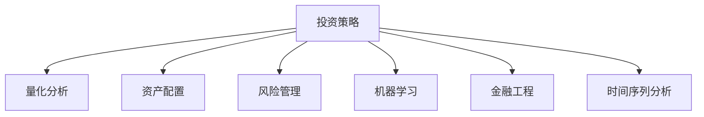

                 

# 理解洞察力的应用：在投资领域的策略实践

> 关键词：投资策略, 洞察力, 量化分析, 资产配置, 风险管理, 机器学习, 金融工程

## 1. 背景介绍

### 1.1 问题由来

随着金融市场的复杂性不断提升，投资者面临着更多的不确定性。传统基于经验和感觉的投资决策方式已无法适应新形势。量化投资策略通过数据驱动的洞察力，帮助投资者更准确地预测市场变化，从而做出更优的投资决策。

量化投资策略的核心在于数据挖掘和模型构建，其中洞察力是一个重要的概念。洞察力指的是在数据中发现隐藏的、可能影响投资结果的模式和规律的能力。借助强大的洞察力，量化投资策略可以充分利用历史数据，预测未来趋势，从而获得超额收益。

### 1.2 问题核心关键点

- 投资决策的精准度：洞察力的应用直接关系到投资策略的精准度。精准的洞察力可以帮助投资者准确预测市场走势，从而做出更为稳健的投资决策。
- 数据分析的深度：洞察力不仅涉及对历史数据的分析，还需要对数据的深度挖掘，如文本情感分析、时间序列预测等，以提高预测的准确性。
- 模型构建的灵活性：洞察力要求投资者具备构建灵活、高效的量化模型的能力，能够针对不同市场情况进行策略调整。
- 风险管理的科学性：洞察力应用过程中，需要科学地识别和管理投资风险，避免因错误预测导致的损失。
- 持续改进的动态性：洞察力是一个动态的过程，投资者需要根据市场变化不断调整策略，以应对新的挑战。

### 1.3 问题研究意义

洞察力在量化投资策略中的应用，具有重要的理论和实践意义：

1. 提高投资精准度：通过洞察力，投资者可以更准确地预测市场变化，降低决策的盲目性。
2. 优化资产配置：洞察力帮助识别市场的结构性变化，指导投资者进行更有效的资产配置。
3. 科学管理风险：洞察力应用过程中，需要建立科学的风险管理机制，降低投资风险。
4. 持续提升收益：洞察力使得投资策略更具前瞻性和适应性，有助于长期获得稳定的超额收益。

## 2. 核心概念与联系

### 2.1 核心概念概述

为了更好地理解洞察力在投资策略中的应用，我们首先介绍几个密切相关的核心概念：

- **投资策略**：指投资者在投资过程中采用的决策规则和策略，包括股票、债券、期权等金融产品的配置和操作。
- **量化分析**：使用数学和统计方法，通过数据挖掘和建模对市场进行分析，辅助投资决策。
- **资产配置**：根据投资目标和风险承受能力，将资金合理分配到不同的资产类别中，以实现优化收益和风险管理。
- **风险管理**：识别和控制投资风险的过程，包括风险评估、风险分散和风险对冲等。
- **机器学习**：一种数据驱动的学习方法，通过构建模型从数据中学习规律，用于预测和决策。
- **金融工程**：运用数学和工程方法解决金融问题的技术，包括衍生品定价、风险对冲等。
- **时间序列分析**：分析时间序列数据，识别趋势、周期性和季节性等特征，用于预测未来变化。

这些概念之间的逻辑关系可以通过以下Mermaid流程图来展示：



这个流程图展示了投资策略中的各个环节及其相互关系：

1. **量化分析**和**机器学习**为投资策略提供了数据支持和模型构建。
2. **资产配置**和**风险管理**是投资策略的实施和执行环节。
3. **金融工程**和**时间序列分析**为投资策略提供了技术支持，如衍生品定价和趋势预测。

## 3. 核心算法原理 & 具体操作步骤

### 3.1 算法原理概述

洞察力在量化投资策略中的应用，主要通过构建和训练机器学习模型来实现。算法原理包括以下几个关键点：

1. **数据收集与预处理**：从金融市场和相关经济指标中收集历史数据，并进行清洗、归一化和特征工程等预处理操作。
2. **模型训练与优化**：使用机器学习算法（如回归、分类、聚类等）构建模型，并使用训练集进行模型训练和优化。
3. **特征提取与选择**：从大量数据中提取关键特征，并使用特征选择技术提高模型性能。
4. **模型评估与验证**：使用测试集评估模型性能，进行交叉验证，确保模型的泛化能力。
5. **策略实施与调整**：将训练好的模型应用于投资决策，并根据市场变化进行动态调整。

### 3.2 算法步骤详解

以下是量化投资策略中洞察力应用的具体步骤：

**Step 1: 数据收集与预处理**

1. **数据源选择**：选择相关的金融市场数据、宏观经济指标等作为数据源，包括股票、债券、商品、外汇等。
2. **数据清洗**：删除缺失值、异常值和重复数据，确保数据质量。
3. **数据归一化**：将不同数据来源的数据归一化为相同的度量单位，如将价格数据转换为标准化分数。
4. **特征工程**：根据领域知识，提取和构造关键特征，如移动平均线、波动率等。

**Step 2: 模型训练与优化**

1. **选择模型**：根据投资目标和数据类型选择合适的机器学习模型，如回归模型（如ARIMA）、分类模型（如SVM）等。
2. **模型训练**：使用历史数据对模型进行训练，优化模型的参数和结构。
3. **模型验证**：在验证集上评估模型性能，调整模型参数，避免过拟合。
4. **模型优化**：使用正则化、集成学习等技术进一步优化模型性能。

**Step 3: 特征提取与选择**

1. **特征提取**：使用统计方法和算法提取关键特征，如技术指标、财务指标等。
2. **特征选择**：使用特征选择技术（如LASSO、PCA等）选择最具预测能力的特征，降低维度。
3. **特征组合**：通过特征组合和构造，构建更具区分度的特征组合，如多维度组合、时序特征组合等。

**Step 4: 模型评估与验证**

1. **性能评估**：使用均方误差（MSE）、平均绝对误差（MAE）等指标评估模型预测能力。
2. **交叉验证**：使用K折交叉验证技术，确保模型在多个子集上的泛化能力。
3. **回测验证**：在历史数据上回测模型性能，验证模型的稳健性。

**Step 5: 策略实施与调整**

1. **策略构建**：根据模型预测结果，构建量化投资策略，如基于均值-方差优化的资产配置策略。
2. **策略执行**：在实际投资中执行量化策略，根据市场变化动态调整。
3. **风险控制**：根据市场情况和模型预测结果，动态调整仓位和风险控制措施，降低投资风险。

### 3.3 算法优缺点

洞察力在量化投资策略中的应用具有以下优点：

1. **客观性**：基于数据驱动的分析，减少主观偏见，提高决策的客观性。
2. **准确性**：通过模型训练和优化，提高预测的准确性，降低人为错误。
3. **高效率**：自动化的数据分析和模型构建，提高投资决策的速度和效率。
4. **可扩展性**：可以轻松扩展到多个资产类别和市场，适应不同的投资场景。

但同时也存在一些局限性：

1. **数据依赖**：模型的性能依赖于高质量的数据，数据不足或噪声较多会影响模型效果。
2. **模型复杂性**：构建复杂的模型需要较长的训练时间和较高的计算资源，增加实施难度。
3. **市场变化**：市场环境的变化可能导致模型失效，需要进行定期更新和优化。
4. **技术门槛**：需要具备数据科学、统计学、金融工程等跨学科的知识，有一定技术门槛。

### 3.4 算法应用领域

洞察力在量化投资策略中的应用，广泛涉及以下几个领域：

1. **股票投资**：通过量化分析，识别市场趋势和个股机会，进行股票组合构建和动态调整。
2. **债券投资**：使用机器学习模型预测债券价格走势，进行债券组合优化和风险管理。
3. **外汇投资**：使用时间序列分析模型预测外汇汇率变化，进行外汇交易策略优化。
4. **商品投资**：通过机器学习模型预测商品价格，构建商品组合，进行套利和风险管理。
5. **风险管理**：使用洞察力识别和评估投资风险，建立风险对冲和分散策略。
6. **资产配置**：根据洞察力分析，优化资产配置，提高投资组合的收益和风险控制能力。

## 4. 数学模型和公式 & 详细讲解

### 4.1 数学模型构建

为了更好地理解洞察力在量化投资策略中的应用，我们首先介绍一些常用的数学模型和公式：

- **时间序列模型**：如ARIMA模型，用于预测金融市场时间序列数据的变化趋势。
- **回归模型**：如线性回归、岭回归等，用于建立变量之间的线性关系。
- **分类模型**：如SVM、决策树等，用于预测金融资产的分类（如正股、负股）。
- **聚类模型**：如K-Means、层次聚类等，用于将金融数据进行分组分析。

### 4.2 公式推导过程

以下以线性回归模型为例，介绍其推导过程。

假设有一个线性回归模型 $y = \beta_0 + \beta_1 x_1 + \beta_2 x_2 + \epsilon$，其中 $y$ 为因变量，$x_1, x_2$ 为自变量，$\beta_0, \beta_1, \beta_2$ 为模型系数，$\epsilon$ 为误差项。

最小二乘法（OLS）用于估计模型系数 $\beta$，其目标是最小化残差平方和 $\sum (y_i - \hat{y}_i)^2$。推导过程如下：

1. 计算预测值 $\hat{y}_i = \beta_0 + \beta_1 x_{1,i} + \beta_2 x_{2,i}$。
2. 计算残差 $\epsilon_i = y_i - \hat{y}_i$。
3. 最小化残差平方和 $\sum \epsilon_i^2$。

通过求解该最小化问题，得到系数 $\beta$ 的估计值 $\hat{\beta}$。具体公式为：

$$
\hat{\beta} = (\mathbf{X}^T \mathbf{X})^{-1} \mathbf{X}^T \mathbf{y}
$$

其中 $\mathbf{X}$ 为自变量矩阵，$\mathbf{y}$ 为因变量向量。

### 4.3 案例分析与讲解

以股票市场预测为例，展示洞察力在量化投资策略中的应用：

**案例背景**：某基金公司希望通过洞察力分析，预测股票市场的变化趋势，并构建相应的量化投资策略。

**数据准备**：收集股票市场的历史数据，包括股票价格、成交量、市场情绪等指标。

**模型构建**：使用线性回归模型，将股票价格预测值作为因变量，其他指标作为自变量。

**参数优化**：使用最小二乘法估计模型参数，并进行交叉验证，确保模型的泛化能力。

**策略实施**：根据模型预测结果，构建股票投资策略，如买入预测价格上涨的股票。

**效果评估**：在历史数据上进行回测，评估策略的收益和风险。

## 5. 项目实践：代码实例和详细解释说明

### 5.1 开发环境搭建

在进行量化投资策略的开发前，我们需要准备好开发环境。以下是使用Python进行Pandas和Scikit-learn开发的环境配置流程：

1. 安装Anaconda：从官网下载并安装Anaconda，用于创建独立的Python环境。

2. 创建并激活虚拟环境：
```bash
conda create -n quant-env python=3.8 
conda activate quant-env
```

3. 安装Pandas：
```bash
pip install pandas
```

4. 安装Scikit-learn：
```bash
pip install scikit-learn
```

5. 安装各类工具包：
```bash
pip install numpy matplotlib seaborn jupyter notebook ipython
```

完成上述步骤后，即可在`quant-env`环境中开始量化投资策略的开发。

### 5.2 源代码详细实现

这里我们以股票市场预测为例，展示使用Pandas和Scikit-learn进行量化投资策略开发的代码实现。

首先，定义数据处理函数：

```python
import pandas as pd
from sklearn.model_selection import train_test_split
from sklearn.linear_model import LinearRegression
from sklearn.metrics import mean_squared_error

def load_data(file_path):
    data = pd.read_csv(file_path)
    X = data.drop(['price'], axis=1)
    y = data['price']
    return X, y

def split_data(X, y, test_size=0.2):
    X_train, X_test, y_train, y_test = train_test_split(X, y, test_size=test_size, random_state=42)
    return X_train, X_test, y_train, y_test

def train_model(X_train, y_train):
    model = LinearRegression()
    model.fit(X_train, y_train)
    return model

def evaluate_model(model, X_test, y_test):
    y_pred = model.predict(X_test)
    mse = mean_squared_error(y_test, y_pred)
    return mse
```

然后，定义投资策略构建函数：

```python
def build_strategy(model, X_test, y_test):
    y_pred = model.predict(X_test)
    threshold = 0.5
    buy_list = [1 if y > threshold else 0 for y in y_pred]
    sell_list = [0 if y > threshold else 1 for y in y_pred]
    return buy_list, sell_list
```

最后，启动训练流程并在测试集上评估：

```python
data_path = 'stock_data.csv'

X, y = load_data(data_path)
X_train, X_test, y_train, y_test = split_data(X, y)

model = train_model(X_train, y_train)
mse = evaluate_model(model, X_test, y_test)

buy_list, sell_list = build_strategy(model, X_test, y_test)
print(f'Mean Squared Error: {mse:.4f}')

print('Buy List:', buy_list)
print('Sell List:', sell_list)
```

以上就是使用Pandas和Scikit-learn进行股票市场预测的量化投资策略开发的完整代码实现。可以看到，得益于Python的数据分析库，量化策略的开发变得简洁高效。

### 5.3 代码解读与分析

让我们再详细解读一下关键代码的实现细节：

**load_data函数**：
- 读取CSV格式的数据文件，并将其分为特征和目标变量。

**split_data函数**：
- 使用train_test_split函数，将数据集分为训练集和测试集。

**train_model函数**：
- 构建线性回归模型，并在训练集上训练。

**evaluate_model函数**：
- 使用均方误差（MSE）评估模型在测试集上的性能。

**build_strategy函数**：
- 根据模型预测结果，构建买入和卖出信号。

**启动训练流程**：
- 加载数据集，分割数据集，训练模型，评估模型性能，构建策略信号。

可以看到，量化投资策略的开发是一个数据驱动的过程，需要从数据处理、模型构建、策略实施等多个环节进行综合考虑，才能构建出有效的量化模型。

## 6. 实际应用场景

### 6.1 智能投顾

量化投资策略的洞察力应用，可以构建智能投顾系统，为投资者提供个性化的投资建议。智能投顾系统通过分析市场数据，结合用户的风险偏好和投资目标，动态调整投资组合，优化收益和风险管理。

具体而言，智能投顾系统可以通过以下步骤实现：

1. **数据收集**：收集用户的投资偏好、风险承受能力等数据。
2. **洞察力分析**：分析市场数据，预测市场趋势和个股机会。
3. **策略构建**：根据用户偏好和市场分析结果，构建量化投资策略。
4. **动态调整**：根据市场变化和用户反馈，动态调整投资组合和策略。

智能投顾系统可以显著降低投资者的时间和精力成本，提高投资决策的科学性和精准性。

### 6.2 高频交易

量化投资策略的洞察力应用，还可以在高频交易中发挥重要作用。高频交易需要快速分析和响应市场变化，洞察力应用可以帮助算法迅速识别市场机会，进行高频操作。

具体而言，高频交易可以通过以下步骤实现：

1. **数据收集**：收集市场交易数据、订单簿数据等。
2. **洞察力分析**：分析市场趋势和订单流动情况，识别套利机会。
3. **策略构建**：构建高频交易策略，如跨市场套利、市场流动套利等。
4. **实时执行**：根据策略信号，实时执行交易操作。

高频交易需要快速分析和响应市场变化，洞察力应用可以帮助算法迅速识别市场机会，进行高频操作。

### 6.3 资产配置

量化投资策略的洞察力应用，还可以在资产配置中发挥重要作用。资产配置是投资组合管理的关键环节，需要结合市场分析、风险管理等多方面的洞察力，构建科学的配置方案。

具体而言，资产配置可以通过以下步骤实现：

1. **数据收集**：收集市场数据、经济指标等。
2. **洞察力分析**：分析市场趋势、行业动态、宏观经济环境等，识别配置机会。
3. **策略构建**：构建资产配置策略，如多资产组合优化、风险对冲等。
4. **动态调整**：根据市场变化和策略效果，动态调整配置方案。

资产配置需要科学地识别和控制投资风险，洞察力应用可以帮助构建科学的配置方案，优化收益和风险管理。

## 7. 工具和资源推荐

### 7.1 学习资源推荐

为了帮助开发者系统掌握量化投资策略的理论基础和实践技巧，这里推荐一些优质的学习资源：

1. 《量化投资策略》系列书籍：由量化投资专家撰写，全面介绍了量化投资的理论和实践，包括洞察力的应用。
2. Coursera《量化金融》课程：斯坦福大学开设的量化金融课程，涵盖量化投资、机器学习等前沿话题。
3. 《Python金融量化分析》书籍：介绍使用Python进行金融量化分析的实用技巧，包括洞察力的应用。
4. Kaggle量化金融竞赛：提供大量量化投资竞赛数据集，实践洞察力在投资策略中的应用。
5. QuantConnect平台：提供量化交易的模拟平台，体验和验证投资策略的效果。

通过对这些资源的学习实践，相信你一定能够快速掌握量化投资策略的精髓，并用于解决实际的投资问题。

### 7.2 开发工具推荐

高效的开发离不开优秀的工具支持。以下是几款用于量化投资策略开发的常用工具：

1. Jupyter Notebook：用于数据分析、模型构建和策略回测的交互式编程环境。
2. QuantConnect：提供量化交易的模拟平台，方便开发者进行策略验证和优化。
3. Backtrader：提供历史数据回测和策略评估工具，支持多种量化分析方法。
4. Alpaca：提供真实的股票交易接口，支持高频交易和量化投资策略的实时测试。

合理利用这些工具，可以显著提升量化投资策略的开发效率，加快创新迭代的步伐。

### 7.3 相关论文推荐

量化投资策略的发展源于学界的持续研究。以下是几篇奠基性的相关论文，推荐阅读：

1. "A Review of Deep Learning Methods for Finance and Economics"（深度学习在金融与经济中的应用综述）：综述了深度学习在量化投资中的应用，包括洞察力应用。
2. "Quantitative Equity Strategies"（量化股票策略）：介绍了多种量化股票策略，包括基于洞察力的策略。
3. "Portfolio Optimization with Deep Learning"（深度学习在资产配置中的应用）：展示了深度学习在资产配置中的应用，如何利用洞察力优化组合。
4. "High-Frequency Trading with Deep Learning"（深度学习在高频交易中的应用）：介绍了深度学习在高频交易中的应用，如何利用洞察力识别市场机会。
5. "Natural Language Processing in Finance"（金融中的自然语言处理）：展示了自然语言处理在金融分析中的应用，如何利用洞察力分析新闻和社交媒体数据。

这些论文代表了大量化投资策略的发展脉络。通过学习这些前沿成果，可以帮助研究者把握学科前进方向，激发更多的创新灵感。

## 8. 总结：未来发展趋势与挑战

### 8.1 总结

本文对基于洞察力的量化投资策略进行了全面系统的介绍。首先阐述了洞察力在量化投资策略中的重要性，明确了洞察力在提高投资精准度、优化资产配置和风险管理方面的独特价值。其次，从原理到实践，详细讲解了洞察力在量化投资策略中的应用流程，给出了量化投资策略开发的完整代码实例。同时，本文还广泛探讨了洞察力在智能投顾、高频交易、资产配置等多个领域的应用前景，展示了洞察力在量化投资中的巨大潜力。最后，本文精选了量化投资策略的学习资源，力求为读者提供全方位的技术指引。

通过本文的系统梳理，可以看到，基于洞察力的量化投资策略正在成为量化投资的重要范式，极大地提升了投资决策的科学性和精准性。未来，伴随洞察力应用的持续演进，量化投资策略将变得更加智能化、普适化，为投资者带来更多的投资机会和收益。

### 8.2 未来发展趋势

展望未来，量化投资策略的洞察力应用将呈现以下几个发展趋势：

1. **多模态数据融合**：量化投资策略将逐步引入多模态数据（如新闻、社交媒体、财务报告等），利用不同的数据源进行洞察力分析，提高预测的全面性和准确性。
2. **深度学习应用**：深度学习模型在量化投资策略中的应用将越来越广泛，利用更复杂的模型结构提高预测能力。
3. **实时数据处理**：量化投资策略将更加注重实时数据处理和分析，提高策略的动态性和适应性。
4. **AI辅助决策**：AI技术在量化投资策略中的应用将越来越普及，辅助投资者进行更科学的决策。
5. **自动化交易**：量化投资策略将结合自动化交易技术，实现高频率、高效率的交易操作。
6. **跨领域应用**：量化投资策略的应用将逐步扩展到其他领域，如商品、外汇、固定收益等。

以上趋势凸显了量化投资策略在金融市场中的重要性，为其未来的发展指明了方向。这些方向的探索发展，必将进一步提升量化投资策略的性能和应用范围，为投资者带来更多的投资机会和收益。

### 8.3 面临的挑战

尽管量化投资策略的洞察力应用已经取得了显著成果，但在迈向更加智能化、普适化应用的过程中，仍面临诸多挑战：

1. **数据质量问题**：高质量的数据是洞察力分析的基础，但金融市场的噪声和波动性使得数据的获取和处理变得更加复杂。
2. **模型复杂性**：构建复杂的量化模型需要较长的训练时间和较高的计算资源，增加实施难度。
3. **市场变化**：市场环境的变化可能导致模型失效，需要进行定期更新和优化。
4. **技术门槛**：需要具备数据科学、统计学、金融工程等跨学科的知识，有一定技术门槛。
5. **伦理和合规性**：量化投资策略的洞察力应用需要考虑伦理和合规性问题，避免误导和滥用。

正视这些挑战，积极应对并寻求突破，将是大量化投资策略迈向成熟的必由之路。相信随着学界和产业界的共同努力，这些挑战终将一一被克服，洞察力在量化投资策略中的应用将变得更加广泛和深入。

### 8.4 研究展望

面向未来，大量化投资策略的研究需要在以下几个方面寻求新的突破：

1. **多模态数据的整合**：探索将多模态数据进行整合，提高洞察力的全面性和准确性。
2. **跨领域模型的构建**：研究跨领域的量化模型，提高策略的普适性和适应性。
3. **实时算法的优化**：开发实时算法的优化技术，提高策略的动态性和响应速度。
4. **AI辅助决策的深化**：探索AI技术在量化投资策略中的应用，提高决策的科学性和精准性。
5. **模型复杂度的简化**：开发更简洁、高效的量化模型，降低实施难度和计算资源消耗。
6. **伦理和合规性的保障**：研究量化投资策略的伦理和合规性问题，确保策略的应用符合法规和道德规范。

这些研究方向将推动量化投资策略的进一步发展，为投资者带来更多的投资机会和收益，同时也需要关注其伦理和合规性问题，确保策略的公正性和安全性。

## 9. 附录：常见问题与解答

**Q1：量化投资策略是否适用于所有投资者？**

A: 量化投资策略在大多数投资者中都有一定的适用性，特别是在高风险和高收益偏好的投资者中。但需要注意的是，量化投资策略依赖于数据驱动，对于缺乏数据基础或者不愿意承担较高风险的投资者，可能不太适用。

**Q2：量化投资策略的洞察力应用需要注意哪些问题？**

A: 量化投资策略的洞察力应用需要注意以下问题：
1. 数据质量：确保数据来源可靠、数据清洗和处理到位。
2. 模型选择：选择合适的模型，避免过度复杂和过度拟合。
3. 参数调整：合理调整模型参数，避免过拟合和欠拟合。
4. 风险控制：建立科学的风险管理机制，避免因错误预测导致的损失。
5. 回测验证：在历史数据上进行回测，验证策略的稳健性。

**Q3：量化投资策略的洞察力应用需要哪些技术支持？**

A: 量化投资策略的洞察力应用需要以下技术支持：
1. 数据处理：数据清洗、归一化、特征工程等。
2. 模型构建：回归模型、分类模型、聚类模型等。
3. 模型优化：正则化、集成学习等。
4. 实时处理：数据流处理、高频率交易等。
5. 策略回测：历史数据回测、模拟交易等。

**Q4：量化投资策略的洞察力应用如何处理数据噪声？**

A: 量化投资策略的洞察力应用可以通过以下方法处理数据噪声：
1. 数据清洗：删除缺失值、异常值和重复数据。
2. 数据归一化：将不同数据来源的数据归一化为相同的度量单位。
3. 特征选择：使用特征选择技术（如LASSO、PCA等）选择最具预测能力的特征。
4. 模型优化：使用正则化技术（如L2正则化、Dropout等）减少模型对噪声的敏感度。
5. 实时处理：实时数据处理和分析，及时发现和处理异常数据。

这些方法可以帮助量化投资策略在数据噪声较多的情况下，仍然保持较高的预测准确性。

---

作者：禅与计算机程序设计艺术 / Zen and the Art of Computer Programming

