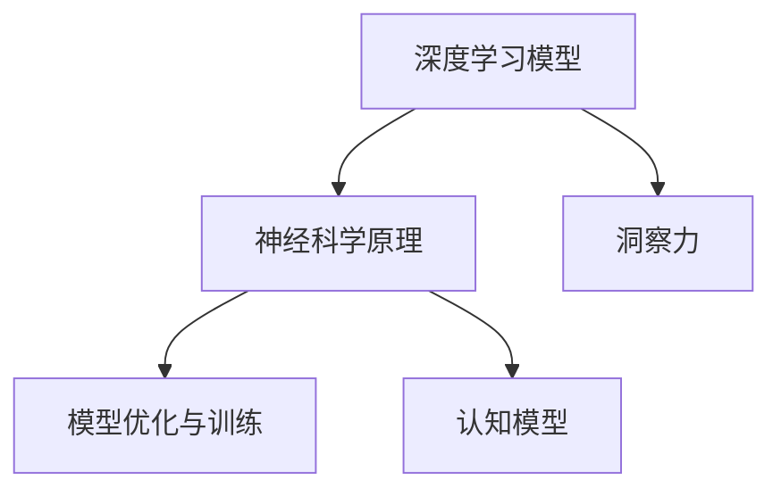

                 

# 理解洞察力的神经科学：揭开认知奥秘

## 1. 背景介绍

### 1.1 问题由来
在人类社会快速发展的今天，洞察力（insight）在各行各业中扮演着至关重要的角色。无论是科学研究、商业决策、艺术创作，还是日常生活中的问题解决，洞察力都体现着人们超越常规、发现规律的能力。然而，这种能力的具体实现机制，一直是一个复杂而富有挑战性的研究课题。

随着人工智能技术的兴起，尤其是深度学习模型的快速发展，我们有机会借助神经科学的原理，更深入地理解洞察力的本质。深度学习模型通过对大量数据的学习，已经能够模拟人类某些认知功能，如视觉识别、语音识别、自然语言处理等。但是，深度学习模型是否能够捕捉到真正的洞察力，这一问题还亟待解决。

### 1.2 问题核心关键点
- **洞察力是什么？** 洞察力是指在信息不完全的情况下，快速识别出深层次的关联、模式和结构，从而进行有效决策和解决问题的能力。
- **深度学习如何模拟洞察力？** 传统的深度学习模型主要是基于模式识别和相关性学习，但无法完全模拟人类洞察力所特有的直觉、抽象和推理能力。
- **神经科学能够提供哪些帮助？** 神经科学在研究人类认知过程中积累了大量经验，提供了关于神经网络运作原理的理论基础。

### 1.3 问题研究意义
研究洞察力的神经科学机制，对于构建具有更高智能水平的AI系统，具有重要意义：

1. **提升AI的决策能力。** 洞察力是深度学习和AI模型进行高效决策的关键。理解和模拟洞察力，有助于提升AI模型在复杂环境中的决策能力。
2. **开发更具创造力的AI。** 洞察力是人类创造性思维的基础，研究其神经科学原理，将为开发更具创造性的AI提供新的路径。
3. **推动认知科学的发展。** 洞察力的研究有助于进一步了解人类认知过程，为心理学、神经科学等领域提供新的理论支持。
4. **应用到更多实际场景。** 洞察力的应用场景广泛，从金融分析、医疗诊断到艺术创作，其原理的理解将为这些领域带来更高效、更创新的解决方案。
5. **增强AI的伦理和可靠性。** 洞察力的研究有助于构建更具有伦理性和可靠性的AI系统，避免偏见和错误决策。

## 2. 核心概念与联系

### 2.1 核心概念概述

为更好地理解深度学习模型模拟洞察力的机制，本节将介绍几个关键概念：

- **深度学习模型**：基于神经网络结构的机器学习模型，通过层次化的非线性变换，对输入数据进行特征提取和模式识别。
- **神经科学原理**：研究神经元间的信号传递、神经网络结构和功能、认知过程的科学，为深度学习模型提供理论基础。
- **洞察力**：指在信息不完全情况下，通过快速识别深层次关联和模式的能力，实现高效的决策和问题解决。
- **模型优化与训练**：通过调整模型参数和优化算法，提高模型在特定任务上的性能。
- **认知模型**：模拟人类认知过程的计算模型，包括感知、记忆、推理等过程。

这些核心概念之间的逻辑关系可以通过以下Mermaid流程图来展示：



这个流程图展示了深度学习模型、神经科学原理、洞察力、模型优化与训练以及认知模型之间的联系和相互作用：

1. 深度学习模型通过神经科学原理，学习数据的深层次特征，获得洞察力。
2. 通过模型优化与训练，提升模型性能。
3. 认知模型模拟人类的认知过程，为深度学习提供理论依据。

## 3. 核心算法原理 & 具体操作步骤
### 3.1 算法原理概述

深度学习模型模拟洞察力的原理主要基于以下几个方面：

1. **神经网络结构与功能**：深度学习模型利用神经网络的多层次结构，通过非线性变换，提取数据中的复杂特征和模式。
2. **反向传播算法**：通过梯度下降算法，模型能够自动调整参数，优化输入数据与输出结果的匹配度。
3. **卷积神经网络（CNN）**：在图像识别等任务中，CNN通过卷积操作提取局部特征，并通过池化操作保持特征的不变性。
4. **递归神经网络（RNN）和长短期记忆网络（LSTM）**：在序列数据处理中，通过递归结构捕捉时间依赖性，实现对序列数据的深层次分析。
5. **注意力机制**：通过注意力机制，模型能够动态地选择重要信息，提升对复杂任务的洞察力。

### 3.2 算法步骤详解

基于深度学习模型的洞察力模拟可以分为以下几个关键步骤：

**Step 1: 模型选择与预训练**

1. **选择模型结构**：根据任务需求，选择合适的神经网络结构，如CNN、RNN、Transformer等。
2. **预训练模型**：在大量无标签数据上预训练模型，使其学习到数据的通用特征和模式。

**Step 2: 数据准备与任务适配**

1. **数据准备**：收集和预处理数据，确保数据质量和分布与任务需求一致。
2. **任务适配**：根据任务需求，设计合适的损失函数和优化器，适配模型以匹配任务。

**Step 3: 模型微调与优化**

1. **微调参数**：在标注数据集上，通过反向传播算法微调模型参数，提升模型性能。
2. **正则化技术**：使用L2正则、Dropout等技术，防止过拟合，提高模型泛化能力。
3. **模型集成**：将多个微调后的模型进行集成，提升模型的鲁棒性和准确性。

**Step 4: 评估与部署**

1. **模型评估**：在测试集上评估模型性能，使用各种指标如精度、召回率、F1值等评估模型。
2. **模型部署**：将模型部署到实际应用环境中，进行大规模推理和预测。
3. **模型监控与更新**：实时监控模型性能，根据反馈数据进行模型更新和优化。

### 3.3 算法优缺点

深度学习模型模拟洞察力的优点包括：

1. **高效特征提取**：通过多层次结构，深度学习模型能够高效地提取数据中的复杂特征和模式。
2. **自适应能力**：基于大量数据预训练，模型能够自适应不同任务和数据分布。
3. **处理大规模数据**：深度学习模型适用于处理大规模数据集，能够在实际应用中产生巨大价值。

深度学习模型模拟洞察力的缺点包括：

1. **数据依赖性高**：深度学习模型依赖大量数据进行训练，数据收集和标注成本较高。
2. **模型复杂度大**：深度学习模型参数量庞大，对计算资源和存储资源要求较高。
3. **泛化能力有限**：深度学习模型在泛化新数据时，容易出现过拟合现象。
4. **缺乏解释性**：深度学习模型通常被视为"黑盒"，难以解释其内部工作机制。

### 3.4 算法应用领域

深度学习模型模拟洞察力的应用领域非常广泛，涵盖了以下几个方面：

1. **自然语言处理（NLP）**：如文本分类、情感分析、机器翻译等任务。
2. **计算机视觉**：如图像识别、目标检测、图像生成等任务。
3. **语音识别**：如语音转文本、语音情感分析等任务。
4. **医疗诊断**：如疾病诊断、医疗影像分析等任务。
5. **金融分析**：如股票价格预测、风险评估等任务。
6. **智能推荐**：如个性化推荐系统、广告投放等任务。
7. **交通管理**：如交通流量预测、事故预警等任务。

## 4. 数学模型和公式 & 详细讲解 & 举例说明
### 4.1 数学模型构建

本节将使用数学语言对深度学习模型模拟洞察力的过程进行更加严格的刻画。

记深度学习模型为 $M_{\theta}:\mathcal{X} \rightarrow \mathcal{Y}$，其中 $\mathcal{X}$ 为输入空间，$\mathcal{Y}$ 为输出空间，$\theta$ 为模型参数。假设任务为分类任务，则模型输出为 $\hat{y}=M_{\theta}(x)$，其中 $x \in \mathcal{X}$ 为输入数据。

定义模型在训练集 $D=\{(x_i, y_i)\}_{i=1}^N$ 上的损失函数为 $\ell(M_{\theta}(x),y)$，则在数据集 $D$ 上的经验风险为：

$$
\mathcal{L}(\theta) = \frac{1}{N} \sum_{i=1}^N \ell(M_{\theta}(x_i),y_i)
$$

其中 $\ell$ 为损失函数，通常为交叉熵损失或均方误差损失等。

### 4.2 公式推导过程

以下我们以二分类任务为例，推导交叉熵损失函数及其梯度的计算公式。

假设模型 $M_{\theta}$ 在输入 $x$ 上的输出为 $\hat{y}=M_{\theta}(x) \in [0,1]$，表示样本属于正类的概率。真实标签 $y \in \{0,1\}$。则二分类交叉熵损失函数定义为：

$$
\ell(M_{\theta}(x),y) = -[y\log \hat{y} + (1-y)\log (1-\hat{y})]
$$

将其代入经验风险公式，得：

$$
\mathcal{L}(\theta) = -\frac{1}{N}\sum_{i=1}^N [y_i\log M_{\theta}(x_i)+(1-y_i)\log(1-M_{\theta}(x_i))]
$$

根据链式法则，损失函数对参数 $\theta_k$ 的梯度为：

$$
\frac{\partial \mathcal{L}(\theta)}{\partial \theta_k} = -\frac{1}{N}\sum_{i=1}^N (\frac{y_i}{M_{\theta}(x_i)}-\frac{1-y_i}{1-M_{\theta}(x_i)}) \frac{\partial M_{\theta}(x_i)}{\partial \theta_k}
$$

其中 $\frac{\partial M_{\theta}(x_i)}{\partial \theta_k}$ 可进一步递归展开，利用自动微分技术完成计算。

### 4.3 案例分析与讲解

在实际应用中，深度学习模型经常用于图像分类任务。下面以手写数字识别为例，解释深度学习模型如何通过多层感知器（MLP）结构，提取数据中的特征和模式，进行分类。

设输入图像 $x$ 为 $28\times28$ 的灰度图像，表示为向量 $\mathbf{x} \in \mathbb{R}^{784}$。模型 $M_{\theta}$ 为多层感知器，包含输入层、多个隐藏层和输出层。隐藏层使用ReLU激活函数，输出层使用Softmax激活函数，进行多分类输出。

假设隐藏层数为 $L$，每个隐藏层的神经元数为 $n_L$，输出层的神经元数为 $10$，对应数字 $0-9$ 的类别。输入层到第一隐藏层的权重矩阵为 $\mathbf{W}_1 \in \mathbb{R}^{n_L \times 784}$，第一隐藏层到第二隐藏层的权重矩阵为 $\mathbf{W}_2 \in \mathbb{R}^{n_L \times n_L}$，以此类推。

首先，对输入图像 $\mathbf{x}$ 进行编码，得到隐藏层的激活值 $\mathbf{h}_1 \in \mathbb{R}^{n_L}$，第二隐藏层的激活值 $\mathbf{h}_2 \in \mathbb{R}^{n_L}$，...，最后输出层的激活值 $\mathbf{z} \in \mathbb{R}^{10}$，表示每个类别的概率分布。

使用交叉熵损失函数进行训练，损失函数为：

$$
\mathcal{L}(\theta) = -\frac{1}{N}\sum_{i=1}^N \sum_{j=0}^{9} y_{ij} \log z_j
$$

其中 $y_{ij}$ 为标签矩阵，$y_{ij}=1$ 表示样本 $i$ 属于第 $j$ 类，$y_{ij}=0$ 表示不属于第 $j$ 类。

训练过程中，使用梯度下降算法，更新模型参数 $\theta$，最小化损失函数 $\mathcal{L}(\theta)$，使得模型能够对新样本进行准确的分类。通过多层感知器的结构，模型能够高效地提取输入图像中的特征和模式，实现对数字的识别。

## 5. 项目实践：代码实例和详细解释说明
### 5.1 开发环境搭建

在进行项目实践前，我们需要准备好开发环境。以下是使用Python进行TensorFlow开发的环境配置流程：

1. 安装Anaconda：从官网下载并安装Anaconda，用于创建独立的Python环境。

2. 创建并激活虚拟环境：
```bash
conda create -n tf-env python=3.8 
conda activate tf-env
```

3. 安装TensorFlow：根据GPU版本，从官网获取对应的安装命令。例如：
```bash
pip install tensorflow
```

4. 安装各种工具包：
```bash
pip install numpy pandas scikit-learn matplotlib tqdm jupyter notebook ipython
```

完成上述步骤后，即可在`tf-env`环境中开始项目实践。

### 5.2 源代码详细实现

这里我们以手写数字识别为例，给出使用TensorFlow进行多层感知器（MLP）模型的PyTorch代码实现。

首先，定义模型结构：

```python
import tensorflow as tf
from tensorflow.keras import layers

# 定义MLP模型
model = tf.keras.Sequential([
    layers.Flatten(input_shape=(28, 28)),
    layers.Dense(128, activation='relu'),
    layers.Dense(10, activation='softmax')
])
```

然后，定义训练和评估函数：

```python
import numpy as np
from tensorflow.keras.datasets import mnist
from sklearn.model_selection import train_test_split

# 加载MNIST数据集
(x_train, y_train), (x_test, y_test) = mnist.load_data()

# 数据预处理
x_train = x_train.reshape(-1, 784) / 255.0
x_test = x_test.reshape(-1, 784) / 255.0

# 数据集分割
x_train, x_val, y_train, y_val = train_test_split(x_train, y_train, test_size=0.2, random_state=42)

# 定义优化器、损失函数和评估指标
optimizer = tf.keras.optimizers.Adam(learning_rate=0.001)
loss_fn = tf.keras.losses.CategoricalCrossentropy()
metrics = [tf.keras.metrics.CategoricalAccuracy()]

# 训练函数
def train(model, data, labels, batch_size, epochs):
    dataset = tf.data.Dataset.from_tensor_slices((data, labels)).shuffle(buffer_size=1000).batch(batch_size)
    for epoch in range(epochs):
        for batch in dataset:
            x, y = batch
            with tf.GradientTape() as tape:
                logits = model(x, training=True)
                loss = loss_fn(y, logits)
            grads = tape.gradient(loss, model.trainable_variables)
            optimizer.apply_gradients(zip(grads, model.trainable_variables))
        print(f'Epoch {epoch+1}, loss={loss_fn(model(x_train), y_train).numpy():.4f}, accuracy={metrics[0](y_train, model(x_train)).numpy():.4f}')

# 评估函数
def evaluate(model, data, labels, batch_size):
    dataset = tf.data.Dataset.from_tensor_slices((data, labels)).batch(batch_size)
    evaluator = tf.keras.metrics.Mean()
    for batch in dataset:
        x, y = batch
        logits = model(x, training=False)
        evaluator.update_state(loss_fn(y, logits))
    return evaluator.result().numpy()

# 训练模型
train(model, x_train, y_train, batch_size=128, epochs=10)

# 评估模型
evaluate(model, x_test, y_test, batch_size=128)
```

以上代码实现了使用TensorFlow进行手写数字识别任务的MLP模型训练和评估。可以看到，TensorFlow提供了丰富的API和工具，可以方便地构建和训练深度学习模型。

### 5.3 代码解读与分析

让我们再详细解读一下关键代码的实现细节：

**模型结构定义**：
- `Flatten`层用于将图像数据展平为一维向量，方便输入到神经网络中。
- `Dense`层用于定义神经网络的隐藏层和输出层。

**数据预处理**：
- 将图像数据归一化到 $[0,1]$ 范围内。
- 使用 `train_test_split` 函数将数据集划分为训练集、验证集和测试集。

**优化器和损失函数**：
- `Adam`优化器是一种常用的自适应学习率优化算法，能够高效地更新模型参数。
- `CategoricalCrossentropy`损失函数用于多分类任务，计算预测结果与真实标签之间的交叉熵损失。

**训练函数和评估函数**：
- `train`函数定义了模型训练过程，包括前向传播、计算梯度、应用梯度等步骤。
- `evaluate`函数用于计算模型在测试集上的性能指标，如损失和准确率。

**训练和评估流程**：
- 定义训练参数和学习率，开始循环迭代训练过程。
- 在每个epoch内，对训练集进行批处理，计算损失和准确率。
- 在每个epoch结束时，输出训练和验证集的性能指标。
- 在训练过程中，可以使用验证集进行早停，避免过拟合。
- 在训练结束后，对测试集进行评估，输出最终性能指标。

以上代码实现展示了TensorFlow的简洁高效和丰富的API，可以帮助开发者快速构建和训练深度学习模型。通过使用TensorFlow，可以更容易地实现深度学习模型的微调，提升模型性能。

## 6. 实际应用场景
### 6.1 金融分析

在金融领域，深度学习模型可以用于股票价格预测、风险评估、投资组合优化等任务。通过对历史金融数据进行预训练，深度学习模型可以学习到数据中的复杂关联和模式，预测未来趋势。

例如，可以收集历史股票价格、交易量、基本面数据等，使用LSTM等序列模型进行训练。在训练过程中，可以加入正则化技术，防止过拟合。训练结束后，将模型用于股票价格预测，通过调整参数和模型结构，提升预测精度。

### 6.2 医疗诊断

在医疗领域，深度学习模型可以用于疾病诊断、医学影像分析等任务。通过收集大量的医学影像和诊断数据，预训练深度学习模型，使其学习到医学影像中的关键特征和模式。

例如，可以收集大量的医疗影像，如X光片、CT扫描、MRI等，使用CNN等图像模型进行训练。在训练过程中，可以加入数据增强技术，增加数据多样性，提升模型泛化能力。训练结束后，将模型用于疾病诊断，通过优化模型参数，提升诊断精度。

### 6.3 智能推荐

在推荐系统领域，深度学习模型可以用于个性化推荐、广告投放等任务。通过对用户的历史行为数据进行预训练，深度学习模型可以学习到用户的兴趣和偏好。

例如，可以收集用户的历史浏览、购买、评分等数据，使用MF（矩阵分解）或DNN（深度神经网络）模型进行训练。在训练过程中，可以加入正则化技术，防止过拟合。训练结束后，将模型用于个性化推荐，通过调整参数和模型结构，提升推荐效果。

## 7. 工具和资源推荐
### 7.1 学习资源推荐

为了帮助开发者系统掌握深度学习模型模拟洞察力的理论基础和实践技巧，这里推荐一些优质的学习资源：

1. **Deep Learning with Python**：Ian Goodfellow、Yoshua Bengio、Aaron Courville所著，详细介绍了深度学习模型的原理和实现。
2. **Neural Networks and Deep Learning**：Michael Nielsen所著，深入浅出地讲解了深度学习模型的基本概念和算法。
3. **CS231n: Convolutional Neural Networks for Visual Recognition**：斯坦福大学开设的计算机视觉课程，介绍了CNN等深度学习模型在图像识别中的应用。
4. **CS224n: Deep Learning for Natural Language Processing**：斯坦福大学开设的自然语言处理课程，介绍了RNN、Transformer等深度学习模型在NLP中的应用。
5. **Fast.ai Deep Learning Specialization**：由Jeremy Howard和Rachel Thomas开发的深度学习课程，涵盖了从入门到高级的各种主题。

通过对这些资源的学习实践，相信你一定能够系统掌握深度学习模型模拟洞察力的原理和技巧，并用于解决实际问题。

### 7.2 开发工具推荐

高效的开发离不开优秀的工具支持。以下是几款用于深度学习模型开发和微调的常用工具：

1. **TensorFlow**：由Google开发的深度学习框架，支持GPU/TPU加速，适用于大规模工程应用。
2. **PyTorch**：由Facebook开发的深度学习框架，灵活性高，适用于研究领域。
3. **MXNet**：由Apache开发的深度学习框架，支持多种语言和多种硬件设备。
4. **Keras**：高层次的深度学习API，基于TensorFlow、Theano、CNTK等后端实现，易于上手。
5. **JAX**：由Google开发的Python深度学习库，支持动态图和静态图，性能高效。

合理利用这些工具，可以显著提升深度学习模型的开发和微调效率，加速创新迭代的步伐。

### 7.3 相关论文推荐

深度学习模型模拟洞察力的研究源于学界的持续探索。以下是几篇奠基性的相关论文，推荐阅读：

1. **ImageNet Classification with Deep Convolutional Neural Networks**：Alex Krizhevsky、Ilya Sutskever、Geoffrey Hinton所著，介绍了CNN在图像分类任务中的应用。
2. **A Tutorial on Sequence Models**：Ian Goodfellow所著，详细介绍了RNN、LSTM等序列模型在序列数据处理中的应用。
3. **Attention is All You Need**：Ashish Vaswani等所著，介绍了Transformer模型在NLP任务中的应用。
4. **Training Neural Networks for B-Tree**：Peter Cachin、Wolfgang Caho等所著，介绍了卷积神经网络在数据压缩中的应用。
5. **Learning Transferable Feature Representations for Zero-Shot and Few-Shot Image Recognition**：Jitendra Malik、Kaiming He等所著，介绍了迁移学习在零样本和少样本学习中的应用。

这些论文代表了深度学习模型模拟洞察力的研究前沿，通过学习这些前沿成果，可以帮助研究者把握学科前进方向，激发更多的创新灵感。

## 8. 总结：未来发展趋势与挑战
### 8.1 总结

本文对深度学习模型模拟洞察力的原理和实践进行了全面系统的介绍。首先阐述了深度学习模型在自然语言处理、计算机视觉、金融分析等领域的广泛应用，展示了其强大的特征提取和模式识别能力。其次，从神经科学原理出发，解释了深度学习模型如何通过多层结构模拟人类的认知过程，获取洞察力。最后，提供了深度学习模型微调的具体步骤和代码实现，展示了其在实际应用中的效果和潜力。

通过本文的系统梳理，可以看到，深度学习模型在模拟洞察力方面具有广阔的应用前景，但其依赖大规模数据、复杂结构和高计算资源的特点，也带来了诸多挑战。

### 8.2 未来发展趋势

展望未来，深度学习模型模拟洞察力的发展趋势将呈现以下几个方向：

1. **自监督学习的应用**：通过自监督学习任务，深度学习模型可以在无标签数据上进行预训练，获取深层次的特征和模式。未来，自监督学习将发挥更加重要的作用，特别是在数据稀缺和标注成本高昂的场景中。
2. **模型结构的创新**：未来将涌现更多新型神经网络结构，如注意力机制、残差连接、门控结构等，提升深度学习模型的性能和鲁棒性。
3. **跨模态学习**：深度学习模型将进一步拓展到跨模态学习，融合视觉、语音、文本等多模态数据，提升对复杂任务的洞察力。
4. **多任务学习**：深度学习模型将进行多任务学习，同时训练多个相关任务，提升模型的泛化能力和适应性。
5. **迁移学习的改进**：未来将出现更多参数高效和计算高效的迁移学习方法，减少对标注数据的需求，提高迁移学习的效果。
6. **解释性研究**：深度学习模型将进一步加强解释性研究，提供更加透明和可解释的推理过程，避免偏见和错误决策。

### 8.3 面临的挑战

尽管深度学习模型模拟洞察力已经取得了显著进展，但在实现人类的直觉、抽象和推理能力方面，还存在诸多挑战：

1. **数据稀缺问题**：深度学习模型依赖大量标注数据进行训练，数据收集和标注成本高昂，特别是在数据稀缺的领域。
2. **计算资源限制**：深度学习模型参数量大，计算复杂度高，对硬件资源要求较高，需要在计算资源和模型性能之间找到平衡。
3. **模型复杂度高**：深度学习模型结构复杂，难以解释其内部工作机制，缺乏可解释性。
4. **鲁棒性和泛化性不足**：深度学习模型在泛化新数据时，容易出现过拟合现象，鲁棒性和泛化能力有待提升。
5. **伦理和安全性问题**：深度学习模型可能学习到有害信息和偏见，需要从数据和算法层面进行控制，确保输出符合伦理和安全要求。

### 8.4 研究展望

面对深度学习模型模拟洞察力所面临的诸多挑战，未来的研究需要在以下几个方面寻求新的突破：

1. **自监督学习的进一步发展**：探索更多自监督学习任务和算法，提高无标签数据的利用效率，减少对标注数据的依赖。
2. **模型结构的优化**：开发更加高效、鲁棒和可解释的神经网络结构，提升深度学习模型的性能和可靠性。
3. **跨模态学习的研究**：进一步拓展深度学习模型的应用范围，融合多模态数据，提升对复杂任务的洞察力。
4. **迁移学习的优化**：开发更多参数高效和计算高效的迁移学习方法，减少对标注数据的需求，提高迁移学习的效果。
5. **解释性研究**：加强深度学习模型的解释性研究，提供更加透明和可解释的推理过程，增强模型的可信度和可靠性。
6. **伦理和安全性研究**：建立深度学习模型的伦理和安全框架，从数据和算法层面进行控制，确保输出符合伦理和安全要求。

这些研究方向将引领深度学习模型模拟洞察力技术的进一步发展，为构建更加智能和可信的AI系统提供新的路径。面向未来，深度学习模型模拟洞察力技术的创新和发展，必将为人工智能的落地应用带来新的突破，推动人类认知智能的进步。

## 9. 附录：常见问题与解答

**Q1：深度学习模型模拟洞察力是否适用于所有领域？**

A: 深度学习模型在自然语言处理、计算机视觉、金融分析等领域已经取得了显著进展，展示了其强大的特征提取和模式识别能力。但是对于一些特定的领域，如医学、法律等，深度学习模型可能无法很好地适应。此时需要在特定领域语料上进一步预训练，再进行微调，才能获得理想效果。

**Q2：深度学习模型模拟洞察力是否需要大量标注数据？**

A: 深度学习模型依赖大量标注数据进行训练，以获取深层次的特征和模式。数据标注成本较高，特别是在数据稀缺的领域。未来，自监督学习任务的应用将进一步减少对标注数据的依赖，提高深度学习模型的泛化能力和鲁棒性。

**Q3：深度学习模型模拟洞察力的计算资源需求如何？**

A: 深度学习模型参数量大，计算复杂度高，对硬件资源要求较高。未来的研究将进一步优化模型结构和计算图，减少计算资源消耗，提升推理速度和效率。

**Q4：深度学习模型模拟洞察力的可解释性如何？**

A: 深度学习模型通常被视为"黑盒"，难以解释其内部工作机制和推理过程。未来，将加强深度学习模型的解释性研究，提供更加透明和可解释的推理过程，增强模型的可信度和可靠性。

**Q5：深度学习模型模拟洞察力如何应用于多任务学习？**

A: 深度学习模型可以进行多任务学习，同时训练多个相关任务，提升模型的泛化能力和适应性。在多任务学习中，可以使用联合训练、共享权重等方法，提高模型的多任务性能。

通过本文的系统梳理，可以看到，深度学习模型在模拟洞察力方面具有广阔的应用前景，但其依赖大规模数据、复杂结构和高计算资源的特点，也带来了诸多挑战。未来的研究需要在数据、模型、算法、硬件等多个维度进行全面探索和优化，才能实现深度学习模型在各个领域中的高效应用，真正实现人类的直觉、抽象和推理能力。

---

作者：禅与计算机程序设计艺术 / Zen and the Art of Computer Programming

