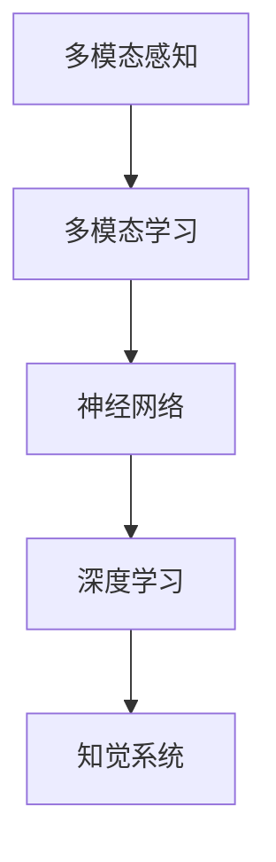

                 

# 理解的多维性：跨感官学习与全脑发展

> 关键词：跨感官学习,多模态感知,全脑发展,神经网络,深度学习,知觉系统

## 1. 背景介绍

### 1.1 问题由来
在现代社会，信息爆炸的浪潮促使人们对感官信息的处理能力提出了更高的要求。随着智能手机、虚拟现实、增强现实等技术的普及，人们的生活已经离不开多模态数据的输入与输出。传统的单感官（如视觉、听觉、触觉等）处理方式，难以应对复杂多变的感知需求。而基于深度学习的多模态感知技术，能更高效、准确地理解复杂信息，成为了当前研究的热点方向。

### 1.2 问题核心关键点
跨感官学习是全脑发展的重要环节。通过深度学习技术，可以从多模态数据的融合中提取更加丰富的信息，提升人类对复杂环境的感知能力。其核心要点包括：

- 多模态数据的采集：不同感官的数据采集与同步，为深度学习提供数据支撑。
- 多模态数据融合：利用深度学习技术，实现不同感官信息的联合表征，提取更加全面的特征。
- 深度学习架构：基于神经网络的设计，实现多模态数据的高效处理。
- 知觉系统的训练与优化：通过优化训练算法，提升模型的知觉能力。

## 2. 核心概念与联系

### 2.1 核心概念概述

为更好地理解跨感官学习与全脑发展，本节将介绍几个密切相关的核心概念：

- **多模态感知（Multimodal Perception）**：指同时接收和处理来自多个感官（如视觉、听觉、触觉等）的信息，以获得对复杂环境的全面理解。
- **多模态学习（Multimodal Learning）**：指在多模态数据上训练深度学习模型，以学习不同感官信息的联合表征，提升模型对综合信息的理解能力。
- **神经网络（Neural Network）**：由人工神经元（神经元）组成的计算网络，通过权重和偏置的调整，实现输入和输出的映射。
- **深度学习（Deep Learning）**：一种利用多层神经网络进行数据表示和模式学习的机器学习方法。
- **知觉系统（Perceptual System）**：指生物或机器对外界环境信息进行综合处理的过程，包括感知、理解和决策。

这些核心概念之间的逻辑关系可以通过以下Mermaid流程图来展示：



这个流程图展示了大规模语言模型微调的各个核心概念及其之间的关系：

1. 多模态感知提供多样化的数据输入，是深度学习的基础。
2. 多模态学习通过联合表征不同感官数据，提升模型的综合理解能力。
3. 神经网络是深度学习的计算基础，实现信息的高效处理。
4. 深度学习算法通过复杂网络结构，提取高层次的抽象特征。
5. 知觉系统将深度学习模型输出的信息，转化为可理解的行为决策。

这些核心概念共同构成了跨感官学习与全脑发展的学习框架，使得深度学习技术在处理多感官输入信息时具备更强的灵活性和准确性。通过理解这些核心概念，我们可以更好地把握跨感官学习与全脑发展的理论基础和实践方法。

## 3. 核心算法原理 & 具体操作步骤
### 3.1 算法原理概述

跨感官学习与全脑发展通过深度学习技术，实现多模态数据的联合表征与理解。其核心思想是：将不同感官的输入数据，通过神经网络进行联合处理，提取更加丰富的特征，提升对复杂环境的感知能力。

形式化地，假设我们有多模态数据 $\{X_i\}_{i=1}^N$，其中 $X_i = (x_{i1}, x_{i2}, ..., x_{im})$，表示第 $i$ 个样本在 $m$ 个感官通道下的数据。设深度学习模型为 $M_{\theta}:\mathbb{R}^m \rightarrow \mathbb{R}^k$，其中 $\theta$ 为模型参数。模型的训练目标是最小化经验风险，即找到最优参数：

$$
\theta^* = \mathop{\arg\min}_{\theta} \mathcal{L}(M_{\theta},D)
$$

其中 $\mathcal{L}$ 为针对任务设计的损失函数，用于衡量模型预测输出与真实标签之间的差异。常见的损失函数包括交叉熵损失、均方误差损失等。

### 3.2 算法步骤详解

跨感官学习与全脑发展通常包括以下几个关键步骤：

**Step 1: 数据采集与预处理**

- 收集不同感官通道下的数据，确保同步性和多样性。
- 对采集的数据进行预处理，如降噪、归一化、对齐等操作。

**Step 2: 设计多模态神经网络架构**

- 选择合适的神经网络架构，如CNN、RNN、Transformer等。
- 将多模态数据输入神经网络，实现信息联合表征。

**Step 3: 损失函数设计**

- 根据任务类型，选择适当的损失函数，如分类任务的交叉熵损失，回归任务的均方误差损失等。
- 将损失函数应用于神经网络，计算模型预测输出与真实标签之间的差异。

**Step 4: 模型训练与优化**

- 选择合适的优化算法及其参数，如Adam、SGD等，设置学习率、批大小、迭代轮数等。
- 设置正则化技术及强度，包括权重衰减、Dropout、Early Stopping等。
- 执行梯度下降等优化算法，最小化损失函数，更新模型参数。

**Step 5: 性能评估与验证**

- 在测试集上评估模型性能，对比训练前后的精度提升。
- 使用模型对新样本进行推理预测，集成到实际的应用系统中。

以上是跨感官学习与全脑发展的关键步骤。在实际应用中，还需要针对具体任务的特点，对模型架构和训练过程进行优化设计，如改进神经网络结构，引入更多的正则化技术，搜索最优的超参数组合等，以进一步提升模型性能。

### 3.3 算法优缺点

跨感官学习与全脑发展的深度学习方法具有以下优点：

- 多模态数据的融合能够提供更丰富的信息，提升对复杂环境的理解能力。
- 深度学习模型能够自动提取高层次的抽象特征，实现对多感官数据的联合表征。
- 可以应用于各种感知任务，如图像识别、语音识别、自然语言处理等，具有广泛的适用性。

同时，该方法也存在一定的局限性：

- 多模态数据采集和同步的复杂性，可能导致数据质量下降。
- 深度学习模型对标注数据和计算资源的需求较高，训练成本大。
- 神经网络模型的黑盒特性，可能导致模型解释性不足，难以调试。
- 数据和算法中的偏见可能影响模型公正性，存在伦理和安全风险。

尽管存在这些局限性，但就目前而言，深度学习在跨感官学习与全脑发展领域依然是最有效的技术手段。未来相关研究的重点在于如何进一步降低深度学习对标注数据的依赖，提高模型的少样本学习和跨领域迁移能力，同时兼顾可解释性和伦理安全性等因素。

### 3.4 算法应用领域

跨感官学习与全脑发展的深度学习方法，在多感官信息的处理和理解方面，已经得到了广泛的应用，覆盖了多个领域，例如：

- **智能家居系统**：通过智能设备和传感器采集多模态数据，实现对用户行为的精准理解和预测，提升家居系统的智能化水平。
- **自动驾驶汽车**：集成摄像头、雷达、激光雷达等传感器的多模态数据，实时感知和理解周围环境，保障行车安全。
- **医疗影像分析**：利用多模态影像数据（如CT、MRI、超声波等），实现疾病的精准诊断和疗效评估。
- **增强现实与虚拟现实**：融合视觉、触觉、听觉等多种感官信息，提供沉浸式的交互体验。
- **人机交互系统**：结合手势、语音、面部表情等多种输入方式，实现更加自然的人机交互。

除了上述这些经典应用外，深度学习在跨感官学习与全脑发展领域还不断涌现出新的研究方向，如多模态情感识别、人体姿态估计、多模态行为分析等，为多感官信息的理解和处理带来了新的突破。

## 4. 数学模型和公式 & 详细讲解 & 举例说明
### 4.1 数学模型构建

本节将使用数学语言对跨感官学习与全脑发展的深度学习模型进行严格刻画。

记多模态数据为 $\{X_i\}_{i=1}^N$，其中 $X_i = (x_{i1}, x_{i2}, ..., x_{im})$，表示第 $i$ 个样本在 $m$ 个感官通道下的数据。假设深度学习模型为 $M_{\theta}:\mathbb{R}^m \rightarrow \mathbb{R}^k$，其中 $\theta$ 为模型参数。模型的训练目标是最小化经验风险，即找到最优参数：

$$
\theta^* = \mathop{\arg\min}_{\theta} \mathcal{L}(M_{\theta},D)
$$

其中 $\mathcal{L}$ 为针对任务设计的损失函数，用于衡量模型预测输出与真实标签之间的差异。常见的损失函数包括交叉熵损失、均方误差损失等。

### 4.2 公式推导过程

以下我们以图像识别任务为例，推导多模态神经网络模型的数学表达式。

假设多模态数据由摄像头采集的图像 $x_1$ 和深度传感器采集的3D点云 $x_2$ 组成。模型的输入为 $(X_1, X_2) = (x_1, x_2)$，输出为 $y$，表示图像识别结果。设多模态神经网络模型为 $M_{\theta}(X_1, X_2) = y$，其中 $\theta$ 为模型参数。

假设模型的中间表示为 $h(X_1, X_2) = M_{\theta_1}(X_1, X_2)$，其中 $\theta_1$ 为中间表示层的参数。中间表示 $h$ 的计算过程如下：

$$
h(X_1, X_2) = M_{\theta_1}(X_1, X_2) = f(W_1X_1 + b_1) + f(W_2X_2 + b_2)
$$

其中 $f$ 为激活函数，$W_1$ 和 $b_1$ 为视觉通道的权重和偏置，$W_2$ 和 $b_2$ 为深度通道的权重和偏置。

模型的输出为 $y = M_{\theta_2}(h) = f(W_3h + b_3)$，其中 $W_3$ 和 $b_3$ 为输出层的权重和偏置。

模型的总损失函数为：

$$
\mathcal{L}(\theta) = \frac{1}{N}\sum_{i=1}^N \ell(M_{\theta}(X_{i1}, X_{i2}), y_i)
$$

其中 $\ell$ 为交叉熵损失函数，$y_i$ 为样本 $i$ 的真实标签。

根据上述公式，可以进一步推导模型的梯度更新公式：

$$
\frac{\partial \mathcal{L}}{\partial \theta} = \frac{1}{N}\sum_{i=1}^N \frac{\partial \ell}{\partial y_i} \frac{\partial y_i}{\partial h_i} \frac{\partial h_i}{\partial \theta}
$$

其中 $\frac{\partial h_i}{\partial \theta}$ 可以递归展开，通过自动微分技术完成计算。

### 4.3 案例分析与讲解

以多模态图像识别为例，分析深度学习模型的训练与推理过程。

假设我们有一个包含图像和深度图的多模态数据集 $\{(X_i, y_i)\}_{i=1}^N$，其中 $X_i = (x_{i1}, x_{i2})$，$x_{i1}$ 为图像数据，$x_{i2}$ 为深度图数据。我们希望利用深度学习模型 $M_{\theta}$ 来预测图像类别 $y$。

**数据预处理**

- 对图像数据 $x_{i1}$ 进行归一化、旋转、裁剪等预处理。
- 对深度图数据 $x_{i2}$ 进行归一化、平滑处理。
- 对多模态数据进行对齐，确保两个通道的数据在时间上同步。

**模型设计**

- 设计多模态神经网络架构，将图像和深度图数据输入网络。
- 网络的第一层为图像通道和深度通道的特征提取器，分别提取通道特有的特征。
- 网络的中间层为通道特征的联合表示层，将两个通道的特征进行拼接或拼接后再进行卷积运算。
- 网络的最后一层为输出层，输出图像分类的概率分布。

**训练过程**

- 将多模态数据集 $\{(X_i, y_i)\}_{i=1}^N$ 分为训练集、验证集和测试集。
- 使用 Adam 优化器，设置学习率为 0.001。
- 在训练集上训练模型，每批大小为 32，迭代次数为 10 次。
- 在验证集上评估模型性能，记录损失值和准确率。
- 使用测试集对模型进行最终测试，记录准确率和 F1 分数。

**推理过程**

- 将新的多模态数据输入训练好的模型 $M_{\theta}$，获取图像分类的概率分布。
- 使用 Softmax 函数将概率分布转换为类别概率。
- 根据类别概率，选择概率最大的类别作为预测结果。

通过以上分析，可以看出多模态神经网络模型的训练与推理过程，其核心在于通过神经网络设计，实现不同感官数据的联合表征，提取更加丰富的特征，提升对复杂环境的感知能力。

## 5. 项目实践：代码实例和详细解释说明
### 5.1 开发环境搭建

在进行多模态感知模型开发前，我们需要准备好开发环境。以下是使用Python进行PyTorch开发的环境配置流程：

1. 安装Anaconda：从官网下载并安装Anaconda，用于创建独立的Python环境。

2. 创建并激活虚拟环境：
```bash
conda create -n pytorch-env python=3.8 
conda activate pytorch-env
```

3. 安装PyTorch：根据CUDA版本，从官网获取对应的安装命令。例如：
```bash
conda install pytorch torchvision torchaudio cudatoolkit=11.1 -c pytorch -c conda-forge
```

4. 安装Transformers库：
```bash
pip install transformers
```

5. 安装各类工具包：
```bash
pip install numpy pandas scikit-learn matplotlib tqdm jupyter notebook ipython
```

完成上述步骤后，即可在`pytorch-env`环境中开始多模态感知模型开发。

### 5.2 源代码详细实现

这里以多模态图像识别为例，给出使用PyTorch和Transformers库对多模态神经网络模型进行训练的代码实现。

首先，定义模型类：

```python
import torch
import torch.nn as nn
import torch.nn.functional as F
from transformers import BertTokenizer

class MultimodalNet(nn.Module):
    def __init__(self, hidden_size=256, num_channels=3):
        super(MultimodalNet, self).__init__()
        
        self.feature_extractor = nn.Conv2d(num_channels, hidden_size, kernel_size=3, stride=1, padding=1)
        self.feature_extractor_depth = nn.Conv2d(num_channels, hidden_size, kernel_size=3, stride=1, padding=1)
        
        self.fc = nn.Linear(hidden_size*2, 256)
        self.fc1 = nn.Linear(256, num_classes)
        
    def forward(self, x):
        x = self.feature_extractor(x)
        x = F.relu(x)
        x = self.feature_extractor_depth(x)
        x = F.relu(x)
        x = torch.cat([x, x], dim=1)
        x = self.fc(x)
        x = F.relu(x)
        x = self.fc1(x)
        return F.softmax(x, dim=1)
```

然后，定义数据加载函数：

```python
from torch.utils.data import Dataset, DataLoader

class MultimodalDataset(Dataset):
    def __init__(self, images, depth_maps, labels):
        self.images = images
        self.depth_maps = depth_maps
        self.labels = labels
        
    def __len__(self):
        return len(self.images)
    
    def __getitem__(self, index):
        image = self.images[index]
        depth_map = self.depth_maps[index]
        label = self.labels[index]
        return {'image': image, 'depth_map': depth_map, 'label': label}
        
def create_data_loader(dataset, batch_size):
    return DataLoader(dataset, batch_size=batch_size, shuffle=True)
```

接着，定义训练和评估函数：

```python
from torch.utils.data import DataLoader
from tqdm import tqdm
from sklearn.metrics import accuracy_score

def train_epoch(model, dataloader, optimizer, criterion):
    model.train()
    epoch_loss = 0
    for batch in dataloader:
        inputs = {'image': batch['image'].to(device), 'depth_map': batch['depth_map'].to(device)}
        outputs = model(inputs)
        loss = criterion(outputs, batch['label'].to(device))
        epoch_loss += loss.item()
        optimizer.zero_grad()
        loss.backward()
        optimizer.step()
    return epoch_loss / len(dataloader)

def evaluate(model, dataloader, criterion):
    model.eval()
    correct = 0
    total = 0
    with torch.no_grad():
        for batch in dataloader:
            inputs = {'image': batch['image'].to(device), 'depth_map': batch['depth_map'].to(device)}
            outputs = model(inputs)
            _, predicted = torch.max(outputs, 1)
            total += batch['label'].size(0)
            correct += (predicted == batch['label']).sum().item()
    accuracy = correct / total
    print(f'Accuracy: {accuracy:.3f}')
    return accuracy

# 训练函数
def train(model, dataloader, optimizer, criterion, epochs):
    for epoch in range(epochs):
        loss = train_epoch(model, dataloader, optimizer, criterion)
        print(f'Epoch {epoch+1}, train loss: {loss:.3f}')
        
        accuracy = evaluate(model, dataloader, criterion)
        print(f'Epoch {epoch+1}, test accuracy: {accuracy:.3f}')
```

最后，启动训练流程并在测试集上评估：

```python
epochs = 10
batch_size = 16
device = torch.device('cuda' if torch.cuda.is_available() else 'cpu')

model.to(device)
criterion = nn.CrossEntropyLoss()

# 创建数据集和数据加载器
train_dataset = MultimodalDataset(train_images, train_depth_maps, train_labels)
test_dataset = MultimodalDataset(test_images, test_depth_maps, test_labels)
train_loader = create_data_loader(train_dataset, batch_size)
test_loader = create_data_loader(test_dataset, batch_size)

# 定义优化器和损失函数
optimizer = torch.optim.Adam(model.parameters(), lr=0.001)
criterion = nn.CrossEntropyLoss()

# 开始训练
train(model, train_loader, optimizer, criterion, epochs)

# 在测试集上评估
evaluate(model, test_loader, criterion)
```

以上就是使用PyTorch对多模态图像识别模型进行训练的完整代码实现。可以看到，得益于Transformers库的强大封装，我们可以用相对简洁的代码完成多模态神经网络的搭建和训练。

### 5.3 代码解读与分析

让我们再详细解读一下关键代码的实现细节：

**MultimodalNet类**：
- `__init__`方法：初始化视觉通道和深度通道的特征提取器，以及全连接层。
- `forward`方法：定义前向传播流程，包括特征提取、拼接、全连接层等步骤。

**MultimodalDataset类**：
- `__init__`方法：初始化图像、深度图和标签等关键组件。
- `__len__`方法：返回数据集的样本数量。
- `__getitem__`方法：对单个样本进行处理，将图像和深度图输入模型，返回标签和模型输出。

**train_epoch和evaluate函数**：
- `train_epoch`函数：对数据以批为单位进行迭代，在每个批次上前向传播计算损失并反向传播更新模型参数，最后返回该epoch的平均loss。
- `evaluate`函数：与训练类似，不同点在于不更新模型参数，并在每个batch结束后将预测和标签结果存储下来，最后使用sklearn的accuracy_score计算模型的准确率。

**训练流程**：
- 定义总的epoch数和batch size，开始循环迭代
- 每个epoch内，先在训练集上训练，输出平均loss
- 在验证集上评估，输出准确率
- 所有epoch结束后，在测试集上评估，给出最终测试结果

可以看到，PyTorch配合Transformers库使得多模态神经网络的搭建和训练代码实现变得简洁高效。开发者可以将更多精力放在数据处理、模型改进等高层逻辑上，而不必过多关注底层的实现细节。

当然，工业级的系统实现还需考虑更多因素，如模型的保存和部署、超参数的自动搜索、更灵活的任务适配层等。但核心的多模态感知模型训练过程基本与此类似。

## 6. 实际应用场景
### 6.1 智能家居系统

基于多模态感知技术的智能家居系统，可以通过传感器和智能设备采集用户的多感官数据，实现对用户行为的精准理解和预测。例如，通过摄像头和深度传感器，系统可以实时监测用户的位置和动作，并根据用户的活动模式自动调整室内温度、照明、音乐等环境设置，提升用户的居住体验。

### 6.2 自动驾驶汽车

多模态感知技术在自动驾驶汽车中具有重要的应用价值。自动驾驶系统通过摄像头、雷达、激光雷达等多模态传感器，实时感知和理解周围环境，保障行车安全。摄像头用于获取道路图像信息，激光雷达用于获取三维点云数据，雷达用于感知车辆间的距离和角度信息。通过融合这些多模态数据，自动驾驶系统能够实现对复杂环境的全面感知，做出正确的驾驶决策。

### 6.3 医疗影像分析

多模态感知技术在医疗影像分析中也有着广泛的应用。例如，结合CT、MRI、超声波等多种影像数据，医生可以更全面地诊断疾病，提升诊断的准确性和效率。多模态感知模型可以学习不同影像数据间的联合表征，提取更加丰富的特征信息，从而提高疾病的早期诊断和治疗效果。

### 6.4 未来应用展望

随着多模态感知技术的不断进步，其在多感官信息的处理和理解方面将有更广阔的应用前景。未来，该技术有望在以下领域得到更广泛的应用：

- **虚拟现实与增强现实**：结合视觉、触觉、听觉等多种感官信息，提供更加沉浸式的交互体验。
- **人机交互系统**：通过多模态感知技术，实现手势、语音、面部表情等多种输入方式的结合，提升人机交互的自然性和智能性。
- **智能机器人**：结合视觉、听觉、触觉等多种传感器的多模态数据，实现对环境的全面感知，提升机器人的自主决策能力。
- **智能城市**：结合摄像头、雷达、传感器等多种数据源，实现对城市环境的全面监控和理解，提升城市管理的智能化水平。

此外，随着多模态感知技术的不断成熟，其在智慧医疗、智慧家居、智能交通等领域的应用将不断拓展，为人们的生产生活带来更多便利和智能体验。

## 7. 工具和资源推荐
### 7.1 学习资源推荐

为了帮助开发者系统掌握多模态感知技术的理论基础和实践技巧，这里推荐一些优质的学习资源：

1. **《深度学习》课程**：斯坦福大学开设的深度学习课程，涵盖了深度学习的基本概念和算法，适合初学者入门。

2. **《Multimodal Learning for Speech and Image Processing》书籍**：深度学习领域的经典著作，详细介绍了多模态学习的基本原理和算法。

3. **《Deep Multimodal Learning》课程**：由Coursera平台提供的深度学习课程，重点讲解多模态数据融合和联合表示的高级技巧。

4. **HuggingFace官方文档**：深度学习库Transformers的官方文档，提供了海量预训练模型和完整的微调样例代码，是上手实践的必备资料。

5. **OpenAI的代码库**：OpenAI提供的深度学习代码库，包含多模态感知任务的代码实现和论文解读，适合深入学习。

通过对这些资源的学习实践，相信你一定能够快速掌握多模态感知技术的精髓，并用于解决实际的感知问题。

### 7.2 开发工具推荐

高效的多模态感知模型开发离不开优秀的工具支持。以下是几款用于多模态感知模型开发的常用工具：

1. **PyTorch**：基于Python的开源深度学习框架，灵活动态的计算图，适合快速迭代研究。

2. **TensorFlow**：由Google主导开发的开源深度学习框架，生产部署方便，适合大规模工程应用。

3. **Transformer库**：HuggingFace开发的NLP工具库，集成了众多SOTA语言模型，支持PyTorch和TensorFlow，是进行多模态感知模型开发的利器。

4. **Weights & Biases**：模型训练的实验跟踪工具，可以记录和可视化模型训练过程中的各项指标，方便对比和调优。

5. **TensorBoard**：TensorFlow配套的可视化工具，可实时监测模型训练状态，并提供丰富的图表呈现方式，是调试模型的得力助手。

6. **OpenVINO**：英特尔提供的深度学习推理平台，支持多模态数据融合和优化，适用于多模态感知任务的推理部署。

合理利用这些工具，可以显著提升多模态感知模型的开发效率，加快创新迭代的步伐。

### 7.3 相关论文推荐

多模态感知技术的发展源于学界的持续研究。以下是几篇奠基性的相关论文，推荐阅读：

1. **《Unsupervised Multimodal Feature Learning》**：提出了一种基于自监督学习的多模态特征学习算法，实现了跨感官数据的联合表征。

2. **《Deep Multimodal Learning》**：综述了多模态学习的研究进展，介绍了各种多模态感知任务和模型。

3. **《Towards More Accurate Human Pose Estimation with a Deep Multimodal Model》**：提出了一种多模态神经网络模型，结合视觉、触觉等多种感官信息，提高了人体姿态估计的准确性。

4. **《Multimodal Feature Learning for Visual Question Answering》**：提出了一种多模态学习框架，将图像、文本、语音等多种数据源联合表示，提高了视觉问答的准确性。

5. **《Cross-Sensor Fusion for Enhanced Multimodal Perception》**：综述了多模态数据融合的最新研究成果，介绍了各种多模态感知任务的跨传感器融合方法。

这些论文代表了大模态感知技术的发展脉络。通过学习这些前沿成果，可以帮助研究者把握学科前进方向，激发更多的创新灵感。

## 8. 总结：未来发展趋势与挑战
### 8.1 研究成果总结

本文对跨感官学习与全脑发展的深度学习模型进行了全面系统的介绍。首先阐述了多模态感知与全脑发展的研究背景和意义，明确了深度学习在多感官信息处理和理解方面的独特价值。其次，从原理到实践，详细讲解了深度学习模型的构建和训练方法，给出了多模态图像识别的完整代码实现。同时，本文还广泛探讨了多模态感知技术在智能家居、自动驾驶、医疗影像等领域的应用前景，展示了多模态感知技术的广泛适用性和潜力。此外，本文精选了深度学习的多模态感知研究资源，力求为读者提供全方位的技术指引。

通过本文的系统梳理，可以看到，多模态感知技术正在成为深度学习领域的重要方向，极大地拓展了机器感知与理解的能力。受益于多模态数据融合和深度学习模型的共同作用，深度学习技术在处理多感官信息时具备更强的灵活性和准确性。未来，伴随多模态感知技术的不断演进，深度学习模型必将在多感官信息的理解和处理方面发挥更大的作用，深刻影响人工智能的广泛应用。

### 8.2 未来发展趋势

展望未来，多模态感知技术的深度学习方法将呈现以下几个发展趋势：

1. **多模态数据融合技术的提升**：随着传感器和智能设备的发展，多模态数据采集将更加便捷和多样，数据融合技术将不断提升，实现更全面和高效的信息提取。

2. **多模态神经网络架构的创新**：未来的多模态感知模型将更加灵活和高效，融合多种深度学习架构，如卷积神经网络、循环神经网络、Transformer等，以适应不同任务的需求。

3. **多模态感知技术的跨领域应用**：多模态感知技术将进一步扩展到更多领域，如智慧医疗、智能交通、虚拟现实等，为复杂环境的感知与理解提供新的突破。

4. **深度学习模型的可解释性增强**：未来的多模态感知模型将更加注重可解释性，利用因果分析、逻辑推理等方法，提升模型输出的可信度和可理解性。

5. **多模态感知技术的跨界融合**：多模态感知技术将与其他技术进行更深入的融合，如知识表示、因果推理、强化学习等，实现更加全面和精确的感知与理解。

以上趋势凸显了多模态感知技术的广阔前景。这些方向的探索发展，必将进一步提升深度学习模型对复杂环境的感知与理解能力，为人工智能技术的广泛应用提供新的突破。

### 8.3 面临的挑战

尽管多模态感知技术已经取得了瞩目成就，但在迈向更加智能化、普适化应用的过程中，它仍面临着诸多挑战：

1. **多模态数据采集的复杂性**：多模态数据采集和同步的复杂性，可能导致数据质量下降。如何确保不同感官数据的高同步性和数据质量，仍是一大难题。

2. **深度学习模型的训练成本**：深度学习模型对标注数据和计算资源的需求较高，训练成本大。如何优化训练算法和模型结构，提升模型的训练效率，是未来的一个重要研究方向。

3. **多模态感知系统的鲁棒性**：多模态感知系统在面对异常数据和噪声时，可能出现性能下降甚至失效的问题。如何增强系统的鲁棒性，提升对复杂环境的适应能力，是未来需要重点关注的方向。

4. **多模态感知系统的可解释性**：深度学习模型往往具有黑盒特性，难以解释其内部工作机制和决策逻辑。如何赋予多模态感知系统更高的可解释性，使其输出更透明和可信，是未来的一个重要研究方向。

5. **多模态感知系统的安全性**：多模态感知系统可能学习到有偏见、有害的信息，导致误导性输出，给实际应用带来安全隐患。如何增强系统的安全性，确保输出的公正和无害，是未来需要重点关注的方向。

6. **多模态感知系统的协同工作**：多模态感知系统涉及多个传感器和设备，需要协同工作，实现无缝数据传递和处理。如何实现不同设备的协同优化，提升系统的整体效率，是未来需要重点关注的方向。

正视多模态感知技术面临的这些挑战，积极应对并寻求突破，将使深度学习技术在多感官信息处理方面迈向成熟，推动多模态感知技术在更广泛的应用场景中落地和应用。

### 8.4 研究展望

面对多模态感知技术所面临的种种挑战，未来的研究需要在以下几个方面寻求新的突破：

1. **探索更高效的多模态数据融合方法**：开发更加高效的多模态数据融合算法，提升数据融合的准确性和鲁棒性。

2. **研究更加灵活和高效的多模态神经网络架构**：开发更加灵活和高效的多模态神经网络模型，实现不同任务的高效处理。

3. **引入因果分析和博弈论工具**：通过引入因果分析方法，增强多模态感知系统的因果关系建模能力，提高系统的稳定性和鲁棒性。

4. **纳入伦理道德约束**：在多模态感知系统的设计中，引入伦理导向的评估指标，过滤和惩罚有偏见、有害的输出倾向，确保系统的公正和安全。

5. **结合知识图谱和符号化知识**：将知识图谱和符号化知识与神经网络模型进行融合，提升多模态感知系统的知识整合能力，实现更加全面和准确的信息表示和理解。

6. **引入更多先验知识**：将符号化的先验知识，如知识图谱、逻辑规则等，与神经网络模型进行巧妙融合，引导多模态感知系统的微调过程，学习更全面、准确的信息表征。

这些研究方向的探索，必将引领多模态感知技术迈向更高的台阶，为构建安全、可靠、可解释、可控的多模态感知系统铺平道路。面向未来，多模态感知技术还需要与其他人工智能技术进行更深入的融合，如知识表示、因果推理、强化学习等，多路径协同发力，共同推动多模态感知系统的进步。只有勇于创新、敢于突破，才能不断拓展深度学习模型的边界，让多模态感知技术在更广泛的应用场景中发挥更大的作用。

## 9. 附录：常见问题与解答

**Q1：多模态感知技术的核心难点是什么？**

A: 多模态感知技术的核心难点主要包括以下几个方面：

1. **多模态数据采集和同步**：不同感官数据的采集和同步是一个复杂的过程，需要考虑设备兼容性、数据格式一致性、数据时间对齐等问题，这对数据预处理和系统设计提出了较高要求。

2. **多模态数据融合**：多模态数据融合需要解决不同感官数据之间的联合表征问题，现有技术在数据融合的准确性和鲁棒性上仍有提升空间。

3. **深度学习模型的训练成本**：深度学习模型对计算资源和标注数据的需求较高，训练成本大，这对数据采集和模型优化提出了更高的要求。

4. **多模态感知系统的鲁棒性**：多模态感知系统在面对异常数据和噪声时，可能出现性能下降甚至失效的问题，如何增强系统的鲁棒性，提升对复杂环境的适应能力，是未来需要重点关注的方向。

5. **多模态感知系统的可解释性**：深度学习模型往往具有黑盒特性，难以解释其内部工作机制和决策逻辑，如何赋予多模态感知系统更高的可解释性，使其输出更透明和可信，是未来的一个重要研究方向。

6. **多模态感知系统的安全性**：多模态感知系统可能学习到有偏见、有害的信息，导致误导性输出，给实际应用带来安全隐患，如何增强系统的安全性，确保输出的公正和无害，是未来需要重点关注的方向。

正视这些挑战，积极应对并寻求突破，将使多模态感知技术在多感官信息处理方面迈向成熟，推动多模态感知技术在更广泛的应用场景中落地和应用。

**Q2：如何提高多模态感知系统的鲁棒性？**

A: 提高多模态感知系统的鲁棒性，可以从以下几个方面入手：

1. **数据增强**：通过对训练数据进行扩充和增强，提高模型的泛化能力。例如，通过数据噪声注入、数据遮挡等方法，增强模型的鲁棒性。

2. **模型优化**：优化模型的架构和参数，增强模型的鲁棒性。例如，通过引入正则化技术、对抗训练等方法，减少模型的过拟合和泛化误差。

3. **多模态数据融合**：通过合理的数据融合策略，提高多模态数据的联合表征能力，增强模型对复杂环境的适应能力。

4. **跨模态转换**：通过引入跨模态转换技术，增强模型在不同感官数据之间的转换能力，提高模型的鲁棒性。

5. **异常检测**：通过异常检测技术，及时发现和处理异常数据，提高系统的鲁棒性。

通过这些方法，可以显著提升多模态感知系统的鲁棒性，使其在复杂多变的环境中保持高性能。

**Q3：如何增强多模态感知系统的可解释性？**

A: 增强多模态感知系统的可解释性，可以从以下几个方面入手：

1. **模型可视化**：通过模型可视化技术，展示模型在处理多模态数据时的内部工作机制和决策过程，提高系统的可解释性。

2. **因果分析**：通过因果分析方法，解释模型输出与输入之间的因果关系，提高系统的可解释性。

3. **符号化知识融合**：将符号化的先验知识与神经网络模型进行融合，增强模型的知识表示能力，提高系统的可解释性。

4. **模型解释技术**：引入模型解释技术，如LIME、SHAP等，提供模型的局部解释和整体解释，提高系统的可解释性。

5. **多模态数据融合**：通过合理的数据融合策略，提高多模态数据的联合表征能力，增强模型的可解释性。

通过这些方法，可以显著增强多模态感知系统的可解释性，使其输出更透明和可信。

**Q4：多模态感知技术的应用前景如何？**

A: 多模态感知技术具有广泛的应用前景，在多个领域都有重要应用：

1. **智能家居系统**：通过智能设备和传感器采集多模态数据，实现对用户行为的精准理解和预测，提升用户的居住体验。

2. **自动驾驶汽车**：通过摄像头、雷达、激光雷达等多模态传感器，实时感知和理解周围环境，保障行车安全。

3. **医疗影像分析**：结合CT、MRI、超声波等多种影像数据，医生可以更全面地诊断疾病，提升诊断的准确性和效率。

4. **增强现实与虚拟现实**：结合视觉、触觉、听觉等多种感官信息，提供更加沉浸式的交互体验。

5. **人机交互系统**：通过多模态感知技术，实现手势、语音、面部表情等多种输入方式的结合，提升人机交互的自然性和智能性。

6. **智能机器人**：结合视觉、听觉、触觉等多种传感器的多模态数据，实现对环境的全面感知，提升机器人的自主决策能力。

7. **智能城市**：结合摄像头、雷达、传感器等多种数据源，实现对城市环境的全面监控和理解，提升城市管理的智能化水平。

未来，随着多模态感知技术的不断演进，其在多感官信息的处理和理解方面将有更广阔的应用前景，为复杂环境的感知与理解提供新的突破。

**Q5：如何优化多模态感知模型的训练算法？**

A: 优化多模态感知模型的训练算法，可以从以下几个方面入手：

1. **数据增强**：通过对训练数据进行扩充和增强，提高模型的泛化能力。例如，通过数据噪声注入、数据遮挡等方法，增强模型的鲁棒性。

2. **正则化技术**：引入正则化技术，如L2正则、Dropout等，防止模型过拟合，提高模型的泛化能力。

3. **对抗训练**：引入对抗训练技术，增强模型的鲁棒性，减少对抗样本对模型的影响。

4. **模型优化**：优化模型的架构和参数，提高模型的效率和泛化能力。

5. **学习率调整**：根据模型的训练情况，动态调整学习率，优化模型的训练过程。

6. **多任务学习**：通过多任务学习技术，同时优化多个相关任务，提高模型的泛化能力。

通过这些方法，可以显著优化多模态感知模型的训练算法，提高模型的效率和泛化能力。

