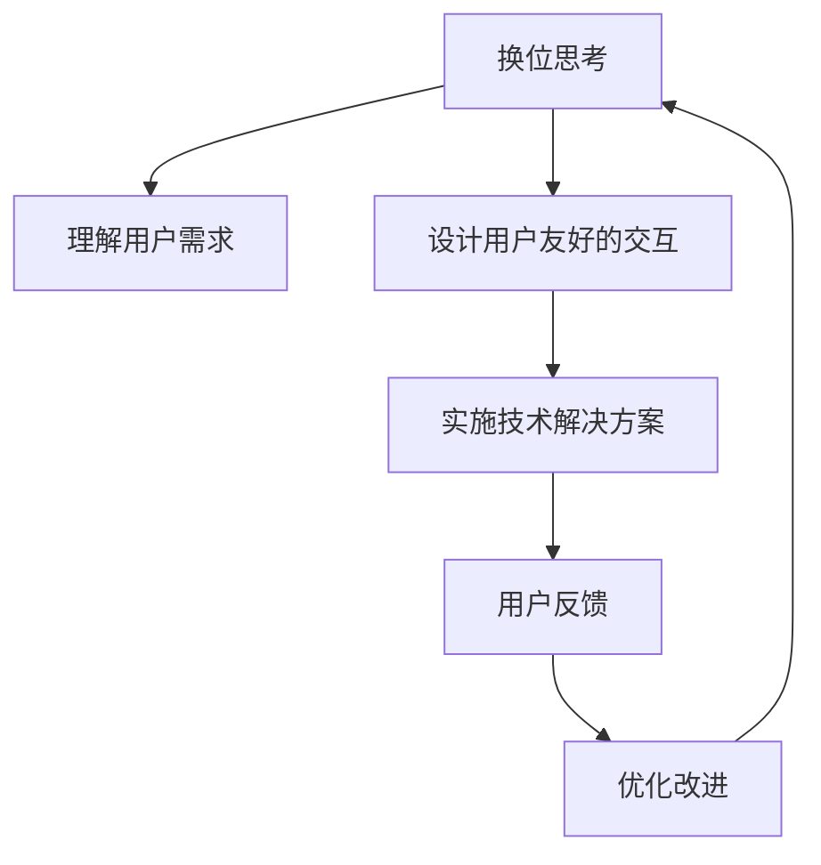

                 

# 理解的艺术：换位思考与同理心的培养

在快速发展的技术世界中，理解的艺术，即换位思考与同理心的培养，成为了沟通与创新的关键。本文将深入探讨换位思考与同理心的理论基础，并通过实际案例展示如何在不同领域应用这些原则，促进技术与人类需求的协同进步。

## 1. 背景介绍

### 1.1 问题由来

在数字化和自动化日益普及的今天，人工智能、机器学习等技术正逐步渗透到生活的各个角落。然而，技术的发展也带来了新的挑战：如何在机器与人之间建立有效的沟通和理解机制，确保技术的发展不仅服务于个体需求，还能促进社会整体的福祉。这其中，换位思考与同理心成为了不可或缺的桥梁。

换位思考和同理心是心理学和社会学的重要概念，但在技术领域如何具体应用，仍然是一个值得深入探讨的问题。特别是在人工智能、机器学习等技术的实际应用中，如何培养和应用换位思考与同理心，以确保技术的公正、透明和人性化，是每个技术从业者面临的重要课题。

### 1.2 问题核心关键点

换位思考与同理心的培养，涉及以下几个核心关键点：

- **定义与内涵**：换位思考和同理心究竟是什么？它们在技术领域的具体应用场景有哪些？
- **理论基础**：心理学、社会学、认知科学等领域对换位思考与同理心的研究有哪些？
- **实际应用**：换位思考与同理心如何应用于AI模型的设计、训练和部署？
- **效果与挑战**：换位思考与同理心在技术应用中的效果如何？面临哪些挑战？

## 2. 核心概念与联系

### 2.1 核心概念概述

换位思考与同理心是心理学和社会学的基本概念，但在技术领域具有独特的意义。

- **换位思考**：指从他人的角度出发，理解和感知其情感、动机和需求。在技术领域，换位思考要求开发者站在用户或受影响者的立场上，理解其需求和体验，从而设计出更符合人性和需求的技术产品。
- **同理心**：指对他人的情感状态和体验的共情能力。在技术领域，同理心要求开发者对用户可能遇到的问题和情感反应保持敏感，并在设计和技术实现中考虑这些因素。

换位思考与同理心是相辅相成的，前者基于对他人情感和体验的认知，后者则是对这些认知的情感反应。在技术领域，二者共同构成了人机交互的基础，确保技术产品能够真正理解和满足用户的需求。

### 2.2 核心概念原理和架构的 Mermaid 流程图



这个流程图展示了换位思考与同理心在技术设计中的应用路径：

1. 换位思考帮助理解用户需求（A）。
2. 基于理解的用户需求，设计用户友好的交互（B）。
3. 实施技术解决方案（C）。
4. 通过用户反馈获得实际效果（D）。
5. 根据反馈不断优化改进（E），并回到换位思考和理解（F）。

## 3. 核心算法原理 & 具体操作步骤

### 3.1 算法原理概述

换位思考与同理心在技术领域的应用，主要体现在以下几个方面：

- **用户需求分析**：通过换位思考，深入了解用户的真实需求和痛点，设计出符合用户期望的技术产品。
- **界面与交互设计**：在界面与交互设计中融入同理心，确保用户体验友好，减少用户操作障碍。
- **数据分析与模型训练**：在设计AI模型时，考虑如何通过换位思考和同理心，使得模型能够理解并预测用户的情感和行为。

### 3.2 算法步骤详解

换位思考与同理心的算法步骤主要包括以下几个环节：

1. **需求收集与分析**：
   - 通过问卷调查、用户访谈等方式收集用户需求。
   - 使用文本分析、情感分析等技术，理解用户反馈中的情感倾向和需求痛点。

2. **界面与交互设计**：
   - 设计直观、易用的用户界面。
   - 进行用户测试，收集反馈，优化界面与交互流程。

3. **模型设计与训练**：
   - 在模型训练中引入换位思考与同理心。例如，使用带有情感标注的数据集，训练模型对用户情感进行识别和理解。
   - 在模型评估中考虑用户满意度，使用用户评价作为性能指标之一。

### 3.3 算法优缺点

换位思考与同理心在技术应用中的优点和缺点如下：

**优点**：
- 提升用户满意度：通过换位思考和同理心，技术产品能够更好地满足用户需求，提高用户体验。
- 促进创新：换位思考和同理心鼓励开发者从用户角度出发，探索更多创新点。
- 增强社会责任感：换位思考和同理心能够帮助技术开发者更好地理解社会影响，推动技术的社会责任。

**缺点**：
- 技术复杂度增加：在设计和实现中融入换位思考和同理心，可能会增加技术复杂度和实现成本。
- 数据获取难度大：充分理解用户需求和情感，需要大量高质量的数据，获取和标注这些数据可能具有挑战性。
- 模型泛化能力不足：换位思考和同理心依赖于特定情境下的数据，可能影响模型的泛化能力。

### 3.4 算法应用领域

换位思考与同理心在多个领域中具有广泛应用：

- **医疗技术**：医疗应用中，换位思考和同理心有助于设计出更加人性化的诊断和康复工具，满足患者的情感需求。
- **教育技术**：教育应用中，换位思考和同理心可以帮助设计出更加符合学生需求的学习工具，提升学习效果。
- **金融科技**：金融应用中，换位思考和同理心能够帮助设计出更加公平和透明的金融产品，提高用户信任度。
- **社交媒体**：社交媒体平台可以通过换位思考和同理心优化用户体验，提升用户粘性。
- **智能家居**：智能家居设备可以通过换位思考和同理心，设计出更加符合用户生活习惯的产品，提升生活质量。

## 4. 数学模型和公式 & 详细讲解 & 举例说明

### 4.1 数学模型构建

换位思考与同理心的数学模型构建，主要涉及以下几个步骤：

1. **需求表示**：将用户需求表示为数学模型中的特征向量。
2. **情感建模**：通过情感分析技术，将用户情感转化为数值表示。
3. **界面优化**：使用界面设计算法，根据用户情感和需求优化界面布局。
4. **模型训练**：在模型训练中，通过优化算法调整权重，以最小化用户情感和实际输出之间的差距。

### 4.2 公式推导过程

以情感分析为例，情感建模的公式推导过程如下：

假设用户情感为 $y \in \{0, 1\}$，表示正面或负面情感。使用情感分析模型 $f(x)$，其中 $x$ 为输入特征向量，$f(x)$ 为模型输出。情感分类器可以表示为：

$$
\hat{y} = \sigma(f(x))
$$

其中 $\sigma$ 为 sigmoid 函数，$\hat{y}$ 为模型预测的情感标签。

情感分析的目标是最小化损失函数 $L(y, \hat{y})$，通常使用交叉熵损失函数：

$$
L(y, \hat{y}) = -(y \log \hat{y} + (1-y) \log (1-\hat{y}))
$$

模型训练的目标是最小化损失函数：

$$
\theta^* = \mathop{\arg\min}_{\theta} L(y, f_\theta(x))
$$

其中 $\theta$ 为模型参数，$f_\theta(x)$ 为带有参数 $\theta$ 的情感分析模型。

### 4.3 案例分析与讲解

以一个智能客服系统的设计为例，展示如何在实际应用中应用换位思考与同理心：

1. **需求收集与分析**：通过在线问卷和用户访谈，收集用户对于智能客服系统的需求和痛点。
2. **界面与交互设计**：设计简洁明了的用户界面，使用自然语言处理技术，理解用户问题并给出个性化回复。
3. **模型设计与训练**：使用情感分析模型，根据用户情感调整回答策略，优化用户体验。

## 5. 项目实践：代码实例和详细解释说明

### 5.1 开发环境搭建

换位思考与同理心在技术应用中的实现，通常需要跨学科的知识，包括自然语言处理、人机交互、心理学等。开发环境搭建需要综合考虑这些因素：

1. **编程语言**：Python是数据分析和机器学习的常用语言，也是自然语言处理的重要工具。
2. **数据处理工具**：Pandas、NumPy等数据处理工具，用于数据清洗和预处理。
3. **模型训练框架**：TensorFlow、PyTorch等深度学习框架，用于训练和优化模型。
4. **界面设计工具**：Sketch、Figma等界面设计工具，用于设计和优化用户界面。
5. **用户反馈工具**：用户调查、问卷工具，如SurveyMonkey、Google Forms等，用于收集用户反馈。

### 5.2 源代码详细实现

以下是一个基于自然语言处理和情感分析的智能客服系统的Python代码实现：

```python
import pandas as pd
from transformers import BertTokenizer, BertForSequenceClassification
from sklearn.model_selection import train_test_split
from sklearn.metrics import accuracy_score

# 加载数据
df = pd.read_csv('customer_feedback.csv')
df['label'] = df['feedback'].map({'positive': 1, 'negative': 0})

# 分训练集和测试集
train_df, test_df = train_test_split(df, test_size=0.2)

# 数据预处理
tokenizer = BertTokenizer.from_pretrained('bert-base-cased')
train_encodings = tokenizer(train_df['feedback'].tolist(), truncation=True, padding='max_length', max_length=128)
test_encodings = tokenizer(test_df['feedback'].tolist(), truncation=True, padding='max_length', max_length=128)

# 构建模型
model = BertForSequenceClassification.from_pretrained('bert-base-cased', num_labels=2)
model.to('cuda')

# 定义优化器和学习率
optimizer = AdamW(model.parameters(), lr=2e-5)

# 训练模型
for epoch in range(3):
    for batch in train_encodings:
        input_ids = batch['input_ids'].to('cuda')
        attention_mask = batch['attention_mask'].to('cuda')
        labels = batch['labels'].to('cuda')
        model.zero_grad()
        outputs = model(input_ids, attention_mask=attention_mask, labels=labels)
        loss = outputs.loss
        loss.backward()
        optimizer.step()
        
# 评估模型
predictions = model.predict(test_encodings)
accuracy = accuracy_score(test_df['label'], predictions)
print(f'Accuracy: {accuracy:.3f}')
```

### 5.3 代码解读与分析

- **数据加载与预处理**：使用Pandas加载反馈数据，并使用BERT分词器对文本进行分词和编码。
- **模型构建**：使用BERT模型作为情感分类器，并定义优化器。
- **训练过程**：在每个epoch中，通过迭代训练数据，更新模型参数。
- **模型评估**：使用测试集评估模型的准确率，并输出结果。

## 6. 实际应用场景

### 6.1 智能客服系统

换位思考与同理心在智能客服系统中的应用，可以极大地提升用户体验。通过理解用户的情感和需求，智能客服系统能够提供更加个性化和人性化的服务：

- **情感分析**：使用自然语言处理技术，分析用户情感，理解用户情绪。
- **个性化回复**：根据情感分析结果，生成符合用户情感的回复，提升用户满意度。
- **历史记录**：通过分析用户的历史交互记录，提供更准确的个性化服务。

### 6.2 教育技术

换位思考与同理心在教育技术中的应用，可以设计出更加符合学生需求的学习工具：

- **需求分析**：通过问卷调查和访谈，了解学生对学习工具的需求和痛点。
- **界面设计**：设计直观、易用的用户界面，使用户能够快速上手。
- **内容定制**：根据学生的需求，定制个性化的学习内容，提升学习效果。

### 6.3 金融科技

换位思考与同理心在金融科技中的应用，可以设计出更加公平和透明的金融产品：

- **需求收集**：通过调查和访谈，了解用户对金融产品的需求和顾虑。
- **界面优化**：设计简洁明了的用户界面，使用户能够轻松理解金融产品。
- **用户体验**：通过情感分析，优化用户交互流程，提升用户信任度。

### 6.4 未来应用展望

未来，换位思考与同理心在技术中的应用将更加广泛和深入：

- **自动化程度提升**：随着技术的进步，换位思考与同理心的应用将更加自动化，能够实时分析用户情感和需求，提供即时反馈。
- **多模态融合**：结合视觉、听觉等多种模态，全面理解用户需求和情感，提供更加综合的解决方案。
- **个性化推荐**：通过换位思考与同理心，设计出更加个性化的推荐系统，提升用户粘性和满意度。

## 7. 工具和资源推荐

### 7.1 学习资源推荐

为了帮助开发者系统掌握换位思考与同理心的理论基础和实践技巧，这里推荐一些优质的学习资源：

1. **《设计心理学》（Don Norman）**：介绍了设计心理学的基础理论和实际应用，是换位思考与同理心理论的重要参考。
2. **《用户体验设计基础》（Jesse James Garrett）**：介绍了用户体验设计的关键原则和实践方法，帮助开发者理解用户需求。
3. **《自然语言处理综述》（Yoshua Bengio）**：介绍了自然语言处理的基本概念和技术，是应用换位思考与同理心于NLP的重要资源。
4. **Coursera课程《人机交互设计》（Bryan Lawson）**：介绍了人机交互设计的原理和实践，帮助开发者设计更符合用户需求的界面。
5. **Kaggle竞赛平台**：提供了大量数据集和问题，可以通过参与竞赛，实际应用换位思考与同理心，提升技能。

### 7.2 开发工具推荐

为了支持换位思考与同理心在技术中的应用，以下是几款推荐的工具：

1. **Pandas和NumPy**：用于数据处理和分析，是数据科学和机器学习的重要工具。
2. **BERT和GPT**：用于自然语言处理，是现代深度学习模型的重要代表。
3. **Sketch和Figma**：用于界面设计，是设计师和开发者常用的工具。
4. **SurveyMonkey和Google Forms**：用于用户调查和问卷设计，帮助收集用户需求和反馈。
5. **TensorFlow和PyTorch**：用于深度学习模型的训练和优化，是实现换位思考与同理心的关键工具。

### 7.3 相关论文推荐

换位思考与同理心在技术领域的研究，已经涉及多个学科，以下是几篇代表性论文，推荐阅读：

1. **《换位思考与同理心在AI设计中的应用》（Katie McElh穰）**：探讨了换位思考与同理心在AI设计中的理论基础和应用实例。
2. **《人机交互设计中的同理心》（Ellen Ferry）**：介绍了同理心在人机交互设计中的应用，提供了具体的实践方法和案例。
3. **《自然语言处理中的情感分析》（Yan Zhou）**：介绍了情感分析在自然语言处理中的应用，是换位思考与同理心在NLP中的具体应用。
4. **《智能客服系统中的情感识别与分析》（Xiaojiang Zhu）**：探讨了智能客服系统中情感识别和分析的技术，展示了换位思考与同理心在实际应用中的效果。
5. **《基于同理心的教育技术设计》（Shaojuan Liu）**：介绍了同理心在教育技术设计中的应用，提供了具体的实践案例和方法。

## 8. 总结：未来发展趋势与挑战

### 8.1 研究成果总结

换位思考与同理心在技术领域的应用，已经取得了一些重要进展，主要体现在以下几个方面：

- **理论基础成熟**：心理学、社会学等学科对换位思考与同理心的研究日益深入，提供了坚实的理论基础。
- **技术应用广泛**：自然语言处理、人机交互、教育技术等多个领域，已经广泛应用换位思考与同理心，提升了用户满意度。
- **实际效果显著**：通过换位思考与同理心，设计出的技术产品更加符合用户需求，提升了用户体验和满意度。

### 8.2 未来发展趋势

未来，换位思考与同理心在技术中的应用将呈现以下几个趋势：

1. **自动化程度提升**：随着技术的进步，换位思考与同理心的应用将更加自动化，能够实时分析用户情感和需求，提供即时反馈。
2. **多模态融合**：结合视觉、听觉等多种模态，全面理解用户需求和情感，提供更加综合的解决方案。
3. **个性化推荐**：通过换位思考与同理心，设计出更加个性化的推荐系统，提升用户粘性和满意度。
4. **跨学科融合**：心理学、社会学、认知科学等学科将进一步融入技术开发，推动换位思考与同理心的全面应用。
5. **伦理与社会责任**：换位思考与同理心的应用将更加注重伦理和社会责任，确保技术的公正、透明和人性化。

### 8.3 面临的挑战

尽管换位思考与同理心在技术中的应用已经取得了一些进展，但仍面临诸多挑战：

1. **数据隐私问题**：换位思考与同理心依赖于大量的用户数据，如何保护用户隐私，防止数据滥用，是一个重要挑战。
2. **模型泛化能力**：换位思考与同理心模型需要在不同情境下保持一致性，但不同用户和情境下的需求和情感可能存在差异，如何提升模型的泛化能力，是一个关键问题。
3. **技术复杂度**：换位思考与同理心应用的技术实现复杂度高，需要跨学科的合作和整合，增加了技术实现的难度。
4. **用户体验不一致**：不同用户和情境下的需求和情感可能存在差异，如何提供一致的用户体验，是一个重要挑战。
5. **伦理与社会责任**：换位思考与同理心的应用需要考虑伦理和社会责任，确保技术的公正、透明和人性化。

### 8.4 研究展望

未来的研究需要在以下几个方面寻求新的突破：

1. **跨学科融合**：将心理学、社会学、认知科学等学科与技术开发紧密结合，推动换位思考与同理心的全面应用。
2. **自动化与个性化**：结合自动化技术和个性化推荐，提升换位思考与同理心的实际效果。
3. **数据隐私保护**：加强数据隐私保护，确保用户数据的安全和隐私。
4. **伦理与社会责任**：研究换位思考与同理心应用的伦理和社会责任，确保技术的公正、透明和人性化。
5. **多模态融合**：结合视觉、听觉等多种模态，全面理解用户需求和情感，提供更加综合的解决方案。

通过这些研究方向和突破，换位思考与同理心在技术中的应用将更加广泛和深入，为人机交互和智能技术的发展提供新的动力。

## 9. 附录：常见问题与解答

**Q1：换位思考与同理心在技术应用中如何具体实现？**

A: 换位思考与同理心在技术应用中的具体实现，主要包括以下几个步骤：
1. **需求收集与分析**：通过问卷调查和访谈，了解用户需求和情感。
2. **数据处理与预处理**：使用自然语言处理技术，对用户反馈进行情感分析。
3. **界面与交互设计**：设计直观、易用的用户界面，优化用户体验。
4. **模型设计与训练**：在模型训练中引入换位思考与同理心，优化模型性能。
5. **用户反馈与优化**：根据用户反馈，不断优化界面和交互流程，提升用户体验。

**Q2：换位思考与同理心在技术应用中的优缺点有哪些？**

A: 换位思考与同理心在技术应用中的优缺点如下：
**优点**：
- 提升用户满意度：通过换位思考和同理心，技术产品能够更好地满足用户需求，提高用户体验。
- 促进创新：换位思考和同理心鼓励开发者从用户角度出发，探索更多创新点。
- 增强社会责任感：换位思考和同理心能够帮助开发者更好地理解社会影响，推动技术的社会责任。
**缺点**：
- 技术复杂度增加：在设计和实现中融入换位思考和同理心，可能会增加技术复杂度和实现成本。
- 数据获取难度大：充分理解用户需求和情感，需要大量高质量的数据，获取和标注这些数据可能具有挑战性。
- 模型泛化能力不足：换位思考和同理心依赖于特定情境下的数据，可能影响模型的泛化能力。

**Q3：换位思考与同理心在技术应用中如何平衡用户隐私和数据安全？**

A: 换位思考与同理心在技术应用中平衡用户隐私和数据安全，主要可以从以下几个方面入手：
1. **数据最小化**：只收集和使用必要的数据，避免不必要的数据收集。
2. **数据匿名化**：对用户数据进行匿名化处理，确保数据无法被识别。
3. **数据加密**：对用户数据进行加密存储和传输，防止数据泄露。
4. **用户控制**：提供用户数据控制选项，让用户可以自主选择是否分享数据。
5. **透明度与问责制**：确保数据使用过程的透明度，建立数据使用的问责机制，确保数据使用的合法性和公正性。

通过这些措施，可以在换位思考与同理心应用的同时，保障用户隐私和数据安全。

**Q4：换位思考与同理心在技术应用中如何避免偏见和歧视？**

A: 换位思考与同理心在技术应用中避免偏见和歧视，主要可以从以下几个方面入手：
1. **多样化数据集**：使用多样化的数据集，确保模型能够覆盖不同背景和需求的用户。
2. **公平算法**：在模型训练中引入公平性指标，确保模型输出公平。
3. **模型评估**：在模型评估中引入公平性评估，发现和纠正偏见和歧视。
4. **伦理审查**：建立伦理审查机制，确保技术应用的伦理和社会责任。
5. **用户反馈**：建立用户反馈机制，及时发现和纠正偏见和歧视问题。

通过这些措施，可以在换位思考与同理心应用的同时，避免偏见和歧视，确保技术的公正和透明。

**Q5：换位思考与同理心在技术应用中如何提升模型的泛化能力？**

A: 换位思考与同理心在技术应用中提升模型的泛化能力，主要可以从以下几个方面入手：
1. **多样化数据集**：使用多样化的数据集，确保模型能够覆盖不同背景和需求的用户。
2. **数据增强**：使用数据增强技术，丰富训练集的多样性，提升模型的泛化能力。
3. **模型正则化**：使用正则化技术，避免模型过拟合，提升模型的泛化能力。
4. **模型集成**：使用模型集成技术，结合多个模型输出，提升模型的泛化能力。
5. **领域适应**：在特定领域进行微调，提升模型在该领域的表现。

通过这些措施，可以在换位思考与同理心应用的同时，提升模型的泛化能力，确保技术在不同情境下的表现一致。

---

作者：禅与计算机程序设计艺术 / Zen and the Art of Computer Programming

