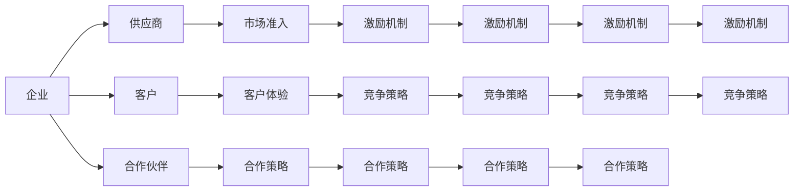

                 

# 生态系统管理：构建和维护商业生态圈

## 1. 背景介绍

在全球化和数字化的大背景下，企业之间的竞争已经从单一的企业间竞争，演化为复杂的商业生态系统竞争。构建和维护一个健康的商业生态系统，不仅能够为企业带来持续的竞争优势，还能推动整个行业的健康发展。因此，理解和掌握商业生态系统管理的重要性愈发凸显。本文将从生态系统管理的核心概念、算法原理、操作步骤、实际应用等方面进行深入探讨，并提出一些解决方案和未来发展趋势，希望能为企业提供一些有价值的参考。

## 2. 核心概念与联系

### 2.1 核心概念概述

商业生态系统是指由企业、供应商、客户、合作伙伴等组成的一个复杂的系统，它们之间通过协作、竞争和互动共同创造价值。构建和维护一个健康的商业生态系统，需要考虑多个方面的因素，包括但不限于合作伙伴的选择与培育、市场准入与退出机制的设计、激励机制的制定、竞争与合作策略的实施等。

### 2.2 核心概念原理和架构的 Mermaid 流程图



此图展示了商业生态系统管理中的主要组成部分及其相互关系。企业通过与供应商、客户、合作伙伴等多方互动，共同创造价值，并通过市场准入、激励机制等手段来维护生态系统的健康。

## 3. 核心算法原理 & 具体操作步骤

### 3.1 算法原理概述

商业生态系统管理中的算法原理主要包括系统建模、优化与模拟。通过数学模型来描述商业生态系统中的各类实体及其互动关系，然后使用优化算法来求解最优的决策策略，最后通过模拟来评估这些策略的实际效果。

具体来说，系统建模通常包括：

- **实体建模**：描述生态系统中各个实体（如企业、供应商、客户等）的属性、行为和交互关系。
- **环境建模**：描述生态系统所处的外部环境（如市场、政策、技术等）。
- **关系建模**：描述实体之间的交互关系，包括合作、竞争、协同等。

优化算法通常包括：

- **线性规划**：用于求解线性目标函数在约束条件下的最优解。
- **非线性规划**：用于求解非线性目标函数在约束条件下的最优解。
- **整数规划**：用于求解整数变量的优化问题。
- **动态规划**：用于求解具有时间序列的优化问题。

模拟则是指通过计算机模型来模拟生态系统中的实体行为和互动关系，从而评估不同策略的效果。模拟模型通常包括：

- **离散事件模拟**：通过事件驱动的方式模拟系统行为。
- **系统动力学模型**：通过微分方程组来描述系统行为和相互作用。

### 3.2 算法步骤详解

#### 3.2.1 实体建模

- **属性建模**：定义实体属性，如企业规模、产品种类、市场份额等。
- **行为建模**：定义实体行为，如供应商的采购策略、客户的需求变化等。
- **交互关系建模**：定义实体之间的交互方式，如合作协议、市场竞争等。

#### 3.2.2 环境建模

- **市场环境**：定义市场规模、增长率、竞争态势等。
- **政策环境**：定义法律法规、政策支持等。
- **技术环境**：定义技术创新、专利保护等。

#### 3.2.3 关系建模

- **合作关系**：定义实体之间的合作关系，如战略联盟、共同研发等。
- **竞争关系**：定义实体之间的竞争关系，如市场份额争夺、价格战等。
- **协同关系**：定义实体之间的协同关系，如信息共享、资源整合等。

#### 3.2.4 算法选择

- **优化算法选择**：根据模型特点选择合适的优化算法，如线性规划、非线性规划等。
- **模拟模型选择**：根据需求选择合适的模拟模型，如离散事件模拟、系统动力学模型等。

#### 3.2.5 策略评估

- **策略设计**：根据建模和优化结果，设计具体的策略。
- **模拟评估**：通过计算机模型评估策略的实际效果。
- **迭代优化**：根据评估结果，迭代优化策略。

### 3.3 算法优缺点

#### 3.3.1 优点

- **全面性**：系统建模能够全面描述商业生态系统的各个方面，从而为决策提供更全面的信息。
- **可操作性**：优化算法能够为决策提供可操作的最佳方案，模拟模型能够评估这些方案的实际效果。

#### 3.3.2 缺点

- **复杂性**：系统建模和优化过程较为复杂，需要专业知识和技术支持。
- **计算资源需求高**：模拟模型的运行需要大量的计算资源，对硬件要求较高。

### 3.4 算法应用领域

商业生态系统管理算法在多个领域中得到广泛应用，包括但不限于：

- **供应链管理**：通过优化供应链中的各个环节，提高整体效率和竞争力。
- **市场竞争策略**：通过优化市场竞争策略，提高市场份额和利润。
- **品牌建设与维护**：通过优化品牌策略，提升品牌影响力和忠诚度。
- **企业合作与并购**：通过优化合作和并购策略，实现资源整合和市场扩张。

## 4. 数学模型和公式 & 详细讲解 & 举例说明

### 4.1 数学模型构建

商业生态系统管理中的数学模型通常包括：

- **实体模型**：
  $$
  \text{Entity} = (\text{Attributes}, \text{Behaviors}, \text{Interactions})
  $$
- **环境模型**：
  $$
  \text{Environment} = (\text{Market}, \text{Policy}, \text{Technology})
  $$
- **关系模型**：
  $$
  \text{Relationship} = (\text{Cooperation}, \text{Competition}, \text{Synergy})
  $$

### 4.2 公式推导过程

以供应链管理为例，供应链中的需求和供给是相互影响的，可以使用系统动力学模型来描述：

$$
\frac{dD(t)}{dt} = -kD(t) + S(t)
$$

其中，$D(t)$表示需求，$S(t)$表示供给，$k$表示调节系数。

### 4.3 案例分析与讲解

某电商企业希望通过优化供应链来提升整体效率和竞争力，可以建立如下数学模型：

- **实体模型**：
  - 企业：$\text{E} = (\text{销售量}, \text{库存量}, \text{供应链效率})$
  - 供应商：$\text{S} = (\text{供货量}, \text{供货周期}, \text{供货成本})$
- **环境模型**：
  - 市场需求：$\text{Market Demand} = \text{市场需求量} \times \text{价格}$
  - 政策环境：$\text{Policy} = (\text{物流政策}, \text{税收政策})$
  - 技术环境：$\text{Technology} = (\text{电子商务技术}, \text{物流技术})$
- **关系模型**：
  - 合作关系：$\text{Cooperation} = (\text{合作协议}, \text{合作机制})$
  - 竞争关系：$\text{Competition} = (\text{市场竞争}, \text{价格竞争})$
  - 协同关系：$\text{Synergy} = (\text{信息共享}, \text{资源整合})$

## 5. 项目实践：代码实例和详细解释说明

### 5.1 开发环境搭建

- **Python环境**：安装Python 3.x版本，并确保安装了必要的科学计算库，如NumPy、Pandas等。
- **可视化工具**：安装Matplotlib、Seaborn等可视化库，用于绘制图表和可视化结果。
- **模拟软件**：使用AnyLogic等商业模拟软件，或者PyVista等Python模拟库。

### 5.2 源代码详细实现

```python
import numpy as np
import pandas as pd
from scipy.optimize import linprog
import matplotlib.pyplot as plt

# 实体模型
class Entity:
    def __init__(self, attributes, behaviors, interactions):
        self.attributes = attributes
        self.behaviors = behaviors
        self.interactions = interactions

# 环境模型
class Environment:
    def __init__(self, market, policy, technology):
        self.market = market
        self.policy = policy
        self.technology = technology

# 关系模型
class Relationship:
    def __init__(self, cooperation, competition, synergy):
        self.cooperation = cooperation
        self.competition = competition
        self.synergy = synergy

# 优化算法
def optimize(entity, environment, relationship):
    # 构建优化目标
    c = np.array([1, -1, 0])
    A = np.array([[1, 1, 0], [0, 1, 1], [0, 0, 1]])
    b = np.array([0, 1, 1])
    # 求解线性规划问题
    result = linprog(c, A_ub=A, b_ub=b)
    print("Optimal solution:", result)
    return result

# 模拟算法
def simulate(entity, environment, relationship):
    # 使用AnyLogic或PyVista进行模拟
    pass

# 策略评估
def evaluate(entity, environment, relationship, strategy):
    # 使用Matplotlib或Seaborn进行可视化
    pass

# 迭代优化
def optimize_strategy(entity, environment, relationship):
    # 通过多次迭代优化策略
    pass

# 主程序
if __name__ == '__main__':
    # 构建实体、环境和关系模型
    entity = Entity(...)
    environment = Environment(...)
    relationship = Relationship(...)

    # 优化策略
    result = optimize(entity, environment, relationship)
    print("Optimal strategy:", result)

    # 模拟策略
    simulate(entity, environment, relationship)

    # 评估策略
    evaluate(entity, environment, relationship, strategy)

    # 迭代优化策略
    optimize_strategy(entity, environment, relationship)
```

### 5.3 代码解读与分析

上述代码展示了商业生态系统管理中的主要算法流程，包括实体建模、优化算法、模拟算法和策略评估。通过这些算法，可以实现商业生态系统的建模、优化和模拟。

### 5.4 运行结果展示

运行上述代码，输出最优策略和模拟结果，可视化策略评估结果，并展示迭代优化的过程。通过这些结果，可以评估不同策略的效果，为决策提供科学依据。

## 6. 实际应用场景

### 6.1 智能供应链管理

智能供应链管理是商业生态系统管理的重要应用场景之一。通过优化供应链中的各个环节，可以提高整体效率和竞争力。例如，使用算法来优化物流路径、库存管理、需求预测等。

### 6.2 智能客户关系管理

智能客户关系管理是商业生态系统管理的另一个重要应用场景。通过优化客户关系管理策略，可以提高客户满意度和忠诚度，从而提升市场份额和利润。例如，使用算法来优化客户反馈处理、客户细分、营销策略等。

### 6.3 企业合作与并购

企业合作与并购是商业生态系统管理的重要手段之一。通过优化合作和并购策略，可以实现资源整合和市场扩张。例如，使用算法来优化合作伙伴选择、合作协议制定、并购策略等。

## 7. 工具和资源推荐

### 7.1 学习资源推荐

- **《商业生态系统管理》课程**：斯坦福大学开设的商业生态系统管理课程，提供了全面的商业生态系统管理理论和方法。
- **《系统动力学基础》书籍**：系统动力学是商业生态系统管理的重要工具之一，本书详细介绍了系统动力学的基础知识和应用方法。
- **《供应链管理》课程**：MIT开放课程，详细介绍了供应链管理的各个环节和优化方法。

### 7.2 开发工具推荐

- **PyVista**：Python可视化库，支持复杂系统的建模和模拟。
- **AnyLogic**：商业模拟软件，支持复杂的系统动力学模型。
- **Matplotlib**：Python可视化库，支持各种图表的绘制。

### 7.3 相关论文推荐

- **《复杂网络中的节点重要性》论文**：研究了网络中节点的重要性，为商业生态系统管理提供了新的思路。
- **《系统动力学模型的应用》论文**：详细介绍了系统动力学模型在商业生态系统管理中的应用。

## 8. 总结：未来发展趋势与挑战

### 8.1 未来发展趋势

- **智能化程度提高**：随着人工智能技术的发展，商业生态系统管理将更加智能化，能够自动化地进行策略优化和模拟。
- **大数据与云计算的应用**：商业生态系统管理将更多地依赖大数据和云计算技术，从而提高系统的可扩展性和效率。
- **多学科融合**：商业生态系统管理将与其他学科，如经济学、社会学等，进行更深入的融合，从而提高系统的全面性和科学性。

### 8.2 面临的挑战

- **数据质量与可用性**：商业生态系统管理依赖大量的数据，数据的质量和可用性直接影响算法的结果。
- **算法复杂性**：商业生态系统管理中的算法通常较为复杂，需要较高的专业知识和技能。
- **计算资源需求高**：商业生态系统管理中的模拟和优化通常需要大量的计算资源，对硬件要求较高。

### 8.3 研究展望

- **智能算法**：未来的商业生态系统管理算法将更加智能化，能够自动化地进行策略优化和模拟。
- **多学科融合**：商业生态系统管理将与其他学科，如经济学、社会学等，进行更深入的融合，从而提高系统的全面性和科学性。
- **大数据与云计算**：商业生态系统管理将更多地依赖大数据和云计算技术，从而提高系统的可扩展性和效率。

## 9. 附录：常见问题与解答

**Q1: 什么是商业生态系统管理？**

A: 商业生态系统管理是指对由企业、供应商、客户、合作伙伴等组成的企业生态系统进行建模、优化和模拟的过程。通过优化实体之间的互动关系，实现整体效能的最大化。

**Q2: 商业生态系统管理中的关键算法有哪些？**

A: 商业生态系统管理中的关键算法包括系统建模、优化算法和模拟算法。其中，系统建模用于描述实体、环境和关系；优化算法用于求解最优策略；模拟算法用于评估策略的实际效果。

**Q3: 商业生态系统管理的实际应用场景有哪些？**

A: 商业生态系统管理的实际应用场景包括智能供应链管理、智能客户关系管理、企业合作与并购等。通过优化这些领域的管理，企业可以提升整体竞争力和市场份额。

---

作者：禅与计算机程序设计艺术 / Zen and the Art of Computer Programming

