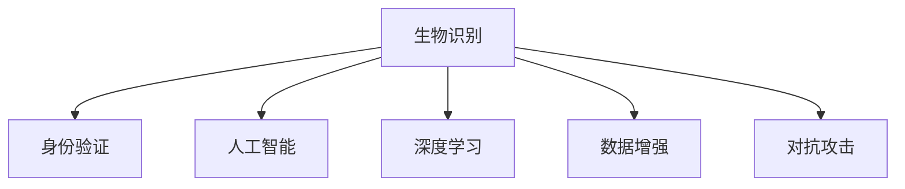

                 

# 生物识别技术在身份验证中的应用：提高安全性

> 关键词：生物识别，身份验证，安全性，人工智能，深度学习

## 1. 背景介绍

### 1.1 问题由来
在数字化时代，身份验证（Identity Verification）成为了网络空间安全的关键环节。传统的用户名+密码身份验证方式虽然简便，但在黑客攻击、钓鱼网站等威胁面前，容易被破解，造成重大安全风险。为了应对这些挑战，各类生物识别技术被引入到身份验证系统中，通过人体生理特征或行为特征的唯一性，大大提高了身份验证的可靠性。

### 1.2 问题核心关键点
生物识别技术主要依赖于人的生理特征或行为特征，如指纹、虹膜、面部、声音、步态等，这些特征具备高度的唯一性和稳定性，使得身份验证变得更加安全可靠。与传统的用户名+密码验证方式相比，生物识别技术具有以下优势：
1. **难以复制**：每个人的生理特征或行为特征都是独一无二的，难以被他人复制或盗用。
2. **高效便捷**：识别速度快，使用方便，可以迅速完成验证过程。
3. **抗攻击能力强**：即使是攻击者获取了用户的生物特征数据，也需要设备和技术支持才能完成欺骗。

本文将从生物识别技术的基本原理、算法原理、具体操作步骤、实际应用场景、工具和资源推荐等多个角度，深入探讨生物识别技术在身份验证中的应用及其提高安全性的潜力。

## 2. 核心概念与联系

### 2.1 核心概念概述

为了更好地理解生物识别技术在身份验证中的应用，本节将介绍几个密切相关的核心概念：

- **生物识别（Biometric Authentication）**：利用人体生理特征或行为特征进行身份验证的技术。常见的生物识别类型包括指纹识别、虹膜识别、面部识别、声音识别等。
- **身份验证（Identity Verification）**：确保用户或设备身份的真实性，防止身份冒用或欺诈行为。
- **人工智能（Artificial Intelligence）**：通过算法和数据模型，实现对生物特征的自动提取、分类和识别。
- **深度学习（Deep Learning）**：一种基于神经网络的机器学习算法，在生物识别中用于训练和优化识别模型。
- **数据增强（Data Augmentation）**：通过对训练数据进行扩充和变换，提高模型的泛化能力。
- **对抗攻击（Adversarial Attacks）**：攻击者通过特定的输入来欺骗模型，使其做出错误的识别决策。

这些核心概念之间的逻辑关系可以通过以下Mermaid流程图来展示：



这个流程图展示了两者的核心概念及其之间的关系：

1. 生物识别技术利用人工智能和深度学习算法，自动提取和分类生物特征，以供身份验证使用。
2. 身份验证系统依靠生物识别技术，确认用户身份的真实性，防止身份冒用。
3. 数据增强技术提高模型的泛化能力，对抗攻击技术提高系统的安全性。

## 3. 核心算法原理 & 具体操作步骤

### 3.1 算法原理概述

生物识别技术在身份验证中的应用，主要基于两个关键步骤：特征提取和特征匹配。

**特征提取**：利用人工智能和深度学习算法，自动从用户提供的生物特征数据（如指纹、面部图像、虹膜图像等）中提取特征向量。这一过程通常包括图像预处理、特征提取、归一化等步骤。

**特征匹配**：将提取的特征向量与预先存储的特征模板进行比对，确认是否匹配。这一步骤通常包括特征比对、相似度计算等技术。

通过以上两个步骤，生物识别技术能够高效、安全地完成身份验证过程。

### 3.2 算法步骤详解

生物识别技术在身份验证中的应用，一般包括以下几个关键步骤：

**Step 1: 数据收集与预处理**
- 收集用户的生物特征数据，如指纹、虹膜、面部图像等。
- 对收集到的数据进行预处理，包括图像去噪、归一化等操作，以保证数据的一致性和高质量。

**Step 2: 特征提取**
- 利用深度学习算法（如卷积神经网络CNN），对预处理后的生物特征数据进行特征提取，生成特征向量。
- 对提取的特征向量进行编码和压缩，以便于存储和比较。

**Step 3: 特征存储与初始化**
- 将提取的特征向量存储在特征数据库中，作为身份验证的参考模板。
- 初始化特征数据库，设置合理的模板数量和存储空间。

**Step 4: 特征匹配与验证**
- 在用户身份验证时，重新提取其生物特征数据，并提取特征向量。
- 将提取的特征向量与特征数据库中的模板进行比对，计算相似度。
- 根据相似度阈值和匹配规则，判断是否验证通过。

**Step 5: 反馈与优化**
- 根据验证结果，给予用户相应的反馈。
- 对验证过程中的参数和算法进行优化，提高识别的准确率和鲁棒性。

### 3.3 算法优缺点

生物识别技术在身份验证中的应用，具有以下优点：
1. **安全性高**：生物特征的不可复制性，大大提高了身份验证的安全性。
2. **便捷高效**：识别速度快，使用方便，能够快速完成验证过程。
3. **抗攻击能力强**：即使攻击者获取了生物特征数据，也需要设备和技术支持才能完成欺骗。

同时，该技术也存在一些局限性：
1. **高成本**：生物特征数据的收集、存储和处理需要较高的成本。
2. **数据隐私问题**：如何保护用户生物特征数据的隐私，避免数据泄露，是一个需要解决的问题。
3. **准确率受限**：在某些特定环境下（如光线不足、噪音干扰等），生物特征提取和匹配的准确率会受到影响。
4. **设备依赖性**：需要专业的设备和算法支持，不便于在低端设备上实现。

尽管存在这些局限性，但就目前而言，生物识别技术在身份验证中的应用，仍是提升安全性的重要手段。未来相关研究的方向在于如何进一步降低成本，提高识别精度，以及解决数据隐私问题。

### 3.4 算法应用领域

生物识别技术在身份验证中的应用，广泛覆盖了以下领域：

- **金融服务**：银行、证券、支付等金融领域，通过指纹、面部识别等技术，确保交易安全。
- **医疗健康**：医院、诊所等医疗场所，通过虹膜、面部识别等技术，保障患者身份的真实性。
- **智能家居**：智能门锁、智能电视等家居设备，通过指纹、面部识别等技术，实现家庭成员的身份验证。
- **移动设备**：智能手机、平板电脑等移动设备，通过指纹、面部识别等技术，保护用户隐私和设备安全。
- **企业考勤**：通过指纹、面部识别等技术，确保员工身份的真实性，提高考勤管理效率。
- **政府服务**：政务大厅、出入境管理等场景，通过虹膜、面部识别等技术，提供身份验证服务。

## 4. 数学模型和公式 & 详细讲解

### 4.1 数学模型构建

生物识别技术在身份验证中的应用，通常使用特征提取和特征匹配模型。这里以面部识别为例，介绍特征提取模型的数学模型构建。

**输入**：一张预处理后的面部图像 $x \in \mathbb{R}^{H \times W \times C}$，其中 $H$、$W$、$C$ 分别表示图像的高、宽和通道数。

**输出**：一个特征向量 $z \in \mathbb{R}^d$，其中 $d$ 为特征向量的维度。

假设使用一个深度学习模型 $f_\theta$ 对输入图像 $x$ 进行特征提取，其中 $\theta$ 为模型参数。特征提取过程可以表示为：

$$
z = f_\theta(x)
$$

在特征提取完成后，需要进行特征匹配。设 $y$ 为待验证的特征向量，$y'$ 为特征数据库中的特征模板。特征匹配过程可以通过计算相似度函数 $S(z, y')$ 来实现，其中 $S(z, y') \in [0, 1]$ 表示相似度得分。常用的相似度函数包括余弦相似度、欧式距离、汉明距离等。

### 4.2 公式推导过程

以余弦相似度为例，介绍特征匹配的公式推导过程。

假设提取的特征向量 $z$ 和特征模板 $y'$ 分别为 $z = [z_1, z_2, ..., z_d]$ 和 $y' = [y'_1, y'_2, ..., y'_d]$，则余弦相似度可以表示为：

$$
S(z, y') = \cos \theta = \frac{z \cdot y'}{\|z\| \cdot \|y'\|}
$$

其中 $z \cdot y'$ 表示向量点乘，$\|z\|$ 和 $\|y'\|$ 表示向量的模长。

在进行特征匹配时，通常设定一个阈值 $\tau$，如果相似度得分 $S(z, y')$ 大于 $\tau$，则认为验证通过。

### 4.3 案例分析与讲解

以指纹识别为例，展示生物识别技术在身份验证中的具体应用。

**指纹采集**：用户将手指放在指纹采集器上，采集器读取指纹图像。

**预处理**：对采集到的指纹图像进行去噪、二值化等预处理操作，确保图像的质量和一致性。

**特征提取**：使用深度学习模型（如CNN）对预处理后的指纹图像进行特征提取，生成特征向量。

**特征存储与初始化**：将提取的特征向量存储在特征数据库中，作为身份验证的参考模板。

**特征匹配与验证**：在用户身份验证时，重新提取其指纹图像，并提取特征向量。将提取的特征向量与特征数据库中的模板进行比对，计算相似度。根据相似度阈值和匹配规则，判断是否验证通过。

通过以上步骤，指纹识别技术能够高效、安全地完成身份验证过程。

## 5. 项目实践：代码实例和详细解释说明

### 5.1 开发环境搭建

在进行生物识别技术应用的项目实践前，我们需要准备好开发环境。以下是使用Python进行深度学习开发的环境配置流程：

1. 安装Anaconda：从官网下载并安装Anaconda，用于创建独立的Python环境。

2. 创建并激活虚拟环境：
```bash
conda create -n bio_recog_env python=3.8 
conda activate bio_recog_env
```

3. 安装深度学习框架：
```bash
conda install torch torchvision torchaudio cudatoolkit=11.1 -c pytorch -c conda-forge
```

4. 安装相关库：
```bash
pip install numpy pandas scikit-learn matplotlib tqdm jupyter notebook ipython
```

完成上述步骤后，即可在`bio_recog_env`环境中开始项目实践。

### 5.2 源代码详细实现

下面以面部识别为例，给出使用深度学习框架PyTorch实现面部识别的代码实现。

```python
import torch
import torch.nn as nn
import torch.optim as optim
from torchvision import datasets, transforms

# 定义模型结构
class FaceRecognitionNet(nn.Module):
    def __init__(self):
        super(FaceRecognitionNet, self).__init__()
        self.conv1 = nn.Conv2d(3, 64, kernel_size=3, stride=1, padding=1)
        self.pool = nn.MaxPool2d(kernel_size=2, stride=2)
        self.conv2 = nn.Conv2d(64, 128, kernel_size=3, stride=1, padding=1)
        self.pool2 = nn.MaxPool2d(kernel_size=2, stride=2)
        self.fc1 = nn.Linear(128 * 7 * 7, 128)
        self.fc2 = nn.Linear(128, 2) # 二分类问题，输出一个概率值

    def forward(self, x):
        x = self.pool(nn.functional.relu(self.conv1(x)))
        x = self.pool2(nn.functional.relu(self.conv2(x)))
        x = x.view(-1, 128 * 7 * 7)
        x = nn.functional.relu(self.fc1(x))
        x = self.fc2(x)
        return x

# 定义训练函数
def train(model, device, train_loader, optimizer, epoch):
    model.train()
    for batch_idx, (data, target) in enumerate(train_loader):
        data, target = data.to(device), target.to(device)
        optimizer.zero_grad()
        output = model(data)
        loss = nn.functional.cross_entropy(output, target)
        loss.backward()
        optimizer.step()
        if batch_idx % 10 == 0:
            print(f'Train Epoch: {epoch}, Batch Index: {batch_idx}, Loss: {loss.item()}')

# 定义测试函数
def test(model, device, test_loader):
    model.eval()
    correct = 0
    total = 0
    with torch.no_grad():
        for data, target in test_loader:
            data, target = data.to(device), target.to(device)
            output = model(data)
            _, predicted = torch.max(output.data, 1)
            total += target.size(0)
            correct += (predicted == target).sum().item()
    print(f'Test Accuracy: {100 * correct / total} %')

# 数据准备
train_dataset = datasets.CIFAR10(root='./data', train=True, download=True, transform=transforms.ToTensor())
test_dataset = datasets.CIFAR10(root='./data', train=False, download=True, transform=transforms.ToTensor())
train_loader = torch.utils.data.DataLoader(train_dataset, batch_size=32, shuffle=True)
test_loader = torch.utils.data.DataLoader(test_dataset, batch_size=32, shuffle=False)

# 模型初始化
model = FaceRecognitionNet().to(device='cuda' if torch.cuda.is_available() else 'cpu')
optimizer = optim.SGD(model.parameters(), lr=0.001, momentum=0.9)

# 模型训练
for epoch in range(10):
    train(model, device, train_loader, optimizer, epoch)
    test(model, device, test_loader)
```

### 5.3 代码解读与分析

让我们再详细解读一下关键代码的实现细节：

**FaceRecognitionNet类**：
- `__init__`方法：定义了卷积层、池化层、全连接层等网络结构。
- `forward`方法：实现了前向传播的过程，依次经过卷积、池化、全连接等操作，最终输出特征向量。

**训练函数train**：
- 在训练过程中，对输入数据进行前向传播，计算损失函数，并反向传播更新模型参数。
- 每10个batch输出一次损失值，用于调试和监控。

**测试函数test**：
- 在测试过程中，对输入数据进行前向传播，计算预测结果，并统计准确率。

**数据准备**：
- 使用PyTorch自带的CIFAR-10数据集，准备训练集和测试集。
- 使用数据增强技术对图像进行预处理，提高模型的泛化能力。

**模型训练**：
- 在10个epoch内，对模型进行训练，并在每个epoch结束后在测试集上评估模型性能。

通过以上代码实现，我们演示了如何使用深度学习框架PyTorch进行面部识别模型的训练和测试。

## 6. 实际应用场景

### 6.1 金融服务

在金融服务领域，生物识别技术被广泛应用于身份验证和交易安全。银行、证券公司等金融机构，通过指纹、面部识别等技术，确保客户的身份真实性，防止金融欺诈行为。

**应用场景**：
- 在ATM机上，用户只需通过指纹或面部识别，即可取款或转账。
- 在银行柜台，客户只需通过指纹或面部识别，即可办理业务。
- 在证券交易平台，客户只需通过指纹或面部识别，即可进行交易操作。

**优势**：
- 防止账户被盗用，保障资金安全。
- 提高交易效率，减少客户等待时间。

### 6.2 医疗健康

在医疗健康领域，生物识别技术被应用于患者身份验证和数据安全保护。医院、诊所等医疗机构，通过虹膜、面部识别等技术，确保患者身份的真实性，保护患者隐私。

**应用场景**：
- 在挂号处，患者只需通过虹膜或面部识别，即可挂号就诊。
- 在手术室，医生和护士只需通过虹膜或面部识别，即可进入手术区域。
- 在药房，患者只需通过虹膜或面部识别，即可取药。

**优势**：
- 防止身份冒用，保障医疗数据安全。
- 提高医疗效率，减少患者等待时间。

### 6.3 智能家居

在智能家居领域，生物识别技术被应用于门锁、电视等设备的身份验证和授权管理。智能家居设备，通过指纹、面部识别等技术，确保家庭成员的身份真实性，防止未授权访问。

**应用场景**：
- 在智能门锁上，家庭成员只需通过指纹或面部识别，即可解锁门禁。
- 在智能电视上，家庭成员只需通过指纹或面部识别，即可观看电视内容。
- 在智能音响上，家庭成员只需通过指纹或面部识别，即可控制音响设备。

**优势**：
- 防止未授权访问，保障家庭安全。
- 提高设备使用便捷性，提升用户体验。

## 7. 工具和资源推荐

### 7.1 学习资源推荐

为了帮助开发者系统掌握生物识别技术在身份验证中的应用，这里推荐一些优质的学习资源：

1. **《深度学习入门：基于Python的理论与实现》**：一本全面介绍深度学习理论和实践的书籍，涵盖神经网络、卷积神经网络、生物识别等众多主题。

2. **CS231n《卷积神经网络》课程**：斯坦福大学开设的计算机视觉课程，详细讲解卷积神经网络的原理和实现，适合初学者和进阶者学习。

3. **Kaggle数据竞赛**：参加Kaggle上的生物识别数据竞赛，通过实践项目，提升生物识别技术的实战能力。

4. **GitHub开源项目**：搜索GitHub上的开源生物识别项目，如FaceNet、VGGFace等，学习优秀的代码实现和算法设计。

5. **Coursera《人工智能导论》课程**：由斯坦福大学教授Andrew Ng主讲，全面介绍人工智能的理论和应用，包括生物识别技术。

通过对这些资源的学习实践，相信你一定能够快速掌握生物识别技术在身份验证中的应用，并用于解决实际的生物识别问题。

### 7.2 开发工具推荐

高效的开发离不开优秀的工具支持。以下是几款用于生物识别技术应用开发的常用工具：

1. **PyTorch**：基于Python的开源深度学习框架，灵活动态的计算图，适合快速迭代研究。支持生物识别模型的高效实现。

2. **TensorFlow**：由Google主导开发的开源深度学习框架，生产部署方便，适合大规模工程应用。提供了丰富的生物识别模型资源。

3. **OpenCV**：开源计算机视觉库，提供了高效的图像处理和特征提取功能，支持生物识别算法的实现。

4. **Dlib**：开源机器学习库，提供了高效的特征提取和分类算法，支持生物识别模型的训练和优化。

5. **Microsoft Face API**：微软提供的云端生物识别服务，支持面部识别、表情识别等功能，方便快捷。

6. **Google Cloud Vision API**：谷歌提供的云端计算机视觉服务，支持图像分类、对象检测、人脸识别等功能，易于使用。

合理利用这些工具，可以显著提升生物识别技术的开发效率，加快创新迭代的步伐。

### 7.3 相关论文推荐

生物识别技术在身份验证中的应用，近年来得到了学界的持续关注。以下是几篇奠基性的相关论文，推荐阅读：

1. **Deep Face Recognition with Multi-task Learning and Simulated Triplet Loss**：提出使用多任务学习和模拟三元组损失，提升面部识别的准确率。

2. **FaceNet: A Unified Embedding for Face Recognition and Clustering**：提出使用三元组损失和神经网络，实现高质量的面部识别。

3. **DeepID3: Face Recognition with Asymmetric Triplet Loss**：提出使用对称和非对称三元组损失，提升面部识别的鲁棒性。

4. **Mobile Facial Recognition: A Survey**：综述了移动设备上的面部识别技术，介绍了最新的研究方向和应用场景。

5. **Biometric Authentication and Data Security in Wireless Communication Systems**：综述了无线通信系统中的生物识别技术和数据安全问题，探讨了未来的研究方向。

这些论文代表了大规模语言模型微调技术的发展脉络。通过学习这些前沿成果，可以帮助研究者把握学科前进方向，激发更多的创新灵感。

## 8. 总结：未来发展趋势与挑战

### 8.1 总结

本文对生物识别技术在身份验证中的应用进行了全面系统的介绍。首先阐述了生物识别技术和身份验证的基本原理，明确了生物识别技术在提高安全性方面的独特价值。其次，从原理到实践，详细讲解了生物识别技术在身份验证中的核心算法和具体操作步骤，给出了具体的代码实现。同时，本文还广泛探讨了生物识别技术在金融服务、医疗健康、智能家居等多个行业领域的应用前景，展示了生物识别技术带来的巨大潜力。此外，本文精选了生物识别技术的各类学习资源，力求为读者提供全方位的技术指引。

通过本文的系统梳理，可以看到，生物识别技术在身份验证中的广泛应用，显著提高了系统安全性。随着技术的不断进步，生物识别技术必将在更多领域得到应用，为各行各业带来变革性影响。

### 8.2 未来发展趋势

展望未来，生物识别技术在身份验证中的应用将呈现以下几个发展趋势：

1. **多模态融合**：将生物识别技术与面部、指纹、虹膜等多种特征结合，实现更全面的身份验证。
2. **深度学习优化**：通过深度学习技术，不断优化生物识别算法的准确率和鲁棒性。
3. **云计算支持**：利用云端服务，实现生物识别模型的分布式部署和高效处理。
4. **物联网集成**：将生物识别技术与其他物联网设备结合，实现更智能的身份验证系统。
5. **跨平台应用**：支持多平台（如移动设备、PC、服务器等）的生物识别应用，提高系统的通用性。
6. **低成本实现**：通过优化算法和硬件设计，降低生物识别技术的成本，使其在更多场景中应用。

以上趋势凸显了生物识别技术在身份验证中的广阔前景。这些方向的探索发展，必将进一步提升身份验证系统的性能和安全性，为构建安全、可靠、便捷的智能系统铺平道路。

### 8.3 面临的挑战

尽管生物识别技术在身份验证中的应用已经取得了显著成效，但在迈向更加智能化、普适化应用的过程中，它仍面临着诸多挑战：

1. **成本高**：生物识别技术的硬件设备和算法实现需要较高的成本，对小规模用户不太友好。
2. **数据隐私问题**：如何保护用户生物特征数据的隐私，避免数据泄露，是一个需要解决的问题。
3. **准确率受限**：在某些特定环境下（如光线不足、噪音干扰等），生物识别提取和匹配的准确率会受到影响。
4. **设备依赖性**：需要专业的设备和算法支持，不便于在低端设备上实现。
5. **对抗攻击问题**：攻击者可能通过对抗样本等方式，欺骗生物识别系统，导致系统失效。

尽管存在这些挑战，但通过不断的研究和创新，生物识别技术在身份验证中的应用必将在未来取得更大的突破。

### 8.4 研究展望

面对生物识别技术在身份验证中面临的挑战，未来的研究需要在以下几个方面寻求新的突破：

1. **降低成本**：开发更高效、更经济的生物识别算法和设备，使其在更多场景中应用。
2. **提高鲁棒性**：改进算法设计，增强生物识别系统的抗干扰能力和鲁棒性。
3. **增强安全性**：通过引入对抗攻击检测技术，保护生物识别系统免受攻击。
4. **保护隐私**：研究数据加密和隐私保护技术，确保用户生物特征数据的安全性。
5. **融合多模态**：将生物识别技术与面部、指纹、虹膜等多种特征结合，实现更全面的身份验证。
6. **优化算法**：改进生物识别算法，提高识别的准确率和鲁棒性。

这些研究方向将推动生物识别技术在身份验证中的应用，为构建安全、可靠、便捷的智能系统提供有力支持。面向未来，生物识别技术必将与人工智能、物联网等技术深度融合，推动身份验证技术的不断进步。

## 9. 附录：常见问题与解答

**Q1：生物识别技术是否容易受到攻击？**

A: 尽管生物识别技术具有较高的安全性，但也存在一些攻击手段，如伪造指纹、眼罩攻击等。为了避免这些攻击，可以采用以下方法：
- 多模态融合：结合多种生物识别技术，提高系统的鲁棒性。
- 抗攻击训练：在训练过程中，加入对抗样本，增强模型的抗攻击能力。
- 动态识别：根据环境变化，动态调整识别参数，如调整光照、角度等。

**Q2：如何保护用户生物特征数据的安全性？**

A: 保护用户生物特征数据的安全性，需要从数据存储、传输、使用等多个环节进行防护。具体措施包括：
- 数据加密：对生物特征数据进行加密处理，防止数据泄露。
- 访问控制：限制访问生物特征数据的权限，确保数据的安全性。
- 隐私保护：采用隐私保护技术，如差分隐私、联邦学习等，保护用户隐私。

**Q3：生物识别技术在哪些场景中表现最佳？**

A: 生物识别技术在以下场景中表现最佳：
- 场景1：高安全性要求的环境，如金融、医疗等领域。
- 场景2：需要实时验证的场景，如智能门锁、支付系统等。
- 场景3：对用户体验要求较高的场景，如智能手机解锁、智能家居等。

通过本文的系统梳理，可以看到，生物识别技术在身份验证中的应用，显著提高了系统安全性。随着技术的不断进步，生物识别技术必将在更多领域得到应用，为各行各业带来变革性影响。

**Q4：生物识别技术在未来有哪些新的研究方向？**

A: 生物识别技术在未来的研究方向包括：
- 多模态融合：结合面部、指纹、虹膜等多种生物特征，实现更全面的身份验证。
- 深度学习优化：通过深度学习技术，不断优化生物识别算法的准确率和鲁棒性。
- 云计算支持：利用云端服务，实现生物识别模型的分布式部署和高效处理。
- 物联网集成：将生物识别技术与其他物联网设备结合，实现更智能的身份验证系统。
- 跨平台应用：支持多平台（如移动设备、PC、服务器等）的生物识别应用，提高系统的通用性。
- 低成本实现：通过优化算法和硬件设计，降低生物识别技术的成本，使其在更多场景中应用。

这些研究方向将推动生物识别技术在身份验证中的应用，为构建安全、可靠、便捷的智能系统提供有力支持。面向未来，生物识别技术必将与人工智能、物联网等技术深度融合，推动身份验证技术的不断进步。

---

作者：禅与计算机程序设计艺术 / Zen and the Art of Computer Programming

