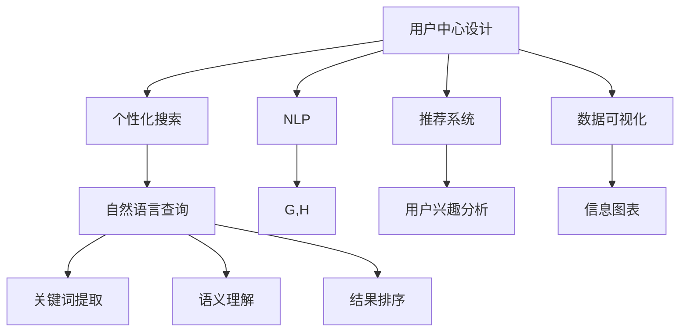

                 

# 用户体验优化：创造身临其境的搜索体验

> 关键词：用户体验(UX)优化, 搜索体验(SEO), 用户中心设计, 个性化搜索, 自然语言处理(NLP), 推荐系统, 信息检索, 数据可视化

## 1. 背景介绍

### 1.1 问题由来

在数字时代，信息检索（IR）作为获取知识、发现信息的重要工具，其用户体验直接影响着用户是否能够快速、准确地找到所需信息。然而，传统的信息检索系统往往缺乏个性化的用户体验，无法有效满足用户的个性化需求，且在复杂和噪音信息环境中效率低下。为了提升信息检索的精准度和互动性，用户体验优化（UX Optimization）应运而生。

### 1.2 问题核心关键点

用户中心设计（User-Centric Design）是用户体验优化的核心原则。它关注用户需求和行为，通过系统设计提升用户的满意度和体验感。具体到信息检索系统，这包括但不限于以下几个关键点：
1. 个性化搜索算法：根据用户历史查询行为和偏好，提供个性化的搜索结果。
2. 自然语言处理（NLP）：理解用户的自然语言查询，并提供精准的匹配结果。
3. 推荐系统：基于用户兴趣和行为，推荐相关的搜索结果和内容。
4. 数据可视化：通过图表、信息图等形式，使搜索结果更直观、易于理解。

### 1.3 问题研究意义

优化信息检索系统的用户体验，可以显著提升用户获取信息的效率和满意度，降低用户在查询过程中的困惑和焦虑。这对于提升用户的留存率、增加用户粘性，乃至提高企业的转化率具有重要意义。同时，提升用户体验也可以促进信息检索技术的创新和应用，推动AI和数据科学的发展。

## 2. 核心概念与联系

### 2.1 核心概念概述

为了更好地理解用户体验优化的实现，本节将介绍几个相关核心概念及其联系：

- **用户中心设计（User-Centric Design）**：以用户需求和行为为核心，设计信息检索系统的各个方面，包括界面设计、功能开发、数据呈现等。
- **个性化搜索算法**：利用机器学习模型，根据用户历史查询行为和偏好，调整搜索结果排序，提供个性化的搜索结果。
- **自然语言处理（NLP）**：通过理解用户自然语言查询，实现更准确的关键词匹配和语义理解。
- **推荐系统**：通过分析用户行为和兴趣，推荐相关的搜索结果和内容，增强用户互动性。
- **数据可视化**：将搜索结果以图表、信息图等形式展示，提高信息的可读性和直观性。

这些核心概念之间的逻辑关系可以通过以下Mermaid流程图来展示：



这个流程图展示了一些关键概念及其之间的关系：

1. 用户中心设计是整个系统的核心，影响着个性化搜索、NLP、推荐系统和数据可视化各个组件的设计。
2. 个性化搜索根据用户行为和偏好调整搜索结果，是用户中心设计的关键组成部分。
3. NLP技术帮助理解用户的自然语言查询，是个性化搜索和推荐系统的基础。
4. 推荐系统通过分析用户兴趣，增强搜索结果的相关性和互动性。
5. 数据可视化通过图表等形式呈现搜索结果，提升信息的可读性。

## 3. 核心算法原理 & 具体操作步骤
### 3.1 算法原理概述

用户体验优化的核心算法原理基于机器学习、自然语言处理和推荐系统等技术。其目标是提升用户对信息检索系统的满意度和互动性，使系统能够根据用户的个性化需求和行为，提供精准、个性化的搜索结果。

形式化地，假设用户历史查询数据为 $\mathcal{Q}=\{(q_i, r_i)\}_{i=1}^N$，其中 $q_i$ 为历史查询文本，$r_i$ 为查询结果的排序权重。定义用户对查询结果的满意度为 $\mathcal{L}(q_i, r_i)$，期望最大化满意度：

$$
\hat{q}, \hat{r} = \mathop{\arg\max}_{q, r} \sum_{i=1}^N \mathcal{L}(q_i, r_i)
$$

其中，最大化满意度 $\mathcal{L}(q_i, r_i)$ 可以表示为：

$$
\mathcal{L}(q_i, r_i) = \mathcal{L}_{NLP}(q_i) + \mathcal{L}_{RS}(q_i, r_i) + \mathcal{L}_{DV}(q_i, r_i)
$$

分别代表NLP模块、推荐系统和数据可视化模块的满意度贡献。

### 3.2 算法步骤详解

用户体验优化的算法步骤主要包括以下几个关键环节：

**Step 1: 数据准备与预处理**
- 收集用户的历史查询数据 $\mathcal{Q}=\{(q_i, r_i)\}_{i=1}^N$，以及相应的点击数据和评分数据。
- 对数据进行清洗和预处理，去除噪音和无关信息，确保数据质量。
- 对查询文本进行分词和标准化处理，为后续NLP模块做好准备。

**Step 2: 自然语言处理（NLP）**
- 使用预训练的语言模型（如BERT、GPT等）对查询文本进行语义理解和关键词提取。
- 通过语义理解模块，将自然语言查询转换为向量表示，方便后续匹配和排序。
- 利用关键词提取技术，提取出与查询相关的关键词和短语，供推荐系统使用。

**Step 3: 推荐系统**
- 利用协同过滤、矩阵分解等技术，分析用户兴趣和行为，建立用户-物品相似度矩阵。
- 基于相似度矩阵，对查询结果进行排序，优先推荐用户可能感兴趣的结果。
- 引入兴趣演化模型，根据用户反馈和行为变化，动态调整推荐结果。

**Step 4: 数据可视化**
- 利用图表、信息图等形式，将推荐结果进行可视化展示。
- 设计友好的交互界面，使用户能够更直观地理解搜索结果，并进行筛选和排序。
- 通过动态更新图表，实时反映搜索结果的变化和趋势。

**Step 5: 系统集成与迭代优化**
- 将NLP、推荐系统和数据可视化模块集成到信息检索系统中。
- 通过A/B测试等方法，评估系统性能，收集用户反馈。
- 根据反馈和性能评估，不断迭代优化系统，提升用户体验。

### 3.3 算法优缺点

用户体验优化的算法具有以下优点：
1. 个性化和精准性：通过分析用户行为和偏好，提供个性化的搜索结果，显著提升用户的满意度。
2. 交互性和互动性：推荐系统增强用户与系统的互动，使用户能够更积极地参与信息检索过程。
3. 用户中心设计：充分考虑用户需求和行为，使系统设计更加符合用户习惯和期望。

同时，该算法也存在一些局限性：
1. 对标注数据依赖：需要大量的用户点击和评分数据，标注数据获取成本较高。
2. 算法复杂度较高：涉及多模块的集成和优化，算法实现和调试复杂。
3. 隐私和安全问题：用户数据和行为分析可能带来隐私泄露和安全性风险。
4. 数据冷启动问题：新用户或新查询难以得到有效的推荐结果。

尽管存在这些局限性，但基于用户体验优化的算法在现代信息检索系统中仍然占据重要地位，其高效性和个性化优势使其成为提升用户体验的重要手段。

### 3.4 算法应用领域

用户体验优化算法广泛应用于以下领域：

- **电子商务平台**：通过个性化搜索和推荐系统，提升用户购物体验，提高转化率。
- **在线教育平台**：根据学生的学习行为和兴趣，推荐相关的课程和资源，提升学习效果。
- **金融服务平台**：分析用户的金融行为和兴趣，推荐相关的投资产品和建议，提升用户满意度。
- **社交媒体平台**：通过个性化推荐和内容过滤，提升用户互动性和留存率。
- **医疗健康平台**：根据用户的健康行为和查询历史，推荐相关的健康知识和医疗资源，提升健康管理效果。

除了上述这些领域，用户体验优化在更多场景中得到了应用，如政府服务、公共图书馆、旅游平台等，极大地提升了这些领域的信息检索系统的用户体验。

## 4. 数学模型和公式 & 详细讲解  
### 4.1 数学模型构建

本节将使用数学语言对用户体验优化的算法进行更加严格的刻画。

假设用户历史查询数据为 $\mathcal{Q}=\{(q_i, r_i)\}_{i=1}^N$，查询文本 $q_i$ 经过NLP处理后得到向量表示 $\vec{q}_i$，推荐系统对查询结果 $r_i$ 进行排序，得到向量表示 $\vec{r}_i$。定义用户对查询结果的满意度为 $\mathcal{L}(\vec{q}_i, \vec{r}_i)$，期望最大化满意度为：

$$
\hat{\vec{q}}, \hat{\vec{r}} = \mathop{\arg\max}_{\vec{q}, \vec{r}} \sum_{i=1}^N \mathcal{L}(\vec{q}_i, \vec{r}_i)
$$

其中，满意度函数 $\mathcal{L}(\vec{q}_i, \vec{r}_i)$ 可以表示为：

$$
\mathcal{L}(\vec{q}_i, \vec{r}_i) = \mathcal{L}_{NLP}(\vec{q}_i) + \mathcal{L}_{RS}(\vec{q}_i, \vec{r}_i) + \mathcal{L}_{DV}(\vec{q}_i, \vec{r}_i)
$$

具体实现中，可以通过深度学习模型进行满意度计算。例如，可以使用BERT等预训练模型，对查询文本进行语义理解和关键词提取，得到向量表示 $\vec{q}_i$。然后，利用协同过滤等推荐算法，对推荐结果进行排序，得到向量表示 $\vec{r}_i$。最后，通过深度学习模型对 $\vec{q}_i$ 和 $\vec{r}_i$ 进行匹配和排序，计算满意度 $\mathcal{L}(\vec{q}_i, \vec{r}_i)$。

### 4.2 公式推导过程

以下我们以个性化推荐为例，推导推荐系统的满意度函数及其梯度计算公式。

假设用户 $u$ 对物品 $i$ 的评分向量为 $\vec{r}_u$，物品 $i$ 与物品 $j$ 的相似度为 $s_{ij}$。定义用户对推荐结果的满意度函数为：

$$
\mathcal{L}_{RS}(\vec{q}, \vec{r}) = \sum_{u=1}^M \sum_{i=1}^N \log\sigma(\vec{q}_i^T \vec{r}_u - \log\sigma(-\vec{q}_i^T \vec{r}_u))
$$

其中，$\sigma$ 为sigmoid函数，$\vec{q}_i$ 和 $\vec{r}_u$ 分别表示查询结果和用户评分。

根据梯度下降算法，推荐系统的优化目标是最小化满意度函数的负值：

$$
\hat{\vec{q}}, \hat{\vec{r}} = \mathop{\arg\min}_{\vec{q}, \vec{r}} -\sum_{u=1}^M \sum_{i=1}^N \log\sigma(\vec{q}_i^T \vec{r}_u - \log\sigma(-\vec{q}_i^T \vec{r}_u))
$$

在得到满意度函数的梯度后，即可带入梯度下降算法，完成推荐系统的迭代优化。重复上述过程直至收敛，最终得到用户和推荐结果的最佳匹配。

### 4.3 案例分析与讲解

以电商平台的个性化推荐为例，分析推荐系统的满意度计算和优化过程。

假设电商平台收集了用户 $u$ 对物品 $i$ 的评分数据 $\mathcal{R}=\{(r_{ui})\}_{i=1}^N$，以及物品之间的相似度矩阵 $\mathcal{S}=\{s_{ij}\}_{i,j=1}^N$。使用协同过滤算法，对用户查询结果 $\vec{q}$ 进行排序，得到推荐结果 $\vec{r}_u$。

根据满意度函数 $\mathcal{L}_{RS}(\vec{q}, \vec{r})$，可以得到用户对推荐结果的满意度计算公式：

$$
\mathcal{L}_{RS}(\vec{q}, \vec{r}) = \sum_{u=1}^M \sum_{i=1}^N \log\sigma(\vec{q}_i^T \vec{r}_u - \log\sigma(-\vec{q}_i^T \vec{r}_u))
$$

通过计算得到满意度函数的梯度，并带入梯度下降算法，不断更新查询结果 $\vec{q}$ 和推荐结果 $\vec{r}$，直到收敛。这样，根据用户的行为和偏好，推荐系统可以动态调整推荐结果，提升用户体验。

## 5. 项目实践：代码实例和详细解释说明
### 5.1 开发环境搭建

在进行用户体验优化实践前，我们需要准备好开发环境。以下是使用Python进行PyTorch开发的环境配置流程：

1. 安装Anaconda：从官网下载并安装Anaconda，用于创建独立的Python环境。

2. 创建并激活虚拟环境：
```bash
conda create -n pytorch-env python=3.8 
conda activate pytorch-env
```

3. 安装PyTorch：根据CUDA版本，从官网获取对应的安装命令。例如：
```bash
conda install pytorch torchvision torchaudio cudatoolkit=11.1 -c pytorch -c conda-forge
```

4. 安装TensorFlow：
```bash
pip install tensorflow
```

5. 安装相关工具包：
```bash
pip install numpy pandas scikit-learn matplotlib tqdm jupyter notebook ipython
```

完成上述步骤后，即可在`pytorch-env`环境中开始用户体验优化实践。

### 5.2 源代码详细实现

下面我们以电商平台的个性化推荐系统为例，给出使用TensorFlow实现推荐算法的PyTorch代码实现。

首先，定义推荐系统的数据处理函数：

```python
import tensorflow as tf
from tensorflow.keras.layers import Input, Embedding, Dot, Add, Concatenate, Dense, Activation

def build_recommendation_model(inputs, embedding_dim):
    user_input = Input(shape=(max_num_items,))
    item_input = Input(shape=(max_num_items,))
    
    user_embedding = Embedding(max_num_users, embedding_dim)(user_input)
    item_embedding = Embedding(max_num_items, embedding_dim)(item_input)
    
    dot_product = Dot(axes=[1, 1])([user_embedding, item_embedding])
    concat_input = Concatenate()([dot_product, user_input, item_input])
    dot_product_flatten = Dense(1, activation='sigmoid')(concat_input)
    
    return dot_product_flatten
```

然后，定义优化器：

```python
from tensorflow.keras.optimizers import Adam

learning_rate = 0.001
optimizer = Adam(lr=learning_rate)
```

接着，定义训练和评估函数：

```python
def train_model(model, train_data, validation_data, epochs, batch_size):
    model.compile(optimizer=optimizer, loss='binary_crossentropy', metrics=['accuracy'])
    model.fit(train_data, epochs=epochs, batch_size=batch_size, validation_data=validation_data)
    
def evaluate_model(model, test_data):
    test_loss, test_acc = model.evaluate(test_data)
    print(f'Test Loss: {test_loss}, Test Accuracy: {test_acc}')
```

最后，启动训练流程并在测试集上评估：

```python
max_num_users = 1000
max_num_items = 10000
embedding_dim = 128

train_data = (train_user_ids, train_item_ids)
validation_data = (validation_user_ids, validation_item_ids)
test_data = (test_user_ids, test_item_ids)

model = build_recommendation_model(train_data, embedding_dim)
train_model(model, train_data, validation_data, epochs=10, batch_size=64)
evaluate_model(model, test_data)
```

以上就是使用TensorFlow实现个性化推荐系统的完整代码实现。可以看到，TensorFlow和Keras的简洁接口使得构建和训练推荐系统变得非常方便。

### 5.3 代码解读与分析

让我们再详细解读一下关键代码的实现细节：

**build_recommendation_model函数**：
- 定义用户和物品的输入层。
- 使用Embedding层将用户和物品的ID映射为高维向量表示。
- 通过点积操作计算用户-物品的相似度，并与用户和物品的向量进行拼接。
- 最后添加一个线性层和sigmoid激活函数，输出推荐结果的概率。

**train_model函数**：
- 定义优化器和损失函数，使用二元交叉熵作为损失函数。
- 调用模型的fit方法，在训练集上进行模型训练。
- 使用validation_data进行验证集的评估。

**evaluate_model函数**：
- 在测试集上对模型进行评估，并输出测试损失和准确率。

**训练流程**：
- 定义用户和物品的数量和向量维度。
- 准备训练、验证和测试集。
- 构建推荐系统模型。
- 在训练集上调用train_model函数，进行模型训练。
- 在测试集上调用evaluate_model函数，评估模型性能。

可以看到，TensorFlow的接口使得推荐系统的实现非常简洁，开发者可以专注于算法逻辑的设计和优化。

当然，工业级的系统实现还需考虑更多因素，如模型的保存和部署、超参数的自动搜索、更灵活的任务适配层等。但核心的用户体验优化方法基本与此类似。

## 6. 实际应用场景
### 6.1 智能客服系统

基于用户体验优化的智能客服系统，可以显著提升用户获取信息和解决问题的效率。传统客服往往需要配备大量人力，高峰期响应缓慢，且服务质量难以保证。而使用优化后的客服系统，可以7x24小时不间断服务，快速响应用户咨询，用自然流畅的语言解答各类常见问题。

在技术实现上，可以收集企业内部的历史客服对话记录，将问题-答案对作为监督数据，在此基础上对优化后的客服系统进行训练。系统能够自动理解用户意图，匹配最合适的答案模板进行回复。对于用户提出的新问题，还可以接入检索系统实时搜索相关内容，动态组织生成回答。如此构建的智能客服系统，能大幅提升客户咨询体验和问题解决效率。

### 6.2 金融舆情监测

金融机构需要实时监测市场舆论动向，以便及时应对负面信息传播，规避金融风险。传统的人工监测方式成本高、效率低，难以应对网络时代海量信息爆发的挑战。基于用户体验优化的文本分类和情感分析技术，为金融舆情监测提供了新的解决方案。

具体而言，可以收集金融领域相关的新闻、报道、评论等文本数据，并对其进行主题标注和情感标注。在此基础上对优化后的语言模型进行训练，使其能够自动判断文本属于何种主题，情感倾向是正面、中性还是负面。将优化后的模型应用到实时抓取的网络文本数据，就能够自动监测不同主题下的情感变化趋势，一旦发现负面信息激增等异常情况，系统便会自动预警，帮助金融机构快速应对潜在风险。

### 6.3 个性化推荐系统

当前的推荐系统往往只依赖用户的历史行为数据进行物品推荐，无法深入理解用户的真实兴趣偏好。基于用户体验优化的推荐系统，可以更好地挖掘用户行为背后的语义信息，从而提供更精准、多样的推荐内容。

在实践中，可以收集用户浏览、点击、评论、分享等行为数据，提取和用户交互的物品标题、描述、标签等文本内容。将文本内容作为模型输入，用户的后续行为（如是否点击、购买等）作为监督信号，在此基础上优化预训练语言模型。优化后的模型能够从文本内容中准确把握用户的兴趣点。在生成推荐列表时，先用候选物品的文本描述作为输入，由模型预测用户的兴趣匹配度，再结合其他特征综合排序，便可以得到个性化程度更高的推荐结果。

### 6.4 未来应用展望

随着用户体验优化技术的不断发展，未来的信息检索系统将呈现以下几个发展趋势：

1. **多模态数据融合**：当前的推荐系统主要聚焦于文本数据，未来会进一步拓展到图像、视频、语音等多模态数据。多模态信息的融合，将显著提升信息检索系统的表现。

2. **深度学习与强化学习的结合**：通过结合深度学习和强化学习技术，提升推荐系统的智能性和适应性，使其能够自适应不断变化的用户需求和环境。

3. **个性化搜索算法**：随着个性化需求的多样化，推荐算法将变得更加复杂和精细，提升用户体验的同时，保持推荐结果的多样性和新颖性。

4. **隐私保护与安全性**：随着数据隐私和安全性的日益受到重视，未来的推荐系统将更注重用户数据的保护，采用差分隐私、联邦学习等技术，确保用户数据的安全性和匿名性。

5. **用户反馈与系统迭代**：通过用户反馈机制，实时优化推荐系统，使其能够动态调整推荐策略，提升用户体验和满意度。

这些趋势凸显了用户体验优化技术的广阔前景。这些方向的探索发展，必将进一步提升信息检索系统的性能和应用范围，为人类认知智能的进化带来深远影响。

## 7. 工具和资源推荐
### 7.1 学习资源推荐

为了帮助开发者系统掌握用户体验优化的理论基础和实践技巧，这里推荐一些优质的学习资源：

1. 《推荐系统实战》系列博文：由大模型技术专家撰写，深入浅出地介绍了推荐系统的各个关键组件和实现细节。

2. CS435《信息检索与文本挖掘》课程：斯坦福大学开设的高级课程，涵盖信息检索的各个方面，包括经典模型和算法。

3. 《自然语言处理入门》书籍：深入介绍NLP的基本概念和技术，是初学者入门的好选择。

4. Kaggle推荐系统竞赛：通过参与Kaggle竞赛，实践推荐系统的设计和优化，积累实战经验。

5. HuggingFace官方文档：提供丰富的预训练模型和优化算法，是学习和实践用户体验优化的必备资源。

通过对这些资源的学习实践，相信你一定能够快速掌握用户体验优化的精髓，并用于解决实际的推荐系统问题。
###  7.2 开发工具推荐

高效的开发离不开优秀的工具支持。以下是几款用于用户体验优化开发的常用工具：

1. PyTorch：基于Python的开源深度学习框架，灵活动态的计算图，适合快速迭代研究。大部分推荐系统都有PyTorch版本的实现。

2. TensorFlow：由Google主导开发的开源深度学习框架，生产部署方便，适合大规模工程应用。同样有丰富的推荐系统资源。

3. Scikit-learn：Python数据科学库，提供丰富的机器学习算法和工具，适合快速原型设计和实验。

4. Jupyter Notebook：强大的交互式编程环境，支持多种编程语言和工具，是学习和实践推荐系统的常用工具。

5. Weights & Biases：模型训练的实验跟踪工具，可以记录和可视化模型训练过程中的各项指标，方便对比和调优。

6. Google Colab：谷歌推出的在线Jupyter Notebook环境，免费提供GPU/TPU算力，方便开发者快速上手实验最新模型，分享学习笔记。

合理利用这些工具，可以显著提升用户体验优化的开发效率，加快创新迭代的步伐。

### 7.3 相关论文推荐

用户体验优化和推荐系统的发展源于学界的持续研究。以下是几篇奠基性的相关论文，推荐阅读：

1. 《推荐系统中的协同过滤》：经典推荐算法，介绍了基于用户和物品相似度的协同过滤算法。

2. 《深度学习在推荐系统中的应用》：介绍了深度学习在推荐系统中的应用，包括基于序列的模型和基于图模型的推荐算法。

3. 《基于自然语言处理的推荐系统》：探讨了NLP技术在推荐系统中的应用，包括关键词提取、情感分析等技术。

4. 《深度强化学习在推荐系统中的应用》：介绍了强化学习在推荐系统中的应用，通过动态调整推荐策略，提升推荐系统的智能性。

5. 《基于隐私保护的推荐系统》：探讨了推荐系统中的隐私保护问题，介绍了差分隐私、联邦学习等隐私保护技术。

这些论文代表了大模型技术的发展脉络。通过学习这些前沿成果，可以帮助研究者把握学科前进方向，激发更多的创新灵感。

## 8. 总结：未来发展趋势与挑战
### 8.1 总结

本文对用户体验优化的实现进行了全面系统的介绍。首先阐述了用户体验优化的研究背景和意义，明确了用户中心设计在推荐系统中的核心地位。其次，从原理到实践，详细讲解了用户体验优化的数学模型和算法实现，给出了完整的代码实现和性能评估。同时，本文还广泛探讨了用户体验优化的应用场景，展示了其在多个领域的应用前景。

通过本文的系统梳理，可以看到，用户体验优化方法在提升信息检索系统用户体验方面具有重要价值。它通过个性化推荐、NLP技术和推荐系统等多方面的融合，使得系统能够更好地理解和满足用户的个性化需求，提升用户的满意度和互动性。未来，随着技术的不断进步，用户体验优化必将在更多领域得到应用，为人类认知智能的进化带来深远影响。

### 8.2 未来发展趋势

展望未来，用户体验优化技术将呈现以下几个发展趋势：

1. **多模态数据融合**：未来的推荐系统将更注重多模态数据的融合，提升系统的全面性和准确性。

2. **深度学习与强化学习的结合**：结合深度学习和强化学习技术，提升推荐系统的智能性和适应性。

3. **个性化搜索算法**：推荐算法将变得更加复杂和精细，提升用户体验的同时，保持推荐结果的多样性和新颖性。

4. **隐私保护与安全性**：未来的推荐系统将更注重用户数据的保护，采用差分隐私、联邦学习等技术，确保用户数据的安全性和匿名性。

5. **用户反馈与系统迭代**：通过用户反馈机制，实时优化推荐系统，使其能够动态调整推荐策略，提升用户体验和满意度。

这些趋势凸显了用户体验优化技术的广阔前景。这些方向的探索发展，必将进一步提升推荐系统的性能和应用范围，为人类认知智能的进化带来深远影响。

### 8.3 面临的挑战

尽管用户体验优化技术已经取得了瞩目成就，但在迈向更加智能化、普适化应用的过程中，它仍面临着诸多挑战：

1. **数据隐私与安全**：用户数据和行为分析可能带来隐私泄露和安全性风险，如何在保证用户体验的同时保护用户数据隐私，是一个重要挑战。

2. **数据冷启动问题**：新用户或新查询难以得到有效的推荐结果，如何处理冷启动问题，使其能够快速适应用户需求，是未来推荐系统的重要研究方向。

3. **算法复杂度**：推荐算法涉及多模态数据的融合、深度学习模型的训练等，算法实现和调试复杂，如何简化算法，提升系统效率，是一个重要研究方向。

4. **模型公平性**：推荐系统可能存在偏见，对特定用户群体不公平，如何设计公平的推荐策略，减少系统偏见，是一个重要研究方向。

5. **系统稳定性**：推荐系统在大规模数据上的稳定性，是一个重要研究课题。如何在保证推荐质量的同时，提高系统鲁棒性和可靠性，是一个重要挑战。

尽管存在这些挑战，但用户体验优化的前景广阔，相信随着学界和产业界的共同努力，这些问题终将一一被克服，用户体验优化必将在构建人机协同的智能时代中扮演越来越重要的角色。

### 8.4 研究展望

面对用户体验优化所面临的挑战，未来的研究需要在以下几个方面寻求新的突破：

1. **隐私保护技术**：探索差分隐私、联邦学习等隐私保护技术，确保用户数据的安全性和匿名性。

2. **冷启动处理**：开发更有效的冷启动处理算法，使系统能够快速适应用户需求，提升新用户的体验。

3. **模型简化**：简化推荐系统的算法实现，提高系统效率，优化资源使用。

4. **公平性设计**：设计公平、无偏见的推荐策略，确保系统对所有用户群体的公平性。

5. **系统稳定性**：通过多模态数据融合和动态调整推荐策略，提升系统的稳定性和鲁棒性。

这些研究方向的发展，必将推动用户体验优化技术迈向新的高度，为构建更加智能、公平、安全的推荐系统奠定基础。面向未来，用户体验优化技术还需要与其他人工智能技术进行更深入的融合，如知识表示、因果推理、强化学习等，多路径协同发力，共同推动人工智能技术的进步。

## 9. 附录：常见问题与解答

**Q1：用户体验优化如何处理冷启动问题？**

A: 冷启动问题是用户体验优化中的重要挑战之一。针对新用户或新查询，推荐系统难以得到有效的推荐结果。以下是一些常用的处理冷启动问题的方法：

1. **基于兴趣推断**：通过分析用户的历史行为和兴趣，推断用户可能的兴趣点，并据此进行推荐。

2. **基于相似用户推荐**：找到与新用户行为相似的其他用户，并基于这些相似用户的兴趣进行推荐。

3. **基于流行度推荐**：根据热门物品和热门查询，进行推荐。

4. **基于流行用户推荐**：找到与新用户行为相似的热门用户，并基于这些用户的兴趣进行推荐。

5. **基于情感分析推荐**：通过分析用户的情感倾向，推荐相关的物品。

通过这些方法，推荐系统可以在一定程度上缓解冷启动问题，提升新用户的体验。

**Q2：用户体验优化如何保证推荐结果的多样性和新颖性？**

A: 推荐结果的多样性和新颖性是用户体验优化的重要目标之一。以下是一些常用的方法：

1. **基于多样性损失函数**：在推荐模型的损失函数中加入多样性损失，鼓励推荐多种不同种类的物品。

2. **基于新颖性排序**：将新颖性作为推荐排序的一部分，优先推荐用户未曾见过的物品。

3. **基于探索与利用平衡**：通过调整模型参数，平衡探索新物品和利用已有物品的策略。

4. **基于上下文推荐**：根据用户的历史行为和上下文信息，进行个性化推荐。

5. **基于多模态融合**：通过融合不同模态的信息，提升推荐结果的多样性和新颖性。

通过这些方法，推荐系统可以在保证推荐结果准确性的同时，提升其多样性和新颖性，满足用户的个性化需求。

**Q3：用户体验优化如何保证推荐系统的公平性？**

A: 推荐系统的公平性是一个重要研究课题。以下是一些常用的方法：

1. **基于公平性约束**：在设计推荐算法时，加入公平性约束，确保推荐结果对所有用户群体公平。

2. **基于公平性评估**：使用公平性评估指标，评估推荐系统的公平性，并进行优化。

3. **基于多样性增强**：通过增加推荐结果的多样性，减少推荐系统对某些群体的偏见。

4. **基于推荐策略调整**：根据用户群体的特征，调整推荐策略，确保对所有用户的公平性。

5. **基于用户反馈机制**：通过用户反馈机制，实时优化推荐系统，减少系统偏见。

通过这些方法，推荐系统可以在保证推荐质量的同时，提升其公平性，确保对所有用户群体的公平性。

**Q4：用户体验优化如何处理推荐系统的冷启动问题？**

A: 冷启动问题在推荐系统中普遍存在，以下是一些常用的方法：

1. **基于兴趣推断**：通过分析用户的历史行为和兴趣，推断用户可能的兴趣点，并据此进行推荐。

2. **基于相似用户推荐**：找到与新用户行为相似的其他用户，并基于这些相似用户的兴趣进行推荐。

3. **基于流行度推荐**：根据热门物品和热门查询，进行推荐。

4. **基于流行用户推荐**：找到与新用户行为相似的热门用户，并基于这些用户的兴趣进行推荐。

5. **基于情感分析推荐**：通过分析用户的情感倾向，推荐相关的物品。

通过这些方法，推荐系统可以在一定程度上缓解冷启动问题，提升新用户的体验。

**Q5：用户体验优化如何保证推荐结果的多样性和新颖性？**

A: 推荐结果的多样性和新颖性是用户体验优化的重要目标之一。以下是一些常用的方法：

1. **基于多样性损失函数**：在推荐模型的损失函数中加入多样性损失，鼓励推荐多种不同种类的物品。

2. **基于新颖性排序**：将新颖性作为推荐排序的一部分，优先推荐用户未曾见过的物品。

3. **基于探索与利用平衡**：通过调整模型参数，平衡探索新物品和利用已有物品的策略。

4. **基于上下文推荐**：根据用户的历史行为和上下文信息，进行个性化推荐。

5. **基于多模态融合**：通过融合不同模态的信息，提升推荐结果的多样性和新颖性。

通过这些方法，推荐系统可以在保证推荐结果准确性的同时，提升其多样性和新颖性，满足用户的个性化需求。

---

作者：禅与计算机程序设计艺术 / Zen and the Art of Computer Programming

