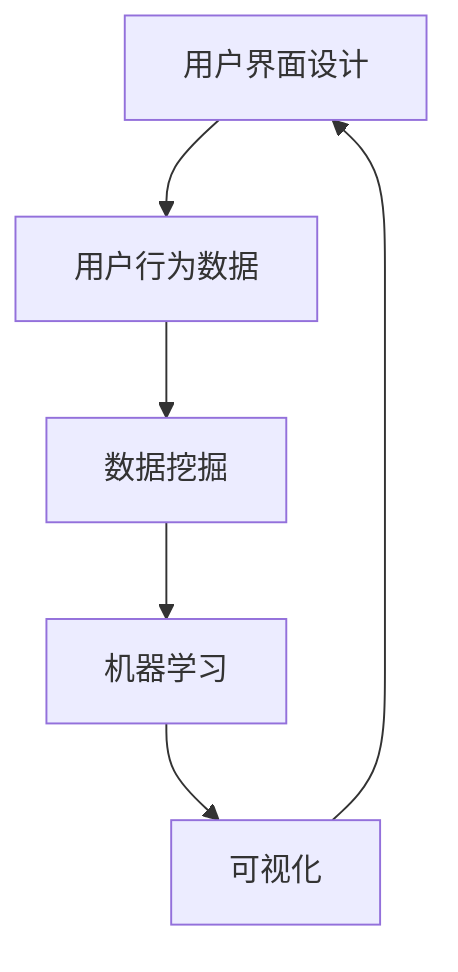

                 

# 用户界面设计：打造友好易用的人机交互

## 1. 背景介绍

在数字化时代，人机交互已经成为了各行各业的核心竞争力。无论在消费电子、企业应用、智能家居，还是自动驾驶等领域，一个友好易用的用户界面(UI)都是用户与系统沟通的桥梁，直接影响了用户的使用体验和满意度。从Web到移动应用，再到智能设备，用户界面设计已经成为提升产品竞争力的关键因素之一。

### 1.1 问题由来
随着科技的飞速发展，用户界面设计的重要性日益凸显。传统的用户界面设计流程往往依赖于设计师的经验和直觉，存在一定的局限性和不确定性。近年来，随着人工智能、数据科学等技术的发展，逐渐出现了一种基于数据的UI设计方法，即数据驱动的用户界面设计。

### 1.2 问题核心关键点
数据驱动的用户界面设计，是通过对用户行为数据的分析，挖掘出用户的偏好和需求，从而指导UI设计师进行精准的设计。这种基于数据的UI设计方法，克服了传统设计方法的局限性，能够更加科学、高效地完成用户界面的设计。

## 2. 核心概念与联系

### 2.1 核心概念概述

为了更好地理解数据驱动的用户界面设计，本节将介绍几个关键概念：

- **用户界面设计(UI Design)**：设计和实现用户与系统的交互界面，包括布局、颜色、字体、按钮等视觉元素，以及交互逻辑和功能模块等。

- **用户行为数据(User Behavior Data)**：用户在应用中的点击、浏览、操作等行为数据，是数据驱动UI设计的核心来源。

- **数据挖掘(Data Mining)**：通过算法从大量数据中提取有用信息和知识，是数据驱动UI设计的基础。

- **机器学习(Machine Learning)**：利用数据训练模型，预测用户行为，是数据驱动UI设计的关键技术。

- **可视化(Visualization)**：将数据和模型结果以图形的形式展示给用户，帮助UI设计师理解和优化设计方案。

这些概念之间的逻辑关系可以通过以下Mermaid流程图来展示：



这个流程图展示了用户界面设计的核心概念及其之间的关系：

1. 用户界面设计依赖于用户行为数据。
2. 数据挖掘从用户行为数据中提取有用信息。
3. 机器学习利用这些信息训练模型，预测用户行为。
4. 可视化展示模型结果，指导UI设计师进行优化。

## 3. 核心算法原理 & 具体操作步骤

### 3.1 算法原理概述

数据驱动的用户界面设计，本质上是一个基于机器学习模型的预测与优化过程。其核心思想是：通过分析用户行为数据，挖掘出用户的交互模式和偏好，然后设计出一个符合用户期望的用户界面。

形式化地，假设用户行为数据集为 $D=\{(x_i,y_i)\}_{i=1}^N$，其中 $x_i$ 表示用户行为序列，$y_i$ 表示对应的用户反馈或评价。数据驱动的UI设计任务即为寻找一个函数 $f$，使得 $f(x_i)$ 近似于 $y_i$。即：

$$
f(x_i) \approx y_i
$$

常用的机器学习算法包括线性回归、决策树、随机森林、神经网络等。通过这些算法训练得到预测模型 $f$，从而对新的用户行为数据进行预测，指导UI设计师进行设计优化。

### 3.2 算法步骤详解

数据驱动的用户界面设计一般包括以下几个关键步骤：

**Step 1: 数据收集与预处理**
- 使用工具(如Google Analytics、Mixpanel等)收集用户行为数据，包括点击、滑动、操作等。
- 对数据进行清洗和预处理，去除噪声和异常值，保证数据的质量和一致性。

**Step 2: 特征提取与工程**
- 对用户行为数据进行特征提取，生成有意义的特征向量。
- 根据任务需求，对特征进行进一步工程，如时间戳的离散化、操作序列的编码等。

**Step 3: 模型训练与优化**
- 选择适合的机器学习算法，如决策树、随机森林、神经网络等。
- 使用训练数据集对模型进行训练，并根据验证集结果进行模型优化。
- 通过交叉验证等方法，评估模型的泛化能力。

**Step 4: 预测与可视化**
- 使用训练好的模型对新的用户行为数据进行预测，生成推荐的设计方案。
- 通过可视化工具(如Tableau、Power BI等)展示预测结果，直观展示设计方案的效果。
- 结合设计师的经验和直觉，对推荐方案进行调整和优化。

**Step 5: 实际应用与反馈**
- 将优化后的UI设计应用到产品中，收集用户的反馈数据。
- 对反馈数据进行分析，验证设计的有效性，并持续迭代优化。

以上是数据驱动的用户界面设计的一般流程。在实际应用中，还需要根据具体任务特点，对各个环节进行优化设计，如改进数据收集方法、采用更高效的模型、优化特征工程等，以进一步提升设计效果。

### 3.3 算法优缺点

数据驱动的用户界面设计具有以下优点：
1. 科学准确。通过数据挖掘和机器学习，能够更加准确地理解用户需求，避免依赖设计师的主观判断。
2. 高效灵活。可以快速迭代优化设计方案，适应不同用户群体的多样化需求。
3. 数据驱动。以实际用户数据为基础，能够生成更加贴近用户习惯的设计方案。

同时，该方法也存在一定的局限性：
1. 数据质量要求高。数据的质量和完整性直接影响模型的预测效果。
2. 隐私保护问题。用户行为数据的收集和处理需要严格遵守隐私保护法规。
3. 模型复杂度。复杂的模型可能存在过拟合风险，需要合理选择模型和参数。
4. 人机协同。模型的预测结果需要结合设计师的经验和直觉进行综合优化。

尽管存在这些局限性，但就目前而言，数据驱动的用户界面设计方法已经逐渐成为UI设计的趋势，广泛应用于消费电子、企业应用、智能设备等多个领域。

### 3.4 算法应用领域

数据驱动的用户界面设计在各个领域都得到了广泛的应用，例如：

- **消费电子**：手机、平板、智能手表等设备的UI设计。通过对用户行为数据的分析，设计出更加符合用户习惯的界面布局和交互逻辑。
- **企业应用**：CRM、ERP、OA等系统的UI设计。通过分析员工的操作行为数据，优化操作流程和界面布局，提升系统易用性。
- **智能家居**：智能音箱、智能门锁等设备的UI设计。通过对用户交互数据的分析，设计出更加人性化的界面和操作方式。
- **自动驾驶**：汽车、无人驾驶等智能交通系统的UI设计。通过对驾驶员行为数据的分析，设计出更加安全、可靠的交互界面。

除了上述这些经典应用外，数据驱动的UI设计还正在被创新性地应用到更多场景中，如虚拟现实、增强现实、人机交互等，为UI设计带来了新的突破。

## 4. 数学模型和公式 & 详细讲解 & 举例说明

### 4.1 数学模型构建

本节将使用数学语言对数据驱动的用户界面设计过程进行更加严格的刻画。

记用户行为数据为 $D=\{(x_i,y_i)\}_{i=1}^N$，其中 $x_i$ 表示用户行为序列，$y_i$ 表示对应的用户反馈或评价。假设用户行为序列为时间序列数据，每个行为 $x_i$ 由若干个特征向量 $x_{i,j}$ 组成，即 $x_i = [x_{i,1}, x_{i,2}, ..., x_{i,M}]$，其中 $M$ 表示行为序列的长度。

定义预测函数 $f: \mathcal{X} \rightarrow \mathcal{Y}$，其中 $\mathcal{X}$ 为特征空间，$\mathcal{Y}$ 为用户反馈或评价空间。通过数据集 $D$ 训练得到预测函数 $f$，使得 $f(x_i)$ 近似于 $y_i$。即：

$$
\min_{f \in \mathcal{H}} \sum_{i=1}^N \ell(f(x_i),y_i)
$$

其中 $\mathcal{H}$ 为模型假设空间，$\ell$ 为损失函数，常见的损失函数包括均方误差、交叉熵等。

### 4.2 公式推导过程

以下我们以交叉熵损失函数为例，推导预测函数 $f$ 的求解公式。

假设用户行为序列为 $x_i = [x_{i,1}, x_{i,2}, ..., x_{i,M}]$，对应的用户反馈为 $y_i \in \{0,1\}$。则交叉熵损失函数定义为：

$$
\ell(f(x_i),y_i) = -y_i\log f(x_i) - (1-y_i)\log (1-f(x_i))
$$

将其代入经验风险公式，得：

$$
\mathcal{L}(f) = -\frac{1}{N}\sum_{i=1}^N \left[y_i\log f(x_i) + (1-y_i)\log (1-f(x_i))\right]
$$

定义预测函数 $f$ 为sigmoid函数，即 $f(x_i) = \sigma(Wx_i + b)$，其中 $W$ 和 $b$ 为模型参数。则预测函数 $f$ 的损失函数为：

$$
\mathcal{L}(f) = -\frac{1}{N}\sum_{i=1}^N \left[y_i\log \sigma(Wx_i + b) + (1-y_i)\log (1-\sigma(Wx_i + b))\right]
$$

根据链式法则，损失函数对参数 $W$ 和 $b$ 的梯度为：

$$
\frac{\partial \mathcal{L}(f)}{\partial W} = -\frac{1}{N}\sum_{i=1}^N \left[y_i\frac{\partial \sigma(Wx_i + b)}{\partial W} - (1-y_i)\frac{\partial (1-\sigma(Wx_i + b))}{\partial W}\right]
$$

$$
\frac{\partial \mathcal{L}(f)}{\partial b} = -\frac{1}{N}\sum_{i=1}^N \left[y_i\frac{\partial \sigma(Wx_i + b)}{\partial b} - (1-y_i)\frac{\partial (1-\sigma(Wx_i + b))}{\partial b}\right]
$$

通过梯度下降等优化算法，求解预测函数 $f$，最小化损失函数 $\mathcal{L}(f)$。得到最优预测函数后，将其应用于新的用户行为序列 $x_{new}$，即 $y_{predicted} = f(x_{new})$，即可得到推荐的设计方案。

### 4.3 案例分析与讲解

假设我们要设计一个电商平台的登录界面，目标是最大化用户登录成功率。收集用户登录行为数据 $D=\{(x_i,y_i)\}_{i=1}^N$，其中 $x_i$ 为登录行为序列，$y_i$ 为登录成功与否。通过数据挖掘和机器学习，得到预测函数 $f(x_i)$，即登录成功的概率。

假设使用sigmoid函数作为预测函数，即 $f(x_i) = \sigma(Wx_i + b)$。通过训练数据集 $D$，求解模型参数 $W$ 和 $b$，使得 $f(x_i)$ 尽可能接近 $y_i$。最后，将预测函数 $f(x_i)$ 应用于新的用户登录行为序列 $x_{new}$，即 $y_{predicted} = f(x_{new})$，即可得到推荐的设计方案，优化用户登录界面的交互逻辑和提示信息。

## 5. 项目实践：代码实例和详细解释说明

### 5.1 开发环境搭建

在进行UI设计实践前，我们需要准备好开发环境。以下是使用Python进行机器学习和数据可视化的环境配置流程：

1. 安装Anaconda：从官网下载并安装Anaconda，用于创建独立的Python环境。

2. 创建并激活虚拟环境：
```bash
conda create -n ui-design-env python=3.8 
conda activate ui-design-env
```

3. 安装必要的Python包：
```bash
conda install numpy pandas matplotlib scikit-learn
```

4. 安装可视化工具：
```bash
pip install seaborn plotly
```

5. 安装机器学习库：
```bash
pip install scikit-learn
```

完成上述步骤后，即可在`ui-design-env`环境中开始UI设计实践。

### 5.2 源代码详细实现

这里我们以电商平台的登录界面设计为例，给出使用Python和机器学习工具进行UI设计的代码实现。

首先，定义登录行为数据集：

```python
import pandas as pd
from sklearn.model_selection import train_test_split
from sklearn.preprocessing import StandardScaler
from sklearn.linear_model import LogisticRegression

# 加载登录行为数据
data = pd.read_csv('login_data.csv')

# 数据预处理
features = data.drop(['login_success'], axis=1)
labels = data['login_success']

# 特征标准化
scaler = StandardScaler()
features = scaler.fit_transform(features)

# 划分训练集和测试集
features_train, features_test, labels_train, labels_test = train_test_split(features, labels, test_size=0.2, random_state=42)

# 训练模型
model = LogisticRegression()
model.fit(features_train, labels_train)
```

然后，定义预测函数并生成推荐的设计方案：

```python
from sklearn.metrics import accuracy_score

# 定义预测函数
def predict_login_success(features):
    features = scaler.transform(features)
    predictions = model.predict(features)
    return predictions

# 应用预测函数到新行为数据
new_features = [[1, 0, 1, 0, 0, 1, 0, 1]]  # 示例行为数据
predictions = predict_login_success(new_features)

# 输出推荐的设计方案
if predictions[0] == 1:
    print('推荐提示信息：输入正确的用户名和密码')
else:
    print('推荐提示信息：用户名或密码错误')
```

最后，使用可视化工具展示模型预测结果：

```python
import seaborn as sns
import plotly.graph_objects as go

# 可视化预测结果
predictions = predict_login_success(new_features)
fig = go.Figure()
fig.add_trace(go.Scatter(x=[0, 1], y=[0, 1], mode='lines', name='real'))
fig.add_trace(go.Scatter(x=[0, 1], y=[predictions[0], predictions[0]], mode='lines', name='predicted'))
fig.update_layout(xaxis_title='User Behavior', yaxis_title='Login Success', template='plotly_white')
fig.show()
```

以上就是使用Python和机器学习工具对电商平台登录界面进行数据驱动设计的完整代码实现。可以看到，通过收集用户行为数据，使用机器学习算法训练预测函数，可以生成推荐的登录界面设计方案，优化用户交互体验。

### 5.3 代码解读与分析

让我们再详细解读一下关键代码的实现细节：

**数据预处理**：
- `data.drop(['login_success'], axis=1)`：从数据集中删除目标变量`login_success`，只保留特征数据。
- `StandardScaler()`：对特征数据进行标准化处理，使各特征具有相同的量级。
- `train_test_split()`：将数据集划分为训练集和测试集，便于模型训练和评估。

**模型训练**：
- `LogisticRegression()`：选择逻辑回归作为预测模型，解决二分类问题。
- `model.fit(features_train, labels_train)`：使用训练数据集训练模型，得到最优模型参数。

**预测函数**：
- `predict_login_success()`：定义预测函数，对新的行为数据进行预测，输出登录成功与否的概率。

**可视化**：
- `seaborn`和`plotly`：使用可视化工具展示模型预测结果，直观展示用户行为和预测概率的关系。

通过这些代码的实现，可以看到数据驱动的用户界面设计过程是科学且可量化的，为UI设计提供了可靠的理论基础和实践指南。

## 6. 实际应用场景

### 6.1 智能家居界面设计

智能家居系统的UI设计，需要通过数据分析了解用户的使用习惯和需求。例如，通过分析用户的开关灯行为，优化智能灯的开关控制界面，提升用户操作体验。

具体而言，可以收集智能灯的开关行为数据，包括开关时间和频率等，作为用户行为数据。通过数据挖掘和机器学习，预测用户未来的开关灯需求，优化智能灯的开关控制界面，实现更加人性化的操作体验。

### 6.2 企业应用界面设计

企业应用系统如CRM、ERP、OA等，需要根据用户的操作行为数据，优化界面布局和功能模块。例如，通过分析员工在CRM系统中的操作行为，设计出更加高效的操作流程和界面，提升系统的易用性和用户体验。

具体而言，可以收集员工在CRM系统中的操作行为数据，包括查看、编辑、提交等行为数据。通过数据挖掘和机器学习，预测员工的操作行为模式，优化界面布局和功能模块，提升系统的易用性和用户体验。

### 6.3 金融产品界面设计

金融产品如理财、保险、证券等，需要根据用户的行为数据，优化界面设计和交互逻辑。例如，通过分析用户的交易行为，设计出更加直观的理财界面，提升用户的操作体验和满意度。

具体而言，可以收集用户的交易行为数据，包括交易金额、频率等行为数据。通过数据挖掘和机器学习，预测用户的交易行为模式，优化理财界面的设计和交互逻辑，提升用户的操作体验和满意度。

### 6.4 未来应用展望

随着数据驱动的UI设计方法逐渐成熟，其在更多领域的应用前景将更加广阔。未来，数据驱动的UI设计将与人工智能、大数据、云计算等技术进一步融合，推动UI设计的智能化、自动化和个性化发展。以下是一些未来的应用趋势：

1. **智能UI设计**：通过数据挖掘和机器学习，自动化生成UI设计方案，提升设计的效率和精度。
2. **个性化UI设计**：根据用户的行为数据，动态调整UI设计，实现个性化的用户界面。
3. **多模态UI设计**：结合视觉、触觉、听觉等多种模态数据，设计出更加丰富多样的用户界面。
4. **增强现实UI设计**：利用AR技术，增强用户的交互体验和操作便利性。
5. **混合现实UI设计**：结合VR和AR技术，实现更加沉浸式和互动式的用户界面。

## 7. 工具和资源推荐

### 7.1 学习资源推荐

为了帮助开发者系统掌握数据驱动的UI设计理论基础和实践技巧，这里推荐一些优质的学习资源：

1. 《数据驱动的设计：用数据指导UI设计》系列博文：由设计专家撰写，深入浅出地介绍了数据驱动设计的基本概念和实践方法。

2. 《人机交互设计原理与实践》课程：斯坦福大学开设的UI设计课程，涵盖了用户行为分析、界面设计、交互逻辑等多个方面。

3. 《用户界面设计实战》书籍：详细介绍了UI设计的理论基础和实践案例，适合设计人员和开发者参考。

4. Udacity《数据驱动的设计》课程：基于真实项目案例，讲解数据驱动设计的实际应用方法。

5. Coursera《数据可视化与设计》课程：讲解如何利用数据可视化技术，提升UI设计的精度和效率。

通过对这些资源的学习实践，相信你一定能够快速掌握数据驱动的UI设计精髓，并用于解决实际的UI设计问题。

### 7.2 开发工具推荐

高效的开发离不开优秀的工具支持。以下是几款用于数据驱动UI设计开发的常用工具：

1. Python：基于Python的开源语言，具有强大的数据处理和机器学习能力，适合进行数据挖掘和模型训练。

2. R语言：专门用于数据科学和统计分析的语言，拥有丰富的统计分析和数据可视化库，适合进行数据分析和可视化。

3. Tableau：商业化的数据可视化工具，支持数据的交互式探索和可视化展示，适合进行数据探索和报告制作。

4. Power BI：微软推出的数据可视化工具，支持数据的连接和分析，适合进行数据分析和报告制作。

5. D3.js：基于Web的可视化库，支持交互式数据可视化，适合进行Web界面的可视化设计。

6. WebGL：基于Web的图形渲染库，支持复杂的3D图形渲染，适合进行增强现实和混合现实的UI设计。

合理利用这些工具，可以显著提升数据驱动的UI设计开发效率，加快创新迭代的步伐。

### 7.3 相关论文推荐

数据驱动的UI设计是一个前沿的研究方向，以下几篇论文代表了这个领域的研究进展，推荐阅读：

1. "Data-Driven User Interface Design" by Jeff Bucy and Bill Buxton：介绍了数据驱动UI设计的基本概念和方法，是领域的经典之作。

2. "A Data-Driven Approach to Interactive Design" by Paul H. G. Gleerup et al.：从交互设计的角度，探讨数据驱动UI设计的实现方法。

3. "Data Mining and Statistical Learning for Interactive Systems" by Elena Y. Savinova et al.：讲解了数据挖掘和机器学习在交互系统中的应用，是领域的重要参考资料。

4. "The Design of Interaction with Data Visualizations" by Francesca Farabollini et al.：介绍了数据可视化技术在UI设计中的应用，是领域的重要研究成果。

5. "Data-Driven Design of Interactive Systems" by Jannis Leidel et al.：讲解了数据驱动交互系统的实现方法和案例，是领域的重要参考资料。

这些论文代表了大数据驱动UI设计的最新进展，通过学习这些前沿成果，可以帮助研究者把握学科前进方向，激发更多的创新灵感。

## 8. 总结：未来发展趋势与挑战

### 8.1 总结

本文对数据驱动的用户界面设计方法进行了全面系统的介绍。首先阐述了数据驱动UI设计的背景和意义，明确了数据驱动设计在提升UI设计效率和精度方面的独特价值。其次，从原理到实践，详细讲解了数据驱动UI设计的数学模型和关键步骤，给出了实际应用中的代码实现。同时，本文还广泛探讨了数据驱动UI设计在多个行业领域的应用前景，展示了数据驱动范式在UI设计中的巨大潜力。

通过本文的系统梳理，可以看到，数据驱动的用户界面设计正在成为UI设计的趋势，通过数据的科学分析和机器学习模型的指导，UI设计师能够更加精准、高效地完成设计任务，提升产品的用户体验。未来，伴随数据驱动设计的不断演进，相信UI设计技术将在更多领域得到应用，为人类生产生活带来深远影响。

### 8.2 未来发展趋势

展望未来，数据驱动的UI设计将呈现以下几个发展趋势：

1. **智能化设计**：通过数据挖掘和机器学习，实现智能化的UI设计，自动化生成设计方案，提升设计的效率和精度。

2. **个性化设计**：根据用户的行为数据，动态调整UI设计，实现个性化的用户界面，提升用户体验。

3. **多模态设计**：结合视觉、触觉、听觉等多种模态数据，设计出更加丰富多样的用户界面，提升用户的操作便利性。

4. **增强现实和混合现实**：利用AR和MR技术，增强用户的交互体验和操作便利性，设计出更加沉浸式和互动式的用户界面。

5. **自动化设计**：通过自动化设计工具，提升UI设计的效率和质量，实现更快速的迭代和优化。

以上趋势凸显了数据驱动UI设计的广阔前景，这些方向的探索发展，必将进一步提升UI设计的智能化、自动化和个性化水平，为UI设计技术带来新的突破。

### 8.3 面临的挑战

尽管数据驱动的UI设计已经取得了一定的进展，但在迈向更加智能化、普适化应用的过程中，仍面临着诸多挑战：

1. **数据质量和隐私保护**：数据的质量和隐私保护是数据驱动UI设计的核心问题。数据的完整性、准确性、安全性都需要得到严格保障。

2. **算法复杂度**：复杂的机器学习算法可能存在过拟合风险，需要合理选择模型和参数，避免过度复杂化。

3. **人机协同**：模型的预测结果需要结合设计师的经验和直觉进行综合优化，如何平衡算法和人工决策是一个难题。

4. **模型解释性**：数据驱动UI设计依赖于模型的预测结果，模型的可解释性是一个重要的研究方向。

5. **设计标准化**：不同设计师的设计风格和经验不同，如何标准化设计流程，提升设计的一致性和可复用性，也是一个重要问题。

尽管存在这些挑战，但数据驱动的UI设计已经展现出强大的应用潜力，相信随着技术的不断进步和完善，这些挑战终将一一被克服，数据驱动UI设计必将在未来得到更加广泛的应用。

### 8.4 研究展望

未来，数据驱动的UI设计需要在以下几个方面进一步探索和突破：

1. **多源数据融合**：将用户行为数据、情感数据、生理数据等多种数据源进行融合，全面理解用户需求和行为，提升UI设计的准确性和个性化。

2. **交互模型设计**：通过交互模型设计，实现用户行为和系统响应的精准匹配，提升用户的操作体验和满意度。

3. **跨领域应用**：将数据驱动UI设计应用于更多领域，如智能制造、智慧城市、智能交通等，拓展UI设计的应用场景。

4. **交互设计自动化**：通过自动化设计工具，提升UI设计的效率和质量，实现更快速的迭代和优化。

5. **实时交互设计**：实现实时交互设计，快速响应用户需求，提升UI设计的灵活性和适应性。

通过这些方向的研究，数据驱动UI设计必将在未来的设计实践中发挥更大的作用，推动UI设计技术的持续发展和创新。

## 9. 附录：常见问题与解答

**Q1：数据驱动的UI设计是否适用于所有用户界面设计任务？**

A: 数据驱动的UI设计适用于大多数用户界面设计任务，特别是数据量较大的任务。但对于一些特定领域的任务，如高端定制设计、艺术设计等，仍然需要依靠设计师的经验和直觉进行设计。

**Q2：如何选择适合数据驱动UI设计的方法？**

A: 选择适合数据驱动UI设计的方法需要考虑以下几个方面：
1. 数据量大小：数据量较大时，可以选择基于机器学习的方法，如分类、回归等；数据量较小时，可以选择基于统计分析的方法，如频率分析、聚类等。
2. 设计需求：设计需求复杂时，可以选择基于预测模型的方法，如回归模型、分类模型等；设计需求简单时，可以选择基于统计分析的方法，如频率分析、聚类等。
3. 用户群体：用户群体多元化时，可以选择基于多模态数据的方法，如结合视觉、触觉、听觉等多种模态数据进行设计；用户群体单一时，可以选择基于单模态数据的方法，如仅使用文本数据进行设计。

**Q3：数据驱动UI设计是否需要考虑隐私保护问题？**

A: 数据驱动UI设计需要严格遵守隐私保护法规，确保用户数据的保密性和安全性。一般需要在数据收集、存储、处理和传输等环节采取加密、匿名化等措施，避免敏感信息泄露。

**Q4：如何评价数据驱动UI设计的效果？**

A: 评价数据驱动UI设计的效果需要考虑以下几个方面：
1. 用户满意度：通过用户调查、用户行为数据等手段，评估用户对UI设计的满意度。
2. 操作效率：通过用户行为数据等手段，评估用户的操作效率和流畅度。
3. 设计一致性：通过标准化的设计流程和工具，提升设计的一致性和可复用性。

**Q5：数据驱动UI设计是否需要考虑交互设计的自动化？**

A: 数据驱动UI设计需要考虑交互设计的自动化，以提升设计的效率和质量。可以开发自动化设计工具，实现设计方案的快速生成和优化，同时保障设计的个性化和可解释性。

这些问题是数据驱动UI设计过程中常见的困惑和挑战，通过系统回答这些疑问，相信你能够更加全面地掌握数据驱动UI设计的方法和应用。

---

作者：禅与计算机程序设计艺术 / Zen and the Art of Computer Programming

