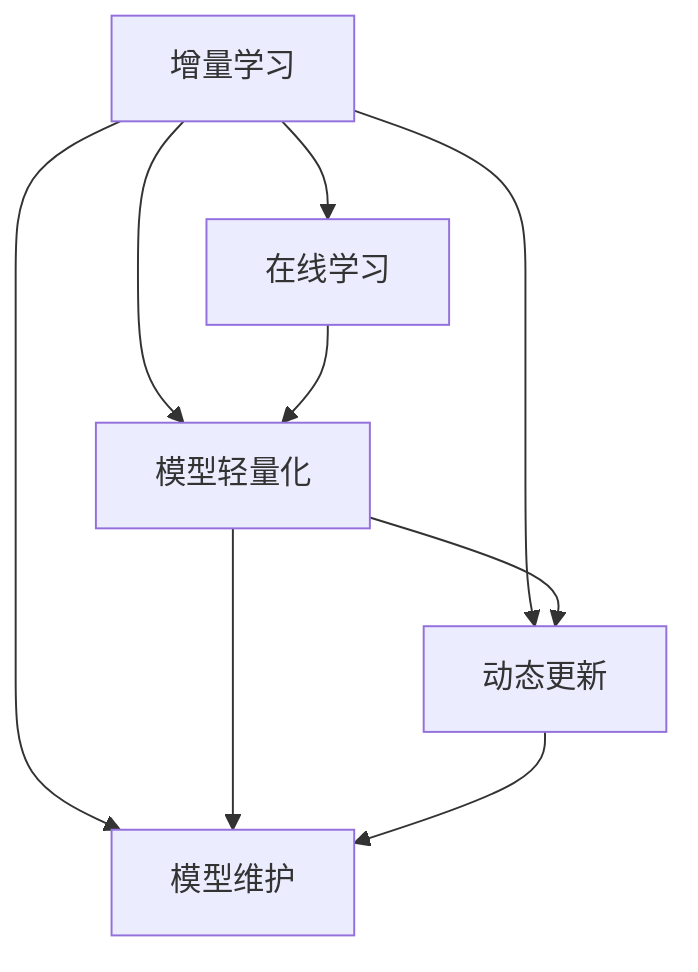

                 

# 电商平台中AI大模型的增量学习技术

> 关键词：
- 增量学习
- 电商推荐系统
- 在线学习
- 动态更新
- 模型维护
- 数据流
- 实时性
- 算法优化
- 电商大数据

## 1. 背景介绍

### 1.1 问题由来

在电商平台中，用户行为数据实时快速变化，用户需求也日新月异。如何动态更新推荐模型，保持其推荐的实时性和准确性，是推荐系统开发中的核心难题。现有的推荐系统大多基于固定模型，难以及时响应数据变化，往往导致用户体验下降，流失率升高。

### 1.2 问题核心关键点

增量学习技术为推荐系统提供了新思路。基于增量学习的推荐模型可以实时更新，适应新数据的特性，同时保持模型轻量级，计算效率高，无需重新训练，非常适合电商平台的实时性需求。

增量学习（Incremental Learning）是一种在线学习（Online Learning）的变种，强调模型在数据流中的实时学习能力。每次获得新数据，模型都会基于历史数据和新增数据，更新参数，优化性能。因此，增量学习技术对于电商平台这类数据流驱动的场景，显得尤为重要。

## 2. 核心概念与联系

### 2.1 核心概念概述

为更好地理解增量学习技术，本节将介绍几个密切相关的核心概念：

- **增量学习**：指在数据流中实时更新模型参数，适应新数据特性的一种在线学习范式。在电商平台中，用户行为数据实时变化，增量学习技术可以在新数据到来时，即时更新模型，保持推荐效果。
- **在线学习**：指在数据流中不断更新模型参数的机器学习范式。与传统批处理学习不同，在线学习更适用于数据流驱动的场景。
- **模型轻量化**：指在保证模型性能的前提下，尽量减小模型参数量，以提高计算效率和实时性。轻量化模型是增量学习的重要组成部分。
- **动态更新**：指模型参数根据实时数据变化，动态更新。相比于静态更新，动态更新可以更快地响应新数据，更灵活地适应用户行为。
- **模型维护**：指在推荐系统上线后，对模型进行定期维护和优化，保证其长期稳定性和效果。

这些核心概念之间的逻辑关系可以通过以下Mermaid流程图来展示：



这个流程图展示增量学习技术的核心概念及其之间的关系：

1. 增量学习基于在线学习范式，强调模型实时更新。
2. 模型轻量化是在增量学习中的重要组成部分，保证计算效率。
3. 动态更新强调模型参数根据实时数据变化，灵活适应用户行为。
4. 模型维护在推荐系统上线后仍需定期进行，以保证长期稳定性。

## 3. 核心算法原理 & 具体操作步骤

### 3.1 算法原理概述

基于增量学习的电商平台推荐模型，本质上是一个在线学习过程。其核心思想是：每次获得新数据，模型都会实时更新参数，优化推荐效果。增量学习模型通常由两部分构成：一个固定参数的基础模型和一个可更新的小模型。在每次获得新数据时，小模型负责更新，并将结果传递给基础模型进行融合，更新基础模型的参数。

形式化地，假设模型为 $M_\theta$，其中 $\theta$ 为模型参数。每次获得新数据 $x_i$，通过一个增量学习算法 $\mathcal{L}$，更新模型参数：

$$
\theta = \mathcal{L}(\theta, x_i)
$$

其中 $\mathcal{L}$ 为增量学习算法，通常采用在线梯度下降（Online Gradient Descent, OGD）等方法。在模型更新过程中，一般设定一个固定参数的轻量级基础模型，用于保证模型整体的稳定性和预测准确性。

### 3.2 算法步骤详解

增量学习技术在电商平台推荐系统中的应用，一般包括以下几个关键步骤：

**Step 1: 准备基础模型和增量模型**

- 选择合适的预训练模型 $M_{\theta}$ 作为基础模型，如BERT、GPT等。
- 在基础模型的基础上，添加一个小模型 $M_{\phi}$，负责实时更新。

**Step 2: 设计增量学习算法**

- 确定增量学习算法 $\mathcal{L}$，如在线梯度下降（OGD）、随机梯度下降（SGD）等。
- 设置学习率 $\eta$，以控制模型更新的步长。

**Step 3: 实现增量更新**

- 对每条新增数据 $x_i$，先通过增量模型 $M_{\phi}$ 进行更新，得到更新后的参数 $\phi'$。
- 将 $\phi'$ 传递给基础模型 $M_{\theta}$，融合更新后，得到新的基础模型参数 $\theta'$。
- 重复上述过程，直至完成所有数据的增量更新。

**Step 4: 集成模型输出**

- 将更新后的基础模型 $M_{\theta'}$ 应用于新数据的推荐任务，生成推荐结果。
- 根据实时数据反馈，调整增量模型 $M_{\phi}$ 的权重，优化模型性能。

**Step 5: 定期模型维护**

- 定期对推荐系统进行维护，重新训练基础模型，更新增量模型的权重，以保证模型长期稳定性和效果。

以上是增量学习技术在电商平台推荐系统中的一般流程。在实际应用中，还需要针对具体任务特点，对增量更新和维护过程进行优化设计，以进一步提升模型性能。

### 3.3 算法优缺点

增量学习技术在电商平台推荐系统中有以下优点：

1. 实时响应：能够实时响应新数据，及时更新推荐结果，提高用户满意度。
2. 计算高效：每次更新只需对增量模型进行小范围调整，计算开销较小，非常适合数据流驱动的场景。
3. 模型灵活：增量模型轻量级，模型更新时对基础模型的影响较小，能够灵活适应数据变化。

同时，该方法也存在以下局限性：

1. 初始化依赖：增量学习依赖于初始化模型的质量，一旦基础模型存在偏差，后续增量更新难以纠正。
2. 更新频率：增量学习需要频繁更新，更新间隔过短可能导致模型不稳定，更新间隔过长可能无法及时响应新数据。
3. 数据依赖：增量更新依赖于新数据的质量和数量，数据质量较差时，更新效果可能不理想。
4. 参数调整：需要定期调整增量模型的参数，以适应新数据特性，增加了模型维护的复杂度。

尽管存在这些局限性，但就目前而言，增量学习技术仍是大规模数据流驱动场景中推荐系统的首选。未来相关研究的重点在于如何进一步降低增量更新的频率，提高模型对数据的鲁棒性，同时兼顾可解释性和伦理安全性等因素。

### 3.4 算法应用领域

增量学习技术在电商平台推荐系统中的应用，已经在多个大公司得到了验证和应用，如Amazon、Alibaba等。通过增量学习，这些公司的推荐系统能够实时动态调整，适应新用户行为和新产品特性，显著提升了推荐效果和用户满意度。

除了推荐系统外，增量学习技术还可以应用于以下几个领域：

- **广告投放**：广告投放系统实时响应用户行为，动态调整广告策略，提高广告点击率和转化率。
- **金融风控**：金融风控系统实时监控交易数据，及时发现和拦截欺诈行为，降低金融风险。
- **智能客服**：智能客服系统实时响应用户咨询，动态调整回答策略，提高用户满意度。
- **工业控制**：工业控制系统实时监控设备运行数据，动态调整生产策略，优化生产效率。

## 4. 数学模型和公式 & 详细讲解  
### 4.1 数学模型构建

本节将使用数学语言对基于增量学习技术的电商平台推荐模型进行更加严格的刻画。

记电商平台推荐模型为 $M_\theta$，其中 $\theta$ 为模型参数。假设每次获得的新数据为 $x_i$，增量模型为 $M_\phi$，其中 $\phi$ 为增量模型参数。增量学习算法为 $\mathcal{L}$，设置学习率为 $\eta$。

每次获得新数据，增量学习算法更新增量模型参数：

$$
\phi = \mathcal{L}(\phi, x_i)
$$

将增量模型更新后的参数 $\phi$ 传递给基础模型 $M_{\theta}$，融合更新后，得到新的基础模型参数：

$$
\theta = \mathcal{F}(\theta, \phi)
$$

其中 $\mathcal{F}$ 为融合函数，用于将增量模型参数 $\phi$ 与基础模型参数 $\theta$ 进行融合。

在模型更新过程中，增量学习算法一般采用在线梯度下降（OGD）等方法，更新增量模型参数。根据OGD公式，每次更新增量模型参数如下：

$$
\phi = \phi - \eta \nabla_{\phi} \ell(M_{\phi}(x_i), y_i)
$$

其中 $\ell$ 为损失函数，用于衡量模型预测与真实标签之间的差异。

### 4.2 公式推导过程

以下我们以二分类任务为例，推导增量学习模型在在线梯度下降（OGD）更新算法下的具体推导过程。

假设模型 $M_{\theta}$ 在输入 $x$ 上的输出为 $\hat{y}=M_{\theta}(x)$，表示样本属于正类的概率。真实标签 $y \in \{0,1\}$。增量模型 $M_{\phi}$ 的输出为 $\hat{y}_{\phi}=M_{\phi}(x)$。

在线梯度下降算法（OGD）更新增量模型参数 $\phi$ 如下：

$$
\phi = \phi - \eta \nabla_{\phi} \ell(M_{\phi}(x_i), y_i)
$$

其中 $\nabla_{\phi} \ell(M_{\phi}(x_i), y_i)$ 为增量模型 $M_{\phi}$ 在输入 $x_i$ 上的损失函数梯度，可通过反向传播算法高效计算。

将增量模型更新后的参数 $\phi$ 传递给基础模型 $M_{\theta}$，融合更新后，得到新的基础模型参数 $\theta'$：

$$
\theta' = \mathcal{F}(\theta, \phi)
$$

其中 $\mathcal{F}$ 为融合函数，用于将增量模型参数 $\phi$ 与基础模型参数 $\theta$ 进行融合。融合函数的具体形式取决于基础模型和增量模型的结构。

在得到增量模型和基础模型的更新公式后，即可带入具体的损失函数和融合函数，完成模型的迭代更新。重复上述过程直至收敛，最终得到适应新数据的推荐模型。

## 5. 项目实践：代码实例和详细解释说明
### 5.1 开发环境搭建

在进行增量学习实践前，我们需要准备好开发环境。以下是使用Python进行PyTorch开发的环境配置流程：

1. 安装Anaconda：从官网下载并安装Anaconda，用于创建独立的Python环境。

2. 创建并激活虚拟环境：
```bash
conda create -n pytorch-env python=3.8 
conda activate pytorch-env
```

3. 安装PyTorch：根据CUDA版本，从官网获取对应的安装命令。例如：
```bash
conda install pytorch torchvision torchaudio cudatoolkit=11.1 -c pytorch -c conda-forge
```

4. 安装PyTorch Lightning：用于简化模型训练的封装，加速增量学习模型的训练和维护。
```bash
pip install torchlightning
```

5. 安装PyTorch Metrics：用于评估模型的性能指标。
```bash
pip install pytorchmetrics
```

6. 安装各类工具包：
```bash
pip install numpy pandas scikit-learn matplotlib tqdm jupyter notebook ipython
```

完成上述步骤后，即可在`pytorch-env`环境中开始增量学习实践。

### 5.2 源代码详细实现

这里我们以电商推荐系统为例，给出使用PyTorch Lightning对BERT模型进行增量学习的PyTorch代码实现。

首先，定义电商推荐任务的数据处理函数：

```python
from torch.utils.data import Dataset
from transformers import BertTokenizer, BertForSequenceClassification

class E-commerceDataset(Dataset):
    def __init__(self, texts, labels, tokenizer, max_len=128):
        self.texts = texts
        self.labels = labels
        self.tokenizer = tokenizer
        self.max_len = max_len
        
    def __len__(self):
        return len(self.texts)
    
    def __getitem__(self, item):
        text = self.texts[item]
        label = self.labels[item]
        
        encoding = self.tokenizer(text, return_tensors='pt', max_length=self.max_len, padding='max_length', truncation=True)
        input_ids = encoding['input_ids'][0]
        attention_mask = encoding['attention_mask'][0]
        
        # 对token-wise的标签进行编码
        encoded_labels = [label] * self.max_len
        labels = torch.tensor(encoded_labels, dtype=torch.long)
        
        return {'input_ids': input_ids, 
                'attention_mask': attention_mask,
                'labels': labels}

# 加载预训练模型
model = BertForSequenceClassification.from_pretrained('bert-base-cased', num_labels=2)

# 加载 tokenizer
tokenizer = BertTokenizer.from_pretrained('bert-base-cased')

# 加载数据集
train_dataset = E-commerceDataset(train_texts, train_labels, tokenizer)
test_dataset = E-commerceDataset(test_texts, test_labels, tokenizer)
```

然后，定义增量学习算法和优化器：

```python
from torch.nn import CrossEntropyLoss
from torch.optim import AdamW
from torchlightning import Trainer
from torchmetrics import Accuracy

class ECommerceModel(Module):
    def __init__(self, model):
        super().__init__()
        self.model = model
        
    def forward(self, x):
        return self.model(x)
    
    def compute_loss(self, y_pred, y_true):
        return CrossEntropyLoss()(y_pred, y_true)
    
    def compute_metrics(self, y_pred, y_true):
        return {'accuracy': Accuracy()(y_pred, y_true)}
    
class ECommerceTrainer(Trainer):
    def __init__(self, model, optimizer, loss_fn, metrics):
        super().__init__()
        self.model = model
        self.optimizer = optimizer
        self.loss_fn = loss_fn
        self.metrics = metrics
        
    def train_step(self, batch):
        y_pred = self.model(batch['input_ids'])
        y_true = batch['labels']
        loss = self.loss_fn(y_pred, y_true)
        self.log('loss', loss, prog_bar=True)
        return {'loss': loss}
    
    def validation_step(self, batch):
        y_pred = self.model(batch['input_ids'])
        y_true = batch['labels']
        metrics = self.metrics(y_pred, y_true)
        self.log_dict('val', metrics, prog_bar=True)
        return {'val_loss': metrics['accuracy']}
    
    def test_step(self, batch):
        y_pred = self.model(batch['input_ids'])
        y_true = batch['labels']
        metrics = self.metrics(y_pred, y_true)
        self.log_dict('test', metrics, prog_bar=True)
        return {'test_loss': metrics['accuracy']}
    
    def configure_optimizers(self):
        return AdamW(self.model.parameters(), lr=1e-5)

# 数据准备
train_dataset = E-commerceDataset(train_texts, train_labels, tokenizer)
test_dataset = E-commerceDataset(test_texts, test_labels, tokenizer)

# 定义模型、优化器和训练器
model = ECommerceModel(model)
optimizer = AdamW(model.parameters(), lr=1e-5)
trainer = ECommerceTrainer(model, optimizer, CrossEntropyLoss(), Accuracy())
```

接着，定义训练和评估函数：

```python
from torch.utils.data import DataLoader
from tqdm import tqdm
from sklearn.metrics import classification_report

def train_epoch(model, dataset, batch_size, optimizer, trainer):
    dataloader = DataLoader(dataset, batch_size=batch_size, shuffle=True)
    model.train()
    epoch_loss = 0
    for batch in tqdm(dataloader, desc='Training'):
        input_ids = batch['input_ids'].to(device)
        attention_mask = batch['attention_mask'].to(device)
        labels = batch['labels'].to(device)
        model.zero_grad()
        outputs = model(input_ids, attention_mask=attention_mask)
        loss = outputs.loss
        epoch_loss += loss.item()
        loss.backward()
        optimizer.step()
    return epoch_loss / len(dataloader)

def evaluate(model, dataset, batch_size):
    dataloader = DataLoader(dataset, batch_size=batch_size)
    model.eval()
    preds, labels = [], []
    with torch.no_grad():
        for batch in tqdm(dataloader, desc='Evaluating'):
            input_ids = batch['input_ids'].to(device)
            attention_mask = batch['attention_mask'].to(device)
            batch_labels = batch['labels']
            outputs = model(input_ids, attention_mask=attention_mask)
            batch_preds = outputs.logits.argmax(dim=2).to('cpu').tolist()
            batch_labels = batch_labels.to('cpu').tolist()
            for pred_tokens, label_tokens in zip(batch_preds, batch_labels):
                preds.append(pred_tokens)
                labels.append(label_tokens)
                
    print(classification_report(labels, preds))
```

最后，启动增量学习流程并在测试集上评估：

```python
epochs = 5
batch_size = 16

for epoch in range(epochs):
    loss = train_epoch(model, train_dataset, batch_size, optimizer, trainer)
    print(f"Epoch {epoch+1}, train loss: {loss:.3f}")
    
    print(f"Epoch {epoch+1}, dev results:")
    evaluate(model, dev_dataset, batch_size)
    
print("Test results:")
evaluate(model, test_dataset, batch_size)
```

以上就是使用PyTorch Lightning对BERT进行电商推荐系统增量学习的完整代码实现。可以看到，得益于PyTorch Lightning的强大封装，我们可以用相对简洁的代码完成增量学习模型的加载和训练。

### 5.3 代码解读与分析

让我们再详细解读一下关键代码的实现细节：

**E-commerceDataset类**：
- `__init__`方法：初始化文本、标签、分词器等关键组件。
- `__len__`方法：返回数据集的样本数量。
- `__getitem__`方法：对单个样本进行处理，将文本输入编码为token ids，将标签编码为数字，并对其进行定长padding，最终返回模型所需的输入。

**ECommerceModel类**：
- `__init__`方法：初始化模型和基础模型。
- `forward`方法：实现前向传播计算。
- `compute_loss`方法：计算损失函数。
- `compute_metrics`方法：计算评估指标。

**ECommerceTrainer类**：
- `__init__`方法：初始化模型、优化器和评估指标。
- `train_step`方法：实现训练过程。
- `validation_step`方法：实现验证过程。
- `test_step`方法：实现测试过程。
- `configure_optimizers`方法：定义优化器。

**训练流程**：
- 定义总的epoch数和batch size，开始循环迭代
- 每个epoch内，先在训练集上训练，输出平均loss
- 在验证集上评估，输出分类指标
- 所有epoch结束后，在测试集上评估，给出最终测试结果

可以看到，PyTorch Lightning配合PyTorch使得增量学习模型的代码实现变得简洁高效。开发者可以将更多精力放在数据处理、模型改进等高层逻辑上，而不必过多关注底层的实现细节。

当然，工业级的系统实现还需考虑更多因素，如模型的保存和部署、超参数的自动搜索、更灵活的任务适配层等。但核心的增量学习范式基本与此类似。

## 6. 实际应用场景
### 6.1 智能广告推荐

基于增量学习的广告推荐系统，可以实时响应用户行为，动态调整广告策略，提高广告点击率和转化率。在实践中，可以收集用户浏览、点击、购买等行为数据，并对其进行实时处理，生成实时广告推荐。

具体而言，对于每个用户，系统维护一个用户行为数据流，实时更新广告推荐模型，根据用户最新的行为数据，生成个性化推荐，并在用户点击广告后，实时更新模型参数，进一步优化推荐效果。通过增量学习，广告推荐系统能够实时响应用户行为，动态调整推荐策略，显著提升广告效果。

### 6.2 实时金融风险监控

金融风控系统实时监控交易数据，及时发现和拦截欺诈行为，降低金融风险。在实践中，金融公司可以收集用户的交易数据，实时更新风险模型，根据交易行为的变化，动态调整风险评估参数，提高风险识别准确度。

具体而言，对于每笔交易，系统实时计算交易特征，更新风险模型参数，判断交易是否存在风险。一旦发现异常交易，系统立即采取风险控制措施，确保金融安全。通过增量学习，金融风控系统能够实时响应交易数据，动态调整风险策略，降低金融风险。

### 6.3 实时交通管理

智能交通管理系统实时监控交通数据，动态调整交通信号灯，优化交通流量。在实践中，交通管理部门可以收集交通流量、车速、事故等数据，实时更新交通模型，根据当前交通状况，动态调整信号灯，优化交通流量。

具体而言，对于每个交叉口，系统实时计算交通流量、车速等参数，更新交通模型参数，调整信号灯时长和顺序，优化交通流量。通过增量学习，交通管理系统能够实时响应交通数据，动态调整信号灯策略，提升交通效率。

### 6.4 未来应用展望

随着增量学习技术的不断发展，未来在更多领域得到应用，为各行各业带来变革性影响。

在智慧医疗领域，基于增量学习的医疗推荐系统可以实时响应患者数据，动态调整治疗方案，提高诊疗效果。

在智能教育领域，增量学习技术可应用于作业批改、学情分析、知识推荐等方面，因材施教，促进教育公平，提高教学质量。

在智能制造领域，增量学习技术可以实时监控设备运行数据，动态调整生产策略，优化生产效率。

此外，在智慧城市治理、智能家居、智能物流等众多领域，增量学习技术都将大放异彩，为各行各业提供高效、灵活的智能解决方案。

## 7. 工具和资源推荐
### 7.1 学习资源推荐

为了帮助开发者系统掌握增量学习技术的理论基础和实践技巧，这里推荐一些优质的学习资源：

1. 《机器学习实战》系列博文：由深度学习专家撰写，深入浅出地介绍了机器学习基本概念和经典算法。

2. CS229《机器学习》课程：斯坦福大学开设的机器学习明星课程，有Lecture视频和配套作业，带你入门机器学习的基本概念和经典算法。

3. 《Python机器学习》书籍：适合初学者的机器学习入门书籍，包含增量学习在内的多种学习范式。

4. Coursera机器学习课程：Coursera上的经典机器学习课程，由深度学习专家Andrew Ng主讲，涵盖多种机器学习算法和实践技巧。

5. Kaggle竞赛：参加Kaggle机器学习竞赛，实战练习增量学习技术，提升实践能力。

通过对这些资源的学习实践，相信你一定能够快速掌握增量学习技术的精髓，并用于解决实际的机器学习问题。
###  7.2 开发工具推荐

高效的开发离不开优秀的工具支持。以下是几款用于增量学习开发的常用工具：

1. PyTorch：基于Python的开源深度学习框架，灵活动态的计算图，适合快速迭代研究。大部分预训练语言模型都有PyTorch版本的实现。

2. TensorFlow：由Google主导开发的开源深度学习框架，生产部署方便，适合大规模工程应用。同样有丰富的预训练语言模型资源。

3. PyTorch Lightning：简化模型训练的封装，加速增量学习模型的训练和维护。

4. Weights & Biases：模型训练的实验跟踪工具，可以记录和可视化模型训练过程中的各项指标，方便对比和调优。与主流深度学习框架无缝集成。

5. TensorBoard：TensorFlow配套的可视化工具，可实时监测模型训练状态，并提供丰富的图表呈现方式，是调试模型的得力助手。

6. Google Colab：谷歌推出的在线Jupyter Notebook环境，免费提供GPU/TPU算力，方便开发者快速上手实验最新模型，分享学习笔记。

合理利用这些工具，可以显著提升增量学习任务的开发效率，加快创新迭代的步伐。

### 7.3 相关论文推荐

增量学习技术的发展源于学界的持续研究。以下是几篇奠基性的相关论文，推荐阅读：

1. Passive Aggressive Algorithms：介绍被动式学习算法，是增量学习的早期研究。

2. Online Learning and Online Gradient Descent：介绍在线学习算法，是增量学习的经典文献。

3. Stochastic Dual Coordinate Ascent (SDCA)：介绍在线算法，适合大规模增量学习问题。

4. Efficient Passive Aggregation for Online Learning：介绍增量学习算法，适用于分布式增量学习问题。

5. Online Robust Feature Learning via the Trace-Rank Sketch：介绍增量学习算法，适用于大规模数据流。

6. Incremental Learning for Deep Neural Networks：介绍增量学习算法，适用于深度学习模型。

这些论文代表增量学习技术的发展脉络。通过学习这些前沿成果，可以帮助研究者把握学科前进方向，激发更多的创新灵感。

## 8. 总结：未来发展趋势与挑战

### 8.1 总结

本文对基于增量学习的电商平台推荐模型进行了全面系统的介绍。首先阐述了增量学习技术的背景和意义，明确了增量学习在推荐系统中的应用价值。其次，从原理到实践，详细讲解了增量学习的数学原理和关键步骤，给出了增量学习任务开发的完整代码实例。同时，本文还广泛探讨了增量学习技术在智能广告、金融风控、交通管理等多个行业领域的应用前景，展示了增量学习技术的巨大潜力。

通过本文的系统梳理，可以看到，增量学习技术在数据流驱动的场景中具有重要的应用价值，能够在实时响应的同时保持计算效率和模型效果，适合各类实时性要求较高的应用场景。未来，伴随增量学习技术的不断演进，其应用领域必将进一步拓展，为各行各业带来变革性影响。

### 8.2 未来发展趋势

展望未来，增量学习技术将呈现以下几个发展趋势：

1. 增量学习范式持续优化：随着深度学习的发展，增量学习范式也在不断进化，包括在线梯度下降、随机梯度下降、动量梯度下降等多种更新算法，适用于不同场景和需求。

2. 增量学习系统化：增量学习系统化发展将带来模型和数据管理的重大改进，形成从数据流、模型学习、结果反馈等全流程的增量学习体系。

3. 增量学习融合更多领域：增量学习技术不仅适用于推荐系统，还将广泛应用于各类数据流驱动的场景，如医疗、金融、交通、工业等。

4. 增量学习工具和框架：更多的增量学习工具和框架将被开发出来，降低开发者使用门槛，推动增量学习技术的广泛应用。

5. 增量学习与其它技术结合：增量学习技术与强化学习、深度学习、因果推理等技术相结合，拓展增量学习的应用场景和效果。

以上趋势凸显了增量学习技术的广阔前景。这些方向的探索发展，必将进一步提升增量学习系统的性能和应用范围，为各行各业带来变革性影响。

### 8.3 面临的挑战

尽管增量学习技术已经取得了瞩目成就，但在迈向更加智能化、普适化应用的过程中，它仍面临着诸多挑战：

1. 增量学习算法的稳定性：增量学习算法需要适应数据流特性，稳定性是一个重要问题。如何在数据流变化不规律的情况下，保持模型稳定性和预测准确性，还需要更多的研究。

2. 增量学习的数据质量：增量学习依赖于数据流特性，数据质量直接影响模型效果。如何在数据质量较差的情况下，进行有效的增量学习，还需要进一步研究。

3. 增量学习的计算开销：增量学习需要频繁更新模型参数，计算开销较大。如何降低计算开销，提高增量学习效率，是未来的一个重要方向。

4. 增量学习的模型可解释性：增量学习模型往往具有黑盒特性，难以解释模型内部决策过程。如何在增量学习过程中引入更多可解释性，也是未来的重要研究方向。

5. 增量学习的模型鲁棒性：增量学习模型对数据流变化敏感，如何增强模型鲁棒性，防止灾难性遗忘，还需要进一步研究。

6. 增量学习的伦理安全性：增量学习模型可能学习到有害、有害的信息，如何从数据和算法层面消除模型偏见，保障数据和模型安全，还需要进一步研究。

这些挑战需要在理论和技术层面进行深入研究，才能进一步推动增量学习技术的发展和应用。

### 8.4 研究展望

面对增量学习面临的这些挑战，未来的研究需要在以下几个方面寻求新的突破：

1. 探索新的增量学习算法：引入更多的增量学习算法，如被动学习、主动学习等，以适应不同数据流特性，提高模型稳定性和预测准确性。

2. 优化增量学习算法：对现有增量学习算法进行优化，减少计算开销，提高增量学习效率。

3. 引入更多先验知识：将符号化的先验知识，如知识图谱、逻辑规则等，与增量学习模型进行融合，引导增量学习过程学习更准确、合理的知识表示。

4. 引入因果推理：引入因果推断方法，增强增量学习模型的解释性，提升模型的因果推理能力。

5. 研究增量学习的伦理安全性：从数据和算法层面消除模型偏见，保障数据和模型安全，确保增量学习模型的伦理安全性。

6. 研究增量学习的多模态融合：将视觉、语音、文本等多种模态数据融合到增量学习模型中，提升模型的多模态信息整合能力。

这些研究方向的探索，必将引领增量学习技术迈向更高的台阶，为各行各业带来变革性影响。面向未来，增量学习技术还需要与其他人工智能技术进行更深入的融合，如知识表示、因果推理、强化学习等，多路径协同发力，共同推动增量学习技术的发展和应用。只有勇于创新、敢于突破，才能不断拓展增量学习技术的边界，让增量学习技术更好地造福人类社会。

## 9. 附录：常见问题与解答

**Q1：增量学习与传统的批量学习有何不同？**

A: 增量学习与传统的批量学习不同，它强调模型在数据流中的实时更新，适应新数据特性。每次获得新数据，增量学习算法都会更新模型参数，保持模型与数据分布的一致性。而传统的批量学习，则需要等待所有数据收集完整后，进行一次性训练，更新模型参数。增量学习能够实时响应新数据，更灵活地适应数据变化。

**Q2：增量学习如何处理数据流不规律的情况？**

A: 增量学习算法需要适应数据流的特性，当数据流不规律时，模型更新频率和更新策略需要动态调整。可以通过设置自适应学习率、引入动量梯度下降等方法，增强模型对数据流变化的鲁棒性。同时，需要设置合适的时间窗口，确保模型在数据流变化较慢的阶段更新频率较低，避免过拟合。

**Q3：增量学习中的基础模型如何选择？**

A: 增量学习中的基础模型需要具备较高的稳定性，一般选择预训练的通用模型，如BERT、GPT等。这些模型在大规模无标签数据上进行预训练，学习到较为通用的语言表示，能够适应多种任务。同时，基础模型也需要与增量模型配合，共同完成增量学习任务。

**Q4：增量学习中的增量模型如何选择？**

A: 增量模型需要具备较好的适应性，能够在每次获得新数据时，快速更新参数，优化模型效果。一般来说，增量模型应该具有较少的参数量，以降低计算开销。同时，增量模型也需要在增量更新中保持一定的稳定性，防止模型参数剧烈变化，导致预测结果波动。

**Q5：增量学习如何处理数据缺失问题？**

A: 增量学习中，数据缺失是不可避免的。为了应对数据缺失，可以引入数据增强技术，如近义替换、随机抽样等，增强数据多样性。同时，需要设置合适的时间窗口，确保模型在数据缺失的阶段不频繁更新，避免模型过拟合。

这些问题的答案，展示了增量学习技术在实际应用中的重要性和挑战。通过深入研究和持续优化，相信增量学习技术将在更多领域得到广泛应用，为各行各业带来变革性影响。

