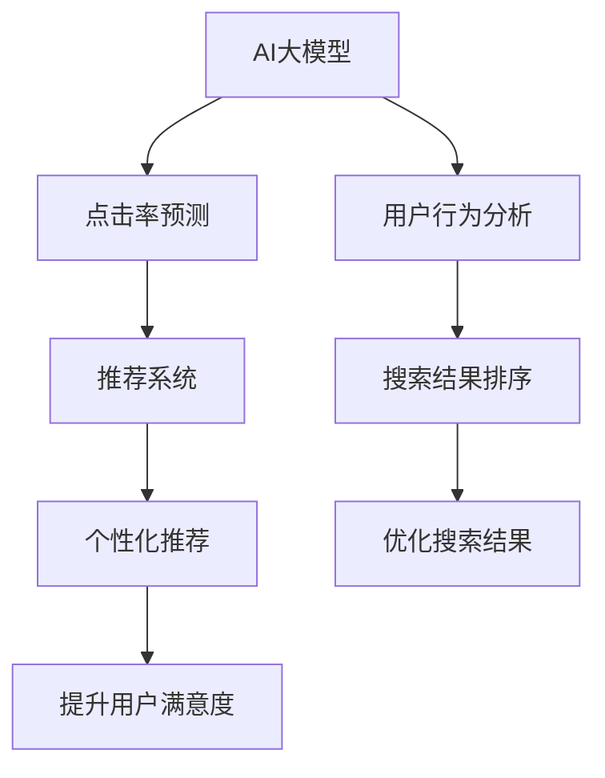

                 

# 电商平台中AI大模型的搜索结果排序策略

> 关键词：电商平台、AI大模型、搜索结果排序、用户行为分析、点击率预测、推荐系统、深度学习

## 1. 背景介绍

### 1.1 问题由来
在电商平台中，用户如何找到最符合自己需求的商品是提高用户体验和销售转化率的关键。传统的搜索结果排序算法往往基于简单的关键词匹配，忽视了用户的隐式需求和行为模式。随着人工智能技术的发展，特别是深度学习和大模型的应用，研究人员提出了基于用户行为分析和预测的智能排序算法。AI大模型在这些算法中发挥了重要作用，显著提升了搜索结果的相关性和个性化。

然而，大模型的应用也面临着一些挑战，如模型的复杂性、训练成本高、难以解释等。因此，如何设计高效的AI大模型搜索结果排序策略，成为当前电商平台应用研究的热点问题。

### 1.2 问题核心关键点
- 大模型如何融入电商平台的搜索排序
- 基于深度学习的用户行为分析
- 点击率预测和推荐系统的集成
- 模型的可解释性和鲁棒性
- 模型的训练和部署策略

## 2. 核心概念与联系

### 2.1 核心概念概述

为更好地理解基于AI大模型的电商平台搜索结果排序策略，本节将介绍几个密切相关的核心概念：

- AI大模型：如BERT、GPT等深度学习模型，通过在大规模数据上预训练，学习到丰富的语言和用户行为知识。
- 点击率预测(CTR Prediction)：预测用户点击商品的概率，通过最大化预测准确率优化搜索结果排序。
- 推荐系统：根据用户的历史行为和偏好，推荐用户可能感兴趣的商品，提升用户体验和销售转化。
- 用户行为分析(User Behavior Analysis)：通过分析用户搜索、浏览、点击等行为数据，提取用户隐式需求，优化搜索结果排序。
- 深度学习：一种模拟人脑神经网络的计算模型，具有强大的学习能力，广泛应用于自然语言处理、计算机视觉等领域。

这些核心概念之间的逻辑关系可以通过以下Mermaid流程图来展示：



这个流程图展示了大模型在电商平台中的核心概念及其之间的关系：

1. AI大模型通过预训练获得通用知识。
2. 通过点击率预测，模型学习用户点击行为的概率分布。
3. 用户行为分析提取用户隐式需求，提升搜索结果的相关性。
4. 推荐系统利用用户历史行为和模型预测，生成个性化推荐。
5. 综合考虑推荐和排序结果，优化搜索结果。
6. 个性化推荐提升用户体验和销售转化。

这些核心概念共同构成了电商平台中AI大模型的搜索结果排序框架，使其能够在多场景下发挥强大的排序能力。通过理解这些核心概念，我们可以更好地把握大模型在电商平台中的应用逻辑和优化方向。

## 3. 核心算法原理 & 具体操作步骤
### 3.1 算法原理概述

基于AI大模型的电商平台搜索结果排序策略，本质上是一个多目标优化问题。其核心思想是：将用户点击率预测和用户行为分析作为两个目标，通过多任务学习或联合训练的方式，最大化用户满意度，提升销售转化率。

形式化地，假设用户搜索输入为 $x$，模型预测点击概率为 $y=\text{BERT}(x;\theta)$，其中 $\theta$ 为模型参数。则点击率预测的目标函数为：

$$
\text{CTR}=E(y)
$$

用户行为分析的目标函数为：

$$
\text{User Engagement}=E(z)
$$

其中 $z$ 表示用户对搜索结果的隐式反馈（如停留时间、页面浏览深度等）。最终的目标函数为两者之和，即：

$$
\text{Objective}=\alpha \times \text{CTR} + \beta \times \text{User Engagement}
$$

其中 $\alpha$ 和 $\beta$ 为超参数，用于平衡两个目标的重要性。

通过梯度下降等优化算法，多目标优化问题不断更新模型参数 $\theta$，最小化上述目标函数，使得模型输出能够匹配用户点击行为和隐式反馈。

### 3.2 算法步骤详解

基于AI大模型的电商平台搜索结果排序策略，一般包括以下几个关键步骤：

**Step 1: 准备数据集和预训练模型**
- 收集电商平台的搜索、浏览、点击等行为数据，构建标注数据集。
- 选择合适的预训练语言模型 $M_{\theta}$ 作为初始化参数，如 BERT、GPT 等。

**Step 2: 设计任务适配层**
- 根据点击率预测任务，在预训练模型的顶层添加线性分类器，输出概率分布。
- 根据用户行为分析任务，设计合适的输出层和损失函数，例如使用交叉熵损失或回归损失。

**Step 3: 设置优化器和超参数**
- 选择合适的优化算法及其参数，如 AdamW、SGD 等，设置学习率、批大小、迭代轮数等。
- 设置正则化技术及强度，包括权重衰减、Dropout、Early Stopping 等。
- 确定冻结预训练参数的策略，如仅微调顶层，或全部参数都参与微调。

**Step 4: 执行多任务训练**
- 将数据集分成训练集、验证集和测试集。
- 在训练集上使用多任务学习或联合训练的方式，更新模型参数，最大化点击率预测和用户行为分析的目标。
- 周期性在验证集上评估模型性能，根据性能指标决定是否触发 Early Stopping。
- 重复上述步骤直到满足预设的迭代轮数或 Early Stopping 条件。

**Step 5: 测试和部署**
- 在测试集上评估微调后模型的性能，对比微调前后的点击率和用户行为指标。
- 使用微调后的模型对新搜索输入进行点击率预测，结合用户历史行为，生成个性化推荐。
- 集成到实际的应用系统中，持续收集新数据，定期重新微调模型，以适应数据分布的变化。

以上是基于AI大模型的电商平台搜索结果排序策略的一般流程。在实际应用中，还需要针对具体平台的特点，对微调过程的各个环节进行优化设计，如改进训练目标函数，引入更多的正则化技术，搜索最优的超参数组合等，以进一步提升模型性能。

### 3.3 算法优缺点

基于AI大模型的电商平台搜索结果排序方法具有以下优点：
1. 精度高。利用大模型丰富的预训练知识，可以显著提升点击率预测的准确性。
2. 个性化强。结合用户行为分析，生成个性化推荐，提升用户体验和销售转化。
3. 适应性强。基于多任务学习和联合训练，模型可以自动学习不同场景下的优化目标。

同时，该方法也存在一定的局限性：
1. 依赖大量标注数据。高质量标注数据对于点击率预测和用户行为分析的准确性至关重要。
2. 模型复杂度高。大模型的参数量巨大，训练和推理成本高，资源需求大。
3. 可解释性不足。大模型往往视为黑盒，难以解释其内部工作机制和决策逻辑。
4. 鲁棒性有待提高。大模型可能过拟合标注数据，导致泛化能力下降。

尽管存在这些局限性，但就目前而言，基于AI大模型的多任务学习方法在电商平台搜索结果排序中已经取得了显著的性能提升，成为电商搜索排序的重要手段。未来相关研究需要进一步降低对标注数据的依赖，提高模型的泛化能力，同时兼顾可解释性和鲁棒性等因素。

### 3.4 算法应用领域

基于AI大模型的电商平台搜索结果排序方法在电商领域已经得到了广泛的应用，覆盖了搜索、推荐、广告等多个环节，具体包括：

- 搜索排序：根据用户输入的查询词，预测其点击率和浏览深度，优化搜索结果排序。
- 推荐系统：结合用户历史行为和模型预测，生成个性化推荐列表。
- 广告投放：通过点击率预测，优化广告投放策略，提升广告效果。

此外，在智能推荐、信息过滤、个性化广告等多个领域，基于大模型的多任务学习排序方法也正逐步应用，为电商平台的智能应用提供了新的技术路径。随着预训练语言模型和算法方法的不断进步，相信基于大模型的排序方法将在更多电商场景中发挥重要作用，推动电商平台的智能化转型。

## 4. 数学模型和公式 & 详细讲解  
### 4.1 数学模型构建

本节将使用数学语言对基于AI大模型的电商平台搜索结果排序过程进行更加严格的刻画。

假设电商平台有 $N$ 个用户，每个用户有 $K$ 个搜索查询，每个查询有 $M$ 个候选商品。用户对每个候选商品 $i$ 的点击概率为 $y_i$，用户停留时间等隐式反馈为 $z_i$。则点击率预测的目标函数为：

$$
\text{CTR}=E(y)=\frac{1}{NK}\sum_{i=1}^{N}\sum_{j=1}^{K}y_{i,j}
$$

用户行为分析的目标函数为：

$$
\text{User Engagement}=E(z)=\frac{1}{NK}\sum_{i=1}^{N}\sum_{j=1}^{K}z_{i,j}
$$

将上述两个目标函数代入多目标优化问题中，得到：

$$
\text{Objective}=\alpha \times \text{CTR} + \beta \times \text{User Engagement}
$$

在实际应用中，通常使用梯度下降等优化算法来求解上述多目标优化问题。设 $\eta$ 为学习率，$\lambda$ 为正则化系数，则参数的更新公式为：

$$
\theta \leftarrow \theta - \eta \nabla_{\theta}\text{Objective} - \eta\lambda\theta
$$

其中 $\nabla_{\theta}\text{Objective}$ 为多目标优化问题对参数 $\theta$ 的梯度，可通过反向传播算法高效计算。

### 4.2 公式推导过程

以下我们以点击率预测任务为例，推导基于大模型的点击率预测公式及其梯度的计算过程。

假设用户输入的查询词为 $x$，模型预测其点击商品的概率为 $y=\text{BERT}(x;\theta)$，其中 $\theta$ 为模型参数。

基于点击率预测任务，模型的损失函数为交叉熵损失，定义为：

$$
\ell(y,\hat{y})=-y\log \hat{y}-(1-y)\log(1-\hat{y})
$$

在训练集 $D=\{(x_i,y_i)\}_{i=1}^N$ 上，经验风险为：

$$
\mathcal{L}(\theta) = \frac{1}{N}\sum_{i=1}^N \ell(y_i,\hat{y}_i)
$$

其中 $\hat{y}_i$ 表示模型对查询 $x_i$ 的点击概率预测。

根据链式法则，损失函数对参数 $\theta_k$ 的梯度为：

$$
\frac{\partial \mathcal{L}(\theta)}{\partial \theta_k} = -\frac{1}{N}\sum_{i=1}^N \frac{\partial \ell(y_i,\hat{y}_i)}{\partial \hat{y}_i} \frac{\partial \hat{y}_i}{\partial \theta_k}
$$

其中 $\frac{\partial \hat{y}_i}{\partial \theta_k}$ 为基于大模型的预测概率对模型参数的导数，可通过反向传播算法高效计算。

在得到损失函数的梯度后，即可带入参数更新公式，完成模型的迭代优化。重复上述过程直至收敛，最终得到适应电商搜索结果排序任务的最优模型参数 $\theta^*$。

## 5. 项目实践：代码实例和详细解释说明
### 5.1 开发环境搭建

在进行多任务学习实践前，我们需要准备好开发环境。以下是使用Python进行PyTorch开发的环境配置流程：

1. 安装Anaconda：从官网下载并安装Anaconda，用于创建独立的Python环境。

2. 创建并激活虚拟环境：
```bash
conda create -n pytorch-env python=3.8 
conda activate pytorch-env
```

3. 安装PyTorch：根据CUDA版本，从官网获取对应的安装命令。例如：
```bash
conda install pytorch torchvision torchaudio cudatoolkit=11.1 -c pytorch -c conda-forge
```

4. 安装Transformers库：
```bash
pip install transformers
```

5. 安装各类工具包：
```bash
pip install numpy pandas scikit-learn matplotlib tqdm jupyter notebook ipython
```

完成上述步骤后，即可在`pytorch-env`环境中开始多任务学习实践。

### 5.2 源代码详细实现

下面我们以点击率预测任务为例，给出使用Transformers库对BERT模型进行多任务学习的PyTorch代码实现。

首先，定义点击率预测任务的数据处理函数：

```python
from transformers import BertTokenizer
from torch.utils.data import Dataset
import torch

class CTRDataset(Dataset):
    def __init__(self, texts, labels, tokenizer, max_len=128):
        self.texts = texts
        self.labels = labels
        self.tokenizer = tokenizer
        self.max_len = max_len
        
    def __len__(self):
        return len(self.texts)
    
    def __getitem__(self, item):
        text = self.texts[item]
        label = self.labels[item]
        
        encoding = self.tokenizer(text, return_tensors='pt', max_length=self.max_len, padding='max_length', truncation=True)
        input_ids = encoding['input_ids'][0]
        attention_mask = encoding['attention_mask'][0]
        
        # 将标签转换为概率分布
        label = torch.tensor([label], dtype=torch.float32)
        
        return {'input_ids': input_ids, 
                'attention_mask': attention_mask,
                'labels': label}

# 准备数据集
tokenizer = BertTokenizer.from_pretrained('bert-base-cased')

train_dataset = CTRDataset(train_texts, train_labels, tokenizer)
dev_dataset = CTRDataset(dev_texts, dev_labels, tokenizer)
test_dataset = CTRDataset(test_texts, test_labels, tokenizer)
```

然后，定义模型和优化器：

```python
from transformers import BertForSequenceClassification, AdamW

model = BertForSequenceClassification.from_pretrained('bert-base-cased', num_labels=2)

optimizer = AdamW(model.parameters(), lr=2e-5)
```

接着，定义训练和评估函数：

```python
from torch.utils.data import DataLoader
from tqdm import tqdm
from sklearn.metrics import classification_report

device = torch.device('cuda') if torch.cuda.is_available() else torch.device('cpu')
model.to(device)

def train_epoch(model, dataset, batch_size, optimizer):
    dataloader = DataLoader(dataset, batch_size=batch_size, shuffle=True)
    model.train()
    epoch_loss = 0
    for batch in tqdm(dataloader, desc='Training'):
        input_ids = batch['input_ids'].to(device)
        attention_mask = batch['attention_mask'].to(device)
        labels = batch['labels'].to(device)
        model.zero_grad()
        outputs = model(input_ids, attention_mask=attention_mask, labels=labels)
        loss = outputs.loss
        epoch_loss += loss.item()
        loss.backward()
        optimizer.step()
    return epoch_loss / len(dataloader)

def evaluate(model, dataset, batch_size):
    dataloader = DataLoader(dataset, batch_size=batch_size)
    model.eval()
    preds, labels = [], []
    with torch.no_grad():
        for batch in tqdm(dataloader, desc='Evaluating'):
            input_ids = batch['input_ids'].to(device)
            attention_mask = batch['attention_mask'].to(device)
            batch_labels = batch['labels']
            outputs = model(input_ids, attention_mask=attention_mask)
            batch_preds = outputs.logits.argmax(dim=1).to('cpu').tolist()
            batch_labels = batch_labels.to('cpu').tolist()
            for pred, label in zip(batch_preds, batch_labels):
                preds.append(pred)
                labels.append(label)
                
    print(classification_report(labels, preds))
```

最后，启动训练流程并在测试集上评估：

```python
epochs = 5
batch_size = 16

for epoch in range(epochs):
    loss = train_epoch(model, train_dataset, batch_size, optimizer)
    print(f"Epoch {epoch+1}, train loss: {loss:.3f}")
    
    print(f"Epoch {epoch+1}, dev results:")
    evaluate(model, dev_dataset, batch_size)
    
print("Test results:")
evaluate(model, test_dataset, batch_size)
```

以上就是使用PyTorch对BERT进行点击率预测任务的多任务学习代码实现。可以看到，得益于Transformers库的强大封装，我们可以用相对简洁的代码完成BERT模型的加载和微调。

### 5.3 代码解读与分析

让我们再详细解读一下关键代码的实现细节：

**CTRDataset类**：
- `__init__`方法：初始化文本、标签、分词器等关键组件。
- `__len__`方法：返回数据集的样本数量。
- `__getitem__`方法：对单个样本进行处理，将文本输入编码为token ids，将标签转换为概率分布，并对其进行定长padding，最终返回模型所需的输入。

**模型和优化器**：
- 使用BertForSequenceClassification对BERT模型进行二分类任务的适配，即预测点击或不点击。
- 使用AdamW优化器，设置学习率。

**训练和评估函数**：
- 使用PyTorch的DataLoader对数据集进行批次化加载，供模型训练和推理使用。
- 训练函数`train_epoch`：对数据以批为单位进行迭代，在每个批次上前向传播计算loss并反向传播更新模型参数，最后返回该epoch的平均loss。
- 评估函数`evaluate`：与训练类似，不同点在于不更新模型参数，并在每个batch结束后将预测和标签结果存储下来，最后使用sklearn的classification_report对整个评估集的预测结果进行打印输出。

**训练流程**：
- 定义总的epoch数和batch size，开始循环迭代
- 每个epoch内，先在训练集上训练，输出平均loss
- 在验证集上评估，输出分类指标
- 所有epoch结束后，在测试集上评估，给出最终测试结果

可以看到，PyTorch配合Transformers库使得BERT多任务学习的代码实现变得简洁高效。开发者可以将更多精力放在数据处理、模型改进等高层逻辑上，而不必过多关注底层的实现细节。

当然，工业级的系统实现还需考虑更多因素，如模型的保存和部署、超参数的自动搜索、更灵活的任务适配层等。但核心的多任务学习范式基本与此类似。

## 6. 实际应用场景
### 6.1 电商平台搜索排序

基于大模型的多任务学习排序算法，已经在电商平台的搜索排序中得到了广泛应用。传统的搜索排序算法往往只依赖关键词匹配，忽视了用户的隐式需求和行为模式。通过引入点击率预测和用户行为分析，模型能够从用户搜索行为中提取隐含需求，优化搜索结果排序，提升用户满意度。

例如，当用户输入查询词 "手机" 时，模型可以预测其可能点击的手机型号、品牌、价格等信息，并结合用户的历史行为数据，生成个性化的搜索结果排序。通过优化搜索结果的相关性和点击率，电商平台可以显著提升用户的点击率和转化率，增加销售收益。

### 6.2 广告投放优化

在电商平台中，广告是重要的营收来源。通过点击率预测和用户行为分析，广告投放系统可以优化广告投放策略，提升广告效果。例如，基于历史点击率和用户行为，模型可以预测不同广告内容对不同用户的点击概率，并根据预测结果进行投放。同时，结合用户的行为数据，生成个性化推荐广告，提升广告的点击率和转化率。

通过这种多任务学习的方式，广告投放系统可以自动学习不同场景下的优化目标，实现更加精准的广告投放，提升广告投放ROI。

### 6.3 个性化推荐

在电商平台中，推荐系统能够显著提升用户体验和销售转化。通过点击率预测和用户行为分析，推荐系统可以生成个性化推荐列表，推荐用户可能感兴趣的商品。例如，根据用户的历史搜索和点击行为，模型可以预测其对不同商品的点击概率，并根据预测结果生成个性化推荐。

通过多任务学习的方式，推荐系统可以自动学习不同场景下的优化目标，实现更加精准的推荐，提升用户的点击率和转化率，增加销售额。

### 6.4 未来应用展望

随着多任务学习技术的不断发展，基于AI大模型的搜索结果排序方法将在更多电商平台场景中得到应用，为电商平台带来新的突破。

在智能客服系统、智能广告系统、个性化推荐系统等多个领域，基于多任务学习的结果排序算法也将逐步应用，为电商平台的智能化应用提供新的技术路径。随着预训练语言模型和算法方法的不断进步，相信基于多任务学习的排序方法将在更多电商场景中发挥重要作用，推动电商平台的智能化转型。

## 7. 工具和资源推荐
### 7.1 学习资源推荐

为了帮助开发者系统掌握多任务学习的大模型应用，这里推荐一些优质的学习资源：

1. 《深度学习实战》系列书籍：由NLP专家撰写，深入浅出地介绍了深度学习在NLP任务中的应用，包括多任务学习、Transformer模型等前沿话题。

2. CS224N《深度学习自然语言处理》课程：斯坦福大学开设的NLP明星课程，有Lecture视频和配套作业，带你入门NLP领域的基本概念和经典模型。

3. 《Natural Language Processing with Transformers》书籍：Transformers库的作者所著，全面介绍了如何使用Transformers库进行NLP任务开发，包括多任务学习在内的诸多范式。

4. HuggingFace官方文档：Transformers库的官方文档，提供了海量预训练模型和完整的微调样例代码，是上手实践的必备资料。

5. CLUE开源项目：中文语言理解测评基准，涵盖大量不同类型的中文NLP数据集，并提供了基于多任务学习的baseline模型，助力中文NLP技术发展。

通过对这些资源的学习实践，相信你一定能够快速掌握多任务学习的大模型应用，并用于解决实际的NLP问题。
###  7.2 开发工具推荐

高效的开发离不开优秀的工具支持。以下是几款用于大模型多任务学习开发的常用工具：

1. PyTorch：基于Python的开源深度学习框架，灵活动态的计算图，适合快速迭代研究。大部分预训练语言模型都有PyTorch版本的实现。

2. TensorFlow：由Google主导开发的开源深度学习框架，生产部署方便，适合大规模工程应用。同样有丰富的预训练语言模型资源。

3. Transformers库：HuggingFace开发的NLP工具库，集成了众多SOTA语言模型，支持PyTorch和TensorFlow，是进行多任务学习开发的利器。

4. Weights & Biases：模型训练的实验跟踪工具，可以记录和可视化模型训练过程中的各项指标，方便对比和调优。与主流深度学习框架无缝集成。

5. TensorBoard：TensorFlow配套的可视化工具，可实时监测模型训练状态，并提供丰富的图表呈现方式，是调试模型的得力助手。

6. Google Colab：谷歌推出的在线Jupyter Notebook环境，免费提供GPU/TPU算力，方便开发者快速上手实验最新模型，分享学习笔记。

合理利用这些工具，可以显著提升大模型多任务学习任务的开发效率，加快创新迭代的步伐。

### 7.3 相关论文推荐

大模型多任务学习的发展源于学界的持续研究。以下是几篇奠基性的相关论文，推荐阅读：

1. Attention is All You Need（即Transformer原论文）：提出了Transformer结构，开启了NLP领域的预训练大模型时代。

2. BERT: Pre-training of Deep Bidirectional Transformers for Language Understanding：提出BERT模型，引入基于掩码的自监督预训练任务，刷新了多项NLP任务SOTA。

3. Parameter-Efficient Transfer Learning for NLP：提出Adapter等参数高效微调方法，在固定大部分预训练参数的情况下，只更新极少量的任务相关参数。

4. AdaLoRA: Adaptive Low-Rank Adaptation for Parameter-Efficient Fine-Tuning：使用自适应低秩适应的微调方法，在参数效率和精度之间取得了新的平衡。

5. Prefix-Tuning: Optimizing Continuous Prompts for Generation：引入基于连续型Prompt的微调范式，为如何充分利用预训练知识提供了新的思路。

这些论文代表了大模型多任务学习的发展脉络。通过学习这些前沿成果，可以帮助研究者把握学科前进方向，激发更多的创新灵感。

## 8. 总结：未来发展趋势与挑战
### 8.1 总结

本文对基于AI大模型的电商平台搜索结果排序策略进行了全面系统的介绍。首先阐述了大模型在电商平台中的搜索排序应用背景，明确了多任务学习在提高搜索结果相关性和个性化推荐中的应用价值。其次，从原理到实践，详细讲解了多任务学习的数学模型和关键步骤，给出了多任务学习任务开发的完整代码实例。同时，本文还广泛探讨了多任务学习在电商领域的应用场景，展示了多任务学习范式在电商平台搜索排序中的巨大潜力。此外，本文精选了多任务学习的各类学习资源，力求为读者提供全方位的技术指引。

通过本文的系统梳理，可以看到，基于AI大模型的多任务学习排序方法在电商平台搜索排序中已经取得了显著的性能提升，成为电商平台搜索排序的重要手段。未来相关研究需要进一步降低对标注数据的依赖，提高模型的泛化能力，同时兼顾可解释性和鲁棒性等因素。

### 8.2 未来发展趋势

展望未来，大模型多任务学习技术将呈现以下几个发展趋势：

1. 模型规模持续增大。随着算力成本的下降和数据规模的扩张，预训练语言模型的参数量还将持续增长。超大规模语言模型蕴含的丰富语言知识，有望支撑更加复杂多变的电商搜索排序任务。

2. 多任务学习范式多样化。除了传统的点击率预测和用户行为分析外，未来将涌现更多多任务学习范式，如情感分析、意图识别等，提升电商平台的智能化水平。

3. 持续学习成为常态。随着数据分布的不断变化，多任务学习模型也需要持续学习新知识以保持性能。如何在不遗忘原有知识的同时，高效吸收新样本信息，将成为重要的研究课题。

4. 标注样本需求降低。受启发于提示学习(Prompt-based Learning)的思路，未来的多任务学习方法将更好地利用大模型的语言理解能力，通过更加巧妙的任务描述，在更少的标注样本上也能实现理想的多任务学习效果。

5. 多模态融合加强。未来的多任务学习模型将更好地整合不同模态的信息，如文本、图像、语音等，实现视觉、语音等多模态信息的协同建模，提升模型的智能化水平。

6. 领域特定优化增加。随着更多领域数据的收集和标注，未来将涌现更多基于特定领域的多任务学习模型，提升电商平台的垂直领域应用能力。

以上趋势凸显了大模型多任务学习技术的广阔前景。这些方向的探索发展，必将进一步提升电商平台的多任务学习排序能力，为电商平台的智能化转型提供新的技术路径。相信随着技术的日益成熟，多任务学习排序方法将在更多电商场景中发挥重要作用，推动电商平台的智能化转型。

### 8.3 面临的挑战

尽管大模型多任务学习技术已经取得了显著的性能提升，但在迈向更加智能化、普适化应用的过程中，它仍面临着诸多挑战：

1. 标注成本瓶颈。高质量标注数据对于点击率预测和用户行为分析的准确性至关重要。但对于长尾应用场景，难以获得充足的高质量标注数据，成为制约多任务学习性能的瓶颈。如何进一步降低多任务学习对标注样本的依赖，将是一大难题。

2. 模型鲁棒性不足。多任务学习模型面对域外数据时，泛化性能往往大打折扣。对于测试样本的微小扰动，多任务学习模型的预测也容易发生波动。如何提高多任务学习模型的鲁棒性，避免灾难性遗忘，还需要更多理论和实践的积累。

3. 推理效率有待提高。超大规模语言模型虽然精度高，但在实际部署时往往面临推理速度慢、内存占用大等效率问题。如何在保证性能的同时，简化模型结构，提升推理速度，优化资源占用，将是重要的优化方向。

4. 可解释性亟需加强。多任务学习模型往往视为黑盒，难以解释其内部工作机制和决策逻辑。对于医疗、金融等高风险应用，算法的可解释性和可审计性尤为重要。如何赋予多任务学习模型更强的可解释性，将是亟待攻克的难题。

5. 安全性有待保障。预训练语言模型难免会学习到有偏见、有害的信息，通过多任务学习传递到下游任务，产生误导性、歧视性的输出，给实际应用带来安全隐患。如何从数据和算法层面消除模型偏见，避免恶意用途，确保输出的安全性，也将是重要的研究课题。

6. 知识整合能力不足。现有的多任务学习模型往往局限于任务内数据，难以灵活吸收和运用更广泛的先验知识。如何让多任务学习过程更好地与外部知识库、规则库等专家知识结合，形成更加全面、准确的信息整合能力，还有很大的想象空间。

正视多任务学习面临的这些挑战，积极应对并寻求突破，将是大模型多任务学习走向成熟的必由之路。相信随着学界和产业界的共同努力，这些挑战终将一一被克服，多任务学习排序方法将在构建安全、可靠、可解释、可控的智能系统上发挥更大作用。

### 8.4 研究展望

面对大模型多任务学习所面临的种种挑战，未来的研究需要在以下几个方面寻求新的突破：

1. 探索无监督和半监督多任务学习方法。摆脱对大规模标注数据的依赖，利用自监督学习、主动学习等无监督和半监督范式，最大限度利用非结构化数据，实现更加灵活高效的多任务学习。

2. 研究参数高效和计算高效的模型范式。开发更加参数高效的多任务学习模型，在固定大部分预训练参数的情况下，只更新极少量的任务相关参数。同时优化多任务学习的计算图，减少前向传播和反向传播的资源消耗，实现更加轻量级、实时性的部署。

3. 引入更多先验知识。将符号化的先验知识，如知识图谱、逻辑规则等，与神经网络模型进行巧妙融合，引导多任务学习过程学习更准确、合理的语言模型。同时加强不同模态数据的整合，实现视觉、语音等多模态信息与文本信息的协同建模。

4. 结合因果分析和博弈论工具。将因果分析方法引入多任务学习模型，识别出模型决策的关键特征，增强输出解释的因果性和逻辑性。借助博弈论工具刻画人机交互过程，主动探索并规避模型的脆弱点，提高系统稳定性。

5. 纳入伦理道德约束。在模型训练目标中引入伦理导向的评估指标，过滤和惩罚有偏见、有害的输出倾向。同时加强人工干预和审核，建立模型行为的监管机制，确保输出符合人类价值观和伦理道德。

这些研究方向的探索，必将引领多任务学习技术迈向更高的台阶，为构建安全、可靠、可解释、可控的智能系统铺平道路。面向未来，多任务学习技术还需要与其他人工智能技术进行更深入的融合，如知识表示、因果推理、强化学习等，多路径协同发力，共同推动人工智能技术的发展。只有勇于创新、敢于突破，才能不断拓展多任务学习技术的边界，让智能技术更好地造福人类社会。

## 9. 附录：常见问题与解答

**Q1：多任务学习如何平衡点击率预测和用户行为分析？**

A: 多任务学习通过共享模型参数，同时优化点击率预测和用户行为分析的目标。一般使用权重参数 $\alpha$ 和 $\beta$ 分别控制两个任务的权重，可以通过交叉验证等方式寻找最优的权重组合。同时，可以通过数据增强、迁移学习等手段，提高模型的泛化能力和适应性，平衡两个任务的目标。

**Q2：多任务学习是否适用于所有电商场景？**

A: 多任务学习在大多数电商场景中都能取得不错的效果，但对于一些特定领域的电商应用，如医药电商、农业电商等，需要针对领域特点进行模型优化。对于需要高精度、低延迟的应用场景，如实时搜索排序，多任务学习也需要针对性的改进优化。

**Q3：多任务学习在电商平台的优势是什么？**

A: 多任务学习在电商平台中的优势主要体现在以下几个方面：
1. 精度高：利用大模型的丰富预训练知识，可以显著提升点击率预测的准确性。
2. 个性化强：结合用户行为分析，生成个性化推荐，提升用户体验和销售转化。
3. 适应性强：基于多任务学习和联合训练，模型可以自动学习不同场景下的优化目标。

**Q4：多任务学习在电商平台的挑战是什么？**

A: 多任务学习在电商平台中面临的挑战包括：
1. 标注成本高：高质量标注数据对于点击率预测和用户行为分析的准确性至关重要，但在长尾应用场景中，难以获得充足的高质量标注数据。
2. 模型鲁棒性不足：多任务学习模型面对域外数据时，泛化性能往往大打折扣。
3. 推理效率低：超大规模语言模型虽然精度高，但在实际部署时面临推理速度慢、内存占用大等效率问题。
4. 可解释性不足：多任务学习模型往往视为黑盒，难以解释其内部工作机制和决策逻辑。
5. 安全性问题：预训练语言模型可能会学习到有偏见、有害的信息，通过多任务学习传递到下游任务，产生误导性、歧视性的输出。

这些挑战需要研究者进一步探索解决方案，提升多任务学习的性能和可靠性。

**Q5：多任务学习在电商平台的未来发展方向是什么？**

A: 多任务学习在电商平台中的未来发展方向包括：
1. 模型规模增大：随着算力成本的下降和数据规模的扩张，预训练语言模型的参数量还将持续增长，超大规模语言模型有望支撑更加复杂多变的电商搜索排序任务。
2. 多任务学习范式多样化：除了传统的点击率预测和用户行为分析外，未来将涌现更多多任务学习范式，如情感分析、意图识别等，提升电商平台的智能化水平。
3. 持续学习成为常态：随着数据分布的不断变化，多任务学习模型也需要持续学习新知识以保持性能。
4. 标注样本需求降低：受启发于提示学习(Prompt-based Learning)的思路，未来的多任务学习方法将更好地利用大模型的语言理解能力，通过更加巧妙的任务描述，在更少的标注样本上也能实现理想的多任务学习效果。
5. 多模态融合加强：未来的多任务学习模型将更好地整合不同模态的信息，如文本、图像、语音等，实现视觉、语音等多模态信息的协同建模。
6. 领域特定优化增加：随着更多领域数据的收集和标注，未来将涌现更多基于特定领域的多任务学习模型，提升电商平台的垂直领域应用能力。

通过这些方向的探索，相信多任务学习将在电商平台中发挥更大的作用，推动电商平台的智能化转型。

---

作者：禅与计算机程序设计艺术 / Zen and the Art of Computer Programming

