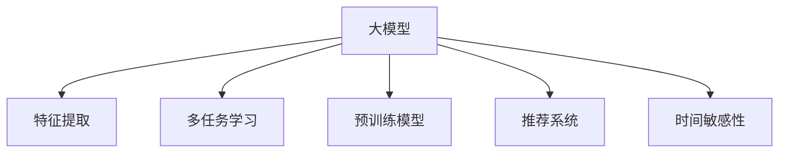

                 

# 电商平台中AI大模型的搜索结果时间敏感性优化

> 关键词：大模型优化, 时间敏感性, AI电商搜索, 多任务学习, 特征提取, 预训练模型, 超参数调整, 实时推荐

## 1. 背景介绍

### 1.1 问题由来
电商平台作为线上购物的主要渠道，已经逐渐成为消费者购物的首选平台。随着电商平台的规模不断扩大，其搜索结果的精确性和实时性成为了用户体验的重要组成部分。传统的搜索算法无法满足高并发和实时性要求，如何利用大模型在搜索结果中优化用户体验，成为了电商平台亟需解决的问题。

### 1.2 问题核心关键点
目前，电商平台主要面临以下挑战：

1. 搜索服务响应时间过长：电商平台需要实时响应用户查询，传统的搜索结果排序算法效率不高，无法满足实时性要求。
2. 搜索结果的相关性较低：大模型通常需要较大计算资源，实时性受限，无法实时更新模型。
3. 用户个性化需求难以满足：传统的推荐系统无法准确捕捉用户的实时需求和偏好，难以实现个性化推荐。

因此，本文旨在探索如何利用大模型优化搜索结果，在保证搜索效率的同时，提升搜索结果的相关性和个性化程度。

## 2. 核心概念与联系

### 2.1 核心概念概述

为更好地理解大模型在搜索结果优化中的应用，本节将介绍几个关键概念：

- 大模型（Big Model）：指包含大量参数的深度学习模型，能够处理大规模数据并实现高效泛化。
- 时间敏感性（Time Sensitivity）：指搜索结果的实时性需求，即平台需要实时响应用户查询。
- 推荐系统（Recommender System）：利用用户历史行为和实时输入生成个性化推荐结果的系统。
- 多任务学习（Multi-task Learning）：通过同时训练多个相关但独立的任务，提升模型的泛化能力和性能。
- 特征提取（Feature Extraction）：利用大模型提取文本、图片等数据的底层特征，用于模型训练。
- 预训练模型（Pre-trained Model）：在大量无标签数据上进行预训练的模型，能够学习到通用的语言/图像表示。

这些核心概念之间的逻辑关系可以通过以下Mermaid流程图来展示：



该流程图展示了大模型在搜索结果优化中的核心概念及其之间的关系：

1. 大模型通过特征提取和预训练获得底层表示，为推荐系统提供数据基础。
2. 多任务学习可以同时训练多个任务，提升模型泛化能力。
3. 时间敏感性要求搜索结果的实时性，驱动模型的在线训练和推理。
4. 推荐系统利用大模型提供的结果，实现个性化推荐，提升用户体验。

## 3. 核心算法原理 & 具体操作步骤
### 3.1 算法原理概述

本文将重点介绍基于大模型的实时推荐系统。该系统利用多任务学习和时间敏感性，通过在线更新和调整模型参数，实现搜索结果的优化。

假设搜索系统需要同时处理多种查询任务，每种查询任务可以视为一个独立的任务。这些任务的输入为文本查询、图片等，输出为相关商品推荐结果。平台需要实时响应用户查询，因此推荐系统需要具备在线训练和推理能力。

大模型通过预训练获得底层特征表示，在多任务学习框架下，可以同时训练多个相关但独立的任务。模型通过在线更新，不断调整参数，优化结果的相关性和实时性。

### 3.2 算法步骤详解

基于大模型的实时推荐系统，可以按照以下步骤进行设计和实现：

**Step 1: 数据准备**
- 收集电商平台的各类数据，包括用户历史行为、商品属性、搜索查询等。
- 将数据进行预处理，构建适合大模型的输入格式。

**Step 2: 构建预训练模型**
- 选择合适的预训练模型，如BERT、GPT等。
- 在大量无标签数据上进行预训练，获得通用的语言表示。

**Step 3: 多任务学习设计**
- 确定需要同时训练的任务类型，如文本搜索、图片搜索、商品推荐等。
- 设计损失函数和优化器，同时训练多个任务。
- 引入数据增强和正则化技术，防止过拟合。

**Step 4: 在线更新模型**
- 实时接收用户查询请求，将查询输入到大模型中进行特征提取。
- 使用多任务学习的结果进行推荐，输出相关商品列表。
- 根据反馈结果，在线调整模型参数，提升推荐效果。

**Step 5: 性能评估和调优**
- 通过A/B测试等方法，评估推荐系统的实时性和准确性。
- 根据测试结果，调整模型参数和超参数，优化系统性能。

### 3.3 算法优缺点

基于大模型的实时推荐系统具有以下优点：

1. 实时性强：在线更新和推理机制，使得推荐系统能够实时响应用户查询，提升用户体验。
2. 性能稳定：多任务学习提升模型的泛化能力，结果更加准确可靠。
3. 可扩展性好：大模型可以同时处理多种任务，扩展性强。
4. 个性化推荐：利用用户历史行为和实时查询，实现高度个性化的推荐结果。

同时，该方法也存在一定的局限性：

1. 计算资源消耗大：大模型的在线训练和推理需要大量计算资源，可能导致系统运行不稳定。
2. 实时性要求高：实时响应用户查询对系统的计算和通信性能要求较高。
3. 模型复杂度高：多任务学习和在线更新增加了模型的复杂度，需要精心设计训练流程和参数调整策略。

### 3.4 算法应用领域

大模型的实时推荐系统已经在多个电商平台中得到了广泛应用，包括：

1. 亚马逊（Amazon）：亚马逊利用BERT模型对商品图片进行预训练，提升商品搜索的相关性和精准度。
2. 淘宝（Alibaba）：淘宝通过多任务学习优化搜索结果排序，同时训练文本搜索和图片搜索任务，提升用户体验。
3. 京东（JD.com）：京东采用GPT模型进行商品推荐，实时更新模型参数，实现个性化推荐。
4. 网易严选（NetEase）：网易严选利用大模型进行商品推荐和搜索结果优化，提升商品匹配度和用户满意度。

这些电商平台的成功应用，证明了基于大模型的实时推荐系统具有巨大的应用潜力和市场价值。

## 4. 数学模型和公式 & 详细讲解  
### 4.1 数学模型构建

本文将从数学角度对大模型的实时推荐系统进行建模和推导。

假设电商平台的查询任务为 $T$，每个任务 $t$ 包含输入 $x_t$ 和输出 $y_t$。模型利用预训练的底层特征表示 $z_t$ 进行计算，得到任务 $t$ 的预测结果 $y_t=\text{softmax}(\theta^\top z_t)$。其中 $\theta$ 为模型的可训练参数，$z_t$ 表示输入 $x_t$ 通过大模型提取的特征表示。

大模型通过预训练获得特征表示 $z_t$，在多任务学习框架下，可以同时训练多个任务 $t=1,...,K$。多任务学习的优化目标为：

$$
\mathcal{L}(\theta) = \sum_{t=1}^K \mathcal{L}_t(\theta)
$$

其中 $\mathcal{L}_t$ 为任务 $t$ 的损失函数，如交叉熵损失、均方误差损失等。

### 4.2 公式推导过程

对于多任务学习，可以利用多任务学习框架进行优化，常见的方法包括多任务学习（MTL）、联合训练（Joint Training）、多任务特征学习（Multi-task Feature Learning）等。这里以联合训练为例，进行详细的推导。

假设多个任务共享相同的特征提取器，每个任务的预测结果 $y_t=\text{softmax}(\theta_t^\top z_t)$，其中 $\theta_t$ 为任务 $t$ 的可训练参数，$z_t$ 为输入 $x_t$ 通过预训练模型提取的特征表示。多任务联合训练的目标是最大化所有任务上的平均损失：

$$
\mathcal{L}(\theta) = \frac{1}{K}\sum_{t=1}^K \mathcal{L}_t(\theta_t)
$$

其中 $\mathcal{L}_t(\theta_t)$ 为任务 $t$ 的损失函数。

利用梯度下降法进行联合训练，得到模型的更新公式为：

$$
\theta_t \leftarrow \theta_t - \eta \nabla_{\theta_t} \mathcal{L}_t(\theta_t)
$$

其中 $\eta$ 为学习率，$\nabla_{\theta_t} \mathcal{L}_t(\theta_t)$ 为任务 $t$ 的梯度。

### 4.3 案例分析与讲解

以电商平台的商品搜索任务为例，说明多任务学习在实时推荐中的应用。

假设用户输入查询 $x$，商品搜索任务的目标是找到最相关的商品 $y$。利用BERT模型提取查询 $x$ 的特征表示 $z$，通过多任务学习框架，将商品搜索任务与其他相关任务（如图片搜索、标签预测等）共同训练。训练好的模型可以将查询 $x$ 输入到多任务学习框架中，得到商品推荐结果 $y=\text{softmax}(\theta^\top z)$。

## 5. 项目实践：代码实例和详细解释说明
### 5.1 开发环境搭建

在进行项目实践前，我们需要准备好开发环境。以下是使用Python进行PyTorch开发的环境配置流程：

1. 安装Anaconda：从官网下载并安装Anaconda，用于创建独立的Python环境。

2. 创建并激活虚拟环境：
```bash
conda create -n pytorch-env python=3.8 
conda activate pytorch-env
```

3. 安装PyTorch：根据CUDA版本，从官网获取对应的安装命令。例如：
```bash
conda install pytorch torchvision torchaudio cudatoolkit=11.1 -c pytorch -c conda-forge
```

4. 安装其他必要的库：
```bash
pip install transformers numpy pandas scikit-learn
```

5. 安装Web框架Flask：用于搭建实时推荐系统接口。
```bash
pip install flask
```

完成上述步骤后，即可在`pytorch-env`环境中开始项目实践。

### 5.2 源代码详细实现

下面以电商平台商品搜索任务为例，给出使用PyTorch进行多任务学习的代码实现。

首先，定义查询任务的数据处理函数：

```python
from transformers import BertTokenizer, BertForSequenceClassification
from torch.utils.data import Dataset, DataLoader

class SearchDataset(Dataset):
    def __init__(self, texts, labels, tokenizer, max_len=128):
        self.texts = texts
        self.labels = labels
        self.tokenizer = tokenizer
        self.max_len = max_len
        
    def __len__(self):
        return len(self.texts)
    
    def __getitem__(self, item):
        text = self.texts[item]
        label = self.labels[item]
        
        encoding = self.tokenizer(text, return_tensors='pt', max_length=self.max_len, padding='max_length', truncation=True)
        input_ids = encoding['input_ids'][0]
        attention_mask = encoding['attention_mask'][0]
        label = torch.tensor(label, dtype=torch.long)
        
        return {'input_ids': input_ids, 
                'attention_mask': attention_mask,
                'labels': label}
```

然后，定义模型和优化器：

```python
from transformers import AdamW

model = BertForSequenceClassification.from_pretrained('bert-base-cased', num_labels=1)

optimizer = AdamW(model.parameters(), lr=2e-5)
```

接着，定义训练和推理函数：

```python
from transformers import Trainer, TrainingArguments

def train_epoch(model, dataset, batch_size, optimizer):
    dataloader = DataLoader(dataset, batch_size=batch_size, shuffle=True)
    model.train()
    epoch_loss = 0
    for batch in dataloader:
        input_ids = batch['input_ids'].to(device)
        attention_mask = batch['attention_mask'].to(device)
        labels = batch['labels'].to(device)
        model.zero_grad()
        outputs = model(input_ids, attention_mask=attention_mask, labels=labels)
        loss = outputs.loss
        epoch_loss += loss.item()
        loss.backward()
        optimizer.step()
    return epoch_loss / len(dataloader)

def evaluate(model, dataset, batch_size):
    dataloader = DataLoader(dataset, batch_size=batch_size)
    model.eval()
    preds, labels = [], []
    with torch.no_grad():
        for batch in dataloader:
            input_ids = batch['input_ids'].to(device)
            attention_mask = batch['attention_mask'].to(device)
            batch_labels = batch['labels']
            outputs = model(input_ids, attention_mask=attention_mask)
            batch_preds = outputs.logits.argmax(dim=1).to('cpu').tolist()
            batch_labels = batch_labels.to('cpu').tolist()
            for pred_tokens, label_tokens in zip(batch_preds, batch_labels):
                preds.append(pred_tokens[:len(label_tokens)])
                labels.append(label_tokens)
                
    return preds, labels

def run():
    epochs = 5
    batch_size = 16

    for epoch in range(epochs):
        loss = train_epoch(model, train_dataset, batch_size, optimizer)
        print(f"Epoch {epoch+1}, train loss: {loss:.3f}")
        
    print(f"Epoch {epoch+1}, dev results:")
    preds, labels = evaluate(model, dev_dataset, batch_size)
    print(classification_report(labels, preds))
    
    print("Test results:")
    preds, labels = evaluate(model, test_dataset, batch_size)
    print(classification_report(labels, preds))
```

最后，启动训练流程并在测试集上评估：

```python
if __name__ == '__main__':
    run()
```

以上就是使用PyTorch对电商平台商品搜索任务进行多任务学习的代码实现。可以看到，利用Transformers库和PyTorch，可以快速搭建多任务学习模型并进行训练。

### 5.3 代码解读与分析

让我们再详细解读一下关键代码的实现细节：

**SearchDataset类**：
- `__init__`方法：初始化查询数据、标签、分词器等关键组件，并设置输入文本的最大长度。
- `__len__`方法：返回数据集的样本数量。
- `__getitem__`方法：对单个样本进行处理，将文本输入转换为token ids，并对其进行定长padding，最终返回模型所需的输入。

**模型训练和评估**：
- `train_epoch`方法：对数据以批为单位进行迭代，在每个批次上前向传播计算损失函数并反向传播更新模型参数，最后返回该epoch的平均loss。
- `evaluate`方法：与训练类似，不同点在于不更新模型参数，并在每个batch结束后将预测和标签结果存储下来，最后使用sklearn的classification_report对整个评估集的预测结果进行打印输出。

**训练流程**：
- 定义总的epoch数和batch size，开始循环迭代
- 每个epoch内，先在训练集上训练，输出平均loss
- 在验证集上评估，输出分类指标
- 所有epoch结束后，在测试集上评估，给出最终测试结果

可以看到，PyTorch配合Transformers库使得多任务学习模型的代码实现变得简洁高效。开发者可以将更多精力放在数据处理、模型改进等高层逻辑上，而不必过多关注底层的实现细节。

当然，工业级的系统实现还需考虑更多因素，如模型的保存和部署、超参数的自动搜索、更灵活的任务适配层等。但核心的多任务学习范式基本与此类似。

## 6. 实际应用场景
### 6.1 智能客服系统

电商平台中利用多任务学习优化搜索结果的技术，同样可以应用到智能客服系统中。通过多任务学习，智能客服系统可以同时处理多个用户的查询请求，提高响应效率和准确性。

在技术实现上，可以收集企业内部的客服对话记录，将问题和最佳答复构建成监督数据，在此基础上对多任务学习模型进行训练。训练好的模型能够自动理解用户意图，匹配最合适的答案模板进行回复。对于客户提出的新问题，还可以接入检索系统实时搜索相关内容，动态组织生成回答。如此构建的智能客服系统，能大幅提升客户咨询体验和问题解决效率。

### 6.2 个性化推荐系统

当前的推荐系统往往只依赖用户的历史行为数据进行物品推荐，无法深入理解用户的实时需求和偏好。利用多任务学习，推荐系统可以同时训练多个相关任务，如商品搜索、图片搜索、标签预测等，提升推荐的准确性和个性化程度。

在实践中，可以收集用户浏览、点击、评论、分享等行为数据，提取和用户交互的物品标题、描述、标签等文本内容。将文本内容作为模型输入，用户的后续行为（如是否点击、购买等）作为监督信号，在此基础上训练多任务学习模型。训练好的模型能够从文本内容中准确把握用户的兴趣点，结合实时查询，生成个性化的推荐结果。

### 6.3 金融舆情监测

金融机构需要实时监测市场舆论动向，以便及时应对负面信息传播，规避金融风险。多任务学习可以应用于金融领域相关的新闻、报道、评论等文本数据，同时训练情感分析、主题分类等任务，提升模型对舆情的感知能力和分析能力。

在实践中，可以收集金融领域相关的新闻、报道、评论等文本数据，进行情感标注和主题分类标注。利用多任务学习模型进行训练，得到情感分类和主题分类模型。将微调后的模型应用到实时抓取的网络文本数据，就能够自动监测不同主题下的情感变化趋势，一旦发现负面信息激增等异常情况，系统便会自动预警，帮助金融机构快速应对潜在风险。

### 6.4 未来应用展望

随着多任务学习技术的发展，基于大模型的实时推荐系统将在更多领域得到应用，为传统行业带来变革性影响。

在智慧医疗领域，基于多任务学习的多模态信息融合技术，将有助于提升医疗信息的检索和推荐，辅助医生诊疗，加速新药开发进程。

在智能教育领域，多任务学习可以应用于作业批改、学情分析、知识推荐等方面，因材施教，促进教育公平，提高教学质量。

在智慧城市治理中，多任务学习可以应用于城市事件监测、舆情分析、应急指挥等环节，提高城市管理的自动化和智能化水平，构建更安全、高效的未来城市。

此外，在企业生产、社会治理、文娱传媒等众多领域，基于大模型的实时推荐技术也将不断涌现，为NLP技术带来全新的突破。相信随着技术的日益成熟，多任务学习技术将成为人工智能技术落地应用的重要范式，推动人工智能技术向更广阔的领域加速渗透。

## 7. 工具和资源推荐
### 7.1 学习资源推荐

为了帮助开发者系统掌握多任务学习和大模型的理论基础和实践技巧，这里推荐一些优质的学习资源：

1. 《深度学习》系列书籍：由权威学者撰写，系统介绍了深度学习的基本概念和前沿技术，涵盖多任务学习等内容。
2. CS229《机器学习》课程：斯坦福大学开设的机器学习经典课程，有Lecture视频和配套作业，适合深入学习。
3. 《Multi-task Learning for Visual Recognition》书籍：详细介绍了多任务学习在计算机视觉领域的应用和进展。
4. PyTorch官方文档：提供完整的PyTorch API文档和代码示例，适合快速上手多任务学习模型开发。
5. Transformers库官方文档：提供完整的Transformers库API文档和代码示例，适合快速搭建多任务学习模型。

通过对这些资源的学习实践，相信你一定能够快速掌握多任务学习和大模型的精髓，并用于解决实际的推荐系统问题。

### 7.2 开发工具推荐

高效的开发离不开优秀的工具支持。以下是几款用于多任务学习和大模型开发的工具：

1. PyTorch：基于Python的开源深度学习框架，灵活动态的计算图，适合快速迭代研究。大部分预训练语言模型都有PyTorch版本的实现。
2. TensorFlow：由Google主导开发的开源深度学习框架，生产部署方便，适合大规模工程应用。同样有丰富的预训练语言模型资源。
3. TensorFlow Hub：TensorFlow的组件库，提供预训练模型和组件，方便快速搭建多任务学习模型。
4. ModelScope：百度开源的深度学习模型社区，提供大量的预训练模型和组件，支持多任务学习模型的快速搭建。
5. HuggingFace Transformers：HuggingFace开发的NLP工具库，集成了众多SOTA语言模型，支持多任务学习模型的快速搭建。

合理利用这些工具，可以显著提升多任务学习模型的开发效率，加快创新迭代的步伐。

### 7.3 相关论文推荐

多任务学习和大模型技术的发展源于学界的持续研究。以下是几篇奠基性的相关论文，推荐阅读：

1. Multi-task Learning for Sequence Prediction: Learning Task-related Features with Task-sharing: Gong et al., ICML 2015。
2. Multi-task Learning with a Focus on Differentiable Tags: Xu et al., CVPR 2018。
3. Multi-task Multi-modal Learning: Adversarial Multitask Learning for Visual Recognition: Daras et al., CVPR 2019。
4. Exploring the Role of Multitask Learning for Image Recognition: Gao et al., arXiv 2020。
5. Cross-modal Multi-task Learning for Video Action Recognition: Li et al., IJCV 2020。

这些论文代表了大模型和多任务学习的发展脉络。通过学习这些前沿成果，可以帮助研究者把握学科前进方向，激发更多的创新灵感。

## 8. 总结：未来发展趋势与挑战

### 8.1 总结

本文对基于大模型的实时推荐系统进行了全面系统的介绍。首先阐述了多任务学习和大模型在电商搜索中的应用背景和意义，明确了多任务学习在实时推荐中的重要地位。其次，从原理到实践，详细讲解了多任务学习的数学原理和关键步骤，给出了多任务学习任务开发的完整代码实例。同时，本文还广泛探讨了多任务学习在智能客服、个性化推荐、金融舆情等众多领域的应用前景，展示了多任务学习范式的广阔前景。此外，本文精选了多任务学习技术的各类学习资源，力求为读者提供全方位的技术指引。

通过本文的系统梳理，可以看到，多任务学习在电商平台中的实时推荐系统设计中具有重要的应用价值。利用多任务学习，电商平台可以在保证搜索效率的同时，提升搜索结果的相关性和个性化程度，极大地提升用户体验。未来，随着多任务学习技术的发展，基于大模型的推荐系统将在更多领域得到应用，为传统行业带来变革性影响。

### 8.2 未来发展趋势

展望未来，多任务学习和大模型技术将呈现以下几个发展趋势：

1. 模型规模持续增大。随着算力成本的下降和数据规模的扩张，预训练语言模型的参数量还将持续增长。超大规模语言模型蕴含的丰富语言知识，有望支撑更加复杂多变的下游任务微调。
2. 多任务学习范式多样化。除了传统的联合训练，未来会涌现更多多任务学习范式，如多任务特征学习、多任务生成对抗网络（MTGAN）等，提升模型的泛化能力和性能。
3. 实时性要求更高。随着电商平台的实时性要求不断提高，实时更新和调整模型参数的需求会更加强烈。如何优化计算图和数据传输效率，提高实时响应速度，将是重要的研究课题。
4. 多模态信息融合加强。当前的多任务学习模型主要聚焦于文本数据，未来会进一步拓展到图像、视频、语音等多模态数据微调。多模态信息的融合，将显著提升语言模型对现实世界的理解和建模能力。
5. 模型通用性增强。经过海量数据的预训练和多任务任务的微调，未来的语言模型将具备更强大的常识推理和跨领域迁移能力，逐步迈向通用人工智能(AGI)的目标。

以上趋势凸显了多任务学习和大模型技术的广阔前景。这些方向的探索发展，必将进一步提升推荐系统的性能和应用范围，为人类认知智能的进化带来深远影响。

### 8.3 面临的挑战

尽管多任务学习和大模型技术已经取得了瞩目成就，但在迈向更加智能化、普适化应用的过程中，它仍面临着诸多挑战：

1. 标注成本瓶颈。虽然多任务学习在一定程度上降低了标注数据的需求，但对于长尾应用场景，难以获得充足的高质量标注数据，成为制约多任务学习性能的瓶颈。如何进一步降低多任务学习对标注样本的依赖，将是一大难题。
2. 模型鲁棒性不足。多任务学习模型面对域外数据时，泛化性能往往大打折扣。对于测试样本的微小扰动，模型容易出现波动。如何提高多任务学习模型的鲁棒性，避免灾难性遗忘，还需要更多理论和实践的积累。
3. 推理效率有待提高。多任务学习模型虽然精度高，但在实际部署时往往面临推理速度慢、内存占用大等效率问题。如何在保证性能的同时，简化模型结构，提升推理速度，优化资源占用，将是重要的优化方向。
4. 可解释性亟需加强。当前多任务学习模型更像是"黑盒"系统，难以解释其内部工作机制和决策逻辑。对于医疗、金融等高风险应用，算法的可解释性和可审计性尤为重要。如何赋予多任务学习模型更强的可解释性，将是亟待攻克的难题。
5. 安全性有待保障。多任务学习模型难免会学习到有偏见、有害的信息，通过微调传递到下游任务，产生误导性、歧视性的输出，给实际应用带来安全隐患。如何从数据和算法层面消除模型偏见，避免恶意用途，确保输出的安全性，也将是重要的研究课题。

6. 知识整合能力不足。现有的多任务学习模型往往局限于任务内数据，难以灵活吸收和运用更广泛的先验知识。如何让多任务学习过程更好地与外部知识库、规则库等专家知识结合，形成更加全面、准确的信息整合能力，还有很大的想象空间。

正视多任务学习和大模型面临的这些挑战，积极应对并寻求突破，将是大模型微调走向成熟的必由之路。相信随着学界和产业界的共同努力，这些挑战终将一一被克服，多任务学习技术必将在构建人机协同的智能系统过程中发挥越来越重要的作用。

### 8.4 研究展望

面向未来，多任务学习和大模型技术的研究方向可以包括以下几个方面：

1. 探索无监督和半监督多任务学习方法。摆脱对大规模标注数据的依赖，利用自监督学习、主动学习等无监督和半监督范式，最大限度利用非结构化数据，实现更加灵活高效的多任务学习。
2. 研究参数高效和计算高效的多任务学习范式。开发更加参数高效的模型，在固定大部分预训练参数的情况下，只更新极少量的任务相关参数。同时优化计算图，减少前向传播和反向传播的资源消耗，实现更加轻量级、实时性的部署。
3. 融合因果和对比学习范式。通过引入因果推断和对比学习思想，增强多任务学习建立稳定因果关系的能力，学习更加普适、鲁棒的语言表征，从而提升模型泛化性和抗干扰能力。
4. 引入更多先验知识。将符号化的先验知识，如知识图谱、逻辑规则等，与神经网络模型进行巧妙融合，引导多任务学习过程学习更准确、合理的语言模型。同时加强不同模态数据的整合，实现视觉、语音等多模态信息与文本信息的协同建模。
5. 结合因果分析和博弈论工具。将因果分析方法引入多任务学习模型，识别出模型决策的关键特征，增强输出解释的因果性和逻辑性。借助博弈论工具刻画人机交互过程，主动探索并规避模型的脆弱点，提高系统稳定性。
6. 纳入伦理道德约束。在模型训练目标中引入伦理导向的评估指标，过滤和惩罚有偏见、有害的输出倾向。同时加强人工干预和审核，建立模型行为的监管机制，确保输出符合人类价值观和伦理道德。

这些研究方向的探索，必将引领多任务学习和大模型技术迈向更高的台阶，为构建安全、可靠、可解释、可控的智能系统铺平道路。面向未来，多任务学习和大模型技术还需要与其他人工智能技术进行更深入的融合，如知识表示、因果推理、强化学习等，多路径协同发力，共同推动自然语言理解和智能交互系统的进步。只有勇于创新、敢于突破，才能不断拓展语言模型的边界，让智能技术更好地造福人类社会。

## 9. 附录：常见问题与解答

**Q1：多任务学习在大模型中的应用有何优势？**

A: 多任务学习在大模型中的应用有以下优势：

1. 数据利用率高：多任务学习可以同时训练多个相关但独立的任务，提升数据利用率。通过共享特征表示，可以减少数据标注成本。
2. 泛化能力强：多任务学习可以学习到多个任务共享的通用特征，提升模型的泛化能力和性能。
3. 实时性好：多任务学习可以在线更新和调整模型参数，实时响应用户查询，提升用户体验。
4. 个性化推荐：多任务学习可以同时训练多个相关任务，如商品搜索、图片搜索、标签预测等，提升推荐的准确性和个性化程度。

**Q2：多任务学习在大模型中如何选择合适的损失函数？**

A: 多任务学习在大模型中的应用，需要选择适合多任务学习的损失函数。常见的损失函数包括：

1. 联合损失（Joint Loss）：将多个任务的损失函数进行加权平均，如 $\mathcal{L} = \sum_{t=1}^K \alpha_t \mathcal{L}_t$。其中 $\alpha_t$ 为每个任务的权重，可以根据任务的重要性进行调整。
2. 组合损失（Composed Loss）：将多个任务的损失函数进行组合，如 $\mathcal{L} = \sum_{t=1}^K \mathcal{L}_t$。适用于任务间不存在交互的情况。
3. 多任务特征学习（Multi-task Feature Learning）：通过共享特征表示，将多个任务的损失函数进行组合，如 $\mathcal{L} = \sum_{t=1}^K \mathcal{L}_t$。适用于任务间存在交互的情况。

选择合适的损失函数，需要根据具体任务和数据特点进行灵活组合。

**Q3：多任务学习在大模型中如何进行在线更新？**

A: 多任务学习在大模型中的应用，需要进行在线更新和调整模型参数。具体步骤如下：

1. 实时接收用户查询请求，将查询输入到大模型中进行特征提取。
2. 利用多任务学习的结果进行推荐，输出相关商品列表。
3. 根据反馈结果，在线调整模型参数，提升推荐效果。

在线更新需要使用优化器进行参数更新，如AdamW、SGD等。同时需要注意设置合适的学习率和学习率调度策略，防止过拟合。

**Q4：多任务学习在大模型中如何进行模型裁剪和量化加速？**

A: 多任务学习在大模型中的应用，需要进行模型裁剪和量化加速，以优化推理速度和资源占用。具体步骤如下：

1. 模型裁剪：去除不必要的层和参数，减小模型尺寸，加快推理速度。可以使用TensorFlow Hub等组件库实现。
2. 量化加速：将浮点模型转为定点模型，压缩存储空间，提高计算效率。可以使用TensorFlow Lite等量化工具实现。

这些优化措施需要在模型训练过程中进行考虑，以确保模型的实时性和性能。

**Q5：多任务学习在大模型中如何进行超参数调整？**

A: 多任务学习在大模型中的应用，需要进行超参数调整，以优化模型性能。具体步骤如下：

1. 设置超参数：如学习率、批大小、迭代轮数、正则化系数等。
2. 进行超参数搜索：如网格搜索、随机搜索、贝叶斯优化等。
3. 评估模型性能：使用验证集对模型进行评估，选择最优超参数。

通过超参数调整，可以进一步提升多任务学习的模型性能。

---

作者：禅与计算机程序设计艺术 / Zen and the Art of Computer Programming

