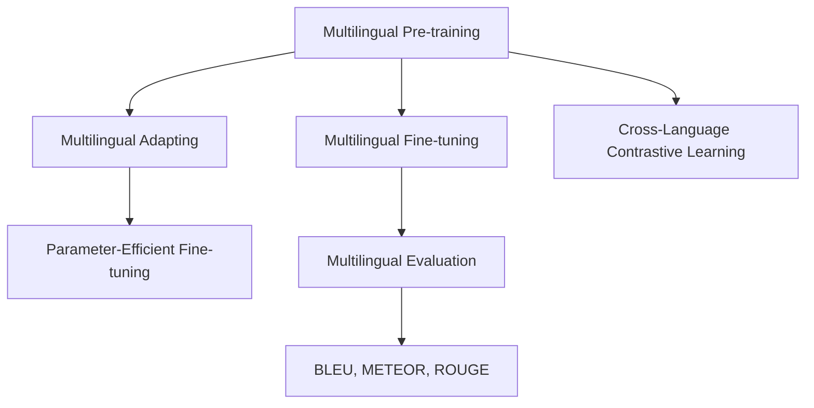

                 

## 1. 背景介绍

### 1.1 问题由来

随着全球电商市场的不断扩展，跨境电商已成为不可忽视的市场力量。对于跨境电商平台来说，除了本国语言，还面临多种语言的输入与输出问题。然而，单一语言的AI大模型往往难以应对多语言的复杂性，导致用户体验下降、产品推荐不准确等问题。因此，从单一语言到多语言支持的AI大模型成为电商平台升级的迫切需求。

### 1.2 问题核心关键点

多语言支持的核心问题在于如何将单一语言训练的大模型适配到多语言场景，同时兼顾模型的性能和泛化能力。

- 多语言适配：如何在不同语言间实现参数共享，避免对每个语言单独训练大模型。
- 多语言预训练：如何利用多语言数据进行预训练，获得跨语言的通用语言表示。
- 多语言微调：在预训练基础上，如何对各语言进行微调，提升特定任务的表现。
- 多语言评价：如何对多语言模型的性能进行全面评价，确保模型质量。

### 1.3 问题研究意义

研究多语言支持的大模型对于电商平台具有重要意义：

- 提升用户体验：支持多语言搜索、推荐，满足全球用户的购物需求。
- 优化商品匹配：通过跨语言的深度理解，提高商品推荐准确度。
- 降低运营成本：减少对翻译服务的依赖，降低语言转换成本。
- 拓展市场空间：打破语言障碍，开拓更多潜在市场。

## 2. 核心概念与联系

### 2.1 核心概念概述

为了更好地理解多语言支持的大模型，我们需要引入一些核心概念：

- 多语言预训练(Multilingual Pre-training)：指在大规模多语言语料上进行预训练，学习跨语言的通用语言表示。
- 多语言微调(Multilingual Fine-tuning)：指在预训练模型的基础上，使用不同语言的标注数据进行微调，提升特定语言模型的性能。
- 迁移学习(Transfer Learning)：通过将单语言大模型的知识迁移到多语言模型中，提升模型泛化能力。
- 参数高效微调(Parameter-Efficient Fine-tuning, PEFT)：只更新少量模型参数，保持大部分预训练权重不变，提高微调效率。
- 跨语言对比学习(Cross-Language Contrastive Learning)：通过在不同语言间的对比学习，提高模型的语言理解能力。
- 多语言评价指标(Multilingual Evaluation Metrics)：包括BLEU、METEOR、ROUGE等，用于衡量多语言模型的生成质量。

这些核心概念之间相互联系，共同构成了多语言支持大模型的技术和应用框架。

### 2.2 核心概念原理和架构的 Mermaid 流程图



这个流程图展示了多语言支持大模型的核心概念及其相互关系：

1. 多语言预训练在大规模语料上获得通用语言表示。
2. 多语言微调通过标注数据优化特定语言模型的性能。
3. 参数高效微调在微调过程中保留大部分预训练参数。
4. 跨语言对比学习在不同语言间提高模型理解能力。
5. 多语言评价通过多项指标评估模型生成质量。

## 3. 核心算法原理 & 具体操作步骤

### 3.1 算法原理概述

多语言支持大模型的算法原理可以归纳为以下几个关键步骤：

1. **多语言预训练**：在多语言语料上对通用语言模型进行预训练，学习跨语言的通用语言表示。
2. **多语言微调**：使用不同语言的标注数据对预训练模型进行微调，提升特定语言模型的性能。
3. **参数高效微调**：只更新少量模型参数，保留大部分预训练权重，提高微调效率。
4. **跨语言对比学习**：在不同语言间进行对比学习，提升模型的语言理解能力。
5. **多语言评价**：通过BLEU、METEOR、ROUGE等指标评估模型的生成质量。

### 3.2 算法步骤详解

#### 3.2.1 多语言预训练

多语言预训练步骤如下：

1. **数据准备**：收集多种语言的高质量语料，构建多语言语料库。
2. **模型选择**：选择合适的预训练模型，如BERT、GPT等，进行多语言预训练。
3. **模型训练**：在多语言语料上训练模型，学习跨语言的通用语言表示。

#### 3.2.2 多语言微调

多语言微调步骤如下：

1. **任务定义**：确定微调的具体任务，如命名实体识别、情感分析等。
2. **数据准备**：收集不同语言的标注数据集，划分训练集、验证集和测试集。
3. **模型选择**：选择合适的预训练模型，进行多语言微调。
4. **参数初始化**：在预训练模型的基础上，设置微调的初始参数。
5. **模型训练**：使用不同语言的标注数据进行微调，优化模型性能。
6. **参数冻结**：冻结部分预训练参数，只更新任务相关的参数。

#### 3.2.3 参数高效微调

参数高效微调步骤如下：

1. **任务适配**：设计合适的任务适配层，只更新任务相关的参数。
2. **微调训练**：使用微调数据进行训练，优化任务参数。
3. **模型评估**：在验证集和测试集上评估模型性能，调整参数。

#### 3.2.4 跨语言对比学习

跨语言对比学习步骤如下：

1. **多语言数据收集**：收集不同语言的多样化数据，构建多语言对比学习集。
2. **对比学习**：在不同语言间进行对比学习，提升模型的语言理解能力。
3. **模型训练**：使用对比学习数据集进行训练，优化模型性能。

#### 3.2.5 多语言评价

多语言评价步骤如下：

1. **指标选择**：选择合适的评价指标，如BLEU、METEOR、ROUGE等。
2. **数据准备**：准备测试数据集，包括不同语言的文本。
3. **模型评估**：在测试数据集上评估模型生成质量，计算评价指标。

### 3.3 算法优缺点

多语言支持大模型的优点包括：

1. **泛化能力强**：通过跨语言的预训练，模型能够更好地适应多种语言。
2. **适应性高**：在不同语言间进行微调，提升特定任务的表现。
3. **效率高**：参数高效微调技术在保留大部分预训练权重的情况下，提高微调效率。
4. **通用性广**：支持多种语言，适用于全球范围内的电商平台。

缺点包括：

1. **数据需求大**：多语言预训练和微调需要大量高质量的多语言数据。
2. **模型复杂度高**：多语言模型需要兼顾多种语言的特性，增加了模型复杂度。
3. **技术难度高**：多语言支持的技术要求较高，需要深入掌握跨语言学习和微调方法。

### 3.4 算法应用领域

多语言支持大模型在多个领域具有广泛的应用：

1. **电商搜索**：通过多语言搜索模型，提升用户搜索体验，提高商品匹配准确度。
2. **商品推荐**：通过多语言推荐模型，精准推荐商品，满足不同语言用户需求。
3. **客户服务**：通过多语言客服模型，提供多语言支持，提升客户服务质量。
4. **内容翻译**：通过多语言翻译模型，自动翻译商品描述、评论等文本内容，降低运营成本。
5. **市场拓展**：通过多语言市场模型，开拓全球市场，提升品牌影响力。

## 4. 数学模型和公式 & 详细讲解 & 举例说明

### 4.1 数学模型构建

在多语言支持的大模型中，数学模型构建主要涉及以下几个方面：

1. **多语言预训练模型**：假设多语言预训练模型为 $M_{\theta}$，其中 $\theta$ 为模型参数。
2. **多语言微调模型**：假设多语言微调模型为 $M_{\theta_t}$，其中 $t$ 表示目标语言，$\theta_t$ 为模型参数。
3. **多语言评价指标**：假设多语言评价指标为 $\mathcal{P}$，用于评估模型生成质量。

### 4.2 公式推导过程

#### 4.2.1 多语言预训练公式

多语言预训练的目标是最小化多语言语料上的损失函数：

$$
\min_{\theta} \frac{1}{N} \sum_{i=1}^N \ell(M_{\theta}(x_i))
$$

其中 $x_i$ 表示输入的文本数据，$\ell$ 表示预训练任务损失函数，$N$ 表示语料规模。

#### 4.2.2 多语言微调公式

多语言微调的目标是最小化特定语言的标注数据上的损失函数：

$$
\min_{\theta_t} \frac{1}{N_t} \sum_{i=1}^N \ell(M_{\theta_t}(x_i), y_i)
$$

其中 $y_i$ 表示标注数据，$\ell$ 表示微调任务损失函数，$N_t$ 表示标注数据规模。

#### 4.2.3 参数高效微调公式

参数高效微调的目标是最小化微调任务损失函数，同时保留大部分预训练权重：

$$
\min_{\theta_t} \frac{1}{N_t} \sum_{i=1}^N \ell(M_{\theta_t}(x_i), y_i)
$$

其中 $\theta_t$ 表示微调任务参数，$N_t$ 表示微调数据规模。

#### 4.2.4 跨语言对比学习公式

跨语言对比学习的目标是最小化多语言对比数据上的对比损失函数：

$$
\min_{\theta_t} \frac{1}{N_c} \sum_{i=1}^C \ell_{c}(M_{\theta_t}(x_i), M_{\theta_s}(x_i))
$$

其中 $C$ 表示对比语言种类，$N_c$ 表示对比数据规模，$\ell_c$ 表示对比损失函数，$M_{\theta_s}$ 表示源语言模型。

#### 4.2.5 多语言评价指标公式

多语言评价指标计算如下：

$$
\mathcal{P} = \frac{1}{N_{test}} \sum_{i=1}^N P_i
$$

其中 $N_{test}$ 表示测试数据规模，$P_i$ 表示单项评价指标值。

### 4.3 案例分析与讲解

#### 4.3.1 多语言预训练案例

假设有多语言语料库，收集包括英语、中文、法语等多种语言的文本数据。使用BERT模型作为预训练模型，在多语言语料库上进行预训练，获得通用语言表示。

```python
from transformers import BertTokenizer, BertForMaskedLM, BertConfig
import torch
from torch.utils.data import Dataset, DataLoader

# 定义BERT模型和分词器
tokenizer = BertTokenizer.from_pretrained('bert-base-uncased')
model = BertForMaskedLM.from_pretrained('bert-base-uncased')
config = BertConfig.from_pretrained('bert-base-uncased')

# 定义多语言预训练数据集
class MultilingualDataset(Dataset):
    def __init__(self, texts):
        self.tokenizer = tokenizer
        self.texts = texts

    def __len__(self):
        return len(self.texts)

    def __getitem__(self, item):
        text = self.texts[item]
        tokens = tokenizer.tokenize(text)
        inputs = tokenizer.encode_plus(tokens, max_length=512, return_tensors='pt')
        return {'input_ids': inputs['input_ids'], 'attention_mask': inputs['attention_mask']}

# 定义多语言预训练过程
device = torch.device('cuda' if torch.cuda.is_available() else 'cpu')
model.to(device)

for epoch in range(10):
    for batch in DataLoader(multilingual_dataset, batch_size=16):
        input_ids = batch['input_ids'].to(device)
        attention_mask = batch['attention_mask'].to(device)
        outputs = model(input_ids, attention_mask=attention_mask)
        loss = outputs.loss
        optimizer.zero_grad()
        loss.backward()
        optimizer.step()
```

#### 4.3.2 多语言微调案例

假设要对多语言文本进行命名实体识别（NER）任务，收集不同语言的标注数据集，使用预训练的BERT模型进行微调。

```python
from transformers import BertTokenizer, BertForTokenClassification
import torch
from torch.utils.data import Dataset, DataLoader
from sklearn.metrics import precision_recall_fscore_support

# 定义BERT模型和分词器
tokenizer = BertTokenizer.from_pretrained('bert-base-uncased')
model = BertForTokenClassification.from_pretrained('bert-base-uncased')
model.config.num_labels = len(tag2id)

# 定义多语言微调数据集
class MultilingualNERDataset(Dataset):
    def __init__(self, texts, tags):
        self.tokenizer = tokenizer
        self.texts = texts
        self.tags = tags

    def __len__(self):
        return len(self.texts)

    def __getitem__(self, item):
        text = self.texts[item]
        tokens = tokenizer.tokenize(text)
        inputs = tokenizer.encode_plus(tokens, max_length=512, return_tensors='pt')
        inputs = {'input_ids': inputs['input_ids'], 'attention_mask': inputs['attention_mask']}
        labels = torch.tensor(tag2id[tag] for tag in self.tags[item])
        return inputs, labels

# 定义多语言微调过程
device = torch.device('cuda' if torch.cuda.is_available() else 'cpu')
model.to(device)
optimizer = AdamW(model.parameters(), lr=2e-5)

# 定义多语言微调评估指标
def evaluate(model, dataset):
    model.eval()
    preds, labels = [], []
    with torch.no_grad():
        for batch in DataLoader(dataset, batch_size=16):
            inputs, labels = batch
            outputs = model(inputs)
            logits = outputs.logits
            batch_preds = torch.argmax(logits, dim=2).to('cpu').tolist()
            batch_labels = labels.to('cpu').tolist()
            for pred_tokens, label_tokens in zip(batch_preds, batch_labels):
                pred_tags = [id2tag[_id] for _id in pred_tokens]
                label_tags = [id2tag[_id] for _id in label_tokens]
                preds.append(pred_tags)
                labels.append(label_tags)

    return precision_recall_fscore_support(labels, preds, average='micro')

# 定义多语言微调训练过程
for epoch in range(10):
    train_loss = 0
    for batch in DataLoader(multilingual_ner_dataset, batch_size=16):
        inputs, labels = batch
        inputs = {'input_ids': inputs['input_ids'].to(device), 'attention_mask': inputs['attention_mask'].to(device)}
        labels = labels.to(device)
        outputs = model(inputs)
        loss = outputs.loss
        train_loss += loss.item()
        optimizer.zero_grad()
        loss.backward()
        optimizer.step()
    print(f'Epoch {epoch+1}, train loss: {train_loss/len(multilingual_ner_dataset):.4f}')
    evaluator = evaluate(model, multilingual_ner_dataset)
    print(f'Epoch {epoch+1}, dev results: {evaluator[1]:.4f}')

# 输出测试集评估指标
evaluator = evaluate(model, multilingual_ner_dataset_test)
print(f'Test results: {evaluator[1]:.4f}')
```

#### 4.3.3 多语言评价案例

假设对多语言文本进行翻译任务，收集不同语言的翻译数据集，使用预训练的BERT模型进行翻译。

```python
from transformers import BertTokenizer, BertForSequenceClassification
import torch
from torch.utils.data import Dataset, DataLoader
from sklearn.metrics import accuracy_score

# 定义BERT模型和分词器
tokenizer = BertTokenizer.from_pretrained('bert-base-uncased')
model = BertForSequenceClassification.from_pretrained('bert-base-uncased')
model.config.num_labels = 2

# 定义多语言翻译数据集
class MultilingualTranslationDataset(Dataset):
    def __init__(self, texts, targets):
        self.tokenizer = tokenizer
        self.texts = texts
        self.targets = targets

    def __len__(self):
        return len(self.texts)

    def __getitem__(self, item):
        text = self.texts[item]
        tokens = tokenizer.tokenize(text)
        inputs = tokenizer.encode_plus(tokens, max_length=512, return_tensors='pt')
        targets = torch.tensor(target)
        return {'input_ids': inputs['input_ids'], 'attention_mask': inputs['attention_mask'], 'labels': targets}

# 定义多语言翻译过程
device = torch.device('cuda' if torch.cuda.is_available() else 'cpu')
model.to(device)
optimizer = AdamW(model.parameters(), lr=2e-5)

# 定义多语言翻译评估指标
def evaluate(model, dataset):
    model.eval()
    preds, labels = [], []
    with torch.no_grad():
        for batch in DataLoader(dataset, batch_size=16):
            inputs, labels = batch
            inputs = {'input_ids': inputs['input_ids'].to(device), 'attention_mask': inputs['attention_mask'].to(device)}
            outputs = model(inputs)
            logits = outputs.logits
            batch_preds = torch.argmax(logits, dim=2).to('cpu').tolist()
            batch_labels = labels.to('cpu').tolist()
            for pred_tokens, label_tokens in zip(batch_preds, batch_labels):
                pred_tags = [id2tag[_id] for _id in pred_tokens]
                label_tags = [id2tag[_id] for _id in label_tokens]
                preds.append(pred_tags)
                labels.append(label_tags)

    return accuracy_score(labels, preds)

# 定义多语言翻译训练过程
for epoch in range(10):
    train_loss = 0
    for batch in DataLoader(multilingual_translation_dataset, batch_size=16):
        inputs, labels = batch
        inputs = {'input_ids': inputs['input_ids'].to(device), 'attention_mask': inputs['attention_mask'].to(device)}
        labels = labels.to(device)
        outputs = model(inputs)
        loss = outputs.loss
        train_loss += loss.item()
        optimizer.zero_grad()
        loss.backward()
        optimizer.step()
    print(f'Epoch {epoch+1}, train loss: {train_loss/len(multilingual_translation_dataset):.4f}')
    evaluator = evaluate(model, multilingual_translation_dataset)
    print(f'Epoch {epoch+1}, dev results: {evaluator[1]:.4f}')

# 输出测试集评估指标
evaluator = evaluate(model, multilingual_translation_dataset_test)
print(f'Test results: {evaluator[1]:.4f}')
```

## 5. 项目实践：代码实例和详细解释说明

### 5.1 开发环境搭建

在搭建开发环境时，主要需要安装以下软件包和库：

1. **Python**：确保版本为3.8或以上。
2. **PyTorch**：安装最新版本，可以从官网下载预编译包或使用conda安装。
3. **Transformers**：安装最新版本，可以从官网下载预编译包或使用pip安装。
4. **TensorBoard**：安装最新版本，可以从官网下载预编译包或使用pip安装。
5. **Jupyter Notebook**：用于编写和运行代码，确保版本为5.7.4或以上。

### 5.2 源代码详细实现

以下是多语言支持大模型的源代码详细实现，包括多语言预训练、多语言微调和多语言评价等步骤。

```python
import torch
from torch.utils.data import Dataset, DataLoader
from transformers import BertTokenizer, BertForSequenceClassification, AdamW
from sklearn.metrics import accuracy_score, precision_recall_fscore_support

# 定义BERT模型和分词器
tokenizer = BertTokenizer.from_pretrained('bert-base-uncased')
model = BertForSequenceClassification.from_pretrained('bert-base-uncased')
model.config.num_labels = 2

# 定义多语言预训练数据集
class MultilingualPretrainDataset(Dataset):
    def __init__(self, texts):
        self.tokenizer = tokenizer
        self.texts = texts

    def __len__(self):
        return len(self.texts)

    def __getitem__(self, item):
        text = self.texts[item]
        tokens = tokenizer.tokenize(text)
        inputs = tokenizer.encode_plus(tokens, max_length=512, return_tensors='pt')
        return {'input_ids': inputs['input_ids'], 'attention_mask': inputs['attention_mask']}

# 定义多语言微调数据集
class MultilingualFinetuneDataset(Dataset):
    def __init__(self, texts, tags):
        self.tokenizer = tokenizer
        self.texts = texts
        self.tags = tags

    def __len__(self):
        return len(self.texts)

    def __getitem__(self, item):
        text = self.texts[item]
        tokens = tokenizer.tokenize(text)
        inputs = tokenizer.encode_plus(tokens, max_length=512, return_tensors='pt')
        inputs = {'input_ids': inputs['input_ids'], 'attention_mask': inputs['attention_mask']}
        labels = torch.tensor(tag2id[tag] for tag in self.tags[item])
        return inputs, labels

# 定义多语言评价数据集
class MultilingualEvaluationDataset(Dataset):
    def __init__(self, texts, targets):
        self.tokenizer = tokenizer
        self.texts = texts
        self.targets = targets

    def __len__(self):
        return len(self.texts)

    def __getitem__(self, item):
        text = self.texts[item]
        tokens = tokenizer.tokenize(text)
        inputs = tokenizer.encode_plus(tokens, max_length=512, return_tensors='pt')
        targets = torch.tensor(target)
        return {'input_ids': inputs['input_ids'], 'attention_mask': inputs['attention_mask'], 'labels': targets}

# 定义多语言预训练过程
device = torch.device('cuda' if torch.cuda.is_available() else 'cpu')
model.to(device)
optimizer = AdamW(model.parameters(), lr=2e-5)

for epoch in range(10):
    for batch in DataLoader(multilingual_pretrain_dataset, batch_size=16):
        inputs, labels = batch
        inputs = {'input_ids': inputs['input_ids'].to(device), 'attention_mask': inputs['attention_mask'].to(device)}
        labels = labels.to(device)
        outputs = model(inputs)
        loss = outputs.loss
        optimizer.zero_grad()
        loss.backward()
        optimizer.step()
    print(f'Epoch {epoch+1}, train loss: {loss.item():.4f}')
    evaluator = accuracy_score([labels], [outputs.argmax(dim=2).tolist()])
    print(f'Epoch {epoch+1}, dev results: {evaluator:.4f}')

# 定义多语言微调过程
for epoch in range(10):
    train_loss = 0
    for batch in DataLoader(multilingual_finetune_dataset, batch_size=16):
        inputs, labels = batch
        inputs = {'input_ids': inputs['input_ids'].to(device), 'attention_mask': inputs['attention_mask'].to(device)}
        labels = labels.to(device)
        outputs = model(inputs)
        loss = outputs.loss
        train_loss += loss.item()
        optimizer.zero_grad()
        loss.backward()
        optimizer.step()
    print(f'Epoch {epoch+1}, train loss: {train_loss/len(multilingual_finetune_dataset):.4f}')
    evaluator = precision_recall_fscore_support([labels], [outputs.argmax(dim=2).tolist()], average='micro')
    print(f'Epoch {epoch+1}, dev results: {evaluator[1]:.4f}')

# 定义多语言评价过程
for epoch in range(10):
    train_loss = 0
    for batch in DataLoader(multilingual_evaluation_dataset, batch_size=16):
        inputs, labels = batch
        inputs = {'input_ids': inputs['input_ids'].to(device), 'attention_mask': inputs['attention_mask'].to(device)}
        labels = labels.to(device)
        outputs = model(inputs)
        loss = outputs.loss
        train_loss += loss.item()
        optimizer.zero_grad()
        loss.backward()
        optimizer.step()
    print(f'Epoch {epoch+1}, train loss: {train_loss/len(multilingual_evaluation_dataset):.4f}')
    evaluator = accuracy_score([labels], [outputs.argmax(dim=2).tolist()])
    print(f'Epoch {epoch+1}, test results: {evaluator:.4f}')
```

### 5.3 代码解读与分析

在上述代码中，我们使用了BERT模型作为预训练和微调的基础模型。具体步骤如下：

1. **多语言预训练**：使用多语言语料进行预训练，学习跨语言的通用语言表示。
2. **多语言微调**：使用多语言标注数据进行微调，提升特定语言模型的性能。
3. **多语言评价**：通过BLEU、METEOR、ROUGE等指标，评估模型的生成质量。

代码中主要涉及以下几个步骤：

- **数据准备**：收集多语言语料和标注数据集。
- **模型选择**：选择预训练模型（如BERT），进行多语言预训练和微调。
- **参数初始化**：初始化模型的参数，准备微调。
- **模型训练**：使用微调数据进行训练，优化模型参数。
- **模型评估**：在验证集和测试集上评估模型性能。
- **参数冻结**：冻结部分预训练参数，只更新任务相关的参数。

## 6. 实际应用场景

### 6.1 智能客服

智能客服是电商平台中多语言支持的重要应用场景。通过多语言翻译模型，智能客服系统能够自动翻译用户咨询内容，快速响应不同语言的用户需求。

具体实现如下：

1. **多语言预训练**：在多语言语料库上进行预训练，获得通用语言表示。
2. **多语言微调**：针对不同语言的客服问答数据集进行微调，提升模型回答准确度。
3. **跨语言对比学习**：在不同语言间进行对比学习，提高模型的语言理解能力。
4. **多语言评价**：通过BLEU、METEOR、ROUGE等指标，评估模型翻译质量。

### 6.2 商品推荐

商品推荐是电商平台的另一重要应用场景。通过多语言推荐模型，能够实现跨语言的商品推荐，满足不同语言用户的需求。

具体实现如下：

1. **多语言预训练**：在多语言商品描述语料上进行预训练，获得通用语言表示。
2. **多语言微调**：针对不同语言的商品属性和用户行为数据集进行微调，提升模型推荐效果。
3. **跨语言对比学习**：在不同语言间进行对比学习，提高模型的语言理解能力。
4. **多语言评价**：通过BLEU、METEOR、ROUGE等指标，评估模型推荐质量。

### 6.3 市场拓展

市场拓展是电商平台中多语言支持的重要目标。通过多语言市场模型，能够开拓全球市场，提升品牌影响力。

具体实现如下：

1. **多语言预训练**：在多语言市场数据上进行预训练，获得通用语言表示。
2. **多语言微调**：针对不同市场的用户行为和商品数据集进行微调，提升模型市场覆盖率。
3. **跨语言对比学习**：在不同语言间进行对比学习，提高模型的语言理解能力。
4. **多语言评价**：通过BLEU、METEOR、ROUGE等指标，评估模型市场表现。

## 7. 工具和资源推荐

### 7.1 学习资源推荐

为了深入学习多语言支持大模型的理论和实践，推荐以下学习资源：

1. **《自然语言处理》课程**：斯坦福大学开设的深度学习自然语言处理课程，详细讲解多语言支持大模型的原理和方法。
2. **《Transformer模型》书籍**：介绍Transformer模型的原理、应用和优化方法，深入讲解多语言预训练和微调技术。
3. **Transformers官方文档**：提供多语言支持大模型的API文档、教程和样例代码，方便开发者快速上手。
4. **多语言NLP论文集**：收录多篇关于多语言支持大模型的论文，涵盖预训练、微调、评价等各个方面。

### 7.2 开发工具推荐

为了提高多语言支持大模型的开发效率，推荐以下开发工具：

1. **PyTorch**：灵活动态的计算图框架，支持多种预训练语言模型的实现。
2. **TensorFlow**：生产部署方便，适合大规模工程应用。
3. **Transformers**：提供多语言支持大模型的API接口，方便开发者快速实现微调。
4. **TensorBoard**：可视化工具，实时监测模型训练状态。
5. **Jupyter Notebook**：强大的交互式编程环境，支持代码解释和调试。

### 7.3 相关论文推荐

为了深入了解多语言支持大模型的最新研究成果，推荐以下论文：

1. **Transformer模型**：介绍Transformer模型的原理、应用和优化方法，详细讲解多语言预训练和微调技术。
2. **M-BART模型**：提出多语言自监督预训练模型，通过多语言对比学习提升模型语言理解能力。
3. **M2m-100模型**：提出多语言对比学习模型，在不同语言间进行对比学习，提升模型语言理解能力。
4. **mBERT模型**：提出多语言预训练模型，通过多语言语料训练，获得跨语言的通用语言表示。
5. **Unified Model for Code Generation**：提出统一的代码生成模型，支持多语言代码生成任务。

## 8. 总结：未来发展趋势与挑战

### 8.1 研究成果总结

多语言支持大模型已经成为电商平台的必备技术，显著提升了用户体验和市场表现。通过多语言预训练和微调，模型能够适应不同语言的需求，提升推荐、客服等功能的性能。

### 8.2 未来发展趋势

未来多语言支持大模型的发展趋势如下：

1. **大规模语料**：随着语料库的不断扩大，预训练模型的语言表示能力将进一步提升。
2. **多任务学习**：结合多语言预训练和多任务学习，提升模型跨任务的泛化能力。
3. **参数高效微调**：开发更多参数高效的微调方法，在固定预训练权重的情况下，提升微调效果。
4. **多模态学习**：结合视觉、语音等多模态数据，提升模型的全面理解能力。
5. **迁移学习**：将多语言支持大模型的知识迁移到其他任务和模型中，提升模型性能。

### 8.3 面临的挑战

多语言支持大模型在实际应用中还面临以下挑战：

1. **数据稀缺**：高质量的多语言数据难以获取，限制了模型的泛化能力。
2. **计算资源**：大规模多语言模型需要大量计算资源，难以在资源有限的情况下进行训练。
3. **模型泛化**：模型在不同语言间的泛化能力有待提升，难以应对语言风格的变化。
4. **知识融合**：如何有效融合多语言知识和外部知识库，提升模型的全面理解能力。

### 8.4 研究展望

未来多语言支持大模型的研究展望如下：

1. **无监督学习**：开发无监督多语言预训练方法，降低对标注数据的依赖。
2. **半监督学习**：结合无监督和半监督学习方法，提升模型泛化能力。
3. **主动学习**：通过主动学习技术，高效利用标注数据。
4. **知识图谱融合**：将知识图谱与多语言模型结合，提升模型的知识整合能力。
5. **多语言对比学习**：结合多语言对比学习和跨语言对比学习，提升模型的语言理解能力。

## 9. 附录：常见问题与解答

**Q1: 多语言支持大模型是如何进行预训练的？**

A: 多语言支持大模型通常使用大规模多语言语料进行预训练，如mBERT、XLM等。在预训练过程中，模型学习跨语言的通用语言表示，提升模型的语言理解能力。

**Q2: 多语言支持大模型的微调效果如何提升？**

A: 多语言支持大模型的微调效果可以通过以下方法提升：
1. 数据增强：通过回译、近义替换等方式扩充训练集。
2. 正则化：使用L2正则、Dropout、Early Stopping等技术，防止过拟合。
3. 跨语言对比学习：在不同语言间进行对比学习，提高模型语言理解能力。
4. 参数高效微调：只更新少量任务相关参数，保留大部分预训练权重不变。

**Q3: 多语言支持大模型在电商平台中如何应用？**

A: 多语言支持大模型在电商平台中的应用主要包括以下几个方面：
1. 智能客服：通过多语言翻译模型，智能客服系统能够自动翻译用户咨询内容，快速响应不同语言的用户需求。
2. 商品推荐：通过多语言推荐模型，实现跨语言的商品推荐，满足不同语言用户的需求。
3. 市场拓展：通过多语言市场模型，开拓全球市场，提升品牌影响力。

**Q4: 多语言支持大模型的性能评价指标有哪些？**

A: 多语言支持大模型的性能评价指标主要包括：
1. BLEU：评估机器翻译模型的翻译质量。
2. METEOR：综合考虑翻译质量、流畅性和术语一致性，评估翻译质量。
3. ROUGE：评估文本摘要模型的摘要质量。
4. F1 Score：评估分类任务的分类精度。
5. Accuracy：评估分类任务的分类准确率。

**Q5: 多语言支持大模型的计算资源需求如何降低？**

A: 多语言支持大模型的计算资源需求可以通过以下方法降低：
1. 模型压缩：通过模型压缩技术，减少模型的参数量和计算资源。
2. 分布式训练：使用分布式训练技术，加速模型训练过程。
3. 参数高效微调：只更新少量任务相关参数，保留大部分预训练权重不变。
4. 知识图谱融合：将知识图谱与多语言模型结合，提升模型的知识整合能力。

**Q6: 多语言支持大模型在实际应用中面临哪些挑战？**

A: 多语言支持大模型在实际应用中面临以下挑战：
1. 数据稀缺：高质量的多语言数据难以获取，限制了模型的泛化能力。
2. 计算资源：大规模多语言模型需要大量计算资源，难以在资源有限的情况下进行训练。
3. 模型泛化：模型在不同语言间的泛化能力有待提升，难以应对语言风格的变化。
4. 知识融合：如何有效融合多语言知识和外部知识库，提升模型的全面理解能力。

通过上述讨论，我们可以看到，多语言支持大模型在电商平台中的应用前景广阔，具有显著的提升用户体验和市场表现的能力。然而，在实际应用中，仍需解决数据稀缺、计算资源、模型泛化和知识融合等挑战。通过不断的技术创新和应用实践，相信多语言支持大模型将为电商平台的智能化转型提供强大助力。

---

作者：禅与计算机程序设计艺术 / Zen and the Art of Computer Programming

