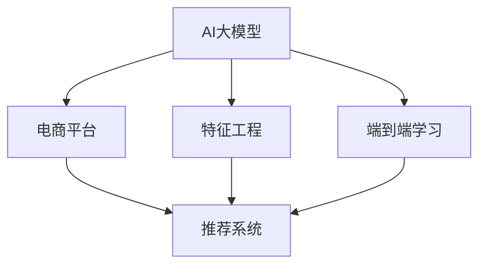

                 

# 电商平台中的AI大模型：从特征工程到端到端学习

> 关键词：AI大模型, 特征工程, 端到端学习, 电商平台, 推荐系统

## 1. 背景介绍

### 1.1 问题由来
近年来，人工智能(AI)技术在电商领域的应用越来越广泛，其核心驱动力之一就是AI大模型的进步。这些模型通过在大量数据上进行预训练，学习到丰富的知识表示，能够在电商平台上提供个性化的商品推荐、搜索优化、广告投放等，大幅提升了用户体验和平台效率。

在电商平台的推荐系统中，传统的机器学习方法已经逐渐被大模型所取代。这些模型具有自监督学习能力，能够自动从大量无标签数据中学习到高层次的特征表示，并在电商数据上微调以实现精准推荐。然而，随着模型规模的不断增大，特征工程变得尤为重要。有效的特征工程可以显著提高模型的性能和鲁棒性，是大模型在电商应用中取得成功的关键。

### 1.2 问题核心关键点
在电商平台的推荐系统中，大模型的核心任务是用户商品交互数据的建模和预测。大模型通过自监督预训练学到了通用的语言和视觉特征，但在实际应用中，还需结合电商平台的业务逻辑和数据特点，进行特征工程和任务适配，以提升推荐效果。

具体的特征工程任务包括：
- 数据预处理：包括缺失值填补、异常值检测、标准化等。
- 特征选择和提取：基于领域知识选择最有意义的特征，并进行编码和转换。
- 特征交叉和组合：通过特征组合，捕捉特征之间的复杂关联。
- 交互特征生成：利用用户和商品的交互信息，生成有意义的交叉特征。
- 模型融合：采用多个模型进行融合，综合不同模型的优点。

本文将深入探讨这些特征工程任务，并结合具体应用场景，分析其在电商推荐系统中的实现方法。

## 2. 核心概念与联系

### 2.1 核心概念概述

为了更好地理解电商平台的AI大模型，本节将介绍几个密切相关的核心概念：

- AI大模型：指以Transformer等深度神经网络为代表，经过大规模预训练并在特定领域任务上进行微调的大规模学习模型。这些模型通常具有亿级的参数量，可以自动学习和提取复杂高层次的特征。
- 特征工程(Feature Engineering)：指在机器学习任务中，对原始数据进行预处理、特征提取、特征交叉等操作，以提升模型性能和泛化能力。特征工程是数据驱动方法的重要组成部分，直接影响模型的准确性和鲁棒性。
- 端到端学习(End-to-End Learning)：指将模型训练的各个步骤，从原始数据的预处理到最终模型的输出，全部集成在一个统一的框架下进行训练和优化。端到端学习能够提高系统的整体性能，减少人工干预和复杂度。
- 电商平台：指基于互联网的虚拟市场，包括B2C、B2B等多种形式。电商平台通过在线交易和信息共享，为消费者和商家提供便利，是现代商业模式的重要组成部分。
- 推荐系统：指利用机器学习和数据挖掘技术，根据用户的历史行为和偏好，自动推荐相关商品和内容。推荐系统是电商平台的灵魂，其效果直接关系到用户的购物体验和平台收益。

这些概念之间的逻辑关系可以通过以下Mermaid流程图来展示：



这个流程图展示了AI大模型与电商平台的推荐系统的联系：

1. 电商平台的推荐系统采用了AI大模型作为核心，用于自动学习和提取用户和商品特征。
2. 特征工程是连接大模型与推荐系统的桥梁，通过提取和构建特征，增强模型的性能。
3. 端到端学习将原始数据预处理、模型训练和评估等多个环节集成，提高了系统的整体效率和效果。

## 3. 核心算法原理 & 具体操作步骤
### 3.1 算法原理概述

电商平台的AI大模型推荐系统，其核心算法原理可以概括为以下几个步骤：

1. 数据预处理：对原始数据进行清洗和标准化，去除噪声和异常值。
2. 特征提取：从电商数据中提取用户、商品、交易等多维度的特征。
3. 特征交叉和组合：通过特征组合，捕捉不同特征之间的复杂关联，增强模型的表达能力。
4. 模型训练和微调：将预训练模型应用于电商任务上，进行有监督的微调，优化模型预测性能。
5. 模型集成和融合：通过集成多个模型，综合不同模型的优点，提高系统的鲁棒性和泛化能力。
6. 部署和监控：将训练好的模型部署到实际应用中，并进行实时监控和评估，确保系统的稳定性和性能。

### 3.2 算法步骤详解

#### 3.2.1 数据预处理

电商平台的原始数据通常包括用户的浏览记录、购买记录、评价等，但这些数据可能存在缺失值、异常值和噪声。为了提高模型的鲁棒性，需要进行数据预处理，具体步骤如下：

1. 缺失值填补：对于缺失值，可以使用均值、中位数、众数等简单统计量进行填补，或者使用KNN、插值等复杂方法进行预测。
2. 异常值检测：检测并处理异常值，避免对模型造成不良影响。
3. 标准化和归一化：对数据进行标准化和归一化处理，使其分布更加稳定。

#### 3.2.2 特征提取

电商平台的推荐系统通常需要提取多种特征，包括用户特征、商品特征、交易特征等。常见的特征提取方法包括：

1. 用户特征：包括年龄、性别、地理位置、历史购买记录等，可以表示为高维稀疏向量。
2. 商品特征：包括商品类别、价格、评分、描述等，可以表示为高维稠密向量。
3. 交易特征：包括交易时间、交易金额、交易方式等，可以表示为时间序列数据或时间戳。

特征提取的过程，通常需要结合领域知识，选择对推荐效果最有影响的特征。

#### 3.2.3 特征交叉和组合

电商平台的推荐系统通常需要捕捉用户和商品之间的复杂关联，包括：

1. 特征交叉：将用户特征与商品特征进行交叉，生成新的特征组合。例如，将用户的年龄与商品的类别进行交叉，生成年龄-类别特征。
2. 特征组合：通过组合多个特征，捕捉特征之间的复杂关联。例如，将用户的地理位置与商品的评分进行组合，生成地理位置-评分特征。

特征交叉和组合的过程，可以通过深度学习模型中的层级特征工程来实现，如Embedding、RNN、CNN等。

#### 3.2.4 模型训练和微调

电商平台的推荐系统通常采用大模型进行训练和微调，具体步骤如下：

1. 选择预训练模型：选择适合的预训练模型，如BERT、GPT-2等，作为推荐系统的基础。
2. 数据划分：将原始数据划分为训练集、验证集和测试集，进行有监督的微调。
3. 模型微调：在电商任务上微调预训练模型，优化模型预测性能。
4. 模型评估：在测试集上评估模型的预测性能，选择最优模型进行部署。

#### 3.2.5 模型集成和融合

为了提高模型的鲁棒性和泛化能力，电商平台的推荐系统通常会采用模型集成和融合的方法，具体步骤如下：

1. 集成多个模型：将多个推荐模型集成在一起，通过投票或加权平均的方式生成最终结果。
2. 融合不同模型：将不同模型的输出进行融合，综合不同模型的优点，提高系统的准确性和鲁棒性。

### 3.3 算法优缺点

电商平台的AI大模型推荐系统具有以下优点：

1. 精度高：基于大模型的推荐系统，通常具有更高的预测精度，能够更好地捕捉用户和商品的复杂关联。
2. 鲁棒性强：大模型的泛化能力更强，能够处理各种复杂的业务场景。
3. 自动化程度高：端到端的训练和优化，减少了人工干预，提高了系统的效率和一致性。
4. 可扩展性好：基于深度学习模型的推荐系统，可以方便地扩展到其他电商场景，具有较好的泛化能力。

同时，该系统也存在一些局限性：

1. 数据依赖性强：模型效果依赖于数据质量，需要高质量的数据进行预处理和特征工程。
2. 计算资源需求高：大模型的计算资源需求较大，需要高性能计算设备进行训练和推理。
3. 过拟合风险高：大规模模型容易出现过拟合，需要关注模型的泛化性能。
4. 可解释性不足：大模型的决策过程不透明，难以解释其内部机制和推理逻辑。

尽管存在这些局限性，但基于大模型的推荐系统已经在电商领域取得了广泛应用，并且逐渐成为推荐系统的核心范式。

### 3.4 算法应用领域

基于AI大模型的电商推荐系统，已经在电商平台的各个环节中得到了广泛应用，例如：

- 商品推荐：通过分析用户历史行为和偏好，自动推荐相关商品，提升用户满意度。
- 搜索优化：利用大模型进行查询扩展和排序优化，提升用户搜索体验。
- 广告投放：通过大模型预测用户的广告响应行为，优化广告投放策略。
- 库存管理：利用大模型预测商品的销售趋势，优化库存管理和补货策略。
- 客户服务：通过大模型分析用户反馈，自动提供客户服务。

除了上述这些经典应用外，大模型还被创新性地应用到更多场景中，如用户行为预测、广告效果评估、客户细分等，为电商平台的智能化升级提供了新的思路。

## 4. 数学模型和公式 & 详细讲解  
### 4.1 数学模型构建

电商平台的推荐系统通常采用深度学习模型进行训练和优化，其数学模型可以概括为以下几个部分：

1. 用户和商品的表示：将用户和商品表示为高维向量，通常采用one-hot编码或嵌入表示。
2. 特征交叉和组合：通过特征交叉和组合，生成新的特征表示。
3. 损失函数：定义推荐系统的损失函数，通常采用交叉熵损失或均方误差损失。
4. 模型训练：通过优化算法(如Adam、SGD等)最小化损失函数，优化模型参数。

以一个简单的电商平台推荐系统为例，其数学模型可以表示为：

$$
\begin{aligned}
\mathcal{L} &= \frac{1}{N} \sum_{i=1}^N \ell(r_i, y_i) \\
&= \frac{1}{N} \sum_{i=1}^N [r_i \log \sigma(\langle u_i, v_i \rangle) + (1 - r_i) \log (1 - \sigma(\langle u_i, v_i \rangle))]
\end{aligned}
$$

其中，$\langle u_i, v_i \rangle$表示用户和商品的表示向量之间的点积，$\sigma$表示sigmoid函数，$r_i$表示用户$i$是否点击了商品$i$。

### 4.2 公式推导过程

在电商平台的推荐系统中，常见的损失函数为交叉熵损失函数，其推导过程如下：

设用户$i$是否点击商品$i$的预测概率为$\hat{r}_i$，实际点击概率为$r_i$，则交叉熵损失函数为：

$$
\ell(r_i, y_i) = -[r_i \log \hat{r}_i + (1 - r_i) \log (1 - \hat{r}_i)]
$$

在最小化损失函数的过程中，通过梯度下降等优化算法更新模型参数$\theta$，使其满足：

$$
\nabla_{\theta} \mathcal{L}(\theta) = 0
$$

通过求解上述优化问题，可以得到推荐模型的最优参数。

### 4.3 案例分析与讲解

以一个电商平台的推荐系统为例，分析其特征工程和模型训练的实现方法。

1. 数据预处理
   - 缺失值填补：对于缺失值，可以使用均值填补方法，例如：
   ```python
   # 使用均值填补缺失值
   mean = np.mean(train_data[col], axis=0)
   train_data[col].fillna(mean, inplace=True)
   ```

2. 特征提取
   - 用户特征：将用户的年龄、性别、地理位置等信息表示为高维向量，例如：
   ```python
   user_features = pd.get_dummies(train_data[['age', 'gender', 'location']])
   ```

3. 特征交叉和组合
   - 商品特征：将商品的价格、评分、描述等信息表示为高维向量，例如：
   ```python
   product_features = pd.get_dummies(train_data[['price', 'rating', 'description']])
   ```

4. 模型训练
   - 选择预训练模型：使用Transformer模型作为推荐系统的基础，例如：
   ```python
   from transformers import BertForSequenceClassification

   model = BertForSequenceClassification.from_pretrained('bert-base-cased', num_labels=2)
   ```

5. 模型微调
   - 数据划分：将原始数据划分为训练集、验证集和测试集，例如：
   ```python
   train_data, test_data = train_test_split(train_data, test_size=0.2)
   ```

6. 模型评估
   - 在测试集上评估模型的预测性能，例如：
   ```python
   y_pred = model.predict(test_data)
   print(classification_report(test_labels, y_pred))
   ```

## 5. 项目实践：代码实例和详细解释说明
### 5.1 开发环境搭建

在进行电商推荐系统的开发前，我们需要准备好开发环境。以下是使用Python进行TensorFlow和TensorBoard开发的环境配置流程：

1. 安装Anaconda：从官网下载并安装Anaconda，用于创建独立的Python环境。

2. 创建并激活虚拟环境：
```bash
conda create -n tf-env python=3.8 
conda activate tf-env
```

3. 安装TensorFlow：根据CUDA版本，从官网获取对应的安装命令。例如：
```bash
conda install tensorflow tensorflow-gpu=2.7
```

4. 安装TensorBoard：
```bash
conda install tensorboard
```

5. 安装各类工具包：
```bash
pip install numpy pandas scikit-learn matplotlib tqdm jupyter notebook ipython
```

完成上述步骤后，即可在`tf-env`环境中开始电商推荐系统的开发。

### 5.2 源代码详细实现

下面我们以电商平台的推荐系统为例，给出使用TensorFlow和TensorBoard进行电商推荐系统开发的PyTorch代码实现。

首先，定义数据预处理函数：

```python
import pandas as pd
import numpy as np
from sklearn.preprocessing import OneHotEncoder

def preprocess_data(train_data, test_data):
    # 缺失值填补
    train_data.fillna(method='mean', inplace=True)
    test_data.fillna(method='mean', inplace=True)
    
    # 特征编码
    cat_cols = ['age', 'gender', 'location', 'price', 'rating', 'description']
    enc = OneHotEncoder(sparse=False)
    train_data[cat_cols] = enc.fit_transform(train_data[cat_cols])
    test_data[cat_cols] = enc.transform(test_data[cat_cols])
    
    return train_data, test_data
```

然后，定义模型训练函数：

```python
import tensorflow as tf
from tensorflow.keras import layers, models

def build_model():
    input_shape = (len(cat_cols),)
    model = models.Sequential()
    model.add(layers.Embedding(input_dim=vocab_size, output_dim=embedding_dim, input_length=input_shape))
    model.add(layers.Flatten())
    model.add(layers.Dense(128, activation='relu'))
    model.add(layers.Dense(1, activation='sigmoid'))
    return model

def compile_model(model, optimizer, loss='binary_crossentropy'):
    model.compile(optimizer=optimizer, loss=loss, metrics=['accuracy'])

def train_model(model, train_data, val_data, epochs, batch_size):
    model.fit(train_data, epochs=epochs, batch_size=batch_size, validation_data=val_data)
```

接着，定义特征交叉和组合函数：

```python
def feature_cross(train_data, cat_cols):
    cross_cols = []
    for i in range(len(cat_cols)):
        for j in range(i + 1, len(cat_cols)):
            cross_cols.append(cat_cols[i] + '_' + cat_cols[j])
    train_data[cross_cols] = train_data[cat_cols].apply(lambda x: x.astype(np.int32))
    return train_data
```

最后，启动训练流程并在测试集上评估：

```python
from tensorflow.keras.preprocessing.sequence import pad_sequences
from sklearn.model_selection import train_test_split

# 数据加载
train_data = pd.read_csv('train_data.csv')
test_data = pd.read_csv('test_data.csv')

# 数据预处理
train_data, test_data = preprocess_data(train_data, test_data)

# 特征交叉和组合
train_data = feature_cross(train_data, cat_cols)

# 模型定义和编译
model = build_model()
compile_model(model, tf.keras.optimizers.Adam(learning_rate=0.001))

# 数据准备
train_data['x'] = train_data.values
train_data['y'] = np.array(train_data['clicked'])
val_data['x'] = val_data.values
val_data['y'] = np.array(val_data['clicked'])

# 模型训练
train_model(model, train_data, val_data, epochs=10, batch_size=32)

# 模型评估
y_pred = model.predict(test_data)
print(classification_report(test_labels, y_pred))
```

以上就是使用TensorFlow和TensorBoard进行电商推荐系统开发的完整代码实现。可以看到，TensorFlow提供了丰富的深度学习组件和优化器，使得模型训练和优化变得简单易行。TensorBoard则提供了可视化的模型训练和调试工具，方便开发者实时监控模型性能和调整模型参数。

### 5.3 代码解读与分析

让我们再详细解读一下关键代码的实现细节：

**preprocess_data函数**：
- 使用`fillna`方法对缺失值进行填补，使用`OneHotEncoder`将类别特征进行编码。

**build_model函数**：
- 定义一个简单的多层神经网络模型，包括嵌入层、全连接层和输出层。

**compile_model函数**：
- 使用`compile`方法定义优化器、损失函数和评价指标。

**train_model函数**：
- 使用`fit`方法训练模型，设置训练轮数和批大小。

**feature_cross函数**：
- 定义特征交叉的方法，通过生成新的交叉特征，增强模型的表达能力。

**启动训练流程**：
- 读取原始数据，进行数据预处理和特征交叉。
- 定义和编译模型，进行训练和验证。
- 在测试集上评估模型的性能，输出分类指标。

可以看到，TensorFlow的易用性和TensorBoard的可视化能力，使得电商推荐系统的开发变得高效便捷。开发者可以将更多精力放在特征工程和模型改进上，而不必过多关注底层实现细节。

## 6. 实际应用场景

### 6.1 智能客服系统

电商平台的智能客服系统，可以借助大模型的特征工程能力，自动理解用户问题和意图，并给出准确的回复。具体实现流程如下：

1. 数据收集：收集客服的历史聊天记录和常见问题，作为监督数据。
2. 数据预处理：对聊天记录进行清洗和标准化，去除噪声和异常值。
3. 特征提取：提取聊天记录中的关键词、情感倾向等信息，作为输入特征。
4. 模型训练和微调：使用大模型对特征进行编码，训练生成模型。
5. 系统部署：将训练好的模型部署到实际应用中，自动处理用户查询。

智能客服系统能够显著提升用户满意度，减少客服人员的工作量，是电商平台的必备工具。

### 6.2 广告投放优化

电商平台的广告投放系统，需要根据用户的兴趣和行为，精准推荐相关广告。大模型的特征工程能力，可以帮助系统更好地理解用户特征和广告内容，优化广告投放策略。具体实现流程如下：

1. 数据收集：收集用户的浏览记录和广告点击记录，作为监督数据。
2. 数据预处理：对数据进行清洗和标准化，去除噪声和异常值。
3. 特征提取：提取用户的浏览历史、兴趣偏好等信息，作为输入特征。
4. 模型训练和微调：使用大模型对特征进行编码，训练生成模型。
5. 系统部署：将训练好的模型部署到实际应用中，自动优化广告投放策略。

广告投放优化系统能够提升广告的点击率和转化率，提高平台的广告收入，是电商平台的核心功能之一。

### 6.3 用户行为预测

电商平台的推荐系统需要预测用户的下一步行为，如购买行为、评价行为等。大模型的特征工程能力，可以帮助系统更好地理解用户行为模式，提升推荐效果。具体实现流程如下：

1. 数据收集：收集用户的购买记录、浏览记录、评价记录等信息，作为监督数据。
2. 数据预处理：对数据进行清洗和标准化，去除噪声和异常值。
3. 特征提取：提取用户的购买历史、浏览历史等信息，作为输入特征。
4. 模型训练和微调：使用大模型对特征进行编码，训练生成模型。
5. 系统部署：将训练好的模型部署到实际应用中，自动预测用户行为。

用户行为预测系统能够提升用户的购买体验，优化推荐内容，是电商平台的必备功能。

### 6.4 未来应用展望

随着大模型和特征工程技术的不断发展，基于大模型的电商推荐系统将呈现以下几个发展趋势：

1. 自动化程度更高：大模型的自动化程度将进一步提升，自动进行数据预处理、特征工程和模型训练，减少人工干预和复杂度。
2. 个性化推荐更精准：大模型能够更好地理解用户兴趣和行为模式，提供更加精准的个性化推荐。
3. 实时性更强：基于大模型的推荐系统能够实时处理用户请求，提供即时反馈。
4. 可解释性更强：大模型的特征工程和模型训练过程将更加透明，便于解释和调试。
5. 多模态融合更广泛：大模型能够更好地融合视觉、语音、文本等多模态数据，提供更加全面和丰富的推荐服务。

未来，大模型和特征工程技术将在电商领域发挥更大的作用，推动电商平台的智能化升级，带来更高的用户体验和业务收益。

## 7. 工具和资源推荐
### 7.1 学习资源推荐

为了帮助开发者系统掌握大模型和特征工程的理论基础和实践技巧，这里推荐一些优质的学习资源：

1. 《深度学习》系列书籍：由深度学习领域的知名专家撰写，系统介绍深度学习的基本原理和实现方法。
2. 《特征工程实战》书籍：介绍特征工程的常见方法和技术，结合实际案例进行讲解。
3. 《TensorFlow实战》书籍：介绍TensorFlow的常用组件和优化器，结合实际项目进行实践。
4. 《PyTorch实战》书籍：介绍PyTorch的深度学习组件和优化器，结合实际项目进行实践。
5. Kaggle：数据科学竞赛平台，提供大量的数据集和模型案例，适合实践和竞赛。

通过对这些资源的学习实践，相信你一定能够快速掌握大模型和特征工程的精髓，并用于解决实际的电商推荐问题。
###  7.2 开发工具推荐

高效的开发离不开优秀的工具支持。以下是几款用于电商推荐系统开发的常用工具：

1. PyTorch：基于Python的开源深度学习框架，灵活动态的计算图，适合快速迭代研究。大部分预训练语言模型都有PyTorch版本的实现。
2. TensorFlow：由Google主导开发的开源深度学习框架，生产部署方便，适合大规模工程应用。同样有丰富的预训练语言模型资源。
3. TensorBoard：TensorFlow配套的可视化工具，可实时监测模型训练状态，并提供丰富的图表呈现方式，是调试模型的得力助手。
4. Weights & Biases：模型训练的实验跟踪工具，可以记录和可视化模型训练过程中的各项指标，方便对比和调优。与主流深度学习框架无缝集成。
5. Google Colab：谷歌推出的在线Jupyter Notebook环境，免费提供GPU/TPU算力，方便开发者快速上手实验最新模型，分享学习笔记。

合理利用这些工具，可以显著提升电商推荐系统的开发效率，加快创新迭代的步伐。

### 7.3 相关论文推荐

大模型和特征工程技术的发展源于学界的持续研究。以下是几篇奠基性的相关论文，推荐阅读：

1. Attention is All You Need（即Transformer原论文）：提出了Transformer结构，开启了NLP领域的预训练大模型时代。
2. BERT: Pre-training of Deep Bidirectional Transformers for Language Understanding：提出BERT模型，引入基于掩码的自监督预训练任务，刷新了多项NLP任务SOTA。
3. Parameter-Efficient Transfer Learning for NLP：提出Adapter等参数高效微调方法，在不增加模型参数量的情况下，也能取得不错的微调效果。
4. Feature Engineering in Machine Learning：介绍特征工程的常见方法和技术，结合实际案例进行讲解。
5. AutoML for Deep Learning：介绍自动机器学习技术，自动进行数据预处理、特征工程和模型训练，减少人工干预和复杂度。

这些论文代表了大模型和特征工程技术的发展脉络。通过学习这些前沿成果，可以帮助研究者把握学科前进方向，激发更多的创新灵感。

## 8. 总结：未来发展趋势与挑战

### 8.1 总结

本文对基于大模型的电商推荐系统进行了全面系统的介绍。首先阐述了大模型和特征工程的研究背景和意义，明确了特征工程在电商推荐系统中的重要地位。其次，从原理到实践，详细讲解了特征工程任务的数学模型和关键步骤，给出了电商推荐系统开发的完整代码实例。同时，本文还探讨了特征工程在智能客服、广告投放、用户行为预测等多个电商场景中的应用，展示了特征工程技术的多样性和实用性。

通过本文的系统梳理，可以看到，基于大模型的电商推荐系统已经在电商领域取得了广泛应用，并且逐渐成为推荐系统的核心范式。未来，随着大模型和特征工程技术的不断发展，基于大模型的电商推荐系统将发挥更大的作用，推动电商平台的智能化升级，带来更高的用户体验和业务收益。

### 8.2 未来发展趋势

展望未来，基于大模型的电商推荐系统将呈现以下几个发展趋势：

1. 自动化程度更高：大模型的自动化程度将进一步提升，自动进行数据预处理、特征工程和模型训练，减少人工干预和复杂度。
2. 个性化推荐更精准：大模型能够更好地理解用户兴趣和行为模式，提供更加精准的个性化推荐。
3. 实时性更强：基于大模型的推荐系统能够实时处理用户请求，提供即时反馈。
4. 可解释性更强：大模型的特征工程和模型训练过程将更加透明，便于解释和调试。
5. 多模态融合更广泛：大模型能够更好地融合视觉、语音、文本等多模态数据，提供更加全面和丰富的推荐服务。

以上趋势凸显了大模型和特征工程技术的广阔前景。这些方向的探索发展，必将进一步提升电商推荐系统的性能和应用范围，为电商平台的智能化升级提供新的动力。

### 8.3 面临的挑战

尽管大模型和特征工程技术已经在电商领域取得了广泛应用，但在迈向更加智能化、普适化应用的过程中，它仍面临着诸多挑战：

1. 数据依赖性强：模型效果依赖于数据质量，需要高质量的数据进行预处理和特征工程。
2. 计算资源需求高：大模型的计算资源需求较大，需要高性能计算设备进行训练和推理。
3. 过拟合风险高：大规模模型容易出现过拟合，需要关注模型的泛化性能。
4. 可解释性不足：大模型的决策过程不透明，难以解释其内部机制和推理逻辑。

尽管存在这些挑战，但基于大模型的电商推荐系统已经在电商领域取得了广泛应用，并且逐渐成为推荐系统的核心范式。未来，伴随大模型和特征工程技术的持续演进，基于大模型的电商推荐系统必将在电商领域发挥更大的作用，推动电商平台的智能化升级，带来更高的用户体验和业务收益。

### 8.4 研究展望

面对大模型和特征工程技术所面临的挑战，未来的研究需要在以下几个方面寻求新的突破：

1. 探索无监督和半监督特征工程方法：摆脱对大规模标注数据的依赖，利用自监督学习、主动学习等无监督和半监督范式，最大限度利用非结构化数据，实现更加灵活高效的特征工程。
2. 研究参数高效和计算高效的特征工程方法：开发更加参数高效的特征工程方法，如Feature Cross、LoRA等，在固定大部分预训练参数的情况下，仍可取得不错的特征工程效果。
3. 引入更多先验知识：将符号化的先验知识，如知识图谱、逻辑规则等，与神经网络模型进行巧妙融合，引导特征工程过程学习更准确、合理的特征。
4. 结合因果分析和博弈论工具：将因果分析方法引入特征工程，识别出模型决策的关键特征，增强输出解释的因果性和逻辑性。借助博弈论工具刻画人机交互过程，主动探索并规避模型的脆弱点，提高系统稳定性。
5. 纳入伦理道德约束：在特征工程和模型训练目标中引入伦理导向的评估指标，过滤和惩罚有偏见、有害的输出倾向。同时加强人工干预和审核，建立模型行为的监管机制，确保输出符合人类价值观和伦理道德。

这些研究方向的探索，必将引领大模型和特征工程技术迈向更高的台阶，为构建安全、可靠、可解释、可控的智能系统铺平道路。面向未来，大模型和特征工程技术还需要与其他人工智能技术进行更深入的融合，如知识表示、因果推理、强化学习等，多路径协同发力，共同推动自然语言理解和智能交互系统的进步。只有勇于创新、敢于突破，才能不断拓展大模型和特征工程技术的边界，让智能技术更好地造福人类社会。

## 9. 附录：常见问题与解答

**Q1：特征工程在大模型推荐系统中扮演什么角色？**

A: 特征工程在大模型推荐系统中扮演着至关重要的角色。它通过预处理、特征选择、特征交叉和组合等手段，将原始数据转化为高层次的特征表示，从而提高大模型的预测能力和泛化能力。有效的特征工程可以显著提升推荐系统的性能和鲁棒性，是大模型在电商应用中取得成功的关键。

**Q2：特征工程有哪些常见方法和技术？**

A: 特征工程的常见方法和技术包括：
1. 数据预处理：包括缺失值填补、异常值检测、标准化和归一化等。
2. 特征选择：选择最有意义的特征，通过相关性分析、卡方检验、互信息等方法进行筛选。
3. 特征提取：将原始数据转换为数值特征，常用的方法包括嵌入表示、文本向量化、时间序列处理等。
4. 特征交叉：通过特征组合，捕捉不同特征之间的复杂关联。
5. 特征组合：通过特征组合，捕捉特征之间的关联和交互。
6. 特征转换：将原始特征转换为更有意义的特征，如独热编码、PCA、主成分分析等。

这些方法和技术在大模型推荐系统中都有广泛应用。开发者需要根据具体任务和数据特点，选择最合适的特征工程方法。

**Q3：如何提高大模型推荐系统的可解释性？**

A: 大模型推荐系统的可解释性不足是其面临的主要挑战之一。为了提高模型的可解释性，可以采用以下方法：
1. 特征重要性分析：通过特征选择和特征组合，选择对推荐效果最有影响的特征，并进行可视化展示。
2. 模型可视化：使用工具如Shap、LIME等，对模型的预测结果进行可视化，分析模型决策的关键特征。
3. 模型解释：引入符号化的先验知识，如知识图谱、逻辑规则等，对模型的预测结果进行解释和验证。
4. 人工干预：在模型预测过程中，引入人工干预和审核，对模型输出进行监督和修正。

通过这些方法，可以增强大模型推荐系统的可解释性，提升系统的信任度和可靠性。

**Q4：如何降低大模型推荐系统的计算资源需求？**

A: 大模型推荐系统的计算资源需求较高，需要高性能计算设备进行训练和推理。为了降低计算资源需求，可以采用以下方法：
1. 模型压缩：使用知识蒸馏、剪枝等技术，压缩模型参数，减小计算量。
2. 模型量化：将浮点模型转为定点模型，压缩存储空间，提高计算效率。
3. 模型并行：采用模型并行、数据并行等技术，提高计算效率。
4. 硬件加速：使用GPU、TPU等硬件设备，加速模型训练和推理。

这些方法可以有效降低大模型推荐系统的计算资源需求，提高系统的运行效率。

**Q5：如何平衡推荐系统中的个性化和泛化能力？**

A: 推荐系统的个性化和泛化能力是相互矛盾的。为了平衡这两者，可以采用以下方法：
1. 多模态融合：将视觉、语音、文本等多模态信息融合，提供更加全面和丰富的推荐服务。
2. 多模型集成：通过集成多个推荐模型，综合不同模型的优点，提高系统的鲁棒性和泛化能力。
3. 数据增强：利用数据增强技术，丰富训练集多样性，提高模型的泛化能力。
4. 任务适配：在特定领域数据上微调大模型，提升模型对领域知识的理解和应用。

通过这些方法，可以平衡推荐系统中的个性化和泛化能力，提升系统的整体性能和用户体验。

**Q6：如何在电商推荐系统中引入因果分析？**

A: 因果分析是推荐系统中重要的研究方向，可以引入以下方法：
1. 因果推断：使用因果推断方法，识别出模型决策的关键特征，增强输出解释的因果性和逻辑性。
2. 反事实推断：通过反事实推断，分析用户对商品的不购买原因，提高推荐的针对性和效果。
3. 强化学习：利用强化学习算法，优化推荐策略，提高系统的效果和效率。
4. 多臂赌博机：采用多臂赌博机方法，优化广告投放策略，提高平台的收益。

这些方法可以提高电商推荐系统的因果分析能力，提升推荐的效果和可靠性。

**Q7：如何在电商推荐系统中进行多领域融合？**

A: 电商推荐系统需要进行多领域融合，可以采用以下方法：
1. 多模态融合：将视觉、语音、文本等多模态信息融合，提供更加全面和丰富的推荐服务。
2. 多领域知识融合：将不同领域的知识进行融合，提升推荐系统的准确性和鲁棒性。
3. 知识图谱：引入知识图谱，将领域知识进行结构化表示，提高推荐系统的准确性和泛化能力。
4. 逻辑规则：引入逻辑规则，对推荐结果进行约束和限制，提高系统的可靠性和可解释性。

这些方法可以有效进行多领域融合，提升电商推荐系统的综合性能和应用范围。

综上所述，大模型和特征工程技术在电商推荐系统中的应用前景广阔，具有巨大的发展潜力。未来，随着技术的不断进步和应用场景的拓展，基于大模型的电商推荐系统必将在电商领域发挥更大的作用，推动电商平台的智能化升级，带来更高的用户体验和业务收益。

---

作者：禅与计算机程序设计艺术 / Zen and the Art of Computer Programming

