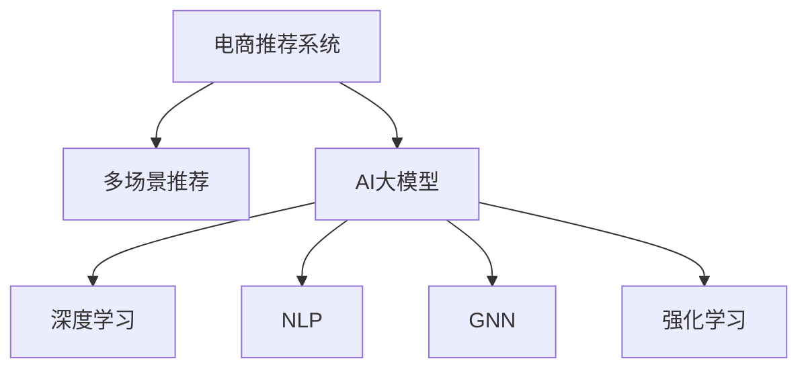

                 

# 电商平台中的多场景推荐：AI大模型的优势

> 关键词：电商推荐, 多场景推荐, AI大模型, 深度学习, 自然语言处理(NLP), 计算图神经网络(GNN), 强化学习

## 1. 背景介绍

### 1.1 问题由来
近年来，随着电子商务的迅猛发展，电商平台已经成为了人们生活中不可或缺的一部分。电商平台不仅提供了海量的商品信息，还通过推荐系统为消费者提供了个性化的购物体验。推荐系统的目标是帮助用户快速找到他们需要的商品，提高交易转化率，增加用户黏性，促进平台销售。

传统推荐系统主要依赖于统计方法，如协同过滤、基于内容的推荐等。这些方法在一定程度上解决了用户的个性化需求，但仍存在许多局限性：

- 数据稀疏性问题：用户的浏览和购买行为数据往往稀疏且不完整，难以构建准确的模型。
- 静态特征表示：基于统计的方法只能处理静态的特征，难以捕捉用户和商品的动态变化。
- 冷启动问题：新用户或新商品的推荐效果较差，缺乏足够的历史数据。

为了克服这些问题，人工智能(AI)大模型被引入电商推荐系统中。利用AI大模型，可以通过深度学习、自然语言处理(NLP)、计算图神经网络(GNN)等技术，动态捕捉用户和商品的行为特征，实时生成个性化的推荐结果。

### 1.2 问题核心关键点
AI大模型在电商推荐系统中的应用，主要基于以下几个关键点：

- **多模态数据融合**：电商平台上的数据不仅包括文本信息，还包括图片、视频、位置等多种形式的数据。AI大模型能够处理多种模态的数据，通过多模态融合提升推荐精度。
- **深度学习和迁移学习**：利用深度学习模型进行特征提取和模式识别，并通过迁移学习将预训练的通用知识应用于电商推荐。
- **个性化推荐**：通过模型学习用户的历史行为和兴趣，生成个性化的商品推荐，满足用户的个性化需求。
- **实时性**：AI大模型可以实时处理和分析用户数据，快速响应用户需求，提高推荐系统的响应速度。
- **可解释性**：AI大模型能够生成可解释的推荐理由，增加用户对推荐结果的信任度。

这些核心关键点使得AI大模型在电商推荐系统中具有显著的优势，能够提供更为精准、个性化的推荐结果，提升用户的购物体验和平台的销售业绩。

## 2. 核心概念与联系

### 2.1 核心概念概述

为了更好地理解AI大模型在电商推荐系统中的应用，本节将介绍几个密切相关的核心概念：

- **电商推荐系统**：通过分析用户的历史行为和兴趣，生成个性化的商品推荐，提升用户体验和平台销售额的系统。
- **多场景推荐**：基于用户的不同场景（如浏览、搜索、购买等），生成多维度的个性化推荐，满足用户在不同情境下的需求。
- **AI大模型**：以深度学习为代表的AI模型，具备强大的特征提取和模式识别能力，通过预训练和微调，应用于电商推荐等任务。
- **深度学习**：一类基于神经网络的机器学习技术，能够处理高维、非线性的数据，适合电商推荐系统的复杂场景。
- **自然语言处理(NLP)**：处理和理解人类语言的技术，适用于电商平台中用户评论、商品描述等文本数据的处理和分析。
- **计算图神经网络(GNN)**：一类结合图结构和神经网络的模型，适用于电商推荐中用户行为和商品关系的网络结构分析。
- **强化学习**：一种通过与环境交互进行优化决策的机器学习方法，适合电商推荐中用户行为预测和推荐策略优化。

这些核心概念之间的逻辑关系可以通过以下Mermaid流程图来展示：



这个流程图展示了大模型在电商推荐中的应用框架：

1. 电商推荐系统通过多场景推荐生成个性化商品推荐。
2. AI大模型包括深度学习、NLP、GNN和强化学习等多个模块，通过多模态融合和迁移学习等技术，动态捕捉用户和商品的行为特征。
3. 深度学习模型提取商品和用户的静态特征，捕捉其长期行为规律。
4. NLP模型处理用户评论、商品描述等文本数据，抽取文本特征。
5. GNN模型分析用户行为和商品关系网络，捕捉用户和商品的动态变化。
6. 强化学习模型通过与环境的交互，优化推荐策略，提升推荐效果。

## 3. 核心算法原理 & 具体操作步骤
### 3.1 算法原理概述

AI大模型在电商推荐系统中的应用，主要基于以下算法原理：

- **多模态融合**：将文本、图片、视频等不同模态的数据进行融合，通过深度学习模型提取特征，生成融合后的推荐结果。
- **迁移学习**：利用预训练大模型在通用领域学习到的知识，通过微调应用于电商推荐系统，减少从头训练的计算资源和时间成本。
- **深度学习**：通过多层神经网络结构提取高维特征，捕捉商品和用户的复杂关系。
- **NLP**：通过语言模型、文本分类、情感分析等技术，处理和理解电商平台上用户评论、商品描述等文本数据。
- **GNN**：通过图模型和神经网络结合的方式，分析用户行为和商品关系网络，捕捉用户和商品的动态变化。
- **强化学习**：通过模拟用户行为，优化推荐策略，提升推荐效果。

这些算法原理使得AI大模型在电商推荐系统中的应用具备了更强的特征提取和模式识别能力，能够处理复杂的推荐场景，生成高精度的推荐结果。

### 3.2 算法步骤详解

AI大模型在电商推荐系统中的应用，一般包括以下几个关键步骤：

**Step 1: 数据收集与预处理**
- 收集电商平台上用户的浏览、购买、评价等行为数据，以及商品的图片、描述、分类等信息。
- 对数据进行清洗、归一化、缺失值处理等预处理操作。
- 将不同模态的数据进行统一表示，如将文本数据转换为向量表示。

**Step 2: 特征提取与表示学习**
- 利用深度学习模型（如卷积神经网络CNN、循环神经网络RNN、Transformer等）对不同模态的数据进行特征提取。
- 将提取的特征进行融合，生成多模态的表示向量。
- 利用NLP技术处理文本数据，提取文本特征，如TF-IDF、Word2Vec等。
- 利用GNN技术分析用户行为和商品关系网络，生成图表示向量。

**Step 3: 模型训练与微调**
- 使用收集的数据集进行模型训练，调整模型的超参数，如学习率、批大小等。
- 在训练过程中，利用迁移学习技术将预训练大模型应用于电商推荐，减少计算资源和时间成本。
- 利用强化学习技术进行推荐策略优化，提升推荐效果。

**Step 4: 推荐结果生成与评估**
- 将训练好的模型应用于电商推荐系统中，实时生成个性化的推荐结果。
- 利用A/B测试等方法评估推荐结果的性能，如点击率、转化率等指标。
- 根据评估结果，进一步优化模型和算法，提升推荐效果。

### 3.3 算法优缺点

AI大模型在电商推荐系统中的应用，具有以下优点：

- **精度高**：通过深度学习模型和GNN技术，能够捕捉用户和商品的复杂关系，生成高精度的推荐结果。
- **可扩展性强**：利用迁移学习技术，可以减少从头训练的计算资源和时间成本，加速模型训练。
- **动态适应能力强**：通过NLP和强化学习技术，能够实时处理和分析用户数据，动态调整推荐策略。
- **多模态融合**：能够处理多种模态的数据，通过多模态融合提升推荐精度。

同时，该方法也存在一些缺点：

- **计算资源需求高**：大规模的深度学习模型和GNN模型需要大量的计算资源，对硬件设备要求较高。
- **模型复杂度高**：深度学习模型和GNN模型结构复杂，需要更多的工程实践经验进行优化和调试。
- **过拟合风险高**：模型在训练过程中容易出现过拟合，需要引入正则化技术进行缓解。
- **可解释性差**：深度学习模型通常被认为是“黑盒”模型，难以解释推荐结果的生成逻辑。
- **实时性要求高**：电商推荐系统需要实时生成推荐结果，对模型的响应速度要求较高。

尽管存在这些缺点，但就目前而言，AI大模型在电商推荐系统中的应用仍然具有显著优势，能够提供更为精准、个性化的推荐结果，提升用户的购物体验和平台的销售业绩。

### 3.4 算法应用领域

AI大模型在电商推荐系统中的应用，已经在多个领域得到了广泛的应用：

- **商品推荐**：基于用户的历史行为和兴趣，生成个性化的商品推荐。
- **广告推荐**：根据用户的浏览和购买行为，生成个性化的广告推荐，提升广告点击率和转化率。
- **搜索推荐**：在用户输入搜索关键词时，生成相关的商品推荐，提升用户搜索体验。
- **活动推荐**：根据用户的兴趣和行为，推荐特定的促销活动，增加用户参与度。
- **用户行为预测**：利用强化学习技术，预测用户未来的行为，优化推荐策略。

此外，AI大模型还被应用于智能客服、个性化广告、社交推荐等电商相关的场景中，为电商平台带来了更加智能化、个性化的用户体验。

## 4. 数学模型和公式 & 详细讲解 & 举例说明
### 4.1 数学模型构建

在电商推荐系统中，AI大模型的应用通常涉及多个领域的技术，如深度学习、NLP、GNN和强化学习。下面分别介绍这些技术对应的数学模型：

**深度学习模型**：
- 假设输入数据为 $x$，模型参数为 $\theta$，输出为 $y$。
- 通过多层神经网络结构，生成推荐结果 $y=f(x;\theta)$，其中 $f$ 为模型函数。
- 假设损失函数为 $\mathcal{L}$，则优化目标为 $\min_{\theta} \mathcal{L}(y, \hat{y})$，其中 $\hat{y}$ 为预测结果。

**NLP模型**：
- 假设输入文本为 $t$，模型参数为 $\phi$，输出为 $z$。
- 通过语言模型或文本分类模型，生成文本特征 $z=h(t;\phi)$，其中 $h$ 为模型函数。
- 假设损失函数为 $\mathcal{L}_{\text{text}}$，则优化目标为 $\min_{\phi} \mathcal{L}_{\text{text}}(z, \hat{z})$，其中 $\hat{z}$ 为预测结果。

**GNN模型**：
- 假设用户行为图为 $\mathcal{G}$，商品关系图为 $\mathcal{H}$，模型参数为 $\psi$。
- 通过图模型和神经网络结合的方式，生成图表示向量 $z=g(\mathcal{G}, \mathcal{H};\psi)$，其中 $g$ 为模型函数。
- 假设损失函数为 $\mathcal{L}_{\text{graph}}$，则优化目标为 $\min_{\psi} \mathcal{L}_{\text{graph}}(z, \hat{z})$，其中 $\hat{z}$ 为预测结果。

**强化学习模型**：
- 假设用户行为序列为 $(a_1, a_2, ..., a_T)$，推荐策略为 $\pi$，奖励函数为 $r$。
- 通过模拟用户行为，生成推荐策略 $\pi = \max_{\pi} \mathbb{E}[\sum_{t=1}^T r(a_t)]$，其中 $a_t$ 为用户行为，$r$ 为奖励函数。
- 假设优化目标为 $\max_{\pi} \mathbb{E}[\sum_{t=1}^T r(a_t)]$。

### 4.2 公式推导过程

以商品推荐为例，下面将介绍深度学习模型的公式推导过程：

假设输入为 $x=[x_1, x_2, ..., x_n]$，其中 $x_i$ 为特征向量，模型参数为 $\theta$。输出为 $y=[y_1, y_2, ..., y_m]$，其中 $y_i$ 为商品推荐的概率。

则模型的输出为：
$$
y=f(x;\theta)=\sigma(Wx+b)
$$
其中 $\sigma$ 为激活函数，$W$ 为权重矩阵，$b$ 为偏置向量。

模型的损失函数为交叉熵损失：
$$
\mathcal{L}(y,\hat{y})=-\frac{1}{N}\sum_{i=1}^N \sum_{j=1}^m y_{ij}\log \hat{y}_{ij}
$$
其中 $N$ 为样本数量，$\hat{y}_{ij}$ 为预测结果。

通过反向传播算法计算梯度，更新模型参数：
$$
\theta \leftarrow \theta - \eta \nabla_{\theta}\mathcal{L}(y,\hat{y}) - \eta\lambda\theta
$$
其中 $\eta$ 为学习率，$\lambda$ 为正则化系数。

### 4.3 案例分析与讲解

以亚马逊的推荐系统为例，亚马逊利用深度学习模型对用户和商品的特征进行提取和融合，生成个性化的推荐结果。具体过程如下：

**数据收集与预处理**：
- 收集用户的历史浏览、购买、评价等行为数据。
- 对数据进行清洗、归一化、缺失值处理等预处理操作。

**特征提取与表示学习**：
- 利用深度学习模型（如卷积神经网络CNN、循环神经网络RNN、Transformer等）对用户行为和商品特征进行提取。
- 利用NLP技术处理用户评论、商品描述等文本数据，提取文本特征。
- 利用GNN技术分析用户行为和商品关系网络，生成图表示向量。

**模型训练与微调**：
- 使用收集的数据集进行模型训练，调整模型的超参数。
- 在训练过程中，利用迁移学习技术将预训练大模型应用于电商推荐，减少计算资源和时间成本。

**推荐结果生成与评估**：
- 将训练好的模型应用于电商推荐系统中，实时生成个性化的推荐结果。
- 利用A/B测试等方法评估推荐结果的性能，如点击率、转化率等指标。
- 根据评估结果，进一步优化模型和算法，提升推荐效果。

## 5. 项目实践：代码实例和详细解释说明
### 5.1 开发环境搭建

在进行电商推荐系统开发前，我们需要准备好开发环境。以下是使用Python进行TensorFlow开发的环境配置流程：

1. 安装Anaconda：从官网下载并安装Anaconda，用于创建独立的Python环境。

2. 创建并激活虚拟环境：
```bash
conda create -n tf-env python=3.8 
conda activate tf-env
```

3. 安装TensorFlow：从官网获取对应的安装命令。例如：
```bash
conda install tensorflow
```

4. 安装TensorFlow Addons：用于支持更多功能，如深度学习、NLP等。
```bash
pip install tensorflow-addons
```

5. 安装TensorBoard：用于可视化模型训练和推理过程中的指标变化。
```bash
pip install tensorboard
```

6. 安装TensorFlow Text：用于处理文本数据。
```bash
pip install tensorflow-text
```

完成上述步骤后，即可在`tf-env`环境中开始电商推荐系统开发。

### 5.2 源代码详细实现

这里我们以电商商品推荐系统为例，给出使用TensorFlow对深度学习模型进行开发的代码实现。

首先，定义数据处理函数：

```python
import tensorflow as tf
import tensorflow_addons as tfa

def preprocess_data(data):
    # 将文本数据转换为数字序列
    tokenizer = tfa.layers.TextEmbedding(max_tokens=10000)
    encoded = tokenizer(data)
    return tf.reshape(encoded, (encoded.shape[0], -1))

# 定义用户行为数据和商品特征数据的读取函数
def read_data():
    # 读取用户行为数据
    user_data = tf.io.read_file('user_data.txt')
    user_data = tf.io.decode_csv(user_data, record_defaults=[tf.zeros(1, tf.int64)])
    user_data = preprocess_data(user_data)

    # 读取商品特征数据
    item_data = tf.io.read_file('item_data.txt')
    item_data = tf.io.decode_csv(item_data, record_defaults=[tf.zeros(1, tf.int64)])
    item_data = preprocess_data(item_data)

    return user_data, item_data
```

然后，定义模型：

```python
from tensorflow.keras.layers import Dense, Embedding, LSTM, Dropout

# 定义深度学习模型
model = tf.keras.Sequential([
    Embedding(input_dim=10000, output_dim=128, input_length=100),
    LSTM(64),
    Dropout(0.5),
    Dense(64, activation='relu'),
    Dense(1, activation='sigmoid')
])

# 编译模型
model.compile(optimizer='adam', loss='binary_crossentropy', metrics=['accuracy'])
```

接着，定义训练函数：

```python
# 定义训练函数
def train_model(model, train_data, validation_data, epochs):
    model.fit(train_data, validation_data, epochs=epochs, batch_size=32, callbacks=[tf.keras.callbacks.EarlyStopping(patience=3)])
    return model
```

最后，启动训练流程：

```python
# 读取训练数据和验证数据
train_data, validation_data = read_data()

# 训练模型
epochs = 10
model = train_model(model, train_data, validation_data, epochs)

# 保存模型
model.save('recommendation_model.h5')
```

以上代码实现了基于深度学习模型对用户行为数据和商品特征数据的处理和模型训练，生成个性化的推荐结果。

### 5.3 代码解读与分析

让我们再详细解读一下关键代码的实现细节：

**preprocess_data函数**：
- 将文本数据转换为数字序列，通过`tfa.layers.TextEmbedding`将文本转换为嵌入向量。
- 将嵌入向量进行扁平化操作，以适应模型输入。

**read_data函数**：
- 读取用户行为数据和商品特征数据。
- 将文本数据转换为数字序列，通过`preprocess_data`函数进行处理。
- 返回处理后的用户行为数据和商品特征数据。

**模型定义**：
- 使用`tf.keras.Sequential`定义深度学习模型结构，包括嵌入层、LSTM层、Dropout层和全连接层。
- 设置模型的优化器、损失函数和评估指标。

**训练函数**：
- 使用`model.fit`进行模型训练，设置训练轮数、批大小和EarlyStopping回调。
- 返回训练好的模型。

**训练流程**：
- 读取训练数据和验证数据。
- 设置训练轮数，调用训练函数进行模型训练。
- 保存训练好的模型。

可以看到，TensorFlow提供了丰富的API和工具，可以方便地进行电商推荐系统的开发。开发者可以将更多精力放在数据处理、模型设计和调参等高层逻辑上，而不必过多关注底层的实现细节。

当然，工业级的系统实现还需考虑更多因素，如模型的保存和部署、超参数的自动搜索、更灵活的任务适配层等。但核心的模型训练流程基本与此类似。

## 6. 实际应用场景
### 6.1 智能客服系统

基于AI大模型的电商推荐技术，可以广泛应用于智能客服系统的构建。传统客服往往需要配备大量人力，高峰期响应缓慢，且一致性和专业性难以保证。而使用推荐系统生成的智能推荐，可以7x24小时不间断服务，快速响应客户咨询，用个性化推荐满足客户需求。

在技术实现上，可以收集企业内部的历史客服对话记录，将问题和最佳答复构建成监督数据，在此基础上对预训练推荐模型进行微调。微调后的推荐模型能够自动理解用户意图，匹配最合适的答案模板进行推荐。对于客户提出的新问题，还可以接入检索系统实时搜索相关内容，动态组织生成推荐。如此构建的智能客服系统，能大幅提升客户咨询体验和问题解决效率。

### 6.2 个性化广告推荐

基于AI大模型的电商推荐技术，可以为广告推荐系统提供更加精准的推荐结果。传统的广告推荐系统依赖于用户的浏览和点击数据，难以捕捉用户的兴趣和行为变化。而利用推荐系统生成的个性化推荐，能够实时捕捉用户的行为变化，生成更具针对性的广告内容，提升广告点击率和转化率。

在技术实现上，可以收集用户的浏览、点击、评价等行为数据，以及广告的展示和点击数据。将用户行为和广告特征数据作为输入，推荐模型能够生成个性化的广告推荐，增加用户点击和转化概率。同时，可以结合用户兴趣变化，动态调整广告推荐策略，提升广告效果。

### 6.3 搜索推荐

基于AI大模型的电商推荐技术，能够显著提升搜索推荐系统的精度和覆盖范围。传统的搜索推荐系统依赖于用户的关键词输入，难以捕捉用户的潜在需求和兴趣变化。而利用推荐系统生成的个性化推荐，能够实时捕捉用户的行为变化，生成更具针对性的搜索结果，提升用户搜索体验。

在技术实现上，可以收集用户的浏览、点击、评价等行为数据，以及商品特征数据。将用户行为和商品特征数据作为输入，推荐模型能够生成个性化的搜索结果，增加用户点击和购买概率。同时，可以结合用户兴趣变化，动态调整搜索推荐策略，提升搜索效果。

### 6.4 用户行为预测

基于AI大模型的电商推荐技术，能够实现用户行为预测，为电商推荐系统提供更精准的推荐策略。传统的推荐系统依赖于用户的当前行为，难以预测用户未来的行为变化。而利用推荐系统生成的个性化推荐，能够实时预测用户的行为变化，动态调整推荐策略，提升推荐效果。

在技术实现上，可以收集用户的历史行为数据，利用强化学习技术进行行为预测。预测出用户可能感兴趣的商品或活动，生成个性化的推荐结果，增加用户点击和购买概率。同时，可以结合用户兴趣变化，动态调整推荐策略，提升推荐效果。

## 7. 工具和资源推荐
### 7.1 学习资源推荐

为了帮助开发者系统掌握AI大模型在电商推荐系统中的应用，这里推荐一些优质的学习资源：

1. 《深度学习入门》系列书籍：介绍深度学习的基础理论和实践技巧，适合初学者入门。
2. 《自然语言处理》系列课程：斯坦福大学、MIT等名校开设的NLP课程，涵盖自然语言处理的基本概念和经典模型。
3. 《TensorFlow实战》系列书籍：介绍TensorFlow的使用方法和实战技巧，适合TensorFlow开发者学习。
4. 《TensorFlow Text实战》书籍：介绍TensorFlow Text的使用方法和实战技巧，适合处理文本数据的学习。
5. 《强化学习入门》系列书籍：介绍强化学习的基础理论和实践技巧，适合初学者入门。

通过对这些资源的学习实践，相信你一定能够快速掌握AI大模型在电商推荐中的应用，并用于解决实际的电商推荐问题。

### 7.2 开发工具推荐

高效的开发离不开优秀的工具支持。以下是几款用于AI大模型电商推荐系统开发的常用工具：

1. TensorFlow：基于Python的开源深度学习框架，适合电商推荐系统的复杂场景。
2. PyTorch：基于Python的开源深度学习框架，灵活的计算图，适合电商推荐系统的快速迭代研究。
3. TensorBoard：TensorFlow配套的可视化工具，实时监测模型训练和推理过程中的指标变化。
4. Weights & Biases：模型训练的实验跟踪工具，记录和可视化模型训练过程中的各项指标。
5. Jupyter Notebook：交互式编程环境，方便开发者进行代码调试和实验验证。

合理利用这些工具，可以显著提升AI大模型电商推荐系统的开发效率，加快创新迭代的步伐。

### 7.3 相关论文推荐

AI大模型在电商推荐系统中的应用，源于学界的持续研究。以下是几篇奠基性的相关论文，推荐阅读：

1. Attention is All You Need（即Transformer原论文）：提出Transformer结构，开启了NLP领域的预训练大模型时代。
2. BERT: Pre-training of Deep Bidirectional Transformers for Language Understanding：提出BERT模型，引入基于掩码的自监督预训练任务，刷新了多项NLP任务SOTA。
3. Deep Learning for Recommender Systems：介绍深度学习在推荐系统中的应用，涵盖协同过滤、基于内容的推荐等方法。
4. GNN in Recommendation Systems：介绍GNN在推荐系统中的应用，如K-GNN、图卷积网络(GCN)等。
5. AutoRegressive Models in Recommendation Systems：介绍自动回归模型在推荐系统中的应用，如GPT系列模型。

这些论文代表了大模型在电商推荐中的应用发展脉络。通过学习这些前沿成果，可以帮助研究者把握学科前进方向，激发更多的创新灵感。

## 8. 总结：未来发展趋势与挑战

### 8.1 总结

本文对AI大模型在电商推荐系统中的应用进行了全面系统的介绍。首先阐述了电商推荐系统的背景和意义，明确了AI大模型在电商推荐系统中的优势。其次，从原理到实践，详细讲解了电商推荐系统中的深度学习、NLP、GNN和强化学习等核心技术，以及它们的数学原理和具体实现。最后，我们介绍了AI大模型在电商推荐系统中的多个实际应用场景，展示了其强大的应用潜力。

通过本文的系统梳理，可以看到，AI大模型在电商推荐系统中的应用具备了更强的特征提取和模式识别能力，能够处理复杂的推荐场景，生成高精度的推荐结果。未来，随着技术的不断进步和数据的不断积累，AI大模型在电商推荐系统中的应用将会更加广泛，为电商推荐系统带来更多的创新和突破。

### 8.2 未来发展趋势

展望未来，AI大模型在电商推荐系统中的应用将呈现以下几个发展趋势：

1. **多模态融合**：随着电商平台中数据的多样化，多模态融合技术将得到更加广泛的应用，通过处理图像、视频等非文本数据，提升推荐系统的精度和覆盖范围。
2. **迁移学习**：利用预训练大模型在通用领域学习到的知识，减少从头训练的计算资源和时间成本，加速模型训练。
3. **深度学习和GNN结合**：深度学习和GNN的结合将进一步提升推荐系统的复杂度和准确性，捕捉用户和商品的动态变化。
4. **强化学习优化**：通过强化学习技术，动态调整推荐策略，提升推荐效果。
5. **模型可解释性**：随着推荐系统应用场景的复杂化，模型可解释性将变得越来越重要，通过生成可解释的推荐理由，增加用户对推荐结果的信任度。
6. **实时性优化**：通过优化模型结构和使用高效计算技术，提升推荐系统的实时性，满足用户实时性要求。

以上趋势凸显了AI大模型在电商推荐系统中的应用前景。这些方向的探索发展，必将进一步提升推荐系统的性能和用户体验，推动电商推荐系统的不断进步。

### 8.3 面临的挑战

尽管AI大模型在电商推荐系统中的应用已经取得了显著成效，但在迈向更加智能化、普适化应用的过程中，仍面临诸多挑战：

1. **计算资源瓶颈**：大规模的深度学习模型和GNN模型需要大量的计算资源，对硬件设备要求较高。
2. **模型复杂度高**：深度学习模型和GNN模型结构复杂，需要更多的工程实践经验进行优化和调试。
3. **过拟合风险高**：模型在训练过程中容易出现过拟合，需要引入正则化技术进行缓解。
4. **可解释性差**：深度学习模型通常被认为是“黑盒”模型，难以解释推荐结果的生成逻辑。
5. **实时性要求高**：电商推荐系统需要实时生成推荐结果，对模型的响应速度要求较高。

尽管存在这些挑战，但AI大模型在电商推荐系统中的应用仍具有显著优势，能够提供更为精准、个性化的推荐结果，提升用户的购物体验和平台的销售业绩。未来，需要进一步研究和解决这些挑战，才能使AI大模型在电商推荐系统中的应用更加成熟和普及。

### 8.4 研究展望

面对AI大模型在电商推荐系统中的应用所面临的挑战，未来的研究需要在以下几个方面寻求新的突破：

1. **多模态数据融合技术**：提升电商平台中图像、视频等多模态数据的处理能力，提升推荐系统的精度和覆盖范围。
2. **模型压缩和优化技术**：通过模型压缩、剪枝等技术，减小模型规模，提高模型效率。
3. **可解释性技术**：开发可解释的推荐模型，通过生成可解释的推荐理由，增加用户对推荐结果的信任度。
4. **实时性优化技术**：通过优化模型结构和使用高效计算技术，提升推荐系统的实时性，满足用户实时性要求。
5. **对抗样本和鲁棒性**：研究对抗样本生成技术，提升推荐系统的鲁棒性，避免灾难性遗忘。
6. **跨领域迁移学习**：利用预训练大模型在通用领域学习到的知识，减少从头训练的计算资源和时间成本，加速模型训练。

这些研究方向的探索，必将引领AI大模型在电商推荐系统中的应用走向更高的台阶，为电商推荐系统带来更多的创新和突破。

## 9. 附录：常见问题与解答

**Q1：AI大模型在电商推荐系统中是否适用于所有推荐场景？**

A: AI大模型在电商推荐系统中通常适用于大多数推荐场景，如商品推荐、广告推荐、搜索推荐等。但对于一些特定领域的推荐场景，如医疗、金融等，AI大模型可能需要进一步优化和调整。

**Q2：AI大模型在电商推荐系统中如何处理用户的多样化需求？**

A: AI大模型通过多模态融合、深度学习、GNN等技术，能够处理用户的多样化需求。具体来说，可以通过用户的历史行为数据、评论、浏览轨迹等数据，提取用户的多维度特征，生成个性化的推荐结果。同时，利用NLP技术处理用户评论、商品描述等文本数据，抽取文本特征，提升推荐系统的精度和覆盖范围。

**Q3：AI大模型在电商推荐系统中如何保持模型的鲁棒性和泛化能力？**

A: AI大模型可以通过正则化、Dropout、Early Stopping等技术，防止模型过拟合，提升模型的鲁棒性和泛化能力。此外，利用GNN技术，可以分析用户行为和商品关系网络，捕捉用户和商品的动态变化，提升模型的泛化能力。

**Q4：AI大模型在电商推荐系统中如何进行实时推荐？**

A: AI大模型可以通过优化模型结构和使用高效计算技术，提升推荐系统的实时性，满足用户实时性要求。例如，可以利用GNN技术对用户行为和商品关系网络进行实时分析，生成实时推荐结果。

**Q5：AI大模型在电商推荐系统中如何进行模型可解释性研究？**

A: AI大模型可以通过可解释性技术，生成可解释的推荐理由，增加用户对推荐结果的信任度。例如，可以利用LIME、SHAP等可解释性方法，对推荐模型的决策过程进行可视化，帮助用户理解推荐结果的生成逻辑。

通过这些问题的解答，可以帮助开发者更好地理解AI大模型在电商推荐系统中的应用，以及如何克服面临的挑战和提升模型的性能。

---

作者：禅与计算机程序设计艺术 / Zen and the Art of Computer Programming

