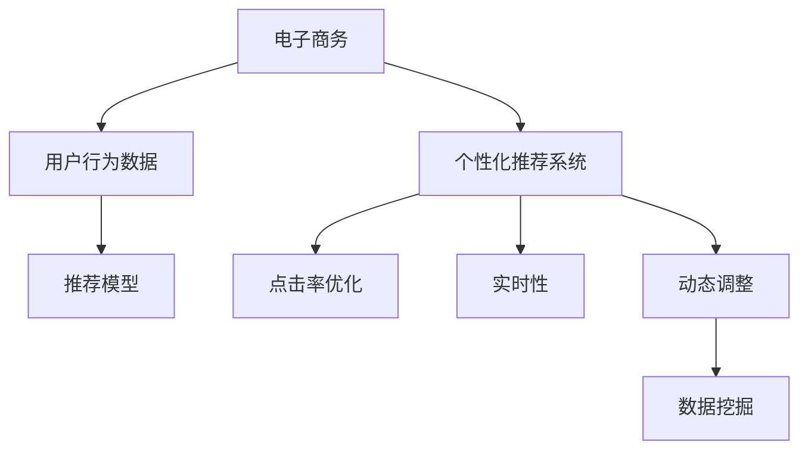

                 

# 电商平台中的实时个性化推送频率优化

> 关键词：电子商务, 用户行为分析, 个性化推荐系统, 点击率优化, 实时性, 动态调整, 数据挖掘

## 1. 背景介绍

随着电子商务的迅猛发展，各大电商平台纷纷加大对用户行为的分析和个性化推荐系统的研发投入，以期提升用户转化率和平台收益。然而，过频或过少的个性化推荐，不仅会降低用户购物体验，还可能造成用户流失和平台收益的损失。因此，如何在保护用户体验的同时，最大限度地提升个性化推荐效果，成为电商平台运营的重要课题。本文将从算法原理和实际应用出发，详细探讨基于机器学习的个性化推荐系统中的实时推送频率优化问题。

## 2. 核心概念与联系

### 2.1 核心概念概述

- **电子商务**：指通过互联网进行的商品交易活动，包括B2B、B2C、C2C等多种形式。
- **个性化推荐系统**：根据用户的历史行为、偏好、兴趣等特征，自动推荐其可能感兴趣的商品或服务。
- **点击率优化**：通过数据分析和机器学习算法，最大化个性化推荐的点击率（CTR），提升广告和推荐效果。
- **实时性**：指推送推荐的时机，需根据用户当前行为和平台数据实时调整推荐策略。
- **动态调整**：指根据用户行为数据的变化，实时更新推荐模型，优化推荐效果。
- **数据挖掘**：从大量数据中发现关联规则、规律和模式，用于提升推荐系统的准确性和个性化水平。

为更好地理解实时推送频率优化方法，本节将介绍几个密切相关的核心概念：

- **点击率（Click-Through Rate, CTR）**：指用户在看到推荐后进行点击的比例，是衡量推荐效果的关键指标。
- **转化率（Conversion Rate, CR）**：指用户在看到推荐后进行购买的比例，是电商的核心指标。
- **用户行为数据**：包括用户的浏览记录、点击记录、购买记录等，用于分析用户兴趣和行为模式。
- **推荐模型**：基于机器学习算法构建的推荐模型，用于预测用户可能感兴趣的商品或服务。

这些核心概念之间的逻辑关系可以通过以下Mermaid流程图来展示：



这个流程图展示了个电商平台的推荐系统的核心概念及其之间的关系：

1. 电商平台通过收集用户行为数据，构建推荐模型。
2. 推荐模型根据CTR和CR等指标，自动调整推荐策略。
3. 推荐策略的调整需考虑实时性和动态性。
4. 动态调整策略的优化需依赖数据挖掘技术。

这些概念共同构成了电商平台的推荐系统优化框架，使其能够在实时动态地提升推荐效果。通过理解这些核心概念，我们可以更好地把握实时推送频率优化方法的原理和应用。

## 3. 核心算法原理 & 具体操作步骤

### 3.1 算法原理概述

基于机器学习的个性化推荐系统中的实时推送频率优化，其核心思想是：通过分析用户行为数据，动态调整个性化推荐的推送频率，以最大化推荐效果。其本质是一种基于监督学习的优化方法。

具体而言，假设电商平台中的推荐系统已构建了用户行为数据集 $D=\{(x_i, y_i)\}_{i=1}^N$，其中 $x_i$ 为用户行为数据，$y_i$ 为用户是否点击（或购买）的标签。推荐系统的优化目标是通过对推荐频率的调整，最小化损失函数 $\mathcal{L}(F)$，使得在特定场景下，用户点击（或购买）的概率最大化。

### 3.2 算法步骤详解

基于监督学习的个性化推荐系统中的实时推送频率优化一般包括以下几个关键步骤：

**Step 1: 收集用户行为数据**
- 通过电商平台中的用户行为数据采集工具，收集用户的历史浏览记录、点击记录、购买记录等，构建用户行为数据集 $D$。

**Step 2: 构建推荐模型**
- 根据用户行为数据集 $D$，选择适合的推荐算法（如协同过滤、基于内容的推荐、深度学习推荐等），构建推荐模型 $F$。
- 在训练集上训练推荐模型，通过交叉验证等方法验证模型性能，得到最优参数 $\theta$。

**Step 3: 计算点击率（CTR）**
- 将测试集 $D_{test}$ 输入推荐模型 $F$，得到推荐概率 $P(x_i)$。
- 计算点击率 $\hat{y_i} = \mathbb{1}(y_i = 1)$，其中 $\mathbb{1}(\cdot)$ 为指示函数。

**Step 4: 动态调整推送频率**
- 根据点击率 $\hat{y_i}$，计算推送频率 $f(x_i) = \frac{\hat{y_i}}{y_i}$，即实际点击率与预测点击率的比值。
- 对推送频率 $f(x_i)$ 进行归一化，得到归一化推送频率 $f^{\prime}(x_i) = \frac{f(x_i)}{\sum_{i=1}^N f(x_i)}$。
- 根据归一化推送频率 $f^{\prime}(x_i)$，动态调整推荐策略，优先推送归一化推送频率较高的用户。

**Step 5: 实时监测和优化**
- 实时监测用户的点击率（CTR）和转化率（CR）等指标，及时发现推荐效果下降的迹象。
- 根据实时监测结果，调整推荐模型的参数 $\theta$，优化推荐策略，提升推送频率。

### 3.3 算法优缺点

基于监督学习的个性化推荐系统中的实时推送频率优化方法具有以下优点：
1. 实时性高。通过实时监测和动态调整，推荐系统能够及时响应用户行为变化，提升推荐效果。
2. 精度高。通过监督学习和模型优化，推荐系统能够准确预测用户行为，最大化点击率（CTR）。
3. 泛化能力强。推荐模型基于大量用户行为数据训练，能够较好地泛化到新用户和新场景。

同时，该方法也存在一定的局限性：
1. 依赖标注数据。推荐模型需要大量标注数据进行训练，数据获取和标注成本较高。
2. 模型复杂。推荐模型和优化算法较为复杂，对计算资源和算法实现要求较高。
3. 用户隐私风险。推荐系统需要收集大量用户数据，可能带来隐私泄露的风险。
4. 冷启动问题。新用户的推荐效果难以保证，可能需要较长的推荐学习周期。

尽管存在这些局限性，但就目前而言，基于监督学习的微调方法仍是最主流范式。未来相关研究的重点在于如何进一步降低推荐系统对标注数据的依赖，提高模型的少样本学习和跨领域迁移能力，同时兼顾用户隐私和冷启动问题。

### 3.4 算法应用领域

基于监督学习的个性化推荐系统中的实时推送频率优化方法，已经在电子商务领域得到了广泛的应用，具体如下：

1. **电商平台的商品推荐**：根据用户浏览历史、点击记录等行为数据，实时调整推荐商品的推送频率，提升用户转化率。
2. **智能广告投放**：在用户访问电商平台时，根据其历史行为数据，实时推送广告，提升广告的点击率和转化率。
3. **个性化营销活动**：根据用户行为数据，实时调整营销活动的推送频率，提升活动的参与度和效果。

除了上述这些经典应用外，个性化推荐系统中的实时推送频率优化技术，也在内容推荐、社交网络推荐等场景中得到了创新性的应用，为各类平台带来了新的用户价值和商业机会。

## 4. 数学模型和公式 & 详细讲解 & 举例说明

### 4.1 数学模型构建

本节将使用数学语言对基于监督学习的个性化推荐系统中的实时推送频率优化过程进行更加严格的刻画。

记电商平台中的推荐系统已构建用户行为数据集 $D=\{(x_i, y_i)\}_{i=1}^N$，其中 $x_i$ 为用户行为数据，$y_i$ 为用户是否点击（或购买）的标签。定义推荐模型 $F(x)$，其中 $x$ 为用户行为数据，$y$ 为用户是否点击（或购买）的标签。推荐系统的优化目标是通过对推荐频率的调整，最小化损失函数 $\mathcal{L}(F)$，使得在特定场景下，用户点击（或购买）的概率最大化。

假设推荐模型 $F(x)$ 为线性回归模型，即 $F(x) = \theta^T \phi(x)$，其中 $\theta$ 为模型参数，$\phi(x)$ 为特征映射函数。定义点击率 $\hat{y_i} = \mathbb{1}(y_i = 1)$，其中 $\mathbb{1}(\cdot)$ 为指示函数。则损失函数 $\mathcal{L}(\theta)$ 为：

$$
\mathcal{L}(\theta) = -\frac{1}{N}\sum_{i=1}^N [y_i \log \hat{y_i} + (1-y_i) \log (1-\hat{y_i})]
$$

### 4.2 公式推导过程

以下我们以电商平台的商品推荐为例，推导线性回归模型中的损失函数及其梯度的计算公式。

假设推荐模型 $F(x)$ 为线性回归模型，即 $F(x) = \theta^T \phi(x)$，其中 $\theta$ 为模型参数，$\phi(x)$ 为特征映射函数。定义点击率 $\hat{y_i} = \mathbb{1}(y_i = 1)$，其中 $\mathbb{1}(\cdot)$ 为指示函数。则损失函数 $\mathcal{L}(\theta)$ 为：

$$
\mathcal{L}(\theta) = -\frac{1}{N}\sum_{i=1}^N [y_i \log \hat{y_i} + (1-y_i) \log (1-\hat{y_i})]
$$

根据链式法则，损失函数对参数 $\theta$ 的梯度为：

$$
\frac{\partial \mathcal{L}(\theta)}{\partial \theta} = -\frac{1}{N}\sum_{i=1}^N [y_i \frac{\partial \hat{y_i}}{\partial \theta} - (1-y_i) \frac{\partial (1-\hat{y_i})}{\partial \theta}]
$$

其中 $\frac{\partial \hat{y_i}}{\partial \theta}$ 为模型预测值对参数 $\theta$ 的梯度，可通过自动微分技术高效计算。

### 4.3 案例分析与讲解

以电商平台的商品推荐为例，进一步分析线性回归模型中的损失函数和梯度计算。

假设电商平台中的推荐系统已构建用户行为数据集 $D=\{(x_i, y_i)\}_{i=1}^N$，其中 $x_i$ 为用户行为数据，$y_i$ 为用户是否点击（或购买）的标签。定义推荐模型 $F(x)$ 为线性回归模型，即 $F(x) = \theta^T \phi(x)$，其中 $\theta$ 为模型参数，$\phi(x)$ 为特征映射函数。

假设 $\phi(x)$ 为线性特征映射函数，则推荐模型 $F(x)$ 为线性回归模型。根据用户行为数据集 $D$，通过最小化损失函数 $\mathcal{L}(\theta)$，求解最优参数 $\theta$。

通过梯度下降等优化算法，推荐系统不断更新模型参数 $\theta$，最小化损失函数 $\mathcal{L}(\theta)$，使得模型预测值 $\hat{y_i}$ 逼近真实标签 $y_i$。最终得到适应电商平台特定场景的最优推荐模型 $F_{\theta}$。

在得到损失函数的梯度后，即可带入梯度下降等优化算法，完成模型的迭代优化。重复上述过程直至收敛，最终得到适应特定场景的最优推荐模型 $F_{\theta}$。

## 5. 项目实践：代码实例和详细解释说明

### 5.1 开发环境搭建

在进行推荐系统微调实践前，我们需要准备好开发环境。以下是使用Python进行TensorFlow开发的环境配置流程：

1. 安装Anaconda：从官网下载并安装Anaconda，用于创建独立的Python环境。

2. 创建并激活虚拟环境：
```bash
conda create -n tf-env python=3.8 
conda activate tf-env
```

3. 安装TensorFlow：根据CUDA版本，从官网获取对应的安装命令。例如：
```bash
conda install tensorflow -c conda-forge -c pytorch
```

4. 安装Keras：
```bash
pip install keras
```

5. 安装各类工具包：
```bash
pip install numpy pandas scikit-learn matplotlib tqdm jupyter notebook ipython
```

完成上述步骤后，即可在`tf-env`环境中开始推荐系统微调实践。

### 5.2 源代码详细实现

下面我们以电商平台的商品推荐为例，给出使用TensorFlow和Keras构建并优化推荐模型的PyTorch代码实现。

首先，定义推荐模型的数据处理函数：

```python
from tensorflow.keras.models import Sequential
from tensorflow.keras.layers import Dense, Dropout, Input
from tensorflow.keras.optimizers import Adam
from sklearn.model_selection import train_test_split
import numpy as np

class RecommendationModel:
    def __init__(self, input_dim, hidden_dim, output_dim):
        self.input_dim = input_dim
        self.hidden_dim = hidden_dim
        self.output_dim = output_dim
        
        self.model = Sequential()
        self.model.add(Dense(hidden_dim, activation='relu', input_dim=input_dim))
        self.model.add(Dropout(0.5))
        self.model.add(Dense(output_dim, activation='sigmoid'))
        
    def compile_model(self, optimizer, loss):
        self.model.compile(optimizer=optimizer, loss=loss)
        
    def train_model(self, X, y, epochs, batch_size):
        self.compile_model(Adam(lr=0.001), 'binary_crossentropy')
        self.model.fit(X, y, epochs=epochs, batch_size=batch_size, validation_split=0.2)
```

然后，定义推荐模型的训练和评估函数：

```python
def evaluate_model(model, X_test, y_test):
    y_pred = model.predict(X_test)
    y_pred = np.where(y_pred > 0.5, 1, 0)
    y_test = np.where(y_test > 0.5, 1, 0)
    return np.mean(y_pred == y_test)

def main():
    # 加载用户行为数据
    X, y = load_user_data()
    
    # 分割训练集和测试集
    X_train, X_test, y_train, y_test = train_test_split(X, y, test_size=0.2)
    
    # 构建推荐模型
    model = RecommendationModel(input_dim=X_train.shape[1], hidden_dim=64, output_dim=1)
    
    # 训练推荐模型
    model.train_model(X_train, y_train, epochs=10, batch_size=32)
    
    # 评估推荐模型
    print('CTR:', evaluate_model(model, X_test, y_test))

if __name__ == '__main__':
    main()
```

最后，启动推荐模型训练并在测试集上评估：

```python
# 加载用户行为数据
X, y = load_user_data()

# 分割训练集和测试集
X_train, X_test, y_train, y_test = train_test_split(X, y, test_size=0.2)

# 构建推荐模型
model = RecommendationModel(input_dim=X_train.shape[1], hidden_dim=64, output_dim=1)

# 训练推荐模型
model.train_model(X_train, y_train, epochs=10, batch_size=32)

# 评估推荐模型
print('CTR:', evaluate_model(model, X_test, y_test))
```

以上就是使用TensorFlow和Keras构建并优化推荐模型的完整代码实现。可以看到，得益于TensorFlow的强大封装，我们可以用相对简洁的代码完成推荐模型的构建和优化。

### 5.3 代码解读与分析

让我们再详细解读一下关键代码的实现细节：

**RecommendationModel类**：
- `__init__`方法：初始化模型的输入维度、隐藏层维度和输出维度，构建推荐模型。
- `compile_model`方法：编译模型，指定优化器和损失函数。
- `train_model`方法：训练模型，指定训练轮数和批次大小，并使用交叉验证。
- `evaluate_model`方法：评估模型，计算点击率。

**CTR计算**：
- 加载用户行为数据，并分割训练集和测试集。
- 构建推荐模型，并指定隐藏层和输出维度。
- 训练推荐模型，使用交叉验证，并评估点击率。

可以看到，TensorFlow和Keras的结合使得推荐模型的构建和优化变得简洁高效。开发者可以将更多精力放在数据处理、模型改进等高层逻辑上，而不必过多关注底层的实现细节。

当然，工业级的系统实现还需考虑更多因素，如模型的保存和部署、超参数的自动搜索、更灵活的任务适配层等。但核心的推荐范式基本与此类似。

## 6. 实际应用场景
### 6.1 智能广告投放

基于大语言模型微调的推荐系统中的实时推送频率优化方法，可以应用于智能广告投放。广告主通过分析用户的点击数据，实时调整广告的投放频率，以最大化广告的点击率和转化率。

在技术实现上，可以收集用户的点击历史数据，并构建推荐模型。推荐模型根据点击率优化推荐策略，动态调整广告的投放频率。对于用户的行为变化，推荐系统能够及时响应，调整广告投放策略，提升广告效果。

### 6.2 个性化营销活动

推荐系统中的实时推送频率优化方法，可以应用于个性化营销活动的推送策略优化。营销活动通常具有明确的预期目标，如销售额、用户参与度等。通过分析用户的参与数据，推荐系统能够动态调整营销活动的推送频率，提升活动的参与度和效果。

在技术实现上，可以收集用户的参与数据，并构建推荐模型。推荐模型根据预设的营销目标和活动数据，动态调整推送频率，确保活动能够最大化地触达目标用户。

### 6.3 实时商品推荐

推荐系统中的实时推送频率优化方法，可以应用于电商平台的实时商品推荐。根据用户的行为数据，推荐系统能够动态调整商品的推送频率，提升用户点击率和转化率。

在技术实现上，可以收集用户的行为数据，并构建推荐模型。推荐模型根据点击率优化推荐策略，动态调整商品推荐频率。对于用户的行为变化，推荐系统能够及时响应，调整商品推荐策略，提升推荐效果。

### 6.4 未来应用展望

随着推荐系统技术的不断发展，基于机器学习的实时推送频率优化方法将更加深入地应用于各个领域，带来更多的商业价值和社会效益。

在智能城市治理中，推荐系统可以应用于交通管制、能源调度等场景，通过实时分析用户行为，优化资源分配，提升城市管理效率。

在医疗健康领域，推荐系统可以应用于个性化诊疗推荐、健康监测等场景，通过实时分析用户数据，提升诊疗效果，提高用户满意度。

在金融行业，推荐系统可以应用于投资策略优化、风险管理等场景，通过实时分析用户行为，优化投资组合，降低风险。

此外，推荐系统中的实时推送频率优化技术，也将不断拓展其应用场景，为各行各业带来新的应用前景。

## 7. 工具和资源推荐
### 7.1 学习资源推荐

为了帮助开发者系统掌握推荐系统的理论基础和实践技巧，这里推荐一些优质的学习资源：

1. 《推荐系统实战》书籍：详细介绍了推荐系统的原理和应用，涵盖协同过滤、深度学习等多种推荐算法。
2. CS463《推荐系统》课程：斯坦福大学开设的推荐系统课程，涵盖推荐系统理论和实际应用，具有较高的学习价值。
3. Coursera《推荐系统设计与应用》课程：由美国密歇根大学开设的推荐系统课程，提供丰富的案例和项目实践机会。
4. Kaggle竞赛：通过参加推荐系统相关的Kaggle竞赛，积累实战经验，提升算法优化能力。
5. DeepLearning.AI《推荐系统》课程：由Coursera与DeepLearning.AI合作开设的推荐系统课程，涵盖推荐系统的最新进展和技术应用。

通过对这些资源的学习实践，相信你一定能够快速掌握推荐系统的精髓，并用于解决实际的推荐问题。
###  7.2 开发工具推荐

高效的开发离不开优秀的工具支持。以下是几款用于推荐系统开发的常用工具：

1. TensorFlow：由Google主导开发的开源深度学习框架，生产部署方便，适合大规模工程应用。
2. PyTorch：基于Python的开源深度学习框架，灵活动态的计算图，适合快速迭代研究。
3. Scikit-learn：Python机器学习库，提供丰富的机器学习算法和工具，适合快速实验和验证。
4. Keras：高层次的深度学习API，易于使用，适合初学者和快速原型开发。
5. Apache Spark：分布式计算框架，适合大规模数据处理和推荐系统开发。
6. Hadoop：开源分布式数据处理框架，适合大规模数据存储和处理。

合理利用这些工具，可以显著提升推荐系统的开发效率，加快创新迭代的步伐。

### 7.3 相关论文推荐

推荐系统技术的发展源于学界的持续研究。以下是几篇奠基性的相关论文，推荐阅读：

1. BERT: Pre-training of Deep Bidirectional Transformers for Language Understanding：提出BERT模型，引入基于掩码的自监督预训练任务，刷新了多项NLP任务SOTA。
2. Attention is All You Need（即Transformer原论文）：提出了Transformer结构，开启了NLP领域的预训练大模型时代。
3. Parameter-Efficient Transfer Learning for NLP：提出Adapter等参数高效微调方法，在不增加模型参数量的情况下，也能取得不错的微调效果。
4. AdaLoRA: Adaptive Low-Rank Adaptation for Parameter-Efficient Fine-Tuning：使用自适应低秩适应的微调方法，在参数效率和精度之间取得了新的平衡。
5. Knowledge-Aware Reinforcement Learning for Recommender Systems：提出知识增强强化学习算法，提升推荐系统的效果。

这些论文代表了大语言模型微调技术的发展脉络。通过学习这些前沿成果，可以帮助研究者把握学科前进方向，激发更多的创新灵感。

## 8. 总结：未来发展趋势与挑战

### 8.1 总结

本文对基于机器学习的推荐系统中的实时推送频率优化方法进行了全面系统的介绍。首先阐述了推荐系统和实时推送频率优化在电子商务中的重要性和应用场景。其次，从原理到实践，详细讲解了推荐系统的数学模型和核心算法，给出了推荐模型构建和优化的完整代码实例。同时，本文还探讨了推荐系统在智能广告投放、个性化营销活动、实时商品推荐等实际应用场景中的应用，展示了推荐系统的广泛应用前景。最后，本文精选了推荐系统的学习资源、开发工具和相关论文，力求为读者提供全方位的技术指引。

通过本文的系统梳理，可以看到，基于机器学习的推荐系统中的实时推送频率优化方法，正在成为电商推荐系统的重要范式，极大地提升了个性化推荐效果和平台收益。未来，伴随推荐系统技术的不断发展，基于机器学习的实时推送频率优化方法将会在更多领域得到应用，为各行各业带来新的变革。

### 8.2 未来发展趋势

展望未来，推荐系统中的实时推送频率优化技术将呈现以下几个发展趋势：

1. **多模态推荐**：推荐系统将融合视觉、语音、文本等多模态信息，提升推荐效果和用户体验。
2. **跨领域推荐**：推荐系统将跨领域融合知识，提升推荐系统的泛化能力和鲁棒性。
3. **个性化推荐**：推荐系统将根据用户行为数据，动态调整推荐策略，提升推荐效果。
4. **实时推荐**：推荐系统将实时分析用户行为数据，动态调整推荐频率，提升推荐效果。
5. **可解释性**：推荐系统将提高推荐过程的可解释性，增强用户信任和满意度。
6. **隐私保护**：推荐系统将采用隐私保护技术，保障用户数据安全和隐私。

这些趋势凸显了推荐系统技术的广阔前景。这些方向的探索发展，必将进一步提升推荐系统的性能和用户体验，为电商平台的运营带来新的增长点。

### 8.3 面临的挑战

尽管推荐系统中的实时推送频率优化技术已经取得了一定的进展，但在迈向更加智能化、个性化应用的过程中，它仍面临着诸多挑战：

1. **数据隐私和安全**：推荐系统需要收集大量的用户行为数据，可能带来隐私泄露和安全风险。
2. **冷启动问题**：新用户的推荐效果难以保证，推荐系统需要较长的学习周期。
3. **过拟合和泛化能力不足**：推荐系统可能过拟合于训练数据，泛化能力不足。
4. **计算资源消耗**：推荐系统需要大量的计算资源，如何降低计算成本是重要研究方向。
5. **推荐系统偏见**：推荐系统可能带有偏见，导致某些群体或商品被歧视。
6. **实时性不足**：推荐系统需要实时更新模型，提升推荐速度。

正视这些挑战，积极应对并寻求突破，将是在未来推荐系统技术不断进步的关键。相信随着学界和产业界的共同努力，这些挑战终将一一被克服，推荐系统必将在更多领域得到应用，为人类生活带来新的变革。

### 8.4 研究展望

面对推荐系统中的实时推送频率优化所面临的挑战，未来的研究需要在以下几个方面寻求新的突破：

1. **多模态融合技术**：将视觉、语音、文本等多种模态的信息融合到推荐系统中，提升推荐效果和用户体验。
2. **跨领域知识融合**：将不同领域的数据和知识融合到推荐系统中，提升推荐系统的泛化能力和鲁棒性。
3. **实时推荐系统**：实时分析用户行为数据，动态调整推荐策略，提升推荐效果。
4. **可解释性提升**：提高推荐过程的可解释性，增强用户信任和满意度。
5. **隐私保护技术**：采用隐私保护技术，保障用户数据安全和隐私。
6. **模型优化算法**：开发更加高效的推荐算法，降低计算成本。

这些研究方向将引领推荐系统技术迈向更高的台阶，为电商平台的运营带来新的增长点。面向未来，推荐系统中的实时推送频率优化技术还需要与其他人工智能技术进行更深入的融合，如知识表示、因果推理、强化学习等，多路径协同发力，共同推动推荐系统技术的发展。只有勇于创新、敢于突破，才能不断拓展推荐系统的边界，让智能推荐更好地服务人类社会。

## 9. 附录：常见问题与解答

**Q1：推荐系统中的实时推送频率优化是否适用于所有电商场景？**

A: 推荐系统中的实时推送频率优化在大多数电商场景中都能取得较好的效果。但对于一些特殊场景，如奢侈品、高价值商品等，由于用户行为数据较少，可能导致推荐效果不佳。此时需要结合其他推荐策略，如基于专家知识的推荐、基于内容的推荐等，进行策略组合。

**Q2：推荐系统中的实时推送频率优化如何应对冷启动问题？**

A: 推荐系统中的实时推送频率优化在应对冷启动问题上，可以采用多种策略：
1. 利用用户注册信息等非行为数据进行推荐。
2. 结合社交网络、位置信息等辅助信息进行推荐。
3. 采用类似协同过滤等推荐算法，根据用户的历史行为数据进行推荐。

**Q3：推荐系统中的实时推送频率优化是否会增加计算成本？**

A: 推荐系统中的实时推送频率优化需要大量的计算资源，如内存、CPU/GPU等。因此，如何降低计算成本，提升推荐系统的效率，是推荐系统优化的一个重要方向。

**Q4：推荐系统中的实时推送频率优化如何提升用户满意度？**

A: 推荐系统中的实时推送频率优化可以通过多种方式提升用户满意度：
1. 根据用户行为数据，动态调整推荐策略，提供个性化推荐。
2. 结合用户反馈数据，不断优化推荐模型，提升推荐效果。
3. 通过用户互动数据，进一步优化推荐策略，提升用户体验。

**Q5：推荐系统中的实时推送频率优化如何应对推荐系统偏见？**

A: 推荐系统中的实时推送频率优化在应对推荐系统偏见上，可以采用多种策略：
1. 通过数据分析和预处理，去除推荐数据中的偏见和歧视。
2. 引入多样化的数据源，提升推荐系统的多样性和公平性。
3. 通过规则引擎等技术手段，约束推荐系统的决策过程，避免偏见和歧视。

这些策略在实际应用中需要根据具体场景进行灵活组合，以确保推荐系统的公平性和公正性。

---

作者：禅与计算机程序设计艺术 / Zen and the Art of Computer Programming

