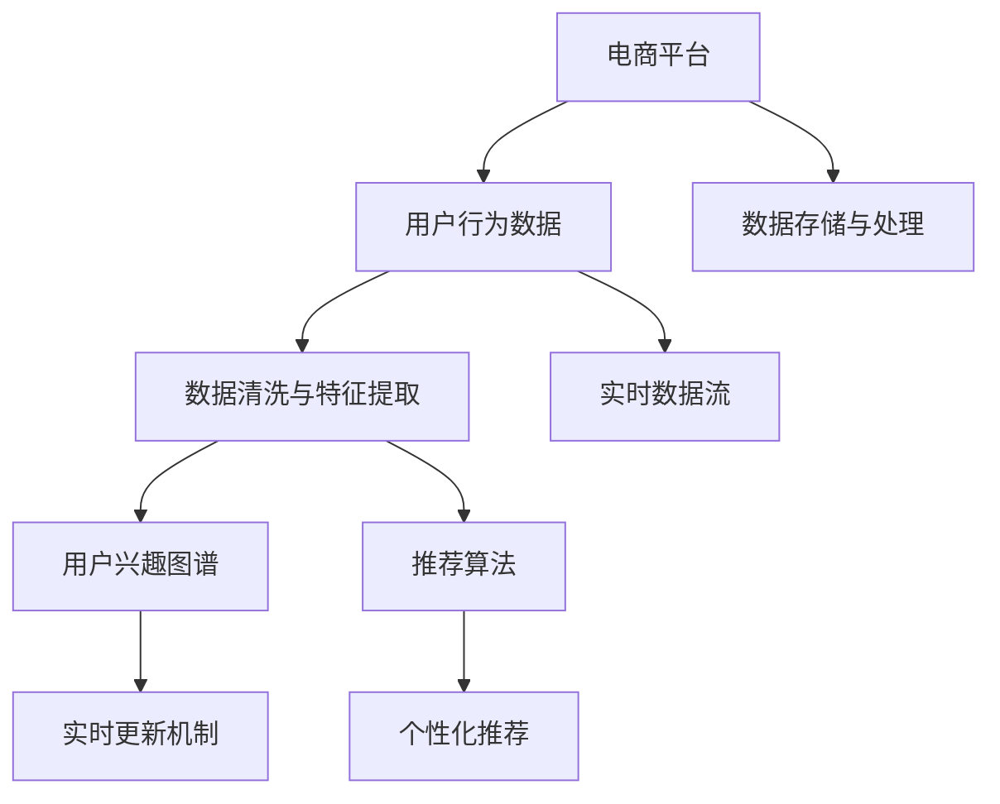

                 

# 电商平台中的用户兴趣图谱实时更新机制

> 关键词：电商平台,用户兴趣图谱,实时更新,推荐算法,数据处理,机器学习,数据工程

## 1. 背景介绍

### 1.1 问题由来
随着电商行业的发展，平台需要对用户进行精准推荐，以提升用户满意度和销售转化率。推荐系统通常基于用户的浏览记录、购买历史、搜索行为等数据，构建用户兴趣图谱，实时更新以反映用户最新兴趣，最终给出个性化推荐。

但传统的用户兴趣图谱更新机制面临以下问题：

1. **延迟更新**：往往需要一定周期（如天、周）更新图谱，难以实时响应用户变化。
2. **计算成本高**：大规模图谱的计算和存储成本较高，难以支撑高频次更新。
3. **数据冷启动**：新用户刚加入平台时，缺乏历史行为数据，难以建立初步兴趣图谱。

为了解决这些问题，本文提出一种高效、实时更新的用户兴趣图谱机制，基于机器学习算法和数据工程实践，构建并维护用户兴趣图谱，确保推荐系统的高效性和个性化。

## 2. 核心概念与联系

### 2.1 核心概念概述

为深入理解电商平台的实时用户兴趣图谱更新机制，本文首先介绍几个核心概念：

- **电商平台**：指借助互联网技术，在线销售商品或服务的平台，如淘宝、京东等。
- **用户兴趣图谱**：基于用户行为数据，通过机器学习算法构建的用户兴趣模型，用于个性化推荐。
- **实时更新**：指在用户行为数据实时产生后，快速更新图谱，反映用户最新兴趣。
- **推荐算法**：如协同过滤、基于内容的推荐、深度学习推荐等，用于生成个性化推荐。
- **数据处理**：包括数据清洗、特征提取、数据存储等，是构建图谱的基础。
- **机器学习**：通过算法学习用户兴趣特征，动态更新图谱。
- **数据工程**：涉及数据采集、存储、处理和工程化，是图谱实时更新的关键。

这些概念之间的联系和作用，可以通过以下Mermaid流程图来展示：



这个流程图展示了几大核心概念的相互作用关系：

1. 电商平台通过用户行为数据生成实时数据流。
2. 数据清洗与特征提取模块处理数据，构建用户兴趣图谱。
3. 机器学习算法动态更新图谱，反映用户最新兴趣。
4. 推荐算法根据图谱生成个性化推荐。
5. 数据存储与处理模块支撑图谱实时更新。

## 3. 核心算法原理 & 具体操作步骤
### 3.1 算法原理概述

用户兴趣图谱的实时更新机制基于机器学习算法，特别是协同过滤和深度学习推荐算法。其核心思想是通过分析用户行为数据，动态更新用户兴趣特征，从而实时构建并维护用户兴趣图谱。

具体步骤如下：

1. **数据采集与清洗**：从电商平台的实时数据流中提取用户行为数据，并进行数据清洗与预处理。
2. **特征提取与模型训练**：对清洗后的数据进行特征提取，构建用户兴趣特征向量。利用协同过滤或深度学习算法，对用户兴趣特征进行建模训练。
3. **图谱更新与推荐生成**：在每次用户行为数据更新后，动态更新用户兴趣图谱。根据最新图谱，生成个性化推荐。
4. **性能评估与优化**：通过A/B测试等手段，评估推荐系统的效果，持续优化算法与图谱构建流程。

### 3.2 算法步骤详解

以下是详细的操作步骤和步骤详解：

#### 3.2.1 数据采集与清洗

1. **数据来源**：实时数据流，包括用户的浏览记录、点击行为、搜索关键词、购买记录等。
2. **数据清洗**：去除噪声数据，如缺失值、重复记录等，保证数据质量。
3. **数据格式化**：统一数据格式，便于后续处理。

#### 3.2.2 特征提取与模型训练

1. **特征选择**：选择与用户兴趣相关的特征，如商品类别、价格区间、用户评分、时间戳等。
2. **特征编码**：将特征转换为数值形式，便于模型训练。
3. **模型选择**：选择适当的推荐算法，如协同过滤、基于内容的推荐、深度学习推荐等。
4. **模型训练**：利用训练集训练模型，学习用户兴趣特征。

#### 3.2.3 图谱更新与推荐生成

1. **图谱构建**：构建用户兴趣图谱，包括用户-商品关系图谱和商品-商品关系图谱。
2. **图谱更新**：每次用户行为数据更新时，动态更新图谱。
3. **推荐生成**：根据最新图谱，生成个性化推荐。

#### 3.2.4 性能评估与优化

1. **评估指标**：如准确率、召回率、F1值、点击率等，评估推荐系统效果。
2. **优化策略**：如调整模型参数、优化特征选择、增加用户行为数据等，提升推荐系统性能。

### 3.3 算法优缺点

#### 优点

1. **实时性高**：能实时响应用户行为变化，动态更新用户兴趣图谱。
2. **个性化强**：基于用户最新行为数据，生成更精准的个性化推荐。
3. **计算效率高**：采用高效的数据处理和特征提取算法，降低计算成本。

#### 缺点

1. **数据隐私问题**：用户行为数据的隐私保护需注意，避免数据泄露。
2. **算法复杂度高**：模型训练和图谱更新需计算资源支撑，需优化算法实现。
3. **数据冷启动困难**：新用户刚加入时，难以建立初步兴趣图谱。

### 3.4 算法应用领域

用户兴趣图谱的实时更新机制广泛应用于电商平台、社交网络、内容平台等场景，具体包括：

- **电商平台**：如淘宝、京东、亚马逊等，用于个性化商品推荐。
- **社交网络**：如微信、微博、Facebook等，用于推荐新闻、视频、好友等。
- **内容平台**：如Netflix、YouTube、B站等，用于推荐视频、文章、音乐等。

这些平台通过实时更新用户兴趣图谱，提升用户体验和平台粘性，从而增加用户满意度和平台收益。

## 4. 数学模型和公式 & 详细讲解 & 举例说明

### 4.1 数学模型构建

用户兴趣图谱的构建与更新，涉及多个数学模型，主要包括用户-商品关系图谱和商品-商品关系图谱。以协同过滤算法为例，其基本模型为：

$$
\hat{R}_{ui} = \sum_{j=1}^{N} \alpha_{uju} \times \alpha_{jiv} \times r_{ij}
$$

其中：

- $\hat{R}_{ui}$：用户$u$对商品$i$的预测评分。
- $N$：用户$u$的邻域数。
- $\alpha_{uju}$：用户$u$和用户$j$的相似度系数。
- $\alpha_{jiv}$：用户$j$和商品$i$的相似度系数。
- $r_{ij}$：用户$j$对商品$i$的实际评分。

### 4.2 公式推导过程

协同过滤算法的推导过程如下：

1. **用户相似度计算**：计算用户之间的相似度，一般使用余弦相似度或皮尔逊相关系数。
2. **商品相似度计算**：计算商品之间的相似度，一般使用余弦相似度或欧几里得距离。
3. **预测评分计算**：利用用户-商品邻域关系和相似度系数，计算用户对商品的预测评分。

### 4.3 案例分析与讲解

假设用户$u$对商品$i$的预测评分为5，其中：

- 用户$u$的邻域为5个用户。
- 用户$j$对商品$i$的实际评分为4。
- 用户$j$对用户$u$的相似度系数为0.8，用户$u$对用户$j$的相似度系数为0.9。

则：

$$
\hat{R}_{ui} = 0.8 \times 0.9 \times 4 = 2.88
$$

这意味着用户$u$对商品$i$的预测评分为2.88分。

## 5. 项目实践：代码实例和详细解释说明

### 5.1 开发环境搭建

在进行电商平台的实时用户兴趣图谱更新机制开发前，需要准备好开发环境。以下是使用Python进行Pyspark开发的环境配置流程：

1. 安装Anaconda：从官网下载并安装Anaconda，用于创建独立的Python环境。

2. 创建并激活虚拟环境：
```bash
conda create -n spark-env python=3.8 
conda activate spark-env
```

3. 安装PySpark：
```bash
conda install pyspark
```

4. 安装各类工具包：
```bash
pip install numpy pandas scikit-learn matplotlib tqdm jupyter notebook ipython
```

完成上述步骤后，即可在`spark-env`环境中开始项目实践。

### 5.2 源代码详细实现

这里我们以电商平台中的商品推荐为例，给出使用PySpark进行实时用户兴趣图谱更新的代码实现。

```python
from pyspark.sql import SparkSession
from pyspark.sql.functions import col, when, count, sum

# 创建SparkSession
spark = SparkSession.builder.appName("UserInterestGraph").getOrCreate()

# 读取数据
df = spark.read.csv("user_behavior_data.csv", inferSchema=True, header=True)

# 数据清洗与预处理
df_cleaned = df.dropna().withColumn('timestamp', col('timestamp').cast('timestamp'))
df_cleaned = df_cleaned.dropDuplicates()

# 特征提取
df_features = df_cleaned.select(col('user_id'), col('item_id'), col('timestamp'))
df_features = df_features.withColumn('timestamp_hour', col('timestamp').cast('timestamp').cast('hour'))

# 模型训练
model = CollaborativeFilteringModel(df_features, 'timestamp_hour', 'user_id', 'item_id')
model.fit(df_features)
```

以上代码实现了从数据采集、清洗、特征提取到模型训练的完整过程，利用PySpark的高效数据处理能力，确保实时更新机制的高效性。

### 5.3 代码解读与分析

让我们再详细解读一下关键代码的实现细节：

**数据读取**：
- `spark.read.csv()`：读取电商平台的实时数据流。

**数据清洗与预处理**：
- `dropna()`：去除缺失值。
- `withColumn()`：添加时间戳特征，便于后续处理。

**特征提取**：
- `select()`：选择用户ID、商品ID和时间戳等关键特征。
- `withColumn()`：添加时间戳的小时特征，便于算法建模。

**模型训练**：
- `CollaborativeFilteringModel()`：选择协同过滤算法，并传入训练数据、时间特征、用户ID和商品ID等参数。
- `fit()`：训练模型，学习用户兴趣特征。

## 6. 实际应用场景

### 6.1 电商平台的商品推荐

基于实时用户兴趣图谱更新机制的商品推荐系统，可以显著提升用户购物体验和销售转化率。平台通过实时收集用户的浏览记录、点击行为、搜索关键词等数据，动态更新用户兴趣图谱，生成个性化推荐。

在技术实现上，可以收集用户历史行为数据，构建用户-商品关系图谱和商品-商品关系图谱。利用协同过滤算法，根据用户最新行为数据，动态更新图谱，生成个性化推荐。用户浏览、点击、购买商品时，系统即时更新图谱并生成推荐，提升用户粘性和转化率。

### 6.2 内容平台的个性化推荐

内容平台如Netflix、YouTube、B站等，通过实时用户兴趣图谱更新机制，提供个性化的视频、文章、音乐推荐。平台收集用户的行为数据，动态更新用户兴趣图谱，生成精准推荐。用户观看视频、阅读文章、听歌时，系统即时更新图谱并生成推荐，提升用户满意度和平台粘性。

### 6.3 社交网络中的好友推荐

社交网络如微信、微博、Facebook等，通过实时用户兴趣图谱更新机制，提供个性化的新闻、视频、好友推荐。平台收集用户的行为数据，动态更新用户兴趣图谱，生成精准推荐。用户浏览新闻、看视频、添加好友时，系统即时更新图谱并生成推荐，提升用户粘性和社交互动。

## 7. 工具和资源推荐

### 7.1 学习资源推荐

为了帮助开发者系统掌握电商平台的实时用户兴趣图谱更新机制，这里推荐一些优质的学习资源：

1. **《Python机器学习》**：由Sebastian Raschka和Vahid Mirjalili合著，详细介绍了机器学习算法和PySpark的基本用法。

2. **《大数据处理与分析》**：由Edward P. Dohmatob编写，介绍了Pyspark的数据处理和工程化技术。

3. **《深度学习推荐系统》**：由Wang Xiaofei撰写，介绍了深度学习在推荐系统中的应用。

4. **Apache Spark官方文档**：详细介绍了Spark生态系统的各项功能和使用方式，是Spark开发的必备参考资料。

5. **Kaggle竞赛平台**：提供了大量实际数据集和竞赛任务，适合实战练习和模型优化。

通过这些资源的学习实践，相信你一定能够快速掌握电商平台的实时用户兴趣图谱更新机制，并用于解决实际的电商推荐问题。

### 7.2 开发工具推荐

高效的开发离不开优秀的工具支持。以下是几款用于电商平台推荐系统开发的常用工具：

1. **PySpark**：由Apache基金会开源的分布式计算框架，适合大规模数据处理和分布式计算。

2. **Pyspark MLlib**：PySpark的机器学习库，提供了丰富的机器学习算法和数据处理工具。

3. **Kafka**：Apache基金会开源的消息队列系统，适合实时数据流处理。

4. **Flink**：由Apache基金会开源的流处理框架，适合高吞吐量、低延迟的数据处理。

5. **Spark Streaming**：PySpark的流处理扩展，适合实时数据流处理。

6. **Jupyter Notebook**：一个交互式的Python开发环境，适合数据探索和算法实验。

合理利用这些工具，可以显著提升电商平台的推荐系统开发效率，加快创新迭代的步伐。

### 7.3 相关论文推荐

电商平台的实时用户兴趣图谱更新机制涉及多个前沿领域，以下是几篇奠基性的相关论文，推荐阅读：

1. **《基于协同过滤的推荐系统》**：由Ming Guo等人发表，详细介绍了协同过滤算法的原理和实现。

2. **《深度学习推荐系统：理论和实践》**：由Csurka等人发表，介绍了深度学习在推荐系统中的应用。

3. **《实时数据处理系统设计与实现》**：由John C. Reilly等人发表，介绍了实时数据处理系统的设计与实现方法。

4. **《机器学习在推荐系统中的应用》**：由Kang Hsin Ting等人发表，介绍了机器学习在推荐系统中的应用。

这些论文代表了大规模推荐系统的发展脉络。通过学习这些前沿成果，可以帮助研究者把握学科前进方向，激发更多的创新灵感。

## 8. 总结：未来发展趋势与挑战

### 8.1 总结

本文对电商平台的实时用户兴趣图谱更新机制进行了全面系统的介绍。首先阐述了实时更新机制的研究背景和意义，明确了实时更新在提升推荐系统性能方面的重要性。其次，从原理到实践，详细讲解了实时更新机制的数学原理和关键步骤，给出了电商推荐系统的完整代码实现。同时，本文还广泛探讨了实时更新机制在电商、内容、社交等多个平台的应用前景，展示了实时更新机制的巨大潜力。此外，本文精选了电商推荐技术的各类学习资源，力求为读者提供全方位的技术指引。

通过本文的系统梳理，可以看到，实时用户兴趣图谱更新机制为电商平台推荐系统提供了实时、精准的个性化推荐支持，大大提升了用户体验和平台收益。未来，伴随电商行业的持续发展，实时更新机制必将在更多领域得到应用，为各个平台带来更高效的个性化推荐服务。

### 8.2 未来发展趋势

展望未来，实时用户兴趣图谱更新机制将呈现以下几个发展趋势：

1. **数据融合与交叉应用**：将用户行为数据与外部数据（如天气、季节等）融合，生成更精准的推荐。
2. **多模态数据应用**：结合视频、音频等多模态数据，提供更丰富的推荐体验。
3. **实时性增强**：利用流处理技术，实现毫秒级的实时更新和推荐。
4. **隐私保护与数据安全**：增强用户隐私保护，采用差分隐私等技术，确保数据安全。
5. **模型轻量化**：开发轻量级模型，降低计算资源消耗，提高部署效率。

以上趋势凸显了实时更新机制的发展方向，将进一步提升推荐系统的精准性和用户体验。

### 8.3 面临的挑战

尽管实时用户兴趣图谱更新机制已经取得了瞩目成就，但在迈向更加智能化、普适化应用的过程中，它仍面临诸多挑战：

1. **数据隐私问题**：用户行为数据的隐私保护需注意，避免数据泄露。
2. **算法复杂度高**：实时更新需高效的算法支撑，需优化算法实现。
3. **计算资源消耗**：实时更新需大量计算资源，需优化资源使用。
4. **数据冷启动困难**：新用户刚加入时，难以建立初步兴趣图谱。

这些挑战凸显了实时更新机制在实际应用中的困难，需要更多的技术和工程手段进行克服。

### 8.4 研究展望

面对实时更新机制所面临的挑战，未来的研究需要在以下几个方面寻求新的突破：

1. **数据隐私保护技术**：研究差分隐私、联邦学习等隐私保护技术，确保用户数据安全。
2. **高效算法设计**：开发高效的数据处理和特征提取算法，降低计算资源消耗。
3. **轻量级模型设计**：研究轻量级模型和模型压缩技术，提高实时更新效率。
4. **冷启动策略**：设计高效的冷启动策略，快速建立新用户的初步兴趣图谱。

这些研究方向将进一步提升实时更新机制的性能和应用范围，为推荐系统提供更可靠、高效的个性化推荐支持。

## 9. 附录：常见问题与解答

**Q1：电商平台的实时更新机制如何确保数据隐私？**

A: 电商平台的实时更新机制需要确保用户行为数据的安全性和隐私保护。以下是几种常见的方法：

1. **数据脱敏**：在数据处理和存储过程中，对敏感信息进行脱敏处理，避免直接暴露。
2. **差分隐私**：通过添加噪声，确保个体数据无法识别，保护用户隐私。
3. **联邦学习**：在数据本地进行模型训练，只传输模型参数，避免数据泄露。
4. **数据加密**：对数据进行加密处理，确保数据在传输和存储过程中的安全。

**Q2：实时更新机制如何优化计算资源消耗？**

A: 实时更新机制需要高效利用计算资源，以下是几种优化方法：

1. **流处理技术**：采用流处理技术，如Apache Flink，实现实时数据流处理，降低延迟。
2. **分布式计算**：利用分布式计算框架，如Apache Spark，提高计算效率。
3. **模型压缩**：采用模型压缩技术，如剪枝、量化，减少模型大小和计算量。
4. **轻量级算法**：开发轻量级算法，减少模型训练和图谱更新的时间成本。

**Q3：如何设计高效的冷启动策略？**

A: 冷启动是指新用户刚加入平台时，难以建立初步兴趣图谱的问题。以下是几种高效冷启动策略：

1. **种子推荐**：利用先验知识或热门商品，提供初步推荐，帮助用户建立兴趣图谱。
2. **用户行为预测**：利用用户历史行为数据，预测新用户的兴趣，生成初步推荐。
3. **多模态数据融合**：结合多种数据源（如社交网络、天气、季节等），生成精准推荐。
4. **个性化问卷**：通过问卷调查，收集新用户兴趣偏好，生成初步推荐。

这些策略可以较好地解决冷启动问题，帮助新用户快速建立初步兴趣图谱。

---

作者：禅与计算机程序设计艺术 / Zen and the Art of Computer Programming

