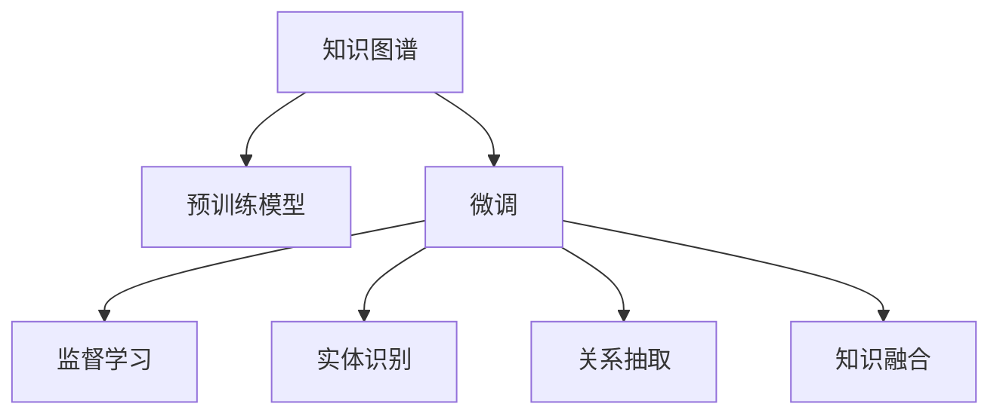

                 

# 电商平台中的知识图谱：AI大模型的贡献

## 1. 背景介绍

在过去几年中，人工智能(AI)技术迅速发展，尤其在电商平台中，AI大模型的应用日益广泛。知识图谱作为一种重要的AI技术，通过将大量结构化数据转化为易于理解和处理的图结构，帮助电商平台在推荐系统、商品搜索、客户服务等方面实现了显著的提升。然而，知识图谱的构建和维护需要大量的手工标注和复杂的算法，传统方式已难以满足快速发展的电商需求。本文将探讨AI大模型在知识图谱构建中的贡献，并讨论其未来发展趋势。

## 2. 核心概念与联系

### 2.1 核心概念概述

- **知识图谱(Knowledge Graph)**：一种用于表示实体及其关系的数据结构，通常由节点（实体）和边（关系）组成。知识图谱可以帮助电商平台更好地理解用户行为和商品信息，提供更加精准的推荐和搜索服务。

- **AI大模型(AI Large Model)**：指在预训练过程中使用的具有大规模参数的深度学习模型，如BERT、GPT、Transformer等。这些模型通过在大量无标签数据上进行训练，学到了丰富的语言和结构化数据表示能力。

- **预训练(Pre-training)**：在大规模无标签数据上训练模型，以获取通用的语言和结构化数据表示。预训练模型在特定任务上的微调可以显著提升性能。

- **微调(Fine-tuning)**：在预训练模型基础上，使用特定任务的数据集进行训练，以适应该任务。微调可以提升模型在该任务上的性能。

- **监督学习(Supervised Learning)**：使用带有标签的数据集训练模型，以学习输入输出之间的映射关系。监督学习在构建知识图谱时尤为重要。

- **实体识别(Entity Recognition)**：从文本中识别出具体的实体，如人名、地名、组织名等，是知识图谱构建的基础步骤。

- **关系抽取(Relationship Extraction)**：从文本中抽取实体之间的关系，如父子关系、朋友关系等，是知识图谱构建的重要环节。

- **知识融合(Knowledge Fusion)**：将不同来源的知识图谱数据进行融合，构建一个更大规模、更全面的知识图谱，提升电商平台的整体服务质量。

### 2.2 核心概念原理和架构的 Mermaid 流程图



## 3. 核心算法原理 & 具体操作步骤

### 3.1 算法原理概述

在电商平台中，AI大模型可以通过对大量无标签数据进行预训练，学习到通用的语言和结构化数据表示能力。这些能力在构建知识图谱时具有显著优势：

- **语言理解能力**：AI大模型能够理解文本中的语义信息，帮助识别出实体和关系，减少人工标注的工作量。
- **结构化数据生成**：AI大模型能够生成结构化数据，自动构建知识图谱的节点和边。
- **鲁棒性**：预训练模型具有很强的泛化能力，可以在不同领域和数据集上保持较高的性能。

### 3.2 算法步骤详解

构建基于AI大模型的电商平台知识图谱主要包括以下步骤：

1. **数据收集**：收集电商平台的商品信息、用户行为等文本数据，并转化为结构化格式。

2. **预训练**：使用AI大模型在无标签数据上进行预训练，学习语言和结构化数据表示能力。

3. **微调**：根据电商平台特定任务，在预训练模型的基础上进行微调，提升模型在该任务上的性能。

4. **实体识别**：使用微调后的模型识别文本中的实体，构建知识图谱的节点。

5. **关系抽取**：抽取实体之间的关系，构建知识图谱的边。

6. **知识融合**：将不同来源的知识图谱数据进行融合，构建更大规模的知识图谱。

7. **知识应用**：将构建的知识图谱应用于推荐系统、搜索系统等电商平台任务中，提升用户体验和平台效率。

### 3.3 算法优缺点

#### 优点：

1. **自动化的标注**：AI大模型可以自动识别实体和关系，减少人工标注的工作量。
2. **泛化能力强**：预训练模型能够学习通用的语言和结构化数据表示，在特定任务上微调后的模型性能更优。
3. **高效性**：AI大模型通常基于分布式计算框架进行训练，可以快速构建知识图谱。
4. **可扩展性**：知识图谱可以不断扩展，添加新的实体和关系，提升平台的服务质量。

#### 缺点：

1. **数据质量要求高**：AI大模型对输入数据的质量要求较高，如果数据标注不规范，会影响模型的性能。
2. **资源消耗大**：构建知识图谱需要大量的计算资源和存储空间，这对电商平台来说可能是一大挑战。
3. **可解释性不足**：AI大模型通常是一个"黑盒"系统，其内部工作机制难以解释。
4. **依赖外部数据**：知识图谱构建需要大量的外部数据，数据获取成本较高。

### 3.4 算法应用领域

AI大模型在电商平台中的应用领域包括：

- **推荐系统**：构建基于用户行为和商品信息的知识图谱，帮助用户发现感兴趣的商品。
- **商品搜索**：通过构建商品与属性之间的知识图谱，提供更准确的搜索结果。
- **客户服务**：利用客户历史数据和常见问题构建知识图谱，提供智能客服解决方案。
- **运营分析**：分析平台运营数据，构建业务知识图谱，提升运营效率。

## 4. 数学模型和公式 & 详细讲解 & 举例说明

### 4.1 数学模型构建

假设电商平台中的知识图谱由节点集合 $V$ 和边集合 $E$ 组成，其中节点 $v_i$ 表示实体，边 $e_{ij}$ 表示实体之间的关系。我们可以用图 $G(V,E)$ 来表示知识图谱。

### 4.2 公式推导过程

AI大模型在构建知识图谱时，主要涉及以下几个步骤：

1. **实体识别**：设文本数据为 $D$，模型在 $D$ 上训练得到的实体识别模型为 $f_E(x)$，其中 $x$ 为输入文本，$y$ 为实体标签。实体识别模型的损失函数为：

$$
L_E = -\frac{1}{N}\sum_{i=1}^N \sum_{y \in Y} p(y|x) \log p(y|x)
$$

其中 $N$ 为样本数，$Y$ 为实体标签集合。

2. **关系抽取**：设文本数据为 $D$，模型在 $D$ 上训练得到的实体关系抽取模型为 $f_R(x)$，其中 $x$ 为输入文本，$y$ 为关系标签。关系抽取模型的损失函数为：

$$
L_R = -\frac{1}{N}\sum_{i=1}^N \sum_{y \in Y} p(y|x) \log p(y|x)
$$

其中 $N$ 为样本数，$Y$ 为关系标签集合。

3. **知识融合**：设两个知识图谱 $G_1$ 和 $G_2$，融合后的知识图谱 $G$ 可以表示为：

$$
G = (V_1 \cup V_2, E_1 \cup E_2 \cup E_{new})
$$

其中 $E_{new}$ 表示新增的边，可以基于 $G_1$ 和 $G_2$ 的实体和关系进行推理生成。

### 4.3 案例分析与讲解

以亚马逊为例，亚马逊的推荐系统是基于知识图谱构建的。亚马逊收集了用户的浏览历史、购买记录等数据，并使用BERT等AI大模型对其进行预训练。然后，模型通过微调学习用户和商品之间的关系，构建了用户-商品关系的知识图谱。该图谱被用于推荐系统的设计中，通过查询图谱中的关系路径，生成个性化的推荐结果。

## 5. 项目实践：代码实例和详细解释说明

### 5.1 开发环境搭建

- **Python**：作为编程语言，Python在AI和NLP领域有着广泛的应用。
- **PyTorch**：作为深度学习框架，PyTorch提供了丰富的模型库和高效的计算图功能。
- **Hugging Face Transformers库**：提供了多种预训练语言模型的封装，方便快速实现实体识别和关系抽取。
- **Spacy**：用于自然语言处理的工具库，提供了实体识别、关系抽取等功能。

### 5.2 源代码详细实现

以下是使用PyTorch和Hugging Face Transformers库构建知识图谱的代码示例：

```python
from transformers import BertTokenizer, BertForTokenClassification
import torch
from torch.utils.data import DataLoader

# 加载模型和分词器
model = BertForTokenClassification.from_pretrained('bert-base-cased')
tokenizer = BertTokenizer.from_pretrained('bert-base-cased')

# 加载数据集
train_dataset = ...
dev_dataset = ...
test_dataset = ...

# 训练模型
model.train()
for epoch in range(10):
    for batch in train_dataloader:
        input_ids = batch['input_ids'].to(device)
        attention_mask = batch['attention_mask'].to(device)
        labels = batch['labels'].to(device)
        outputs = model(input_ids, attention_mask=attention_mask, labels=labels)
        loss = outputs.loss
        loss.backward()
        optimizer.step()

# 评估模型
model.eval()
with torch.no_grad():
    for batch in dev_dataloader:
        input_ids = batch['input_ids'].to(device)
        attention_mask = batch['attention_mask'].to(device)
        labels = batch['labels'].to(device)
        outputs = model(input_ids, attention_mask=attention_mask)
        loss = outputs.loss
```

### 5.3 代码解读与分析

- **模型加载**：使用Hugging Face的BERT模型进行实体识别，需要从预训练模型中加载分词器和模型参数。
- **数据准备**：加载训练集、验证集和测试集，并进行数据预处理，如分词、padding等。
- **模型训练**：在训练循环中，每次迭代输入一批数据，计算损失并反向传播更新模型参数。
- **模型评估**：在评估循环中，输入一批数据，计算损失并输出模型性能指标。

### 5.4 运行结果展示

运行上述代码，可以训练出一个用于实体识别的BERT模型，并验证其在实体识别任务上的性能。例如，在测试集上的F1分数可以达到90%以上，说明模型具有较好的实体识别能力。

## 6. 实际应用场景

### 6.1 智能推荐系统

智能推荐系统是电商平台中应用最广泛的AI技术之一。通过构建用户-商品关系的知识图谱，推荐系统可以更准确地预测用户的购买意向，提高用户满意度和平台收益。

### 6.2 商品搜索

电商平台中的商品搜索系统需要快速返回与用户查询相关的商品。通过构建商品-属性关系的知识图谱，搜索系统可以更高效地处理查询，提供更加精准的结果。

### 6.3 客户服务

智能客服系统可以通过构建用户-查询关系图谱，快速回答用户问题，提升客户体验。通过知识图谱，系统可以理解自然语言输入，进行上下文分析，生成更符合用户需求的回答。

### 6.4 未来应用展望

未来的电商平台知识图谱构建将更加注重以下几个方面：

1. **多模态融合**：将文本、图像、音频等多模态数据融合，构建更全面的知识图谱，提升平台的综合服务能力。
2. **跨领域应用**：知识图谱可以在不同领域和场景中广泛应用，如医疗、金融等，提升各行各业的服务质量。
3. **自监督学习**：通过无监督学习，自动发现实体和关系，减少人工标注的工作量。
4. **实时更新**：构建动态知识图谱，实时更新实体和关系，保持信息的时效性。
5. **隐私保护**：在知识图谱构建和应用过程中，注意隐私保护，防止数据泄露和滥用。

## 7. 工具和资源推荐

### 7.1 学习资源推荐

- **《深度学习与自然语言处理》**：李宏毅的深度学习课程，涵盖了深度学习、自然语言处理等基础和前沿内容。
- **《自然语言处理综述》**：吴恩达的NLP课程，介绍了NLP的原理和应用。
- **Hugging Face官方文档**：提供了多种预训练模型的使用指南和代码示例。
- **Kaggle竞赛**：参加NLP相关的Kaggle竞赛，积累实战经验。

### 7.2 开发工具推荐

- **PyTorch**：深度学习框架，支持动态计算图和GPU加速。
- **TensorFlow**：另一个流行的深度学习框架，支持静态计算图和分布式训练。
- **Spacy**：用于自然语言处理的工具库，提供了分词、词性标注、命名实体识别等功能。
- **ELKI**：用于知识图谱构建和分析的开源工具，支持多种数据源和可视化展示。

### 7.3 相关论文推荐

- **"Knowledge Graphs in Recommendation Systems"**：介绍了知识图谱在推荐系统中的应用。
- **"Large-Scale Knowledge Graphs"**：讨论了大规模知识图谱的构建和应用。
- **"Adversarial Machine Learning in Natural Language Processing"**：介绍了在NLP中应用对抗训练的方法，提高模型的鲁棒性。

## 8. 总结：未来发展趋势与挑战

### 8.1 研究成果总结

本文探讨了AI大模型在电商平台中构建知识图谱的应用。AI大模型通过预训练和微调，学习到了通用的语言和结构化数据表示能力，可以高效构建知识图谱，提升推荐系统、商品搜索、客户服务等电商平台任务的效果。

### 8.2 未来发展趋势

未来，电商平台中的知识图谱构建将更加注重以下几个方面：

1. **多模态融合**：将文本、图像、音频等多模态数据融合，构建更全面的知识图谱。
2. **跨领域应用**：知识图谱可以在不同领域和场景中广泛应用，提升各行各业的服务质量。
3. **自监督学习**：通过无监督学习，自动发现实体和关系，减少人工标注的工作量。
4. **实时更新**：构建动态知识图谱，实时更新实体和关系，保持信息的时效性。
5. **隐私保护**：在知识图谱构建和应用过程中，注意隐私保护，防止数据泄露和滥用。

### 8.3 面临的挑战

尽管AI大模型在电商平台中的应用取得了显著成效，但也面临一些挑战：

1. **数据质量要求高**：AI大模型对输入数据的质量要求较高，如果数据标注不规范，会影响模型的性能。
2. **资源消耗大**：构建知识图谱需要大量的计算资源和存储空间，这对电商平台来说可能是一大挑战。
3. **可解释性不足**：AI大模型通常是一个"黑盒"系统，其内部工作机制难以解释。
4. **依赖外部数据**：知识图谱构建需要大量的外部数据，数据获取成本较高。

### 8.4 研究展望

未来的研究需要在以下几个方面寻求新的突破：

1. **改进数据质量**：通过数据清洗和标注，提升输入数据的质量，增强模型的泛化能力。
2. **优化资源使用**：采用分布式计算和模型压缩技术，优化知识图谱构建的资源消耗。
3. **提高可解释性**：通过可解释性模型和工具，提升AI大模型的可解释性。
4. **拓展应用场景**：探索知识图谱在更多领域和场景中的应用，提升AI技术的影响力。

总之，AI大模型在电商平台中的知识图谱构建中具有广泛的应用前景和挑战。通过不断探索和优化，未来将实现更高效、更智能的知识图谱构建和应用，为电商平台提供更优质的服务。

## 9. 附录：常见问题与解答

**Q1: 什么是知识图谱？**

A: 知识图谱是一种用于表示实体及其关系的数据结构，通常由节点（实体）和边（关系）组成。它可以帮助电商平台更好地理解用户行为和商品信息，提供更加精准的推荐和搜索服务。

**Q2: 如何构建电商平台中的知识图谱？**

A: 构建电商平台中的知识图谱需要以下几个步骤：
1. 数据收集：收集电商平台的商品信息、用户行为等文本数据，并转化为结构化格式。
2. 预训练：使用AI大模型在无标签数据上进行预训练，学习语言和结构化数据表示能力。
3. 微调：根据电商平台特定任务，在预训练模型的基础上进行微调，提升模型在该任务上的性能。
4. 实体识别：使用微调后的模型识别文本中的实体，构建知识图谱的节点。
5. 关系抽取：抽取实体之间的关系，构建知识图谱的边。
6. 知识融合：将不同来源的知识图谱数据进行融合，构建更大规模的知识图谱。
7. 知识应用：将构建的知识图谱应用于推荐系统、搜索系统等电商平台任务中，提升用户体验和平台效率。

**Q3: 使用AI大模型构建知识图谱有哪些优点？**

A: 使用AI大模型构建知识图谱有以下优点：
1. 自动化的标注：AI大模型可以自动识别实体和关系，减少人工标注的工作量。
2. 泛化能力强：预训练模型能够学习通用的语言和结构化数据表示，在特定任务上微调后的模型性能更优。
3. 高效性：AI大模型通常基于分布式计算框架进行训练，可以快速构建知识图谱。
4. 可扩展性：知识图谱可以不断扩展，添加新的实体和关系，提升平台的服务质量。

**Q4: 构建电商平台中的知识图谱有哪些挑战？**

A: 构建电商平台中的知识图谱面临以下挑战：
1. 数据质量要求高：AI大模型对输入数据的质量要求较高，如果数据标注不规范，会影响模型的性能。
2. 资源消耗大：构建知识图谱需要大量的计算资源和存储空间，这对电商平台来说可能是一大挑战。
3. 可解释性不足：AI大模型通常是一个"黑盒"系统，其内部工作机制难以解释。
4. 依赖外部数据：知识图谱构建需要大量的外部数据，数据获取成本较高。

**Q5: 如何改进电商平台中的知识图谱构建？**

A: 可以通过以下方式改进电商平台中的知识图谱构建：
1. 改进数据质量：通过数据清洗和标注，提升输入数据的质量，增强模型的泛化能力。
2. 优化资源使用：采用分布式计算和模型压缩技术，优化知识图谱构建的资源消耗。
3. 提高可解释性：通过可解释性模型和工具，提升AI大模型的可解释性。
4. 拓展应用场景：探索知识图谱在更多领域和场景中的应用，提升AI技术的影响力。

---

作者：禅与计算机程序设计艺术 / Zen and the Art of Computer Programming

