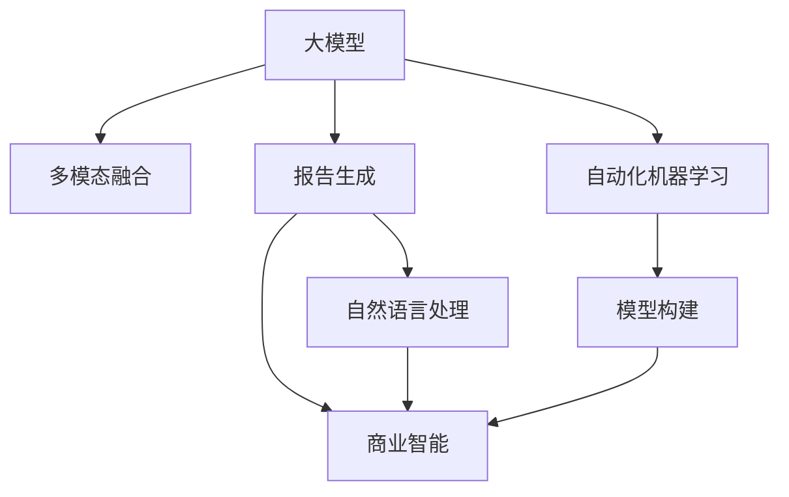

                 

# 电商平台中的自动化报告生成：大模型的创新应用

> 关键词：自动化报告生成,大模型,自然语言处理,电商平台,商业智能,BERT,Transformer,AutoML

## 1. 背景介绍

### 1.1 问题由来
随着电商平台的不断发展，海量业务数据的实时分析和生成报告成为了运营管理的核心需求。传统的报告生成需要大量人工干预和数据处理，效率低下，且难以满足多维度、动态化的分析需求。为此，自动化报告生成技术应运而生，旨在通过大模型和AI算法，实现高效、精准、灵活的报告生成。

在电商平台上，自动化报告生成可以应用于用户行为分析、商品销售预测、库存管理、市场竞争等多个方面，极大地提升了业务运营的智能化水平。然而，如何高效构建自动化报告生成系统，同时兼顾灵活性、可扩展性和低成本，是大模型在电商平台应用的难点之一。

### 1.2 问题核心关键点
大模型在自动化报告生成中的应用，关键在于如何设计高效的模型结构，优化训练过程，保证报告生成的实时性和准确性。以下是主要的关键点：

- 多模态数据融合：电商平台数据来源丰富，包括用户行为数据、销售数据、供应链数据等，如何高效融合多模态数据，是构建自动化报告生成的基础。
- 报告结构设计：不同的业务场景对报告结构的需求不同，需要根据业务需求设计合理的报告模板，同时支持动态生成。
- 高性能模型部署：报告生成需要高效计算和低延迟，因此需要选择性能优异的大模型，并结合高效的推理机制。
- 自动化模型训练：通过自动化机器学习(AutoML)等技术，快速构建和优化模型，提高开发效率。

## 2. 核心概念与联系

### 2.1 核心概念概述

为更好地理解大模型在电商平台中的应用，本节将介绍几个密切相关的核心概念：

- 大模型(Large Model)：以BERT、GPT-3等深度学习模型为代表的大规模预训练模型。通过在海量无标签文本数据上进行预训练，学习到丰富的语言知识和常识，具备强大的语言理解和生成能力。
- 多模态融合(Multimodal Fusion)：将不同模态的数据(如文本、图像、语音等)进行高效融合，提取综合信息，用于报告生成。
- 报告生成(Report Generation)：根据业务需求，自动生成多维度、多格式的报告，支持实时更新。
- 自然语言处理(Natural Language Processing, NLP)：利用自然语言理解和生成技术，自动化生成报告文本。
- 商业智能(Business Intelligence, BI)：利用数据分析、报告生成等技术，辅助企业决策，优化运营管理。
- 自动化机器学习(AutoML)：自动化构建、优化和部署机器学习模型，提高模型构建效率。

这些概念之间的逻辑关系可以通过以下Mermaid流程图来展示：



这个流程图展示了大模型在报告生成中的应用框架：

1. 大模型通过预训练获得基础能力。
2. 多模态融合提取综合信息，用于报告生成。
3. 自然语言处理生成文本报告，辅助商业智能决策。
4. 自动化机器学习实现模型构建优化，提升开发效率。

这些概念共同构成了大模型在电商平台中的应用体系，使其能够在各种场景下发挥强大的文本生成和智能分析能力。通过理解这些核心概念，我们可以更好地把握大模型在电商平台报告生成中的工作原理和优化方向。

## 3. 核心算法原理 & 具体操作步骤
### 3.1 算法原理概述

自动化报告生成本质上是一个基于大模型的多任务自然语言处理任务，涉及文本生成、信息抽取、情感分析等多方面技术。其核心思想是：利用大模型的预训练能力，通过监督学习或自监督学习任务训练，自动生成符合业务需求的报告。

形式化地，假设大模型为 $M_{\theta}$，其中 $\theta$ 为模型参数。在电商平台上，报告生成任务可以分为多个子任务，如用户行为分析、商品销售预测、库存管理等。针对每个子任务，准备相应的训练集 $D=\{(x_i,y_i)\}_{i=1}^N$，其中 $x_i$ 为输入文本或多模态数据，$y_i$ 为标签或目标输出，训练模型使得 $M_{\theta}$ 在 $x$ 上生成最接近 $y$ 的输出。

### 3.2 算法步骤详解

自动化报告生成的一般流程包括以下几个关键步骤：

**Step 1: 数据准备与预处理**
- 收集电商平台业务相关的多模态数据，如用户行为日志、商品销售记录、市场数据等。
- 清洗和标准化数据，去除噪声和无关信息，确保数据质量和一致性。
- 划分数据集为训练集、验证集和测试集，确保模型在独立数据上的泛化性能。

**Step 2: 数据融合与特征提取**
- 利用自然语言处理技术，对文本数据进行分词、词性标注、命名实体识别等预处理。
- 将不同模态的数据进行融合，生成多模态数据集。例如，将用户行为数据与商品销售数据、市场数据结合，构建多维度的业务信息。
- 设计特征提取器，将多模态数据转换为高维特征向量，用于模型训练。

**Step 3: 模型选择与训练**
- 选择适合电商报告生成的预训练语言模型，如BERT、GPT-2等。
- 设计任务适配层，将预训练模型输出转换为报告所需的格式，如生成文本报告、可视化图表等。
- 应用监督学习或自监督学习任务，对模型进行微调。例如，通过生成式任务训练模型生成文本报告，通过分类任务训练模型判断用户行为趋势等。
- 使用AdamW等优化算法，设置适当的学习率、批大小、迭代轮数等超参数，最小化损失函数，使模型输出逼近目标。

**Step 4: 模型评估与部署**
- 在测试集上评估模型性能，根据业务需求设定评估指标，如准确率、召回率、F1分数等。
- 集成模型到自动化报告生成系统，支持在线生成报告。
- 定期更新模型，保持模型性能和实时性。

**Step 5: 持续改进与优化**
- 收集用户反馈和业务数据，定期更新训练数据集，优化模型。
- 引入自动化机器学习(AutoML)技术，自动化构建和优化模型。
- 不断迭代和改进报告生成算法，支持更复杂的业务需求。

### 3.3 算法优缺点

基于大模型的自动化报告生成方法具有以下优点：
1. 高效性。利用预训练模型的高效特征提取能力，可以快速生成高质量报告。
2. 灵活性。支持多模态数据融合，能够处理多种业务需求。
3. 可扩展性。利用大模型和自动化机器学习技术，可以快速构建和优化模型。
4. 可靠性。利用多任务训练，可以提高模型的泛化能力和鲁棒性。

同时，该方法也存在一定的局限性：
1. 依赖标注数据。报告生成任务需要大量高质量的标注数据，难以获得。
2. 对数据质量敏感。数据清洗和标准化需要大量人工干预，容易引入偏差。
3. 模型复杂度高。大模型和深度学习算法的复杂度较高，训练和推理资源需求大。
4. 部署成本高。自动化报告生成系统需要高性能硬件支持，部署成本较高。

尽管存在这些局限性，但大模型在电商平台中的应用仍展示了巨大的潜力。未来相关研究的重点在于如何降低对标注数据的依赖，提高模型的鲁棒性和可扩展性，同时兼顾效率和成本。

### 3.4 算法应用领域

大模型在电商平台中的应用主要集中在以下几个方面：

**1. 用户行为分析**
通过自动化报告生成技术，可以实时分析用户行为数据，生成用户画像、用户流失预警、用户满意度报告等。例如，对用户浏览、购买、评价等行为进行分析，生成用户兴趣报告，帮助企业精准营销和个性化推荐。

**2. 商品销售预测**
利用大模型对历史销售数据进行建模，生成商品销售趋势报告，帮助企业优化库存管理、调整营销策略。例如，对商品销售数据进行时间序列分析，生成销售预测报告，帮助企业提前预见市场变化，优化供应链管理。

**3. 库存管理**
通过自动化报告生成技术，可以实时监测库存数据，生成库存预警、库存优化报告。例如，对不同商品的库存量和销售量进行分析，生成库存预警报告，帮助企业及时调整库存策略，避免库存积压和缺货情况。

**4. 市场竞争分析**
利用大模型分析市场数据，生成市场竞争报告，帮助企业掌握市场动态，制定竞争策略。例如，对竞争对手的商品销售数据进行分析，生成市场竞争报告，帮助企业了解市场竞争态势，优化产品定位和市场策略。

**5. 客户服务支持**
通过自动化报告生成技术，可以快速响应客户服务请求，生成客户服务报告。例如，对客户服务数据进行分析，生成服务质量报告，帮助企业提升客户服务水平，增强客户满意度。

这些应用场景展示了大模型在电商平台中的广泛应用，为企业的运营管理和决策支持提供了有力工具。

## 4. 数学模型和公式 & 详细讲解  
### 4.1 数学模型构建

本节将使用数学语言对自动化报告生成过程进行更加严格的刻画。

假设报告生成任务包括多个子任务 $T_1, T_2, \cdots, T_k$，针对每个任务 $T_i$，收集相应的训练集 $D_i=\{(x_i,y_i)\}_{i=1}^N$。模型在训练集上的损失函数定义为：

$$
\mathcal{L}(\theta) = \sum_{i=1}^k \mathcal{L}_i(\theta, D_i)
$$

其中 $\mathcal{L}_i$ 为任务 $T_i$ 的损失函数，用于衡量模型在 $T_i$ 上的预测性能。假设模型 $M_{\theta}$ 在输入 $x$ 上的输出为 $\hat{y}$，真实标签为 $y$，则任务 $T_i$ 的损失函数可以表示为：

$$
\mathcal{L}_i(\theta, D_i) = \frac{1}{N}\sum_{i=1}^N \ell_i(M_{\theta}(x_i), y_i)
$$

例如，对于用户行为分析任务，可以使用生成式任务训练模型生成用户兴趣报告；对于商品销售预测任务，可以使用回归任务训练模型预测商品销售量。根据任务的不同，选择合适的损失函数，如交叉熵损失、均方误差损失等。

### 4.2 公式推导过程

以下我们以用户行为分析任务为例，推导生成式任务损失函数及其梯度计算公式。

假设模型 $M_{\theta}$ 在输入 $x$ 上的输出为 $\hat{y}=M_{\theta}(x)$，表示用户行为的概率分布。真实标签 $y \in \{1,0\}$，表示用户是否流失。则二分类交叉熵损失函数定义为：

$$
\ell_i(M_{\theta}(x), y) = -[y\log \hat{y} + (1-y)\log(1-\hat{y})]
$$

将其代入经验风险公式，得：

$$
\mathcal{L}_i(\theta) = -\frac{1}{N}\sum_{i=1}^N [y_i\log M_{\theta}(x_i)+(1-y_i)\log(1-M_{\theta}(x_i))]
$$

根据链式法则，损失函数对参数 $\theta_k$ 的梯度为：

$$
\frac{\partial \mathcal{L}_i(\theta)}{\partial \theta_k} = -\frac{1}{N}\sum_{i=1}^N \frac{y_i}{\hat{y}_i}-\frac{1-y_i}{1-\hat{y}_i} \frac{\partial M_{\theta}(x_i)}{\partial \theta_k}
$$

其中 $\frac{\partial M_{\theta}(x_i)}{\partial \theta_k}$ 可进一步递归展开，利用自动微分技术完成计算。

在得到损失函数的梯度后，即可带入参数更新公式，完成模型的迭代优化。重复上述过程直至收敛，最终得到适应电商报告生成任务的最优模型参数 $\theta^*$。

## 5. 项目实践：代码实例和详细解释说明
### 5.1 开发环境搭建

在进行自动化报告生成实践前，我们需要准备好开发环境。以下是使用Python进行PyTorch开发的环境配置流程：

1. 安装Anaconda：从官网下载并安装Anaconda，用于创建独立的Python环境。

2. 创建并激活虚拟环境：
```bash
conda create -n pytorch-env python=3.8 
conda activate pytorch-env
```

3. 安装PyTorch：根据CUDA版本，从官网获取对应的安装命令。例如：
```bash
conda install pytorch torchvision torchaudio cudatoolkit=11.1 -c pytorch -c conda-forge
```

4. 安装各类工具包：
```bash
pip install numpy pandas scikit-learn matplotlib tqdm jupyter notebook ipython
```

完成上述步骤后，即可在`pytorch-env`环境中开始自动化报告生成实践。

### 5.2 源代码详细实现

这里我们以用户行为分析任务为例，给出使用PyTorch对BERT模型进行微调的PyTorch代码实现。

首先，定义用户行为分析任务的数据处理函数：

```python
from transformers import BertTokenizer
from torch.utils.data import Dataset
import torch

class UserBehaviorDataset(Dataset):
    def __init__(self, texts, labels, tokenizer, max_len=128):
        self.texts = texts
        self.labels = labels
        self.tokenizer = tokenizer
        self.max_len = max_len
        
    def __len__(self):
        return len(self.texts)
    
    def __getitem__(self, item):
        text = self.texts[item]
        label = self.labels[item]
        
        encoding = self.tokenizer(text, return_tensors='pt', max_length=self.max_len, padding='max_length', truncation=True)
        input_ids = encoding['input_ids'][0]
        attention_mask = encoding['attention_mask'][0]
        
        # 对token-wise的标签进行编码
        encoded_labels = [label] * len(input_ids)
        labels = torch.tensor(encoded_labels, dtype=torch.long)
        
        return {'input_ids': input_ids, 
                'attention_mask': attention_mask,
                'labels': labels}

# 标签与id的映射
label2id = {'流失': 1, '未流失': 0}
id2label = {v: k for k, v in label2id.items()}

# 创建dataset
tokenizer = BertTokenizer.from_pretrained('bert-base-cased')

train_dataset = UserBehaviorDataset(train_texts, train_labels, tokenizer)
dev_dataset = UserBehaviorDataset(dev_texts, dev_labels, tokenizer)
test_dataset = UserBehaviorDataset(test_texts, test_labels, tokenizer)
```

然后，定义模型和优化器：

```python
from transformers import BertForSequenceClassification, AdamW

model = BertForSequenceClassification.from_pretrained('bert-base-cased', num_labels=len(label2id))

optimizer = AdamW(model.parameters(), lr=2e-5)
```

接着，定义训练和评估函数：

```python
from torch.utils.data import DataLoader
from tqdm import tqdm
from sklearn.metrics import classification_report

device = torch.device('cuda') if torch.cuda.is_available() else torch.device('cpu')
model.to(device)

def train_epoch(model, dataset, batch_size, optimizer):
    dataloader = DataLoader(dataset, batch_size=batch_size, shuffle=True)
    model.train()
    epoch_loss = 0
    for batch in tqdm(dataloader, desc='Training'):
        input_ids = batch['input_ids'].to(device)
        attention_mask = batch['attention_mask'].to(device)
        labels = batch['labels'].to(device)
        model.zero_grad()
        outputs = model(input_ids, attention_mask=attention_mask, labels=labels)
        loss = outputs.loss
        epoch_loss += loss.item()
        loss.backward()
        optimizer.step()
    return epoch_loss / len(dataloader)

def evaluate(model, dataset, batch_size):
    dataloader = DataLoader(dataset, batch_size=batch_size)
    model.eval()
    preds, labels = [], []
    with torch.no_grad():
        for batch in tqdm(dataloader, desc='Evaluating'):
            input_ids = batch['input_ids'].to(device)
            attention_mask = batch['attention_mask'].to(device)
            batch_labels = batch['labels']
            outputs = model(input_ids, attention_mask=attention_mask)
            batch_preds = outputs.logits.argmax(dim=1).to('cpu').tolist()
            batch_labels = batch_labels.to('cpu').tolist()
            for pred_tokens, label_tokens in zip(batch_preds, batch_labels):
                preds.append(pred_tokens[:len(label_tokens)])
                labels.append(label_tokens)
                
    print(classification_report(labels, preds))
```

最后，启动训练流程并在测试集上评估：

```python
epochs = 5
batch_size = 16

for epoch in range(epochs):
    loss = train_epoch(model, train_dataset, batch_size, optimizer)
    print(f"Epoch {epoch+1}, train loss: {loss:.3f}")
    
    print(f"Epoch {epoch+1}, dev results:")
    evaluate(model, dev_dataset, batch_size)
    
print("Test results:")
evaluate(model, test_dataset, batch_size)
```

以上就是使用PyTorch对BERT进行用户行为分析任务微调的完整代码实现。可以看到，得益于Transformers库的强大封装，我们可以用相对简洁的代码完成BERT模型的加载和微调。

### 5.3 代码解读与分析

让我们再详细解读一下关键代码的实现细节：

**UserBehaviorDataset类**：
- `__init__`方法：初始化文本、标签、分词器等关键组件。
- `__len__`方法：返回数据集的样本数量。
- `__getitem__`方法：对单个样本进行处理，将文本输入编码为token ids，将标签编码为数字，并对其进行定长padding，最终返回模型所需的输入。

**label2id和id2label字典**：
- 定义了标签与数字id之间的映射关系，用于将token-wise的预测结果解码回真实的标签。

**训练和评估函数**：
- 使用PyTorch的DataLoader对数据集进行批次化加载，供模型训练和推理使用。
- 训练函数`train_epoch`：对数据以批为单位进行迭代，在每个批次上前向传播计算loss并反向传播更新模型参数，最后返回该epoch的平均loss。
- 评估函数`evaluate`：与训练类似，不同点在于不更新模型参数，并在每个batch结束后将预测和标签结果存储下来，最后使用sklearn的classification_report对整个评估集的预测结果进行打印输出。

**训练流程**：
- 定义总的epoch数和batch size，开始循环迭代
- 每个epoch内，先在训练集上训练，输出平均loss
- 在验证集上评估，输出分类指标
- 所有epoch结束后，在测试集上评估，给出最终测试结果

可以看到，PyTorch配合Transformers库使得BERT微调的代码实现变得简洁高效。开发者可以将更多精力放在数据处理、模型改进等高层逻辑上，而不必过多关注底层的实现细节。

当然，工业级的系统实现还需考虑更多因素，如模型的保存和部署、超参数的自动搜索、更灵活的任务适配层等。但核心的微调范式基本与此类似。

## 6. 实际应用场景
### 6.1 智能客服系统

在智能客服系统中，自动化报告生成技术可以用于生成客户服务报告。传统客服系统往往需要大量人力，且响应速度和一致性难以保证。而利用自动化报告生成技术，可以实时监测客户服务数据，自动生成服务质量报告，帮助客服中心优化服务流程，提升客户满意度。

例如，对客户服务历史数据进行分析，生成服务质量报告，帮助客服中心识别服务瓶颈，优化服务流程，提升客户满意度。具体而言，可以对客户服务时长、服务质量评分、服务处理时间等数据进行分析，生成服务质量报告，帮助客服中心识别服务瓶颈，优化服务流程。

### 6.2 商品销售预测

在商品销售预测中，自动化报告生成技术可以用于生成销售预测报告。电商平台的商品销售预测需要实时分析市场趋势和用户行为，生成准确的销售预测报告，帮助企业优化库存管理和营销策略。

例如，对历史销售数据进行分析，生成销售预测报告，帮助企业提前预见市场变化，优化库存管理和营销策略。具体而言，可以对不同商品的销售量、用户行为数据、市场数据进行分析，生成销售预测报告，帮助企业提前预见市场变化，优化库存管理和营销策略。

### 6.3 库存管理

在库存管理中，自动化报告生成技术可以用于生成库存预警报告。电商平台的库存管理需要实时监测库存数据，生成库存预警报告，帮助企业及时调整库存策略，避免库存积压和缺货情况。

例如，对库存数据进行分析，生成库存预警报告，帮助企业及时调整库存策略。具体而言，可以对不同商品的库存量和销售量进行分析，生成库存预警报告，帮助企业及时调整库存策略，避免库存积压和缺货情况。

### 6.4 市场竞争分析

在市场竞争分析中，自动化报告生成技术可以用于生成市场竞争报告。电商平台的市场竞争分析需要实时分析市场数据，生成市场竞争报告，帮助企业掌握市场动态，制定竞争策略。

例如，对竞争对手的商品销售数据进行分析，生成市场竞争报告，帮助企业了解市场竞争态势。具体而言，可以对竞争对手的商品销售数据进行分析，生成市场竞争报告，帮助企业了解市场竞争态势，优化产品定位和市场策略。

### 6.5 用户行为分析

在用户行为分析中，自动化报告生成技术可以用于生成用户行为分析报告。电商平台的用户行为分析需要实时分析用户行为数据，生成用户行为分析报告，帮助企业了解用户行为，优化用户体验。

例如，对用户行为数据进行分析，生成用户行为分析报告，帮助企业了解用户行为。具体而言，可以对用户浏览、购买、评价等行为进行分析，生成用户行为分析报告，帮助企业了解用户行为，优化用户体验。

这些应用场景展示了大模型在电商平台中的广泛应用，为企业的运营管理和决策支持提供了有力工具。

## 7. 工具和资源推荐
### 7.1 学习资源推荐

为了帮助开发者系统掌握自动化报告生成的大模型技术，这里推荐一些优质的学习资源：

1. 《Transformer从原理到实践》系列博文：由大模型技术专家撰写，深入浅出地介绍了Transformer原理、BERT模型、生成式任务等前沿话题。

2. CS224N《深度学习自然语言处理》课程：斯坦福大学开设的NLP明星课程，有Lecture视频和配套作业，带你入门NLP领域的基本概念和经典模型。

3. 《Natural Language Processing with Transformers》书籍：Transformers库的作者所著，全面介绍了如何使用Transformers库进行NLP任务开发，包括生成式任务在内的诸多范式。

4. HuggingFace官方文档：Transformers库的官方文档，提供了海量预训练模型和完整的生成式任务样例代码，是上手实践的必备资料。

5. CLUE开源项目：中文语言理解测评基准，涵盖大量不同类型的中文NLP数据集，并提供了基于生成式任务的baseline模型，助力中文NLP技术发展。

通过对这些资源的学习实践，相信你一定能够快速掌握自动化报告生成的大模型技术，并用于解决实际的NLP问题。
###  7.2 开发工具推荐

高效的开发离不开优秀的工具支持。以下是几款用于自动化报告生成的大模型开发的常用工具：

1. PyTorch：基于Python的开源深度学习框架，灵活动态的计算图，适合快速迭代研究。大部分预训练语言模型都有PyTorch版本的实现。

2. TensorFlow：由Google主导开发的开源深度学习框架，生产部署方便，适合大规模工程应用。同样有丰富的预训练语言模型资源。

3. Transformers库：HuggingFace开发的NLP工具库，集成了众多SOTA语言模型，支持PyTorch和TensorFlow，是进行生成式任务开发的利器。

4. Weights & Biases：模型训练的实验跟踪工具，可以记录和可视化模型训练过程中的各项指标，方便对比和调优。与主流深度学习框架无缝集成。

5. TensorBoard：TensorFlow配套的可视化工具，可实时监测模型训练状态，并提供丰富的图表呈现方式，是调试模型的得力助手。

6. Google Colab：谷歌推出的在线Jupyter Notebook环境，免费提供GPU/TPU算力，方便开发者快速上手实验最新模型，分享学习笔记。

合理利用这些工具，可以显著提升自动化报告生成任务的开发效率，加快创新迭代的步伐。

### 7.3 相关论文推荐

自动化报告生成技术的发展源于学界的持续研究。以下是几篇奠基性的相关论文，推荐阅读：

1. Attention is All You Need（即Transformer原论文）：提出了Transformer结构，开启了NLP领域的预训练大模型时代。

2. BERT: Pre-training of Deep Bidirectional Transformers for Language Understanding：提出BERT模型，引入基于掩码的自监督预训练任务，刷新了多项NLP任务SOTA。

3. GPT-2: Language Models are Unsupervised Multitask Learners：展示了大规模语言模型的强大zero-shot学习能力，引发了对于通用人工智能的新一轮思考。

4. SEQ2SEQ Model Generation：利用Seq2Seq模型进行文本生成，广泛应用于自动摘要、机器翻译等任务。

5. GPT-3: Language Models are Unsupervised Multitask Learners（续）：在GPT-2的基础上，进一步提高了语言生成能力，刷新了多项NLP任务SOTA。

6. Transformer-XL: Attentive Language Models for Longer Sequences：提出Transformer-XL结构，支持更长序列的文本生成。

这些论文代表了大模型在自动化报告生成技术的发展脉络。通过学习这些前沿成果，可以帮助研究者把握学科前进方向，激发更多的创新灵感。

## 8. 总结：未来发展趋势与挑战

### 8.1 总结

本文对基于大模型的自动化报告生成技术进行了全面系统的介绍。首先阐述了自动化报告生成在电商平台中的应用背景和意义，明确了自动化报告生成技术在提升业务运营效率和决策支持方面的独特价值。其次，从原理到实践，详细讲解了生成式任务的数学原理和关键步骤，给出了自动化报告生成任务的完整代码实例。同时，本文还广泛探讨了自动化报告生成技术在智能客服、商品销售预测、库存管理等多个行业领域的应用前景，展示了自动化报告生成技术的巨大潜力。此外，本文精选了自动化报告生成技术的各类学习资源，力求为读者提供全方位的技术指引。

通过本文的系统梳理，可以看到，基于大模型的自动化报告生成技术正在成为电商平台的关键技术，极大地提升了业务运营的智能化水平。未来，伴随预训练语言模型和生成式任务的持续演进，基于大模型的自动化报告生成技术必将在更广泛的应用领域大放异彩，深刻影响人类的生产生活方式。

### 8.2 未来发展趋势

展望未来，大模型在自动化报告生成领域将呈现以下几个发展趋势：

1. 模型规模持续增大。随着算力成本的下降和数据规模的扩张，预训练语言模型的参数量还将持续增长。超大规模语言模型蕴含的丰富语言知识，有望支撑更加复杂多变的生成式任务。

2. 生成式任务多样化。除了传统的文本生成任务，未来会涌现更多多模态生成任务，如文本-图像生成、文本-语音生成等，为自动化报告生成技术带来新的方向。

3. 多任务协同优化。未来的自动化报告生成技术将更多地融合多任务学习，通过联合训练提升生成效果，如联合训练生成式任务和分类任务，提升模型在生成和分类任务上的性能。

4. 数据驱动优化。利用自动化机器学习技术，自动化构建和优化生成式模型，提高模型构建效率和性能。

5. 实时生成和推理。未来的自动化报告生成技术将支持实时生成和推理，实现快速响应用户需求。

6. 零样本和少样本生成。通过迁移学习和提示学习技术，利用预训练模型的知识，实现零样本和少样本生成，进一步提升生成效果。

这些趋势凸显了大模型在自动化报告生成领域的应用前景。这些方向的探索发展，必将进一步提升自动化报告生成技术的性能和应用范围，为电商平台的运营管理和决策支持提供更强的支持。

### 8.3 面临的挑战

尽管大模型在自动化报告生成领域展示了巨大的潜力，但在迈向更加智能化、普适化应用的过程中，它仍面临着诸多挑战：

1. 数据依赖性。自动化报告生成需要大量高质量标注数据，数据收集和清洗成本较高。如何降低数据依赖性，利用无监督或半监督学习技术，将是一大难题。

2. 模型泛化能力。当前自动化报告生成模型对标注数据和测试数据的泛化能力不足，难以处理新出现的业务需求。如何提高模型的泛化能力，增强模型的适应性，仍需进一步研究。

3. 推理效率。大模型虽然精度高，但在实际部署时往往面临推理速度慢、内存占用大等效率问题。如何优化模型推理效率，减小内存占用，提升实时性，将是重要的优化方向。

4. 可解释性。自动化报告生成模型通常缺乏可解释性，难以对其生成过程进行分析和调试。如何赋予模型更强的可解释性，提高模型的可信度，将是亟待攻克的难题。

5. 安全性。自动化报告生成模型可能会学习到有害信息，产生误导性输出，给实际应用带来安全隐患。如何消除模型偏见，避免恶意用途，确保输出安全，也将是重要的研究课题。

6. 多模态融合。自动化报告生成技术需要融合多模态数据，如文本、图像、语音等，但不同模态数据之间的融合和理解仍是难点。如何实现高效的多模态融合，提高数据利用效率，将是重要的研究方向。

这些挑战凸显了大模型在自动化报告生成领域的应用瓶颈。这些问题的解决将依赖于技术创新和应用实践的不断积累，相信随着学界和产业界的共同努力，这些问题终将一一被克服，大模型必将在自动化报告生成领域发挥更大的作用。

### 8.4 未来突破

面对自动化报告生成所面临的种种挑战，未来的研究需要在以下几个方面寻求新的突破：

1. 探索无监督和半监督生成式任务。摆脱对大规模标注数据的依赖，利用自监督学习、主动学习等无监督和半监督范式，最大限度利用非结构化数据，实现更加灵活高效的生成任务。

2. 研究高效的多模态融合技术。利用多模态融合技术，实现文本、图像、语音等不同模态数据的有效整合，提升数据利用效率和生成效果。

3. 融合因果和对比学习范式。通过引入因果推断和对比学习思想，增强生成式模型建立稳定因果关系的能力，学习更加普适、鲁棒的语言表征，从而提升模型泛化性和抗干扰能力。

4. 引入更多先验知识。将符号化的先验知识，如知识图谱、逻辑规则等，与神经网络模型进行巧妙融合，引导生成式模型学习更准确、合理的语言模型。

5. 结合因果分析和博弈论工具。将因果分析方法引入生成式模型，识别出模型决策的关键特征，增强输出解释的因果性和逻辑性。借助博弈论工具刻画人机交互过程，主动探索并规避模型的脆弱点，提高系统稳定性。

6. 纳入伦理道德约束。在生成式模型训练目标中引入伦理导向的评估指标，过滤和惩罚有害的输出倾向。同时加强人工干预和审核，建立模型行为的监管机制，确保输出符合人类价值观和伦理道德。

这些研究方向的探索，必将引领自动化报告生成技术迈向更高的台阶，为电商平台的运营管理和决策支持提供更强的支持。面向未来，自动化报告生成技术还需要与其他人工智能技术进行更深入的融合，如知识表示、因果推理、强化学习等，多路径协同发力，共同推动自然语言理解和智能交互系统的进步。只有勇于创新、敢于突破，才能不断拓展语言模型的边界，让智能技术更好地造福人类社会。

## 9. 附录：常见问题与解答

**Q1：自动化报告生成是否适用于所有NLP任务？**

A: 自动化报告生成在大模型中的应用主要集中在生成式任务，如文本生成、翻译、摘要等。对于分类、匹配等任务，通常通过预训练模型直接进行推理，不涉及生成式训练。但实际应用中，可以根据具体需求选择适合的生成式任务。

**Q2：自动化报告生成对数据质量要求高吗？**

A: 是的，自动化报告生成对数据质量有较高要求。数据清洗和标准化需要大量人工干预，容易引入噪声和偏差。因此，收集高质量、多样化的数据，是保证生成效果的重要前提。

**Q3：自动化报告生成的推理效率高吗？**

A: 目前大模型的推理效率仍存在一定的瓶颈，特别是在处理长序列和复杂任务时。需要引入优化技术，如剪枝、量化、混合精度训练等，以提升推理速度和效率。

**Q4：自动化报告生成的可解释性如何？**

A: 目前自动化报告生成模型通常缺乏可解释性，难以对其生成过程进行分析和调试。未来需要引入可解释性技术，如注意力机制、交互式解释等，提高模型的透明性和可信度。

**Q5：自动化报告生成的安全性有保障吗？**

A: 自动化报告生成模型的安全性需要综合考虑数据来源、模型训练和使用场景。引入隐私保护技术，如数据脱敏、差分隐私等，可以增强模型安全性。同时，建立模型行为监管机制，防止模型输出有害信息。

通过本文的系统梳理，可以看到，基于大模型的自动化报告生成技术正在成为电商平台的关键技术，极大地提升了业务运营的智能化水平。未来，伴随预训练语言模型和生成式任务的持续演进，基于大模型的自动化报告生成技术必将在更广泛的应用领域大放异彩，深刻影响人类的生产生活方式。

