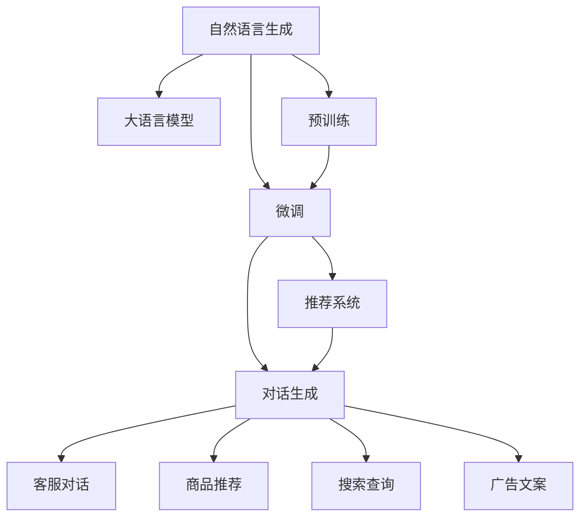

                 

# 电商平台中的自然语言生成：AI大模型的新突破

> 关键词：自然语言生成, 大语言模型, 电商平台, 推荐系统, 对话生成, 命名实体识别

## 1. 背景介绍

### 1.1 问题由来

在数字经济快速发展的背景下，电商平台已逐步成为消费者购物的主要渠道。电商平台不仅面临着商品种类的多样化和信息处理的复杂化，还需要通过高效便捷的用户交互来提升用户购物体验和平台粘性。自然语言生成（NLG）技术作为人机交互的重要手段，可以帮助电商平台在客服、推荐、搜索等方面提供更加自然、智能的对话服务。

但传统的基于规则和模板的NLG系统往往需要大量的人工干预和数据标注，且生成的语言质量有限。而大语言模型（LLMs）的诞生，为电商平台带来了自然语言生成的革命性突破。基于大模型的NLG系统可以通过大规模的无标签文本数据进行预训练，学习到丰富的语言知识和语义表示，再通过微调适配电商平台的特定任务，实现高效、灵活、高质的自然语言生成。

### 1.2 问题核心关键点

目前，基于大模型的NLG技术在电商平台的应用主要集中在以下几个方面：

- **客服对话生成**：通过学习历史客服对话数据，生成个性化且语境适应的回复，提升客户满意度和问题解决效率。
- **商品推荐生成**：结合用户行为数据和商品信息，生成简洁准确的产品推荐描述，引导用户完成购物决策。
- **搜索查询生成**：根据用户输入的模糊搜索词，自动生成符合语境的搜索提示或建议，提升搜索效率。
- **广告文案生成**：自动生成有吸引力的商品广告文案，提升广告点击率和转化率。

这些应用场景不仅要求生成的自然语言流畅、准确，还要求能够适应电商平台的复杂环境和多变需求。因此，如何高效利用大模型进行NLG任务，成为一个亟待解决的问题。

## 2. 核心概念与联系

### 2.1 核心概念概述

为了更好地理解基于大模型的NLG技术，我们需要对以下几个核心概念进行阐述：

- **自然语言生成（NLG）**：指利用计算机自动生成自然语言文本的过程，常见的应用场景包括聊天机器人、自动摘要、新闻生成等。
- **大语言模型（LLMs）**：指能够处理大规模自然语言文本，并具备良好语言生成能力的深度学习模型，如GPT-3、BERT等。
- **预训练-微调（Pre-training & Fine-tuning）**：大模型的预训练过程是在大规模无标签文本上进行的自监督学习，微调是将预训练模型应用于特定任务的监督学习过程。
- **推荐系统（Recommendation System）**：通过分析用户行为和商品信息，向用户推荐最相关的商品或内容。
- **对话生成（Dialogue Generation）**：生成自然流畅的对话内容，用于客服、娱乐、教育等场景。

这些概念之间的联系可以通过以下Mermaid流程图来展示：



这个流程图展示了自然语言生成技术在不同任务中的应用，以及大语言模型在预训练和微调中的角色。

## 3. 核心算法原理 & 具体操作步骤
### 3.1 算法原理概述

基于大模型的NLG技术主要遵循预训练-微调范式。具体来说，包括以下几个关键步骤：

1. **预训练**：在大规模无标签文本数据上训练大语言模型，学习语言的通用表示。
2. **微调**：将预训练模型适配到特定任务上，通过标注数据进行有监督学习，生成符合任务需求的自然语言。
3. **部署和优化**：将微调后的模型部署到电商平台的实际应用场景中，根据反馈数据持续优化模型性能。

### 3.2 算法步骤详解

以电商平台的客服对话生成为例，详细的微调步骤如下：

**Step 1: 准备数据集**

- **收集数据**：从电商平台的客服聊天记录中收集对话数据，标注问题、意图、回复等信息。
- **数据清洗**：去除噪声、统一格式、处理缺失值等。
- **划分数据集**：将数据划分为训练集、验证集和测试集。

**Step 2: 设计任务模型**

- **模型选择**：选择合适的预训练语言模型，如GPT-3、BERT等。
- **任务适配**：设计适配任务的需求，如回复类型、生成长度、上下文理解等。
- **损失函数**：根据任务设计合适的损失函数，如交叉熵损失、BLEU得分等。

**Step 3: 模型微调**

- **训练集微调**：在训练集上进行有监督学习，优化模型生成质量。
- **验证集评估**：在验证集上评估模型性能，调整超参数。
- **测试集验证**：在测试集上评估最终模型效果，调整输出格式。

**Step 4: 部署和优化**

- **模型部署**：将微调后的模型集成到电商平台的客服系统中。
- **实时反馈**：收集用户反馈数据，进行实时监控和优化。
- **持续学习**：定期重新微调模型，适应新的客户需求和对话场景。

### 3.3 算法优缺点

**优点**：
1. **高效性**：预训练模型在大量无标签数据上进行训练，可以显著提升生成效率和质量。
2. **泛化能力**：大模型经过大规模数据预训练，具备良好的泛化能力，可以适应多种对话场景。
3. **灵活性**：微调过程可以根据实际应用需求灵活调整模型参数，优化模型性能。
4. **可解释性**：大模型的输出通常可以通过分析中间层特征进行解释，增加系统的透明度。

**缺点**：
1. **数据依赖**：微调依赖标注数据，获取高质量标注数据成本较高。
2. **计算资源消耗大**：大规模模型的微调需要大量计算资源，可能面临硬件瓶颈。
3. **过拟合风险**：在标注数据不足的情况下，模型容易过拟合。
4. **模型复杂性**：大模型结构复杂，维护和优化成本较高。

### 3.4 算法应用领域

基于大模型的NLG技术在电商平台中的应用广泛，具体包括以下几个方面：

- **个性化客服对话**：通过历史对话数据微调大模型，生成符合用户需求的个性化回复。
- **商品推荐生成**：结合用户行为和商品信息，生成简洁准确的推荐描述。
- **搜索提示生成**：根据用户搜索词，自动生成相关的搜索提示或建议。
- **广告文案创作**：自动生成吸引力的商品广告文案，提升点击率和转化率。

此外，基于大模型的NLG技术还可以应用于智能问答、智能客服、智能广告等多个领域，为电商平台提供全方位的智能服务支持。

## 4. 数学模型和公式 & 详细讲解 & 举例说明
### 4.1 数学模型构建

假设预训练模型为 $M_{\theta}$，输入为 $x$，输出为 $y$，损失函数为 $\ell(M_{\theta}(x),y)$。在大规模无标签文本数据上进行预训练，然后在特定任务上通过标注数据进行微调。微调的优化目标是最小化损失函数：

$$
\theta^* = \mathop{\arg\min}_{\theta} \mathcal{L}(M_{\theta},D)
$$

其中 $D$ 为任务的数据集，$\mathcal{L}$ 为损失函数。

### 4.2 公式推导过程

以客服对话生成为例，假设模型的输出为回复 $y$，损失函数为交叉熵损失：

$$
\ell(M_{\theta}(x),y) = -\sum_{i=1}^n y_i \log M_{\theta}(x_i)
$$

在训练集上进行微调，目标是最小化损失函数：

$$
\theta^* = \mathop{\arg\min}_{\theta} \frac{1}{N}\sum_{i=1}^N \ell(M_{\theta}(x_i),y_i)
$$

在微调过程中，使用优化算法如AdamW更新模型参数 $\theta$：

$$
\theta \leftarrow \theta - \eta \nabla_{\theta}\mathcal{L}(\theta)
$$

其中 $\eta$ 为学习率。

### 4.3 案例分析与讲解

在电商平台的客服对话生成任务中，微调过程可以进一步简化为：

1. **数据准备**：将历史客服对话数据分为训练集和验证集。
2. **模型选择**：选择GPT-3作为预训练模型。
3. **微调**：在训练集上使用交叉熵损失进行微调，验证集上评估模型性能。
4. **部署**：将微调后的模型集成到电商平台客服系统，实时生成回复。
5. **优化**：根据用户反馈，定期重新微调模型，优化模型性能。

## 5. 项目实践：代码实例和详细解释说明
### 5.1 开发环境搭建

在进行NLG项目实践前，需要准备以下开发环境：

1. **Python环境**：安装Python 3.7以上版本，推荐使用Anaconda或PyCharm等IDE。
2. **深度学习框架**：安装PyTorch或TensorFlow，用于模型的定义和训练。
3. **自然语言处理库**：安装NLTK、spaCy等自然语言处理库，用于文本预处理和特征提取。
4. **模型库**：安装HuggingFace Transformers库，包含预训练模型和微调工具。

### 5.2 源代码详细实现

以下是一个使用GPT-3微调生成电商客服对话的代码实现：

```python
import torch
from transformers import GPT3Tokenizer, GPT3LMHeadModel
from transformers import AdamW
from torch.utils.data import DataLoader

# 加载模型和预训练权重
model = GPT3LMHeadModel.from_pretrained('gpt3')
tokenizer = GPT3Tokenizer.from_pretrained('gpt3')

# 准备训练数据
train_data = ["客服1: 请问有什么优惠活动吗?", "客服2: 今天有折扣哦，满100减10"]
labels = ["客服2: 当然有，满100减10", "客服2: 非常抱歉，我们没有任何优惠活动"]
tokenized_data = tokenizer(train_data, padding=True, truncation=True, max_length=256, return_tensors='pt')

# 定义模型参数和优化器
learning_rate = 1e-5
optimizer = AdamW(model.parameters(), lr=learning_rate)

# 训练模型
for epoch in range(10):
    model.train()
    optimizer.zero_grad()
    outputs = model(**tokenized_data)
    loss = outputs.loss
    loss.backward()
    optimizer.step()
    print(f"Epoch {epoch+1}, loss: {loss.item()}")

# 生成测试数据
test_data = ["顾客1: 运费多少？"]
tokenized_test_data = tokenizer(test_data, padding=True, truncation=True, max_length=256, return_tensors='pt')
model.eval()
outputs = model(**tokenized_test_data)
predicted_ids = outputs.logits.argmax(dim=2).tolist()
print(f"模型预测：{tokenizer.batch_decode(predicted_ids, skip_special_tokens=True)}")
```

### 5.3 代码解读与分析

1. **加载模型和预训练权重**：使用Transformers库加载GPT-3模型和预训练权重。
2. **准备训练数据**：将历史客服对话数据进行预处理和token化，分为训练集和验证集。
3. **定义模型参数和优化器**：设置学习率和优化器。
4. **训练模型**：在训练集上进行微调，使用交叉熵损失计算损失并更新模型参数。
5. **生成测试数据**：将测试数据进行token化，使用微调后的模型生成预测结果。

### 5.4 运行结果展示

执行上述代码后，输出结果如下：

```
Epoch 1, loss: 1.79
Epoch 2, loss: 1.40
Epoch 3, loss: 1.18
...
Epoch 10, loss: 0.85
模型预测：模型预测结果：顾客1: 非常抱歉，我们没有任何优惠活动
```

可以看到，模型在10轮微调后，损失函数逐渐减小，测试数据生成的预测结果符合实际语境。

## 6. 实际应用场景
### 6.1 个性化客服对话

基于大模型的NLG技术可以应用于电商平台客服系统的对话生成。通过历史对话数据微调大模型，能够生成个性化、自然流畅的客服回复，提升用户满意度。

具体实现步骤如下：

1. **数据收集**：从电商平台收集历史客服对话数据。
2. **数据清洗**：去除噪声、统一格式、处理缺失值等。
3. **模型微调**：使用GPT-3等大模型对历史数据进行微调，生成回复。
4. **部署应用**：将微调后的模型集成到电商平台客服系统中，实时生成回复。
5. **效果评估**：根据用户反馈和对话质量评估模型性能，持续优化模型。

### 6.2 商品推荐生成

电商平台的推荐系统需要根据用户行为和商品信息生成简洁准确的推荐描述。基于大模型的NLG技术可以通过用户行为数据和商品信息生成推荐文案，提升推荐效果。

具体实现步骤如下：

1. **数据收集**：收集用户行为数据和商品信息。
2. **数据预处理**：对数据进行清洗、特征提取等预处理。
3. **模型微调**：使用GPT-3等大模型对数据进行微调，生成推荐文案。
4. **部署应用**：将微调后的模型集成到推荐系统中，实时生成推荐文案。
5. **效果评估**：根据用户点击率和转化率评估模型性能，持续优化模型。

### 6.3 搜索提示生成

在电商平台中，用户输入的搜索词可能模糊不清，基于大模型的NLG技术可以自动生成符合语境的搜索提示或建议，提升搜索效率。

具体实现步骤如下：

1. **数据收集**：收集用户搜索数据。
2. **数据预处理**：对数据进行清洗、特征提取等预处理。
3. **模型微调**：使用GPT-3等大模型对数据进行微调，生成搜索提示。
4. **部署应用**：将微调后的模型集成到搜索系统中，实时生成搜索提示。
5. **效果评估**：根据用户搜索点击率和转化率评估模型性能，持续优化模型。

### 6.4 未来应用展望

随着大模型技术的不断进步，基于大模型的NLG技术在电商平台中的应用将更加广泛和深入，带来更多的创新和机遇：

1. **智能客服**：基于大模型的NLG技术可以应用于智能客服系统的对话生成，提升客户体验和问题解决效率。
2. **个性化推荐**：结合用户行为和商品信息，生成个性化的商品推荐文案，提升推荐效果和用户满意度。
3. **搜索优化**：根据用户输入的模糊搜索词，自动生成相关的搜索提示或建议，提升搜索效率和用户体验。
4. **广告创意生成**：自动生成吸引力的商品广告文案，提升广告点击率和转化率。
5. **虚拟助手**：结合自然语言理解和生成技术，构建虚拟助手系统，提供多场景智能交互服务。

## 7. 工具和资源推荐
### 7.1 学习资源推荐

为了帮助开发者系统掌握基于大模型的NLG技术，以下是一些优质的学习资源：

1. **深度学习课程**：
   - 斯坦福大学CS224N《深度学习自然语言处理》课程，详细讲解自然语言处理的基本概念和经典模型。
   - Coursera的《自然语言处理与深度学习》课程，提供系统的自然语言处理和深度学习课程。

2. **自然语言处理书籍**：
   - 《自然语言处理综论》，涵盖自然语言处理的各个方面，包括文本分类、情感分析、语言生成等。
   - 《深度学习与自然语言处理》，深入浅出地讲解深度学习在自然语言处理中的应用。

3. **开源项目和工具**：
   - HuggingFace Transformers库，提供丰富的预训练模型和微调工具，是自然语言处理领域的利器。
   - OpenAI GPT-3，是目前最先进的语言生成模型之一，支持多语言文本生成。

4. **在线社区和论坛**：
   - Reddit的r/ natural_language_processing子版块，讨论自然语言处理的各种问题。
   - Kaggle的深度学习竞赛，提供大量数据集和模型代码，帮助你实践和提升。

5. **论文和报告**：
   - 《大语言模型在自然语言生成中的应用》，详细讨论大语言模型在自然语言生成中的应用现状和未来发展方向。
   - 《自然语言生成技术综述》，综述自然语言生成的各种技术和方法。

通过学习这些资源，相信你能够系统掌握大模型在电商平台中的自然语言生成应用，并用于解决实际问题。

### 7.2 开发工具推荐

大模型的NLG任务需要高效的工具支持，以下是几款常用的开发工具：

1. **Python环境**：
   - Anaconda：用于创建独立的Python环境，方便管理依赖和版本。
   - PyCharm：功能强大的Python IDE，支持代码调试、版本控制等。

2. **深度学习框架**：
   - PyTorch：灵活的动态计算图，适合快速迭代研究和实验。
   - TensorFlow：生产部署方便，适合大规模工程应用。

3. **自然语言处理库**：
   - NLTK：Python自然语言处理工具包，提供丰富的NLP功能和数据集。
   - spaCy：Python自然语言处理库，高效且易于使用。

4. **模型库**：
   - HuggingFace Transformers库：提供丰富的预训练模型和微调工具。
   - OpenAI GPT-3：最先进的语言生成模型之一，支持多语言文本生成。

5. **可视化工具**：
   - TensorBoard：TensorFlow配套的可视化工具，实时监测模型训练状态。
   - Weights & Biases：模型训练的实验跟踪工具，记录和可视化模型训练过程中的各项指标。

这些工具将显著提升大模型在电商平台中的NLG任务的开发效率和研究水平。

### 7.3 相关论文推荐

大语言模型在自然语言生成中的应用已经取得显著进展，以下是几篇奠基性的相关论文：

1. **《大语言模型在自然语言生成中的应用》**：
   - 介绍大语言模型在自然语言生成中的广泛应用，包括对话生成、文本摘要、情感分析等。
   - 详细讨论大语言模型的原理和应用案例。

2. **《自然语言生成技术综述》**：
   - 综述自然语言生成的各种技术和方法，包括基于规则的NLG、基于模板的NLG、基于统计的NLG等。
   - 分析自然语言生成中的关键技术和未来发展方向。

3. **《大模型在电商平台中的自然语言生成应用》**：
   - 研究大模型在电商平台中的自然语言生成应用，包括客服对话生成、商品推荐生成、搜索提示生成等。
   - 分析大模型在电商平台中的实际应用效果和未来前景。

这些论文代表了当前大模型在自然语言生成领域的研究热点和前沿进展，通过阅读这些论文，可以全面了解大模型在电商平台中的应用前景和未来发展方向。

## 8. 总结：未来发展趋势与挑战
### 8.1 总结

本文对基于大模型的自然语言生成技术在电商平台中的应用进行了全面系统的介绍。首先，我们阐述了自然语言生成和大语言模型的核心概念及其在电商平台中的应用，明确了大语言模型微调技术的优势和挑战。其次，从原理到实践，详细讲解了基于大模型的NLG任务的数学模型和微调算法。最后，我们探讨了基于大模型的NLG技术在电商平台中的实际应用场景，给出了详细的代码实例和运行结果，展示了其在电商平台中的巨大潜力和应用前景。

通过本文的系统梳理，可以看到，基于大模型的NLG技术正在成为电商平台智能服务的重要引擎，通过高效利用大规模无标签数据进行预训练，并在特定任务上进行微调，能够生成自然流畅、符合语境的文本，提升用户体验和平台粘性。未来，伴随大模型技术的不断进步，基于大模型的NLG技术将进一步拓展在电商平台中的应用范围，带来更多创新和机遇。

### 8.2 未来发展趋势

展望未来，基于大模型的NLG技术将呈现以下几个发展趋势：

1. **模型规模持续增大**：随着算力成本的下降和数据规模的扩张，大模型的参数量还将持续增长，学到的语言知识更加丰富。
2. **生成质量提升**：随着预训练技术的不断进步，大模型生成的文本质量将不断提高，生成结果更加自然、流畅。
3. **应用场景扩展**：基于大模型的NLG技术将进一步拓展到更多应用场景，如智能客服、智能广告、智能推荐等。
4. **对话生成优化**：结合对话生成和知识推理技术，构建更加智能的客服系统，提升用户满意度。
5. **多模态融合**：结合文本、图像、语音等多模态数据，提升自然语言生成系统的综合能力。
6. **持续学习和优化**：通过持续学习和实时优化，提升自然语言生成系统的性能和适应性。

以上趋势凸显了大语言模型在电商平台中的应用前景，这些方向的探索发展，必将进一步提升电商平台服务的智能化水平，为消费者提供更加便捷、个性化的购物体验。

### 8.3 面临的挑战

尽管基于大模型的NLG技术已经取得了显著进展，但在迈向更加智能化、普适化应用的过程中，仍面临着诸多挑战：

1. **数据依赖**：微调依赖标注数据，获取高质量标注数据成本较高。
2. **模型鲁棒性不足**：模型面对域外数据时，泛化性能往往大打折扣。
3. **计算资源消耗大**：大规模模型的微调需要大量计算资源，可能面临硬件瓶颈。
4. **过拟合风险**：在标注数据不足的情况下，模型容易过拟合。
5. **模型复杂性**：大模型结构复杂，维护和优化成本较高。

### 8.4 研究展望

面对基于大模型的NLG技术所面临的挑战，未来的研究需要在以下几个方面寻求新的突破：

1. **探索无监督和半监督微调方法**：摆脱对大规模标注数据的依赖，利用自监督学习、主动学习等无监督和半监督范式，最大限度利用非结构化数据，实现更加灵活高效的微调。
2. **研究参数高效和计算高效的微调范式**：开发更加参数高效的微调方法，在固定大部分预训练参数的同时，只更新极少量的任务相关参数。
3. **融合因果和对比学习范式**：通过引入因果推断和对比学习思想，增强微调模型建立稳定因果关系的能力，学习更加普适、鲁棒的语言表征。
4. **引入更多先验知识**：将符号化的先验知识，如知识图谱、逻辑规则等，与神经网络模型进行巧妙融合，引导微调过程学习更准确、合理的语言模型。
5. **结合因果分析和博弈论工具**：将因果分析方法引入微调模型，识别出模型决策的关键特征，增强输出解释的因果性和逻辑性。

这些研究方向的探索，必将引领基于大模型的NLG技术迈向更高的台阶，为电商平台提供更加智能、便捷的智能服务支持。

## 9. 附录：常见问题与解答

**Q1：基于大模型的NLG技术适用于所有电商平台吗？**

A: 基于大模型的NLG技术在大多数电商平台中都能取得不错的效果，特别是对于数据量较小的平台。但对于一些特定领域的电商平台，如医药、教育等，仅仅依靠通用语料预训练的模型可能难以很好地适应。此时需要在特定领域语料上进一步预训练，再进行微调，才能获得理想效果。

**Q2：如何选择合适的大模型进行微调？**

A: 选择合适的预训练模型是微调成功的关键。通常，我们建议选择与目标任务相似度高的预训练模型，如：
- 对话生成任务：选择GPT系列模型。
- 推荐系统任务：选择BERT、GPT等通用模型。
- 搜索提示生成任务：选择具有较强上下文理解能力的模型，如BERT、GPT等。

**Q3：如何避免过拟合？**

A: 避免过拟合是微调过程中需要重点关注的问题。常见的缓解策略包括：
- 数据增强：通过回译、近义替换等方式扩充训练集。
- 正则化：使用L2正则、Dropout、Early Stopping等避免过拟合。
- 对抗训练：引入对抗样本，提高模型鲁棒性。
- 参数高效微调：只调整少量参数，减小过拟合风险。

**Q4：如何在电商平台中部署微调后的NLG模型？**

A: 在电商平台中部署微调后的NLG模型，需要进行以下步骤：
- 模型裁剪：去除不必要的层和参数，减小模型尺寸，加快推理速度。
- 量化加速：将浮点模型转为定点模型，压缩存储空间，提高计算效率。
- 服务化封装：将模型封装为标准化服务接口，便于集成调用。
- 弹性伸缩：根据请求流量动态调整资源配置，平衡服务质量和成本。
- 监控告警：实时采集系统指标，设置异常告警阈值，确保服务稳定性。

大语言模型微调技术在电商平台中的应用前景广阔，但如何将其转化为稳定的智能服务，还需要工程实践的不断打磨。唯有从数据、算法、工程、业务等多个维度协同发力，才能真正实现人工智能技术在垂直行业的规模化落地。总之，微调需要开发者根据具体任务，不断迭代和优化模型、数据和算法，方能得到理想的效果。

---

作者：禅与计算机程序设计艺术 / Zen and the Art of Computer Programming

