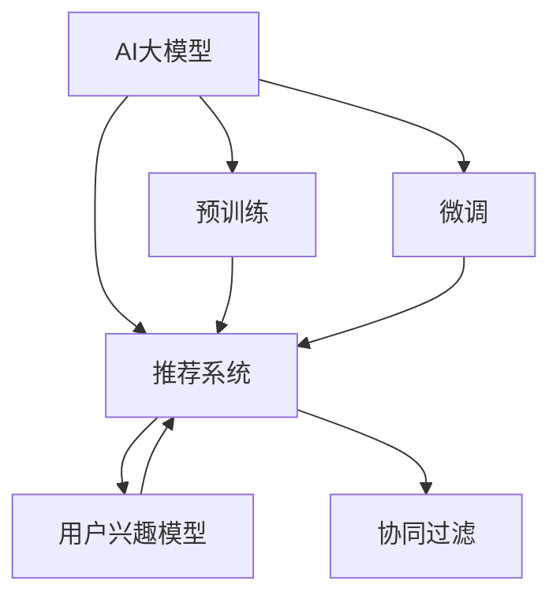

                 

# 电商平台如何利用AI大模型提高搜索结果的多样性

> 关键词：AI大模型,电商搜索结果,多样性,推荐系统,用户需求

## 1. 背景介绍

### 1.1 问题由来

电商平台的发展离不开强大的推荐系统支持，然而在推荐系统中，用户体验和算法效率始终是两大核心诉求。传统推荐系统以协同过滤为基础，通过用户历史行为数据来预测用户兴趣，推动个性化推荐。这种推荐方式虽能精确推荐用户感兴趣的商品，但同时也可能导致“信息茧房”问题，限制用户对其他商品的多样性探索，影响购物体验和商家曝光。

近年来，随着AI技术的发展，基于深度学习的推荐系统逐渐成为主流。其核心思想是通过深度神经网络，从海量数据中提取用户行为模式，并通过多轮迭代不断优化预测模型。这类推荐系统在个性化推荐上取得显著进展，但同时也带来了新的问题：模型参数量大、计算复杂度高、难以覆盖全品类商品。

因此，电商平台需要在推荐系统中引入新的技术手段，提升搜索结果的多样性，增强用户和商家体验。AI大模型，尤其是基于预训练语言模型的推荐系统，被视为解决这一问题的新范式。

### 1.2 问题核心关键点

大模型推荐系统，通过在大规模无标签文本数据上进行预训练，学习到通用语言知识，再通过微调机制对用户行为数据进行适配，能够更全面地理解用户需求和商品信息。其核心在于：

- 大模型预训练：在电商领域的海量无标签文本数据上进行预训练，学习商品描述、用户评论、商品属性等文本信息。
- 用户行为数据微调：基于用户的浏览、购买历史等行为数据，对预训练模型进行微调，学习用户兴趣和行为模式。
- 推荐多样化：将预训练模型和微调模型结合，生成多样化、全面的商品推荐列表，提升用户满意度和商家曝光率。

这种范式不仅能够避免传统推荐系统可能导致的“信息茧房”问题，还能通过大模型的广泛知识，更好地理解商品的多样性和用户的潜在需求，从而在提升个性化推荐的同时，增加搜索结果的多样性。

### 1.3 问题研究意义

通过AI大模型提升电商搜索结果的多样性，具有重要的研究意义：

1. 提升用户体验：增加用户对不同商品的多样性探索，降低认知偏见，增强购物体验。
2. 增加商家曝光：将用户对非热门商品的需求捕捉到，提升长尾商品曝光率，帮助更多商家获得更多展示机会。
3. 促进商品多样性：增加电商平台商品多样性，吸引更多用户进店，增强用户粘性。
4. 优化算法效率：通过预训练-微调机制，提升推荐模型泛化能力，降低对标注数据的依赖。
5. 加速技术落地：利用大模型推荐系统快速实现电商推荐应用，缩短技术开发周期。

## 2. 核心概念与联系

### 2.1 核心概念概述

为更好地理解大模型在电商平台中的应用，本节将介绍几个密切相关的核心概念：

- AI大模型：以自回归(如GPT)或自编码(如BERT)模型为代表的大规模预训练语言模型。通过在大规模无标签文本数据上进行预训练，学习通用语言表示。
- 预训练：指在大规模无标签文本数据上，通过自监督学习任务训练通用语言模型的过程。常见的预训练任务包括语言建模、掩码语言模型等。
- 微调：指在预训练模型的基础上，使用任务特定的标注数据，通过有监督学习优化模型在该任务上的性能。
- 推荐系统：通过算法推荐用户可能感兴趣的商品，提升电商平台的销售和用户体验。
- 多样性：指搜索结果中商品种类的丰富程度，既包含商品类别上的多样性，也包含同类别商品的不同变体。
- 协同过滤：传统推荐系统通过用户历史行为数据来预测用户兴趣，推动个性化推荐。
- 深度学习推荐系统：基于深度神经网络，从海量数据中提取用户行为模式，通过多轮迭代不断优化预测模型。
- 用户兴趣模型：基于用户历史行为数据，构建用户兴趣表示，用于个性化推荐。

这些核心概念之间的逻辑关系可以通过以下Mermaid流程图来展示：



这个流程图展示了大模型在电商推荐系统中的应用流程：

1. 大模型通过预训练获得基础能力。
2. 微调对用户行为数据进行适配，生成个性化推荐。
3. 推荐系统结合多样性机制，生成多样化推荐列表。
4. 协同过滤为推荐系统提供补充数据来源，提高推荐准确性。
5. 用户兴趣模型用于个性化推荐，增强推荐相关性。

这些概念共同构成了电商推荐系统的大模型应用框架，使得推荐系统能够更好地满足用户需求和商家利益。

## 3. 核心算法原理 & 具体操作步骤

### 3.1 算法原理概述

基于AI大模型的电商推荐系统，本质上是一个多任务学习框架。其核心思想是：将预训练大模型视作一个强大的特征提取器，通过用户行为数据微调，学习用户兴趣和行为模式，再结合多样性机制生成推荐列表。

形式化地，假设电商大模型为 $M_{\theta}$，其中 $\theta$ 为预训练得到的模型参数。给定用户行为数据集 $D=\{(x_i, y_i)\}_{i=1}^N$，其中 $x_i$ 为用户的浏览、购买历史等行为数据，$y_i$ 为推荐列表中的商品 $j$，微调的目标是找到新的模型参数 $\hat{\theta}$，使得：

$$
\hat{\theta}=\mathop{\arg\min}_{\theta} \mathcal{L}(M_{\theta},D)
$$

其中 $\mathcal{L}$ 为用户行为数据 $D$ 上的损失函数，用于衡量模型预测推荐列表与用户真实行为之间的差异。常见的损失函数包括交叉熵损失、均方误差损失等。

通过梯度下降等优化算法，微调过程不断更新模型参数 $\theta$，最小化损失函数 $\mathcal{L}$，使得模型输出逼近用户行为。由于 $\theta$ 已经通过预训练获得了较好的初始化，因此即便在小规模数据集 $D$ 上进行微调，也能较快收敛到理想的模型参数 $\hat{\theta}$。

### 3.2 算法步骤详解

基于AI大模型的电商推荐系统一般包括以下几个关键步骤：

**Step 1: 准备预训练模型和数据集**
- 选择合适的预训练语言模型 $M_{\theta}$ 作为初始化参数，如 BERT、GPT等。
- 准备电商领域的相关文本数据，用于预训练模型的语料库。
- 收集用户行为数据，划分为训练集、验证集和测试集。

**Step 2: 构建推荐模型**
- 设计推荐模型结构，一般包括用户兴趣模型、商品特征向量、推荐列表生成器等。
- 在电商领域进行预训练，学习商品描述、用户评论、商品属性等文本信息。
- 基于用户行为数据，对预训练模型进行微调，学习用户兴趣和行为模式。

**Step 3: 设置微调超参数**
- 选择合适的优化算法及其参数，如 AdamW、SGD 等，设置学习率、批大小、迭代轮数等。
- 设置正则化技术及强度，包括权重衰减、Dropout、Early Stopping 等。
- 确定冻结预训练参数的策略，如仅微调顶层，或全部参数都参与微调。

**Step 4: 执行梯度训练**
- 将用户行为数据分批次输入模型，前向传播计算损失函数。
- 反向传播计算参数梯度，根据设定的优化算法和学习率更新模型参数。
- 周期性在验证集上评估模型性能，根据性能指标决定是否触发 Early Stopping。
- 重复上述步骤直到满足预设的迭代轮数或 Early Stopping 条件。

**Step 5: 生成推荐列表**
- 将微调后的模型应用于用户行为数据，生成推荐列表。
- 引入多样性机制，生成多样化、全面的推荐列表。
- 结合用户兴趣模型和协同过滤机制，优化推荐列表的相关性和多样性。

以上是基于AI大模型的电商推荐系统的一般流程。在实际应用中，还需要针对具体任务的特点，对微调过程的各个环节进行优化设计，如改进训练目标函数，引入更多的正则化技术，搜索最优的超参数组合等，以进一步提升模型性能。

### 3.3 算法优缺点

基于AI大模型的电商推荐系统具有以下优点：

- 全面理解商品和用户：大模型通过预训练学习到电商领域的广泛知识，能够更好地理解商品描述和用户行为。
- 泛化能力强：大模型在预训练过程中学习到语言的一般规律，能够泛化到特定领域，提升推荐相关性。
- 适应性强：微调过程可以动态适应用户行为数据的变化，提升推荐模型性能。
- 多样化推荐：结合多样性机制，能够生成多样化、全面的推荐列表，满足不同用户的需求。

同时，该方法也存在一定的局限性：

- 数据依赖性强：预训练模型的效果很大程度上取决于电商领域的数据质量和数量，获取高质量电商数据成本较高。
- 计算资源需求大：预训练模型和微调模型参数量大，计算复杂度高，需要高性能计算资源支持。
- 可解释性不足：大模型推荐系统难以解释其内部工作机制和决策逻辑，可能存在"黑盒"问题。
- 公平性问题：大模型推荐系统可能存在算法偏见，某些商品类别或用户群体可能被低估或忽视。

尽管存在这些局限性，但就目前而言，基于大模型的推荐系统仍然是最主流的方式。未来相关研究的重点在于如何进一步降低对电商数据的依赖，提高模型的少样本学习和跨领域迁移能力，同时兼顾可解释性和公平性等因素。

### 3.4 算法应用领域

基于AI大模型的推荐系统在电商领域已经得到了广泛的应用，覆盖了几乎所有常见的推荐场景，例如：

- 商品推荐：基于用户浏览、购买历史等行为数据，生成个性化商品推荐列表。
- 广告推荐：根据用户的搜索记录和浏览行为，推荐相关广告。
- 新商品推荐：对新商品进行冷启动推荐，挖掘用户潜在的兴趣点。
- 热门商品推荐：基于热门标签，推荐流行商品。
- 价格弹性推荐：根据用户的价格敏感度，推荐性价比高的商品。

除了上述这些经典场景外，大模型推荐系统还被创新性地应用到更多场景中，如商品搭配推荐、购物车推荐、社交电商推荐等，为电商平台带来了全新的突破。随着预训练模型和推荐方法的不断进步，相信电商平台推荐系统必将在更广阔的应用领域大放异彩。

## 4. 数学模型和公式 & 详细讲解  
### 4.1 数学模型构建

本节将使用数学语言对基于AI大模型的电商推荐过程进行更加严格的刻画。

记电商大模型为 $M_{\theta}$，其中 $\theta$ 为模型参数。假设推荐任务的数据集为 $D=\{(x_i,y_i)\}_{i=1}^N$，其中 $x_i$ 为用户的浏览、购买历史等行为数据，$y_i$ 为推荐列表中的商品 $j$。

定义模型 $M_{\theta}$ 在数据样本 $(x,y)$ 上的损失函数为 $\ell(M_{\theta}(x),y)$，则在数据集 $D$ 上的经验风险为：

$$
\mathcal{L}(\theta) = \frac{1}{N}\sum_{i=1}^N \ell(M_{\theta}(x_i),y_i)
$$

微调的优化目标是最小化经验风险，即找到最优参数：

$$
\theta^* = \mathop{\arg\min}_{\theta} \mathcal{L}(\theta)
$$

在实践中，我们通常使用基于梯度的优化算法（如SGD、Adam等）来近似求解上述最优化问题。设 $\eta$ 为学习率，$\lambda$ 为正则化系数，则参数的更新公式为：

$$
\theta \leftarrow \theta - \eta \nabla_{\theta}\mathcal{L}(\theta) - \eta\lambda\theta
$$

其中 $\nabla_{\theta}\mathcal{L}(\theta)$ 为损失函数对参数 $\theta$ 的梯度，可通过反向传播算法高效计算。

### 4.2 公式推导过程

以下我们以商品推荐任务为例，推导交叉熵损失函数及其梯度的计算公式。

假设模型 $M_{\theta}$ 在输入 $x$ 上的输出为 $\hat{y}=M_{\theta}(x)$，表示商品 $j$ 被推荐给用户 $i$ 的概率。真实标签 $y \in \{1,0\}$，表示用户 $i$ 是否购买了商品 $j$。则二分类交叉熵损失函数定义为：

$$
\ell(M_{\theta}(x),y) = -y\log \hat{y} + (1-y)\log (1-\hat{y})
$$

将其代入经验风险公式，得：

$$
\mathcal{L}(\theta) = -\frac{1}{N}\sum_{i=1}^N [y_i\log M_{\theta}(x_i)+(1-y_i)\log(1-M_{\theta}(x_i))]
$$

根据链式法则，损失函数对参数 $\theta_k$ 的梯度为：

$$
\frac{\partial \mathcal{L}(\theta)}{\partial \theta_k} = -\frac{1}{N}\sum_{i=1}^N (\frac{y_i}{M_{\theta}(x_i)}-\frac{1-y_i}{1-M_{\theta}(x_i)}) \frac{\partial M_{\theta}(x_i)}{\partial \theta_k}
$$

其中 $\frac{\partial M_{\theta}(x_i)}{\partial \theta_k}$ 可进一步递归展开，利用自动微分技术完成计算。

在得到损失函数的梯度后，即可带入参数更新公式，完成模型的迭代优化。重复上述过程直至收敛，最终得到适应电商推荐任务的最优模型参数 $\theta^*$。

## 5. 项目实践：代码实例和详细解释说明
### 5.1 开发环境搭建

在进行电商推荐系统开发前，我们需要准备好开发环境。以下是使用Python进行TensorFlow开发的环境配置流程：

1. 安装Anaconda：从官网下载并安装Anaconda，用于创建独立的Python环境。

2. 创建并激活虚拟环境：
```bash
conda create -n tensorflow-env python=3.8 
conda activate tensorflow-env
```

3. 安装TensorFlow：根据CUDA版本，从官网获取对应的安装命令。例如：
```bash
pip install tensorflow==2.9.0
```

4. 安装TensorFlow Addons：
```bash
pip install tensorflow-addons
```

5. 安装TensorBoard：
```bash
pip install tensorboard
```

6. 安装各类工具包：
```bash
pip install numpy pandas scikit-learn matplotlib tqdm jupyter notebook ipython
```

完成上述步骤后，即可在`tensorflow-env`环境中开始电商推荐系统开发。

### 5.2 源代码详细实现

下面以基于大模型的电商推荐系统为例，给出使用TensorFlow构建和训练推荐模型的PyTorch代码实现。

首先，定义推荐模型的结构：

```python
import tensorflow as tf
from tensorflow.keras import layers

class Recommender(tf.keras.Model):
    def __init__(self, vocab_size, embedding_dim, hidden_units, num_classes):
        super(Recommender, self).__init__()
        self.encoder = layers.Embedding(vocab_size, embedding_dim)
        self.encoder2 = layers.Dense(hidden_units, activation='relu')
        self.decoder = layers.Dense(num_classes, activation='softmax')

    def call(self, x):
        x = self.encoder(x)
        x = self.encoder2(x)
        x = self.decoder(x)
        return x
```

然后，定义预训练和微调的流程：

```python
def pretrain(data, model, epochs, batch_size):
    # 预训练大模型
    model.compile(optimizer=tf.keras.optimizers.Adam(learning_rate=2e-5),
                  loss=tf.keras.losses.CategoricalCrossentropy(from_logits=True))
    model.fit(data, epochs=epochs, batch_size=batch_size)

def fine_tune(data, model, epochs, batch_size):
    # 微调大模型
    model.compile(optimizer=tf.keras.optimizers.Adam(learning_rate=2e-5),
                  loss=tf.keras.losses.CategoricalCrossentropy(from_logits=True))
    model.fit(data, epochs=epochs, batch_size=batch_size)
```

接着，定义用户行为数据和推荐列表的预处理：

```python
# 用户行为数据
def prepare_user_data():
    # 加载用户浏览、购买历史等行为数据
    # 数据预处理
    # 返回处理后的数据

# 推荐列表
def generate_recommendations(model, user_data):
    # 将用户数据输入模型，生成推荐列表
    # 返回推荐列表
```

最后，启动预训练和微调流程，并生成推荐列表：

```python
vocab_size = 10000
embedding_dim = 128
hidden_units = 64
num_classes = 1000

# 初始化模型
model = Recommender(vocab_size, embedding_dim, hidden_units, num_classes)

# 加载预训练数据
train_data = prepare_user_data()

# 预训练模型
pretrain(train_data, model, 10, 64)

# 加载微调数据
train_data = prepare_user_data()

# 微调模型
fine_tune(train_data, model, 5, 64)

# 生成推荐列表
recommendations = generate_recommendations(model, user_data)
```

以上就是使用TensorFlow对基于大模型的电商推荐系统进行完整代码实现。可以看到，得益于TensorFlow和TensorFlow Addons的强大封装，我们能够快速搭建和训练电商推荐模型。

### 5.3 代码解读与分析

让我们再详细解读一下关键代码的实现细节：

**Recommender类**：
- `__init__`方法：初始化模型结构，包括嵌入层、隐藏层和输出层。
- `call`方法：定义模型前向传播过程，输入用户行为数据，输出推荐列表。

**预训练和微调函数**：
- `pretrain`函数：进行预训练，利用无标签文本数据训练模型，获取通用商品知识。
- `fine_tune`函数：进行微调，利用标注数据训练模型，学习用户行为模式。

**用户行为数据和推荐列表预处理函数**：
- `prepare_user_data`函数：准备用户行为数据，包括加载数据和数据预处理。
- `generate_recommendations`函数：将用户数据输入模型，生成推荐列表，并进行后处理。

**训练流程**：
- 定义预训练和微调的超参数，如学习率、批大小、迭代轮数等。
- 在预训练阶段，将无标签数据加载到模型上进行训练。
- 在微调阶段，将标注数据加载到模型上进行训练。
- 利用`generate_recommendations`函数，将微调后的模型应用于用户数据，生成推荐列表。

可以看到，TensorFlow和TensorFlow Addons使得构建和训练电商推荐模型变得相对简单高效。开发者可以将更多精力放在数据处理、模型改进等高层逻辑上，而不必过多关注底层的实现细节。

当然，工业级的系统实现还需考虑更多因素，如模型的保存和部署、超参数的自动搜索、更灵活的推荐策略等。但核心的推荐过程基本与此类似。

## 6. 实际应用场景
### 6.1 智能客服系统

基于大模型的电商推荐系统，可以广泛应用于智能客服系统的构建。传统客服往往需要配备大量人力，高峰期响应缓慢，且一致性和专业性难以保证。而使用推荐系统生成的智能客服，可以7x24小时不间断服务，快速响应客户咨询，用推荐商品解答各类常见问题。

在技术实现上，可以收集用户的历史行为数据，将用户的浏览、购买历史等行为数据作为推荐输入，生成个性化推荐。将推荐结果应用于智能客服系统，能够提供更快速、准确的服务，提升客户满意度。

### 6.2 个性化推荐系统

现有的推荐系统主要聚焦于商品推荐，而大模型推荐系统可以进一步拓展到个性化推荐场景。在电商领域，用户不仅需要商品推荐，还需要个性化服务，如个性化活动推荐、个性化商品推荐等。

在实践中，可以收集用户的行为数据，包括浏览记录、评论记录、搜索记录等，构建用户兴趣模型。在此基础上，对大模型进行微调，生成个性化推荐列表，进一步提升用户购物体验。

### 6.3 实时竞价系统

电商平台的广告推荐系统，往往需要在短时间内生成准确的广告推荐。大模型推荐系统通过预训练和微调，能够快速响应广告需求，提供精准的推荐服务。

在实时竞价系统中，广告主可以根据大模型的推荐结果，动态调整出价策略，提升广告投放的效率和效果。广告系统通过大模型推荐系统，能够实现更灵活、高效的广告投放，降低广告主的投放成本，提升广告效果。

### 6.4 未来应用展望

随着大模型推荐系统的发展，其在电商平台中的应用将更加广泛和深入，为电商推荐系统带来新的突破：

1. 商品多样性推荐：大模型推荐系统能够更好地理解商品描述，生成多样化、全面的商品推荐列表，满足不同用户的需求。
2. 个性化活动推荐：结合用户行为数据，生成个性化活动推荐，提升用户参与度和商家曝光。
3. 新商品推荐：对新商品进行冷启动推荐，挖掘用户潜在的兴趣点，增强商家对新商品的曝光。
4. 价格弹性推荐：根据用户的价格敏感度，推荐性价比高的商品，提升用户购买意愿。
5. 实时动态推荐：利用大模型的计算能力，实现实时动态推荐，提升推荐效率和效果。

此外，在社交电商、O2O电商等更多场景中，大模型推荐系统也将不断涌现，为电商平台带来新的业务增长点。相信随着预训练模型和推荐方法的不断进步，大模型推荐系统必将在电商领域大放异彩，成为电商平台推荐系统的核心驱动力。

## 7. 工具和资源推荐
### 7.1 学习资源推荐

为了帮助开发者系统掌握大模型推荐系统的理论基础和实践技巧，这里推荐一些优质的学习资源：

1. 《深度学习推荐系统》书籍：由深度学习推荐系统领域的专家撰写，全面介绍了推荐系统的基本概念和经典算法。
2. 《TensorFlow官方文档》：TensorFlow的官方文档，详细介绍了TensorFlow的基本使用和高级特性，是学习TensorFlow的必备资料。
3. 《TensorFlow Addons官方文档》：TensorFlow Addons的官方文档，提供了丰富的第三方组件和扩展功能，扩展了TensorFlow的功能范围。
4. 《HuggingFace官方文档》：HuggingFace的官方文档，提供了海量预训练语言模型和微调范式，是进行大模型推荐系统开发的利器。
5. Kaggle竞赛平台：通过参加Kaggle推荐系统竞赛，可以学习和实践最新的推荐算法和技术，提升推荐系统开发能力。

通过对这些资源的学习实践，相信你一定能够快速掌握大模型推荐系统的精髓，并用于解决实际的电商推荐问题。

### 7.2 开发工具推荐

高效的开发离不开优秀的工具支持。以下是几款用于大模型推荐系统开发的常用工具：

1. TensorFlow：基于Python的开源深度学习框架，灵活动态的计算图，适合快速迭代研究。TensorFlow提供了丰富的深度学习组件，适合构建推荐系统。
2. PyTorch：基于Python的开源深度学习框架，灵活动态的计算图，适合快速迭代研究。PyTorch在大模型推荐系统中的使用相对较少，但仍然是一个重要的选择。
3. TensorFlow Addons：TensorFlow的扩展库，提供了丰富的第三方组件和功能，扩展了TensorFlow的功能范围。
4. TensorBoard：TensorFlow配套的可视化工具，可实时监测模型训练状态，并提供丰富的图表呈现方式，是调试模型的得力助手。
5. Weights & Biases：模型训练的实验跟踪工具，可以记录和可视化模型训练过程中的各项指标，方便对比和调优。
6. Keras：基于Python的高级深度学习框架，适合快速搭建深度学习模型。Keras在大模型推荐系统中的应用较少，但仍然是初学者友好的选择。

合理利用这些工具，可以显著提升大模型推荐系统的开发效率，加快创新迭代的步伐。

### 7.3 相关论文推荐

大模型推荐系统的发展源于学界的持续研究。以下是几篇奠基性的相关论文，推荐阅读：

1. Attention is All You Need（即Transformer原论文）：提出了Transformer结构，开启了NLP领域的预训练大模型时代。
2. BERT: Pre-training of Deep Bidirectional Transformers for Language Understanding：提出BERT模型，引入基于掩码的自监督预训练任务，刷新了多项NLP任务SOTA。
3. Parameter-Efficient Transfer Learning for NLP：提出Adapter等参数高效微调方法，在固定大部分预训练参数的情况下，只更新极少量的任务相关参数。
4. Learning to Recommend at Scale：提出基于协同过滤的推荐系统，通过用户历史行为数据进行推荐。
5. A Multi-Task Learning Approach to Recommender Systems：提出多任务学习框架，提升推荐系统的泛化能力和效果。
6. Deep Graph Infomax: Learning Latent Feature Representation on Knowledge Graphs：提出基于知识图谱的推荐系统，利用图神经网络模型进行推荐。

这些论文代表了大模型推荐系统的发展脉络。通过学习这些前沿成果，可以帮助研究者把握学科前进方向，激发更多的创新灵感。

## 8. 总结：未来发展趋势与挑战

### 8.1 总结

本文对基于AI大模型的电商推荐系统进行了全面系统的介绍。首先阐述了电商推荐系统的问题由来和核心关键点，明确了大模型推荐系统在提升搜索结果多样性方面的独特价值。其次，从原理到实践，详细讲解了大模型推荐系统的数学原理和关键步骤，给出了推荐系统开发的完整代码实例。同时，本文还广泛探讨了推荐系统在智能客服、个性化推荐、实时竞价等多个电商推荐场景中的应用前景，展示了大模型推荐系统的巨大潜力。此外，本文精选了推荐系统的各类学习资源，力求为开发者提供全方位的技术指引。

通过本文的系统梳理，可以看到，基于AI大模型的电商推荐系统正在成为电商推荐系统的重要范式，极大地拓展了推荐算法的应用边界，催生了更多的落地场景。受益于大规模语料的预训练，推荐系统能够更好地理解电商领域的商品和用户，生成更加多样化、全面的推荐列表，提升用户满意度和商家曝光率。未来，伴随预训练语言模型和推荐方法的不断进步，相信电商推荐系统必将在更广阔的应用领域大放异彩，深刻影响电商行业的发展。

### 8.2 未来发展趋势

展望未来，大模型推荐系统将呈现以下几个发展趋势：

1. 模型规模持续增大。随着算力成本的下降和数据规模的扩张，预训练语言模型的参数量还将持续增长。超大规模语言模型蕴含的丰富语言知识，有望支撑更加复杂多变的推荐场景。
2. 推荐多样化增强。结合多样性机制，生成多样化、全面的推荐列表，满足不同用户的需求。
3. 实时动态推荐：利用大模型的计算能力，实现实时动态推荐，提升推荐效率和效果。
4. 知识图谱整合：结合知识图谱和语义理解，提升推荐的相关性和泛化能力。
5. 多模态推荐：将文本、图像、视频等多模态信息进行融合，提升推荐系统的效果。
6. 用户意图模型：结合用户行为数据和意图表示，生成更加精准的推荐列表。

以上趋势凸显了大模型推荐系统的广阔前景。这些方向的探索发展，必将进一步提升电商推荐系统的性能和应用范围，为电商推荐系统带来新的突破。

### 8.3 面临的挑战

尽管大模型推荐系统已经取得了瞩目成就，但在迈向更加智能化、普适化应用的过程中，它仍面临着诸多挑战：

1. 数据依赖性强：预训练模型的效果很大程度上取决于电商领域的数据质量和数量，获取高质量电商数据成本较高。
2. 计算资源需求大：预训练模型和微调模型参数量大，计算复杂度高，需要高性能计算资源支持。
3. 可解释性不足：大模型推荐系统难以解释其内部工作机制和决策逻辑，可能存在"黑盒"问题。
4. 公平性问题：大模型推荐系统可能存在算法偏见，某些商品类别或用户群体可能被低估或忽视。
5. 系统复杂度高：大模型推荐系统的模型结构复杂，调试和维护难度大。

尽管存在这些挑战，但就目前而言，基于大模型的推荐系统仍然是最主流的方式。未来相关研究的重点在于如何进一步降低对电商数据的依赖，提高模型的少样本学习和跨领域迁移能力，同时兼顾可解释性和公平性等因素。

### 8.4 研究展望

面对大模型推荐系统所面临的种种挑战，未来的研究需要在以下几个方面寻求新的突破：

1. 探索无监督和半监督推荐方法。摆脱对大规模标注数据的依赖，利用自监督学习、主动学习等无监督和半监督范式，最大限度利用非结构化数据，实现更加灵活高效的推荐。
2. 研究参数高效和计算高效的推荐范式。开发更加参数高效的推荐方法，在固定大部分预训练参数的情况下，只更新极少量的任务相关参数。同时优化推荐模型的计算图，减少前向传播和反向传播的资源消耗，实现更加轻量级、实时性的部署。
3. 融合因果和对比学习范式。通过引入因果推断和对比学习思想，增强推荐系统建立稳定因果关系的能力，学习更加普适、鲁棒的商品特征。
4. 引入更多先验知识。将符号化的先验知识，如知识图谱、逻辑规则等，与神经网络模型进行巧妙融合，引导推荐过程学习更准确、合理的商品特征。
5. 结合因果分析和博弈论工具。将因果分析方法引入推荐系统，识别出推荐关键特征，增强推荐系统输出解释的因果性和逻辑性。借助博弈论工具刻画人机交互过程，主动探索并规避推荐系统的脆弱点，提高系统稳定性。

这些研究方向的探索，必将引领大模型推荐系统迈向更高的台阶，为构建智能化的电商推荐系统铺平道路。面向未来，大模型推荐系统还需要与其他人工智能技术进行更深入的融合，如知识表示、因果推理、强化学习等，多路径协同发力，共同推动电商推荐系统的进步。只有勇于创新、敢于突破，才能不断拓展推荐算法的边界，让推荐系统更好地满足用户需求和商家利益。

## 9. 附录：常见问题与解答

**Q1：大模型推荐系统是否适用于所有电商场景？**

A: 大模型推荐系统在大多数电商场景上都能取得不错的效果，特别是对于数据量较小的场景。但对于一些特定领域的电商场景，如垂直电商、B2B电商等，可能需要更专业的领域知识进行微调。此外，对于实时性要求极高的场景，如实时竞价系统，也可能存在一定的延迟问题。

**Q2：大模型推荐系统如何应对推荐冷启动问题？**

A: 大模型推荐系统可以利用预训练大模型的广泛知识，对新商品进行冷启动推荐，挖掘用户潜在的兴趣点。具体方法包括：
1. 利用商品属性、描述等文本信息进行预训练，学习商品特征。
2. 结合用户行为数据进行微调，学习用户对新商品的反应。
3. 引入知识图谱和语义理解，提升推荐的相关性和泛化能力。

**Q3：大模型推荐系统如何提高推荐多样性？**

A: 大模型推荐系统可以通过以下方法提高推荐多样性：
1. 结合多样性机制，生成多样化、全面的推荐列表。
2. 引入多任务学习框架，同时优化多个推荐目标。
3. 利用协同过滤，补充推荐数据来源，提高推荐多样性。
4. 结合用户行为数据，动态调整推荐策略。

**Q4：大模型推荐系统如何避免推荐系统"信息茧房"问题？**

A: 大模型推荐系统可以通过以下方法避免推荐系统"信息茧房"问题：
1. 结合多样性机制，生成多样化、全面的推荐列表。
2. 利用协同过滤，补充推荐数据来源，提高推荐多样性。
3. 引入多任务学习框架，同时优化多个推荐目标。
4. 结合用户行为数据，动态调整推荐策略。

**Q5：大模型推荐系统如何提高推荐相关性？**

A: 大模型推荐系统可以通过以下方法提高推荐相关性：
1. 结合多样性机制，生成多样化、全面的推荐列表。
2. 利用协同过滤，补充推荐数据来源，提高推荐多样性。
3. 引入多任务学习框架，同时优化多个推荐目标。
4. 结合用户行为数据，动态调整推荐策略。

这些方法可以结合使用，综合提升推荐系统的效果和多样性。通过不断优化推荐模型和策略，相信大模型推荐系统能够更好地满足用户需求和商家利益，成为电商推荐系统的重要驱动力。

---

作者：禅与计算机程序设计艺术 / Zen and the Art of Computer Programming

