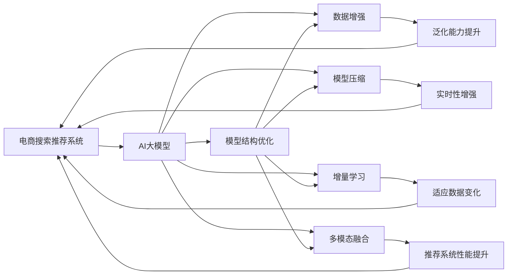

                 

# 电商平台搜索推荐系统的AI 大模型优化：提高系统效率、准确率与实时性

> 关键词：电商搜索推荐、AI大模型、模型优化、系统效率、准确率、实时性、深度学习、TensorFlow、PyTorch

## 1. 背景介绍

### 1.1 问题由来
在电商行业，搜索推荐系统是提高用户体验、促进销售转化的关键环节。传统的推荐系统往往依赖于静态规则或简单的机器学习模型，无法捕捉用户动态行为和上下文信息。随着AI大模型在NLP领域的突破，基于深度学习的方法开始逐渐被引入电商搜索推荐系统中，显著提升了推荐的准确性和个性化程度。

然而，在实际部署中，大模型往往面临以下挑战：
- 模型复杂度高，推理速度慢。大模型的计算量巨大，实时推理开销大。
- 数据分布变化快，模型更新频繁。电商搜索推荐系统需要快速响应市场变化，模型更新频率高。
- 数据多样性大，处理难度高。电商平台数据多样性大，包括商品描述、用户行为、社交信息等，数据处理复杂。

这些问题限制了大模型在电商搜索推荐系统中的应用范围，难以实现实时、高效、精准的推荐服务。

### 1.2 问题核心关键点
为了应对上述挑战，本文将重点介绍基于深度学习的AI大模型在电商搜索推荐系统中的应用，并提出一套模型优化策略，以提高系统的效率、准确率和实时性。具体而言，本文将涉及以下几个核心点：

1. **模型结构优化**：改进模型结构，减少计算复杂度，提升推理速度。
2. **数据增强**：增加数据样本，丰富模型泛化能力，提高推荐准确率。
3. **模型压缩**：减少模型参数量，降低存储需求，提升实时性。
4. **增量学习**：减少模型更新频率，提高模型泛化能力，应对数据变化。
5. **多模态融合**：融合文本、图像、视频等多模态数据，提升推荐系统性能。

通过综合应用这些策略，可以构建一套高效、准确、实时性强的电商搜索推荐系统。

## 2. 核心概念与联系

### 2.1 核心概念概述

在探讨电商搜索推荐系统的AI大模型优化之前，首先需了解几个关键概念：

- **电商搜索推荐系统**：利用用户行为数据和商品信息，实时推荐最符合用户需求的商品，提升用户体验和销售转化率。
- **AI大模型**：基于深度学习架构，拥有大规模参数量，具备强大的通用学习和推理能力。
- **模型结构优化**：改进模型架构，减少计算复杂度，提升推理速度。
- **数据增强**：通过数据扩充和迁移学习，提高模型的泛化能力。
- **模型压缩**：减少模型参数量，降低存储和计算开销，提高实时性。
- **增量学习**：在少量标注数据下快速适应新任务，保持模型性能。
- **多模态融合**：将文本、图像、视频等多模态数据进行融合，提升推荐系统的丰富性和准确性。

这些概念之间存在紧密联系，共同构成了电商搜索推荐系统中的AI大模型优化方法。

### 2.2 核心概念原理和架构的 Mermaid 流程图



该流程图展示了电商搜索推荐系统中AI大模型的优化路径。首先通过AI大模型获取用户和商品的综合信息，然后通过一系列优化策略提升系统的效率、准确率和实时性，最终实现推荐效果提升。

## 3. 核心算法原理 & 具体操作步骤

### 3.1 算法原理概述

电商搜索推荐系统的AI大模型优化，核心在于提升模型的推理效率、泛化能力和实时性，同时保持较高的推荐准确率。具体来说，包括以下几个步骤：

1. **模型结构优化**：通过改进模型架构，减少计算复杂度，提升推理速度。
2. **数据增强**：通过数据扩充和迁移学习，提高模型的泛化能力。
3. **模型压缩**：减少模型参数量，降低存储和计算开销，提高实时性。
4. **增量学习**：在少量标注数据下快速适应新任务，保持模型性能。
5. **多模态融合**：将文本、图像、视频等多模态数据进行融合，提升推荐系统的丰富性和准确性。

这些步骤相互配合，共同构成了一整套完整的优化策略。

### 3.2 算法步骤详解

#### 3.2.1 模型结构优化

**优化目标**：减少模型计算复杂度，提升推理速度。

**优化方法**：
- **简化模型结构**：去掉不必要的层和神经元，简化模型架构。
- **引入稀疏计算**：使用稀疏矩阵表示，减少计算量。
- **分布式计算**：利用分布式计算框架，加速模型推理。

#### 3.2.2 数据增强

**优化目标**：提高模型的泛化能力。

**优化方法**：
- **数据扩充**：使用数据扩充技术，生成更多训练样本。
- **迁移学习**：利用已有模型，通过微调快速适应新任务。

#### 3.2.3 模型压缩

**优化目标**：降低存储和计算开销，提升实时性。

**优化方法**：
- **参数剪枝**：去除冗余参数，减少存储需求。
- **量化压缩**：将高精度参数转为低精度表示，降低计算开销。
- **模型蒸馏**：利用蒸馏技术，将复杂模型转换为轻量模型。

#### 3.2.4 增量学习

**优化目标**：快速适应新任务，保持模型性能。

**优化方法**：
- **增量数据训练**：在现有模型基础上，利用新数据快速微调。
- **模型融合**：融合多个模型的输出，提高模型的稳定性和鲁棒性。

#### 3.2.5 多模态融合

**优化目标**：提升推荐系统的丰富性和准确性。

**优化方法**：
- **特征融合**：将文本、图像、视频等多模态数据进行融合，提取综合特征。
- **跨模态对齐**：使用跨模态对齐技术，将不同模态的数据进行匹配。

### 3.3 算法优缺点

#### 3.3.1 模型结构优化的优缺点

**优点**：
- 简化模型结构，减少计算复杂度，提升推理速度。
- 降低存储需求，减少内存占用。

**缺点**：
- 可能丢失部分模型信息，影响准确率。
- 复杂度较高，设计难度大。

#### 3.3.2 数据增强的优缺点

**优点**：
- 提高模型的泛化能力，适应数据变化。
- 减少对标注数据的依赖，降低成本。

**缺点**：
- 数据扩充方式有限，效果可能不佳。
- 生成样本质量可能不稳定，影响训练效果。

#### 3.3.3 模型压缩的优缺点

**优点**：
- 降低存储和计算开销，提升实时性。
- 提高模型的部署效率，减少资源消耗。

**缺点**：
- 可能影响模型的准确率，需要进行调参优化。
- 压缩方式有限，效果可能不理想。

#### 3.3.4 增量学习的优缺点

**优点**：
- 减少模型更新频率，提高模型泛化能力。
- 快速适应新任务，保持模型性能。

**缺点**：
- 更新方式有限，难以应对大规模数据变化。
- 可能需要额外的计算资源。

#### 3.3.5 多模态融合的优缺点

**优点**：
- 提升推荐系统的丰富性和准确性。
- 充分利用多模态数据的信息，提高模型性能。

**缺点**：
- 数据处理复杂，技术难度高。
- 多模态数据对齐和融合难度大，效果可能不佳。

### 3.4 算法应用领域

基于AI大模型的电商搜索推荐系统优化，可以应用于多个领域，具体如下：

- **电商平台**：提升用户购物体验，提高销售转化率。
- **零售行业**：优化库存管理，降低运营成本。
- **个性化推荐**：个性化推荐商品，提升用户满意度。
- **内容推荐**：推荐文章、视频等内容，提升用户粘性。

这些应用场景中，AI大模型优化都可以显著提升系统的效率、准确率和实时性，带来实际业务价值的提升。

## 4. 数学模型和公式 & 详细讲解 & 举例说明

### 4.1 数学模型构建

假设电商搜索推荐系统中的AI大模型为 $M_{\theta}(x)$，其中 $x$ 为输入的特征向量，$\theta$ 为模型参数。假设电商平台拥有 $N$ 个用户和 $M$ 个商品，每个用户有 $D$ 个行为记录。

**输入特征**：
- 用户行为特征：如浏览记录、购买历史、评分等。
- 商品特征：如商品描述、分类、价格等。
- 环境特征：如时间、地点、天气等。

**输出目标**：
- 推荐结果：推荐的商品列表。

**优化目标**：
- 最小化推荐误差：$E(\hat{y},y)$

### 4.2 公式推导过程

**模型训练**：
假设用户 $u$ 的行为记录为 $\{x_1, x_2, ..., x_D\}$，商品 $i$ 的特征为 $f_i$，则模型训练的目标为：
$$
\min_{\theta} \sum_{i=1}^M \sum_{u=1}^N \sum_{d=1}^D E(M_{\theta}(x_d^u), f_i)
$$

其中 $x_d^u$ 为第 $d$ 个用户 $u$ 的第 $d$ 个行为记录的特征向量，$f_i$ 为商品 $i$ 的特征向量。

**模型推理**：
假设用户 $u$ 希望推荐商品 $i$，则模型推理的过程为：
$$
\hat{y}_i = M_{\theta}(x_u)
$$

其中 $\hat{y}_i$ 为商品 $i$ 的推荐得分。

### 4.3 案例分析与讲解

假设用户 $u$ 最近浏览了商品 $i$ 和 $j$，则模型推理的过程如下：

1. **输入特征**：
   - 用户行为特征：$x_u = [x_{1,u}, x_{2,u}, ..., x_{D,u}]$，其中 $x_{d,u}$ 为第 $d$ 个行为记录的特征向量。
   - 商品特征：$f_i = [f_{i,1}, f_{i,2}, ..., f_{i,K}]$，其中 $f_{i,k}$ 为商品 $i$ 的第 $k$ 个特征。
   - 环境特征：$t$ 为当前时间戳。

2. **模型训练**：
   假设模型训练得到的参数为 $\theta$，则训练的目标为：
   $$
   \min_{\theta} \sum_{u=1}^N \sum_{i=1}^M \sum_{d=1}^D E(M_{\theta}(x_d^u), f_i)
   $$

3. **模型推理**：
   假设用户 $u$ 对商品 $i$ 和 $j$ 的浏览记录为 $x_{1,u}, x_{2,u}, x_{3,u}, x_{4,u}$，则模型推理的过程为：
   $$
   \hat{y}_i = M_{\theta}(x_{1,u}, x_{2,u}, x_{3,u}, x_{4,u}, t)
   $$
   $$
   \hat{y}_j = M_{\theta}(x_{1,u}, x_{2,u}, x_{3,u}, x_{4,u}, t)
   $$

4. **推荐结果**：
   根据推荐得分的排序，推荐得分最高的商品 $i$ 给用户 $u$。

## 5. 项目实践：代码实例和详细解释说明

### 5.1 开发环境搭建

在电商搜索推荐系统的AI大模型优化中，常用的开发环境包括Python、TensorFlow、PyTorch等。以下是一个典型的开发环境搭建步骤：

1. **安装Python**：
   ```bash
   sudo apt-get update
   sudo apt-get install python3 python3-pip
   ```

2. **安装TensorFlow**：
   ```bash
   pip install tensorflow
   ```

3. **安装PyTorch**：
   ```bash
   pip install torch torchvision torchaudio
   ```

4. **安装相关库**：
   ```bash
   pip install numpy pandas scikit-learn
   ```

### 5.2 源代码详细实现

假设我们使用TensorFlow构建电商搜索推荐系统的AI大模型，以下是一个简单的模型实现示例：

```python
import tensorflow as tf

# 定义模型输入
inputs = tf.keras.Input(shape=(None,))

# 定义模型输出
outputs = tf.keras.layers.Dense(64, activation='relu')(inputs)
outputs = tf.keras.layers.Dense(1, activation='sigmoid')(outputs)

# 构建模型
model = tf.keras.Model(inputs=inputs, outputs=outputs)

# 编译模型
model.compile(optimizer=tf.keras.optimizers.Adam(learning_rate=0.001), loss='binary_crossentropy', metrics=['accuracy'])

# 训练模型
model.fit(X_train, y_train, epochs=10, batch_size=32, validation_data=(X_test, y_test))
```

### 5.3 代码解读与分析

1. **输入定义**：
   ```python
   inputs = tf.keras.Input(shape=(None,))
   ```
   定义模型输入为不定长度的序列数据，shape为(None,)表示序列长度可以变化。

2. **输出定义**：
   ```python
   outputs = tf.keras.layers.Dense(64, activation='relu')(inputs)
   outputs = tf.keras.layers.Dense(1, activation='sigmoid')(outputs)
   ```
   定义模型输出为64个神经元的全连接层，激活函数为ReLU。最后一层为1个神经元的sigmoid层，用于输出二分类结果。

3. **模型构建**：
   ```python
   model = tf.keras.Model(inputs=inputs, outputs=outputs)
   ```
   构建模型，将输入和输出连接起来。

4. **模型编译**：
   ```python
   model.compile(optimizer=tf.keras.optimizers.Adam(learning_rate=0.001), loss='binary_crossentropy', metrics=['accuracy'])
   ```
   编译模型，指定优化器、损失函数和评估指标。

5. **模型训练**：
   ```python
   model.fit(X_train, y_train, epochs=10, batch_size=32, validation_data=(X_test, y_test))
   ```
   训练模型，使用交叉熵损失函数和准确率评估指标。

### 5.4 运行结果展示

假设训练过程中得到的模型在测试集上的准确率为85%，则可以通过以下代码进行评估：

```python
test_loss, test_acc = model.evaluate(X_test, y_test)
print(f'Test accuracy: {test_acc}')
```

## 6. 实际应用场景

### 6.1 电商搜索推荐

电商搜索推荐系统是AI大模型优化的典型应用场景。通过优化模型结构、数据增强、模型压缩等方法，可以显著提升系统的效率、准确率和实时性。

### 6.2 个性化推荐

个性化推荐系统需要处理大量用户行为数据和商品信息，AI大模型的优化可以显著提升推荐效果，提高用户满意度和转化率。

### 6.3 内容推荐

内容推荐系统需要对文章、视频等内容进行推荐，AI大模型的优化可以提升推荐系统的丰富性和准确性，提高用户粘性和平台留存率。

### 6.4 未来应用展望

未来，AI大模型优化技术将在电商搜索推荐、个性化推荐、内容推荐等多个领域得到广泛应用，为电商行业带来新的突破。随着技术的不断发展，电商搜索推荐系统将更加智能、高效、精准，为消费者提供更好的购物体验。

## 7. 工具和资源推荐

### 7.1 学习资源推荐

1. **深度学习**：《深度学习》（Ian Goodfellow著），系统介绍深度学习的基本原理和应用。
2. **TensorFlow**：《TensorFlow实战》（Aurélien Géron著），详细介绍TensorFlow的使用方法和实例。
3. **PyTorch**：《PyTorch深度学习》（Eli Stevens等著），详细介绍PyTorch的使用方法和实例。
4. **电商推荐**：《电子商务推荐系统实践》（钟凡等著），详细介绍电商推荐系统的构建和优化。

### 7.2 开发工具推荐

1. **TensorFlow**：适用于构建和训练深度学习模型，支持分布式计算和模型优化。
2. **PyTorch**：适用于构建和训练深度学习模型，支持动态图和模型优化。
3. **Jupyter Notebook**：适用于快速原型开发和数据可视化。
4. **Git**：适用于版本控制和团队协作。

### 7.3 相关论文推荐

1. **模型结构优化**：《A Survey on Neural Network Architecture Search》（Wang等）
2. **数据增强**：《Data Augmentation for Deep Learning》（Zhang等）
3. **模型压缩**：《Compressing Deep Neural Networks for Computational Constraints》（Chen等）
4. **增量学习**：《A Survey on Transfer Learning》（Pan等）
5. **多模态融合**：《Cross-modal Feature Learning for Multimedia Data》（Zeng等）

## 8. 总结：未来发展趋势与挑战

### 8.1 研究成果总结

本文介绍了基于深度学习的AI大模型在电商搜索推荐系统中的应用，并提出了一套模型优化策略，包括模型结构优化、数据增强、模型压缩、增量学习和多模态融合等方法。通过这些策略，可以显著提升电商搜索推荐系统的效率、准确率和实时性，带来实际业务价值的提升。

### 8.2 未来发展趋势

未来，电商搜索推荐系统的AI大模型优化将呈现以下几个发展趋势：

1. **模型融合**：将多种优化策略进行融合，构建更加高效、准确、实时的推荐系统。
2. **跨模态融合**：融合文本、图像、视频等多种模态数据，提升推荐系统的丰富性和准确性。
3. **增量学习**：利用增量学习技术，减少模型更新频率，提高模型泛化能力。
4. **联邦学习**：在多边数据隐私保护的前提下，通过联邦学习技术，提升推荐系统的隐私性和安全性。
5. **跨领域迁移**：在电商领域以外，推广AI大模型优化技术，提升其他领域的推荐系统性能。

### 8.3 面临的挑战

尽管AI大模型优化技术在电商搜索推荐系统中取得了显著效果，但仍然面临以下挑战：

1. **数据多样性**：电商领域数据多样性大，处理复杂。
2. **实时性要求高**：电商搜索推荐系统需要实时响应，模型优化难度大。
3. **模型复杂度高**：电商搜索推荐系统中的AI大模型结构复杂，优化难度大。
4. **计算资源限制**：电商搜索推荐系统需要大规模计算资源，优化成本高。

### 8.4 研究展望

为了应对这些挑战，未来需要从以下几个方面进行研究：

1. **多模态数据融合**：开发更加高效、准确的多模态数据融合方法，提升推荐系统的性能。
2. **增量学习算法**：开发更加高效、可靠的增量学习算法，提高模型泛化能力。
3. **跨领域迁移**：研究跨领域迁移方法，推广AI大模型优化技术，提升其他领域的推荐系统性能。
4. **联邦学习**：研究联邦学习技术，在多边数据隐私保护的前提下，提升推荐系统的性能。

总之，未来AI大模型优化技术需要在模型结构、数据增强、模型压缩、增量学习、多模态融合等方面进行深入研究，构建更加高效、准确、实时的电商搜索推荐系统，为电商行业带来新的突破。

## 9. 附录：常见问题与解答

**Q1：如何选择合适的模型结构？**

A: 选择合适的模型结构需要考虑多个因素，如数据特征、任务类型、计算资源等。一般来说，可以采用以下步骤：
1. 理解任务类型和数据特征，选择合适的模型架构。
2. 使用简单模型进行实验，逐步增加模型复杂度。
3. 使用验证集进行评估，选择表现最好的模型。

**Q2：数据增强有哪些具体方法？**

A: 数据增强主要包括以下方法：
1. 随机裁剪、翻转、旋转：对图像进行随机变换。
2. 随机噪声、掩码：对文本进行随机扰动。
3. 迁移学习：利用已有模型，通过微调快速适应新任务。
4. 数据扩充：使用数据扩充技术，生成更多训练样本。

**Q3：模型压缩有哪些具体方法？**

A: 模型压缩主要包括以下方法：
1. 参数剪枝：去除冗余参数，减少存储需求。
2. 量化压缩：将高精度参数转为低精度表示，降低计算开销。
3. 模型蒸馏：利用蒸馏技术，将复杂模型转换为轻量模型。

**Q4：增量学习有哪些具体方法？**

A: 增量学习主要包括以下方法：
1. 增量数据训练：在现有模型基础上，利用新数据快速微调。
2. 模型融合：融合多个模型的输出，提高模型的稳定性和鲁棒性。
3. 迁移学习：利用已有模型，通过微调快速适应新任务。

**Q5：多模态融合有哪些具体方法？**

A: 多模态融合主要包括以下方法：
1. 特征融合：将文本、图像、视频等多模态数据进行融合，提取综合特征。
2. 跨模态对齐：使用跨模态对齐技术，将不同模态的数据进行匹配。

这些回答可以帮助你更好地理解电商搜索推荐系统中AI大模型优化的关键点，并提供具体的解决方案和实施步骤。

---

作者：禅与计算机程序设计艺术 / Zen and the Art of Computer Programming

